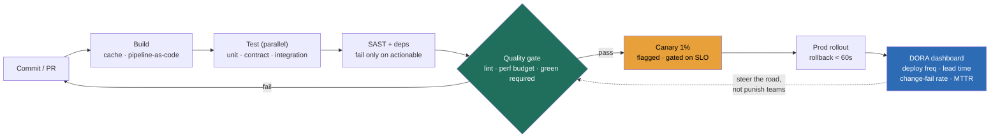

### Learning objectives
- State the **three-part frame**: quality **gates** encode the bar in the paved road, **DORA metrics** measure whether the delivery system is healthy, and the **CI/CD platform** makes the safe path the easy path, and the Director owns this delivery system, not the individual pipelines.
- Choose **gates by ROI**, coverage, lint, SAST/dependency-scan, contract checks, performance budgets, by what each one *catches per minute of pipeline latency it adds*, and recognize the anti-pattern of a gate that taxes velocity without catching anything.
- Read the **DORA four** (deploy frequency, lead time for changes, change-failure rate, time-to-restore) plus a reliability fifth as a **health signal you steer by, not a stick you beat teams with**, and know the elite benchmarks and how they get gamed.
- Treat **coverage as a signal, not a target** (Goodhart's law): a coverage *target* gets met with assertion-free tests that run code and check nothing, so you measure escaped-defect rate as the outcome and coverage only as a leading hint.
- Make the **build-vs-buy** call on the CI/CD platform with a stated prior, and design the org so quality is **everyone's job via a platform team that enables, not a QA team that gates** and becomes the bottleneck every team queues behind.

### Intuition first
A quality gate is a **toll plaza on a highway**, and the design question is the same one any highway authority faces: which lanes get a barrier, and how long is the line. A toll that catches every smuggler but adds twenty minutes to every commuter's drive isn't safety, it's a traffic jam that the whole city routes around. The plazas that actually work are the ones placed where the contraband actually moves, fast for everyone else, and invisible when you've got nothing to hide. Put a barrier on every on-ramp "to be safe" and you haven't made the road safer, you've made it slower, and the first thing a frustrated city does is find the back roads.

That image carries the design consequences. **Every gate has a latency price, and it must catch enough to earn it**, a barrier that stops nobody but slows everybody is pure tax, and a Director who can't name what a gate catches has built a toll for its own sake. **The dashboard of traffic flow is not the same as the barriers**, DORA metrics are the helicopter view of whether cars are moving and crashes are rare, and you read them to *tune the road*, not to fine the drivers, because the moment a metric becomes the drivers' performance review they start gaming it and the helicopter view goes blind. **And the authority that builds the road is not the cop standing in the lane**, a team that hand-inspects every car is a bottleneck the whole city queues behind, while a team that paints the lines and installs the automatic barriers lets a million cars drive themselves safely. Get the placement, the measurement, and the ownership right and the rest is calibration.

### Deep explanation

**The thesis is three layers that reinforce each other: gates encode the bar, DORA measures the system, the platform makes safe easy.** The interview probe is almost never "what's a good coverage number." It is *"design the CI/CD and quality platform for the org"* or *"what metrics tell you the delivery system is healthy."* The answer is a system, not a checklist. **Gates** are the automated checks that block a merge or a promotion: lint, type-check, unit/contract/integration suites, SAST and dependency scanning, performance budgets. They encode *the bar* into the paved road, so the engineer who does nothing special still ships at the standard. **DORA metrics** are the instrumentation: they tell you whether the delivery *system* is fast and stable, independent of any one team's heroics. **The platform** is the road itself: pipeline-as-code, build caching, parallelism, one-button rollback, given to every team from a template so the safe path is also the fastest path. The Director owns all three as a single operating concern, and the IC-altitude answer, *"set coverage to 80% and the QA team signs off,"* fails on two counts: it puts a person in the deploy path (a bottleneck that scales with headcount) and it optimizes a number that doesn't measure what you care about.

**Gates earn their place by ROI: what each one catches, priced against the pipeline latency it adds.** A pipeline is on the critical path of every engineer who merges, so its wall-clock time is a tax paid by the whole org, every PR, every day. The discipline is to put each candidate gate on a **cost-vs-catch** ledger:

- **Lint and type-check** are the cheapest, fastest gates and they catch a real class of bug (null deref, unused imports, format drift) in **seconds**. Highest ROI, run on every change, no debate.
- **Unit and contract tests** run in **seconds to low minutes** and catch logic bugs and cross-service seam breaks. High ROI, required on the merge path, kept fast by parallelism so they don't become the bottleneck.
- **SAST and dependency/license scanning** (Snyk, Semgrep, Dependabot, Trivy) catch known-CVE dependencies and injection-shaped code patterns. The catch is real but the **false-positive rate** is the killer: a scanner that flags 200 criticals, 195 of them noise, gets ignored within a week, so you tune it to fail the build only on *actionable, exploitable* findings and run the full noisy scan asynchronously off the critical path.
- **Performance budgets** (a p99 latency ceiling, a bundle-size cap, a query-cost limit) catch the slow regression that no functional test sees. They earn their place on the paths where latency is a product requirement, and nowhere else, because a perf gate on a back-office admin tool is pure tax.

The Director move is naming, for each gate, *what it catches and what minute of pipeline time it costs*, and **rejecting the gate that does neither**. You **reject** "add every scanner we can find to the required pipeline" because a 25-minute required pipeline thick with low-yield, high-noise gates doesn't make the org safer, it makes every engineer wait, and waiting engineers batch their changes into bigger, riskier merges, which is the opposite of what you wanted.

**The DORA four are a health signal you steer by, not a stick.** The four are **deploy frequency** (how often you ship), **lead time for changes** (commit to running in prod), **change-failure rate** (what fraction of deploys cause a degradation needing a fix), and **time-to-restore / MTTR** (how fast you recover). A fifth, **reliability** (operational SLO adherence), was added to round out the picture. The elite benchmarks: deploy **on-demand** (multiple times a day), lead time **under an hour**, change-failure rate **under 15%**, MTTR **under an hour**. What makes these the right metrics is that they pair *throughput* (the first two) with *stability* (the last two), so you can't win one by sacrificing the other, the team that ships fast by skipping all gates blows up its change-failure rate, and the team that never breaks anything by never shipping tanks its deploy frequency. The trap a Director must avoid is turning DORA into a **performance scorecard per team**: the instant deploy frequency is on someone's review, they split one deploy into ten to pad the number, and the instant change-failure rate is graded, they stop labeling incidents as change-induced. You **reject** DORA-as-a-stick because Goodhart's law guarantees the gamed metric stops measuring the system, you use it as an **aggregate trend you steer by**, "lead time crept from 40 minutes to 3 hours this quarter, the bottleneck is the manual approval gate, let's tier it," not as a number that decides anyone's bonus.

**Coverage is a signal, not a target, and the difference is the whole lesson on metrics.** Code coverage measures *what fraction of lines ran during the test suite*. It says nothing about whether those lines were *asserted* on. The moment you set coverage as a *target*, say "90% or the build fails", you get Goodhart's law in its purest form: teams hit the number with **assertion-free tests** that call the function, ignore the result, and check nothing, padding coverage to 92% while catching exactly zero new bugs. The coverage went up, the quality didn't move, and now you've taught the org to write theater. The Director treats coverage as a **leading hint** (a service at 20% coverage is genuinely under-tested and worth a look) and measures the *outcome* with **escaped-defect rate** (bugs that reached production per release) and **change-failure rate**, because those measure caught-vs-escaped reality, not test-suite vanity. You **reject** a coverage target because it optimizes a proxy, and you **accept** coverage as one input among several to a human judgment about where the testing gaps actually are.

**The CI/CD platform is a developer-experience product, and a slow pipeline is a tax on every engineer.** Pipeline wall-clock time is the single most-felt property of the platform, because it sits between an engineer's "I'm done" and "it's merged." The levers are concrete and quantifiable. **Build caching** (cache dependencies, compiled artifacts, Docker layers, test results for unchanged modules) turns a 12-minute cold build into a 2-minute warm one, a 6× win on the most-repeated action in the company. **Parallelism and test sharding** (split a 30-minute serial suite across 10 runners) gets you a 3-minute wall-clock at the cost of 10× the compute-minutes, a trade that's almost always worth it because *engineer-time is far more expensive than CI-time*. **Pipeline-as-code** (the pipeline definition lives in the repo, versioned and reviewed) makes the road itself a paved-road artifact teams inherit from a template rather than hand-build. The headline a Director carries: a **required pipeline over ~10 minutes p95** starts changing behavior, engineers context-switch away while waiting, batch changes to amortize the wait, and lose flow, so keeping the required path under ~10 minutes is a first-class SLO, and the expensive, slow checks (full e2e, the noisy security scan, load tests) get pushed off the critical path into post-merge or scheduled lanes. CI compute cost is real but secondary: at a few cents per build-minute, even a large org's CI bill (tens of thousands of dollars a month) is **rounding error** against the engineer-hours a slow pipeline burns, which is exactly why you spend compute liberally on parallelism to buy back wall-clock.

**Build-vs-buy on the CI/CD platform is a default-to-buy with a narrow build exception.** The managed options, **GitHub Actions, GitLab CI, CircleCI, Buildkite**, give you runners, caching, a marketplace of pre-built steps, and a maintained control plane for cents-per-minute and zero ops headcount. Self-hosting (Jenkins, Tekton, Argo, or self-hosted runners for the managed control planes) gives you control over the execution environment, data residency, and cost at very large scale, at the price of an SRE team to keep it alive. The Director's prior is **buy the control plane**, because the value of a CI/CD platform is in *adoption and the paved-road default across many teams*, not in owning the orchestrator, and a maintained platform with a step marketplace gets you there faster. The build exception is narrow and specific: hard data-residency or air-gap requirements, a build environment so unusual (custom silicon, exotic toolchains, GPU farms) that managed runners can't host it, or a fleet so large that self-hosted runners pay for the SRE team several times over. You **reject** "build our own CI/CD platform" as a default because it commits an SRE team to undifferentiated heavy lifting that a vendor does better, and the opportunity cost is the paved-road features you didn't build on top. Note the seam: even when you buy the control plane, **self-hosted runners** on the vendor's platform are a common middle path, you get the managed orchestration and marketplace while controlling the execution environment and cost.

**The org design is the deepest decision: quality is everyone's job, enabled by a platform team, not gated by a QA team.** There are two structures, and they produce opposite outcomes. In the **QA-as-gate** model, a central QA team tests and signs off before any release, so quality is *someone else's job* and the QA team is a **bottleneck every team queues behind**, lead time balloons, the queue grows under load, and product teams learn that quality is QA's problem, not theirs. In the **platform-enabled** model, each product team owns the quality of what it ships (it writes and owns its tests, it's on call for what it breaks), and a **platform team owns the paved road**, the CI/CD platform, the standard gates, the templates, the rollback, so that doing the safe thing is the path of least resistance. The platform team *enables* (builds the machinery that makes good behavior the default) rather than *gates* (stands in the deploy path inspecting). The trade is explicit: QA-as-gate buys a single human checkpoint and a throat to choke at the cost of throughput and ownership diffusion, platform-enabled buys throughput and embedded ownership at the cost of needing real investment in the road and real discipline about teams owning their own quality. You **reject** the QA-as-gate model for a multi-team org at scale because it caps the whole org's deploy frequency at one team's review throughput, which is the structural ceiling that DORA elites broke by pushing quality into the teams and the platform.

Go deeper — gate-latency arithmetic, DORA gaming math, and assertion-free coverage (IC depth, optional)

- **Gate-latency arithmetic for a required pipeline.** If your required pipeline takes *T* minutes and the org merges *M* times a day, the gate imposes *T × M* engineer-minutes of critical-path wait per day before any context-switch cost. At T = 20 and M = 200 merges across the org, that's 4,000 minutes (~67 engineer-hours) of merge-blocking wait *per day*, ~1,400 hours a month. Shaving the required path from 20 to 8 minutes via caching + sharding gives back ~40 engineer-hours a day. The CI compute to do the sharding (say 10× runners for the test stage, a few hundred extra dollars a month) is trivially worth it: you're trading dollars of compute for hundreds of hours of engineer-time, a ratio of roughly 1:50 in dollar terms.
- **The cost-vs-catch ledger, made concrete.** For each candidate gate, estimate `(bugs caught of class X per quarter) / (added pipeline minutes × merges per quarter)`. A type-check that adds 15 seconds and catches dozens of null-deref classes a quarter is near-infinite ROI. A full e2e suite that adds 25 minutes to the required path and catches two bugs a quarter contracts/integration didn't is *negative* ROI on the required path (the wait cost dwarfs the catch) and belongs in a post-merge scheduled lane. The ledger is a heuristic, not a spreadsheet you literally fill in, but it forces the right question: *what does this gate catch, and what does its latency cost across all merges?*
- **Why a coverage target gets gamed (assertion-free tests).** A test that calls `processOrder(order)` and asserts nothing still marks every line of `processOrder` as "covered," because coverage instruments *execution*, not *verification*. Under a 90%-or-fail gate, the cheapest way to hit the number on a hard-to-test module is to write exactly these no-assertion tests, which is why coverage and escaped-defect rate can move in *opposite* directions: coverage climbs to 92% while real defect-catch flatlines. Mutation testing (inject a bug, check a test fails) measures assertion quality directly and is the honest version of "coverage," but it's expensive to run, so it lives in scheduled lanes, not the merge gate.
- **DORA gaming vectors, and why aggregate-trend use defeats them.** Per-team grading creates the incentives: deploy frequency is gamed by splitting deploys; change-failure rate is gamed by mislabeling change-induced incidents as "infra"; MTTR is gamed by closing incidents fast and reopening quietly; lead time is gamed by branching late so the clock starts late. Every one of these games *helps the score and hurts the system*. Using DORA as an *aggregate org trend you steer by* (not a per-team scorecard) removes the incentive to game, because no individual's review depends on the number, so the metric stays an honest instrument.

### Diagram: the CI/CD pipeline with quality gates and the DORA feedback loop

### Worked example: the CI/CD and quality-gate platform for 40 teams
The interview prompt is *"design the CI/CD and quality platform for the org."* Forty product teams ship to production a thousand times a week. The IC instinct is "max coverage, every scanner, a QA sign-off." The Director designs the *delivery system*: which gates earn their latency, how to measure health, how to tie metrics to behavior without gaming, and what to build versus buy.

- **The gates that earn their place, by ROI.** The required merge path is **lint + type-check** (seconds, near-infinite ROI), **unit + contract tests** (parallelized to under ~5 min, catches logic and cross-service seam breaks), and a **dependency scan tuned to fail only on actionable, exploitable CVEs** (the full noisy SAST runs async, off the critical path). A **performance budget** gate applies only on latency-sensitive paths (the checkout and search services), *rejected: a perf gate on every service*, because a budget on a back-office tool is pure tax with nothing to catch. Total required-path target: **under 10 minutes p95**, a first-class SLO, with full e2e and load tests pushed to post-merge scheduled lanes.
- **The DORA dashboard to measure health.** An org-level dashboard of the four (deploy frequency, lead time, change-failure rate, MTTR) plus SLO adherence, read as **aggregate trends**, not per-team report cards. We target the elite band: deploy on-demand, lead time under an hour, change-failure under 15%, MTTR under an hour. *Rejected: putting each team's DORA numbers on their performance review*, because that guarantees gaming (split deploys, mislabeled incidents) and turns the instrument blind. The dashboard's job is to surface *where the road is slow*, "lead time regressed because the security gate's false-positive rate spiked", so we fix the road.
- **Tying metrics to incentives without gaming.** The incentive is structural, not a scoreboard: teams own the quality and on-call of what they ship (the change-failure rate they cause is *their* pager at 3am, a real consequence that needs no grading), and the platform team is measured on **paved-road adoption and the required-pipeline SLO**, not on policing teams. Coverage is reported as a hint, never gated on a target, *rejected: a 90% coverage gate*, because it's met with assertion-free tests; we watch escaped-defect rate as the real outcome.
- **The build-vs-buy call with a prior.** Buy the control plane (GitHub Actions or GitLab CI) with **self-hosted runners** for cost and environment control at our scale. *Rejected: building our own CI/CD platform on Jenkins/Tekton*, because the value is paved-road adoption across 40 teams, not owning the orchestrator, and an SRE team maintaining a homegrown control plane is undifferentiated heavy lifting a vendor does better. The CI bill (tens of thousands a month) is rounding error against the engineer-hours a slow pipeline burns, so we spend compute freely on parallelism.

The number a Director brings out of this isn't "90% coverage and a QA sign-off." It's *"the required path is under 10 minutes and only carries gates that catch more than they cost, DORA is an aggregate health trend we steer the road by (not a stick), teams own their own change-failure rate via on-call, and we bought the control plane because the value is adoption, not the orchestrator."*

### Trade-offs table: gate types, build-vs-buy, and the QA org model
| Decision | Coverage gate | SAST / dependency scan | Performance budget | Contract check |
|---|---|---|---|---|
| **Latency cost** | low (runs with tests) | medium (scan time + false-positive triage) | low–medium (needs a perf run) | very low (ms, in provider CI) |
| **What it catches** | nothing new if it's a *target* (gamed) | known-CVE deps, injection patterns | slow regressions no functional test sees | cross-service seam breaks before merge |
| **Failure mode** | Goodhart: assertion-free tests | noise → ignored if not tuned to actionable | applied everywhere → pure tax | almost none; high signal |
| **Use when…** | never as a *target*; report as a hint | tuned to fail only on exploitable findings | the path has a real latency requirement | any inter-service boundary across teams |

| Decision | Buy managed CI/CD (Actions/GitLab/CircleCI/Buildkite) | Build / self-host (Jenkins/Tekton/Argo) |
|---|---|---|
| **Cost shape** | cents/build-minute, zero ops headcount | infra + a dedicated SRE team to keep alive |
| **Speed to paved road** | fast: marketplace steps, templates, caching | slow: you build the orchestration first |
| **Use when…** | the default; value is adoption across teams | hard air-gap/residency, exotic build env, or fleet so large self-host pays for the SRE team many times over |

| Decision | QA team as the deploy gate | Platform-enabled (teams own quality) |
|---|---|---|
| **Throughput** | capped at one team's review rate; queue grows under load | scales with teams; no central bottleneck |
| **Ownership** | quality is "QA's problem"; product teams diffuse | each team owns + is on-call for what it ships |
| **Use when…** | tiny org, or a genuinely irreversible regulated release | any multi-team org shipping at volume (the DORA-elite shape) |

The Director move is choosing each gate by **cost-vs-catch**, defaulting to **buy** the control plane, and structuring the org as a **platform that enables**, never a QA team that gates, because the gate caps the whole org's deploy frequency at one team's throughput.

### What interviewers probe here
- **"Design the CI/CD and quality platform for the org."** *Strong signal:* a **paved road** of gates chosen by ROI (cost-vs-catch), a required path kept under ~10 minutes via caching and parallelism, expensive checks pushed off the critical path, and a build-vs-buy call with a prior toward buying the control plane. *Red flag:* "max out coverage, add every scanner, QA signs off before release", a slow required pipeline thick with low-yield gates and a human bottleneck in the deploy path.
- **"What metrics tell you the delivery system is healthy?"** *Strong:* the **DORA four** (deploy frequency, lead time, change-failure rate, MTTR) plus reliability, read as **aggregate trends you steer the road by**, with the elite band named (on-demand, <1hr, <15%, <1hr), and an explicit guard against using them as a per-team stick. *Red flag:* a **coverage percentage** as the headline metric (Goodhart, gamed with assertion-free tests), or DORA presented as a per-team scorecard that begs to be gamed.
- **"How do you keep gates from becoming a velocity tax?"** *Strong:* prices each gate's latency against what it catches, kills the ones that tax without catching, tunes scanners to fail only on *actionable* findings, and treats the required-pipeline wall-clock as a first-class SLO. *Red flag:* "every check is required, safety first", which slows every merge, pushes engineers to batch into bigger riskier changes, and trains them to route around the road.
- **"How is quality owned across forty teams?"** *Strong:* a **platform team that enables** (the paved road, templates, rollback) while **each product team owns the quality and on-call** of what it ships, so the change-failure rate a team causes is its own pager, not a grade. *Red flag:* a central QA team as the deploy gate, the bottleneck that caps the whole org's deploy frequency at one team's review throughput.

The through-line at Director altitude: gates **encode the bar by ROI**, DORA **measures the system as a signal you steer by, not a stick**, and the platform **makes safe shipping the default** while teams own their own quality. You delegate the build with a stated prior: *"I'd have the platform team bake off GitHub Actions with self-hosted runners against a homegrown Tekton control plane on our build profile and team count; my prior is buy the control plane, because the value is paved-road adoption across forty teams and a maintained step marketplace, not owning the orchestrator, and the CI bill is rounding error next to the engineer-hours a slow or homegrown-flaky pipeline burns."*

### Common mistakes / misconceptions
- **Setting coverage as a target.** A coverage *target* is Goodhart's law in pure form, it's met with assertion-free tests that run code and check nothing, so coverage climbs while defect-catch flatlines; report it as a hint and gate on escaped-defect rate.
- **Gates that tax without catching.** A required pipeline thick with low-yield, high-noise gates slows every merge, pushes engineers to batch into bigger riskier changes, and gets routed around; each gate must earn its latency by what it catches.
- **Using DORA as a stick, not a signal.** Per-team-graded DORA gets gamed instantly (split deploys, mislabeled incidents, reopened MTTR); read it as an aggregate org trend you steer the road by, not a scorecard that decides bonuses.
- **A QA team as the deploy gate.** A central QA sign-off makes quality "someone else's job" and caps the whole org's deploy frequency at one team's review rate; the model is a platform that enables and teams that own their own quality and on-call.
- **Building a CI/CD platform when buying would fit.** Defaulting to a homegrown control plane commits an SRE team to undifferentiated heavy lifting a vendor does better; buy unless air-gap, an exotic build env, or extreme scale genuinely forces the build.

### Practice questions

**Q1.** A team proposes a 90%-coverage-or-fail gate across all services as this year's quality goal. React as the Director.
> *Model:* I'd reject coverage-as-a-target, because coverage measures *what lines ran*, not *what failures we'd catch*, and a 90% gate is Goodhart's law: the cheapest way to hit it on hard-to-test modules is assertion-free tests that call the function and check nothing, so coverage climbs to 92% while real defect-catch doesn't move, and now we've trained the org to write theater. I'd report coverage as a *hint* (a service at 20% is genuinely under-tested and worth a look), and gate the *outcome* on **escaped-defect rate** and **change-failure rate**, which measure caught-vs-escaped reality. The required-path gates I actually want are the ones with ROI: lint, type-check, unit and contract tests, and a dependency scan tuned to fail only on exploitable CVEs. If we want an honest "is this tested" signal, mutation testing in a scheduled lane beats coverage, because it checks that a test actually *fails* when you inject a bug.

**Q2.** Your required CI pipeline is 25 minutes and engineers are batching changes to amortize the wait. Diagnose and fix, with numbers.
> *Model:* The 25-minute required path is the disease: at, say, 200 merges a day across the org, that's ~83 engineer-hours of merge-blocking wait *daily*, and the rational response, batching changes to pay the wait once, makes each merge bigger and riskier, raising change-failure rate, the opposite of the goal. The fix is to treat required-path wall-clock as a first-class SLO (target under ~10 min p95) and get there with **build caching** (cache deps, layers, unchanged-module test results, often a 6× win on warm builds) and **test sharding** across 10 runners (a 30-min serial suite becomes ~3 min wall-clock at 10× compute-minutes, a trade worth it because engineer-time dwarfs CI-time). Then **push the expensive, slow gates off the critical path**: full e2e, the noisy SAST scan, and load tests move to post-merge or scheduled lanes, keeping only ROI-positive checks on the required path. Net: smaller, more frequent merges, lower change-failure rate, and a CI bill increase that's rounding error against the engineer-hours recovered.

**Q3.** Leadership wants to put each team's DORA scores on their quarterly review to "drive accountability." What do you tell them?
> *Model:* I'd push back hard, because grading DORA per team guarantees it gets gamed and stops measuring the system: deploy frequency gets padded by splitting one deploy into ten, change-failure rate drops because incidents get relabeled "infra" instead of change-induced, MTTR improves because incidents get closed fast and quietly reopened, and lead time shrinks because people branch late so the clock starts late, every one of these *helps the score and hurts the system*. DORA is an **aggregate health signal you steer by**, not a per-person stick: I read the org-level trend to find where the *road* is slow ("lead time regressed because the security gate's false-positive rate spiked"), and I fix the road. The real accountability is structural, not a scoreboard: teams own the on-call for what they ship, so the change-failure rate a team causes is its own 3am pager, a consequence that needs no grading and can't be gamed without the team feeling the pain directly.

**Q4.** You're standing up CI/CD for a new 40-team org. Make the build-vs-buy call and defend it.
> *Model:* My prior is **buy the control plane**, GitHub Actions or GitLab CI, with **self-hosted runners** for cost and environment control at our scale. The reasoning: the value of a CI/CD platform is *paved-road adoption across forty teams*, the templates, the marketplace steps, the caching, the one-button rollback every team inherits for free, not in owning the orchestrator, which is undifferentiated heavy lifting a vendor does better. Building our own on Jenkins or Tekton commits an SRE team to keeping a control plane alive, and the opportunity cost is the paved-road features we *didn't* build on top. The CI bill, tens of thousands a month, is rounding error against the engineer-hours a slow or homegrown-flaky pipeline burns, so we spend compute freely on parallelism to buy back wall-clock. I'd only flip to build for a hard air-gap or data-residency requirement, an exotic build environment managed runners can't host, or a fleet so large that self-hosted runners pay for the SRE team several times over, and I'd delegate the actual bake-off to the platform team against our real build profile and team count, with that prior stated.

### Key takeaways
- **Three layers reinforce each other:** quality **gates** encode the bar in the paved road, **DORA metrics** measure whether the delivery system is healthy, and the **CI/CD platform** makes the safe path the easy path; the Director owns this system, not the individual pipelines.
- **Gates earn their place by ROI, cost-vs-catch:** lint and contract checks are near-infinite ROI, SAST must be tuned to fail only on actionable findings, perf budgets belong only on latency-critical paths, and a gate that taxes without catching is killed; the required path is an SLO (under ~10 min p95).
- **DORA is a signal you steer by, not a stick:** the four (deploy frequency, lead time, change-failure rate, MTTR) plus reliability, read as aggregate trends (elite: on-demand, <1hr, <15%, <1hr); grading them per team guarantees gaming and blinds the instrument.
- **Coverage is a signal, not a target:** a coverage *target* is gamed with assertion-free tests (Goodhart), so report coverage as a hint and gate the *outcome* on escaped-defect and change-failure rate.
- **Default to buy the control plane, and design platform-not-bottleneck:** buy CI/CD (Actions/GitLab/CircleCI/Buildkite) unless air-gap, exotic build env, or extreme scale forces a build; structure quality as a **platform team that enables** with **each product team owning its own quality and on-call**, never a QA team that gates and caps deploy frequency.

> **Spaced-repetition recap:** Quality delivery is a **toll plaza, traffic dashboard, and road authority**: **gates** encode the bar (chosen by **cost-vs-catch ROI**, required path an SLO under ~10 min, SAST tuned to actionable-only, perf budgets only where latency is a requirement, kill the gate that taxes without catching), **DORA** measures the system (deploy frequency / lead time / change-failure rate / MTTR + reliability; elite = on-demand, <1hr, <15%, <1hr; a **signal you steer the road by, not a per-team stick** that gets gamed), and the **platform** makes safe easy (pipeline-as-code, caching, parallelism, sub-60s rollback). **Coverage is a signal, not a target** (a target is met with assertion-free tests, Goodhart, so gate escaped-defect rate instead). **Default to buy** the control plane (value is paved-road adoption, not owning the orchestrator), and design quality as a **platform team that enables**, with **teams owning their own quality and on-call**, never a **QA team that gates** and caps the org's deploy frequency at one team's throughput.

---

*End of Lesson 12.6. Gates encode the bar by ROI, DORA measures the system as a signal not a stick, and the platform makes the safe path the easy path while teams own their own quality.*
