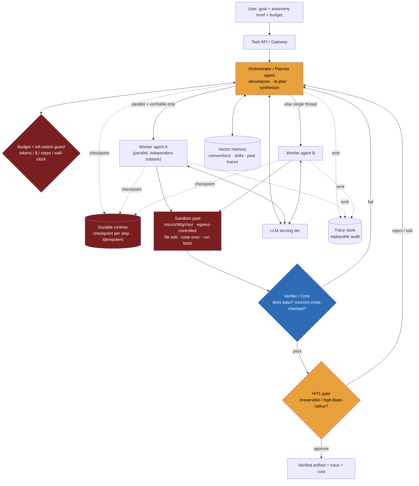

> **Why this problem separates Directors from ICs:** the demo is trivial and the production system is brutal, and the gap between them is the entire interview. An autonomous agent that resolves a GitHub issue end-to-end looks like magic for five minutes — then you ship it and discover that a task needing 40 sequential model decisions, each 95% reliable, succeeds about **13% of the time** (0.95⁴⁰), that a stuck agent re-planning in a loop quietly burned **$300 of tokens overnight**, and that "let it run `bash`" is one indirect-prompt-injection away from `rm -rf`. An IC tunes the prompt and the planner. A Director recognizes that **autonomy is the risk**, not the feature, and that the whole job is *bounding the loop*: durable checkpoints so a crash resumes instead of restarting, a sandbox so model-written code can't escape, hard budgets and a kill switch so cost is capped, a verifier so "done" means *tests pass* not *the model says so*, and human gates on the irreversible. Get autonomy wrong and you don't have a bug — you have a runaway process with your credentials and a credit card.

---

### Learning objectives

1. Quantify why **long-horizon autonomy is unreliable** — the p^N compounding-error math — and design verification, checkpointing, and re-planning as the countermeasures rather than hoping for a better model.
2. Decide **when multi-agent helps and when it hurts**: parallel, independently-verifiable subtasks justify the ~10–15× token multiplier; a single coupled thread of control does not.
3. Architect a **durable, sandboxed agent runtime** — checkpointed state, isolated tool execution, idempotent side effects — reusing the exactly-once and untrusted-execution machinery from the payments and agent-runtime designs.
4. Make **cost and safety first-class controls**: per-task token/time/step budgets, a kill switch, least-privilege tools, and human-in-the-loop gates placed by reversibility and blast radius.
5. Run a **RESHADED spine where the NFRs invert the usual order** — task success rate, bounded cost, and containment dominate; raw QPS is a footnote — and design-evolve toward graduated autonomy.

---

### Intuition first

Hiring a brilliant contractor for a week is the right mental model. You don't hand them your production database password on day one and check back Friday. You give them a **scoped workspace** (a sandbox), a **clear deliverable with an acceptance test** ("the bug is fixed when this failing test goes green"), a **budget** ("don't spend more than X hours"), **checkpoints** ("show me the plan before you start, and ping me before you touch anything in prod"), and a **way to verify the work** rather than taking their word for it. A great contractor with no acceptance test, no budget, and root access is not an asset — they're an unbounded liability, however talented.

That's exactly the shift an autonomous agent forces. A chatbot that's wrong *says* something false; an agent that's wrong *does* something — edits the wrong file, force-pushes, deletes records, spends money. And because each step's small errors **compound**, the longer you let it run unsupervised, the worse the odds. So the interesting engineering is not "make the model smarter." It is: **how do you let a fallible, occasionally-hijacked autonomous process do real work for hours, cap the damage and the bill, and *know* — not hope — that the result is correct.**

---

## R: Requirements

> Scope before build. The NFR priority here **inverts** the read-heavy problems in this course: throughput is trivial (you run thousands of tasks, not millions of QPS), and the binding constraints are **task success rate, bounded cost, and containment**. State that inversion out loud.

**Clarifying questions I'd ask (with assumed answers):**

- *What's the task domain?* → **Software engineering tasks** (fix a bug, implement a feature from an issue, write tests) **and research tasks** (gather, synthesize, and cite from many sources). One platform, two task shapes — coding is *verifiable* (tests), research is *parallelizable*. We'll design for both and let that contrast drive the multi-agent call.
- *How autonomous?* → **Graduated.** Default to bounded autonomy with HITL gates on irreversible actions; full hands-off only for low-blast-radius tasks. Autonomy is a per-task dial, not a global setting.
- *What can it touch?* → **A sandboxed workspace** (a clone of the repo, a scratch VM), plus scoped tools (search, file edit, code execution, run tests, web fetch). **Not** production systems directly without a human gate.
- *Who's the user?* → Developers and analysts kicking off tasks asynchronously; they expect to leave and come back, with progress streamed and approval prompts when needed.
- *Hard limits?* → A **per-task budget** (tokens, wall-clock, steps) is mandatory. Tasks that exceed it stop and ask, never silently continue.

**Functional requirements:**

1. Accept a **high-level goal** ("fix issue #482", "research vendor options for X and summarize with citations"), an autonomy level, and a budget.
2. **Plan and decompose** the goal into steps/subtasks, and **re-plan** when a step fails.
3. **Use tools** in a sandbox: read/edit files, execute code, run tests, search code, fetch/search the web.
4. **Iterate** toward the goal, **verifying** progress against a ground-truth signal (tests pass, cross-checked sources).
5. **Stream progress and a full trace**, and **pause for human approval** at defined checkpoints.
6. **Return a verified artifact** (a diff/PR, a cited report) plus the trace and a cost accounting.

**Explicitly cut:** the foundation model itself (we consume a serving API), the IDE/PR UI, fine-tuning the base model, and a self-improvement training loop. I'll name these as delegated or out of scope.

**Non-functional requirements, priority order:**

| Priority | NFR | Target |
|---|---|---|
| 1 | **Task success rate** | Maximize verified-correct completion; *measured*, not asserted |
| 2 | **Bounded cost & time** | Hard per-task ceiling (tokens / $ / wall-clock / steps); never runaway |
| 3 | **Containment / safety** | Sandboxed execution; no irreversible action without a gate; least privilege |
| 4 | **Reproducibility / observability** | Full, replayable trace of every step and tool call |
| 5 | **Durability** | A crash mid-task resumes from a checkpoint, not from scratch |
| 6 | **Latency** | Minutes-to-hours per task; async by nature — *not* an interactive-latency problem |
| 7 | **Throughput** | Thousands of concurrent tasks; trivially horizontal — a footnote |

**The inversion, stated explicitly:** unlike the conversational assistant where TTFT and QPS dominate, here a task takes minutes to hours and you run thousands, not millions per second. The scarce things are **a correct outcome, a capped bill, and a contained blast radius.** Every architectural decision flows from NFRs 1–3.

---

## E: Estimation

> Enough math to prove the crux is reliability and cost, not throughput.

**The reliability math (the most important number in the room).** Model a task as N sequential decisions, each independently correct with probability p. End-to-end success ≈ pᴺ:

| Per-step reliability p | 5 steps | 20 steps | 40 steps |
|---|---|---|---|
| 0.95 | 77% | 36% | **13%** |
| 0.99 | 95% | 82% | 67% |

This is why naive long-horizon agents fail in production despite great demos: **errors compound multiplicatively.** You cannot prompt your way out of 0.95⁴⁰. The design response is to (a) **shorten the chain** (decompose, constrain, use deterministic workflow steps where possible), (b) **raise effective p with verification + retry** (catch a bad step and redo it, so a step's *effective* reliability approaches 1), and (c) **checkpoint** so a failure costs one step, not the whole task.

**Token and cost per task.** A non-trivial coding task runs ~20–60 model turns; with planning, tool results, and re-reading context, call it **~0.5–2M tokens** for a single agent. Multi-agent fan-out (an orchestrator plus several workers, each with its own context) commonly runs **~10–15× the tokens of a single chat turn-for-turn** — Anthropic has reported their multi-agent research system using roughly that multiplier. So a multi-agent task can be **~5–20M tokens ≈ low-single-digit to low-double-digit dollars per task** at 2026 frontier prices. That number is why **budgets are an NFR, not a nicety**: a stuck agent re-planning in a loop overnight is a four-figure incident.

**Concurrency and capacity.** At, say, 10k tasks/day averaging 20 minutes of wall-clock, Little's Law gives ~140 concurrent tasks (`10000/86400 × 1200s ≈ 139`). Each needs a sandbox (a microVM/container) and durable state — so we size a **pool of a few hundred warm sandboxes**, not millions of anything. The model inference is delegated to a serving tier and is the dominant *cost*, not a capacity headache for *this* system.

**What estimation decided:** throughput is trivial; the crux is that success decays as pᴺ (→ verification + checkpoints + decomposition) and cost scales with the multi-agent multiplier (→ hard budgets + the single-vs-multi decision). The numbers justify the entire NFR inversion.

---

## S: Storage

> Five data classes, each chosen for what the autonomy and recovery requirements demand — not for QPS.

**1. Durable task & step state (the resumability core).**

- Access pattern: write a checkpoint after every step (plan, tool call + result, decision); on crash, reload the latest checkpoint and resume.
- Choice: a **durable-execution / workflow engine** (Temporal, AWS Step Functions, Restate, or DBOS) backing the agent loop, with state in its persistent store (Postgres-class). The engine gives durable timers, retries, and exactly-once step semantics for free.
- Rejected: holding agent state in process memory. A crash at step 30 of 40 would restart from zero — re-running every tool call (double side effects) and re-burning every token. Durability is non-negotiable when tasks run for hours.

**2. The sandbox / workspace (isolated, ephemeral).**

- Access pattern: a per-task isolated environment to clone the repo, edit files, and **execute model-written code** safely.
- Choice: a **per-task microVM (Firecracker) or hardened container (gVisor)** from a pre-warmed pool, with **no inbound access and tightly controlled egress** (untrusted execution). Fresh sandbox per task; destroyed after.
- Rejected: a shared executor or running tools in the orchestrator's process. Model-written code is *untrusted by construction*; one escape or one injected `curl … | sh` and the blast radius is your control plane.

**3. Artifact store (workspace snapshots & outputs).**

- Choice: **object storage (S3-class)** for workspace snapshots tied to checkpoints, diffs/PRs, and final reports. Append-only, cheap, range-fetched for replay. The git repo itself is the natural artifact store for coding tasks (commits = checkpoints).

**4. Agent memory (semantic + procedural).**

- Choice: a **vector store** for retrievable long-term memory — prior task traces, learned project conventions ("this repo uses pnpm, tests run with `make test`"), and reusable skills. Working memory lives in-context and is compacted as the task grows.
- Rejected: stuffing all history into the context window — it blows the budget and triggers context rot.

**5. Trace / observability store (audit + eval).**

- Choice: a **structured trace store** (LangSmith/Langfuse/Phoenix-class, or OpenTelemetry into a columnar store) recording every prompt, tool call, result, token count, latency, and cost — keyed by task and step, fully replayable. This is both the debugging surface and the **evaluation dataset**.

---

## H: High-level design

> The shape to make visible: an **orchestrator/planner** that decomposes work and (only when justified) fans out to **worker agents**, all running inside a **durable runtime** that checkpoints every step, executing tools only in a **sandbox**, gating irreversible actions behind **HITL**, and treating a **verifier** — not the model's self-assessment — as the definition of done. Budgets and a kill switch wrap everything.



**Happy path, a coding task ("fix issue #482"):**

1. User submits the goal with autonomy level and a budget (e.g., 3M tokens / 30 min / 50 steps). The **budget guard** initializes a ledger.
2. A **sandbox** is leased from the warm pool; the repo is cloned in.
3. The **orchestrator** plans: reproduce the bug, locate the cause, fix, run tests. Each step is **checkpointed** to the durable runtime before execution.
4. The orchestrator works the steps via sandboxed tools (read code, edit, run the test suite). Because this task is a **single coupled thread of control** (each edit depends on the last), it stays **single-agent** — no fan-out.
5. The **verifier** runs the repo's failing test: green = the ground-truth definition of done. Red = the orchestrator re-plans and retries the step (this is what raises effective per-step reliability).
6. Tests pass → the diff hits the **HITL gate**. Opening a PR for human review is reversible, so it's allowed under bounded autonomy; *merging to main* is not, and stays gated.
7. The verified diff, the full trace, and the cost are returned. The sandbox is destroyed.

**The research-task variant** is where multi-agent earns its keep: the orchestrator fans out **parallel worker agents**, each researching an independent sub-question in its own context, each returning **cited** findings the orchestrator can verify and synthesize. The subtasks are parallel *and* independently checkable — the only condition under which the 10–15× token cost is justified.

**The load-bearing idea:** the model proposes; the **verifier and the budget guard dispose.** "Done" is defined by an external signal (tests, cross-checked citations), and "how far it can go" is defined by the budget and the HITL gates — never by the agent's own confidence.

---

## A: API design

> An asynchronous, long-running job API with streaming progress and approval callbacks — not a request/response endpoint.

```
# --- Submit a task ---
POST /v1/tasks
  body: {
    goal: "Fix issue #482: null deref in checkout",
    repo: "git@…", autonomy: "bounded",          # suggest | bounded | auto
    budget: { tokens: 3_000_000, wall_clock_s: 1800, steps: 50, usd: 8.00 },
    acceptance: "tests in checkout_test.py pass"  # the verification signal
  }
  -> 202 Accepted { taskId, status: "planning" }

# --- Observe (stream the trace) ---
GET  /v1/tasks/{taskId}                 -> { status, step, plan, cost_so_far, budget_remaining }
GET  /v1/tasks/{taskId}/stream          -> SSE: step events, tool calls, partial results
GET  /v1/tasks/{taskId}/trace           -> full replayable trace (audit)

# --- Human-in-the-loop ---
POST /v1/tasks/{taskId}/approvals/{gateId}
  body: { decision: "approve" | "reject" | "edit", note }
  -> 200 { resumed: true }

# --- Control ---
POST /v1/tasks/{taskId}/cancel          -> 200 (kill switch — tears down sandbox)
GET  /v1/tasks/{taskId}/artifacts       -> { diff_url, pr_url | report_url, cost }
```

**Design notes (each with its rejected alternative):**

- **Async job, not synchronous.** Tasks run minutes-to-hours; a blocking call is wrong. Rejected: a synchronous "do the task" endpoint — it can't survive a client disconnect or a multi-hour run.
- **Budget is a required field on submit.** Rejected: a global default budget — task cost varies by orders of magnitude; an unbounded task is a cost incident. Force the caller to declare the ceiling.
- **The acceptance signal is an input.** Passing the verification target in (a test, a rubric) is what lets the verifier define "done" objectively. Rejected: letting the agent decide it's finished — self-assessed completion is how confidently-wrong results ship.
- **Approval callbacks resume a durable workflow.** The HITL gate suspends the run durably and waits (possibly hours) for a human; it is not a busy-wait. Rejected: polling the model "are we approved yet?" — wastes tokens and can't survive a restart.

---

## D: Data model

> The state that makes the system durable, auditable, and cost-bounded. Checkpoint granularity, idempotency, and the budget ledger are the consequential decisions.

**`tasks`** — `task_id` (PK), `goal`, `autonomy_level`, `acceptance_signal`, `status` (PLANNING / RUNNING / AWAITING_APPROVAL / VERIFYING / DONE / FAILED / KILLED), `budget` (JSON), `cost_spent` (JSON ledger), `created_at`. Sharded by `task_id` — tasks are independent, so even distribution beats locality here.

**`steps`** — append-only, `step_id` (PK), `task_id` (FK), `seq`, `type` (PLAN / TOOL_CALL / OBSERVATION / DECISION / VERIFY / APPROVAL), `input`, `output`, `tokens`, `cost`, `latency_ms`, `checkpoint_ref`, `created_at`. **Append-only** so the trajectory is an immutable audit trail — replayable for debugging and as eval data. This is the same append-only-ledger instinct as payments, applied to agent decisions.

**`tool_calls`** — `call_id` (PK), `step_id`, `tool`, `args_hash`, `idempotency_key`, `result`, `side_effecting` (bool), `status`. The **`idempotency_key`** is load-bearing: side-effecting tool calls (open PR, send email, write to an external system) must be **idempotent** so a durable retry after a crash doesn't double-act — exactly the payments idempotency pattern, now applied to agent actions.

**`budget_ledger`** — per-task running totals of tokens / $ / steps / elapsed, checked before *every* model call and tool call. When any dimension hits its ceiling, the run transitions to AWAITING_APPROVAL or KILLED. This is what makes "bounded cost" a hard guarantee rather than a hope.

**Checkpoint granularity — the trade-off named:** checkpoint **after every step**. Finer (mid-step) is wasteful and complex; coarser (per-plan) means a crash re-runs many tool calls, re-incurring side effects and cost. Per-step is the sweet spot: a crash costs one step of redo, and idempotency keys make even that safe.

<details>
<summary>Go deeper — raising effective per-step reliability with verify-and-retry (IC depth, optional)</summary>

The pᴺ math assumes each step either succeeds or silently corrupts the trajectory. Verification breaks that assumption. If a step's raw reliability is p and the verifier catches failures with probability q, then with up to r retries the step's *effective* reliability approaches:

`p_eff ≈ 1 − (1 − p)·(1 − q)^?` — informally, undetected failures are what propagate, so a strong verifier (high q) plus retry pushes p_eff toward 1 for *detectable* errors.

The practical consequences:
- **A cheap, reliable verifier beats a smarter generator.** Running the test suite (q ≈ 1 for "does it compile and pass") raises effective reliability far more than upgrading the model.
- **Decompose to shrink N.** Ten verified 4-step subtasks beat one unverified 40-step chain: each subtask re-verifies, so errors don't compound across the whole length.
- **The residual risk is *undetectable* errors** — a fix that passes the existing tests but is subtly wrong. That's why HITL on the final diff and good acceptance signals still matter; verification is only as good as the test.

</details>

---

## E: Evaluation

> Re-check against the NFRs. The bottlenecks are reliability, cost, and containment failures — not throughput.

**Re-check vs NFRs:** success rate → verifier-gated completion + decompose + retry; bounded cost → the budget ledger checked before every call + kill switch; containment → sandbox + least-privilege tools + HITL on irreversible actions; reproducibility → the append-only trace; durability → per-step checkpoints in the durable runtime.

**Failure 1 — Compounding error over a long horizon (the defining failure).**
A 40-step task drifts: an early wrong assumption poisons every later step, and the agent confidently delivers a broken result. *Mitigation:* (a) **decompose** so no chain is 40 unverified steps; (b) **verify** each subtask against ground truth (tests, cross-checked sources) so a bad step is caught and **retried/re-planned**, raising effective reliability; (c) **checkpoint** so recovery is cheap. The Director framing: you don't fix compounding error with a better model — you fix it by **shortening chains and verifying often.**

**Failure 2 — Runaway cost (the overnight $300 incident).**
A stuck agent loops — re-planning, re-reading, retrying — and burns tokens with no progress. *Mitigation:* the **budget ledger** (tokens / $ / steps / wall-clock) is checked before every model and tool call; **loop/no-progress detection** trips early; a hard **kill switch** tears down the task and sandbox. A task that exhausts its budget **stops and asks**, never silently continues. Cost is capped by construction, not by vigilance.

**Failure 3 — Destructive or hijacked action (the safety failure).**
The agent runs model-written code, or an **indirect prompt injection** (a malicious string in a fetched web page, a repo file, or a tool result) tries to make it exfiltrate secrets or `rm -rf`. *Mitigation, defense-in-depth:* the **sandbox** (microVM/gVisor, controlled egress) contains code execution; **least-privilege tools** mean the agent literally lacks a "delete prod" capability; **HITL gates** on anything irreversible; all tool output is **untrusted input**. You cannot fully prevent injection — you **contain the blast radius** so that even a hijacked agent can't do irreversible damage.

**Failure 4 — Multi-agent where it doesn't belong (the cost-multiplier failure).**
Someone fans out a tightly-coupled task (refactor one file, debug one stack trace) across many agents. Now you're paying the ~10–15× multiplier *and* fighting coordination/consistency on shared state, for worse results than a single agent. *Mitigation:* the **single-vs-multi rule** — multi-agent only for subtasks that are **parallel and independently verifiable** (research fan-out); single agent or a deterministic workflow for coupled threads of control. The default is one agent; multi-agent must earn its multiplier.

**Failure 5 — Non-reproducibility.**
"It worked yesterday" with no way to see what it did. *Mitigation:* the **append-only trace** captures every prompt, tool call, and decision, replayable step-by-step — both for incident response and as the eval dataset.

**Evaluating the agent (Director framing):** you evaluate the **trajectory, not just the final answer** — did it take a wasteful or dangerous path even if it eventually succeeded? Use a **task-success benchmark** (a held-out set of issues with known-good fixes; for coding, SWE-bench-style verified resolution rate), **trajectory eval** for safety/efficiency, and **red-teaming** for harmful action sequences (including injection-to-action). Task success rate is a *measured* number gating releases, not a vibe — and a prompt or model change that regresses it doesn't ship.

---

## D: Design evolution

> Graduated autonomy as the primary evolution, because it adds a trust-and-governance machine the bounded version doesn't have.

**Graduated autonomy.** Start every new task type at **suggest-only** (the agent proposes, a human executes). As the **measured** success rate and safety record on that task type clear a bar, promote it to **bounded** (auto-execute reversible actions, gate irreversible ones), and only well-proven, low-blast-radius types to **auto**. Autonomy is *earned per task type with data*, and demotion on a regression is automatic. The governance question — *who authorizes raising autonomy, and on what evidence* — is a Director-owned control, not an engineer's config flag.

**Learned skills (procedural memory).** Promote repeatedly-useful patterns ("this repo's tests run with `make test`", "our deploy needs flag X") into the **procedural memory** store so future tasks start smarter. Guard against memory poisoning — a wrong learned fact silently degrades every future run, so learned skills are themselves verified before promotion.

**The eval harness as product.** The held-out task benchmark and trajectory evals become the **regression gate** for every prompt/model/tool change — and, increasingly, a competitive moat: the team that measures agent quality rigorously ships improvements safely while others ship regressions blind.

**Scale-out and integration.** Thousands of parallel tasks scale by adding sandboxes and workers (stateless given the durable store); the cost ceiling, not the compute, is the real governor. Integrate as a **PR-opening bot in CI** or an IDE agent — at which point the HITL gate *is* code review, a control developers already trust.

**Builds on:** untrusted code execution / sandboxing (the same isolation problem), payments idempotency + append-only ledger (reused for tool calls and the trajectory), the agent loop and agent-vs-workflow, multi-agent orchestration (the single-vs-multi decision), durable runtime + HITL, agent action safety + trajectory eval, and the tool-using support agent (the same safety machinery at lower autonomy).

---

## Trade-offs table: the pivotal decisions

| Decision | Option A | Option B | Option C | Use when… |
|---|---|---|---|---|
| **Single vs multi-agent** | **Single agent** | **Orchestrator + parallel workers** | Deterministic workflow (LLM at decision points only) | **A** for coupled threads of control (one diff, one stack trace) — avoids the 10–15× multiplier and coordination risk. **B** only for parallel, independently-verifiable subtasks (research fan-out). **C** when the path is known — most reliable and cheapest of all. |
| **Runtime** | **In-memory loop** | **Durable-execution engine (Temporal/Step Functions/DBOS)** | Queue + external state store | **B** for any task over a few minutes — crash-resume, idempotent steps, durable HITL waits. **A** only for sub-minute toy tasks. **C** if you must hand-roll, but you'll re-implement B badly. |
| **Definition of "done"** | **Agent self-assessment** | **External verifier (tests / cross-checked sources)** | Human review of every result | **B** is the default — objective ground truth raises effective reliability. **A** never (confidently-wrong results). **C** for high-blast-radius output where the verifier can't be trusted alone. |
| **Tool execution** | **In-process** | **Sandbox (microVM/gVisor), egress-controlled** | Sandbox + per-tool least-privilege scopes | **C** as the target — isolation *and* capability scoping. **B** as a baseline. **A** never for model-written code — it's untrusted by construction. |
| **Cost control** | **Monitor & alert** | **Hard budget ledger + kill switch** | Soft budget that requests approval to continue | **B/C** are mandatory — pre-flight checks before every call cap cost by construction. **A** alone is how the overnight $300 bill happens. |

---

## What interviewers probe here (Director altitude)

- **"It works perfectly in demos but fails on long real tasks. Why?"** — *Strong signal:* names **compounding error** (success ≈ pᴺ), does the arithmetic (0.95⁴⁰ ≈ 13%), and prescribes **decompose + verify-and-retry + checkpoint** to shorten chains and raise effective per-step reliability — *not* "use a better model." *Red flag:* "tune the planner prompt" with no grasp that the failure is multiplicative and structural.

- **"How do you stop it from burning $1,000 or running `rm -rf /`?"** — *Strong signal:* two separate controls — a **hard budget ledger** checked before every call (with loop detection + kill switch) for cost, and **sandbox + least-privilege + HITL on irreversible actions** for safety; notes that **injection-to-action** means you contain rather than prevent. *Red flag:* "we'd monitor and alert" — alerting is post-hoc; the damage is already done.

- **"Single agent or multi-agent — and why?"** — *Strong signal:* default single agent; multi-agent **only** for parallel, independently-verifiable subtasks because it costs ~10–15× the tokens and adds coordination/consistency risk; a coupled thread of control stays single-agent or becomes a deterministic workflow. *Red flag:* "more agents = better/faster" with no awareness of the multiplier or the coupling constraint.

- **"How does it know it succeeded?"** — *Strong signal:* an **external verifier** defines done — tests pass for code, cross-checked citations for research — never the agent's self-assessment; the acceptance signal is an input. *Red flag:* "the agent reports it's done" — the confidently-wrong failure.

- **"It crashed at step 30 of 40. What happens?"** — *Strong signal:* a **durable runtime** resumes from the last per-step **checkpoint**; side-effecting tool calls are **idempotent** so the retried step doesn't double-act. *Red flag:* "it restarts the task" — re-running side effects and re-burning the budget.

---

## Common mistakes

- **Treating autonomy as the feature instead of the risk.** The longer it runs unsupervised, the worse the odds and the higher the bill. The engineering is *bounding* the loop — verify, checkpoint, budget, gate — not unleashing it.
- **No external verifier.** Letting the agent decide it's finished ships confidently-wrong work. "Done" must be an objective signal (tests, cross-checked sources) supplied as input.
- **Multi-agent by default.** Fanning out a coupled task pays the 10–15× token multiplier and fights shared-state coordination for *worse* results. Multi-agent is for parallel, independently-verifiable subtasks only.
- **In-memory state.** A crash mid-task restarts from zero, re-running side effects and re-spending the budget. Long-running agents need a durable, checkpointed, idempotent runtime.
- **Cost control by alerting.** Monitoring tells you *after* the money's gone. The budget must be a hard pre-flight ceiling with a kill switch — checked before every model and tool call.

---

## Practice questions with model answers

**Q1. Your coding agent resolves 70% of issues in eval but only 35% in production. What's going on and what do you change?**

> *Model:* Production tasks are **longer and less constrained**, so the pᴺ chain is longer and success decays. First, instrument it: the **trace** shows where trajectories diverge. Then attack N and p: **decompose** long tasks into verified subtasks so errors don't compound across 40 steps; strengthen the **verifier** (run the full suite, not a smoke test) so bad steps are caught and **retried**, raising effective reliability; ensure the eval set actually mirrors production task length/ambiguity (a too-easy eval is why the numbers diverged). A bigger model is the *last* lever — the structural fix is shorter, verified chains.

**Q2. A teammate wants to fan every task across 8 agents for speed. Evaluate.**

> *Model:* Only correct for tasks whose subtasks are **parallel and independently verifiable** — e.g., researching 8 independent sub-questions, each returning cited findings the orchestrator verifies and merges. For a **coupled** task (one diff, one debugging thread), fan-out is wrong twice: it pays the **~10–15× token multiplier** and it creates shared-state coordination problems that *lower* quality. The rule: default single agent; reach for multi-agent when the work is genuinely parallel and each piece is independently checkable; use a deterministic workflow when the path is known. Speed is rarely the real win — most "slow" is sequential dependency that more agents can't break.

**Q3. An indirect prompt injection in a fetched web page tells the agent to email a customer database to an attacker. Trace what stops it.**

> *Model:* Defense-in-depth, no single layer trusted. The agent runs in a **sandbox** with **controlled egress**, so an arbitrary outbound connection is blocked. **Least-privilege tools** mean the agent has no "dump the customer DB" or "email arbitrary address" capability in the first place. Any irreversible/external action hits a **HITL gate**. All fetched content is treated as **untrusted input**. You **assume injection is possible** and design so the blast radius is contained — the worst case is a wasted step the verifier rejects, not data exfiltration. The residual control is the **audit trace** for detection. Prevention isn't fully possible; containment is the design.

---

### Key takeaways

1. **Autonomy is the risk, not the feature.** Success decays as pᴺ over a long horizon (0.95⁴⁰ ≈ 13%), so the entire design is *bounding the loop*: decompose to shorten chains, verify to catch and retry bad steps, checkpoint to recover cheaply.
2. **An external verifier defines "done" — never the agent.** Tests for code, cross-checked citations for research, supplied as an input. Verify-and-retry raises *effective* per-step reliability far more than a smarter model does.
3. **Cost and safety are hard, pre-flight controls.** A budget ledger (tokens/$/steps/wall-clock) checked before every call plus a kill switch caps cost by construction; a sandbox + least-privilege tools + HITL on irreversible actions contains a hijacked or buggy agent. Injection-to-action you *contain*, you don't prevent.
4. **Multi-agent must earn its ~10–15× multiplier.** Use it only for parallel, independently-verifiable subtasks; keep coupled threads of control single-agent or as a deterministic workflow.
5. **Production agents are durable, idempotent, observable distributed workflows.** Per-step checkpoints in a durable runtime, idempotent side-effecting tool calls, and an append-only replayable trace — the exactly-once and untrusted-execution machinery of the payments and agent-runtime designs, applied to autonomy.

> **Spaced-repetition recap:** Autonomous coding/research agent = **autonomy is the liability you bound**, not the feature you unleash. Reliability collapses as **pᴺ** (0.95⁴⁰ ≈ 13%) → **decompose + verify-and-retry + checkpoint** (a cheap verifier beats a smarter model). Cost explodes under the **~10–15× multi-agent multiplier** → **multi-agent only for parallel + independently-verifiable subtasks**, single-agent/workflow otherwise, with a **hard budget ledger + kill switch**. Containment over prevention: **sandbox + least-privilege tools + HITL on irreversible actions**, all tool output untrusted. **Durable runtime** with per-step checkpoints + **idempotent** tool calls so a crash resumes, not restarts. "Done" = an **external verifier** (tests / cross-checked sources), never self-assessment. Evaluate the **trajectory**, not just the answer; success rate is a measured release gate. Throughput is trivial; **success rate, bounded cost, and containment** are the crux.

---

*End of Lesson 12.6. The autonomous agent inverts the conversational-assistant instincts: latency and QPS are footnotes, and the design is dominated by making a fallible, occasionally-hijacked long-running process produce verifiably-correct work without runaway cost or irreversible damage. The next problem turns to a different resource frontier — text-to-image generation, where the binding constraint is GPU-seconds in a queue, not tokens in a loop.*
