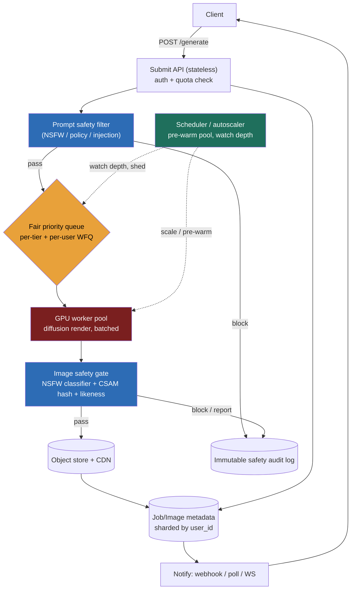

> **Why this problem separates Directors from ICs:** the instinct after Lesson 5.15 (ChatGPT serving) is "GPUs again — continuous batching, KV cache, stream the tokens." That instinct is **wrong here and the interviewer is watching for it.** Image generation is not a streaming-decode workload; it is a **multi-second, GPU-bound, all-or-nothing batch job** — a diffusion model runs 20–50 denoising steps and emits *nothing* until the last one. There are no tokens to stream. So the architecture is not a serving loop; it is a **fair-scheduled job queue over a pre-warmed GPU worker pool**, where the hard problems are *bursty demand against slow-to-scale GPUs*, *two-sided safety* (you must police both the prompt and the pixels — NSFW, CSAM, and a real person's likeness), and *cost-per-image* economics that decide whether the product has a viable margin. A Director who reaches for SSE token streaming has misread the workload in the first sentence.

---

### Learning objectives

1. Recognize that diffusion generation is an **asynchronous, multi-second batch job** (no streaming), so the system is a **queue + GPU worker pool**, not a request-serving loop — and contrast it with the LLM serving design (5.15).
2. Size the system in **GPU-seconds per image** and show that the **GPU fleet, and specifically its idle-vs-peak provisioning, is the entire cost story.**
3. Design **fair scheduling under burst**: priority tiers, per-user quotas, a pre-warmed pool for known peaks, and backpressure/shed for the spikes — because GPU autoscaling is too slow to absorb a burst.
4. Treat **safety as two-sided and non-negotiable**: an input prompt filter *and* an output-image classifier plus CSAM hash-matching and likeness/IP controls, with the legal duty named.
5. Run the **RESHADED spine** with the NFR priority inverted toward throughput-cost-safety, and design-evolve toward distilled few-step models and video.

---

### Intuition first

Think of a **photo lab in the 1980s**, not a phone call. When you served ChatGPT (5.15) you were running a switchboard: the moment the operator starts talking, you hear words streaming back one at a time. Image generation is the photo lab — you drop your film at the counter, you get a **ticket**, and you come back later for the prints. The lab has a fixed number of **developing machines** (GPUs), each prints one job at a time and takes a few minutes, and on the Saturday before a holiday everyone shows up at once. The lab's whole operation is therefore about the **counter and the queue**: how many machines to keep warmed up, whose film jumps the line (the premium customer), how to stop one customer dumping 500 rolls and freezing everyone else, and — the part the 1980s lab didn't have to worry about — **refusing to develop and refusing to hand back** anything illegal or harmful, checking both the order slip *and* the finished print.

That image gets everything right that matters here: it's **asynchronous** (ticket, not a live line), the **machines are the cost** (idle developers still cost rent), **fairness under burst is the operational core**, and **safety is a gate on both the request and the result.** Hold the photo lab in your head; it predicts every decision below.

---

## R: Requirements

> Scope before build. State the inversion: this is a **throughput-, cost-, and safety-first** design; per-request latency is *seconds by nature* and that's fine, so the usual "shave p99" reflex is not the game.

**Clarifying questions I'd ask (with assumed answers):**

- *Real-time or async?* → **Async.** A quality diffusion render is multi-second; we return a **job ID**, not an image, on the request. (We'll add a real-time tier in design evolution via distilled models.)
- *Quality bar / model?* → **A single flagship diffusion model** (SDXL/Flux-class) at launch, served at a fixed step count; treat the model as a swappable artifact behind the worker.
- *Who are the users?* → **Consumer product**, free + paid tiers. This makes **fairness and quota** first-class.
- *Editing features?* → **Text-to-image and variations at launch**; img2img / inpainting are the same worker with a different input — note as an extension, don't scope-creep.
- *Safety obligations?* → **Yes, hard ones.** NSFW policy, **CSAM is a legal reporting duty**, and no public-figure likeness / trademarked content. This is a requirement, not a feature.
- *Retention?* → Users keep a gallery; we keep images + safety labels for an audit window.

**Functional requirements:**

1. Submit a generation job: `prompt` + params (`size`, `steps`, `style`, `seed`, `n` variations) → return a **job ID** immediately.
2. Poll job status / receive a **webhook** when done; fetch the resulting image(s).
3. Per-user **gallery / history**; download.
4. Enforce **per-user quotas and tier priority**.
5. **Moderate** every prompt (in) and every image (out).

**Explicitly cut (named, not silently dropped):** training/fine-tuning of the base model, the diffusion math itself (delegated — I don't tune samplers in the room), a full prompt-engineering UX, payments/billing internals, and social/sharing features. I'll say "delegated to the ML platform team" for model internals and "separate service" for billing.

**Non-functional requirements, priority order:**

| Priority | NFR | Target |
|---|---|---|
| 1 | **Safety / legal compliance** | Zero CSAM served or stored; NSFW and likeness blocked per policy; full audit trail |
| 2 | **Throughput under burst** | Sustain ~115 img/s average, absorb ~5× peak without falling over |
| 3 | **Fairness** | No user/tier starves another; quotas enforced; bounded queue wait per tier |
| 4 | **Cost per image** | Keep $/image low enough for the tier's unit economics (GPU utilization is the dial) |
| 5 | **Availability** | 99.9% on submit/fetch; a GPU dying loses one job, retried |
| 6 | **Latency** | p95 *queue+generate* within tier SLA (e.g., free ≤ 60 s, paid ≤ 10 s) — **seconds, by design** |

**The inversion, stated out loud:** in the streaming-LLM problem (5.15) latency (TTFT) was a top NFR and we engineered continuous batching to protect it. Here **latency is inherently seconds and acceptable**, throughput-under-burst and cost dominate, and **safety is #1 because the failure mode is a legal incident, not a slow response.** Every decision below flows from NFRs 1–4.

---

## E: Estimation

> Enough math to prove the crux: the GPU fleet sizing — and its idle-vs-peak gap — *is* the design.

**Assumptions:** 10M images/day; consumer diurnal traffic with a ~5× evening peak; flagship model renders at **~4 GPU-seconds/image** on an H100-class GPU (≈30 steps, 1024², modest batching); image ≈ **1.5 MB** stored (plus a thumbnail).

**Throughput:**
- Average: `10M ÷ 86,400 ≈ 116 images/s`. Peak `≈ 580 images/s`.
- Per-GPU rate: at 4 GPU-s/image, one GPU does `~0.25 images/s` un-batched; with small intra-GPU batching call it **~0.4–0.5 images/s**.
- GPUs at peak: `580 ÷ 0.45 ≈ ~1,300 H100-class GPUs` to serve peak with no queue. At average load you'd need `~260`. **That 5× gap between average and peak — ~1,000 idle-most-of-the-day GPUs — is the entire cost problem,** and the reason we queue and tier rather than provision for peak.

**Cost (the line a Director must say):**
- H100-class GPU ≈ **$2–4/GPU-hour** (cloud, reserved cheaper). At 4 GPU-s/image and *full utilization*, marginal cost ≈ `4s × $3/3600s ≈ $0.0033/image`. 
- But **utilization is the whole game**: provision for peak and run at 20% average utilization and your *effective* cost per image is **~5× that (~$0.015–0.02)**. So the design's job is to **flatten utilization** (queue + batch + distilled models), not to chase a faster kernel.

**Storage & bandwidth:**
- `10M × 1.5 MB ≈ 15 TB/day` of images → object store + lifecycle (tier cold after N days, or expire free-tier outputs). One year of paid retention ≈ low-PB; **trivial for S3-class storage, but CDN egress is the cost** — popular images are re-fetched, so front with a CDN.

**What estimation decided:** GPU is the binding resource; the 5× peak-to-average gap is the cost crux; storage is cheap but CDN egress matters; and 4 GPU-s/image means **async is forced** — you cannot hold a synchronous connection for that long at 580/s.

---

## S: Storage

> Five data classes; each picked for its access pattern, with the rejected alternative named.

**1. Job queue (the heart of the system).**
- Access pattern: enqueue a job, workers pull the highest-priority eligible job, redrive on failure, observe depth for autoscaling/backpressure.
- Choice: a **broker with priority + fairness** — Kafka/Redis Streams/SQS-class for transport, with a **fair-scheduling layer** (per-tier queues + per-user weighted fair queuing) on top. I'd model it as **one queue per priority tier** plus a fairness scheduler that round-robins across users within a tier.
- Rejected: a single FIFO queue — a free-tier batch of 500 jobs would head-of-line-block a paying customer. Fairness must be explicit (see D).

**2. GPU worker pool + model artifacts.**
- The diffusion model weights (~several to ~20+ GB depending on model) live on each warm worker's GPU HBM; a **model registry / object store** holds versioned weights that workers load at startup. Loading weights is the **slow cold-start** (tens of seconds), which is *why* we pre-warm rather than autoscale reactively.

**3. Image blob store + CDN.**
- Access pattern: write-once, read-many, expire. Choice: **object store (S3-class) + CDN**. Thumbnails generated on write for gallery views. Rejected: serving images from app servers — wastes egress and ignores edge caching.

**4. Job / image metadata DB.**
- Access pattern: point lookup by `job_id`, list by `user_id`, store params + status + safety labels. Choice: a **partitioned KV/document store (DynamoDB/Cassandra-class)** sharded by `user_id` — gallery is a single-partition query; volume is high-write, simple-read. Rejected: a single relational primary — unnecessary at this write rate and shape.

**5. Safety stores.**
- **CSAM perceptual-hash database** (e.g., PhotoDNA-class hash sets) for output matching; NSFW/likeness classifier models; an **immutable audit log** of every block decision (legal evidence). Append-only; co-retained with the image labels.

---

## H: High-level design

> The shape to make visible: a **stateless submit API** that drops a job on a **fair priority queue**, a **pre-warmed GPU worker pool** that pulls jobs and renders, **two safety gates** (prompt before the GPU, image after), and an **async notify** path — never a held connection.



**Happy path:**

1. Client `POST /generate` with prompt + params. API authenticates, **checks quota** for the tier, and runs the **prompt safety filter** (cheap, inline — block obvious policy violations before spending a GPU-second).
2. API writes a `QUEUED` job row and **enqueues** it on the user's tier queue. Returns **`202 Accepted` + `job_id`** immediately. (No GPU touched yet for a blocked prompt — safety *and* cost win.)
3. A **GPU worker** pulls the next job per the fairness scheduler, renders (N denoising steps, batched with siblings where the model allows), and produces image(s).
4. The **image safety gate** runs: NSFW classifier + **CSAM perceptual-hash match** + likeness/IP check. Pass → store to object store, generate thumbnail, write metadata, mark `DONE`. Block → quarantine, **do not return**, write the audit record, and for CSAM trigger the legal reporting path.
5. **Notify**: fire the webhook / flip status for polling / push over WS. Client fetches the image from the **CDN**.

**The load-bearing choices visible here:** safety is a **gate on both sides of the GPU** (cheap prompt filter pre-GPU to save money and block early; mandatory image gate post-GPU because a clean prompt can still yield a bad image); the **queue absorbs burst** so the GPU pool runs near-flat; and **nothing holds a connection** for the multi-second render.

---

## A: API design

> Async-first. The contract's job is to hand back a ticket and let the client come back — anything synchronous is wrong for a multi-second render.

```
# --- Generate (async) ---
POST /v1/generate
  headers: { Authorization: Bearer <key>, Idempotency-Key: <uuid> }
  body: { prompt, negative_prompt?, size, steps?, style?, seed?, n? }
  -> 202 Accepted { job_id, status:"queued", est_wait_s }
  -> 400 { error:"prompt_blocked", policy:"nsfw" }   # blocked at the prompt gate, no GPU spent
  -> 429 { error:"quota_exceeded", retry_after_s }

# --- Status / result ---
GET  /v1/jobs/{job_id}
  -> 200 { job_id, status:"queued|running|done|blocked|failed",
           images?:[{url, thumb_url, seed}], reason? }

# --- Webhook (preferred over polling) ---
POST {client_callback_url}        # we call them when terminal
  body: { job_id, status, images?, reason? }

# --- Gallery ---
GET  /v1/users/{user_id}/images?cursor=&limit=   -> 200 { images:[...], next_cursor }
```

**Design notes (each with its rejected alternative):**

- **`202 + job_id`, never a synchronous image.** Rejected: `POST /generate → 200 {image}`. At 4 s/render and 580 req/s peak you'd hold ~2,300 concurrent connections and couple client latency to GPU queue depth — fragile and wasteful. The ticket model decouples them.
- **`Idempotency-Key` on submit.** A client retry (mobile network blip) must not enqueue a second paid render. Rejected: no key — duplicate jobs burn GPU and quota. (Ties the idempotency discipline from 9.1/11.13.)
- **Webhook preferred, polling supported.** Webhooks avoid a thundering herd of `GET /jobs` polls at peak; polling stays as a fallback with a sane interval. Rejected: poll-only — adds load exactly when the system is busiest.
- **`429` with `retry_after`, distinct from a safety `400`.** The client must tell "you're rate-limited, slow down" apart from "this prompt is blocked, don't retry it." Conflating them trains bad client behavior.

---

## D: Data model

> Two records carry the system; the **fairness/priority fields** and the **safety labels** are the consequential columns.

**`jobs`** — primary key `job_id`, shard key **`user_id`**. Columns: `status` (QUEUED / RUNNING / DONE / BLOCKED / FAILED), `prompt`, `params` (JSON), `tier`, `priority`, `idempotency_key`, `enqueued_at`, `started_at`, `finished_at`, `worker_id`. Unique index on `(user_id, idempotency_key)` so a retry dedupes at the DB even if the app layer is bypassed.

**`images`** — primary key `image_id`; columns: `job_id` (FK), `user_id`, `object_url`, `thumb_url`, `seed`, **`safety_labels`** (JSON: nsfw_score, csam_match bool, likeness_flags), `created_at`, `expires_at` (lifecycle). Partition by `user_id` for the gallery query.

**`safety_audit`** — append-only, never updated: `decision_id`, `job_id`/`image_id`, `stage` (PROMPT / IMAGE), `verdict`, `policy`, `evidence_ref`, `created_at`. This is **legal evidence**; immutability and retention are requirements, not niceties.

**The fairness model — the decision the round turns on.** Each job carries a `tier` and a derived `priority`. The scheduler maintains **per-tier queues** and, within a tier, **weighted fair queuing across `user_id`** so no single user monopolizes the pool. A per-user **token-bucket quota** (e.g., free = N images/day, M concurrent) is checked at submit. Rejected alternative: a global FIFO with no per-user fairness — one user's 500-image batch head-of-line-blocks everyone; **fairness has to be modeled in the data, not hoped for.**

<details>
<summary>Go deeper — diffusion serving mechanics that justify the numbers (IC depth, optional)</summary>

- **Why it's all-or-nothing:** a latent diffusion model starts from noise and iteratively denoises over *K* steps (e.g., 20–50) guided by the text embedding (cross-attention). The image only exists after the final step decodes from latent space, so there is **nothing to stream** — unlike autoregressive token decode. Fewer steps = faster but lower fidelity; the step count is a direct quality/cost knob.
- **Batching:** the UNet/transformer denoiser batches multiple prompts per forward pass, so a worker rendering 4 images at once is far more GPU-efficient than 4 sequential renders — this is the lever that turns 0.25 → ~0.45 images/s/GPU. Classifier-free guidance roughly doubles the per-step compute (a conditional + unconditional pass), which is baked into the GPU-seconds estimate.
- **Cold start:** the dominant startup cost is loading multi-GB weights into HBM (tens of seconds), so a worker can't be spun up *reactively* fast enough to catch a burst — hence pre-warm. Memory-mapped/streamed weight loading and keeping a hot standby pool mitigate it.
- **Distilled models** (LCM, SDXL-Turbo/Lightning) collapse K from ~30 to **1–4 steps**, cutting GPU-seconds ~8–30× at some quality cost — the single biggest cost/latency lever (see Design evolution).

</details>

---

## E: Evaluation

> Re-check against the NFRs. The bottlenecks here are *burst absorption*, *fairness*, *safety coverage*, and *cost*, not raw speed.

**Re-check vs NFRs:** safety = two gates + CSAM hashing + immutable audit (NFR 1); burst = queue + pre-warm pool + shed (NFR 2); fairness = tier queues + per-user WFQ + quotas (NFR 3); cost = batching + utilization flattening + distilled tier (NFR 4). Now the failure modes.

**Failure 1 — a 10× burst (a viral moment) hits the GPU pool.** GPUs **cannot autoscale fast** (cold start = weight load, tens of seconds; and the cloud may not even have spare H100s instantly). So you do **not** rely on reactive autoscale to catch a spike. Instead: (a) a **pre-warmed pool** sized for the expected peak (you provision for the diurnal 5× and keep it warm); (b) the **queue absorbs the overflow** — latency degrades gracefully (free-tier wait grows) rather than the system collapsing; (c) **backpressure / shed** — when queue depth crosses a threshold, return `202` with a longer `est_wait_s` or shed free-tier submissions with a clear `429`, protecting paid SLAs; (d) **priority preemption** so paid jobs jump the line. The Director point: **you defend a burst with a warm pool + a queue + tiered shedding, not with an autoscaler that arrives ten minutes late.**

**Failure 2 — noisy neighbor / fairness.** Without per-user WFQ + quotas, one script-driven user starves the pool. Mitigation: token-bucket quotas at submit, weighted fair queuing across users within a tier, and concurrency caps per user. Bounded wait per tier is an SLO we measure.

**Failure 3 — safety escapes (the career-ending one).** Two-sided coverage is mandatory because **each gate misses different things**: the prompt filter catches obvious intent but a benign prompt can still yield NSFW pixels (so you *must* classify the output), and an adversarial "jailbreak" prompt may pass the text filter but the image classifier + CSAM hash catch the result. **CSAM is a legal duty** — perceptual-hash match against known sets, block, quarantine, and report; never serve, never silently delete (preserve the audit record per legal guidance). **Likeness/IP** (public figures, trademarks) is a policy classifier on the output. Residual risk: novel content no classifier flags — mitigate with human-review sampling, user reporting, and red-teaming. You **cannot** claim 100% prevention; you design **defense-in-depth + audit + reporting** (ties 11.6/11.14).

**Failure 4 — cost/image blows the margin.** If effective $/image (peak-provisioned, low average utilization) makes the free tier lose money, the levers are: **distilled few-step models** for the free/real-time tier (8–30× cheaper), **larger batch sizes**, **spot/preemptible GPUs** for free-tier batch work (it's interruptible — re-queue on preemption), **utilization flattening** via the queue, and **caching identical (prompt, seed, params)** requests. Rejected: "just buy more H100s" — that's the most expensive answer to a utilization problem.

**Failure 5 — a worker dies mid-render.** The job is idempotent and re-queued (at-most-once *visible* result via the idempotency key); the user waits slightly longer, loses nothing. A GPU OOM on too-large a batch → cap batch size by resolution.

---

## D: Design evolution

> The most interesting evolution adds a **real-time tier** and then **video**, each changing the resource math.

**Real-time tier via distilled models.** Product wants "watch it appear as you type." Swap the worker's model for a **distilled few-step model (LCM / Turbo / Lightning, 1–4 steps)** that renders in **sub-second to ~1 s**. Now a *synchronous-feeling* path is viable for paid users (still job-based under the hood, just fast), while the flagship 30-step model stays async for "high quality." This is a **two-pool design**: a fast/cheap pool and a quality/expensive pool, routed by tier and request — the same speed-vs-quality knob as model cascades (11.8), applied to GPUs. Trade-off: distilled output is slightly lower fidelity; you let the user choose.

**Video generation.** A few seconds of video is **one to two orders of magnitude more GPU-seconds** than an image (many frames × temporal consistency). The queue/worker shape *survives* — it's still async jobs over a GPU pool — but the economics force **much harsher quotas, longer SLAs, and almost certainly a paid-only gate**, plus chunked/segment rendering. The architecture generalizes; the cost model does not.

**Custom styles (LoRA / fine-tunes).** Users upload reference images to train a lightweight **LoRA adapter** (ties 11.5). Workers load the base model + the user's adapter; adapters are small and swappable, so a worker can serve many users' styles without reloading the multi-GB base. Adds an adapter store + a (safety-gated) training pipeline.

**Cross-references:** Lesson **5.15** (LLM serving — the streaming-decode contrast that defines *this* problem by negation); **11.4** (inference/serving economics, quantization, GPU fleet); **11.6** (I/O safety — the prompt/output gates); **9.11** (untrusted/burst execution and pre-warmed pools — the contest-spike pattern is the same shape as a generation burst); Module 3 messaging/queues (the fair priority queue).

---

## Trade-offs table: the pivotal decisions

| Decision | Option A | Option B | Option C | Use when… |
|---|---|---|---|---|
| **Request model** | **Async job + ticket (webhook/poll)** | Synchronous request→image | WebSocket streamed progress | **A** is the right default for multi-second renders — decouples client from GPU queue. **C** to show denoising-step progress for UX. **B** rejected: holds thousands of connections, couples latency to queue depth. |
| **GPU capacity under burst** | **Pre-warmed pool sized for peak + queue absorbs overflow** | Reactive GPU autoscaling | Pure queue, scale never | **A** because GPU cold start (weight load) is too slow to catch a spike. **B** as a *slow* secondary to adjust the baseline, never the burst defense. **C** if latency SLA is loose and cost rules. |
| **Quality vs cost** | **Flagship 30-step model** | **Distilled 1–4-step model** | Two-pool, routed by tier | **A** for paid "high quality," **B** for free/real-time (8–30× cheaper, slightly lower fidelity), **C** in production — route by tier/request. |
| **Safety placement** | **Prompt filter only** | **Image gate only** | **Both (prompt pre-GPU + image post-GPU + CSAM hash)** | **C** always — each gate catches what the other misses; prompt-pre-GPU also saves the GPU-second on obvious blocks. A/B alone are negligent. |
| **Fairness** | Global FIFO | **Per-tier queues + per-user WFQ + quotas** | Per-user dedicated capacity | **B** is the scalable default. **C** only for enterprise dedicated tiers. **A** rejected: head-of-line blocking starves paying users. |

---

## What interviewers probe here (Director altitude)

- **"Why not stream it like ChatGPT?"** — *Strong signal:* diffusion is iterative denoising that yields nothing until the last of ~30 steps, so there are **no tokens to stream**; it's a multi-second batch job → async ticket model. Names the contrast with 5.15 explicitly. *Red flag:* proposes SSE token streaming — reveals they pattern-matched "GPU = LLM serving" without understanding the workload.
- **"A 10× burst hits. What happens?"** — *Strong signal:* **pre-warmed pool + queue absorbs overflow + tiered shedding/backpressure + priority preemption**; explains that GPU cold start (weight load) makes reactive autoscaling too slow to catch a spike. *Red flag:* "autoscale the GPUs" with no awareness of cold-start lag or GPU availability, or "just provision for peak" with no cost awareness.
- **"How do you handle NSFW / CSAM / a real celebrity's face?"** — *Strong signal:* **two-sided safety** (prompt filter in, classifier + perceptual-hash + likeness check out), names **CSAM as a legal reporting duty** (block, quarantine, report, retain audit — never silently serve or delete), and admits no gate is 100% so adds sampling/red-team/reporting. *Red flag:* "filter the prompt" only, or no mention of CSAM/legal duty, or claims perfect prevention.
- **"What's the cost per image, and how do you cut it?"** — *Strong signal:* reasons in **GPU-seconds × $/GPU-hour ÷ utilization**, identifies the **peak-to-average idle gap** as the real cost, and lists distilled models, batching, spot GPUs, queue-flattening, and result caching as levers. *Red flag:* "buy more GPUs," or no per-image number at all.
- **"Where could the same user break the system?"** — *Strong signal:* per-user WFQ + token-bucket quota + concurrency cap, modeled in the data and enforced at submit. *Red flag:* assumes one global queue is fair.

The through-line at Director altitude: **own the GPU economics and the safety/legal posture; delegate the diffusion internals.** "I'd have the ML platform team benchmark a distilled model for the free tier against our quality bar; my prior is it cuts our free-tier GPU cost ~10× and is the difference between that tier making or losing money — and I'd put a hard CSAM-reporting workflow in front of legal before we ship a pixel."

---

## Common mistakes

- **Pattern-matching to LLM serving and streaming tokens.** The single biggest tell. Diffusion is a batch render; there is nothing to stream until it's done. Design a queue, not a serving loop.
- **Holding a synchronous connection for the render.** Multi-second renders × hundreds/sec = a connection pileup and latency coupled to queue depth. Return a ticket.
- **Trusting reactive GPU autoscaling to absorb a burst.** Weight-load cold starts are tens of seconds and capacity may not exist on demand. Pre-warm for peak; let the queue and tiered shedding handle the rest.
- **One-sided safety.** Prompt-only filtering misses bad pixels from benign prompts; image-only misses early-block cost savings and intent. You need both, plus CSAM hashing and an immutable audit trail — and you must know it's a legal duty.
- **No fairness model.** A global FIFO lets one user's bulk job starve everyone. Fairness (per-tier + per-user WFQ + quotas) has to be designed in, not assumed.
- **Ignoring utilization.** Quoting marginal $/image at 100% utilization hides that peak-provisioning runs the fleet at ~20% — the *effective* cost is multiples higher. Utilization is the dial.

---

## Practice questions with model answers

**Q1. Walk me through what happens, end to end, when a user submits a prompt — including where you spend a GPU-second and where you don't.**

> *Model:* Submit API authenticates and **checks quota** (cheap). It runs the **prompt safety filter inline** — if the prompt is blocked, return `400` and **spend zero GPU** (safety + cost both win here). Otherwise write a `QUEUED` job, enqueue on the user's tier queue with per-user WFQ, return `202 + job_id`. A warm **GPU worker** pulls the job per fairness, renders ~30 steps (batched with siblings), then the **image gate** runs (NSFW classifier + CSAM hash + likeness). Pass → object store + CDN + metadata + `DONE` + webhook. Block → quarantine + audit + (CSAM) report. The only GPU-second is step 4, and we gate cheaply before it and mandatorily after it.

**Q2. Your free tier is losing money per image. What do you change, in order?**

> *Model:* First, **measure effective $/image** = GPU-seconds × $/GPU-hr ÷ *actual* utilization — the loss is usually low utilization from peak-provisioning, not the kernel. Then: (1) route the free tier to a **distilled 1–4-step model** (~8–30× fewer GPU-seconds) — biggest lever; (2) **flatten utilization** by letting free-tier jobs queue longer and run on **spot/preemptible GPUs** (interruptible, re-queue on preemption); (3) **batch** more aggressively; (4) **cache** identical (prompt, seed, params); (5) tighten free **quotas**. Only after all that consider capacity changes. Quality trade: distilled output is slightly lower fidelity — acceptable on the free tier, and the user can pay for the flagship model.

**Q3. The flagship model takes 4 s/image and product now wants a "real-time" feel. How do you deliver it without buying 10× the GPUs?**

> *Model:* Don't make the 30-step model faster — **change the model.** Stand up a second worker pool running a **distilled few-step model (LCM/Turbo/Lightning)** that renders in sub-second–~1 s, and **route by tier/request**: real-time tier → fast pool, "high quality" → async flagship pool. Same queue/worker architecture, a quality/speed knob exposed to the user (the GPU analog of model cascades in 11.8). It's *cheaper*, not more expensive, because distilled steps cut GPU-seconds — so it improves both latency and margin, at a modest fidelity cost the user opts into.

**Q4. How is your burst defense different from the autoscaling you'd use for a stateless web tier?**

> *Model:* A stateless web tier scales in seconds, so reactive autoscaling on CPU/RPS works. A GPU worker's **cold start is dominated by loading multi-GB weights into HBM (tens of seconds)**, and spare H100s may not even be available on demand — so reactive autoscaling **can't catch a spike**. The defense is therefore **pre-warm a pool sized for the known (diurnal 5×) peak**, let the **queue absorb overflow** with graceful latency degradation, **shed/deprioritize free tier** under backpressure, and **preempt for paid jobs**. Autoscaling only adjusts the *baseline* slowly; it is never the burst defense.

---

### Key takeaways

1. **It's a batch job, not a stream.** Diffusion emits nothing until the last of ~20–50 denoising steps, so the system is an **async ticket + fair queue + GPU worker pool**, not a token-serving loop. Reaching for SSE/streaming (the 5.15 reflex) is the headline mistake.
2. **The GPU fleet — specifically its peak-to-average idle gap — is the entire cost story.** Size in **GPU-seconds/image**; ~4 GPU-s/image and a 5× peak means ~1,300 peak GPUs vs ~260 average. Flatten utilization (queue, batch, distilled models, spot) rather than buying for peak.
3. **Defend bursts with a pre-warmed pool + queue + tiered shedding, never reactive autoscaling** — GPU cold start (weight load) is too slow and capacity may be unavailable. Fairness (per-tier + per-user WFQ + quotas) is designed into the data, not assumed.
4. **Safety is two-sided and legally load-bearing:** a cheap prompt filter *before* the GPU (saves cost, blocks intent) and a mandatory image gate *after* (NSFW classifier + **CSAM perceptual-hash** + likeness/IP), with an **immutable audit log** and a CSAM reporting duty. No gate is perfect → defense-in-depth + sampling + red-team.
5. **Distilled few-step models are the master lever**, cutting GPU-seconds ~8–30× to unlock a real-time/cheap tier — run a **two-pool, route-by-tier** design (the GPU analog of model cascades). Video generation keeps the architecture but breaks the economics.

> **Spaced-repetition recap:** Text-to-image = **photo lab, not phone call.** Diffusion is a multi-second, all-or-nothing **batch render** (no tokens to stream — the opposite of 5.15), so: **async ticket** (`202 + job_id`, webhook/poll) → **fair priority queue** (per-tier + per-user WFQ + quotas) → **pre-warmed GPU pool** (cold start = slow weight load, so pre-warm + queue + shed, *not* reactive autoscale) → **two-sided safety** (prompt filter pre-GPU + NSFW/CSAM-hash/likeness gate post-GPU + immutable audit + CSAM legal duty) → object store + CDN. Cost = **GPU-seconds × $/GPU-hr ÷ utilization**; the peak-to-average idle gap is the crux; **distilled 1–4-step models** cut it ~8–30× and unlock a real-time tier. Own the GPU economics and the safety/legal posture; delegate the sampler math. Cross-ref: 5.15 (streaming contrast), 11.4 (serving), 11.6 (I/O safety), 9.11 (burst/pre-warm).

---

*End of Lesson 12.7. Image generation inverts the LLM-serving instinct: the binding resource is still the GPU, but the workload is a batch render, so the design lives in the queue, the fairness model, and the two safety gates — and the margin lives in utilization and distilled models. Lesson 12.8 turns to the real-time AI meeting assistant, where the streaming instinct is finally correct — audio in, transcript and summary out — and the crux becomes long-context summarization and consent.*
