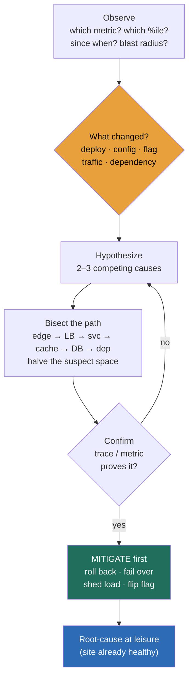

### Learning objectives
- Understand why this module carries **two distinct probes**: the **diagnostic round** ("the service is down, walk me through it"), which tests structured reasoning under uncertainty, and the **operational-leadership** probe ("how do you run on-call and incidents for a large org"), which tests the detect/respond/learn system you build; this lesson owns the first.
- Run the **diagnostic loop** as a discipline, observe symptoms and blast-radius, form hypotheses, **bisect** the system to localize, confirm, **mitigate**, and only then root-cause, instead of flailing at the first knob you can reach.
- Triage every incident with **"what changed?"** first (a deploy, a config flip, a traffic shift, a dependency degrading), because most outages trace to a change, and answer **"is it us or a downstream dependency?"** before you touch your own code.
- **Bisect the request path** like a binary search, edge → LB → service → cache → DB → dependency, halving the suspect space at each hop instead of inspecting components at random, and use **differential diagnosis** ("what is *different*, since when, which region, which cohort, which version") to localize fast.
- Reason in **MTTR decomposed** (time-to-detect + time-to-diagnose + time-to-mitigate) and weigh the central trade, **mitigate-first vs root-cause-first**, knowing the cost of a wrong fix that prolongs the outage.

### Intuition first
A senior ER doctor and a panicking intern see the same patient. The intern grabs the first plausible cause, "looks like a heart attack," and starts treating it before anyone has confirmed anything, so when the chart says it was a pulmonary embolism, twenty minutes are gone and the patient is worse. The senior doctor does the boring thing that saves the life: **observe the vitals, ask what changed (new medication? since when? sudden or gradual?), narrow the field by elimination, and stabilize the patient before chasing the perfect diagnosis.** Stop the bleeding first; the autopsy can wait, and it isn't an autopsy if the patient lives.

That image is the entire diagnostic round. The interviewer is not asking you to *design* anything, the system already exists and it's on fire, they're watching whether you reason under uncertainty like the senior doctor or thrash like the intern. **The method beats the cleverness.** The strong candidate slows down, asks what changed, bisects the system to *localize* the failure before fixing anything, and mitigates (rolls back, sheds load, fails over) to stop the user pain before settling in to find the true cause at leisure. The weak candidate jumps straight to a fix, "probably the database, let me bump the connection pool," with no hypothesis and no evidence, and spends the interview tuning knobs on an organ that was never sick.

### Deep explanation

**The diagnostic round tests a different muscle than the rest of this course, and naming that is the first Director move.** Every other module asks you to build a system from a blank page. This one hands you a running system and a symptom and asks you to think. The signal being scored is **structured reasoning under uncertainty**: can you stay calm, externalize a method, and converge, or do you panic and flail? The single most common failure is not ignorance of distributed systems, it's **fixing before localizing**, reaching for a remedy before you know which component is even sick. So the discipline below is the answer to "walk me through how you'd investigate," and you should literally narrate it out loud in the interview.

**The loop is observe → hypothesize → bisect → confirm → mitigate → root-cause, and the order is the whole point.** Each step has a job:

- **Observe.** Pin the symptom to numbers before theorizing. *Which* metric moved, latency, errors, saturation, throughput? *Which percentile*, the p50 or just the p99 tail? *Since when*, a sharp cliff at 14:32 or a slow drift over an hour? *What's the blast radius*, all users or one region, one cohort, one API, one tenant? A symptom with no shape ("it's slow") cannot be diagnosed; a symptom with shape ("p99 checkout latency doubled in eu-west only, starting 14:32") nearly diagnoses itself.
- **Hypothesize.** Form two or three *competing* explanations, not one. The discipline of listing alternatives is what protects you from anchoring on the first guess. "Either the new deploy regressed, or the payments dependency is degrading, or a traffic spike saturated a pool", now you have a field to narrow.
- **Bisect.** Cut the suspect space in half rather than inspecting components one by one. This is the highest-leverage step and gets its own treatment below.
- **Confirm.** Prove the hypothesis with evidence before acting on it. A trace showing the time is spent in the payments call, an error-rate graph that lines up exactly with the deploy timestamp. Acting on an unconfirmed guess is how you apply the wrong fix.
- **Mitigate.** Stop the user pain *now*, decoupled from understanding it fully. Roll back, fail over, shed load, flip the feature flag. The patient is stable; the bleeding has stopped.
- **Root-cause.** *Only now*, with the site healthy, do you find the true cause and the durable fix, calmly, with no clock on it.

**Triage with "what changed?" before anything else, because the base rate says you'll be right.** The overwhelming majority of production incidents, the practitioner figure most teams quote is on the order of **70–80%**, are triggered by a *change*: a deploy, a config flip, a feature-flag rollout, a schema migration, an infra change, a traffic shift, or a dependency that started degrading. So the first question after you've pinned the symptom's *shape* is *"what changed around 14:32?"* You pull the deploy log, the config-change feed, the flag-flip history, and the upstream status pages, and you line them up against the symptom's start time. A deploy 20 minutes before a latency cliff is not a coincidence, it's your prime suspect, and it's *cheap to test* because you can roll it back. The candidate who never asks "what changed" is electing to debug the hard way, reasoning from first principles about code that was working fine an hour ago.

**Answer "is it us or a downstream dependency?" early, because it routes the entire investigation.** Your service rarely lives alone, it calls a database, a cache, a payment gateway, an auth provider, a dozen internal services. If the fault is *theirs*, no amount of staring at your own code will find it, and the fix is failover or a circuit breaker, not a code change. You answer this with the **blast-radius and differential signal**: is the error confined to calls that touch the suspect dependency? Does the dependency's own latency/error metric move in lockstep? Does its status page or your synthetic check show degradation? Localizing the fault to "us vs them" before diving deep is what stops you from spending the outage tuning a healthy service.

**Bisect the request path like a binary search, halving the suspect space at every hop.** A request flows through a chain: client → edge/CDN → load balancer → gateway → your service → cache → database → downstream dependency. With *n* hops, inspecting them one at a time is O(n); bisecting is O(log n), and on a real path of 6–10 hops that's the difference between checking eight things and checking three. The mechanic: find a vantage point in the *middle* of the chain and ask "is the problem upstream or downstream of here?" A distributed trace makes this nearly free, it already shows you the per-hop latency breakdown, so you read off which span added the milliseconds and recurse into *that* hop. Without tracing, you bisect with whatever you have: does the load balancer's own latency metric show the delay (problem is at or below the LB) or not (problem is above it, at the edge)? Either way you're cutting the field in half, not walking it linearly.

**Differential diagnosis localizes by asking what is *different*.** Borrowed from medicine: you don't ask "what's wrong," you ask "what distinguishes the sick population from the healthy one." The four axes that crack most incidents are **since when** (timestamp → correlate to a change), **which region/zone** (one region → infra or a regional dependency; all regions → global change or shared dependency), **which cohort/tenant** (one customer → their data or config; one device/app version → a client bug), and **which build/version** (the symptom appears only on the canary → the new code is the cause). Each "what's different" answer prunes the hypothesis tree. "p99 only, eu-west only, only on app version 4.2, starting 14:32" is four cuts that often point at exactly one suspect before you've read a single line of code.

**Mitigate before root-causing, and own the trade explicitly.** This is the decision the round is really testing, and it has a real cost on both sides. **Mitigate-first** (roll back, fail over, shed load) stops user pain in minutes but may *destroy the evidence* you'd need to root-cause, and it treats the symptom without proving the cause. **Root-cause-first** gives you certainty and a durable fix but keeps the site burning while you investigate, and every minute of an outage is revenue, trust, and SLO budget gone. The Director default is unambiguous: **stop the bleeding first.** If users are in pain and you have a safe mitigation (a rollback to a known-good state), you take it, *then* root-cause from logs and traces you captured. You hold root-cause-first only when there's no safe mitigation, or when mitigating would corrupt data, or when the blast radius is tiny and the diagnostic value of the live failure is high. The number that disciplines this: **MTTR = time-to-detect + time-to-diagnose + time-to-mitigate.** Mitigate-first deliberately shrinks time-to-mitigate by deferring the slow part (full diagnosis) to after recovery, and that's usually the right call, because a wrong fix that prolongs the outage can easily *double* MTTR, you spend ten minutes applying it, ten confirming it didn't work, and you're now further from a clean rollback than when you started.

**The cognitive traps are the real adversary, name them so you can resist them out loud.** **Anchoring** is locking onto the first hypothesis and ignoring disconfirming evidence, the cure is forcing yourself to list two or three competing causes up front. **Symptom-fixing** is treating the visible effect (restart the box, bump the pool) instead of the cause, which masks the problem until it returns worse. **Confirmation bias** is reading the graphs that support your guess and skipping the ones that don't. **Fixing while still in the dark** is the meta-trap this whole method exists to prevent: acting before you've localized. A Director who says "my first instinct is the database, but before I touch it let me confirm it's not the new deploy or the payments dependency" is demonstrating, in one sentence, that they know the traps and have a method to beat them.

Go deeper — USE/RED as localization tools, and the math of bisecting (IC depth, optional)

- **The USE method (Brendan Gregg), for resources.** For every resource (CPU, memory, disk, network, connection pools, thread pools), check three things: **U**tilization (how busy, % time the resource was serving), **S**aturation (how much queued work is waiting, run-queue length, pool wait time), and **E**rrors (error counts). USE is for answering "which resource is the bottleneck?" A pool at 100% utilization with a growing saturation queue is your culprit, you found it without guessing. It's exhaustive by construction: walk every resource, and the saturated one reveals itself.

- **The RED method (Tom Wilkie), for services/requests.** For every service, watch **R**ate (requests/sec), **E**rrors (failed requests/sec), and **D**uration (latency distribution, p50/p90/p99). RED is for answering "which *service* is unhealthy and how?" It maps cleanly onto bisecting the request path: pull RED for each hop's service and the one whose Duration jumped (or Errors spiked) is where you recurse. USE finds *which resource* inside a box is sick; RED finds *which box* in the chain is sick. Use RED to bisect the path, then USE to localize inside the guilty box.

- **The math of bisecting.** A request path with *n* hops has *n* possible fault locations. Linear inspection is expected *n*/2 checks; binary search is ⌈log₂ n⌉ checks. For a 10-hop path: ~5 checks linear vs ~4 worst-case bisecting, modest. The real win is at scale and with *fan-out*: a service calling 20 downstreams, each calling more, is a tree of hundreds of spans, and a trace that lets you jump to the slowest subtree turns a hopeless linear hunt into a handful of recursions. The trace *is* the bisection, pre-computed.

- **The four-axes differential as a decision tree.** Each axis is a binary-ish cut: time (before/after a change), space (one region/all), population (one cohort/all), version (canary/baseline). Four independent cuts can partition the space into up to 2⁴ = 16 cells, and the symptom usually falls into exactly one, which is why "p99, eu-west, app 4.2, since 14:32" is so diagnostic, it's the intersection of four prunings.

### Diagram: the diagnostic loop and bisecting the request path

### Worked example: "checkout latency just doubled," walked live
The interviewer says: *"Your checkout p99 just doubled from 400ms to 800ms. Walk me through it."* Here is the method out loud, which is exactly how you'd narrate it.

- **Observe.** First I pin the shape. *Which percentile*, is it p50 too or just the p99 tail? Say it's the tail: p50 is flat, p99 doubled, so most requests are fine and a *subset* is slow, which points at contention or one slow dependency rather than a global regression. *Which region*, dashboards say eu-west only, us-east is healthy. *Since when*, a sharp cliff at 14:32, not a drift. Blast radius: checkout only, browse and search are fine. I now have a tightly shaped symptom, half the diagnosis is in the shape.
- **What changed?** Before I theorize about my code, I ask what changed near 14:32 in eu-west. I pull the deploy log: there was a checkout-service deploy at **14:10**, twenty minutes before the cliff, rolled out region-by-region, eu-west last. The timing and the region both line up. That is now my prime suspect, *rejected (for now): a traffic spike*, because rate is flat on the dashboards, and *rejected: a global config change*, because only eu-west is affected.
- **Hypothesize.** Two competing causes survive: (a) the 14:10 deploy regressed something in the checkout path, or (b) a downstream dependency the deploy newly leans on, most likely the **payments** call, started degrading. I won't pick yet, I'll let the bisect decide.
- **Bisect.** Rather than read the diff, I open a distributed trace for a slow eu-west checkout request and read the per-hop breakdown. The LB and gateway spans are normal; the checkout-service span is where the extra 400ms lives, and *inside* it, the **payments-gateway call** went from 80ms to 480ms. The slowness is one hop, the payments call. That single trace did the binary search for me.
- **Confirm.** I cross-check: the payments call's own RED metrics show Duration up 6× in eu-west since 14:32, and the deploy added a *synchronous* call to a new payments endpoint. Cause confirmed, the new code added a slow, synchronous payments hop on the critical path. It's *us* (our deploy) interacting with *them* (a slow endpoint), not a pure dependency outage.
- **Mitigate.** Users are in pain *now*, so I stop the bleeding before I fix anything properly: **roll back the 14:10 deploy** in eu-west to the known-good build. p99 should return to 400ms within the rollout window. *Rejected: roll forward a hotfix*, because writing, reviewing, and deploying a fix takes 30–60 minutes while the site bleeds, whereas a rollback is a known-good state in minutes. *Rejected: fix-in-place by bumping a timeout*, that treats the symptom and leaves the slow synchronous hop on the critical path.
- **Root-cause, at leisure.** Site healthy, clock off. The durable fix isn't "never call payments", it's making that call *not* block checkout: move it async, add a circuit breaker and a fast timeout, or pre-authorize earlier in the flow. That ships through normal review, not under fire.

The sentence a Director ends on isn't "I'd check the database." It's *"shaped the symptom, asked what changed, bisected to the payments hop, rolled back to stop the pain, and the real fix is to take that call off the synchronous path, shipped calmly."*

### Trade-offs table: mitigate-first vs root-cause-first, and rollback vs roll-forward vs fix-in-place
| Approach | Speed to recover | User-pain risk | Certainty it's fixed | Use when… |
|---|---|---|---|---|
| **Mitigate-first** | fast (minutes) | low, bleeding stops now | low, cause not yet proven | users are in pain and a safe mitigation exists; the default |
| **Root-cause-first** | slow (site burns while you dig) | high, outage continues | high, you fix the real thing | no safe mitigation, or mitigating would corrupt data |
| **Rollback** | fastest, known-good state | lowest | high *if* a deploy is the cause | a recent change is the suspect and rollback is safe |
| **Roll-forward (hotfix)** | slow, 30–60 min to ship | high while you write it | medium, new code, new risk | no clean rollback (e.g. an irreversible migration ran) |
| **Fix-in-place (tune a knob)** | fast | medium | low, often masks not fixes | a config value is provably the cause, not a code path |

The Director move is to default to **mitigate-first via rollback**, and to name *why* you're not rolling forward (it keeps the site down longer for unproven gain) and not fixing-in-place (it treats the symptom).

### What interviewers probe here
- **"Latency doubled / the service is down, walk me through how you'd investigate."** *Strong signal:* externalizes a method, observe and shape the symptom (percentile, region, since-when, blast radius), ask **what changed**, bisect the path to *localize* before touching anything, then **mitigate before root-causing**, all narrated calmly. *Red flag:* jumps straight to a fix ("probably the DB, bump the pool"), no hypothesis, randomly tunes knobs, never asks what changed, never localizes.
- **"How do you decide between rolling back and pushing a fix forward?"** *Strong:* default to rollback because it's a known-good state reachable in minutes while a hotfix takes 30–60 and adds new risk; reasons in MTTR and names when roll-forward is forced (an irreversible migration ran). *Red flag:* "I'd just fix the bug", missing that the site is bleeding while they write it, and that mitigation is decoupled from cause.
- **"How would you even know whether it's your service or a dependency?"** *Strong:* uses blast-radius and differential signal, is the error confined to calls touching that dependency, does its own latency/error metric move in lockstep, what does its status page say, and localizes us-vs-them *before* diving into either. *Red flag:* assumes it's their own code and burns the outage reading a diff while a downstream is the actual culprit.
- **"You've mitigated and the site is healthy. What now, and who's doing what?"** *Strong:* root-cause calmly from captured logs/traces, ship the durable fix through normal review, and treats the org system as the real answer, this is where the operational-leadership half lives, blameless postmortem, action items, and the detection gap that let it run for N minutes. *Red flag:* declares victory at mitigation with no learning loop, guaranteeing the same incident recurs.

The through-line at Director altitude: the diagnostic round scores **method under uncertainty**, observe → what-changed → bisect → confirm → mitigate → root-cause, and the operational half scores the **system** that makes the next outage survivable without you in the room. I'd reason the live outage out loud myself, and delegate the deep forensics with a stated prior, "I'd have the on-call lead drive the trace-level root-cause while I run comms and the mitigate/rollback call; my prior is it's the 14:10 deploy given the timing and region, so we roll back first and confirm second."

### Common mistakes / misconceptions
- **Fixing before localizing.** Reaching for a remedy before you know which component is sick, the intern's mistake; you can apply three correct fixes to the wrong organ. Localize first, always.
- **Anchoring on the first hypothesis.** Locking onto your initial guess and reading only the evidence that supports it; the cure is forcing yourself to list two or three competing causes before you bisect.
- **Never asking "what changed."** Debugging working code from first principles when a deploy, flag, or config flip 20 minutes ago is the cheap, likely answer; ~70–80% of incidents trace to a change.
- **Ignoring blast-radius and differential signal.** Diving into code without first reading *which* percentile, region, cohort, and version are affected; those four cuts often localize the fault before you open an editor.
- **Root-causing while the site is still burning.** Insisting on full certainty while users suffer and SLO budget drains; stop the bleeding with a safe mitigation, then root-cause with the clock off.

### Practice questions

**Q1.** Your API's error rate jumped from 0.1% to 4% at 09:15, across all regions. Walk through your first five minutes.
> *Model:* I shape it first, all regions and a sharp 09:15 cliff means it's almost certainly a *global change*, not a regional infra fault, so I pull the change feed for 09:00–09:15: deploys, config pushes, flag flips, migrations. I form competing hypotheses, a bad deploy, a config change, or a shared dependency (auth, a gateway) degrading, and I check the dependency status pages in parallel since "all regions" also fits a shared-dependency failure. I bisect with a trace on a failing request to see whether the errors originate in my service or a downstream call. If a deploy or flag at 09:10 lines up, that's my suspect and it's cheap to test, I **roll it back / flip the flag off** to mitigate, watch the error rate fall, and only then root-cause. The whole first five minutes is shaping, what-changed, and localizing, not fixing.

**Q2.** You believe a recent deploy caused an outage. Make the case for rolling back rather than writing a quick fix, with numbers.
> *Model:* Rollback returns the system to a *known-good* state in roughly the rollout window, call it 3–5 minutes, with near-zero new risk because that build was healthy minutes ago. A roll-forward hotfix means write + review + build + deploy, realistically 30–60 minutes, during which the site keeps bleeding, and it introduces *new* untested code under fire, so it can fail and *add* a cycle. In MTTR terms (detect + diagnose + mitigate), rollback collapses time-to-mitigate to minutes; a hotfix can double total MTTR if it's wrong. So I roll back to stop user pain, then fix forward calmly through normal review. The only time I'm forced to roll forward is when rollback isn't safe, e.g. an irreversible schema migration already ran, and then I'd say so explicitly and weigh a forward-only mitigation.

**Q3.** Mid-incident, a senior engineer is certain it's the database and wants to fail over to the replica. You're not convinced. How do you handle it at Director altitude?
> *Model:* I don't overrule on authority, I ask for the *confirming evidence* the method requires, because failing over the database is a high-blast-radius action and we should be sure before we take it. "What's different that points at the DB, since when, which queries, do the DB's own RED/USE metrics (latency, saturation, connection pool) actually show the problem, or is that inferred?" If a trace shows the latency is in the DB hop and its saturation is pegged, great, we mitigate. If the trace shows the time is in a downstream call and the DB looks healthy, failing it over does nothing and adds risk. This is the anti-anchoring move done as a leader: I'm protecting the team from acting on an unconfirmed first hypothesis, and I'm modeling that mitigations follow evidence, not the loudest voice, while still moving fast.

**Q4.** Why is "what's different, and since when" often more powerful than deep knowledge of the system internals during an incident?
> *Model:* Because most incidents are *change-induced* on a system that was healthy minutes ago, so the fault isn't in the steady-state design you'd reason about from internals, it's in the delta. Differential signal, since when (correlate to a change), which region (regional vs global), which cohort (data/config vs code), which version (canary vs baseline), partitions the suspect space fast and *cheaply*, four cuts can isolate one suspect before you read any code. Deep internals knowledge matters for the *root-cause* phase, but for *localizing* under time pressure, the delta tells you where to look. The Director framing: I want the method that converges fastest with the least guessing, and "what changed and what's different" is that method; deep expertise then makes the confirmed fix correct and durable.

### Key takeaways
- **The diagnostic round tests method, not design:** structured reasoning under uncertainty, run the loop, observe → hypothesize → bisect → confirm → mitigate → root-cause, calmly and out loud, and the failure mode being watched for is *fixing before localizing*.
- **Triage with "what changed?" first:** ~70–80% of incidents trace to a deploy, config flip, flag, traffic shift, or degrading dependency, so line the change feed up against the symptom's start time before reasoning about code that was fine an hour ago, and answer **"us or downstream?"** early.
- **Bisect the request path like a binary search:** edge → LB → service → cache → DB → dependency, halving the suspect space at each hop (O(log n), not O(n)); a distributed trace does the bisection for you, read off the guilty span and recurse.
- **Mitigate before root-causing:** stop user pain with a safe mitigation (rollback is the default known-good state) *then* find the true cause with the clock off; MTTR = detect + diagnose + mitigate, and a wrong fix can double it.
- **Name and beat the cognitive traps:** anchoring on the first guess, symptom-fixing, confirmation bias, acting before localizing; the cure is two-to-three competing hypotheses up front and evidence before action.

> **Spaced-repetition recap:** This module carries two probes, the **diagnostic round** (this lesson) tests structured reasoning under uncertainty, the **operational-leadership** probe tests the detect/respond/learn system. The diagnostic method is a loop, **observe** the symptom's shape (which %ile, which region, since when, blast radius) → ask **what changed** (~70–80% of incidents are change-induced; us-or-downstream?) → **bisect** the request path like a binary search (a trace does it for you) → **confirm** with evidence → **mitigate first** (rollback = known-good in minutes; root-cause later with the clock off) → **root-cause** at leisure. MTTR = detect + diagnose + mitigate, and a wrong fix can double it. The fatal error is **fixing before localizing**; beat anchoring with competing hypotheses and evidence before action.

---

*End of Lesson 13.1. The diagnostic round rewards a disciplined method over cleverness: shape the symptom, ask what changed, bisect to localize, mitigate before you root-cause, all reasoned calmly out loud.*
