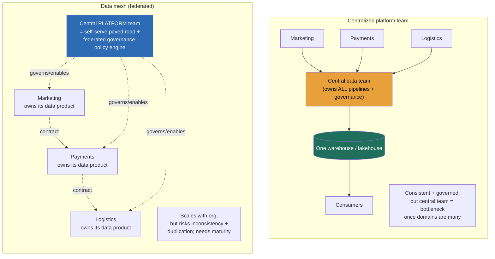

### Learning objectives
- State the **governance plane as four questions a platform must answer at scale**, *can I find it, am I allowed to see it, can I trace where it came from, who owns its quality*, and recognize that these are organizational problems wearing a technical mask.
- Design a **data catalog** as the discovery and metadata layer (what tables exist, what they mean, who owns them) and make it the **governance chokepoint** where access control, classification, and lineage converge, not three disconnected tools.
- Reason about **fine-grained access control**, column-level and row-level security, PII tagging, masking, and audit, as a *policy-count* problem that explodes with datasets × roles, and decide where coarse table-level grants are still the right call.
- Treat **column-level lineage** as the trust-and-compliance backbone, trace a metric back to its source for debugging, impact analysis ("what breaks if I change this column?"), and audit ("prove this number's provenance").
- Make the **centralized-platform-team vs decentralized-data-mesh** decision on the org axis, recognize when a central team becomes the bottleneck (the *only* condition that justifies mesh), and reject mesh-as-cargo-cult at small scale, with **data contracts** as the inter-domain interface either way.

### Intuition first
Picture the platform once it has succeeded, **thousands of tables, hundreds of dashboards, dozens of teams all writing and reading.** The hard problems are no longer "is the scan fast" or "is the format open" (13.1, 13.2). They are the problems of a **large public library that grew without a librarian.** Walk in and four things go wrong at once. You can't *find* the book you need, there's no card catalog, so you ask around and someone points you at a shelf that might be right. You're not sure you're *allowed* to read it, some sections hold sealed records and nobody checks who opens them. When you finally cite a passage, you can't *prove where it came from*, the book quotes another book that quotes a third, and the trail is lost. And when a passage turns out to be wrong, there's *no one to blame or fix it*, because no author's name is on the spine. A library with a million books and no librarian, no catalog, no access desk, and no citations is not a library, it's a warehouse you can get lost in.

The governance plane is the **librarian function.** The **catalog** is the card catalog plus the index of what every book means and who wrote it, *discovery*. The **access desk** checks your badge at the door and redacts the sealed pages before handing the book over, *access control*. The **citation trail** lets you follow any quote back to its original source and forward to everything that cited it, *lineage*. And **ownership**, an author's name on every spine, is what makes "this is wrong" actionable instead of a shrug. The deep design question this forces is organizational: do you hire **one central librarian** who catalogs and shelves every book the whole institution produces (consistent, but one person can't keep up once the institution is large), or do you make **each department run its own well-run reading room to a shared standard** (scales with the institution, but risks every room cataloging differently)? That is the centralized-vs-data-mesh question, and it's a question about people and ownership, not about storage.

### Deep explanation

**The governance plane answers four questions, and they are organizational problems with technical surfaces.** The earlier lessons (13.1–13.8) built a platform that is fast, cheap, open, and rebuildable. None of that helps if a new analyst spends a day asking Slack "which table has revenue?", if anyone can read the PII column, if no one can prove where the board's number came from, or if a broken metric has no owner. **The Director-altitude statement: at scale, a data platform's hardest problems are organizational, can people *find* the right data, are they *allowed* to see it, can you *trace* a number's provenance, and *who owns* its quality, and the governance plane is the set of systems and ownership models that answer those four questions.** Each maps to a capability, *find* → catalog/discovery, *allowed* → access control, *trace* → lineage, *who owns* → ownership and contracts (13.9). They are usually built separately and that is the first mistake; they belong on one plane, anchored at the catalog.

**The data catalog is the discovery layer and the natural governance chokepoint.** A catalog is the **index of every dataset**, its schema, its meaning (descriptions, business definitions), its owner, its freshness and quality status, and its classification (does this hold PII?). Concretely it solves "what tables exist and what do they mean", a new hire searches `revenue` and finds the *one* authoritative `gold.finance_revenue` mart with its definition and owner, rather than guessing among forty tables with `rev` in the name. The deeper architectural point: **because every query and every access decision must consult the catalog to resolve a table, the catalog is the one place where access policy, PII classification, and lineage all naturally live.** This is why the modern catalogs, **Unity Catalog, AWS Glue Data Catalog, Apache Polaris / the Iceberg REST catalog** (14.1), Collibra/Alation on the enterprise side, are converging from "a searchable list of tables" into "the governance control plane." *The Director move: make the catalog the chokepoint, one place defines who-can-see-what and what-means-what, rather than scattering access rules across each query engine* (covered as the catalog design in 14.1, the full governance problem in 14.5).

**Access control at scale is a policy-count problem, and granularity is the central trade.** The naive model is **table-level grants**, role X can read table Y. It's simple and it's what every system does by default, but it's leaky, the moment one table holds both a public `region` column and a sensitive `ssn` column, or holds EU and US customers' rows together, a table-level grant is too blunt: it leaks the sensitive column or the out-of-jurisdiction rows to everyone who can read the table. The fix is **fine-grained access**, and it comes in three flavors that compose:
- **Column-level security**, grant `region`, `amount` but mask `ssn`, `email` for analysts; the column is the unit of policy.
- **Row-level security**, an EU-based analyst sees only EU customers' rows via a predicate attached to their role; the row is the unit.
- **Dynamic masking**, the column is visible but redacted (`***-**-1234`) for unprivileged roles, full value for privileged ones; same query, different result by identity.
The thing a Director must quantify is **the policy explosion**: with *thousands* of datasets and *dozens* of roles, hand-managed per-column, per-row grants reach **datasets × roles × columns** policies, tens of thousands of rules nobody can audit. The scaling answer is **tag-based / attribute-based policy**: classify columns once (tag a column `PII` at the catalog), then write *one* policy, "mask everything tagged `PII` for any role lacking `pii-reader`", that applies across every table automatically. **PII tagging plus audit logging** (who read what, when) is the table-stakes pair for any regulated domain (GDPR, HIPAA, SOC 2). The decision and its rejected alternative: **coarse table-level access** (simple, low policy count, but leaks at the column/row boundary) **versus fine-grained row/column-level** (secure, satisfies regulators, but a policy-count and complexity tax), and you *reject blanket fine-grained-everywhere for the unmanageable rule count*, applying it where data is genuinely sensitive (PII, financial, regulated) and keeping coarse grants where a table is uniformly safe.

**Data lineage is the trust-and-compliance backbone, and column-level lineage is the one that earns its keep.** Lineage is the **graph of how data flows**, which source tables and transforms produced a given table or column. **Table-level lineage** ("`gold.revenue` derives from `silver.orders` and `silver.refunds`") is useful; **column-level lineage** ("`gold.revenue.net_amount` = `orders.gross` − `refunds.amount`, traced through these three dbt models") is what makes three hard jobs tractable:
- **Trust / debugging**, when a VP asks "the revenue number looks wrong," lineage traces it back through every transform to the source columns, so you find the broken join or the timezone bug instead of guessing (the silent-wrong-number failure of 13.1).
- **Impact analysis**, before a source team renames `orders.amount`, lineage shows *every* downstream column, mart, and dashboard that breaks, turning a silent break into a planned migration (the contract-break problem of 13.9).
- **Compliance / provenance**, auditors and regulators demand "prove where this figure came from," and lineage is the answer; for GDPR, lineage finds *every* table derived from a user's data so a deletion propagates everywhere (14.1's erasure problem).
Lineage is captured automatically by parsing transform SQL (dbt, Spark) or emitted via a standard like **OpenLineage**, and surfaced in the catalog. *The Director framing: lineage is not documentation, it's the system that makes "trace it" and "what breaks if I change this" answerable in minutes instead of an archaeology project.*

**Then the org question the governance plane forces: who owns and operates all this, one central team or the domains?** This is **Conway's law applied to data** (8.x), the data architecture will mirror the org that builds it, so the org model *is* an architecture decision. Two models:

- **Centralized data platform team.** One team owns ingestion, the warehouse/lakehouse, the transforms, the catalog, and governance for the whole company. **Strength:** consistency, governance, and a single coherent platform, definitions don't drift, standards are uniform, there's one place accountable. **Weakness, and it's fatal at scale:** the central team becomes a **bottleneck** between every domain and its data. Every new dataset, every metric change, every pipeline waits in *their* queue; they lack the domain context to model the marketing or payments data well; and as the company grows to *dozens* of data-producing domains, a team of, say, 8–15 engineers cannot keep up with hundreds of requests, throughput collapses and quality suffers because they're modeling data they don't understand. You **reject centralized when the central team is provably the bottleneck**, long lead times, a deep backlog, domains routing around the platform, modeling errors from missing context.

- **Decentralized, data-as-a-product (data mesh).** Flip the ownership: each **domain owns its data as a product** (the payments team owns the payments datasets end to end, models them, guarantees their quality, publishes them for others to consume), governed by four principles, **domain ownership**, **data-as-a-product** (discoverable, addressable, trustworthy, with SLAs and an owner), **self-serve data platform** (the central team builds the *paved road*, tooling, storage, catalog, CI/CD, so domains can ship without reinventing it), and **federated computational governance** (global standards, classification, security, interoperability, encoded *as platform policy* and enforced automatically, not by a central review board). **Strength:** it scales with the org, domains own the data they understand best, no central queue. **Weakness, and it's why mesh is over-applied:** it risks **inconsistency** (every domain models and defines differently, "revenue" means three things again), **duplicated effort** (each domain rebuilds similar pipelines), and a real **maturity bar**, mesh demands strong platform tooling, disciplined domains, and genuine federated governance, and most organizations adopting it are **cargo-culting the term** without the scale or maturity that justifies it.

**The decision rule, and the rejected alternative on each side.** **Data mesh is justified when, and roughly only when, you have many data-producing domains, a large organization, and a central platform team that has become the demonstrable bottleneck.** Below that, **centralized is the right call**, a 30-person company with one data team does not have a Conway's-law problem; imposing mesh on it manufactures coordination overhead, inconsistency, and duplicated platforms to solve a bottleneck that doesn't exist. So you **reject centralized when it's the proven bottleneck across many domains** (it stops scaling and starves the org of data), and you **reject mesh as cargo-cult at small scale** (it adds federation cost and inconsistency risk with no bottleneck to relieve). The honest senior position is that this is a **spectrum, not a binary**, most successful large platforms run a **hybrid**: a central platform team owning the paved road, shared infrastructure, and the federated-governance policy *engine*, with domains owning their own data products on top. The platform team's job shifts from "build everyone's pipelines" to "build the road and enforce the standards everyone drives on."

**Data contracts are the inter-domain interface that makes either model safe.** Whether centralized or mesh, the boundary between a data producer and its consumers needs an **explicit, enforced schema-and-semantics agreement** (the producer guarantees this schema, these types, these freshness and quality SLAs; breaking changes are versioned), introduced in 13.9. In a centralized world the contract is internal hygiene; **in a mesh it is load-bearing**, it's the *only* thing keeping dozens of independently-owned data products interoperable, the API between domains. Federated computational governance is, concretely, the set of contracts and classification standards that every domain's data product must satisfy to join the mesh. *Reject "publish a table and let consumers figure out the schema" for an enforced contract*, because in a mesh the silent schema break (13.9) isn't one team's problem, it's a cross-domain outage with no central owner to catch it.

Go deeper — how lineage is captured and how tag-based policy is enforced (IC depth, optional)

- **Lineage capture.** Three mechanisms, in increasing fidelity: (1) **parse the transform code**, dbt builds a DAG from `ref()` calls (table-level, free); (2) **parse SQL ASTs**, tools resolve `SELECT a + b AS c` into column-level edges by analyzing the query plan (column-level, the useful tier); (3) **runtime emission**, engines emit lineage events to a standard like **OpenLineage** as jobs run, capturing even dynamic/programmatic transforms. The catalog ingests these and renders the graph. Column-level lineage across many engines is genuinely hard, the value is high but so is the engineering, which is why it's a buy-vs-build axis.
- **Tag-based / attribute-based access control (ABAC).** Instead of N×M explicit grants, you (1) **classify** columns with tags (`PII`, `financial`, `pci`), often auto-detected by scanning column values/names against patterns, (2) **tag identities** with attributes (`role=analyst`, `region=EU`, `clearance=pii-reader`), and (3) write **policies over tags**: "mask columns tagged `PII` unless the principal has `pii-reader`"; "row-filter where `row.region = principal.region`." One policy covers thousands of tables. This is how Unity Catalog, Glue/Lake Formation tag-based policies, and Snowflake masking/row-access policies all scale governance, the policy count goes from datasets×roles to roughly number-of-tags.
- **The masking-at-the-engine problem.** Fine-grained policy must be enforced *no matter which engine reads the open table* (Spark, Trino, the warehouse), or the lakehouse's open-format strength (14.1) becomes a governance hole. This is the strongest argument for the **catalog as the enforcement chokepoint** (e.g. a credential-vending catalog that hands engines only the columns/rows the principal may see), versus per-engine ACLs that drift.

### Diagram: centralized platform vs data mesh (the org-architecture contrast)

### Worked example: a metric goes wrong at a 40-domain company, and the governance plane earns its cost

A large marketplace runs **~6,000 tables** across **~40 data-producing domains** (payments, search, logistics, ads, growth, …). The board deck shows **GMV** (gross merchandise value); one quarter, finance says it's off by 4% from the settled ledger. Trace how each part of the governance plane does its job, and why the org model matters.

- **Find (catalog).** An analyst searches `gmv` in the catalog. Without it, she'd ask around and might pick the wrong one of several `gmv`-ish tables. With it, she lands on the *one* authoritative `gold.gmv_daily`, sees its owner (the **payments domain**), its definition ("booked order value, gross of refunds, in USD, by booking day"), and its freshness/quality status. **Discovery in seconds, not a day of Slack.**
- **Trace (column-level lineage).** She follows lineage from `gmv_daily.gmv` backward: it sums `silver.orders.amount`, which derives from a CDC feed of the payments OLTP (14.3), joined to an FX-rate table for currency conversion. The lineage graph shows the FX-rate table's last partition is two days stale, conversions used an old rate. **The 4% gap is a stale upstream dependency**, found by *tracing*, not guessing. (Had the question instead been "we want to change `orders.amount`'s type," the *same* lineage answers impact analysis, every one of the 30+ downstream marts and dashboards that would break.)
- **Allowed (access control).** `orders` contains a `card_last_four` column tagged `PII` in the catalog. The analyst, lacking `pii-reader`, sees it **masked** by a single tag-based policy, not by a hand-written grant on this one table; meanwhile every read is **audit-logged** for the next SOC 2 cycle. Coarse table-level access would have leaked the card data to anyone who could read `orders`.
- **Who owns (ownership + contract + org model).** Because the **payments domain owns `gmv_daily` as a data product**, there is a named owner accountable for the fix and the SLA, not a shrug. The FX dependency is governed by a **data contract**: the FX team guarantees daily freshness, and its breach is what the contract's freshness check should have caught (13.9). And here the org model bites, **at 40 domains, a single central team could never own GMV, FX, search, and ads data with enough context to model and operate each well**; the central team's right job is the paved road and the federated policy (the catalog, the PII-tag enforcement, the contract standard) that made every step above *work the same way across all 40 domains*.

The number a Director carries out: *"6,000 tables, 40 domains, and the reason a wrong metric was diagnosed in an afternoon, with the PII protected and the provenance provable, is the governance plane, catalog for discovery, column-level lineage for trust, tag-based policy for access, and domain ownership under federated governance for who-fixes-it. At this domain count, that's mesh-shaped; at 3 domains it would be a central team."*

### Trade-offs table: centralized platform vs data mesh vs hybrid

| Decision | Centralized platform team | Data mesh (federated, domain-owned) | Hybrid (central paved road + domain products) | Use when… |
|---|---|---|---|---|
| **Ownership** | one team owns all data + governance | each domain owns its data as a product | central owns platform + policy; domains own data | **Central** for few domains/small org; **Mesh** for many domains + central bottleneck; **Hybrid** as the realistic large-org end-state. |
| **Scales with org?** | no, central team is the bottleneck past ~dozens of domains | yes, ownership distributes with the org | yes, road scales centrally, data scales per-domain | **Mesh/Hybrid** once domain count outpaces a central team's throughput. |
| **Consistency risk** | low, one team, uniform definitions | high, domains model/define differently | medium, federated governance + contracts constrain drift | **Central** when consistency dominates and scale is small. |
| **Governance** | natural (one team) | hard, must be *computational/federated* (encoded as policy) | governed centrally, executed per-domain | **Hybrid/Mesh** require the catalog-as-chokepoint + tag-based policy to work. |
| **Main risk** | throughput collapse, missing domain context | inconsistency, duplication, **cargo-culting at small scale** | boundary disputes (what's central vs domain) | Reject **mesh** with no bottleneck; reject **central** when it provably can't scale. |

The Director move is choosing on the **org axis, not the tech axis**, count the data-producing domains and ask whether the central team is the proven bottleneck, then keep **data contracts** as the inter-domain interface whichever way you go.

### What interviewers probe here
- **"You have thousands of tables and a new analyst can't find anything. What's the system?"**, *Strong signal:* a **data catalog** as the discovery layer (searchable metadata, business definitions, owners, freshness/quality, PII classification), and the insight that the catalog is the natural **governance chokepoint** where access and lineage also live. *Red flag:* "write a wiki" or "they'll learn the tables", treating a scaling, organizational discovery problem as documentation.
- **"How do you give analysts revenue but not the PII in the same table, across thousands of tables and dozens of roles?"**, *Strong:* **column/row-level security + dynamic masking**, made manageable by **tag-based policy** (classify `PII` once, write one policy), because hand-managed grants explode as datasets × roles; plus audit logging. *Red flag:* table-level grants only (leaks the sensitive column), or per-table hand-written rules (the unmanageable policy count).
- **"The board's number is wrong, how do you find out why, and how do you know what a schema change will break?"**, *Strong:* **column-level lineage**, trace the metric back through transforms to source columns for debugging and provenance, and forward for impact analysis; lineage is the trust backbone, not documentation. *Red flag:* manual code-archaeology with no lineage, or treating correctness as given (the silent-wrong-number trap, 13.1).
- **"Should we adopt data mesh?"**, *Strong:* it's an **org decision (Conway's law)**, justified only with *many* data-producing domains and a central team that's the *proven* bottleneck; otherwise centralized is right, and most adoptions are cargo-culting the term; the realistic answer is a **hybrid** (central paved road + federated governance, domain-owned products) with **data contracts** as the interface. *Red flag:* "mesh is the modern way" with no notion of scale, or proposing mesh for a small org, manufacturing coordination cost to solve a bottleneck that doesn't exist.
- **"Buy a catalog or build one?"**, *Strong:* **buy/adopt** (Unity Catalog, Glue/Polaris, Collibra/Alation), governance, lineage, and access are commodity, undifferentiated heavy lifting; build only the thin glue; the differentiation is your *data and definitions*, not the catalog software. *Red flag:* proposing to build lineage and column-level masking from scratch as a side quest.

The through-line at Director altitude: **the platform's hardest problems at scale are organizational**, findability, access, provenance, and ownership, answered by a governance plane anchored at the catalog, and the centralized-vs-mesh choice is a Conway's-law org decision you make on domain count and bottleneck, not on hype. Delegate the catalog bake-off and lineage tooling with a stated prior ("platform team evaluates Unity Catalog vs an open Polaris/OpenLineage stack on our engine mix; my prior is the managed catalog for governance ergonomics unless lock-in is the binding constraint", the design problem is 14.5; leading the *org* through this is 13.13).

### Common mistakes / misconceptions
- **Treating catalog, access control, and lineage as three separate tools.** They belong on **one governance plane anchored at the catalog**, the catalog is the chokepoint every query consults, so access policy, PII classification, and lineage naturally converge there; scattering them across engines breaks enforcement and discovery.
- **Table-level access as the whole story.** A grant on a table that mixes a public column with PII, or EU with US rows, leaks; you need **column/row-level security and masking**, and you make it scale with **tag-based policy**, not thousands of hand-written grants.
- **Lineage as nice-to-have documentation.** It's the **trust, impact-analysis, and compliance backbone**, without column-level lineage you can't diagnose a wrong metric, predict a schema change's blast radius, or prove provenance to an auditor; you're doing archaeology every time.
- **Adopting data mesh as a trend.** Mesh solves *one* problem, a central team that's the bottleneck across *many* domains; below that scale it's **cargo-culting** that manufactures inconsistency, duplication, and coordination cost. Centralized is the correct call for small orgs.
- **Skipping data contracts in a mesh.** Without an enforced inter-domain **contract** (schema + semantics + SLA, versioned), a producer's silent schema change becomes a cross-domain outage with no central owner to catch it; the contract is the API between domains.

### Practice questions

**Q1.** Your company has grown from one product to twelve, each with its own engineering team, and the central data team's backlog is now ~4 months deep; domains have started building shadow pipelines to route around them. Diagnose the situation and recommend an org model.
> *Model:* This is the textbook **central-team-as-bottleneck** signal, a deep backlog, shadow pipelines, and a central team that lacks the domain context to model twelve products' data well. Conway's law (8.x) says the architecture should mirror the org, and the org is now twelve domains, so the data architecture should distribute ownership. I'd move toward **data mesh / hybrid**: each domain owns its data as a product (models it, guarantees its quality and freshness SLAs, publishes it), the former central team pivots to a **platform team owning the self-serve paved road** (storage, catalog, CI/CD, lineage) and the **federated governance policy engine** (classification, security, contract standards enforced as code), and **data contracts** become the load-bearing interface between domains. I would *not* go pure-mesh overnight, I'd start with the highest-throughput, most-blocked domains and keep shared dimensions (the company-wide `customer`, `date`) centrally owned to prevent definition drift. The decision is on the **org axis** (domain count + bottleneck), not the tech, and the shadow pipelines are the proof the bottleneck is real.

**Q2.** A 25-person startup with one data engineer asks you to set up "a data mesh because that's the modern architecture." What do you tell them?
> *Model:* I'd reject it, this is **mesh as cargo-cult**. Data mesh solves a Conway's-law bottleneck that appears when *many* data-producing domains overwhelm a *central* team; a 25-person startup has neither many domains nor a central team to bottleneck. Imposing mesh here manufactures the exact costs mesh trades for scale, inconsistency (everyone defines "revenue" differently), duplicated platforms, and federation overhead, to relieve a bottleneck that doesn't exist, and it demands a platform-tooling and governance maturity they don't have. The right call is **centralized**: one data engineer, one warehouse/lakehouse (14.1), a single set of governed definitions, and a catalog the moment table count makes discovery hard. I'd tell them to revisit mesh only when they have *dozens* of domains and the central function is provably the bottleneck, and to invest the saved energy in clean modeling and contracts now, which is what makes a *later* mesh possible.

**Q3.** Analysts need to query the `transactions` table, which holds `amount`, `merchant`, `card_number`, and `customer_country`. EU analysts must not see non-EU customers' rows, and no analyst may see raw card numbers. Design the access control, and explain why table-level grants fail.
> *Model:* Table-level grants fail because they're all-or-nothing on the whole table, granting read leaks both `card_number` and every country's rows to every analyst; denying it blocks the legitimate `amount`/`merchant` analysis. The fix composes three fine-grained controls, anchored at the **catalog as chokepoint**: (1) **column masking**, tag `card_number` as `PII` and write one tag-based policy that masks any `PII` column for roles lacking `pii-reader` (so analysts see `***-****-1234`); (2) **row-level security**, attach a predicate to the EU-analyst role so they see only rows where `customer_country` is in the EU set; (3) **audit logging** of every read for compliance. The key scaling move is **tag-based / attribute-based policy**, classify the column once and write the policy once so it applies across all tables, rather than hand-writing a grant per table (which becomes datasets × roles × columns rules nobody can audit). And enforcement must be at the catalog/credential layer so it holds no matter which engine (Spark, Trino, the warehouse) reads the open table.

**Q4.** Six months after launch, a Director asks "where does the `active_users` number on the exec dashboard actually come from, and what happens if we rename the source `events.uid` column?" What capability answers both, and how?
> *Model:* **Column-level lineage** answers both. For provenance: lineage traces `active_users` backward through every transform, the dbt models that count distinct `uid`s, the silver table that cleaned the event stream, back to the source `events.uid` column, giving an auditable "this number comes from these sources via these transforms," which is the trust/compliance backbone (and what regulators demand). For the rename: the *same* lineage runs **forward** for **impact analysis**, listing every downstream column, mart, and dashboard that reads `events.uid`, so the rename becomes a *planned migration with a known blast radius* instead of a silent break that surfaces as broken dashboards days later (the contract-break problem, 13.9). Lineage is captured by parsing the transform SQL or via OpenLineage and surfaced in the catalog, it's a system, not documentation, and "we'd grep the codebase" is the red-flag answer because it misses runtime/dynamic transforms and column-level edges.

**Q5.** Argue both sides of "buy a data catalog vs build one," then make the call for a 6,000-table, multi-engine lakehouse.
> *Model:* **Build** buys you exact fit to your engines and metadata model and no license cost, but catalog capabilities, search, lineage capture (especially *column-level*, across multiple engines), tag-based access policy, audit, are genuinely hard, commodity, and undifferentiated, so building them is a large, ongoing side quest that competes with your actual mission. **Buy/adopt** (Unity Catalog, AWS Glue/Lake Formation, Apache Polaris + OpenLineage, or Collibra/Alation) gives you those as a product and lets you focus on what's differentiated, *your data and your definitions*. For a 6,000-table multi-engine lakehouse, I'd **adopt** a catalog that doubles as the governance chokepoint and integrates with the open table format (14.1), and build only thin glue (custom metadata, internal search UX). My stated prior for delegation: "platform team benchmarks the managed catalog vs an open Polaris/OpenLineage stack on our Spark+Trino+warehouse mix and our PII-masking needs; prior is the managed catalog for governance ergonomics unless open-format lock-in is the binding strategic constraint." The differentiation is never the catalog software, so building it is rarely the right use of the team.

### Key takeaways
- **At scale the hardest platform problems are organizational**, can people *find* the right data (catalog/discovery), are they *allowed* to see it (access control), can you *trace* a number's provenance (lineage), and *who owns* its quality (ownership/contracts). The governance plane answers these four, and they're people problems with technical surfaces.
- **The catalog is the discovery layer and the governance chokepoint.** Make it the one place that defines what-tables-mean, who-can-see-what, and where-data-came-from (Unity Catalog / Glue / Polaris), rather than three disconnected tools; every query consults it, so access and lineage belong there.
- **Access control is a policy-count problem.** Table-level grants leak at the column/row boundary; column/row-level security + dynamic masking fix it, and **tag-based (ABAC) policy** is what keeps it from exploding into datasets × roles × columns hand-written rules, with audit logging as the regulated-domain table stake.
- **Column-level lineage is the trust, impact-analysis, and compliance backbone**, trace a metric back to source to debug it and prove provenance, and forward to know a schema change's blast radius. It's a system (parse SQL / OpenLineage, surfaced in the catalog), not documentation.
- **Centralized vs data mesh is a Conway's-law org decision**, mesh (domain-owned data products + self-serve platform + federated computational governance + data contracts) is justified *only* with many domains and a central team that's the proven bottleneck; below that, centralized is right and mesh is cargo-cult. The realistic large-org answer is a **hybrid**, central paved road + federated policy, domain-owned products, with **contracts** as the inter-domain interface.

> **Spaced-repetition recap:** The governance plane is the **librarian** for a million-book library, four questions: *find it* (catalog/discovery, "what tables exist, what do they mean, who owns them"), *allowed to see it* (column/row-level security + masking + audit, scaled by **tag-based policy** because hand-grants explode as datasets × roles), *trace it* (**column-level lineage** for debugging a wrong metric, impact analysis on a schema change, and compliance/provenance, a system, not docs), and *who owns it* (ownership + **data contracts**, 13.9). The **catalog is the chokepoint** where access + lineage converge (Unity Catalog / Glue / Polaris); **buy, don't build** it. Then the org fork (**Conway's law**, 8.x): **centralized team** (consistent, governed, but the **bottleneck** past dozens of domains) vs **data mesh** (domain-owned data products, self-serve platform, federated computational governance, scales with the org but risks inconsistency/duplication and is **cargo-culted at small scale**). Decide on **domain count + bottleneck**, not hype; the realistic answer is a **hybrid** (central paved road + federated policy + domain products), with **contracts** as the inter-domain API. The full mesh/governance *design* problem is 14.5; leading the data *org* through it is 13.13. Next: the platform's cost and reliability discipline (13.11).

---

*End of Lesson 13.10. Governance is where the data platform's hardest problems turn out to be organizational, findability, access, provenance, and ownership, answered by a governance plane anchored at the catalog, and forcing the centralized-vs-mesh decision that is Conway's law applied to data. Next: 13.11, cost management and FinOps for the data platform, the discipline that keeps scan-cost and storage from becoming a runaway bill.*
