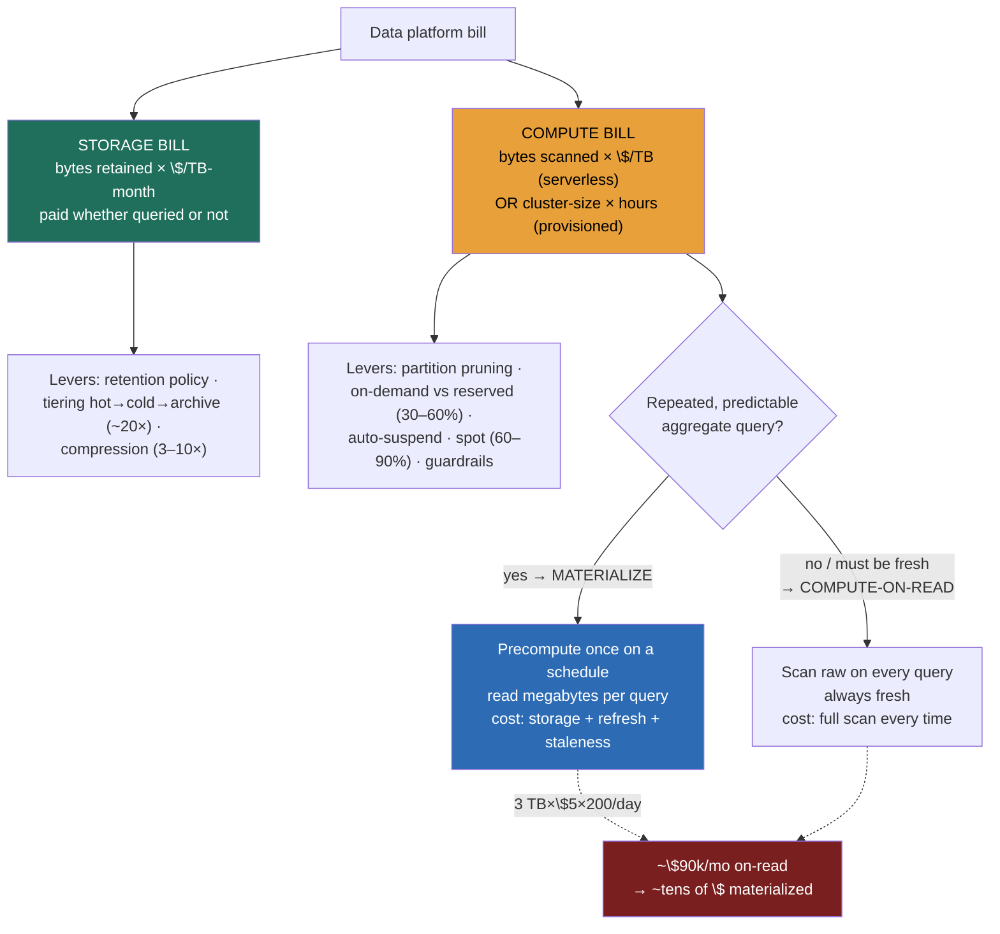

### Learning objectives
- Decompose the data-platform bill into **two decoupled bills**, **storage** (`$/TB-month`, set by retention, tiering, and compression) and **compute** (`bytes scanned × $/TB` on serverless, *or* `cluster-size × hours` on provisioned), and explain why analytical cost behaves nothing like the always-on OLTP server bill.
- Name the **runaway-cost failure mode**, one unpartitioned table, one accidental cross join, one `SELECT *` over a petabyte turning into a surprise five-figure bill, and why a single bad query, not steady traffic, is the thing that melts a budget.
- Apply the **cost levers** in order, each with its trade-off: partition pruning + clustering (scan less), pre-aggregation / materialized views (precompute vs recompute), on-demand/serverless vs provisioned+reserved (the utilization crossover), auto-suspend, the small-files tax, and spot/preemptible compute for batch.
- Make the four **money decisions** with their rejected alternatives: serverless vs reserved; materialize vs compute-on-read; aggressive tiering vs all-hot; chargeback vs central budget.
- Reason in **unit economics**, `$ per dashboard`, `$ per active user`, `$ per team`, and stand up **cost attribution, query guardrails, and quotas** so the platform is governable, not just observable.

### Intuition first
A data platform bills you like a **self-storage facility with a per-visit forklift fee**. There are two completely separate charges and they move independently. The first is **rent on the locker**: you pay every month for every box you keep, whether or not anyone opens it, and the rate depends on the unit, a climate-controlled unit near the door (hot storage) costs many times more than the dusty back-corner shelf (cold/archive). The second is the **forklift fee**: every time someone drives in to fetch something, you pay for how much they move around, and a careless visitor who drives the forklift through *every aisle* to grab one box on the way out runs up a bill that has nothing to do with how big the box was.

That image carries the whole lesson. **The two bills are decoupled**, so you cut them with different tools, rent comes down by *throwing boxes out or moving them to the cheap shelf* (retention, tiering, compression), the forklift fee comes down by *labeling the aisles so the driver goes straight to the box* (partitioning, columnar projection, pre-aggregation). **The expensive thing is the careless visit, not the storage**, a single `SELECT *` cross-join over a petabyte is the forklift driving every aisle, and it can cost more in one query than a month of rent. **You pay for the forklift two ways**, by the trip (serverless: pay per bytes moved) or by renting your own forklift by the hour (provisioned: pay for the machine whether it moves or sits), and which is cheaper depends entirely on how busy the facility is. And **nobody economizes a facility they don't get a bill for**, so until each team sees the rent and forklift fees *they* ran up (chargeback), the careless visits never stop. Get this picture right and FinOps for a data platform is just deciding, lever by lever, which charge you're attacking and what you give up to do it.

### Deep explanation

**The foundational fact: it's two bills, and they're decoupled.** The defining architectural move of the modern data platform, separating storage from compute (13.3), is also the defining fact of its *economics*. Unlike an OLTP server, where one box's price bundles CPU, memory, and disk into a single always-on line item, an analytical platform hands you **two independent bills that you control with two different sets of levers**:

- **The storage bill** is `bytes retained × $/TB-month`, paid continuously on cheap object storage (S3/GCS, 3.11) whether or not anyone queries the data. At roughly **$23/TB-month for hot S3-standard**, a petabyte of retained history is ~**$23k/month** sitting idle. This bill is set by **how much you keep and where you keep it**, retention policy, tiering, and compression, and it has nothing to do with query activity.
- **The compute bill** is set by **how much each query touches**, in one of two pricing shapes (the model from 13.1):
  > **Serverless / on-demand** (BigQuery, Athena): `cost ≈ bytes scanned × $/TB`. At ~**$5/TB scanned**, a query reading 1 TB costs **~$5**, and you pay nothing when no one queries.
  > **Provisioned** (Snowflake virtual warehouses, Spark/EMR, Databricks clusters): `cost ≈ cluster-size × hours running`, billed whether the cluster is working or idle, decoupled from the storage `$/TB-month`.

The Director-altitude statement: *server cost is one always-on number you reason about in QPS; analytical cost is two decoupled numbers, a standing storage rent set by policy, and a usage-driven compute bill set by data layout, and you attack each with its own levers, never with "buy a bigger box."* This is why 8.5's cost-cut-30-50% playbook lands so differently on a data platform than on a service fleet: the lever is layout and policy, not rightsizing instances.

**The runaway-cost failure mode is the thing that actually hurts.** On an OLTP system, cost creeps up with traffic and you see it coming. On a serverless analytical platform, **cost is dominated by single queries, and one bad one is a five-figure event with no warning.** The canonical disasters (the failure mode named in 13.1):

- An **unpartitioned table**, every query scans the full history because there's nothing to prune (13.2). A 500 TB table that *should* answer "yesterday's orders" by reading 2 TB instead reads all 500 TB: at $5/TB that's **$2,500 for one query** that should have cost $10.
- An **accidental cross join**, a missing join key turns a 10M × 10M row join into a 10¹⁴-row Cartesian explosion that scans and spills terabytes, melting a cluster or running a serverless bill into five figures before anyone notices.
- A **`SELECT *` over a petabyte** in a notebook, scheduled hourly by someone who forgot it was running, 24 PB/day at $5/TB is **$120k/day** from one forgotten cell.

The lesson: **the budget killer is not load, it's a single careless query**, which is why guardrails (per-query byte caps, quotas, `require_partition_filter`) are a *design concern*, not an afterthought, you cap the blast radius before it happens, because the bill arrives after.

**Lever 1, partition pruning + clustering (scan less, the highest-leverage move).** The dominant compute lever is cutting **bytes scanned per query**. Partition by the column queries filter on most (usually date) so a `WHERE day = '2026-06-22'` reads one day's files instead of all of history; cluster/sort within partitions so range and equality filters skip blocks via zone maps (13.2). A well-partitioned table turns a **$5/TB full scan into a $0.05 scan by reading 1% of the bytes.** *Trade-off:* partitioning by the wrong column (high cardinality like `user_id`, or a column queries don't filter on) creates the small-files problem (Lever 5) and prunes nothing; *rejected alternative:* leaving the table unpartitioned is simplest to write but is exactly the runaway-cost failure mode above. This is layout mechanics owned by 13.2, here it's the first dollar lever.

**Lever 2, pre-aggregation / materialized views (precompute vs recompute, the core money trade).** Most dashboards ask the *same* aggregate question repeatedly. You can answer it two ways, and the choice is a pure cost-shape decision:

- **Materialize / precompute** (a rollup table or materialized view, 13.8): compute the aggregate **once** on a schedule, store the small result, and let every dashboard read megabytes. *Trades away:* you now pay **storage** for the precomputed result, **refresh compute** to keep it current, and accept **staleness** between refreshes.
- **Compute-on-read**: run the aggregate fresh on every query against raw data. *Trades away:* you pay the **full scan cost on every single query**, forever.

The Director math (the lesson's signature number): a dashboard scanning a **3 TB events table on every refresh at $5/TB costs $15/query; at 200 refreshes/day that's ~$90k/month** for one dashboard. Pre-aggregate it into a daily rollup the dashboard reads, partitioned by day, and the dashboard scans **megabytes, tens of dollars/month**, a >1000× cut. *Rejected alternative:* compute-on-read is correct and always-fresh, and you keep it only where freshness genuinely beats cost (an ad-hoc exploration, a rarely-run query where the materialization's storage + refresh would cost more than the occasional scan). **Materialize the repeated, predictable, high-frequency query; compute-on-read the rare or always-must-be-fresh one.** (This echoes 11.8's caching trade, precompute is to scan cost what prompt caching is to token cost.)

**Lever 3, serverless/on-demand vs provisioned+reserved (the utilization crossover).** This is the same shape as the buy-vs-rent decision in 11.15 and the LLM batch decision in 11.8, applied to compute capacity:

- **Serverless / on-demand**: no commitment, pay strictly per byte scanned (or per-second of autoscaled compute), scales to zero when idle. *Trades away:* the per-unit price is the highest, and an unguarded workload can **spike** without limit (the runaway failure mode). Best when usage is **spiky, unpredictable, or low**, you pay only for what you touch and nothing for idle.
- **Provisioned + reserved/committed** (reserved capacity, committed-use discounts, annual commits): a **30–60% discount** off on-demand rates in exchange for committing to a baseline. *Trades away:* you **pay for the commitment whether or not you use it**, idle reserved capacity is pure waste. Best at **steady, high utilization**, where the committed baseline is genuinely saturated.

The crossover is utilization: **below ~60–70% sustained utilization, on-demand's pay-per-use usually wins; above it, the reserved discount beats paying on-demand for capacity you're using anyway.** The Director move (the same logic as 11.15): **reserve the predictable saturated baseline, burst the spiky top on on-demand**, don't commit to peak and eat the idle, and don't run a saturated 24/7 workload on premium on-demand rates. *Rejected alternative on each side:* all-on-demand at steady high load overpays the per-unit premium every hour; all-reserved sized to peak pays for idle capacity nights and weekends.

**Lever 4, auto-suspend / auto-scale (stop paying for idle compute).** On provisioned engines, the bill runs while the cluster is *up*, not while it's *working*. Configure **auto-suspend** (Snowflake warehouses suspend after N seconds idle; Spark/EMR clusters terminate when the job ends) and **auto-scale** (add nodes under load, shed them after). A warehouse left running 24/7 for a workload that's active 8 hours/day is **3× the necessary cost**, pure idle. *Trade-off:* aggressive auto-suspend adds **cold-start latency** (warehouse resume, cluster spin-up of seconds to minutes) on the first query after idle, and on Snowflake suspending also drops the local result/data cache; *rejected alternative:* keeping compute always-warm buys instant first-query latency at the cost of paying for every idle hour, worth it only for a latency-critical always-queried surface, never for a nightly batch.

**Lever 5, the small-files tax (pay attention or pay overhead).** Analytical engines are tuned for **large, columnar files** (~128 MB–1 GB Parquet). Streaming ingestion or over-partitioning produces millions of tiny files, and the engine then pays **per-file open/list/metadata overhead** that swamps the actual scan, a query over 1M tiny files can be **5–10× slower and pricier** than the same bytes in a few large files, plus inflated object-store request costs. The fix is **compaction** (periodically rewrite small files into large ones, Iceberg/Delta `OPTIMIZE`, 13.4/14.1). *Trade-off:* compaction is itself a compute job you schedule and pay for; *rejected alternative:* skipping it lets the tax compound until every query is dominated by file overhead. (Mechanics live in 13.4/14.1; here it's a recurring cost line you budget for.)

**Lever 6, spot/preemptible compute for batch (cheap cycles for interruptible work).** Cloud providers sell spare capacity at **60–90% off** on-demand as spot/preemptible instances, with the catch that they can be **reclaimed with ~2 minutes' notice.** For **interruptible batch**, nightly ETL, backfills (13.1's rebuildable property), corpus jobs, run the worker fleet on spot and let the orchestrator (13.7) retry reclaimed tasks; idempotent recompute makes this safe. *Trade-off:* you accept **interruption and variable availability**, so it's wrong for **anything latency-critical or stateful-and-uninterruptible** (an interactive warehouse, a streaming job that can't checkpoint cheaply); *rejected alternative:* running batch on guaranteed on-demand pays 3–5× for reliability the batch job doesn't need, since it can simply retry.

**Cost attribution, guardrails, and unit economics, making the bill governable.** Levers cut the bill; **governance keeps it cut.** Three practices, the data-platform analog of 11.8/11.16's FinOps:

- **Cost attribution / chargeback.** Tag every query, warehouse, and dataset with a **team/cost-center label** so the bill splits by who spent it. Without attribution, cost is a single central number nobody owns and everybody grows; with it, the team that wrote the $90k dashboard sees the $90k. *Trade-off below in the decisions table.*
- **Query guardrails / quotas.** Enforce **per-query byte caps** (`maximum_bytes_billed`), **`require_partition_filter`** so no one can full-scan a partitioned table by accident, **per-team daily/monthly spend quotas**, and **warehouse size limits**. These cap the blast radius of the runaway query *before* it runs.
- **Unit economics.** Track `$ per dashboard`, `$ per active user`, `$ per pipeline`, `$ per team`, not just the total. The total tells you the bill is $400k; the unit number tells you *one dashboard is $90k of it*, which is the line you actually act on, exactly as 11.8 designs `$/request` and `$/active-user` up front.

Go deeper, concrete pricing knobs, BigQuery vs Snowflake cost controls, compression math (IC depth, optional)

- **Storage tiers and pricing (order-of-magnitude, mid-2026, us-east):** S3 Standard ~**$23/TB-month**; S3 Standard-IA (infrequent access) ~**$12.5/TB-month** + a per-GB retrieval fee; S3 Glacier Flexible ~**$3.6/TB-month** with minutes-to-hours retrieval; Glacier Deep Archive ~**$1/TB-month** with 12-hour retrieval. The hot→archive spread is **~20×**, which is the entire case for tiering, and the retrieval fee + latency is the entire case against tiering data you actually query.
- **Compression as a storage *and* scan lever:** columnar formats (Parquet/ORC, 13.2) with dictionary + run-length + Zstd encoding routinely hit **3–10× compression** on real tabular data, because columnar values are homogeneous. That multiplies *both* bills: 3× compression is 3× less `$/TB-month` storage *and* 3× fewer bytes scanned per query (serverless bills the compressed bytes read). Choosing Zstd over Snappy trades a little more CPU at write time for meaningfully smaller files.
- **BigQuery (serverless) controls:** `maximum_bytes_billed` per query (hard cap, the query fails rather than overruns), `require_partition_filter = true` on the table (queries *must* filter the partition column), custom cost-control quotas per project/user/day, and the **dry-run** estimate (`--dry_run`) that returns bytes-to-be-scanned *before* you run, the cheapest guardrail is reading that number. BigQuery editions (Standard/Enterprise) with **slot reservations + autoscaling** are the provisioned alternative to pure on-demand `$/TB`, with committed-slot discounts, the crossover decision in Lever 3.
- **Snowflake (provisioned) controls:** warehouse **auto-suspend** (set to 60s for spiky, longer for steady), **auto-resume**, `STATEMENT_TIMEOUT_IN_SECONDS` to kill runaways, **resource monitors** with credit quotas and suspend-actions per warehouse, and right-sizing the warehouse T-shirt size (each size up *doubles* credits/hour, an XL is 16× an XS, justified only if it more-than-2× speeds the job, otherwise you're paying for idle parallelism). Multi-cluster warehouses scale out for concurrency, not single-query speed.
- **Reserved/committed shapes:** AWS Compute Savings Plans / Reserved Instances and GCP Committed Use Discounts give ~**30–60%** off for 1–3yr commits; Snowflake/Databricks sell pre-purchased capacity at a discount. The break-even rule of thumb: a 40%-off 1yr commit pays off if you'd otherwise run on-demand **>~60% of the year** at that baseline.

### Diagram: the two bills and the materialize-vs-scan-on-read trade

### Worked example: cutting a $400k/month analytics bill by 60%
A platform team inherits a Snowflake + S3 stack billing **~$400k/month** and a mandate to cut it (the 8.5 scenario, made numeric). They instrument attribution first, then pull levers in order of leverage.

- **Attribution reveals the shape.** Tagging warehouses and queries by team shows the $400k splits: **~$180k compute on one analytics warehouse**, ~$120k on ad-hoc/notebook compute, ~$70k storage (a 3 PB lake, all hot), ~$30k pipelines. The single biggest line is one warehouse, and a `$/dashboard` breakdown finds **one exec dashboard scanning a 3 TB raw table on every refresh, $15/scan × ~200/day ≈ $90k/month alone.**
- **Lever, materialize the runaway dashboard.** Pre-aggregate that dashboard's query into a daily rollup partitioned by day (13.8): it now scans megabytes, **~$90k → ~$200/month.** *Trade-off stated:* the dashboard is now up to an hour stale (refresh cadence), which the exec review tolerates, *rejected:* compute-on-read keeps it live but at $90k, indefensible for a once-a-morning glance.
- **Lever, auto-suspend + right-size the warehouses.** The analytics warehouse ran an XL 24/7 for an 8-hour active window. Drop to auto-suspend at 60s idle and right-size to L: idle hours stop billing, ~**$180k → ~$70k.** *Trade-off:* a few-second resume latency on the first morning query, accepted.
- **Lever, reserve the now-predictable baseline.** With the spikes materialized away and idle suspended, the remaining compute is a steady, saturated baseline, commit to it for a **~40% discount** (Lever 3 crossover, now that utilization is high): remaining ~$130k compute → **~$80k.** *Rejected:* committing *before* fixing the runaway would have reserved the waste.
- **Lever, tier the cold data.** Of 3 PB, ~80% is older than 90 days and rarely queried. Tier it S3-Standard → Glacier Flexible (~20× cheaper): **$70k → ~$20k storage.** *Trade-off:* a minutes-to-hours retrieval delay + retrieval fee on the rare cold query, acceptable for >90-day-old history; *rejected:* all-hot keeps every byte instantly queryable at 20× the rent for data nobody reads.
- **Spot for batch.** Move nightly ETL/backfill workers to preemptible (Lever 6): pipeline compute ~$30k → **~$12k**, retries absorb reclaims.

**Net: ~$400k → ~$160k, a ~60% cut**, with each cut naming what it traded (staleness, resume latency, cold-read delay, reclaim retries). The Director takeaway isn't "we saved money"; it's *"attribution found the $90k dashboard, layout and policy cut 60% with stated trade-offs, and guardrails (byte caps + `require_partition_filter` + per-team quotas) stop the next runaway before it bills."*

### Trade-offs table: the four data-platform money decisions
| Decision | Option A | Option B | Use when… |
|---|---|---|---|
| **Compute pricing** | **Serverless/on-demand**, no commit, pay-per-scan, scales to zero; *but* highest unit price + can spike unbounded | **Provisioned + reserved**, 30–60% off; *but* pays for the commit whether used or idle | A for spiky/unpredictable/low usage; **B above ~60–70% sustained utilization** (reserve the saturated baseline, burst the top on A) |
| **Aggregate serving** | **Materialize/precompute**, read MB/query; *but* storage + refresh cost + staleness | **Compute-on-read**, always fresh; *but* full scan cost every query | Materialize the **repeated, predictable, high-frequency** query; compute-on-read the **rare or must-be-live** one |
| **Storage placement** | **Aggressive tiering** hot→cold→archive, up to ~20× cheaper rent; *but* slow + per-GB retrieval fee on cold reads | **All-hot**, instant query on every byte; *but* pays hot rent (~$23/TB-mo) on cold data nobody reads | Tier by **access recency** (hot recent, archive >90-day history); all-hot only for genuinely frequently-queried data |
| **Cost ownership** | **Chargeback** per team, accountability, kills the runaway; *but* tagging/attribution overhead + can discourage exploration | **Central budget**, simple, no per-team plumbing; *but* no incentive, cost is everyone's-and-no-one's | Chargeback once spend is material and teams are autonomous; central budget for a small/early platform |

The Director move on every row: **match the cost shape to the access pattern**, reserve the saturated, materialize the repeated, tier the cold, charge back the material, and name the trade you're accepting (idle risk, staleness, retrieval delay, attribution overhead).

### What interviewers probe here
- **"Your data-platform bill doubled this quarter, find it and fix it."** *Strong signal:* instrument **attribution first** (split by team/warehouse/dashboard), find the **runaway query** (an unpartitioned scan, a forgotten hourly `SELECT *`, a 24/7 idle warehouse), then pull levers in leverage order, materialize the repeated, partition to prune, auto-suspend the idle, reserve the saturated baseline, each with a stated trade-off and a quantified saving. *Red flag:* "scale down the cluster" with no attribution, no notion that one query can be the whole overrun, and no number.
- **"On-demand or reserved capacity for this workload?"** *Strong:* it's the **utilization crossover**, reserve the predictable saturated baseline (30–60% off), burst the spiky top on on-demand; commit *after* fixing waste, not before. *Red flag:* commits to peak (pays for idle) or runs a steady 24/7 workload on premium on-demand (overpays the per-unit premium) with no utilization math.
- **"This dashboard costs $90k/month, what do you do?"** *Strong:* recognizes the **scan-on-read trap**, **pre-aggregates** into a partitioned rollup the dashboard reads (MB not TB, >1000× cut), names the **staleness trade**, and adds a **byte cap / `require_partition_filter`** so the next one can't recur. *Red flag:* "add a cache" or "bigger warehouse", neither cuts bytes scanned, which is what sets the bill.
- **"How do you stop the next surprise five-figure query?"** *Strong:* guardrails as a design concern, **per-query `maximum_bytes_billed`**, **`require_partition_filter`**, **per-team spend quotas**, **resource monitors / statement timeouts**, and a **dry-run estimate** in the workflow, cap the blast radius *before* the bill. *Red flag:* "we'll review the bill monthly," i.e. detect the disaster after it's already charged.

The through-line at Director altitude: **the platform has two decoupled bills, both controlled by layout and policy, not hardware.** Say "I'd have the platform team stand up cost attribution and per-team quotas behind the warehouse, then materialize the top-spend dashboards and tier cold storage; my prior is we cut 40–60% on layout and policy before we touch a single instance type" (8.5, 14.1) rather than reaching for rightsizing first.

### Common mistakes / misconceptions
- **Treating it like one always-on server bill.** It's **two decoupled bills**, storage rent set by retention/tiering, compute set by bytes scanned or cluster-hours, and conflating them (or reasoning in QPS) sends you to the wrong lever every time.
- **Thinking steady traffic is the cost risk.** The budget killer is a **single runaway query**, an unpartitioned scan, a cross join, a forgotten `SELECT *`, not aggregate load; without per-query guardrails you discover it on the invoice.
- **Reaching for a cache or a bigger box.** Neither cuts **bytes scanned**, which sets the serverless bill; the levers are **partition pruning + pre-aggregation** (scan less) and **right-size + auto-suspend** (stop paying for idle), not vertical scaling.
- **Committing to reserved capacity before fixing waste.** Reserving a baseline that's full of an idle 24/7 warehouse and a runaway dashboard just **locks in the waste at a discount**; fix layout and idle first, *then* reserve the genuinely saturated remainder.
- **No cost attribution.** A single central bill is **everyone's and no one's**, without `$/team` and `$/dashboard` tagging you can't find the $90k line, and no team has the incentive to stop running it.

### Practice questions

**Q1.** Estimate the monthly cost of an exec dashboard that scans a 3 TB events table on every refresh, 200×/day, on serverless $5/TB pricing, then name the cheapest fix and what it trades.
> *Model:* Per refresh: 3 TB × $5/TB = **$15**. Per day: 200 × $15 = **$3,000**. Per month: ~**$90,000** for one dashboard, the runaway-cost failure mode, set entirely by bytes scanned. The cheapest fix is **not** a bigger warehouse or a cache (neither cuts bytes scanned); it's **pre-aggregation**: materialize a daily rollup the dashboard reads (megabytes), partitioned by day so even ad-hoc queries prune (13.8). That turns ~$90k/mo into **tens of dollars**, a >1000× cut. The trade it accepts: the dashboard is now **stale to the refresh cadence** (up to an hour), fine for a morning exec glance; compute-on-read stays live but indefensible at $90k. Add a `require_partition_filter` + byte cap so the next one can't recur (13.11 guardrails).

**Q2.** A workload runs steadily at ~80% utilization 24/7. Your boss wants to "go serverless to save money." What's your response?
> *Model:* Push back with the **utilization crossover** (Lever 3, same logic as 11.15/11.8). Serverless wins for **spiky, unpredictable, low** usage because you pay per byte and nothing for idle, but at **80% sustained 24/7** you're saturated, so on-demand's premium per-unit price means you'd **pay the highest rate every hour for capacity you're using anyway.** This is exactly the case for **provisioned + reserved/committed capacity** (30–60% off the baseline you're guaranteed to use). The right shape is hybrid: **reserve the saturated baseline, burst any spiky top on on-demand**, never commit to peak (pays for idle nights), never run a steady saturated workload on premium on-demand. The rejected alternative on each side: all-serverless overpays the premium; all-reserved-to-peak pays for idle.

**Q3.** You have 3 PB in the lake; 80% hasn't been queried in 90 days. Walk through the storage decision and its trade-off.
> *Model:* The storage bill is `bytes × $/TB-month` and it's paid **whether or not anyone queries**, so 2.4 PB of cold data sitting on hot S3-Standard (~$23/TB-mo) is ~**$55k/month of rent on boxes nobody opens.** The lever is **tiering by access recency**: keep recent/hot data on Standard, move the >90-day cold 2.4 PB to **Glacier Flexible (~$3.6/TB-mo, ~6× cheaper here, up to ~20× to Deep Archive)** → ~$55k drops to ~$9k. *Trade-off:* cold reads now carry a **minutes-to-hours retrieval delay + a per-GB retrieval fee**, so tiering is **wrong for data you actually query** (the retrieval fees and latency erase the savings) and right for genuine archive. *Rejected:* all-hot keeps every byte instantly queryable but pays hot rent on data that's read maybe once a year. Pair with a **retention policy**, if 5-year-old data has no legal or analytical use, the cheapest storage is **deleting it.**

**Q4.** Why is "cost attribution / chargeback" worth the overhead, and when would you *not* do it?
> *Model:* Without attribution the platform bill is **one central number that's everyone's and no one's**, you can see it's $400k but not that **one dashboard is $90k of it**, and the team running that dashboard has zero incentive to stop because they never see the bill (the 8.5 accountability problem). **Chargeback**, tagging every query/warehouse/dataset by cost-center, splits the bill by who spent it, which both **surfaces the runaway line** (the unit-economics number you actually act on) and **creates the incentive** for teams to materialize, partition, and clean up their own spend. The trade-off: **tagging/attribution plumbing overhead**, and over-aggressive chargeback can **discourage healthy exploration** (analysts afraid to run a query). So you **wouldn't** bother on a **small or early-stage platform** where the spend is immaterial and one team owns everything, central budget is simpler with no real downside until spend is material and teams are autonomous. The Director framing: chargeback is a *governance* lever, not just an accounting one.

### Key takeaways
- **A data platform is two decoupled bills, not one server cost:** **storage** (`$/TB-month`, set by retention + tiering + compression, paid whether queried or not) and **compute** (`bytes scanned × $/TB` serverless, or `cluster-size × hours` provisioned). You attack each with its own levers, never with "buy a bigger box."
- **The budget killer is a single runaway query, not steady traffic:** an unpartitioned scan, a cross join, a forgotten `SELECT *` over a PB is a five-figure surprise, so per-query byte caps, `require_partition_filter`, and quotas are a **design concern** that caps the blast radius *before* the bill.
- **The compute levers cut bytes scanned and idle, in leverage order:** partition pruning + clustering (a $5/TB scan → $0.05), **pre-aggregation/materialization** (the $90k/mo dashboard → tens of $, trading storage + staleness for scan cost), auto-suspend (stop paying for idle), the small-files tax (compact), and spot for batch (60–90% off, accepting reclaims).
- **Serverless vs reserved is the utilization crossover** (echoing 11.15/11.8): on-demand for spiky/low usage (pay-per-scan, can spike), reserved for steady high utilization (30–60% off, pays for idle commit), **reserve the saturated baseline, burst the top on-demand**, and fix waste *before* committing.
- **Govern with attribution + unit economics:** tag spend by team (`$/team`, `$/dashboard`, `$/active-user`) so you can find the $90k line and the team that owns it; chargeback creates the incentive central budget never does. Cost is controlled by **layout and policy**, not hardware (8.5, 14.1).

> **Spaced-repetition recap:** A data platform bills like a **self-storage facility with a per-visit forklift fee**, two decoupled bills. **Storage** = `$/TB-month` (paid idle; cut by retention, tiering hot→cold→archive ~20×, compression 3–10×). **Compute** = `bytes scanned × $/TB` (serverless) or `cluster × hours` (provisioned), cut by **partition pruning** (scan 1%), **materialization** (the $15×200/day ≈ $90k/mo scan-on-read dashboard → tens of $, trading staleness + refresh), **auto-suspend** (stop idle), and **spot** for batch (60–90% off). Pricing choice is the **utilization crossover**, on-demand spiky, reserved (30–60% off) for steady-saturated; reserve the baseline, burst the top, fix waste first. The killer is a **single runaway query**, so guardrails (byte caps, `require_partition_filter`, quotas) are design, not afterthought. Govern with **attribution + unit economics** (`$/dashboard`, `$/team`). Layout and policy, not hardware (8.5, 14.1). Next: 13.12.

---

*End of Lesson 13.11. The economics lens completes the platform's design surface: every layout and policy choice in this module, columnar (13.2), decoupled storage/compute (13.3), file sizing (13.4), pre-aggregation (13.8), is also a cost choice, and a Director owns the bill, which is two decoupled numbers controlled by how data is laid out and how access is policed, not by hardware. Next: 13.12, choosing the platform stack (warehouse vs lakehouse vs streaming), where these cost shapes become the deciding factor in the build, carried forward into the lakehouse design in 14.1.*
