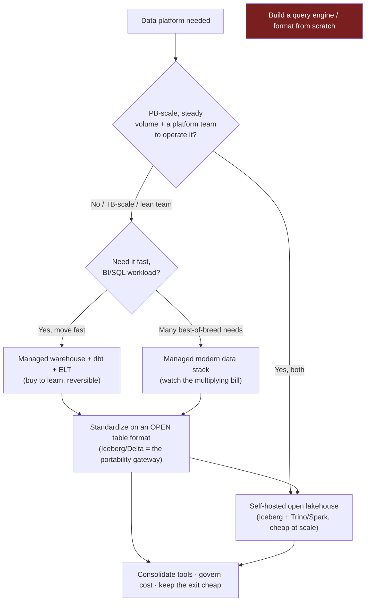

> Every Director-level data conversation eventually reaches the strategy question: *"How do we build our data platform, do we buy a warehouse or stand one up ourselves?"* It arrives in the loop as a hypothetical ("the CEO wants a data strategy, where do you start?"), in the panel as a challenge ("we're spending a fortune on Snowflake, why don't we run our own Spark cluster?"), and on the job as a budget line you defend to the CFO. The interviewer is **not** scoring whether you know this quarter's cheapest warehouse. They're scoring three things: **altitude** (do you reason about sequencing, optionality, and total cost of ownership, or do you name a vendor and stop), **currency** (does the answer sound like 2026 or like a 2015 "we'll build it on Hadoop, on-prem" plan), and **judgment under hype** (can you resist *both* the expensive-DIY trap, engineers love building the platform, *and* the buy-everything trap that leaves you with seven tools and a multiplying bill). This is the round where strong leaders fall off both edges: the builder over-engineers a lakehouse a team of five can't operate; the shopper assembles a fragmented modern data stack and is shocked by the invoice. The whole lesson is a defensible sequence that avoids both ditches.

### Learning objectives
- Lay out the **build-vs-buy spectrum** for data platforms, fully-managed SaaS warehouse → assembled managed modern-data-stack → self-hosted open lakehouse → build-from-scratch, and explain why the last is the *rejected default* for all but the hyperscalers.
- Reason about the **managed-vs-self-host economics** with real cost structure (consumption-priced SaaS vs compute/storage you operate plus a platform team) and name the **volume/maturity crossover** where self-hosting an open lakehouse starts to win.
- Frame the decision as **sequencing and optionality**, not vendor selection: buy to move fast, standardize on an open table format to keep the exit cheap, self-host only the high-volume workloads where scale earns it.
- Separate **reversible** moves (open formats, a buy you can migrate off) from **one-way doors** (proprietary lock-in, a self-hosted stack and the team to run it), and spend conviction accordingly.
- Answer "why are we paying a vendor for this?" with total cost of ownership, not the sticker, and answer "why so many tools?" with consolidation discipline, the 2026 grounded posture.

### Intuition first
Building a data platform is like sourcing **power for a factory.** You don't build your own generator and substation on day one, you plug into the **grid**, pay the **meter**, and start making product immediately. The utility has scale, reliability, and a price per kilowatt-hour you'll never beat at low volume. You build your own generator only when your **load is big enough and steady enough** that the capex of the plant, plus the crew to run it, finally beats the meter. A smelter running three shifts a day, every day, eventually crosses that line; a workshop that fires up occasionally never does, and for it a generator is a stranded asset that sits idle and depreciates.

A fully-managed warehouse is the grid; consumption pricing is the meter; the self-hosted lakehouse is your own generator and the crew to run it. So the Director's instinct is the inverse of the engineer's reflex to build: **buy from the grid first, and stand up your own generator only when sustained load makes the capex beat the meter**, and even then, only for the loads that justify it, not the whole factory. But the analogy has a second half the AI-strategy version doesn't: the *wiring standard*. A factory that wires everything to one proprietary plug is trapped, switching utilities means rewiring the building. A factory wired to a **standard socket** can swap power sources in an afternoon. The **open table format** (Iceberg, Delta, Hudi) is that standard socket: it sits under the warehouse so the data layer stays portable even while you rent the compute. The leaders who got this wrong in 2015 built the whole power plant on-prem for a workshop's load and watched the cloud lap them; the ones who got it wrong in 2020 bought every appliance from a different vendor and drowned in meters. The one who gets it right rents elastic power, wires to the standard socket, and owns a generator only for the one load that runs flat-out around the clock.

---

## The questions

These are the variants of the same strategy round. They look like invitations to pick a vendor; they're really tests of whether you reason about cost, optionality, and consolidation.

| Variant | What it's really testing |
|---|---|
| "How would you build our data platform from scratch?" | Whether you default to *buy*, sequence the build, and keep the data layer portable, or reflexively assemble infrastructure. |
| "What's your data strategy for the next 12–18 months?" | Whether strategy means a *sequence* with gates, or a list of vendor names and a vibe. |
| "We're spending $X on Snowflake/BigQuery, why don't we own this?" | Whether you know the real cost structure (TCO, not just the invoice) and the volume crossover where self-host wins. |
| "When would you self-host an open lakehouse instead of buying a warehouse?" | Whether you can state concrete triggers (sustained PB-scale volume, team maturity, residency, cost trajectory) rather than ideology. |
| "Should we adopt the modern data stack, Fivetran, dbt, Looker, the works?" | Whether you treat tool count as a cost/ops liability to manage, not a checklist to complete. |
| "Open table format or the vendor's native storage?" | Whether you see the format as the *optionality lever*, not a tribal allegiance. |
| "The CEO read that we should build a real-time data lakehouse. React." | Judgment under hype, can you redirect spend toward value without either capitulating or dismissing the ambition. |

The merge: every one resolves to the same shape, **clarify the drivers that actually move the decision, lay out the spectrum, then commit to a sequence with its trade-off and reversibility named.** Name a vendor with no reasoning and you've failed; propose building the whole stack to sound ambitious and you've failed worse.

---

## The framework

The answer shape is **Clarify → Options → Decide-and-Sequence → Name the trade-off and reversibility.** It's the hypothetical-decision structure (Lesson 10.2) applied to data-platform strategy, and the sibling of the AI build-vs-buy framework (Lesson 11.15).

- **Clarify** the drivers that actually decide it, before naming any tool: **data volume and scale** (GB, TB, or genuine PB, and growing how fast?), **team maturity and size** (do we have data-platform engineers who can operate Spark/Trino/Iceberg, or two analysts?), **workload** (BI and SQL reporting, or heavy ML/data-science and streaming?), **data residency and compliance** (must data stay in a region or our own boundary?), **cost trajectory** (flat and predictable, or spiky, and where does the bill go in three years?), **time-to-value** (are we proving the platform earns its keep, or scaling something proven?), and **lock-in tolerance** (how reversible must this choice stay?).
- **Options**, lay out the spectrum honestly, fastest-and-most-managed to most-control-and-most-operated:
  - **Fully-managed SaaS warehouse/lakehouse** (Snowflake, BigQuery, Databricks): best time-to-value, governed SQL, zero infra, elastic compute, consumption-priced. Costs: a consumption bill that climbs steeply with scale and careless queries, and **vendor lock-in** if you sit on proprietary storage.
  - **Assembled managed modern data stack** (Fivetran + dbt Cloud + a warehouse + Looker/Tableau): best-of-breed each layer, fast to wire up, mostly managed. Costs: **multiplying per-tool bills**, integration glue, and the operational surface of a *fragmented seven-tool stack* you now own the seams of.
  - **Self-hosted open lakehouse** (Iceberg/Delta tables on S3, Trino/Spark for compute, Airflow for orchestration): cheapest at high, steady volume; open formats; full control and residency. Costs: a real **data-platform team** as standing headcount, the ops burden of upgrades/tuning/on-call, and slower time-to-value.
  - **Build a data platform from scratch** (your own query engine, storage format, scheduler): name it and reject it as the default. It's a multi-year, multi-team investment that makes sense for hyperscalers (the people who *built* Spanner, Dremel, the engines everyone else rents) and almost no one else; the open-source ecosystem already gives you the parts. *Stating this rejection out loud, with the reason, is itself the altitude signal.*
- **Decide and sequence**, the answer is rarely one option; it's an order. The default sequence: **(1) Buy to move fast**, stand up a managed warehouse + dbt + managed ingestion so the org gets value this quarter, not next year. **(2) Standardize on an open table format**, make Iceberg/Delta the storage layer so the data is portable and the warehouse becomes swappable compute over your own files; this is the *gateway* of the data world. **(3) Self-host the workloads that earn it**, move only the high-volume, steady, scale-justified workloads (the PB-scale ML/streaming jobs) to a self-managed lakehouse on that same open data, where utilization finally beats the consumption meter.
- **Name the trade-off and reversibility.** Buying a managed warehouse **on open table formats** is **reversible**, your data lives in your object store in an open format, so you can point a different engine at it or migrate without re-extracting everything. Sitting on **proprietary internal storage** is the **one-way door**, the data is hostage and migration means a full re-export. Standing up and staffing a self-hosted lakehouse is the *other* one-way door (you can't un-hire the team mid-quarter). Spend conviction in proportion: rent compute freely behind the open-format escape hatch; demand overwhelming evidence before walking through either one-way door.

The crossover, quantified at altitude: a managed warehouse charges **per-compute-second or per-TB-scanned with effectively zero fixed cost**, you pay for what you run, and the infra is somebody else's capex (Lesson 13.11 covers the FinOps levers). Realistic small/mid platforms land in the **tens-of-thousands of dollars a month** range; it climbs with volume and careless `SELECT *` queries. A self-hosted open lakehouse moves the cost into **raw compute + cheap object storage** (S3 at pennies/GB-month) **plus a standing data-platform team**, call it **4–8 engineers**, i.e. on the order of **$1–2M/year in fully-loaded headcount** before a single query runs. That fixed team cost is the whole game: the lakehouse's lower per-query cost only repays the headcount when you run **sustained, high, predictable volume**, practically, when the managed bill would otherwise be in the **high six to seven figures a year** *and* the workload is steady enough to keep self-managed compute busy. **The number that decides it is whether the savings clear the team cost, not the per-TB sticker.** Below the line, self-hosting is more expensive all-in *and* slower to deliver *and* needs people you may not have; spiky, modest, or early-stage platforms tip toward managed. Above the line, genuine PB-scale, steady load, a team that can operate it, it flips toward self-host, *for those workloads*. And the asymmetry matters as much as the line: a managed warehouse on open formats is a reversible rental; a self-hosted stack and its team are a one-way door you stood up.

---

## 2015 (pre-cloud / on-prem Hadoop) vs 2026 grounded: the calibration

This is the category where a dated answer is most expensive, because the dated answer costs real money and years of lead time. The plans that sounded like serious engineering in 2015 now read as how to set fire to a budget. Five shifts separate a current data strategy from a 2015 (or even 2020) one.

- **"Big data means we build it on Hadoop/Cloudera, on-prem" is dead as a default.** In 2015, a data strategy meant racking servers, standing up an HDFS + MapReduce/Hive cluster (or buying the Cloudera/Hortonworks distro), and bolting storage to compute so every TB of growth dragged compute you didn't need. The 2026 grounded position: **rent a cloud warehouse or lakehouse where compute is elastic and decoupled from storage** (Lesson 13.3), you spin compute up for a query and to zero when idle, and storage growth is nearly free. Proposing an on-prem Hadoop build today reads as not understanding that the capex, the 24/7-sized cluster, and the cluster-babysitting team are exactly the costs the cloud erased.
- **"Assemble the modern data stack, buy every layer" matured into consolidation discipline.** The 2020 zeitgeist was best-of-breed everything: a managed connector vendor, a transformation vendor, a warehouse, a BI vendor, a reverse-ETL vendor, a catalog vendor, an observability vendor, seven contracts, seven bills, seven integration seams. The 2026 reality: **the fragmented seven-tool stack is a cost and operations liability**, and the move is to consolidate onto fewer platforms that cover more of the stack (the warehouse vendors now do ingestion, transformation, and governance natively). Tool sprawl now reads the way "a microservice per function" read by 2020, locally optimal, globally a tax.
- **"The data warehouse is the center of gravity" gave way to "the open table format is the integration point."** In 2015 the warehouse owned the data and everything orbited it; leaving meant re-exporting everything. The 2026 grounded architecture puts data in **open table formats** (Iceberg/Delta/Hudi) on object storage, so the *format* is the contract and the compute engine is swappable over it, the lakehouse (Lesson 13.3). The center of gravity moved from the engine to the data layer, which is precisely what keeps the platform portable.
- **"The data team hand-builds bespoke pipelines" gave way to "ELT + dbt + managed connectors, buy the commodity."** In 2015, ingestion was custom Scala/Python jobs your team wrote and maintained for every source. The 2026 posture: **extract-load is a solved commodity you buy** (Fivetran/Airbyte-class connectors) and **transform-in-warehouse with dbt** as version-controlled SQL; you spend scarce engineers on the modeling and the hard custom paths, not on re-writing a Salesforce connector. Hand-building the commodity layer now reads as not-invented-here.
- **(2026 frontier) "AI/LLMs over the warehouse + the semantic layer" is the new build-vs-buy front.** The fresh strategy question is no longer just the platform, it's whether to **build natural-language-to-SQL, embeddings, and a governed semantic layer over your data, or buy it** (and this is where Lesson 11.15's AI build-vs-buy logic meets the data platform). The grounded answer is the same shape: buy the commodity model behind a gateway, own the semantic layer and the data that makes the answers trustworthy, and don't train your own model to query your own warehouse.

---

## Model answers

### Answer 1: "How would you build our data platform from scratch?" (Clarify → Options → Sequence → Trade-off)

> *(Clarify)* "Before I name anything, a few drivers decide it: what's our real volume, tens of TB or genuine petabytes, growing how fast; what's the team, do we have data-platform engineers who can run Spark and Iceberg, or two analysts; is the workload BI-and-SQL or heavy ML and streaming; and is data under a residency constraint? *(Options)* The spectrum runs from a fully-managed warehouse like Snowflake or BigQuery, fastest to value, elastic, consumption-priced, through the assembled modern data stack, to a self-hosted open lakehouse on Iceberg and Trino, which is cheapest at scale but needs a real platform team, and finally building our own engine, which I'd take off the table immediately: that's hyperscaler work, the open-source ecosystem already gives us the parts, and we'd spend years rebuilding what we can rent. *(Sequence)* So my answer is an order, not a pick. We **buy to move fast**, stand up a managed warehouse with dbt for transformation and a managed connector for ingestion, so the org gets governed data this quarter. We **standardize on an open table format**, Iceberg under the warehouse, so our data lives in our object store in an open format and the engine on top becomes swappable; that's our portability lever. Then we **self-host only the workloads that earn it**, the high-volume, steady ML and streaming jobs where keeping our own compute busy finally beats the consumption meter. *(Trade-off + reversibility)* The trade-off I'm accepting up front is a consumption bill and a vendor relationship in year one, deliberately, because on open formats that path is reversible: I can point a different engine at the same files or migrate without re-extracting everything. What I won't do without proof is the two one-way doors, sitting on proprietary storage that holds our data hostage, or standing up and staffing a self-managed lakehouse before the volume justifies the team."

**Why it scores:**
- **Clarifies before committing**, names volume, team, workload, and residency, so the answer is contextual, not a reflex toward a favorite tool.
- **Rejects build-from-scratch explicitly and prices it** ("hyperscaler work… we'd spend years rebuilding what we can rent"), the altitude signal is naming the expensive option and killing it with a reason, not ignoring it.
- **Answers with a sequence, not a vendor**, buy-to-move-fast → standardize on the open format → self-host where earned is the grounded 2026 shape.
- **Names the trade-off and ties it to reversibility**, the Lesson 10.1 rule applied to data strategy: the open table format is the named escape hatch, and the two one-way doors (proprietary lock-in, the self-hosted team) are spent against only with proof.

### Answer 2: "We're spending $1.5M/year on Snowflake, why don't we run our own Spark cluster?"

> "Good question, and the answer is a TCO comparison, not the invoice. *(Clarify the real cost)* That $1.5M is opex with zero fixed cost, no team standing behind it, elastic, and someone else's hardware. *(Price the alternative honestly)* Running our own lakehouse doesn't make that number disappear; it *moves* it. We'd trade the warehouse bill for cheaper raw compute plus object storage, but the dominant new cost is a data-platform team of four to eight engineers to operate Spark, the Iceberg tables, upgrades, tuning, and on-call: call it $1–2M/year in fully-loaded headcount before a single query runs, plus slower delivery while we build it. So at $1.5M the math is roughly a wash *and* we take on operational risk and lose speed, self-hosting only clearly wins once the managed bill would be well into the high six or seven figures *and* the workload is steady enough to keep our own compute busy. *(The measured middle path)* So I wouldn't flip the whole platform. First, I'd attack the bill where it's cheapest, the usual finding is a few runaway query patterns and unpartitioned scans driving most of the spend, and FinOps hygiene (Lesson 13.11) often takes 20–40% off without moving infrastructure. Then, because our data already sits in Iceberg, I'd identify the one or two genuinely high-volume, steady workloads and route *those* to self-managed Trino or Spark over the same open files, the measured slice where utilization beats the meter. *(Trade-off + reversibility)* The trade I'm naming: keeping the managed warehouse is a reversible rental; standing up a platform team is a one-way door. I'll walk through it for the workloads that prove out the savings, not for the whole platform on a hunch."

**Why it scores:**
- **Reframes invoice → TCO**, the dominant cost of self-hosting is the standing team, not the compute, and the answer prices it ($1–2M/year) instead of comparing stickers.
- **Names the crossover with a number**, a wash at $1.5M, a clear self-host win only at high six/seven figures of steady volume, the Director frame of *where the line sits*, not ideology.
- **Offers the measured middle path**, FinOps hygiene first (a quantified 20–40% with no migration), then route only the high-volume workloads to self-managed compute over the *same* open-format data, Lesson 13.11.
- **Closes on reversibility**, managed-on-open-formats is reversible, the platform team is the one-way door, and conviction is spent in proportion, the spine of the whole framework.

---

## What interviewers probe here

- **"When, specifically, would you self-host an open lakehouse?"**, *Strong:* concrete triggers, genuine PB-scale, *steady* volume where the managed bill is high six/seven figures and self-managed compute would stay busy, *plus* a data-platform team that can actually operate it, *or* a hard residency constraint, and names the fixed team cost it adds. *Red flag:* "to save money" or "to avoid lock-in" with no volume math and no mention of the team, ideology, not a decision.
- **"The CEO wants us to build a real-time lakehouse. How do you respond?"**, *Strong:* channels the ambition without capitulating, "the goal is fast, trustworthy data, and the cheapest path is a managed platform on open formats plus a streaming path only for the workloads that need seconds (Lesson 13.5); here's the spend and team comparison and what each buys." Redirects to value, offers a proof gate. *Red flag:* either caves to the buzzword or dismisses the CEO; both lose the room.
- **"Why are we paying a warehouse vendor at all?"**, *Strong:* the vendor is renting us elastic compute and operations we'd otherwise staff; on open table formats the data isn't hostage, so the dependency is reversible and *fine*. *Red flag:* gets defensive and proposes building infrastructure to prove the team's depth.
- **"How do you avoid lock-in to one data vendor?"**, *Strong:* an **open table format** (Iceberg/Delta) as the storage layer so the engine is swappable over your own files, plus avoiding proprietary-only features on the critical path, optionality by design (Lesson 13.3). *Red flag:* "we'd self-host to be safe", trades a reversible rental for a far larger fixed team cost and slower delivery.
- **"Should we buy the whole modern data stack?"**, *Strong:* treats tool count as a liability, adopt the few layers that earn their bill, prefer platforms that consolidate ingestion/transform/governance, and watch the multiplying contracts. *Red flag:* a checklist answer ("yes, Fivetran, dbt, Looker, Atlan, Monte Carlo…") with no cost or ops-surface awareness.
- **"Open table format or the vendor's native storage?"**, *Strong:* open format as the portability lever, native engine on top for performance, a portfolio call per workload, not tribal. *Red flag:* "whatever the vendor recommends," surrendering the one lever that keeps the exit cheap.

---

## Common mistakes

- **Building when you should buy.** The engineer's instinct to stand up the lakehouse because operating infrastructure feels like the serious work. The default is buy-to-move-fast; self-hosting is what you *earn* with PB-scale steady volume and a team to run it, not a starting posture.
- **Comparing the invoice, ignoring TCO and the crossover.** Putting the warehouse bill next to "Spark on EC2 is cheaper per query" without counting the data-platform team (the dominant fixed cost), the slower delivery, the on-call, and where the volume crossover actually sits. Self-host economics live or die on whether the savings clear the headcount.
- **Buying every layer of the modern data stack.** Treating best-of-breed-everything as the goal and ending with seven vendors, seven bills, and seven integration seams. Tool sprawl is a cost and ops liability; the 2026 move is consolidation onto fewer platforms, adopt the layer that earns it, not the checklist.
- **Sitting on proprietary storage and calling it done.** Letting the warehouse own the data in its native format feels turnkey, but it's the one-way door: migration means a full re-export, and the vendor knows it. The open table format is the cheap-exit insurance you buy *before* you're locked in, not after.
- **One-way doors at experiment speed.** Hiring a platform team, committing to self-hosted infrastructure, or building bespoke pipelines before the cheap, reversible managed path has shown what's actually valuable and at what volume. Walk through one-way doors last, and only with proof.

---

## Practice prompts

1. **Make the build-vs-buy call for a Series-B startup in 90 seconds.** A fast-growing SaaS has tens of TB and two analysts, no platform engineers. *(Sketch: clarify volume + team + workload; options spectrum; sequence = managed warehouse + dbt + a managed connector now to move fast, standardize on Iceberg for portability, revisit self-host only if volume reaches PB-scale and you've hired a platform team; name the open-format-reversible vs team-one-way-door trade, self-hosting now would be a stranded generator.)*
2. **Defend the warehouse spend to a cost-cutting CFO.** "We're paying $2M/year for BigQuery, own it." *(Sketch: TCO comparison, the $2M opex vs cheaper compute + object storage *plus* a $1–2M/year platform team + slower delivery + on-call; roughly a wash at $2M, self-host clearly wins only at much higher steady volume; offer the measured path, FinOps hygiene first for a quantified 20–40%, then route only the high-volume steady workloads to self-managed compute over the same Iceberg tables, Lesson 13.11.)*
3. **Redirect a "build a real-time data lakehouse" mandate.** *(Sketch: channel the ambition to its real goal, fast, trustworthy data for decisions; show that most workloads tolerate hours and a streaming path is multiples of the cost (Lesson 13.5, 2.9); propose a managed platform on open formats now plus a streaming slice only where seconds matter; agree a proof-of-concept gate rather than a blank check; disagree-and-commit, Lesson 10.10.)*
4. **Cut a fragmented seven-tool stack.** Inherit Fivetran + dbt Cloud + Snowflake + Looker + Atlan + Monte Carlo + a reverse-ETL tool, bills multiplying. *(Sketch: map each tool to the value it actually delivers and its bill; consolidate onto platforms that cover multiple layers natively (the warehouse's own ingestion/transform/governance); keep the open table format as the constant so consolidation doesn't re-lock the data; name the trade, fewer tools means less best-of-breed flexibility, accepted for lower cost and a smaller ops surface.)*

---

### Key takeaways
- **The spectrum is managed warehouse → assembled modern data stack → self-hosted open lakehouse → build-from-scratch; the default is buy, and build-from-scratch is the rejected default** for everyone but hyperscalers. Naming and killing the build option, with the reason (years rebuilding what you can rent), is the altitude signal.
- **Self-host wins only past the volume/team crossover.** The economics turn on whether the savings clear a standing data-platform team ($1–2M/year), not the per-TB sticker, below the line (modest/spiky/lean-team) self-host is more expensive all-in, slower, and needs people you may not have; above it (PB-scale, steady, staffed) it flips, and only for those workloads.
- **Data strategy is sequencing and optionality, not vendor selection.** Buy to move fast → standardize on an open table format → self-host only where scale earns it. Reversible moves (managed compute on open formats) get experiment-speed conviction; one-way doors (proprietary storage, a self-hosted team) get walked through last, with proof.
- **The open table format is the optionality lever, the data world's gateway.** Iceberg/Delta on object storage keeps the engine swappable and the exit cheap; proprietary native storage is the one-way door that holds your data hostage. Wire to the standard socket before you're locked in.
- **Consolidate the stack and govern the cost.** The fragmented seven-tool modern data stack is now a cost and ops liability, not a badge, adopt the layers that earn their bill, prefer platforms that cover more of the stack, and treat FinOps hygiene (Lesson 13.11) as the first lever, not the last.

> **Spaced-repetition recap:** The data-platform strategy round scores **altitude, currency, and judgment under hype**, not which warehouse you'd name. Answer in **Clarify → Options → Sequence → Trade-off/reversibility**: clarify volume, team maturity, workload, residency, cost trajectory, time-to-value, lock-in; lay out managed warehouse → modern data stack → self-hosted open lakehouse → (rejected) build-from-scratch; commit to the sequence **buy-to-move-fast → standardize on an open table format → self-host where scale earns it**; name the trade and whether the door is reversible. The 2026 calibration vs the 2015/on-prem plan: **rent elastic cloud compute, don't build on-prem Hadoop**; the **open table format is the integration point**, not the warehouse engine; **buy the commodity** (ELT + dbt + managed connectors); **consolidate** the fragmented stack; and never propose building your own query engine as an application company. Cross-ref: 8.6 (build-vs-buy, general), 11.15 (the AI strategy sibling), 13.3 (warehouse/lake/lakehouse + open formats), 13.11 (cost & FinOps), 13.13 (leading the data org).

---

*End of Lesson 13.12. Strategy decides what you build the platform on; Lesson 13.13 covers what you're accountable for once it's running, leading the data org: how you staff, structure, and operate the team behind the platform, and the org-design trade-offs (centralized platform vs embedded analysts vs the data-mesh middle) a Director owns.*
