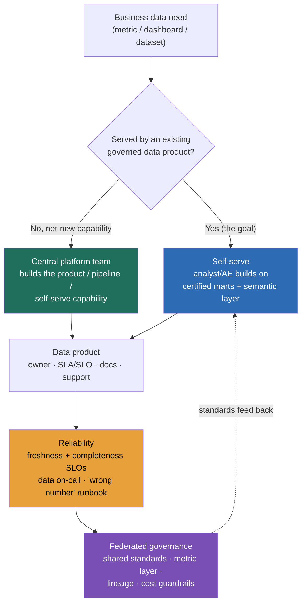

> The data-leadership round looks like a system-design question and isn't. A VP, a CTO, or a head of data asks how you'd *organize and run* a data function: who owns which data, how analysts get answers without a ticket queue, what happens when a pipeline breaks at 3am, and how the business comes to *trust* a number enough to bet a budget on it. They are **not** scoring whether you can draw a Kafka-to-warehouse pipeline; shipping the pipeline is the easy part. They're scoring whether you can run data as an **operating model** the way you already run uptime and headcount: is there an org shape that fits the company's size, are there reliability *contracts* on the data, is there an on-call rotation for data the way there is for services, and have you made data a *product the business self-serves* rather than a backlog only your team can drain. The fatal answer here is the one that treats data as a project ("we'll build the dashboards") instead of a function ("here's how the data org is shaped, what it's accountable for, and how the business gets answers without us in the loop"). The whole lesson is about answering at the altitude of the org chart and the operating model, not the DAG.

### Learning objectives
- Lay out the **data org models**, centralized, embedded/decentralized, hub-and-spoke / center-of-excellence, and data mesh, and pick one *against the company's size and maturity* rather than cargo-culting the fashionable one, naming the trade-off and rejected alternative each time.
- Run the **data-as-a-product** operating model: named owners, SLAs/SLOs, docs, and support for each data product, so trust is engineered rather than assumed (the quality discipline, applied to the org).
- Set **reliability contracts for data**, freshness and completeness SLOs, a **data on-call / incident** rotation, and a "the number is wrong" runbook, and quantify the load (rotation size, alert budget, SLA targets) the way you'd quantify service SLOs.
- Decide **self-serve platform vs central-team-builds-everything**, knowing self-serve scales the function but needs platform investment and guardrails, while a central build queue is controlled but a bottleneck that caps the company's data velocity.
- Demonstrate the **2015-vs-2026 calibration**: name the dated answers (data is IT's job, a central BI team takes dashboard tickets, no SLAs, the data scientist does everything) as out-of-level, and lead with the modern shape (analytics engineers + self-serve, data with contracts and on-call, federated ownership at scale, specialized roles, AI-assisted analytics).

### Intuition first
Running a data function is like running a **municipal water utility**, not a **bottled-water delivery service**. The amateur model is bottled water: every department phones in an order ("I need a dashboard of Q3 churn"), a central crew fills it by hand, and the crew is forever the bottleneck, orders pile up, every glass of water is a ticket, and the moment the crew is busy the company goes thirsty. The utility model is the opposite: you lay **treated, metered, pressure-guaranteed pipes** to every building, publish the water-quality report, and let each department open its own tap. The central team's job shifts from *carrying buckets* to *running the treatment plant and guaranteeing the pressure and purity*, and the contract is explicit: this water is safe (quality SLOs), it's always flowing (freshness SLOs), and if it isn't, someone is paged. The departments self-serve; the utility guarantees trust.

That image carries the whole Director job. **Your team builds and guarantees the platform, not every dashboard**, the bottled-water crew doesn't scale, the utility does. **Data is a product with a contract, not a favor**, metered, quality-assured, with an owner and an SLA, because a number nobody guarantees is a number nobody can bet on. **Reliability is engineered and paged**, water that's silently contaminated is worse than no water, exactly as a confidently-wrong metric is worse than a missing one (the signature failure). And **the org shape follows the company's size**, one shared treatment plant is right for a town; a sprawling metropolis federates into districts with shared standards (mesh) because one central plant can't know every neighborhood's needs. Get the utility picture right and the org models, the SLAs, and the self-serve argument all fall out of it.

---

## The questions

These are the open prompts of the data-leadership round. They look like invitations to describe a pipeline; they're really tests of whether you've designed an operating model.

| Variant | What it's really testing |
|---|---|
| "How would you structure a data team at our scale?" | Whether you fit the org model to company size/maturity, or reach for one shape reflexively. |
| "Analysts complain everything is a ticket and they wait days. Fix it." | The self-serve-vs-central-queue instinct, and whether you'd invest in a platform vs add headcount to the queue. |
| "A dashboard the CFO uses was wrong for a week and nobody noticed. What now?" | Data reliability, SLAs/SLOs, on-call, contracts, and a 'wrong number' runbook, vs treating it as a one-off bug. |
| "Everyone defines 'active user' differently and the numbers never match. React." | Governance and a semantic/metric layer, ownership of definitions, a federated-governance problem, not a query bug. |
| "Should we adopt data mesh?" | Whether you size the answer to the org, or cargo-cult the trend; mesh has a real coordination cost. |
| "How do you staff a data org, what roles, what ratios?" | Modern role specialization (data/analytics/ML engineers, analytics engineer) vs 'the data scientist does everything.' |
| "Who's on call for data, and what do they get paged for?" | Whether data reliability is a real rotation with SLOs and an alert budget, or nobody's job until it breaks. |
| "The data platform spend doubled. Who owns that, and what do you do?" | Whether cost is owned with chargeback/showback and guardrails (§13.11), or an unowned surprise. |

The merge: every one resolves to the same instinct, **run data as a governed, reliable, self-serve product function, not a project queue.** Describing the pipeline is the trap; describing the operating model, the contracts, and the org shape is the answer.

---

## The framework

The Director owns four decisions the pipeline never shows: **the org shape, the operating model, the reliability contract, and the access model.** Name them, attach a mechanism to each, and you've shown you can run data as a function rather than a backlog. The map below is the data org's operating model, a data need enters, is met by *self-serve over governed products* by default, escalates to the central platform team only for net-new capability, and every product carries an owner, an SLA, and an on-call rotation behind it.

**1. The org shape, fit it to the company, don't cargo-cult.** There are four shapes, on a spectrum from fully centralized to fully federated, and the Director skill is matching the shape to company size and data maturity, naming what you reject and why.

- **Centralized**, one data team owns all pipelines, models, and reports. *Pro:* consistency, governance, one definition of every metric, easy to staff and standardize. *Con:* the team is a **bottleneck**, every request is a ticket, and data velocity is capped by the team's headcount; it's also far from the domain, so analysts who don't know the business build the wrong thing. *Use when:* small-to-mid company (one data team of, say, 4–15), early maturity, where a single source of truth matters more than speed. **Reject for embedded** once the queue depth and domain-distance pain exceed the consistency benefit.
- **Embedded / decentralized**, analysts and analytics engineers sit *inside* each business domain (growth, finance, product). *Pro:* fast, close to the domain, the analyst knows the questions that matter. *Con:* **inconsistency and duplication**, every team reinvents "revenue," five pipelines compute the same thing five ways, no shared platform, and governance evaporates. *Use when:* you have strong domain teams but, fatally, no central standards, which is why pure embedded is usually a transitional state, not a destination. **Reject for hub-and-spoke** the moment the duplicated-definition pain (the "everyone's 'active user' differs" question) shows up.
- **Hub-and-spoke / center-of-excellence**, a **central platform team** (the hub) owns shared infrastructure, standards, the semantic layer, and governance; **embedded analysts** (the spokes) sit in domains and build on top. *Pro:* the balance, domain speed *with* central consistency; the hub builds the roads, the spokes drive on them. *Con:* **coordination cost**, the hub and spokes must align on standards, and a weak hub lets the spokes drift back to chaos. *Use when:* most mid-to-large companies; this is the **default modern shape** and the one to reach for unless something specific argues otherwise.
- **Data mesh**, domains own their data **as products** end-to-end, with a self-serve platform and **federated computational governance** binding them. *Pro:* scales to a large org where no central team can know every domain; ownership and accountability sit with the people who understand the data. *Con:* **high coordination and platform investment**, real org-design maturity required, and it **fails as a cargo-cult**, adopting mesh at a 10-person data org imports all the coordination overhead and none of the scale benefit. *Use when:* genuinely large, multi-domain orgs; **reject for hub-and-spoke** at anything smaller, and say so out loud, recognizing when *not* to do mesh is the altitude signal.

**Director-altitude statement:** *the org shape is a function of company size and data maturity, not fashion, centralize for consistency when you're small, federate for scale when you're large, and hub-and-spoke is the default that buys most of both; cargo-culting mesh into a mid-size org is the data-org equivalent of microservicing a monolith of three engineers.*

**2. The operating model, data as a product.** The shift that separates a modern data org from a 2015 BI team: each meaningful dataset is a **product**, not a byproduct. A data product has a **named owner** (accountable, not a rotating volunteer), a **published SLA** (freshness, completeness, availability), **documentation** (what it means, how it's computed, its grain), and **support** (a channel, not tribal knowledge). The analytics-engineer role (see below) is the person who builds these products, modeling raw data into clean, certified, documented marts with dbt-style tooling. The alternative, **best-effort data** (tables nobody owns, definitions in someone's head), is cheaper *today* and erodes trust until the business stops believing the numbers, which is the most expensive failure mode a data org has. You **accept the product overhead** because trust is the entire value of the function.

**3. The reliability contract, data has SLOs and on-call.** Treat data like a production service. **Freshness SLO:** "the revenue mart is updated by 7am, 99% of days." **Completeness/quality SLO:** "row counts within ±5% of the 7-day median; no null spikes in key columns." A **data on-call rotation** (data reliability engineering, the DevOps practice applied to pipelines) owns alerts when a freshness or quality check breaches, not when a user complains a week later. Quantify it: a healthy data on-call carries a **handful of high-signal alerts per week**, not hundreds (an alert budget, exactly like service SRE); a rotation needs **5–8 engineers** to be humane (so each is primary roughly every 6–8 weeks); and the incident runbook has a class traditional systems don't, *"the number is wrong / the pipeline silently fell behind"*, with a defined detection (the quality test), a backfill/replay path (idempotent recompute from retained raw), and a communication step (tell the consumers their number was stale before they bet on it). Naming on-call and a freshness SLO is what separates someone who has *operated* a data platform from someone who has only built one.

**4. The access model, self-serve vs central queue.** The single biggest lever on a data org's velocity. **Self-serve** means analysts and domain teams answer their own questions on top of governed, certified products (a semantic/metric layer, certified marts, a BI tool with guardrails). *Pro:* it **scales the function**, the business gets answers without your team in the loop, and your team builds capability instead of carrying buckets. *Con:* it needs real **platform investment** and **guardrails** (without governance, self-serve becomes a swamp of conflicting numbers, the governance problem). **Central-team-builds-everything** is the opposite: every dashboard is a ticket. *Pro:* controlled, consistent. *Con:* a **hard bottleneck** that caps the whole company's data velocity at your team's headcount and makes your team the company's most-resented dependency. **Reject the central queue** as a steady state: it doesn't scale, it burns out the team, and it trains the business to see data as slow. The Director move is to invest in self-serve *with* governance so the default answer to "I need data" is "open the tap," and the central team is reserved for net-new capability.

Run a data-leadership hypothetical as **clarify the company's size/maturity → pick the org shape and the operating model → name the reliability contract and the access model**, then stop. The operating model and the contracts carry the score, not the tool names.

Go deeper, the modern data-team roles and a sizing heuristic (IC depth, optional)

The 2015 "data scientist does everything" has specialized into distinct roles, and naming them correctly is a credibility signal:

- **Data engineer**, builds and operates ingestion and pipelines, the platform plumbing. Owns reliability and the lake/warehouse.
- **Analytics engineer**, the role that *defines* the modern data team (popularized alongside dbt). Sits between data engineering and analysis: models raw data into clean, tested, documented, certified marts and the semantic layer. This is who *builds the data products* that make self-serve safe. A 2015 org had no such role, which is why its analysts queried raw tables and got different answers.
- **Analyst / data scientist**, consumes the certified layer to answer business questions and build models; in a self-serve org they build on marts, not raw data.
- **ML engineer**, productionizes models, owns the feature/serving path (GenAI/ML-serving territory); distinct from the data scientist who explores.
- **Data product manager / governance lead**, at scale, owns definitions, the metric layer, and federated governance.

A rough sizing heuristic at altitude (not a law): on the order of **1 data/analytics engineer per 1–3 embedded analysts** in a hub-and-spoke shape; a platform/hub team of **5–10** can support a federated org of dozens of analysts if self-serve is real; if your ratio is inverted (many analysts, tiny platform team, no self-serve), you have a bottleneck forming. The number to watch is **request queue depth and time-to-answer**, the data org's analog of lead time.

---

## 2015 vs 2026 grounded: the calibration

This is the track's promise: name the dated answers as out-of-level. The data-leadership bar moved further than almost any other in the last decade, the 2015 "centralized BI team takes dashboard tickets" answer now reads as a manager who hasn't run data at scale.

- **"Data is IT's job / a central BI team takes dashboard requests" → "Data is a product function; the team builds the platform, not every dashboard."** In 2015, data lived under IT as a reporting cost center and the central team filled dashboard tickets by hand. In 2026, that's the bottled-water bottleneck: the credible Director runs data as a product org with **embedded analytics engineers + self-serve**, where the central team guarantees the platform and the business opens its own tap. "We'll build you a dashboard" as the operating model is a 2015 tell.
- **"No SLAs, data breaks silently and someone notices eventually" → "Data has SLAs/SLOs, on-call, and contracts, like a production service."** In 2015, pipelines failed quietly and a wrong dashboard could run for a week. In 2026, after enough wrong-number incidents reached executives, data has **freshness/completeness SLOs, a data on-call rotation, and source contracts**, data reliability engineering is a discipline. "It usually works" is now disqualifying.
- **"One central team owns all data" → "Domain ownership / mesh at scale, with federated governance."** The 2015 single-team model can't scale past a certain org size, the team becomes the bottleneck and is too far from each domain. In 2026, large orgs push **ownership into domains** as data products under **federated computational governance**. The calibrated nuance: you *still* centralize when small, and you **don't** cargo-cult mesh, sizing the model to the org is the actual skill.
- **"The data scientist does everything" → "Specialized roles: data engineer, analytics engineer, analyst, ML engineer."** In 2015 one "data scientist" did ingestion, modeling, analysis, and ML. In 2026 those are **distinct roles**, and the **analytics-engineer** role (model raw → certified products) is the keystone of the modern team. An org chart with one undifferentiated role reads as out-of-date.
- **(2026) "AI/LLM-assisted analytics changes the analyst role and the self-serve surface."** The newest shift: **natural-language querying** over a governed semantic layer lets non-analysts ask questions in English, and LLM-assisted tooling drafts SQL, models, and documentation, which raises the value of the *governed semantic layer* (the LLM is only as trustworthy as the definitions it queries) and shifts the analyst toward curation and judgment over hand-writing every query. A 2026 leader names this as an accelerant for self-serve *and* a new governance surface (a confidently-wrong natural-language answer is the analytical hallucination with a friendlier UI), not a replacement for the operating model.

A leader who answers with the 2015 frame, central BI queue, no SLAs, one team, one generalist role, signals they last ran data before it became a product discipline.

---

## Model answers

### Answer 1: "Structure a data team at our scale, and the analysts say everything is a ticket." (clarify → org shape → operating model → access model → reliability)

> *(Clarify, don't reflex)* "First, what scale and maturity are we, how many analysts, how many domains, and do we already have a central team? That decides the shape, so let me assume a few hundred-person company, a 6-person central data team, and analysts scattered across product, growth, and finance who all wait days for dashboards. *(Org shape + the rejected alternative)* That ticket-queue pain tells me a pure **centralized** model has hit its bottleneck, the team can't scale buckets fast enough, and I'd *reject* swinging fully **embedded**, because that just trades the queue for five teams computing 'revenue' five different ways. I'd move to **hub-and-spoke**: keep the central team as the hub owning the platform, the semantic layer, and governance, and **embed analytics engineers into the domains** as spokes. *(Operating model, the substance)* The central team's job changes from filling tickets to running data **as a product**, each key dataset gets a named owner, an SLA, docs, and a certified mart, so the spokes build on trustworthy foundations instead of raw tables. *(Access model, the velocity lever)* Then I attack the ticket queue directly with **self-serve**: a governed semantic layer and certified marts behind the BI tool, so an analyst answers 'churn by region' themselves on certified data instead of filing a ticket. The central team is reserved for net-new capability, not every dashboard. *(Reliability + number)* And I put the platform under a reliability contract, a freshness SLO ('marts fresh by 7am, 99% of days'), quality tests, and a data on-call rotation so a silent breakage pages someone, not surprises the CFO a week later. *(Limit)* The trade-off I'm accepting: hub-and-spoke has real **coordination cost**, the hub and spokes must stay aligned on standards or the spokes drift back to chaos, so I'd staff a strong hub and make the semantic layer the contract, and I'd be explicit that self-serve needs up-front platform investment before it pays off. Concretely, last time I ran this the time-to-answer for a standard metric went from ~3 days in the queue to self-serve in minutes, and the central team's backlog shifted from dashboards to platform work."

**Why it scores:**
- **Clarifies scale/maturity before picking a shape**, so the org model is contextual, not a reflex, the whole point of the category.
- **Names the rejected alternatives with reasons** (centralized = bottleneck, fully embedded = inconsistency) and lands on hub-and-spoke as the *default* with eyes open, the "decision + trade-off + rejected alternative" rule applied to org design.
- **Leads with the operating model (data-as-a-product) and the access model (self-serve), not tools**, the central team building the platform, not every dashboard, is the modern shape.
- **Puts the reliability contract on the table** (freshness SLO + quality tests + on-call), treating data like a production service, the 2026 calibration.
- The **Limit is honest and specific** (coordination cost, self-serve needs investment) with the mitigation named, plus a **quantified outcome** (3 days → minutes), honoring the "always quantify" rule at leadership altitude.

### Answer 2: "A CFO dashboard was wrong for a week and nobody noticed. What now?"

> "I'd treat this as a **reliability and trust** failure, not a one-off bug, because the dangerous part isn't that it broke, it's that it broke *silently* and an executive made calls on a confidently-wrong number. **Immediate:** find the root cause (almost always an upstream schema change, a join that fanned out, or a pipeline that fell behind and served stale data as fresh), backfill the corrected history from retained raw, and *proactively tell the consumers their number was wrong before they find out*, the communication step is non-negotiable for trust. **Systemic, where the real answer is:** I'd put this dataset under a **contract**. A **freshness SLO** ('updated by 7am, 99% of days') and **completeness/quality tests** (row counts within ±5% of the 7-day median, null-rate checks on key columns) that *page a data on-call rotation* the moment they breach, so the next silent break is caught in minutes by a person who's accountable, not in a week by the CFO. I'd add **lineage** so when a number is questioned we can trace it to its source and logic in minutes, and a **source contract** with the upstream team so they can't change a field that breaks us without warning. **Org:** this dataset clearly lacked a **named owner**, I'd assign one, because 'everyone's responsible' means no one is. *(Trade-off)* The cost I'm accepting: SLOs, tests, and an on-call rotation are real engineering overhead and a real on-call tax on the team, but the alternative is the business quietly losing faith in every number we publish, which is the most expensive failure a data org has. I'd scope the rigor to the data's blast radius: a CFO-facing financial mart gets the full contract; an experimental exploratory table doesn't need to."

**Why it scores:**
- **Reframes from 'fix the bug' to 'engineer trust'**, the silent-wrong-number is the signature failure, and treating it as a systemic reliability problem is the altitude move.
- **The communication step** (tell consumers before they find out) shows leadership judgment, not just an engineering fix, protecting trust is the actual job.
- **Names the concrete reliability mechanisms** (freshness SLO, quality tests, on-call paging, lineage, source contract, named owner), data reliability engineering as a real discipline, the 2026 bar.
- **Tiers the rigor to blast radius** (full contract for the CFO mart, not for an exploratory table), proportionate, cost-aware, not one-size-fits-all.
- **Closes on the trade-off** (on-call/overhead vs eroded trust), honoring the "name the cost" rule and owning the operational tax a Director carries.

---

## What interviewers probe here

- **"Would you adopt data mesh?"**, *Strong:* sizes it to the org, "mesh earns its coordination cost only at a large, multi-domain scale where no central team can know every domain; at our size I'd run hub-and-spoke and *not* import mesh's overhead, adopting it now would be cargo-culting." Names federated governance as the hard part. *Red flag:* "yes, mesh is best practice" with no sizing, the fashion-following tell.
- **"Who's on call for data, and what gets them paged?"**, *Strong:* a real rotation (5–8 engineers, humane frequency) paged by **freshness and quality SLO breaches** (stale data, null spikes, row-count anomalies) with a tight alert budget and a 'the number is wrong' runbook with a backfill path. *Red flag:* "the engineer who built it gets a Slack message when someone complains", reactive, no SLO, no rotation.
- **"How do you get analysts off the ticket queue?"**, *Strong:* invest in **self-serve over a governed semantic layer and certified marts**, reserve the central team for net-new capability, measure time-to-answer. *Red flag:* "hire more analysts for the queue", scaling the bottleneck instead of removing it.
- **"Everyone defines 'active user' differently. Fix it."**, *Strong:* a **single governed definition** in a semantic/metric layer that every tool consumes, a named owner for the metric, lineage to trace disagreements, a governance problem, not a query bug. *Red flag:* "I'd reconcile the two queries", fixes one instance, not the system.
- **"What roles do you hire, and in what ratio?"**, *Strong:* the specialized modern team (data engineer, **analytics engineer**, analyst, ML engineer) with a sane platform-to-analyst ratio and self-serve as the multiplier. *Red flag:* "data scientists who do everything", the 2015 generalist org.
- **"The platform bill doubled, who owns it?"**, *Strong:* cost is owned with **showback/chargeback** to the consuming teams, guardrails (partition/quota/query limits), and the bytes-scanned discipline; a named owner watches the trend. *Red flag:* "the data team absorbs it", unowned cost with no feedback loop, which only grows.

---

## Common mistakes

- **Answering with the pipeline, not the operating model.** Describing ingestion and a warehouse when asked how you'd *run* the function. The interviewer wants the org shape, the contracts, and the access model, the DAG is the easy 20%.
- **Cargo-culting data mesh (or any fashionable shape).** Proposing mesh for a 10-person data org imports all the coordination cost and none of the scale benefit; the skill is sizing the model to the company, and saying *no* to mesh when it doesn't fit is the senior signal.
- **No reliability contract.** Treating data as best-effort, no freshness/quality SLOs, no on-call, no 'wrong number' runbook, so breakages are silent and trust erodes. Data is a production service in 2026; "it usually works" is disqualifying.
- **Defending the central-build queue as a steady state.** Keeping every dashboard as a ticket caps the company's data velocity at your headcount and burns out the team; the answer is self-serve *with* governance, not more bucket-carriers.
- **Self-serve without governance (or governance without self-serve).** Opening the taps with no semantic layer or quality standards creates a swamp of conflicting numbers; locking everything behind central governance recreates the bottleneck. The operating model needs both, governed self-serve.

---

## Practice prompts

1. **Structure a data org for a 500-person, multi-domain company in 90 seconds.** *(Sketch: clarify scale/maturity/existing team; reject pure-centralized (bottleneck) and pure-embedded (inconsistency); land on hub-and-spoke, central platform hub + embedded analytics engineers; operating model = data-as-a-product with owners/SLAs; access model = governed self-serve; reliability = freshness SLO + on-call; Limit = coordination cost, mitigate with a strong hub and the semantic layer as the contract.)*
2. **Design data on-call from scratch.** *(Sketch: freshness + completeness/quality SLOs as the paging conditions; a 5–8-person rotation at humane frequency; a tight alert budget (handful/week, high-signal); a 'the number is wrong / pipeline fell behind' runbook with detection (quality tests), a backfill/replay path (idempotent recompute from retained raw), and proactive consumer communication; tier rigor to blast radius.)*
3. **Kill the ticket queue without adding headcount.** *(Sketch: diagnose the queue as a central-build bottleneck; invest in self-serve, governed semantic layer, certified marts, BI guardrails, so analysts answer their own questions; reserve the central team for net-new capability; measure time-to-answer before/after; name the trade-off: self-serve needs up-front platform investment and governance or it becomes a swamp.)*
4. **Decide mesh vs hub-and-spoke for a given org, and defend it.** *(Sketch: size it, number of domains, data maturity, platform investment available; mesh only past genuine large-multi-domain scale with the appetite for federated governance; default to hub-and-spoke and say explicitly why mesh would be cargo-culting at this size; name the rejected alternative and the coordination cost of each.)*

---

### Key takeaways
- **The Director job is the operating model, not the pipeline.** Shipping the DAG is the easy part; you're scored on how you *organize and run* the data function, org shape, contracts, reliability, and access, at the altitude of the org chart, like a water utility that guarantees the pipes, not a crew carrying buckets.
- **Fit the org shape to the company, don't cargo-cult.** Centralized (consistent, but a bottleneck) for small; embedded (fast, but inconsistent) rarely as a destination; **hub-and-spoke is the default** (domain speed + central consistency, at a coordination cost); **mesh only at genuine scale** with federated governance, and naming when *not* to do mesh is the altitude signal.
- **Run data as a product, with reliability contracts.** Named owners, SLAs/SLOs (freshness, completeness), docs, and support per data product; a **data on-call rotation** (5–8 engineers, a tight alert budget) paged on SLO breaches, with a 'the number is wrong' runbook and a backfill path, data is a production service, not best-effort.
- **Self-serve over a governed semantic layer is the velocity lever.** Reject the central-build ticket queue as a steady state (it caps velocity at your headcount and burns out the team); invest in governed self-serve so the business opens its own tap, and reserve the central team for net-new capability.
- **2015 vs 2026 calibration:** data-is-IT's-job → data-as-a-product function; no SLAs → SLOs + on-call + contracts; one central team → federated ownership at scale; the do-everything data scientist → specialized roles with the analytics engineer as keystone; and (2026) AI/LLM-assisted analytics raises the value of the governed semantic layer rather than replacing the operating model.

> **Spaced-repetition recap:** The data-leadership round scores whether you run data as an **operating model** (org shape + product contracts + reliability + access), not whether you can draw a pipeline, answer at the altitude of the org chart, like a **water utility** guaranteeing the pipes, not a crew carrying buckets. **Org shapes:** centralized (consistent, bottleneck) → embedded (fast, inconsistent) → **hub-and-spoke (the default, central platform hub + embedded analytics-engineer spokes, at a coordination cost)** → mesh (domain-owned products + federated governance, *only* at genuine large scale, don't cargo-cult it). **Operating model:** data-as-a-product, named owner, SLA, docs, support per dataset; best-effort data erodes trust, the most expensive failure. **Reliability:** freshness + completeness **SLOs**, a **data on-call** rotation (5–8 people, tight alert budget) paged on breach, a 'the number is wrong' runbook with a backfill/replay path from retained raw. **Access:** governed **self-serve** over a semantic layer scales the function; the central-build ticket queue is a bottleneck to reject as a steady state. **Calibration:** 2015 "data is IT / BI ticket queue / no SLAs / one team / do-everything data scientist" → 2026 "product function / self-serve / SLOs + on-call + contracts / federated ownership / specialized roles" + AI-assisted analytics raising the value of the governed semantic layer. Run hypotheticals as **clarify size/maturity → org shape + operating model → reliability contract + access model**. Cross-ref: data quality & SLAs; mesh/governance architecture; cost ownership; data strategy; org design & Conway; leadership answer shapes.

---

*End of Lesson 13.13. You can now run the data function, not just build its pipelines, the org shape, the data-as-a-product operating model, the reliability contracts and on-call, and the self-serve access model that makes data a product the business trusts and serves itself.*
