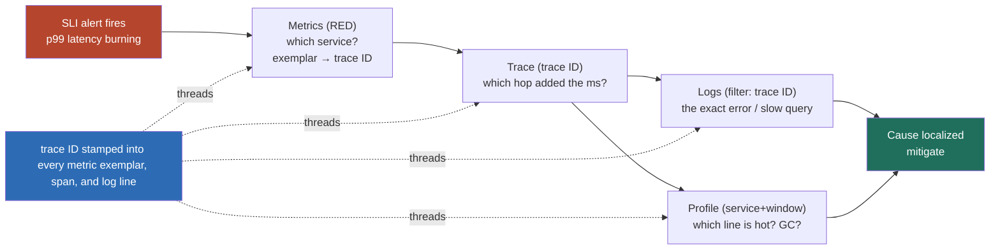

### Learning objectives
- State the difference that actually matters under fire: **monitoring answers questions you already knew to ask** (the dashboards you pre-built), **observability lets you ask new questions of a live system mid-incident** without shipping new code, and the second is what gets you out of a novel outage fast.
- Use the **three pillars plus profiling as a division of labor**, metrics for *what and how much*, logs for *why*, traces for *where the latency is*, continuous profiling for *which code is hot*, and reach for the right one rather than grepping logs for everything.
- Localize a degradation fast with **RED for services** (Rate, Errors, Duration) and **USE for resources** (Utilization, Saturation, Errors), so the first ninety seconds narrow the problem instead of widening it.
- Treat **trace-ID correlation as the spine of the stack**, one request ID threading metrics to traces to logs to a profile, so you walk from symptom to cause instead of flailing across four disconnected tools.
- Design around the two hard limits before the bill or the dashboard teaches you the hard way: **metric cardinality explosion** and **observability cost**, and know the levers (sampling, high-cardinality wide events, retention tiers) and what each one rejects.

### Intuition first
Monitoring is the **dashboard of gauges on a car**, speed, fuel, engine temperature, oil pressure. Someone decided in advance those five numbers were worth a permanent light on the panel, and they are exactly right up until the car does something the designer never anticipated. The moment a new, weird noise starts under load on a hill in the rain, the gauges go quiet, none of them was built to answer *that* question, and you are stuck.

Observability is having the car so thoroughly instrumented that you can **roll into the shop mid-drive and ask a question nobody pre-wired a gauge for**, "show me oil pressure only on left turns, only above 4000 rpm, only since the last fill-up", and get an answer from data already being captured, without adding a new sensor and waiting for the fault to recur. That is the whole distinction, and it is the distinction that decides whether a novel incident is a twenty-minute localize-and-mitigate or a four-hour archaeology dig. A Director does not buy observability to make pretty dashboards; they buy the ability to interrogate a running system about a failure mode no one foresaw, and they buy it *before* the incident, because you cannot instrument your way out of an outage that is already happening.

### Deep explanation

**The pillars are a division of labor, not four copies of the same data, and using the wrong one is most of the wasted time in an incident.** Each answers a different question, at a different cost, with a different shape.

- **Metrics answer "what" and "how much," cheaply, forever.** They are pre-aggregated numeric time series, request rate, error rate, p99 latency, CPU, queue depth, sampled every 10 to 60 seconds and kept for months. A metric data point is tiny (tens of bytes) and the storage is bounded by *how many distinct series* you keep, not by traffic volume, so metrics are where you watch the whole fleet for the price of a rounding error. Their limit: a metric tells you p99 latency tripled, never *which request or why*. You localize with metrics, you do not diagnose with them.
- **Logs answer "why," in detail, at a price that scales with traffic.** A log line is a per-event record with full context, the exact error, the stack, the parameters. That detail is the diagnosis, and that detail is also the cost: at high volume you are paying per GB ingested and per GB stored, and an over-logged service at 100k requests/sec can generate **terabytes a day** and a five-figure monthly bill on its own. Logs are where you confirm the cause once you know roughly where to look, not where you start a fleet-wide hunt.
- **Traces answer "where," across service boundaries, which neither metrics nor logs can.** A trace is one request's path stitched across every service it touched, each hop a timed span. In a system of twenty microservices, the trace is the *only* artifact that says "the 800ms lived in the `pricing` to `inventory` call, not the other nineteen hops." This is the pillar teams most often lack and most need, and its absence is exactly why logs-only debugging flails in a distributed system: logs tell you each service's local story, traces tell you which service's story matters.
- **Continuous profiling answers "which code is hot," down to the line.** Always-on, low-overhead (1 to 2% CPU) sampling of stacks across the fleet, rendered as flame graphs you can slice by time. When the trace says "service X is slow" and the logs say "no errors, just slow," the profile says "62% of CPU is in JSON serialization" or "we are stalled in GC." It closes the last gap from *where* to *what exactly*, without attaching a profiler to a box mid-incident.

**RED and USE are the two localization frames that turn the first ninety seconds from panic into a bisection.** They exist because under pressure people stare at the wrong graph. **RED is for services** (anything serving requests): watch **R**ate (requests/sec), **E**rrors (failed/sec or %), **D**uration (the latency distribution, p50/p95/p99). Three numbers per service, and a degradation announces itself, errors spiking is a different failure than duration climbing at flat rate, which is different again from rate collapsing. **USE is for resources** (CPU, memory, disk, network, a connection pool, a thread pool): watch **U**tilization (% busy), **S**aturation (queued work waiting, the early-warning signal), **E**rrors. The discipline: when latency spikes, RED across your services tells you *which service* degraded in seconds, then USE on that service's resources tells you *which resource* is the constraint. You are not reading dashboards at random, you are running a decision tree.

**Trace-ID correlation is the spine that makes the four pillars one tool instead of four.** A request enters at the edge, gets a **trace ID** (and per-hop span IDs), and that ID is stamped into every metric exemplar, every log line, and every span the request produces, propagated across service calls via headers (the W3C `traceparent` standard, what OpenTelemetry emits by default). The payoff is the entire diagnostic walk: a metric alert fires on p99, you click the slow exemplar, it carries a trace ID, the trace shows the slow hop, you pivot to the logs *filtered to that trace ID* and read the exact error, and you open the profile for that service and window. Without the shared ID you have four tools and a copy-paste-timestamps guessing game between them; with it you have one investigation. **The Director-altitude point: correlation is an architecture decision made before the incident**, propagate the context, sample consistently, or you own four disconnected dashboards when it counts.

**High-cardinality wide events are how you ask the unknown-unknown question, and they are a deliberate trade against pre-aggregated metrics.** A pre-aggregated metric is cheap precisely because it threw away the per-request detail, `http_requests_total{status, route}` is a handful of series. The instant you try to add `user_id` or `build_id` or `device` as a metric label, you get the **cardinality explosion**: series count is the *product* of every label's distinct values, so status (5) × route (200) × user (1,000,000) is a billion series, and your metrics backend either falls over or bankrupts you. The alternative pattern (the Honeycomb-style **wide structured event**): emit one fat event per request carrying dozens of high-cardinality fields, and aggregate at *query* time instead of write time. Now mid-incident you ask "p99 sliced by `build_id`, filtered to `region=eu-west` and `customer_tier=enterprise`", a question no pre-built dashboard anticipated, and get it because the raw dimensions were retained. The trade is explicit, **rejected: putting `user_id` on a metric, because cardinality is the product of label values and it detonates the time-series database**; wide events keep the dimensions and pay for it in query-time compute and event storage instead.

**SLIs sit at the top of the funnel, the user-facing symptom you alert on, and everything below is for diagnosis.** The Service Level Indicator (availability, latency, error rate as the *user* experiences it) is the one number that says "users are in pain." You **page on the SLI burning**, the symptom, and you use metrics → traces → logs → profile to find the cause. Alerting on a cause instead (CPU is 90%) generates pages for conditions users never felt and trains the team to ignore the pager. Symptom-based alerting is the through-line that keeps the whole stack pointed at what matters.

**Cost and cardinality are the two limits you design around, and sampling is the main lever.** Three numbers frame the spend: **metrics** cost scales with active series (and many vendors price per series, so cardinality *is* the bill), **logs** cost per GB ingested (dominant for chatty services), **traces** cost per span retained. You cannot keep 100% of everything at scale, so you **sample**. **Head sampling** decides at the start of a request (keep 1%, drop 99%), cheap and simple, but it throws away 99% of traces *before knowing which were interesting*, so it usually drops the rare slow/errored ones you actually needed. **Tail sampling** buffers the whole trace and decides *after* it completes, keep 100% of errors and slow traces, 1% of the boring fast ones, which captures the interesting traces but needs a buffering collector and more infrastructure. The Director decision is per-signal: keep all metrics (cheap, pre-aggregated), tail-sample traces (keep the anomalies, drop the boring bulk), and tier log retention (hot and searchable for 7 days, cold and cheap for 90), each choice a stated trade against its rejected alternative.

Go deeper — cardinality math, sampling mechanics, and the OTel correlation path (IC depth, optional)

- **Cardinality is multiplicative, which is why it surprises people.** Total active series = product of the distinct values of every label across a metric name. `status{5} × method{4} × route{200}` = 4,000 series, fine. Add `pod{500}` and it is 2,000,000; add `user_id{1e6}` and it is 4 billion and your Prometheus/Cortex/Mimir falls over or your vendor bill is unpayable. The rule of thumb: a label is safe on a metric only if its cardinality is **bounded and small** (status codes, HTTP methods, a fixed route table). Unbounded identifiers (user, request, session, full URL, error message) belong in logs, traces, or wide events, never as metric labels.
- **Exemplars bridge metrics to traces cheaply.** Modern metric formats (OpenMetrics, Prometheus exemplars) attach a *sample* trace ID to a histogram bucket, so a latency histogram's p99 bucket carries an example trace ID without putting trace IDs on the series. You get "here is one actual slow request behind this p99 spike" for near-zero cardinality cost. This is the cheap version of correlation.
- **W3C trace context is the wire format.** The `traceparent` header carries `version-traceid-spanid-flags`; every service reads it, starts a child span with the same trace ID and a new span ID, and re-propagates it. OpenTelemetry SDKs do this automatically across HTTP/gRPC/messaging. The `flags` byte carries the sampling decision so the whole trace is consistently kept or dropped end to end (the consistent-sampling requirement, otherwise you get broken half-traces).
- **Tail-sampling collector cost.** A tail sampler must buffer all spans of a trace until the root completes, which costs memory proportional to (in-flight traces × spans/trace × span size) and adds a collector tier. Typical policy: keep 100% of traces with any error span or with root duration > p99 threshold, plus a 1 to 5% random baseline of healthy traces for ratios. The infra cost of the buffering tier is the price of not throwing away the traces you needed.
- **p50 vs p99 divergence is the tell.** When p50 stays flat and p99 explodes, the median user is fine and a *tail* (a slow shard, a cache-cold path, a GC pause, a noisy-neighbor pod) is hurting some requests; you chase a specific code path. When p50 *and* p99 both rise together, the whole service is saturated, you chase a resource (USE) not a code path. Reading which percentiles moved is half the localization.

### Diagram: one trace ID walks from symptom to cause

### Worked example: a p99 latency spike on a checkout service
The SLI alert fires at 02:14, **checkout p99 latency** has gone from 180ms to 1.4s while p50 sits flat at 90ms. p50 flat and p99 blown is the tell, the median user is fine, a tail is on fire, so you are hunting a specific path, not a fleet-wide saturation.

- **RED to find the service.** RED across the request path: checkout's *rate* is flat (not a traffic surge), *errors* are flat (nothing is failing, just slow), *duration* p99 is the only number moving. You scan the downstream services' RED and `pricing` shows the same p99 climb while `inventory`, `cart`, and `payments` are clean. Ninety seconds in, the problem is localized to one service, and you did it without opening a single log.
- **Trace to find the hop.** You click the p99 histogram bucket's **exemplar**, it carries a trace ID, and the trace renders the request's whole span tree. The `checkout → pricing` span is 1.2s of the 1.4s, and inside `pricing` a single `pricing → postgres` span is 1.1s of that. The latency lives in one database call. No amount of staring at metrics would have told you *which hop*, and no amount of grepping logs would have told you *which trace*.
- **Logs and profile to find why.** You pivot to the logs **filtered to that exact trace ID** (not a timestamp range, the ID), and the `pricing` log line shows the SQL with a sequential scan where last week it used an index, a query plan flipped after a stats refresh. The continuous profile for `pricing` in that window confirms it, CPU is pinned in the Postgres client wait and the executor, not in app code. Cause: a regressed query plan on one table. Mitigate now (pin the plan / add the index hint / route around), fix the stats job after.

Contrast the **logs-only flail**: with no traces, the alert says "checkout is slow," you open checkout's logs, see nothing but slow-not-errored requests, then open `pricing`'s logs, `inventory`'s logs, `payments`'s logs by hand, eyeballing timestamps across four services to guess which hop owns the latency. That is the four-hour version of the twenty-minute investigation above, and the difference is entirely **the trace and the shared ID**. The Director lesson is not "we had logs"; it is "the trace localized the hop in one click because we propagated the context before the incident."

### Trade-offs table: the four signals, and how you choose
| Signal | Question it answers | Cost driver | Cardinality | Use when… |
|---|---|---|---|---|
| **Metrics** | what / how much (rate, error %, p99) | active series count | low (must be bounded) | watching the whole fleet, alerting on SLIs, localizing fast |
| **Logs** | why (exact error, params, stack) | \$/GB ingested + stored | unbounded (it is per-event) | confirming a cause once you know where to look |
| **Traces** | where (which service, which hop) | \$/span retained | medium (sampled) | latency lives somewhere in a distributed call path |
| **Profiling** | which code/line is hot | low (sampled, always-on) | low | a service is slow with no errors, "where is the CPU?" |

And the sampling decision underneath traces:

| | Head sampling | Tail sampling |
|---|---|---|
| **Decides** | at request start | after the trace completes |
| **Keeps** | a blind % (e.g. 1%) | the interesting ones (errors, slow) + a small baseline |
| **Cost** | cheap, no buffering | needs a buffering collector tier |
| **Loses** | the rare error/slow traces you needed | almost nothing that matters |
| **Use when…** | volume is huge and uniform, traces are nice-to-have | traces are a primary debug tool (the usual Director choice) |

### What interviewers probe here
- **"Latency just spiked, walk me through debugging it with your observability stack."** *Strong signal:* names the method, RED across services to localize which one degraded, the trace (via an exemplar) to find which hop added the milliseconds, then logs filtered to that trace ID and the profile to find why, all stitched by a shared trace ID, and reads p50-vs-p99 to decide whether it is a tail path or a saturated resource. *Red flag:* "I'd check the logs", with no traces to localize the hop, no method, opening service after service by hand.
- **"What's the limit of this stack, what breaks it?"** *Strong signal:* cardinality explosion (an unbounded label detonates the time-series DB and the bill) and cost (logs per GB, traces per span), with the levers, bounded labels, wide events for high-cardinality questions, tail sampling, tiered retention. *Red flag:* treats observability as free and unlimited, "we log everything and keep it forever", the path to a surprise five-figure bill and a metrics backend on the floor.
- **"How do you make four tools feel like one during an incident?"** *Strong signal:* trace-ID correlation as an up-front architecture decision, propagate W3C context, stamp the ID into metric exemplars, spans, and logs, sample consistently end to end, so you can pivot symptom → where → why without copy-pasting timestamps. *Red flag:* four disconnected dashboards and manual timestamp correlation under pressure.
- **"What do you page on?"** *Strong signal:* the user-facing SLI (the symptom), not the cause, with the rest of the stack for diagnosis after the page, because paging on CPU trains the team to ignore the pager. *Red flag:* alerts on resource thresholds nobody felt, pager fatigue by design.

The through-line at Director altitude: observability is the ability to ask **new** questions of a live system, bought before the incident, and run with **RED/USE to localize, trace-ID to correlate, and a deliberate cost/cardinality budget**. I would have the platform team benchmark our tracing backend's tail-sampling collector against the managed vendor on our span volume and p99 query latency; my prior is the managed vendor until span volume crosses the point where its per-span price beats running our own collector tier, at which point we self-host.

### Common mistakes / misconceptions
- **Logs-only debugging in a distributed system.** Logs give each service's local story but never *which* service owns the latency; without traces you eyeball timestamps across services and turn a 20-minute localize into a 4-hour dig.
- **Cardinality explosion (and the bill that follows).** Putting an unbounded label (`user_id`, request ID, full URL) on a metric multiplies series into the billions, falling the time-series DB over or bankrupting the per-series bill; high-cardinality questions belong in wide events, not metric labels.
- **No trace-ID correlation across the pillars.** Four tools that do not share a request ID is four tools, not one stack; the diagnostic walk only works if the same ID threads metrics, traces, logs, and profiles.
- **Alerting on causes, not symptoms.** Paging on CPU or memory generates pages for conditions users never felt and trains the team to ignore the pager; page on the user-facing SLI and use the rest to diagnose.
- **Ignoring observability cost until the invoice.** Logs at \$/GB and metrics priced per series make observability a real line item; not designing sampling, retention tiers, and bounded labels up front means the cost-control conversation happens after a surprise bill, not before.

### Practice questions

**Q1.** Your p99 latency tripled but p50 is flat and error rate is unchanged. What does that pattern tell you, and what's your first move?
> *Model:* p50 flat with p99 blown means the median user is fine and a *tail* of requests is slow, a specific path (a cold cache, one slow shard, a GC pause, a noisy-neighbor pod, a regressed query plan), not a fleet-wide resource saturation (which would lift p50 and p99 together). Flat errors say nothing is failing, just slowing. First move is RED across the services on the request path to localize *which* service's duration is climbing, then click that p99 bucket's exemplar to get a trace ID and read the span tree for the slow hop. I am hunting a code path, so I go metrics → trace, not straight to a resource graph. I would not start in the logs, logs confirm the cause once the trace tells me where to look.

**Q2.** A team wants to add `user_id` as a label on their request-rate and latency metrics so they can debug per-customer. What do you tell them?
> *Model:* No, not as a metric label. Metric series count is the product of every label's distinct values, so `user_id` at a million users multiplies your series into the billions and either falls the time-series DB over or makes the per-series bill unpayable, the cardinality-explosion failure. The need is real, though: per-customer slicing mid-incident. The right tool is a **high-cardinality wide event**, emit one structured event per request carrying `user_id`, `tier`, `region`, `build_id`, and aggregate at query time, so you can ask "p99 for this customer" after the fact without paying the cardinality tax on every metric. Metric labels stay bounded (status, route, method); the unbounded dimensions live in events, logs, and traces.

**Q3.** You're choosing between head and tail sampling for traces on a service doing 50k requests/sec. Which, and why?
> *Model:* Tail sampling, given traces are a primary debug tool here. Head sampling decides at request start, so keeping 1% throws away 99% *before* knowing which were interesting, and the rare errored or slow traces, the exact ones I need at 02:00, are almost certainly in the discarded 99%. Tail sampling buffers each trace and decides after it completes, so I keep 100% of error traces and traces above a p99 duration threshold, plus a 1 to 5% random baseline of healthy traces to preserve ratios. The cost is a buffering collector tier (memory ∝ in-flight traces × spans), which I accept because the alternative is paying to collect traces and still not having the one I need. If traces were merely nice-to-have and volume were uniform, head sampling's simplicity would win, but that is not this service.

**Q4.** Leadership asks you to cut the observability bill by 40% without going blind. Where do you cut?
> *Model:* I attack the three cost drivers in order of waste. **Logs** are usually the biggest and chattiest line (\$/GB ingested): drop debug/info logs that no alert or runbook reads, sample high-volume success logs, and tier retention, 7 days hot and searchable, 90 days cold and cheap, which alone often clears the 40% without losing diagnostic power. **Metrics**: hunt high-cardinality series (an unbounded label someone slipped in) and kill them, since per-series pricing means a few bad labels can dominate the bill; keep the SLI and RED/USE series untouched. **Traces**: move from a high fixed head-sample rate to tail sampling so I keep the interesting traces (errors, slow) and drop the boring bulk, often a large reduction at *better* debug value. The discipline: cut by *signal value per dollar*, not across the board, the SLI metrics and error traces are the last thing I touch.

### Key takeaways
- **Monitoring answers known questions; observability lets you ask new ones of a live system mid-incident**, and the second is what gets you through a novel outage, bought before the incident, not during it.
- **The pillars are a division of labor:** metrics for *what/how much* (cheap, fleet-wide), logs for *why* (detailed, \$/GB), traces for *where the latency is* (the distributed-system essential), profiling for *which line is hot*, reach for the right one.
- **RED for services, USE for resources** turn the first ninety seconds into a bisection: RED localizes which service degraded, USE localizes which resource constrains it.
- **Trace-ID correlation is the spine**, one request ID threading metric exemplars, spans, and logs lets you walk symptom → where → why as one investigation instead of four disconnected tools.
- **Cardinality and cost are the limits you design around:** bounded labels on metrics, high-cardinality questions in wide events, tail sampling for traces, tiered log retention, page on the user-facing SLI, not on causes.

> **Spaced-repetition recap:** Observability is the car you can interrogate mid-drive (ask *new* questions), versus monitoring's fixed gauges. Metrics = what/how-much (cheap, watch the fleet, alert on the SLI); logs = why (detailed, \$/GB); traces = *where* the latency lives across services (the distributed essential); profiling = which line is hot. Localize with **RED** (Rate/Errors/Duration, services) and **USE** (Utilization/Saturation/Errors, resources), correlate everything with a propagated **trace ID** (exemplar → trace → logs-filtered-to-ID → profile), and design around **cardinality** (bounded metric labels, wide events for high-cardinality questions, never `user_id` on a metric) and **cost** (tail-sample traces, tier log retention, page on symptoms not causes).

---

*End of Lesson 13.2. Observability is the ability to ask new questions of a live system mid-incident; the Director invests in RED/USE localization and trace-ID correlation before the outage, and budgets for cardinality and cost so the answer is there when it counts.*
