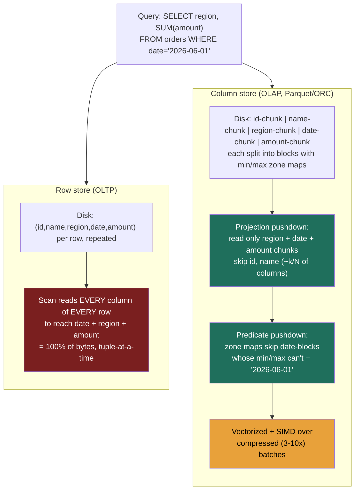

### Learning objectives
- Explain the **physical layout** difference between a **row store** and a **column store** on disk, and derive why an N-column table answers a single-column aggregate by reading roughly **1/N of the bytes** in a column store.
- Connect layout to workload: why **OLTP point access wants rows** (one entity = one contiguous read/write) and **OLAP scans want columns** (one metric across all entities), the mechanics under the OLTP/OLAP divide.
- Reason about the two multipliers that compound the win, **compression** on homogeneous columns (typically **3–10×**, via run-length / dictionary / delta / bit-packing) and **vectorized/SIMD execution** (~**10–100×** per core), and tie both back to the scan-cost = bytes-scanned model.
- Describe the on-disk anatomy of **Parquet/ORC** (row groups → column chunks → pages, with **per-block min/max statistics**, the zone maps) and how **predicate pushdown** and **projection pushdown** skip blocks and columns a query can't need.
- Make the decisions: **row vs column** (and when a row store still wins for analytics), **Parquet vs ORC** (a delegated bake-off), and the **Snappy vs Zstd** codec CPU-vs-IO trade, each with its rejected alternative.

### Intuition first
A row store and a column store are two ways to file the **same spreadsheet** in a cabinet. The **row store files one index card per customer**: name, city, signup date, lifetime spend, all on the card, one card after another. Ask "what does customer #84217 owe?" and you pull exactly one card, everything about them is right there, this is the cash register. But ask "what's total lifetime spend across all ten million customers?" and you must pull **every card** and read past name, city, and date on each just to glance at the one number you wanted, then put it back.

The **column store files one folder per field**: an *all-names* folder, an *all-cities* folder, an *all-spend* folder. Now the all-customers-spend question pulls **one folder** and reads nothing else, you never touch name or city. That is the whole game: the analyst sweeps one column across all rows, so storing each column together means her query reads only the columns she named and none of the bytes she didn't. And because a folder holds ten million values of *the same kind* (all dollar amounts, all from a small set of cities), it **compresses far harder** than a card that mixes a name, a date, and a number, so the folder is physically smaller on disk too. The point-lookup question now costs *more* in the column store (reassembling one customer means visiting every folder), which is exactly why both layouts exist and why you pick by the question you ask most.

### Deep explanation

**Row vs column is a physical layout choice, and the whole scan-cost claim falls out of it.** On disk, storage is linear, you decide what sits next to what. A **row-oriented** store (Postgres, MySQL/InnoDB, the OLTP engines) writes all of row 1's columns contiguously, then all of row 2's: `(id₁,name₁,city₁,amount₁)(id₂,name₂,city₂,amount₂)…`. A **column-oriented** store writes all values of one column contiguously, then the next: `(id₁,id₂,…)(name₁,name₂,…)(city₁,city₂,…)(amount₁,amount₂,…)`. Same logical table, opposite byte order. The Director-altitude statement: *the access pattern you optimize for decides which dimension you make contiguous, and that single choice sets the cost of every query for the life of the table.*

**Why OLTP point access wants rows.** Serving a user means reading or writing *one entity, all of it*, "fetch order #84217," "update this user's email." In a row store that entity's bytes are adjacent, so it's one small contiguous read or one in-place write, exactly what the B-tree is built to do at millisecond latency under high concurrency. Do that in a column store and a single-row read becomes **one seek per column** (the row's fields are scattered across every column folder), and an insert must append to *every* column file, which is why analytical column stores are append-mostly and bad at row-level updates. Point access on rows: cheap. Point access on columns: expensive, scattered. This is the mechanical reason you never serve the app from the analytical store.

**Why OLAP scans want columns, and the 1/N number.** An analytical query is unselective and narrow in columns: `SELECT region, SUM(amount) FROM orders GROUP BY region` touches *most rows* but only *two columns* of a table that might have 50. In a row store the disk read is forced to drag every row's **all 50 columns** off disk just to reach `amount` and `region`, because the I/O unit is a row (a page of rows), you pay for 48 columns you never use. In a column store you read the `amount` folder and the `region` folder and **nothing else**. If the table has N columns of roughly equal width and you touch k of them, you read about **k/N of the bytes**, a single-column aggregate on a 50-column table reads ~**1/50 = 2%** of the data before compression even enters. That is the first and largest multiplier behind the claim that the same query is orders of magnitude cheaper in an OLAP store: *you stopped reading the columns the query never named* (this is **projection pushdown**, below).

**Compression is the second multiplier, and columns compress far better than rows because they're homogeneous.** A compressor exploits repetition and low cardinality. A *row* interleaves a name, a city, a timestamp, and a dollar amount, four different types, little local repetition, so general-purpose compression on rows gets maybe ~2×. A *column* is ten million values of the **same type and often low cardinality** (a `country` column over 200 distinct values; a `status` column over 5; a `timestamp` column that climbs by seconds), which is exactly what compresses hard. The standard columnar encodings, each picked per column by the writer:

- **Dictionary encoding:** replace repeated values with small integer codes into a per-chunk dictionary. A `country` column of 200 distinct strings becomes 1-byte codes, often **10×+** before any further pass. It also lets predicates run against integer codes, faster.
- **Run-length encoding (RLE):** a sorted or clustered column with long runs of the same value (`status = 'shipped'` 50,000 rows in a row) stores `(value, count)` instead of the repeats, near-free for low-cardinality sorted data.
- **Delta encoding:** store differences between adjacent values, ideal for sorted IDs and monotonic timestamps where the deltas are tiny and uniform, which then bit-pack and RLE beautifully.
- **Bit-packing:** if a column's values fit in 11 bits, store them in 11 bits, not a 32-bit int, dropping ~65% off the raw width.

Stack these and analytical columns land at the **3–10×** range routinely, sometimes far more on low-cardinality or sorted columns. The two multipliers compound: 1/N from projection times 3–10× from compression is why a query that would table-scan a terabyte in Postgres reads gigabytes in a warehouse. **You reject "just gzip the Postgres table"** because compressing interleaved rows neither gives the column homogeneity that makes compression strong nor lets the engine *skip* the columns and blocks it doesn't need, you'd still read and decompress everything.

**Vectorized / SIMD execution is the third multiplier, on CPU rather than I/O.** Having read fewer bytes, you still have to aggregate them. A classic row engine runs **tuple-at-a-time**: a chain of function calls per row, with per-row branching and interpreter overhead. A columnar engine runs **vectorized**: it processes a column in **batches** (a few thousand values at once) through tight loops the CPU can run with **SIMD** instructions (one instruction over many values) and predictable branch behavior, with values already laid out contiguously and often as fixed-width integers from dictionary/bit-packing. The result is commonly **10–100× the per-core throughput** on scans and aggregations versus tuple-at-a-time. So the win is layered: read **k/N** of the bytes (projection), of which you fetch a **3–10×**-compressed form (encoding), then crunch it **10–100×** faster per core (vectorization). None of these is available to a row store running an analytical aggregate, which is the full mechanical answer to "why is the same query so much cheaper in OLAP?"

**Parquet and ORC are the on-disk file formats that package all of this, and their block structure is what enables skipping.** A columnar *file format* has to balance the pure-column ideal against the reality that you still sometimes want a slice of rows, so both **Apache Parquet** and **Apache ORC** use a **hybrid layout**: the file is split into **row groups** (Parquet) / **stripes** (ORC), each a horizontal band of ~hundreds of MB worth of rows; *within* a row group the data is stored column-by-column as **column chunks**, each chunk further divided into **pages** (the unit of compression/encoding). Critically, each block carries **statistics, per-column min/max (and null counts, sometimes more)**, often called **zone maps**. Those statistics are the lever for two pushdowns the query engine performs:

- **Projection pushdown** (column skipping): the engine reads only the column chunks for columns the query selects. This is the 1/N win made physical, the bytes for unreferenced columns are never fetched off object storage.
- **Predicate pushdown** (block skipping via zone maps): for `WHERE event_date = '2026-06-01'`, the engine checks each block's min/max for `event_date` and **skips any block whose range can't contain the value**, without reading the block, without a B-tree index. On data sorted/clustered by the predicate column, this prunes the overwhelming majority of blocks. This is the same idea the foundations lesson named, now owned here, and it composes with **partition pruning** (partitioning skips whole *files/directories*; zone maps skip *blocks within* the files you do open).

The headline a Director carries from formats: **the file format is a settled, delegated choice, both Parquet and ORC are open, columnar, splittable, and statistics-bearing, and the analytical engine ecosystem reads both.** Pick by ecosystem fit, not by a feature war (trade-offs table below). What you *do* own is making the pushdowns work: select few columns, sort/cluster by your common predicate so zone maps are tight, and don't defeat skipping with `SELECT *`.

**The codec is a real CPU-vs-IO knob you set, Snappy vs Zstd/gzip.** Within those pages you choose a compression codec, and it's a genuine trade, not a default:

- **Snappy** (Parquet's common default): **fast** compress/decompress, **modest** ratio. Lower CPU on read, more bytes off disk/network. Right when **decompression CPU is the bottleneck** or data is read very frequently and storage is cheap relative to compute.
- **Zstd** (and gzip): **denser** (often noticeably smaller files), at **higher CPU** cost, with Zstd offering a tunable level so you can dial ratio-vs-speed. Right when **I/O or storage egress dominates**, cold data scanned rarely, or cross-region scan cost where every byte read is billed.

The decision is which resource is scarce: **reject Zstd-max for hot, frequently-scanned data** where you'd pay decompression CPU on every query to save storage you don't care about; **reject Snappy for cold archival data** scanned monthly where the denser codec cuts the per-scan byte bill and the storage footprint and you rarely pay the CPU. State the trade, then let the platform team benchmark on the real column mix, prior: Snappy for hot interactive tables, Zstd for cold/large tables where scan-bytes are the cost.

**When a row store still wins for analytics, and the hybrid (HTAP) option you usually reject.** Columnar is not free for every "analytical" query. A **highly selective point or narrow-range lookup** ("the 3 orders for this one customer today") wants the row store's index and contiguous-row read, scanning column chunks to assemble a handful of full rows is slower than a B-tree point fetch, and the zone-map skipping that makes columnar cheap only helps when you're reading *many* rows of *few* columns. Workloads with **frequent row-level updates/deletes** also fight the column store's append-mostly nature (every update rewrites across column files / writes a delta file to be compacted, the LSM-style tax). The instinct to "have one system do both" is **HTAP** (hybrid transactional/analytical, e.g. a row store with a columnar replica/index, or TiDB/SingleStore-style dual engines). The Director call: *reject HTAP as the default* because you pay real operational and cost complexity to keep both representations coherent and to isolate the two workloads' resource contention, a separate analytical projection fed by CDC is simpler and cheaper for most. Reach for HTAP only when a genuine requirement, sub-second analytics on data that's *also* being transactionally updated, justifies the complexity, and say so explicitly.

Go deeper, the encoding/skip mechanics in detail (IC depth, optional)

- **Parquet file anatomy:** file → **row groups** (default ~128 MB–1 GB of rows) → **column chunks** (one per column per row group) → **pages** (default ~1 MB; the unit of encoding + compression) → a **footer** holding the schema and the per-row-group, per-column statistics (min/max/null-count). Readers parse the footer first, decide which row groups and columns to touch, then fetch only those byte ranges, ideal for object storage range-GETs.
- **ORC anatomy:** file → **stripes** (default ~64–256 MB) → per-column **streams** → with a **file footer** and a **stripe index** carrying min/max and (optionally) **bloom filters** per column, plus row-group-level indexes inside the stripe for finer skipping. ORC's built-in bloom filters can skip blocks on *equality* predicates even when data isn't sorted, which min/max alone can't.
- **Why sorting/clustering matters so much for skipping:** zone maps only prune well when a block's min/max range is *narrow*. On a column sorted (or Z-ordered / clustered) by the predicate, adjacent values are close, so each block covers a small range and most blocks are skippable; on a randomly-ordered column, every block's range is wide ([min, max] ≈ global), and min/max pruning skips almost nothing. This is why "sort/cluster by your common filter column" is the highest-leverage physical-layout move after partitioning.
- **Encoding selection is per-chunk and adaptive:** the writer inspects each column chunk and picks dictionary vs plain vs RLE/bit-packing based on cardinality and runs; e.g. Parquet falls back from dictionary to plain encoding if the dictionary would grow too large. You don't hand-pick per column, you choose the format/codec defaults and let the writer adapt.
- **Late materialization:** vectorized engines often evaluate predicates on the needed columns first, produce a selection vector (which rows survived), and only *then* fetch and decode the other selected columns for surviving rows, cutting decode work further. This is why predicate + projection pushdown compound rather than just add.

### Diagram: row vs columnar layout and how an aggregate reads each

### Worked example: the same `SUM(amount)` on a 2 TB orders table, Postgres vs a Parquet lake
Take the scan-cost model literally and run one query, `SELECT region, SUM(amount) FROM orders WHERE order_date = '2026-06-01' GROUP BY region`, against a 50-column `orders` table holding **2 TB** of one year of data, ~5.5 GB/day.

- **Row store (Postgres).** The aggregate is unselective across rows, so the planner table-scans (an index on `amount` is useless, the query touches most rows of the matching day; an index on `order_date` narrows to the day but still reads **all 50 columns** of every matching row because the row is the I/O unit). Reading one day uncompressed is ~**5.5 GB off disk**, of which the query needs only `order_date`, `region`, `amount`, the other 47 columns are pure waste, and it crunches them tuple-at-a-time while competing with OLTP traffic for the buffer pool. This is exactly the "don't run it here" case.
- **Column store (Parquet on S3, queried by Trino/Spark).** Three multipliers stack:
  1. **Projection pushdown:** read only 3 of 50 column chunks, ~**3/50 = 6%** of the bytes before anything else.
  2. **Partition + predicate pushdown:** the table is partitioned by `order_date`, so only that day's files open at all; *within* them, zone maps would skip non-matching blocks (here the partition already isolates the day). Whole-table scanning is avoided structurally.
  3. **Compression:** those three columns (a date, a low-cardinality `region`, a numeric `amount`) compress ~**4×**.
  Net bytes read: roughly 5.5 GB × 6% ÷ 4× ≈ **~80 MB**, versus Postgres's 5.5 GB, **~70× fewer bytes**, and the vectorized engine then aggregates that ~80 MB ~10–100× faster per core than a tuple-at-a-time scan. On the serverless math (\$5/TB), the Postgres-shaped 5.5 GB scan is ~**\$0.027** *and starves production*; the columnar ~80 MB scan is ~**\$0.0004** *on isolated compute*. Scale to 200 refreshes/day and the layout, not a cache, is what keeps the bill in dollars rather than thousands.
- **Where the row store would still win.** Change the query to `SELECT * FROM orders WHERE order_id = 'A-84217'`, one full row by primary key. Now the column store has to gather 50 scattered column chunks to rebuild one row, while Postgres does a single B-tree point read of contiguous bytes. *That* query belongs on the OLTP store, which is the whole reason both layouts coexist.

The number a Director brings out: *"the aggregate reads ~1–6% of the bytes because we only touch the columns we name and the partitions/blocks that can match, compressed 3–10×, crunched vectorized, that's the orders-of-magnitude, and it's layout, not caching."*

### Trade-offs table: layout, format, and codec choices
| Decision | Option A | Option B | Use when… |
|---|---|---|---|
| **Storage layout** | **Row store** (Postgres/InnoDB, B-tree) | **Column store** (Snowflake/BigQuery/Parquet-lake) | **A:** OLTP point reads/writes, selective lookups, frequent row-level updates, multi-row transactions. **B:** OLAP scans, aggregates over many rows + few columns, append-mostly history. |
| **File format** | **Parquet** | **ORC** | Both open, columnar, splittable, statistics-bearing, **largely a delegated bake-off**. Lean **Parquet** in Spark/Trino/cloud-warehouse/Python ecosystems (widest support); lean **ORC** in Hive/legacy-Hadoop estates or where its built-in bloom-filter skipping on unsorted equality predicates is proven to help. Pick by ecosystem, not feature war. |
| **Compression codec** | **Snappy** (fast, ~lighter ratio) | **Zstd / gzip** (denser, more CPU) | **Snappy:** hot, frequently-scanned tables where decode CPU is the bottleneck and storage is cheap. **Zstd:** cold/large/rarely-scanned tables, or where scan-bytes/egress is billed and the denser codec cuts the per-scan cost. |
| **One system for both?** | **Separate OLTP + analytical projection** (CDC-fed) | **HTAP / dual-engine** (TiDB, SingleStore, columnar replica) | **Separate (default):** almost always, simpler and cheaper, two stores each tuned to one access pattern. **HTAP:** only when a real requirement needs sub-second analytics on data being transactionally updated *and* justifies the coherence/contention complexity. |

The Director move: match **layout to the dominant access pattern**, treat **format as a delegated bake-off**, set the **codec by which resource is scarce (CPU vs IO)**, and **reject HTAP** unless a stated requirement pays for its complexity.

### What interviewers probe here
- **"Why is the same `SUM` query orders of magnitude cheaper in a warehouse than in Postgres?"**, *Strong signal:* three compounding mechanics, **projection** (read k/N columns, not all N), **compression** (3–10× on homogeneous columns via dictionary/RLE/delta/bit-packing), and **vectorized/SIMD execution** (10–100× per core), plus **block-skipping** via zone maps; ties it to the bytes-scanned cost. *Red flag:* "column stores are just faster" with no layout reason, or attributing it to caching/indexing.
- **"How does a columnar engine answer `WHERE date = X` without an index?"**, *Strong:* per-block **min/max statistics (zone maps)** in the Parquet row group / ORC stripe let it **skip blocks** whose range can't match; composes with **partition pruning**; tightest when the data is **sorted/clustered** by the predicate. *Red flag:* assumes it must full-scan, or conflates this with a B-tree.
- **"When would you keep analytics on a row store?"**, *Strong:* **highly selective point/narrow-range lookups** and **frequent row-level updates**, where contiguous-row reads and in-place writes beat reassembling rows from scattered column chunks; names the column store's append-mostly weakness. *Red flag:* "always use columnar for anything analytical."
- **"Parquet or ORC? Snappy or Zstd?"**, *Strong:* format is a **delegated bake-off** (both open/columnar/statistics-bearing, pick by ecosystem); codec is a **CPU-vs-IO trade** (Snappy hot, Zstd cold/egress-billed), states the prior and hands the benchmark to the platform team. *Red flag:* treats either as a one-true-answer or can't name the trade-off axis.

The through-line at Director altitude: you can explain *why* the scan is cheap in mechanical terms (layout → projection → compression → vectorization → skipping), you know the **boundary where a row store still wins**, and you treat format/codec as **bounded, delegable decisions with a stated prior**, not religious wars.

### Common mistakes / misconceptions
- **Thinking columnar wins by "indexing."** It wins by *not reading the columns and blocks you don't need* plus compression and vectorized execution, zone maps skip blocks, they aren't a B-tree, and they help only on many-row/few-column scans.
- **Believing column stores are universally better.** They're worse at point lookups (rows scattered across chunks) and row-level updates (append-mostly, like an LSM), which is exactly why OLTP stays on row stores.
- **Defeating pushdown with `SELECT *` and unsorted data.** `SELECT *` cancels projection pushdown (you read all columns); randomly-ordered data gives every block a wide min/max so predicate pushdown skips almost nothing, sort/cluster by your common filter.
- **Treating Parquet vs ORC as a major decision.** Both are open, columnar, splittable, and carry statistics; it's largely an ecosystem-fit bake-off, not a feature war, don't burn interview time on it.
- **Picking a codec by default.** Snappy-vs-Zstd is a real CPU-vs-IO trade; max compression on hot, frequently-scanned data wastes decode CPU, Snappy on cold archival data wastes the per-scan byte bill.

### Practice questions

**Q1.** A 40-column events table has a query `SELECT SUM(bytes_sent) FROM events`. Estimate how much less data this reads in a Parquet column store than in a row store, and name the two effects.
> *Model:* The query touches **1 of 40 columns**, so **projection pushdown** reads ~**1/40 = 2.5%** of the bytes a row store would (the row store drags all 40 columns off disk because the row is the I/O unit). Then **compression** on the homogeneous `bytes_sent` column, say ~**4×**, cuts that again, so net ≈ 2.5% ÷ 4 ≈ **~0.6%** of the row-store bytes, well over **100× fewer bytes read**. The two effects: *read fewer columns* (projection, the 1/N win) and *those columns are denser on disk* (compression on homogeneous values). On the bytes-scanned cost model, that's the orders-of-magnitude difference, and it's layout, not a cache.

**Q2.** Explain how a columnar file format answers `WHERE event_date = '2026-06-01'` cheaply with no B-tree index, and what physical-layout choice makes it dramatically better or worse.
> *Model:* Parquet row groups / ORC stripes carry **per-block min/max statistics (zone maps)**. The engine checks each block's `event_date` min/max and **skips any block whose range can't contain the date** without reading it, **predicate pushdown**, and composes this with **partition pruning** (skipping whole files for other days). The decisive layout choice is **sort/cluster order**: if the data is sorted by `event_date`, each block covers a narrow date range and almost all blocks are skippable; if it's randomly ordered, every block's [min, max] is ~the global range, so min/max pruning skips nearly nothing and you scan everything. Hence "partition + sort by your common predicate" is the highest-leverage move after going columnar (the cost discipline).

**Q3.** Your team wants to "just run analytics off the production Postgres with a few indexes" to avoid building a separate store. Make the mechanical case against it and the case for the one exception.
> *Model:* An analytical aggregate is **unselective** (it touches most rows), so the planner ignores `amount`-style indexes and **table-scans**, and because Postgres is **row-oriented**, that scan drags **every column** of every row off disk to reach the two or three the query needs, while contending with OLTP point traffic for the buffer pool and IOPS (the starvation point). A column store instead reads only the needed columns (projection, ~k/N), compressed 3–10×, vectorized, often **50–100× fewer bytes and isolated compute**. The exception: if the "analytics" are actually **highly selective point/range lookups** ("the last 10 orders for one user"), a row store with the right index is genuinely better, columnar would reassemble rows from scattered chunks for no benefit. So separate the analytical projection (CDC-fed) for *scans*; keep selective lookups on the row store.

**Q4.** When is Zstd the right codec over Snappy for a Parquet table, and when is it the wrong call?
> *Model:* **Right** for **cold or very large tables scanned infrequently**, or where **scan-bytes / cross-region egress are billed**: Zstd's denser compression cuts the per-scan byte cost and the storage footprint, and you rarely pay its higher decompression CPU because you rarely read it. **Wrong** for **hot, interactive tables read many times an hour**: you'd pay Zstd's extra decode CPU on *every* query to save storage that's cheap relative to the compute, Snappy's faster decode wins because **decompression CPU is the bottleneck**, not bytes. It's a CPU-vs-IO trade: optimize the scarce resource, state the prior (Snappy hot, Zstd cold), and let the platform team benchmark on the real column mix.

### Key takeaways
- **Row vs column is a physical-layout choice and it sets every query's cost:** rows store an entity's fields contiguously (cheap point access, OLTP), columns store a field's values contiguously (cheap scans, OLAP), so an N-column table answers a single-column aggregate by reading ~**1/N of the bytes** in a column store.
- **Three multipliers compound into the "orders of magnitude":** **projection** (read k/N columns), **compression** (3–10× on homogeneous columns via dictionary/RLE/delta/bit-packing), and **vectorized/SIMD execution** (10–100× per core), none available to a row store running an aggregate.
- **Parquet/ORC package it with skip-able blocks:** row groups/stripes → column chunks → pages, each carrying **min/max zone maps** that drive **predicate pushdown** (skip blocks that can't match) on top of **projection pushdown** and partition pruning, tightest when data is **sorted/clustered** by the predicate.
- **Format is a delegated bake-off; codec is a CPU-vs-IO knob:** Parquet vs ORC, pick by ecosystem (both open/columnar/statistics-bearing); **Snappy** for hot frequently-scanned data (decode CPU bound), **Zstd** for cold/large/egress-billed data (bytes bound).
- **Know the boundary:** a row store still wins for **selective point/range lookups and frequent row-level updates**; **reject HTAP** as the default (coherence + contention complexity) unless a real requirement needs analytics on transactionally-updated data, the separate CDC-fed projection is simpler and cheaper.

> **Spaced-repetition recap:** Two ways to file the same spreadsheet, **row store = one card per customer** (all fields contiguous → cheap point access, OLTP, B-tree), **column store = one folder per field** (all values of a column contiguous → cheap scans, OLAP). A single-column aggregate reads ~**1/N of the bytes** in a column store (**projection pushdown**), those columns compress **3–10×** because they're homogeneous (dictionary/RLE/delta/bit-packing), and **vectorized/SIMD** crunches them **10–100×** faster per core, that triple is the "orders of magnitude," and it's layout, not caching. **Parquet/ORC** store row-groups/stripes → column-chunks → pages with **min/max zone maps** that **skip blocks** (predicate pushdown), best when **sorted/clustered** by the filter; partition pruning skips whole files on top. Format is a **delegated bake-off** (both open/columnar); codec is **CPU-vs-IO** (Snappy hot, Zstd cold/egress-billed). Row stores still win for **selective lookups and frequent updates**; **reject HTAP** unless a requirement pays for it.

---

*End of Lesson 13.2. You now own the mechanics behind the columnar claim: columnar layout reads only the columns and blocks a query needs, compressed and vectorized, which is why an analytical scan is orders of magnitude cheaper than the same query on a row store.*
