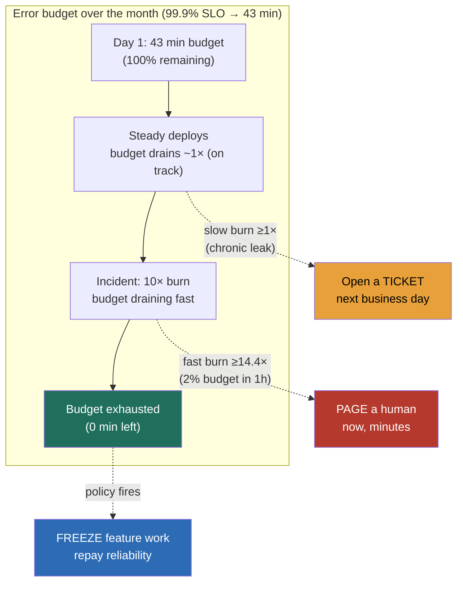

### Learning objectives
- Separate the **SLI / SLO / SLA triple** crisply: the indicator is the measurement, the objective is the internal target you defend, the agreement is the external contract with penalties, and the SLO must be **stricter than the SLA** so you have margin before money changes hands.
- Choose **user-centric SLIs**, availability, latency, correctness, freshness, measured **at the user, not the server**, and reject server-side proxies that read green while customers are in pain.
- State the **error budget** as *(1 − SLO)* and use it as **permission to ship**: under budget, release freely; over budget, the policy halts feature work until reliability is repaid.
- Design **multi-window, multi-burn-rate alerting** so a fast burn pages a human in minutes and a slow burn opens a ticket, and reject naive thresholds that page on every blip and train people to ignore the pager.
- Use the budget to **arbitrate reliability versus velocity with data, not politics**, including the nines-to-downtime math and the rule of thumb that each extra nine costs roughly **10×**.

### Intuition first
An error budget is a **monthly spending allowance for failure**. You and the business agree up front that perfect is unaffordable, so you set a target, say the service is good 99.9% of the time, which is the same as saying *"we are allowed to be bad for 0.1% of the month."* That 0.1% is real money in a real account: about **43 minutes of badness per month**, and every outage, every slow spike, every wrong answer is a withdrawal. As long as the account has a balance, you are free to spend it on shipping fast, risky deploys, big migrations, experiments, because a failure that stays inside the allowance costs you nothing you didn't already agree to. When the account hits zero, you stop spending on new features and put the money back into reliability until next month's allowance refills.

That single image settles the two fights teams usually have with opinions. **"Should we ship this risky change?"** is no longer a debate, it is a balance check: if there is budget, ship; if there isn't, the policy already decided. And **"is this incident worth waking someone up for?"** stops being a judgment call about how scary the graph looks and becomes a question about *how fast the money is draining*, a slow leak gets a ticket, a fast hemorrhage gets a page. Reliability stops being a vibe and becomes an account you manage.

### Deep explanation

**The SLI / SLO / SLA triple is three different objects, and conflating them is the first Director-level tell.** An **SLI** (service level indicator) is a *measurement*, a ratio of good events to total events: successful requests over all requests, requests under 300 ms over all requests. An **SLO** (service level objective) is the *internal target* you commit to and defend, "99.9% of requests succeed over a rolling 28 days." An **SLA** (service level agreement) is the *external contract* with a customer that carries **penalties**, refunds, service credits, if you breach it. The non-negotiable relationship: **the SLO is stricter than the SLA.** If you promise customers 99.5% (the SLA) but run your team to 99.9% (the SLO), you have a buffer, you start firefighting when you cross your own line, well before you owe anyone money. You **reject** "set the SLO equal to the SLA," because then the first moment you notice a problem is the moment you are already paying penalties, with zero margin to react.

**Good SLIs are user-centric and measured at the user, and this is where most reliability programs quietly fail.** The four categories that matter: **availability** (did the request succeed?), **latency** (did it succeed *fast enough*?), **correctness** (was the answer *right*?, the analog of trust for a serving system), and **freshness** (was the data *current enough*?, the lag from a write to it being visible). The discipline is the *measurement point*. A server-side "CPU is healthy, the box is up" dashboard can read perfectly green while a load balancer misroutes, a CDN serves stale errors, or a client times out at 2 seconds on a request your server thinks succeeded in 2.5. **You measure as close to the user as you can**, at the edge, the API gateway, or via real-user monitoring, so the number reflects the experience you are actually selling. You **reject** server-health SLIs as the primary signal, because "the server is up" is not the same promise as "the user got a correct answer in time," and the gap between them is exactly where customers churn while your dashboards stay green.

**The error budget is *(1 − SLO)*, and its whole point is to be spent.** If the SLO is 99.9%, the error budget is **0.1%** of events (or of time). This is not a number to minimize, it is an *allowance to consume*. The mental shift a Director enforces: **100% is the wrong target.** A service that never fails is a service that never ships, because the only way to guarantee zero failures is to stop changing anything, and change is where the business value lives. The budget reframes reliability and velocity as **two sides of one account** rather than enemies: every nine you don't chase is velocity you get to keep. So the operating rule is blunt, *if there is budget remaining, the team is cleared to ship, run risky migrations, do chaos experiments; if the budget is exhausted, feature work stops and the team repays reliability.* The budget converts an endless cultural argument into a quantity you read off a graph.

**Burn rate is the speed at which you spend the budget, and it is what should drive alerting, not raw thresholds.** A burn rate of **1×** means you are consuming the budget exactly fast enough to use it all up precisely at the end of the window, neutral, expected. A burn rate of **10×** means you'll exhaust a 30-day budget in 3 days. The naive alternative, **threshold alerting** ("page me whenever the error rate exceeds 1%"), is the classic mistake: it fires on every transient blip, a single bad deploy that self-heals in 90 seconds, a momentary dependency hiccup, and trains the on-call to silence the pager, so the one alert that mattered drowns in the noise. **Burn-rate alerting asks the better question:** not "is the error rate high right now?" but "at this rate, will we blow the budget, and how soon?" A short spike that recovers barely moves the budget and shouldn't wake anyone; a sustained elevated rate that will exhaust the month in hours absolutely should.

**Multi-window, multi-burn-rate alerting is the design that gets both speed and calm.** You run **two or more alerts at different sensitivities**: a **fast-burn** alert (high burn rate, short window) that catches a severe, fast-draining incident and **pages a human in minutes**, and a **slow-burn** alert (lower burn rate, long window) that catches a chronic, low-grade leak and **opens a ticket** for the next business day. The fast-burn alert uses a short window (so it's quick to fire) paired with a confirming short window (so a one-second blip doesn't trip it). The slow-burn alert uses a long window (hours to a day) so it only fires on a real, sustained problem. The result is the property you actually want: **what pages versus what waits is decided by how fast the money is draining**, not by how alarming a single point looks. You **reject** single-threshold alerting because it optimizes for catching every blip at the cost of alert fatigue, and a fatigued on-call is a slower, worse responder than no alert at all.

**The budget-driven freeze is the policy that makes the budget have teeth.** Without a written policy, "we're over budget" is just another data point people argue past, and the reliability-versus-velocity fight collapses back into politics, whoever has the most organizational weight wins the deploy. The policy states it in advance: **when the error budget for a service is exhausted, feature releases for that service freeze, and engineering effort redirects to reliability** (the postmortem action items, the flaky dependency, the missing retries) **until the budget recovers or the next window resets.** This is the Director's lever, it is agreed when everyone is calm, so when the budget burns, the decision is already made and nobody has to win an argument in the heat of an incident. You **reject** "we'll decide case by case," because case-by-case means the loudest stakeholder wins and reliability loses every quarter that ships under pressure.

**The nines-to-downtime math is what you must be able to do live, and the cost of each nine is roughly an order of magnitude.** The numbers a Director carries in their head: **99% = ~7.2 hours of downtime per month** (~3.65 days/year), **99.9% ("three nines") = ~43 minutes/month** (~8.8 hours/year), **99.99% ("four nines") = ~4.3 minutes/month** (~53 minutes/year), **99.999% ("five nines") = ~26 seconds/month**. The headline you attach: **each additional nine costs roughly 10× more**, because you've run out of cheap wins (a retry, a health check) and you're now buying multi-region failover, redundant everything, and the operational machinery to fail over in seconds, all to claw back minutes per month. So the altitude move is to **set the SLO from the requirement, not from ambition**: a back-office reporting tool that nobody watches at 2am does not need four nines, and pretending it does burns budget and money for an experience no user will ever notice.

Go deeper — burn-rate alert arithmetic and window selection (IC depth, optional)

- **Burn rate, defined.** Burn rate = (error rate observed in the window) ÷ (the error rate that exactly exhausts the budget over the SLO window). For a 99.9% SLO over 30 days, the budget is 0.1% of requests. A sustained 1% error rate is a burn rate of **10×** (it spends the whole month's budget in 3 days). A 10% error rate is **100×** (budget gone in ~7 hours).
- **The "2% in 1 hour" page.** A common Google-SRE-style fast-burn alert: page if the service would burn **2% of the 30-day budget in 1 hour**. That corresponds to a burn rate of **~14.4×** (2% of budget per hour × 720 hours/month ÷ 100% = 14.4). Paired windows: a 1-hour long window *and* a 5-minute short window must both be over threshold, so a 60-second blip that the 5-minute window smooths out never pages.
- **A practical two-tier table** (30-day SLO, fast page / slow ticket):
  - **Fast-burn / page:** burn rate ≥ 14.4×, long window 1h, short window 5m, consumes ~2% of budget/hour.
  - **Slow-burn / ticket:** burn rate ≥ 1×, long window 24h, short window 2h, consumes ~5% of budget/day.
- **Why the paired short window.** The long window gives confidence (the problem is sustained), the short window gives recency (it's still happening *now*, not an hour ago that already recovered). Both-must-fire kills both false positives and stale alerts.
- **Why error budget over uptime percentage in the alert.** Alerting on raw uptime % requires choosing an averaging window that's either too twitchy (short) or too sluggish (long). Burn rate is dimensionless and composes cleanly across windows, which is why multi-window burn-rate is the modern default over a single static threshold.

### Diagram: error-budget burn-down and the two-tier alert

### Worked example: setting SLOs for a public API
A team runs a customer-facing REST API, the read path behind a payments product. We set its reliability contract end to end, and the whole discipline shows up.

- **The SLIs and SLOs.** Two user-centric indicators. **Availability:** fraction of requests returning a non-5xx, non-timeout response, target **99.9%** over a rolling 28 days. **Latency:** fraction of requests served in under **300 ms at p99**, target 99.9%, measured **at the edge / API gateway**, not at the application server, so it includes load-balancer and network time the user actually feels. We **reject** measuring latency in the app handler, because it hides the 80 ms of gateway and TLS time the customer experiences, the green-dashboard trap.
- **The budget in minutes.** 99.9% over a 30-day month leaves **0.1% × 43,200 minutes ≈ 43 minutes** of allowed badness per month. That's the account. A single 20-minute outage spends nearly half of it; two of them and we're frozen.
- **The SLA gap.** The contract we sign with customers is **99.5%** (~3.6 hours/month), deliberately looser than our 99.9% SLO. The 0.4% gap is our **buffer**: we start firefighting at our internal line with hours of margin before we owe a single service credit. We **reject** signing the SLA at 99.9%, because that erases the buffer and turns every internal blip into a contractual liability.
- **The alerts.** **Fast-burn page:** if the service would burn **2% of the monthly budget in 1 hour** (~14.4× burn rate, ~0.86 minutes of the 43 in 60 minutes), page the on-call immediately, this is a real, fast-draining incident. **Slow-burn ticket:** if we're burning at **≥1×** sustained over 24 hours (a chronic ~5%/day leak), open a ticket for the next business day, it's bleeding but not bleeding out. We **reject** a single "page if error rate > 1%" threshold, because it would have paged four times last week on self-healing blips and the on-call now ignores it.
- **The freeze policy.** Written and agreed in advance: **if the 43-minute budget is exhausted, feature deploys to this API freeze** and the team works the reliability backlog (the flaky downstream, the missing circuit breaker, the postmortem actions) until the rolling window recovers. Nobody argues this during the incident, because it was decided when everyone was calm.

The number a Director brings out isn't "we set up monitoring," it's *"43 minutes a month, measured at the edge, a 0.4% buffer before any penalty, fast incidents page and slow leaks ticket, and we freeze on a written policy, not a fight."*

### Trade-offs table: alerting strategy and SLO tightness
| Decision | Threshold alerting | Multi-window burn-rate | Tight SLO (99.99%) | Loose SLO (99%) |
|---|---|---|---|---|
| **What it optimizes** | catch every error spike | catch budget-threatening trends | best possible experience | cheapest reliability spend |
| **Main cost** | alert fatigue, pager ignored | slightly more setup to model | ~10×/nine, multi-region, ops load | hours/month of user-visible badness |
| **Failure mode** | real alert lost in noise | none, if windows are tuned | over-engineered for the requirement | under-protects a critical path |
| **Use when…** | almost never (legacy default) | the modern default for any SLO | revenue/safety-critical paths only | internal/back-office, low-stakes tools |

The Director move is **matching SLO tightness to the requirement and value of the path**, and defaulting alerting to multi-window burn-rate so the pager stays trustworthy.

### What interviewers probe here
- **"How do you decide what to alert on, and how do you keep the pager from becoming noise?"** *Strong signal:* alert on user-centric SLIs via multi-window burn-rate, a fast burn pages and a slow burn tickets, so what wakes someone is governed by how fast the budget drains, not by every blip. *Red flag:* "alert on every metric over a threshold", the alert-fatigue trap, where the one alert that mattered is buried under self-healing noise.
- **"The product team wants to ship faster, SRE wants more stability. How do you settle it?"** *Strong signal:* the error budget is the arbiter, under budget the team ships freely, over budget a written freeze policy redirects effort to reliability, so the decision is data, agreed in advance, not politics. *Red flag:* "we'll balance it case by case", which means the loudest stakeholder wins and the fight reruns every quarter.
- **"What availability target should this service have?"** *Strong signal:* derives the SLO from the requirement and the cost of nines (each ~10×), sets the SLO stricter than any SLA for buffer, and refuses to chase 100% because it's infinite cost and zero shipping. *Red flag:* "as high as possible" or a reflexive "four nines" with no requirement and no awareness that the extra nine buys minutes/month at 10× the cost.
- **"Your dashboards are all green but customers are complaining. What went wrong?"** *Strong signal:* the SLIs are measured server-side, not at the user, so they miss edge/CDN/client failures, the fix is to measure as close to the user as possible (edge, RUM) and add correctness/freshness SLIs, not just box-health. *Red flag:* trusts the green dashboard and looks for the problem elsewhere, the server-health-proxy trap.

The through-line at Director altitude: reliability is a **negotiated, quantified budget** you spend deliberately, set SLOs from requirements stricter than SLAs, alert on burn rate, and freeze on a written policy. Then delegate the mechanics with a stated prior, "I'd have the SRE team model our burn-rate windows against last quarter's incident shapes and bring back the page/ticket thresholds, my prior is a two-tier 14.4× fast-burn and 1× slow-burn, because it's the proven default and our incidents cluster into fast outages and slow leaks."

### Common mistakes / misconceptions
- **Chasing 100% uptime.** It's infinite cost and means never shipping, the target is a deliberate SLO with a budget you intend to spend, not perfection.
- **Alerting on causes and every metric.** Paging on CPU, disk, and every error blip trains the on-call to ignore the pager, alert on user-facing SLI burn rate instead, and let slow leaks be tickets.
- **SLIs that don't reflect user pain.** Server-health metrics read green while customers fail at the edge or client, measure availability, latency, correctness, and freshness as close to the user as possible.
- **No error budget, so velocity-versus-reliability is politics.** Without a quantified budget and a written freeze policy, the loudest stakeholder wins and the same fight reruns every quarter.
- **Confusing SLA and SLO.** The SLA is the external contract with penalties, the SLO is the stricter internal target that gives you margin, setting them equal means you start firefighting only once you're already paying.

### Practice questions

**Q1.** A team proposes a 99.99% availability SLO for an internal analytics dashboard used during business hours. Critique the proposal.
> *Model:* I'd push back: 99.99% means ~4.3 minutes of allowed downtime per month, and the last nine before it cost roughly 10× the one before, multi-region failover, redundant infra, and the ops machinery to fail over in seconds. For an internal dashboard nobody watches at 2am, that spend buys an experience no user will perceive, and it burns budget and money against a requirement that doesn't exist. I'd derive the SLO from the requirement: this tool is business-hours, low-stakes, so 99% (~7 hours/month) or 99.9% (~43 min/month) is almost certainly right, and the saved engineering effort goes to a path where reliability actually moves revenue or safety. The principle is set the SLO from value, not ambition, and reserve the expensive nines for the paths that earn them.

**Q2.** Your service has a 99.9% SLO over 30 days. A deploy causes a sustained 5% error rate. How fast is the budget burning, and what should fire?
> *Model:* The budget is 0.1% of requests; a 5% error rate is a burn rate of 50× (5% ÷ 0.1%), which exhausts the entire month's ~43-minute budget in roughly 30 days ÷ 50 ≈ **14.4 hours**. That's a fast, budget-threatening burn, well past the ~14.4× fast-burn threshold, so the **fast-burn alert should page a human immediately**, paired short-and-long windows confirming it's both sustained and still happening. This is not a "wait for the morning ticket" leak, it's a hemorrhage, and the right response is page, mitigate (likely roll back the deploy), then postmortem. If the budget actually hits zero, the freeze policy fires and feature work stops until we've repaid reliability.

**Q3.** Engineering leadership and product are deadlocked: product wants to ship a risky migration this week, SRE says the service is fragile. How do you resolve it as the Director?
> *Model:* I don't resolve it with opinion, I resolve it with the error budget. If the service is under budget for the rolling window, there's headroom to absorb a risky change, so we ship it behind a feature flag and a fast rollback, the budget is there to be spent on exactly this. If the budget is already exhausted or nearly so, the written freeze policy applies, feature work pauses and we repay reliability first, and the migration waits until the budget recovers. The point is the decision was made when everyone was calm, by agreeing the policy in advance, so right now it's a balance check, not a turf war. If we *don't* have a budget defined, that's the real gap, I'd fix that first, because without it this fight reruns every quarter and the loudest voice wins.

**Q4.** All your dashboards are green but the support queue is full of "the site is slow / broken" tickets. Walk through what's likely wrong and how you'd prevent it.
> *Model:* Almost certainly the SLIs are measured in the wrong place, server-side. The app handler reports 50 ms and 200 success, but the user is hitting a misrouting load balancer, a CDN serving stale content, or timing out at the client on a request the server thinks it served. Green box-health is not the same promise as "the user got a correct answer fast." The fix: move the measurement as close to the user as possible, SLIs at the edge / API gateway plus real-user monitoring, and add the SLIs box-health misses, latency at the true p99 the user feels, correctness (was the answer right?), and freshness (was it current?). Prevention is structural: the SLI must reflect user pain by construction, or the dashboard will keep lying to you confidently.

### Key takeaways
- **The SLI/SLO/SLA triple is three objects:** indicator = the measurement, objective = the internal target you defend, agreement = the external contract with penalties, and the **SLO must be stricter than the SLA** so you have buffer before money changes hands.
- **SLIs must be user-centric and measured at the user:** availability, latency, correctness, freshness at the edge or via RUM, not server-health proxies that read green while customers fail.
- **The error budget is *(1 − SLO)* and is meant to be spent:** under budget, ship freely, over budget, a **written freeze policy** redirects effort to reliability, which is how reliability-versus-velocity stops being politics.
- **Alert on burn rate, multi-window:** a **fast burn pages** a human in minutes, a **slow burn opens a ticket**, so what wakes someone is set by how fast the budget drains, not by every self-healing blip.
- **Set the SLO from the requirement, not ambition:** 99.9% = ~43 min/month, 99.99% = ~4.3 min/month, each extra nine costs roughly **10×**, and 100% is the wrong target because it means never shipping.

> **Spaced-repetition recap:** Reliability is a **monthly allowance for failure**. The **SLI** is the measurement (user-centric: availability, latency, correctness, freshness, measured *at the user*), the **SLO** is the internal target you defend (stricter than the **SLA**, the external contract with penalties). The **error budget = (1 − SLO)** is permission to ship: under budget, ship; exhausted, a **written freeze policy** repays reliability. Alert on **burn rate, multi-window**: fast burn (≥14.4×, ~2% of budget in 1h) **pages**, slow burn (≥1× sustained) **tickets**, never a single threshold (fatigue). Nines: 99.9% = ~43 min/month, 99.99% = ~4.3 min/month, each nine ~**10×** cost; **100% is the wrong target**. The budget is the data that ends the reliability-versus-velocity fight.

---

*End of Lesson 13.3. An SLO turns reliability into a negotiated number and the error budget is the currency you spend on velocity, page on by burn rate, and freeze against by written policy, not by argument.*
