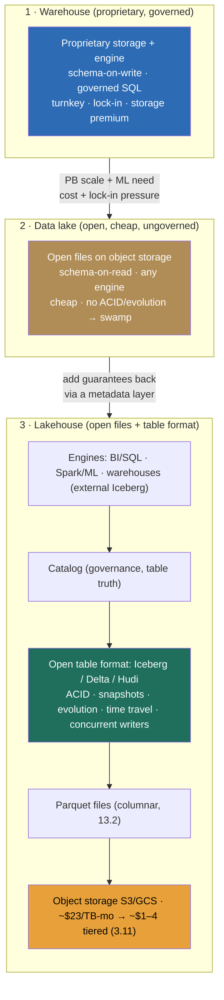

### Learning objectives
- Tell the **three analytical-storage architectures apart by their guarantees and economics**, not their logos: a **warehouse** (proprietary storage, governed SQL, schema-on-write), a **data lake** (open files on cheap object storage, schema-on-read, flexible but ungoverned), and a **lakehouse** (open files + a table format = warehouse guarantees on lake economics).
- Explain the **decoupled storage/compute** shift as the move that made the lake (and then the lakehouse) economically decisive, and quantify the gap: object storage at **~\$23/TB-month hot**, tier-able to **~\$1–4/TB-month**, against a warehouse's bundled storage premium.
- State what an **open table format** (Iceberg / Delta Lake / Hudi) adds over a directory of Parquet files, **ACID commits, snapshot isolation, schema & partition evolution, time travel, concurrent writers**, and how it works in one line: a **metadata layer of snapshots and manifests over Parquet**.
- Make the **warehouse-vs-lake-vs-lakehouse** call against scale, workload mix (BI vs ML), lock-in tolerance, and ops maturity, naming the rejected alternative each time.
- Treat the **table-format choice (Iceberg vs Delta vs Hudi)** as a delegated bake-off where the *category* is the decision, and recognize **raw Parquet directories as a "table"** for the data-swamp trap it is.

### Intuition first
Picture three ways to run a company's records room. The first is a **bonded vault run by a vendor**: every document is filed in their proprietary cabinets, in their format, and you read it through their beautiful, locked front desk. Nothing gets misfiled, every access is logged, the librarian is excellent, but the documents are *inside their building*, you pay vault rates per cubic foot, and the day you want your own data scientists to read the raw files directly, you have to export everything out the front door. That's the **data warehouse**.

The second is a **giant cheap self-storage unit**: you dump every file, in any format, onto pallets in a vast warehouse that costs almost nothing per square foot, and anyone with a key can walk in and read whatever they want with whatever tool they bring. Wonderfully cheap and open, until it becomes a **swamp**: nobody knows which pallet is authoritative, two people writing at once leave half-updated piles, there's no "show me how this looked last Tuesday," and a stray forklift can corrupt a stack mid-read. That's the **data lake**: open and cheap, but with none of the vault's guarantees.

The third keeps the cheap self-storage unit but **bolts a real card-catalog and a check-in/check-out desk onto it.** The files still sit on the same cheap pallets in the same open format, but now a thin **catalog** records exactly which boxes make up each official "folder" as of each moment, so writes are atomic, readers always see a consistent snapshot, you can ask for last Tuesday's version, and many people can write at once without corrupting each other. You got the **vault's guarantees on the self-storage unit's economics**, and any tool can still read the raw pallets. That catalog-over-cheap-storage is the **lakehouse**, and the catalog is the **open table format.** The whole lesson is that one move: warehouse guarantees, lake prices.

### Deep explanation

**Start with the divide the warehouse was built to serve, then watch storage economics rewrite it.** The data **warehouse** (Teradata in the 1990s, then cloud-native Snowflake, BigQuery, Redshift) is the original answer to "give analysts a fast, governed, SQL-queryable copy of operational truth" (the projection of 13.1). Its defining choice is **schema-on-write**: data is cleaned, typed, and conformed to a fixed schema *before* it lands, so everything inside is structured, trustworthy, and instantly SQL-able, and the engine can optimize hard because it owns both the storage layout and the query path. Its other defining choice is **proprietary storage**: the warehouse holds your data in *its own* internal columnar format inside *its own* system. That bundling is exactly what makes it turnkey and exactly what makes it a trap, you get governance, ACID, and best-in-class SQL with zero assembly, and in exchange your data is **locked inside one vendor's engine** and priced at that vendor's storage rates. The Director-altitude statement: *the warehouse trades openness and storage cost for turnkey governance and SQL ergonomics, and for structured-BI-at-moderate-scale that's often the right trade.*

**The data lake was the rebellion against proprietary storage, and it overcorrected into a swamp.** When data volumes hit the petabyte range and machine-learning teams needed the *raw* data (not a warehouse's pre-conformed marts), the warehouse's two choices became liabilities: schema-on-write rejected the semi-structured logs and clickstreams ML wanted, and proprietary storage made PB-scale storage indefensibly expensive and forced an export for every non-SQL engine. The **data lake** inverted both. Store **open files** (Parquet, JSON, Avro, 13.2 for why Parquet) directly on **cheap object storage** (S3/GCS/ADLS, 3.11), and adopt **schema-on-read**: land everything raw in whatever shape it arrives, impose structure only when you query. The wins are real, near-zero storage cost, no lock-in, every engine (Spark, Trino, the warehouses themselves) reads the same open files. But removing the warehouse's guarantees removed the warehouse's *discipline*, and the failure mode has a name: the **data swamp.** A directory of Parquet files is not a table, there is no atomic multi-file commit (a writer crashes mid-job and leaves the "table" half-updated), no snapshot isolation (a reader scanning while a writer appends sees a torn, inconsistent picture), no schema evolution (add a column and old readers break or new files mismatch old ones), no time travel, and no concurrent-writer safety. Add ungoverned access and no catalog of what's authoritative, and the cheap open lake becomes a pile nobody trusts. **The lake fixed economics by abandoning guarantees, which is why it was a stop, not a destination.**

**Decoupled storage and compute is the shift underneath all of this, and it's why the lake's economics won.** In the original big-data architecture (Hadoop/HDFS + MapReduce), storage and compute were **bolted onto the same nodes**: data lived on the disks of the very machines that ran the queries. To store more you bought compute you didn't need; to compute more you bought storage you didn't need; and the cluster ran 24/7 sized to peak whether or not anyone was querying. **Decoupling** (foreshadowed in 13.1) breaks them apart: one copy of the data sits in cheap object storage, and **elastic, ephemeral compute** is pointed at it on demand and spun to zero when idle. You scale the two independently, run many isolated compute pools over a single copy of the data, and pay for storage and for compute-hours separately. This is the architecture the lake made possible (object storage *is* decoupled storage) and the one the warehouse spent the last decade racing to adopt (cloud warehouses are themselves decoupled-storage/compute internally). The number that makes the case: object storage runs **~\$23/TB-month** in the hot tier and **tiers down to ~\$1–4/TB-month** for cold data (3.11), against the bundled-storage premium you pay to keep bytes inside a proprietary warehouse. At a petabyte, that gap is the line item that decides the architecture.

**The lakehouse is the synthesis: keep the lake's open files and decoupled economics, add back the warehouse's guarantees with an open table format.** The insight is that everything the lake lacked, atomicity, isolation, evolution, time travel, concurrency, is a *metadata* problem, not a *storage* problem. You don't need a proprietary engine to own the bytes; you need a **thin, open metadata layer that turns a directory of files into a transactional table.** That layer is the **open table format**, **Apache Iceberg, Delta Lake, or Apache Hudi**, and it is the single idea that makes the word "lakehouse" mean something rather than market it. The data still sits as **Parquet files on object storage**; the table format adds, on top of those files:

- **ACID commits.** A write that touches many files commits **atomically**, all of it becomes visible at once or none does. The half-updated-table swamp failure is gone.
- **Snapshot isolation.** Every reader sees a consistent **snapshot** of the table as of a point in time; a concurrent writer's in-flight changes are invisible until they commit. Readers never see a torn state.
- **Schema & partition evolution.** Add, rename, or reorder columns, and even *change the partitioning*, as **metadata-only** operations, without rewriting the underlying files. The lake's "add a column and break everyone" trap is gone.
- **Time travel.** Query the table **as of an earlier snapshot** (`AS OF` a timestamp or version) for audit, debugging, or reproducible ML training. The lake had no notion of "yesterday's version."
- **Concurrent writers.** Multiple jobs can write to one table safely via **optimistic concurrency** on the metadata, instead of one job corrupting another's files.

**How it works, in one line: a metadata layer of snapshots and manifests over Parquet.** You don't need the internals to design at altitude, only the shape. The table format keeps a small **metadata tree** beside the data files: a current **snapshot** points to a set of **manifest** files, and each manifest lists the **Parquet data files** that belong to the table *in that snapshot*, with per-file statistics (min/max, row counts). A write doesn't mutate Parquet in place, it writes **new** Parquet files and then atomically swaps in a **new snapshot** that references them. That atomic snapshot swap *is* the ACID commit; keeping old snapshots around *is* time travel; the manifests' per-file stats are what let a query **prune** files it doesn't need (the scan-cost lever of 13.1/13.2); and changing the schema or partition spec is just writing new metadata, not rewriting petabytes. A warehouse buys you these same guarantees by owning a proprietary version of exactly this machinery; the table format gives them to you **over open files any engine can read.** That is the entire trick.

**Schema-on-write vs schema-on-read is the axis underneath all three, and the lakehouse refuses to pick once.** Schema-on-write (the warehouse) enforces structure at ingest: maximum trust and query speed, minimum flexibility, and you must know the schema up front. Schema-on-read (the lake) imposes structure at query time: maximum flexibility for raw, semi-structured, or evolving data, minimum enforced trust. The lakehouse lets you have both *in layers*, land raw bronze schema-on-read, refine into governed, schema-on-write-style silver and gold tables (the medallion architecture, 13.8), all as table-format tables on one copy. That layering is why the lakehouse can serve the SQL analyst and the ML engineer from the same store without the warehouse's export tax or the lake's trust deficit.

Go deeper, what the metadata tree actually contains and why reads stay fast (IC depth, optional)

- **The metadata hierarchy (Iceberg, representative).** A **catalog** points to the current **metadata file** for a table; the metadata file lists **snapshots** (each a point-in-time view) and the current one; a snapshot points to a **manifest list**; each **manifest** lists **data files** (Parquet) plus partition values and column-level min/max/null stats. A commit writes new data files, a new manifest, a new manifest list, and a new metadata file, then **atomically updates the catalog pointer** to the new metadata file. That pointer swap is the only thing that must be atomic, the same "commit is one small pointer flip" trick that makes object stores cheaply consistent (3.11).
- **Why pruning is cheap.** Because the manifests carry per-file partition values and column stats, the engine can **skip whole files** before reading any data: a `WHERE day = '2026-06-01'` consults metadata and reads only the matching files. Combined with Parquet's own row-group stats (13.2), a petabyte table answers a selective query by scanning gigabytes, *without a database index*, because the table format's metadata is the index.
- **Optimistic concurrency.** Concurrent writers each prepare a new snapshot from the snapshot they read; at commit, the format checks the table hasn't changed underneath them and retries if it has. This gives serializable commits without a lock manager, fine for analytical write rates, not for OLTP write contention.
- **Snapshot expiry is a real operational duty.** Old snapshots retain old data files, so time-travel history costs storage and can keep "deleted" rows alive (a GDPR gotcha, see 14.1). You **expire** snapshots past the retention/compliance window to reclaim space and truly remove data.

### Diagram: the warehouse → lake → lakehouse evolution, and the lakehouse stack

### Worked example: the same data, read as a warehouse, a lake, and a lakehouse
A company has **5 PB** of historical events and operational snapshots and two consumers, a **finance/BI team** on SQL, and an **ML team** that needs the raw, un-conformed data for feature engineering and training. Watch how each architecture serves them, and what it costs.

- **As a warehouse.** Load everything into Snowflake/BigQuery: schema-on-write conforms it, governance and SQL are excellent, finance is delighted. But the **ML team is stuck**, the data is in proprietary storage, so they must **export** it to object storage to train, producing a second copy, a sync problem, and a governance gap. And 5 PB inside the warehouse carries the **bundled storage premium**, materially above object-storage rates. *The warehouse serves BI beautifully and ML badly, at a storage premium.*
- **As a lake.** Dump the 5 PB as Parquet on S3 at **~\$23/TB-month hot** (a fraction of that once cold partitions tier to **~\$1–4/TB-month**), and both teams read the same open files with their own engines, cheap, open, ML-friendly. But finance hits the **swamp**: a nightly job that crashed left a half-written partition, two pipelines writing the same table produced a torn read, and "reconcile against last quarter's snapshot" is impossible because there *is* no snapshot. *The lake serves cheap open access and trust badly.*
- **As a lakehouse.** Keep the 5 PB as Parquet on object storage at the same low, tier-able cost, and put an **open table format** over it. Now finance's SQL sees **ACID, snapshot-isolated** tables (the half-written partition never becomes visible; concurrent pipelines don't corrupt each other; "as of last quarter" is a time-travel query), *and* the ML team reads the **same open Parquet** directly, no export, one copy. The cost is the lake's cost; the guarantees are the warehouse's. *The lakehouse serves both, on one copy, at lake economics.*

The number a Director carries out of this isn't "lakehouses are better." It's *"one open copy on \$23/TB-month storage, warehouse-grade ACID and time travel for BI, raw-file access for ML, no export and no lock-in, and I'd still start a small BI-only shop on a managed warehouse for the turnkey speed."* The full architecture that assembles this, medallion layering, catalog, file layout, the scan-cost budget, is the design problem in (14.1); here the point is the *category* choice and *why*.

### Trade-offs table: warehouse vs lake vs lakehouse
| Dimension | Warehouse (Snowflake/BigQuery) | Data lake (raw files on S3) | Lakehouse (object storage + table format) |
|---|---|---|---|
| **Storage** | proprietary, bundled premium | open files, cheapest (~\$23/TB-mo → ~\$1–4 tiered) | open files, same cheap object storage |
| **Schema** | schema-on-write (structured only) | schema-on-read (anything) | both, in layers (raw → conformed) |
| **Guarantees** | full: ACID, governed SQL, optimized | **none** (no ACID/evolution/concurrency) → swamp risk | full via table format (ACID, snapshots, time travel, evolution) |
| **Workloads** | BI/SQL excellent; ML needs export | ML/any engine; BI untrustworthy | **BI and ML on one copy** |
| **Lock-in** | high (data inside one vendor) | none (open files) | none (open files + open format) |
| **Ops effort** | turnkey, least to run | low to store, high to make trustworthy | moderate (catalog, compaction, layout) |
| **Use when…** | **BI-first, moderate scale, ops-light, time-to-value dominates** | **never as a system of record**, it's a landing zone, not a table | **PB-scale + BI *and* ML + open/no-lock-in** (the increasingly-standard default) |

The Director move is choosing on **scale, workload mix, lock-in tolerance, and ops maturity**, warehouse for BI-first and ops-light, lakehouse for PB-scale-plus-ML-plus-openness, and never treating a raw-file lake as the trustworthy store. Note the convergence worth stating: **Snowflake and BigQuery now query external Iceberg tables**, so the managed engine and the open lakehouse are meeting in the middle, a managed query engine pointed at open lakehouse storage, which is the pragmatic end-state (14.1 designs it).

### What interviewers probe here
- **"Warehouse, lake, or lakehouse, and what's the actual difference?"**, *Strong signal:* defines them by **guarantees and economics**, not vendor, warehouse = proprietary storage + schema-on-write + governed SQL (turnkey, lock-in); lake = open files on cheap object storage + schema-on-read (cheap, ungoverned, swamp risk); lakehouse = open files + a **table format** for warehouse guarantees on lake economics. *Red flag:* treats them as three product names, or thinks "lakehouse" is just a rebrand of "data lake."
- **"What does an open table format add that raw Parquet on S3 doesn't?"**, *Strong:* names **ACID commits, snapshot isolation, schema/partition evolution, time travel, concurrent writers**, and explains it's a **metadata layer of snapshots/manifests** over the same Parquet, a directory of files is not a table. *Red flag:* "it's just Parquet on S3," missing the table-format layer entirely, the data-swamp trap.
- **"Why did decoupled storage and compute change everything?"**, *Strong:* old Hadoop bolted them together (buy storage to get compute and vice-versa, 24/7 peak-sized cluster); decoupling puts one copy on cheap object storage (~\$23/TB-mo, tier-able) with elastic compute pointed at it, scaled independently, many pools on one copy, paid per-use. *Red flag:* can't connect the cost story to the architecture.
- **"Iceberg, Delta, or Hudi?"**, *Strong:* the **category is the decision**, engine-neutral (Iceberg), Databricks-centric (Delta), upsert/streaming-heavy (Hudi), and the specific pick is a **delegated bake-off** on the team's engine and write profile, not a load-bearing architectural choice. *Red flag:* a dogmatic single answer with no awareness that they're substitutable for the category.

The through-line at Director altitude: the decision is **architecture category** (warehouse vs lake vs lakehouse) reasoned on scale, workload, cost, and lock-in, and the load-bearing technical fact is that an **open table format** converts cheap open files into a transactional table. The vendor and the specific format are delegated with a stated prior ("data platform benchmarks Iceberg vs Delta on our CDC-upsert and multi-engine profile; my prior is Iceberg for engine neutrality", 14.1).

### Common mistakes / misconceptions
- **Treating "lakehouse" as a rebrand of "data lake."** The lake is open files with *no* guarantees (a swamp risk); the lakehouse is open files *plus a table format* that adds ACID, snapshots, evolution, and time travel. The table format is the entire difference, and it's load-bearing.
- **Calling a directory of Parquet files a "table."** Raw Parquet on S3 has no atomic commit, no isolation, no schema evolution, no time travel, no concurrent-writer safety, it's a landing zone, not a system of record. Building governance on it is the data-swamp trap.
- **Reaching for a warehouse by reflex because it's "turnkey."** Turnkey is real and worth it at BI-first, moderate scale, ops-light, but at PB scale with ML on the same data, the proprietary-storage premium and the export tax make it the wrong default; name the trade.
- **Picking a table format like it's an architectural fork.** Iceberg/Delta/Hudi are substitutable within the *category*; the architectural decision is "use an open table format at all." The specific pick is a delegated bake-off on engine-neutrality vs Databricks-centricity vs upsert-heaviness.
- **Confusing schema-on-read with "no schema ever."** Schema-on-read defers structure to query time for flexibility; it does not mean ungoverned forever. The lakehouse layers schema-on-read raw data into conformed, schema-on-write-grade tables (13.8), flexibility *and* trust.

### Practice questions

**Q1.** A team has a cheap data lake, petabytes of Parquet on S3, read by Spark and Trino, but finance refuses to trust it for reporting. What's the architectural fix, and what does it add?
> *Model:* The lake has the economics but none of the guarantees, so it's a **swamp** for finance: a crashed write leaves a half-updated "table," concurrent pipelines produce torn reads, and there's no "as of quarter-end" snapshot. The fix is to put an **open table format** (Iceberg/Delta/Hudi) over the same Parquet files, turning the directory into a **lakehouse** table. That adds, as a metadata layer of snapshots and manifests over the existing files: **ACID commits** (the half-written partition never becomes visible), **snapshot isolation** (finance always reads a consistent point-in-time view while pipelines write), **time travel** (`AS OF` quarter-end for reconciliation and audit), **schema/partition evolution** (add columns without breaking readers), and **concurrent-writer safety**. Crucially this is *additive*, the files stay open Parquet on the same cheap object storage, so Spark and Trino keep reading them and ML needs no export. Warehouse guarantees, lake economics, no migration of the bytes.

**Q2.** Estimate the storage-cost difference between keeping 4 PB of mostly-cold analytical data in a managed warehouse's proprietary storage vs an open lakehouse on object storage, and name the non-cost factors that still matter.
> *Model:* On object storage at **~\$23/TB-month** hot, 4 PB ≈ 4,096 TB × \$23 ≈ **~\$94k/month** if all hot, but cold analytical data tiers to **~\$1–4/TB-month**, so if ~80% is cold at ~\$2/TB-mo and 20% hot, it's roughly (3,277 × \$2) + (819 × \$23) ≈ **~\$25k/month**. A managed warehouse's bundled storage carries a premium over raw object storage (varies by vendor, but materially higher per-TB and far less aggressively tier-able), so the lakehouse is **multiples cheaper at this volume**, the storage line item that flips the decision at PB scale. But cost isn't the whole call: the warehouse buys **turnkey governance, best-in-class SQL, and zero assembly**, while the lakehouse demands you run a **catalog, compaction, and file-layout discipline** (14.1). The honest framing: lakehouse wins decisively on storage cost and openness at PB scale; the warehouse can still win on time-to-value and ops simplicity for a BI-first, ops-light shop.

**Q3.** Explain how an open table format gives ACID and time travel over plain files, in terms a peer architect would accept, without claiming it's magic.
> *Model:* It's a **metadata layer over Parquet**, not a new storage engine. The format keeps a small metadata tree: a current **snapshot** points to **manifest** files, and each manifest lists the **data files** (Parquet) that make up the table in that snapshot, with per-file stats. A write never mutates Parquet in place, it writes **new** data files and then **atomically swaps in a new snapshot** that references them; that single atomic pointer swap *is* the ACID commit (all-or-nothing visibility), the same "commit is one small pointer flip" idea that makes object stores cheaply consistent (3.11). **Time travel** falls out for free: keep old snapshots and you can query the table **as of** any of them. **Snapshot isolation** falls out too: each reader pins a snapshot, so a concurrent writer's uncommitted files are invisible. And **schema/partition evolution** is metadata-only because changing the schema or partition spec just writes new metadata, not a rewrite of the underlying files. A proprietary warehouse owns a version of exactly this machinery; the table format gives it to you over **open files any engine can read**, that's the only real difference.

**Q4.** When would you deliberately *not* build a lakehouse, and choose a managed warehouse instead?
> *Model:* When the workload is **BI/SQL-first**, the scale is **moderate** (not PB-scale where storage cost dominates), the team is **small or ops-light**, and **time-to-value dominates.** The warehouse's whole value is being turnkey: best-in-class governed SQL, ACID, and access control with **zero assembly**, no catalog to stand up, no compaction to schedule, no file-layout tuning. The lakehouse's advantages (lowest storage cost, no lock-in, one copy for BI *and* ML) only pay off when you actually have **PB-scale storage** (so the object-storage cost gap is large), **ML/data science reading the same data** (so the no-export, open-format benefit is real), or a **strategic mandate to avoid lock-in.** Absent those, the lakehouse's extra moving parts are cost without benefit, and I'd start on a managed warehouse, while noting the two converge (warehouses now query external Iceberg), so I can adopt open tables later without a rip-and-replace. The Director point: match the architecture to scale, workload mix, and ops maturity, don't reflex to either extreme.

**Q5.** A candidate says "we'll use a data lake, just dump everything as Parquet on S3, it's cheap and open." Where does this go wrong and how would you reframe it?
> *Model:* Cheap and open is the *upside*, and it's real, but "dump Parquet on S3" describes a **landing zone, not a system of record**, and used as the latter it becomes a **data swamp**. A directory of files has **no atomic multi-file commit** (a crashed job leaves a half-updated table), **no snapshot isolation** (readers see torn state mid-write), **no schema evolution** (add a column and break readers or mismatch old files), **no time travel**, and **no concurrent-writer safety**, and with no catalog, nobody knows which files are authoritative. I'd reframe: keep the open files and cheap object storage, but put an **open table format** (Iceberg/Delta/Hudi) over them so it's a **lakehouse**, same economics, plus ACID, snapshots, evolution, and time travel, and a **catalog** for governance and table-truth. That preserves the candidate's correct instinct (open + cheap) while fixing the fatal omission (guarantees). The specific format is a delegated bake-off; using *a* table format at all is non-negotiable.

### Key takeaways
- **Three architectures, told apart by guarantees and economics, not logos:** a **warehouse** (proprietary storage, schema-on-write, governed SQL, turnkey but locked-in and storage-premium), a **data lake** (open files on cheap object storage, schema-on-read, cheap and open but ungoverned, a swamp risk), and a **lakehouse** (open files + a **table format** = warehouse guarantees on lake economics).
- **Decoupled storage/compute is the shift underneath the evolution:** one copy on cheap, tier-able object storage (**~\$23/TB-month hot → ~\$1–4 tiered**) with elastic compute pointed at it, scaled independently and paid per-use, the opposite of Hadoop's bolted-together, peak-sized cluster, and the reason the lake's economics won.
- **The open table format is the one idea that makes a lakehouse:** Iceberg/Delta/Hudi add **ACID commits, snapshot isolation, schema & partition evolution, time travel, and concurrent writers** over Parquet, implemented as a **metadata layer of snapshots and manifests**, a directory of raw Parquet is *not* a table (the data-swamp trap).
- **Pick the architecture on scale, workload mix, lock-in, and ops maturity:** warehouse for BI-first/moderate-scale/ops-light/time-to-value; lakehouse for PB-scale + BI *and* ML + open/no-lock-in (the increasingly-standard default), and note the convergence (warehouses now query external Iceberg).
- **The table-format choice is a delegated bake-off where the category is the decision:** Iceberg (engine-neutral) vs Delta (Databricks-centric) vs Hudi (upsert/streaming-heavy) are substitutable for the category; "use an open table format at all" is the load-bearing call, the specific pick is delegated with a stated prior.

> **Spaced-repetition recap:** Three ways to run the records room, a vendor's **bonded vault** (warehouse: proprietary storage, schema-on-write, governed SQL, turnkey, lock-in, storage premium), a **cheap self-storage unit** (data lake: open Parquet on object storage, schema-on-read, cheap and open but no guarantees → **swamp**), and the self-storage unit **with a card-catalog bolted on** (lakehouse: open files + an **open table format**). The table format (Iceberg/Delta/Hudi) is a **metadata layer of snapshots/manifests over Parquet** that adds **ACID, snapshot isolation, schema/partition evolution, time travel, concurrent writers**, warehouse guarantees on lake economics, because the commit is one atomic snapshot swap (like 3.11's metadata flip). Underneath it all: **decoupled storage/compute**, one copy on object storage at **~\$23/TB-mo (→~\$1–4 tiered)**, elastic compute on demand. Choose on **scale × workload (BI vs ML) × lock-in × ops maturity**: warehouse for BI-first/ops-light, lakehouse for PB + BI&ML + openness; raw Parquet directories are **never** a system of record. Format pick = delegated bake-off, category = the decision. The full design (medallion, catalog, scan-cost) is 14.1. Next: 13.4.

---

*End of Lesson 13.3. The three analytical-storage architectures are one evolution: a warehouse trades openness for turnkey guarantees, a lake trades guarantees for open cheap storage, and a lakehouse uses an open table format to get warehouse guarantees on lake economics, all on decoupled storage and compute. Next: 13.4, the processing engines (batch and stream) that transform the data once it lands.*
