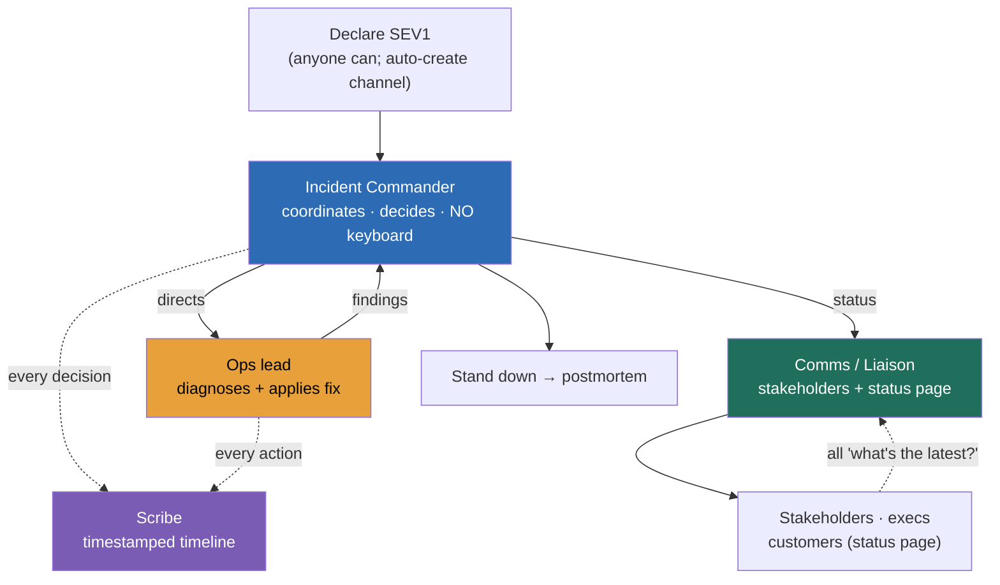

### Learning objectives
- State the **central thesis**: a major incident is a *coordination* problem before it is a *technical* problem, and a single decision-maker beats a flailing crowd, so the first move under fire is to **declare and assign roles**, not to start typing.
- Describe the **Incident Command System** at architecture altitude: an **Incident Commander** who coordinates and decides but does not touch the keyboard, an **Ops lead** doing the fixing, a **Comms/Liaison lead** owning stakeholders and the status page, and a **Scribe** owning the timeline.
- Reason about **severity** as a pre-agreed trigger table (SEV1–SEV4 with explicit thresholds) so declaring is a *lookup*, not a judgment call made by an anxious engineer, and so the bias against declaring (ego, optimism) stops costing you minutes of MTTR.
- Run a **comms cadence and a single source of truth**: a fixed update interval (every 15–30 minutes, even when there is no new information), one incident channel, one status page, so stakeholders stop interrupting the responders.
- Build the **incident system as a Director**, decision-making under uncertainty (disagree-and-commit), follow-the-sun handoffs for long incidents, and blameless framing that starts *during* the incident, so the org responds correctly when you are asleep or on a plane.

### Intuition first
Watch how a fire department runs a four-alarm fire and you have the whole model. There is **one Incident Commander** standing at the truck with a radio and a clipboard. That person is not holding a hose. Their entire job is to hold the picture in their head: who is inside, where the fire is moving, which crew goes to the roof, when to pull everyone out. The people on the hoses are skilled and busy and have a ten-foot view of the world. If each of them decided independently where to point the water, the building would burn down while they argued. So nobody fights the fire and runs the fire at the same time. The split is the point.

A production outage is the same shape. The instinct of a room full of good engineers is for everyone to dive into the logs at once, three theories running in parallel, nobody watching the whole board, and the VP texting each of them privately for status, which pulls them further off the problem. **The fix is not smarter engineers, it is structure imposed early**: one coordinator who decides and does not debug, hands that fix, a voice that talks to the outside world on a steady drumbeat, and a scribe writing down what happened so tomorrow's postmortem isn't a memory contest. The Director's job is to make sure that structure exists and fires itself off automatically, so the war room runs the same whether you are in it or not.

### Deep explanation

**The thesis: coordination, not cleverness, is the bottleneck in a major incident.** A single severe outage rarely fails for lack of technical skill in the room, it fails because nobody owns the decision, three people chase three hypotheses without sharing, the rollback and the forward-fix start at the same time and collide, and stakeholders interrupt the responders for status. The Incident Command System (ICS), borrowed wholesale from firefighting and disaster response, exists to convert a smart crowd into a coordinated team. The Director-altitude statement: *you do not respond to a SEV1 by debugging harder, you respond by declaring and assigning roles, because the constraint is coordination and a single decision-maker removes it.* You **reject** "everyone just jumps on and we'll sort it out", because the failure mode of that approach is a flailing crowd with no shared picture, which reliably adds minutes-to-hours of MTTR.

**The role split is the core mechanism: separate the people who decide, fix, talk, and record.** Four roles, each with one job, and the discipline is keeping them separate under stress:

- **Incident Commander (IC), the coordinator and decision-maker, explicitly not hands-on-keyboard.** The IC holds the picture, drives the cadence, decides between rollback and forward-fix, decides when to escalate, decides when the incident is over. The single most common and most damaging failure is the IC dropping into the logs to debug, because the moment they do, nobody is coordinating and the room reverts to a crowd. For a SEV1 the IC is often a senior engineer or EM trained in the role, *not* necessarily the most senior person present and *not* the subject expert (the expert is too valuable on the keyboard to also coordinate).
- **Ops lead (the hands), the person or small group actually applying the fix.** They take direction from the IC, run the diagnosis and the remediation, and report findings up. In a small incident the IC and Ops can briefly be the same person, but the instant a second workstream appears, split them.
- **Comms / Liaison lead, owns the outside world.** Internal stakeholder updates, the public status page, the exec bridge, the support and account teams. Their existence is what frees the responders to stay heads-down: every "what's the latest?" goes to Comms, not to the engineer mid-fix. For a customer-facing SEV1, this role pays for itself in the first ten minutes.
- **Scribe, owns the timeline.** A running, timestamped log in the incident channel: what we saw, what we tried, what changed, what we decided and when. This is cheap during the incident and priceless after it, the postmortem timeline is a transcript, not a reconstruction from fading memory.

**Severity levels make declaring a lookup, not a judgment call.** Define SEV1–SEV4 in advance with explicit, observable triggers so an anxious on-call engineer at 3am declares correctly without a meeting:

- **SEV1**, critical: full or partial outage of a core flow, major data loss/corruption risk, or a security breach in progress. Customer-visible, revenue-affecting, all-hands. Page leadership, open the bridge, assign all roles.
- **SEV2**, major: significant degradation, a key feature down, elevated error rates breaching the SLO burn-rate threshold, but the core path limps. Page the on-call and the IC; Comms on standby.
- **SEV3**, minor: contained degradation, a non-critical feature, a single tenant, no SLO breach. Handle in working hours; lightweight roles.
- **SEV4**, low: cosmetic or internal-only, no customer impact. A ticket, not an incident.

The numbers that matter: tie SEV2 to a concrete trigger like *"error-budget burn rate ≥ 14× (budget gone in ~2 days), or p99 latency > 2× SLO for 5 minutes"* so the threshold is mechanical. The trade-off you are managing is **over-declaring vs under-declaring**: set the bar too low and you cry wolf, on-call burns out, and SEV1 stops meaning emergency; set it too high and real outages run for 40 minutes as a "weird blip" before anyone declares. The Director answer biases slightly toward over-declaring on customer-facing impact, because a five-minute false alarm is cheap and a forty-minute undeclared outage is not, and you tune the thresholds from the actual page volume rather than guessing.

**Declare early, the bias against it is ego and optimism, and it costs MTTR directly.** The most expensive minutes in an incident are the ones before it is declared, when one engineer is quietly sure they can fix it in two minutes and doesn't want to "make a fuss." Optimism ("it'll recover on its own") and ego ("I've got this") both delay the moment roles get assigned and help arrives. Make declaring **cheap and reversible**: anyone can declare, declaring is celebrated not punished, and downgrading or closing a too-eagerly-declared incident is a normal, no-blame action. The cultural rule, *"if you're wondering whether to declare, declare"*, is worth more than any tooling, because it attacks the actual delay. You **reject** a high-friction declaration process (needs a manager's approval, a form, a justification), because friction reintroduces exactly the delay you are trying to remove.

**A comms cadence on a fixed drumbeat is what keeps stakeholders out of the responders' hair.** Set an explicit interval, every **15 minutes for a SEV1, every 30 for a SEV2**, and post an update *even when there is no new information* ("still investigating, next update at 14:45"). Silence is the enemy: when stakeholders don't hear anything, they assume the worst and start DMing the responders individually, which is the single biggest avoidable drag on the people fixing the problem. Two audiences, two channels: an **internal** update (the incident channel and an exec summary, more technical, more frequent) and an **external status page** (customer-facing, plain-language, conservative). The status-page discipline matters operationally, customers tolerate a known, communicated outage far better than a silent one, and your support load drops when the page is current.

**One incident, one source of truth.** A single dedicated incident channel (a fresh Slack channel per incident, auto-created by the incident tool) and a single incident document. Everything, findings, decisions, the timeline, the current status, lives there and only there. The failure mode you are designing against is **fragmentation**: status in one DM thread, the timeline in someone's head, the customer message in a different channel, and a new responder joining 30 minutes in with no way to get current. The rule, *"if it isn't in the channel, it didn't happen"*, makes the channel authoritative and makes handoffs survivable.

**Decision-making under uncertainty: the IC decides, others advise, the room disagrees-and-commits.** Incidents are decided on partial information against the clock; waiting for certainty is itself a decision, usually a bad one. The IC's job is to take the inputs, make the call (roll back vs forward-fix, shed load vs scale up, fail over vs wait), and move, while keeping a cheap path to revise if new data arrives. When two engineers disagree on the fix, the IC hears both briefly, decides, and the room commits, **disagree-and-commit**, because parallel competing fixes are worse than one decisive wrong-then-corrected one. You **reject** consensus decision-making in the war room, because building consensus burns the one resource (time) you cannot get back, and a crowd optimizing for "everyone agrees" is exactly the flailing you declared the incident to escape.

**Handoffs: long incidents need follow-the-sun, and the handoff is itself a risk.** An incident that runs past a few hours will outlast a responder's effective attention; fatigue degrades judgment precisely when judgment matters. Plan **explicit IC handoffs**, ideally across time zones (follow-the-sun) for a global org, where the outgoing IC briefs the incoming one against the single source of truth: current status, hypotheses ruled in/out, the next planned action, who holds each role. The single document is what makes this possible, the new IC reads the channel and is current in minutes, not re-derives the incident from scratch. A botched handoff (no overlap, no written state) resets the incident to minute zero, which is why the scribe's timeline is load-bearing.

**Blameless framing starts during the incident, not in the postmortem.** The conditions for an honest postmortem are set under fire. If, mid-incident, the question is "who pushed the bad config?", responders go defensive, stop sharing what they actually did, and the timeline gets sanitized in real time. The IC enforces a blameless tone from minute one, *we are fixing the system, not finding the culprit*, so that the person who ran the command that triggered the outage is the most useful person in the room (they know exactly what happened) rather than the quietest. Blameless is not no-accountability, it is the recognition that good people in a system that let them make a mistake means you fix the system, and that honesty is the input the whole learning loop runs on.

**The Director builds the system so the org responds without them in the room.** None of the above should depend on a specific person being awake. The Director owns the operating model: an incident tool (PagerDuty, Incident.io, FireHydrant, Opsgenie) that auto-creates the channel, assigns roles, and starts the timeline on declaration; a trained bench of ICs so any senior engineer can run a SEV1; documented severity triggers and runbooks; a comms-cadence default baked into the tool; and regular game-days that rehearse the muscle. The signal you are sending in the interview is that you have made incident response a *capability of the organization*, not a heroic act of the few, which is precisely the altitude difference between leading a team and leading an org.

Go deeper — ICS roles, severity triggers, and the comms templates (IC depth, optional)

**Fuller ICS role set (scales up for the biggest incidents):**

- **Incident Commander (IC)** — coordinates, decides, owns the incident lifecycle. Never on the keyboard during a SEV1.
- **Deputy IC** — shadows the IC on long/large incidents, ready to take over at handoff; tracks action items the IC voices.
- **Operations lead** — directs the technical workstream; may marshal several subject-matter experts (SMEs).
- **Communications lead** — internal stakeholder updates + status page; drafts the customer message.
- **Liaison / Customer lead** — interfaces with support, account managers, sometimes affected enterprise customers directly.
- **Scribe** — timestamped timeline in the incident channel; flags decisions and action items for the postmortem.
- **Planning / SME pool** — experts pulled in on demand and released when their area is cleared, so the room doesn't bloat.

**Severity trigger table (illustrative — tune to your SLOs):**

| SEV | Trigger (mechanical where possible) | Roles | Cadence | Who's paged |
|---|---|---|---|---|
| **SEV1** | Core flow down for >X% users; data-loss risk; active security breach | IC + Ops + Comms + Scribe | 15 min | On-call, IC, leadership |
| **SEV2** | Burn rate ≥ 14× (budget gone ~2 days) OR p99 > 2× SLO for 5 min | IC + Ops (+ Comms standby) | 30 min | On-call, IC |
| **SEV3** | Non-critical feature degraded; single tenant; no SLO breach | Lightweight (IC optional) | Working hours | On-call |
| **SEV4** | Cosmetic / internal-only; no customer impact | Ticket | n/a | Backlog |

**Comms update skeleton (internal):** `[HH:MM] SEV-n | <one-line impact> | Status: investigating/identified/monitoring/resolved | What we know | Current action | Next update HH:MM | IC: @name`.

**Status-page lifecycle:** Investigating → Identified → Monitoring → Resolved. Each transition gets a plain-language line; never post a root-cause guess customers will hold you to. Resolve only after the fix has held for a defined cool-down (e.g. 30–60 min of clean signal), not at the moment the graph dips.

**Stand-down checklist before closing:** impact confirmed ended, monitoring clean for the cool-down window, status page resolved, scribe's timeline complete, postmortem owner + date assigned, action-item placeholders captured, on-call thanked.

### Diagram: the war room during a SEV1

### Worked example: a payments SEV1, declare to stand-down
A payments service's checkout success rate drops from 99.7% to 71% at 14:02. The on-call engineer sees the graph, feels the pull to "just look for two minutes", and instead **declares a SEV1 at 14:04** (declaring early is the whole game). The incident tool auto-creates `#inc-2026-0612-checkout`, starts the timeline, and pages the IC bench.

- **Roles assigned by 14:06.** A trained IC takes command (she will not touch a terminal). The most senior payments engineer becomes **Ops** (kept on the keyboard, *not* made IC, the expert is too valuable to also coordinate). An EM takes **Comms**. A second engineer takes **Scribe**. *Rejected: making the payments expert the IC*, because then the best debugger is half-coordinating and nobody is fully doing either job.
- **Cadence set: 15 minutes.** Comms posts at 14:08 — internal: "SEV1, checkout success 71%, investigating, next update 14:23"; status page: "We're investigating elevated payment failures." Every exec asking for status is pointed at the channel, Ops is never interrupted.
- **Decision under uncertainty at 14:18.** Ops finds a payment-provider timeout spike correlated with a config push at 13:58. Two views: roll back the config vs forward-patch the timeout. The IC hears both for 60 seconds, **decides rollback** (faster, reversible), the room disagrees-and-commits. *Rejected: running both fixes in parallel*, because colliding changes make the signal unreadable.
- **Recovery and the cool-down.** Rollback at 14:21; success rate climbs to 99.5% by 14:26. The IC does **not** declare victory at the first green pixel, status moves to "Monitoring" and holds for a 30-minute cool-down. A clean 14:56 graph triggers "Resolved."
- **Handoff that didn't happen, and the one that did.** This incident closed in under an hour, so no follow-the-sun handoff was needed, but the IC notes that had it run past 18:00 local, command would have handed to the APAC IC against the channel timeline, which is exactly why the scribe's log was kept live.
- **Stand-down into postmortem.** At 14:58 the IC stands the incident down: timeline complete, postmortem owner and a 48-hour deadline assigned, blameless tone held throughout (the engineer who pushed the 13:58 config was the most useful voice in the room, not the quietest).

The number a Director carries out: *declared in 2 minutes, roles in 4, mitigated in 19, no responder pulled off the fix for status, and a complete timeline for the postmortem*, not "we eventually fixed it."

### Trade-offs table: how the war room makes decisions
| Decision axis | Single IC (command) | Consensus / crowd | Declare early (low bar) | Wait-and-see (high bar) |
|---|---|---|---|---|
| **Speed** | fast — one decider, no debate loop | slow — burns time building agreement | fast MTTR — help arrives sooner | slow — minutes lost before roles exist |
| **Coordination cost** | low — one picture, clear roles | high — N theories, no owner | small fixed overhead per incident | none until it's too late |
| **Main risk** | IC makes a wrong call (cheap to revise) | flailing; collisions; no decision | occasional false alarm (cheap) | undeclared outage runs long (expensive) |
| **Use when…** | any SEV1/SEV2 — the default | never in the war room (fine for postmortem) | customer-facing or ambiguous impact | only the most trivial, clearly-bounded blips |

The Director move is defaulting to a single IC and a low declaration bar, and treating the rare false alarm or revised call as the cheap, expected cost of a fast, coordinated response.

### What interviewers probe here
- **"A core service is down. Walk me through how you run the response, and who's in charge?"** *Strong signal:* declare immediately against a pre-agreed severity, assign IC / Ops / Comms / Scribe, name a single IC who coordinates and does not debug, set a 15–30-minute comms cadence to one channel and one status page, and decide rollback-vs-fix decisively. *Red flag:* "everyone gets on the call and we debug together", a flailing crowd with no coordinator, no comms, no timeline, and hero-debugging by whoever's loudest.
- **"How do you decide when to declare, and at what severity?"** *Strong signal:* pre-agreed, mechanical triggers (a burn-rate or latency threshold) so declaring is a lookup not a judgment call, an explicit bias toward declaring early on customer impact because a false alarm is cheap and an undeclared outage is not, and anyone-can-declare with no-blame downgrades. *Red flag:* declaring is a senior-only judgment call gated by ego and a form, so real outages run long before anyone "makes it official."
- **"Stakeholders are panicking and pinging your engineers mid-incident. What's wrong and how do you fix it?"** *Strong signal:* a dedicated Comms role and a fixed cadence (updates even with no news) to one source of truth, so every "what's the latest?" routes to Comms and never to the people fixing it; the status page absorbs customer anxiety. *Red flag:* responders fielding DMs from execs, no comms role, silence between updates that drives stakeholders to escalate harder.
- **"How does your org handle a SEV1 at 3am when you're asleep?"** *Strong signal:* the response is a *system*, an incident tool that auto-creates the channel and assigns roles, a trained IC bench so any senior engineer can run it, documented triggers and runbooks, follow-the-sun handoffs, and game-day rehearsal. *Red flag:* "they'd call me", the org depends on a hero, which is exactly what a Director is supposed to have engineered away.

The through-line at Director altitude: a major incident is a coordination problem, so you impose a single decision-maker and a clean role split early, run it on a steady comms drumbeat with one source of truth, and build the whole thing into the org's tooling and training so it runs without you, and you delegate the mechanics with a stated prior ("I'd have the SRE team standardize on one incident tool and run monthly game-days; my prior is Incident.io over a homegrown bot because the role-assignment and timeline automation are the parts teams skip under stress").

### Common mistakes / misconceptions
- **No single decision-maker.** A room of capable engineers with no IC is a flailing crowd: parallel theories, colliding fixes, no shared picture, and MTTR measured in the hours nobody was coordinating.
- **The IC stuck hands-on-keyboard.** The moment the commander drops into the logs to debug, coordination stops and the room reverts to chaos. The IC's value is holding the picture, not finding the bug.
- **Not declaring (ego and optimism).** "I've got this, two more minutes" is the most expensive sentence in operations. The bias must be toward declaring early, with declaring made cheap and downgrades blameless.
- **Silent comms.** No updates between fixes makes stakeholders assume the worst and DM the responders, pulling the people fixing the problem off the problem. Update on a fixed cadence even when there's nothing new.
- **No scribe, no timeline.** Without a live timestamped log, the postmortem is a memory contest, contributing factors get lost, and action items are built on a guessed sequence of events.

### Practice questions

**Q1.** Your most senior engineer is also the only person who deeply understands the failing subsystem. Should they be the Incident Commander? Why or why not?
> *Model:* No. The IC must coordinate, hold the whole picture, and decide, and explicitly stay off the keyboard. The deep expert is most valuable as the Ops lead actually diagnosing and fixing, because that's the scarce skill in the room. If I make them IC, I get a half-coordinating expert and a half-debugging coordinator, and neither job gets done. I'd put a trained IC (a senior engineer or EM who's run incidents before, not necessarily the most senior person) in command and keep the expert on the keyboard. The whole point of the role split is that nobody fights the fire and runs the fire at once, the expert is too valuable on the hose to also work the radio.

**Q2.** Define the severity triggers you'd set so that declaring a SEV1 is a lookup, not a judgment call. What's the trade-off in where you set the bar?
> *Model:* I'd make SEV1 mechanical: a core flow (checkout, login, the primary read path) down or degraded for more than X% of users, or an active data-loss or security event. SEV2 ties to the SLO, error-budget burn rate ≥ 14× (budget gone in ~2 days) or p99 latency > 2× the SLO for 5 minutes. The point is that an anxious on-call at 3am reads the table and declares without a meeting. The trade-off is over- vs under-declaring: too low a bar and we cry wolf, on-call burns out and SEV1 stops meaning emergency; too high and real outages run 40 minutes as a "weird blip." I bias slightly toward over-declaring on customer-facing impact, a five-minute false alarm is cheap, a forty-minute undeclared outage isn't, and I tune the thresholds from actual page volume rather than guessing once.

**Q3.** An incident has been running for four hours and your IC is clearly fatigued. What's your protocol, and what makes it safe to execute?
> *Model:* A planned IC handoff, ideally follow-the-sun to a fresh IC in another time zone. Fatigue degrades judgment exactly when it matters, so a long incident must change hands deliberately rather than run a tired commander into the ground. What makes it safe is the single source of truth: the incident channel and the scribe's live timeline mean the incoming IC reads current status, ruled-in/ruled-out hypotheses, the next planned action, and who holds each role, and is current in minutes instead of re-deriving the incident. The outgoing IC does a brief verbal handoff against that document with a few minutes of overlap, then formally transfers command in the channel so everyone knows who's in charge. A handoff with no written state resets the incident to minute zero, which is why the timeline is load-bearing, not bureaucracy.

**Q4.** A VP keeps DMing three of your responders for status during a SEV1, and they're falling behind on the fix. How do you handle it, structurally, not just this once?
> *Model:* This is a missing-Comms-role problem, not a VP problem. Structurally: every incident has a dedicated Comms/Liaison lead and a fixed cadence (15 min for a SEV1), posting to one source of truth even when there's no new information. I'd point the VP, and everyone, to the incident channel and the exec summary Comms is maintaining, and make it a norm that responders don't field individual status pings, that's Comms's job. The reason silence drives the DMs is that when stakeholders hear nothing they assume the worst and escalate; a reliable drumbeat removes the anxiety that causes the interruptions. The status page does the same for customers. The Director framing: I don't fix this by asking the VP nicely, I fix it by building a comms function into the incident process so the responders are structurally insulated.

### Key takeaways
- **A major incident is a coordination problem first.** The bottleneck is rarely skill, it's the lack of a single owner, so the first move under fire is to declare and assign roles, not to start debugging, because one decision-maker beats a flailing crowd.
- **Split the roles and keep them split:** an Incident Commander who coordinates and decides but never touches the keyboard, an Ops lead who fixes, a Comms lead who owns stakeholders and the status page, and a Scribe who owns the timeline.
- **Make declaring a lookup, not a judgment call.** Pre-agreed SEV1–SEV4 triggers (tied to mechanical thresholds like burn rate or latency) plus a low, blameless declaration bar, because the most expensive minutes are the ones before anyone declares.
- **Run a steady comms cadence to a single source of truth.** Updates every 15–30 minutes even with no news, one incident channel, one status page, so stakeholders stop pulling responders off the fix.
- **Build the response as a system, not a hero act.** Tooling that auto-assigns roles and starts the timeline, a trained IC bench, documented triggers, follow-the-sun handoffs, and blameless framing from minute one, so the org responds correctly when the Director is asleep or on a plane.

> **Spaced-repetition recap:** A major incident is a **coordination** problem before a technical one, so you **declare early and impose structure**: one **Incident Commander** who coordinates and decides but never debugs, an **Ops** lead who fixes, a **Comms** lead who owns stakeholders and the status page, a **Scribe** who owns the timeline. **Severity is a pre-agreed trigger table** (SEV1–SEV4, mechanical thresholds) so declaring is a lookup, and you bias toward over-declaring on customer impact because a false alarm is cheap and an undeclared outage is not. Run a **fixed comms cadence** (15–30 min, even with no news) to **one source of truth**; the IC decides under uncertainty and the room **disagrees-and-commits**; long incidents **hand off follow-the-sun** against the timeline; **blameless framing starts during** the incident. The Director **builds the system** (tooling, IC bench, runbooks, game-days) so the org responds without them in the room.

---

*End of Lesson 13.4. Run the war room like a fire ground: one commander who decides and doesn't hold a hose, declared early, on a steady drumbeat, built so the org fights the fire without you there.*
