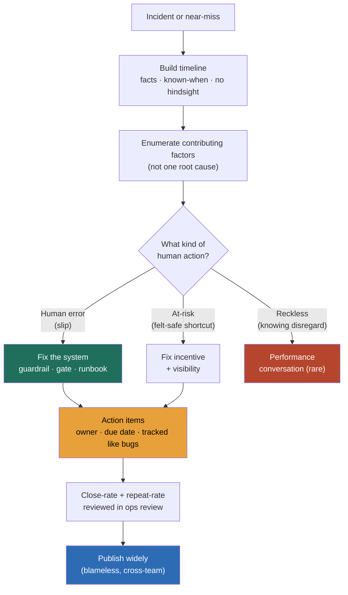

### Learning objectives
- State the **purpose of a postmortem** at architecture altitude: it converts a single outage into **organizational learning**, a durable change to the system or the process, not a write-up that gets filed and forgotten.
- Defend the **blameless principle** as an engineering position, not a kindness: when a competent engineer makes a mistake, the system *let* them, so the fix is the guardrail, not the human, and blame is a bug because it drives incidents into hiding.
- Replace the single **root cause** with **contributing factors**: complex systems fail when several latent weaknesses line up, and the "5-whys that stops at *the human erred*" is the most common way to miss the real fix.
- Build the **action-item discipline** that makes the whole exercise worth doing: systemic fixes over "be more careful," owners and due dates, and a close rate you track like a bug backlog, because the graveyard of perpetually-open items is where learning goes to die.
- Name **psychological safety** as the precondition you own as a Director: blame produces hidden incidents and repeat failures, so the culture that makes the truth tellable is the actual deliverable, and the artifact is downstream of it.

### Intuition first
Aviation is the model, and the contrast with how most engineering orgs behave is the whole lesson. When a plane has a near-disaster, investigators do not start by asking *which pilot to fire*. They pull the flight recorder, build a minute-by-minute timeline of what the crew knew and when, and ask *why did the situation look reasonable to a competent crew at each step?* The output is almost never "the pilot was careless." It is "the altimeter and the autopilot disagree in this one configuration, the checklist had a gap, fatigue rules let the crew fly tired, and here is the redesign so the next crew can't fall into the same hole." The industry got astonishingly safe precisely because it treats the human at the controls as the **last symptom** of a system that set them up, not the cause.

Now picture the opposite, the org where an outage ends with *"Raj pushed a bad deploy, we talked to Raj."* Watch what happens next. Raj, and everyone watching, learns the lesson that the safe move is to **not report**, to quietly roll back, to never volunteer the near-miss. The deploy gate that let a bad change reach production untouched is still there, waiting for the next person. You have traded one honest write-up for a culture of silence, and silence is where repeat outages breed. The postmortem's job is to be the flight recorder, and the Director's job is to make telling the truth into the recorder feel safe.

### Deep explanation

**A postmortem is a learning artifact, and if nothing changes it was a status report with a sad headline.** The deliverable of an incident is not the document, it is the **delta**: a guardrail that didn't exist this morning, a runbook step that's now correct, an alert that will now fire before customers notice. The document is the vehicle for that delta and the receipt that it happened. A Director judges a postmortem culture on exactly one outcome metric, **does the repeat-incident rate fall**, and the leading indicator is whether action items actually close. Everything below serves those two numbers.

**The blameless principle is a position about causation, not about being nice.** The claim is precise: when a smart, well-intentioned engineer makes a mistake, the mistake is a **symptom of the system's design**, not the cause. If one click can take production down, the failure is the missing confirmation, the missing canary gate, the missing blast-radius limit, and the human is just the component that happened to be standing where the system was weakest. The interview-grade phrasing: *human error is a starting point for investigation, not a conclusion.* You **reject** "hold the engineer accountable" as the lesson, because it is, the rejected: name-and-blame, because it teaches the org to hide incidents, drives the same latent fault to recur under a new name, and replaces a fixable system flaw with an unfixable "be more careful." Just-culture refines this with one line you can defend: you distinguish **human error** (a slip, the design failed, you fix the design) from **at-risk behavior** (a shortcut that felt safe, you fix the incentive and the visibility) from **reckless behavior** (a knowing, unjustified disregard of an obvious risk, the rare case that is genuinely a performance conversation). The vast majority of incidents are the first two, and treating them as the third is the cultural failure.

**The "second story" is the technique that operationalizes blameless.** The first story is *"the engineer ran the wrong command."* The second story asks *why did running that command look correct at the time?* Almost always: the command was in a stale runbook, the dangerous flag had no guardrail, the staging environment didn't match production, the on-call had been paged four times that night. The second story is where the systemic fixes live. An investigation that stops at the first story produces a "be more careful" action item, which is a non-fix, behavior is not a lever you can pull, and ships the latent fault forward intact.

**Contributing factors beat a single root cause, because complex systems do not fail one thing at a time.** The seductive trap is the linear "5 whys" that terminates at *"because a human did X."* Real distributed-system outages are the alignment of several latent weaknesses, each individually survivable: a bad change, *and* a canary gate that was disabled for "just this hotfix," *and* an alert that watched the wrong metric, *and* a runbook that pointed at a dashboard that had been renamed. Remove any one and the outage is a non-event. So the postmortem enumerates the **contributing factors** (the whole set of conditions that had to coincide) and the action items attack as many of them as are cheap to fix. The Director framing: *a single root cause is a comforting fiction that buys you exactly one fix and leaves the other holes open.* You **reject** the single-root-cause template, rejected: "the root cause was the deploy," because it scopes the learning to one factor and you'll be back here when a different change meets the same disabled gate.

**The timeline is facts and what-was-known-when, written to defeat hindsight bias.** After the fact, every decision the responders made looks obvious, *of course it was the cache, why did they spend twenty minutes on the database?* Hindsight bias is the enemy of learning, because it re-blames the responders for not knowing what only became clear later. The discipline: the timeline records what was **observable at each moment** (which alerts had fired, which dashboards were green, what the responder reasonably believed), so the gaps it surfaces are *system* gaps, the alert that didn't fire, the dashboard that lied, the metric nobody was watching, rather than *people* gaps. A good timeline reads as "here is why a competent team went down this path," and every detour it documents is a candidate action item against the observability that allowed the detour.

**Near-misses are postmortem-worthy, because the cheapest lesson is the one the customer never felt.** A change that was caught by the canary and rolled back, a disk that hit 95% and got expanded before it filled, a failover that worked but took 40 minutes when the runbook promised 5, none of these were customer-visible incidents, and all of them are the same latent fault that produces the next real outage. Orgs that only postmortem customer-facing SEV1s are paying full price for every lesson. The mature move is a lightweight near-miss review, a fifteen-minute "this almost happened, here's the one fix," so you **buy the learning before the outage** at a fraction of the cost. Quantify the case: a near-miss review costs an hour of an engineer's time, the SEV1 it prevents costs the incident, the postmortem, the customer trust, and the action items anyway.

**Action items are the entire point, and the failure mode is the graveyard of perpetually-open items.** A postmortem with five eloquent action items that are all still "Open" eighteen months later has taught the org nothing and trained everyone that the ritual is theater. So action items get the same rigor as a P1 bug: a **single named owner** (not a team, a person), a **due date**, a **priority**, and a tracking system where they live next to real work and show up in sprint planning, not a wiki page nobody reopens. The two numbers a Director watches: **action-item close rate** (target a high bar, say 90%+ of high-priority items closed within 30 days, and stale items escalate) and **repeat-incident rate** (the same contributing factor recurring is a direct indictment of an action item that didn't close or didn't fix). Track them on a dashboard, review them in ops review, and the postmortem stops being a document and becomes a backlog that drains.

**Systemic fixes over "be more careful," because behavior is not an engineering control.** The single best filter on an action item: *would this fix have prevented the outage even if the same human made the same mistake?* "Train the team to double-check the flag" fails the filter, the next tired on-call will miss it. "Add a confirmation prompt and a canary gate that blocks the flag in production" passes, it removes the human's ability to make the mistake at all. The hierarchy, borrowed from safety engineering, runs eliminate the hazard > guard against it > warn about it > train people, and "be more careful" sits at the bottom rung that barely works. Every "be more careful" action item is a signal that the investigation stopped at the first story.

**Psychological safety is the precondition you own, and it is upstream of every artifact.** None of the above survives contact with a culture where reporting an incident is dangerous. If the cost of telling the truth in a postmortem is a worse performance review, people optimize rationally: they hide near-misses, they minimize their role, they let the timeline stay vague, and the org's learning rate collapses while its outage rate quietly climbs. So the Director's actual deliverable is the **safety**, the visible, repeated, consequential demonstration that an honest "I ran the command, here's why it looked right, here's the gate we're missing" is rewarded and a blamed engineer is the leader's failure, not the engineer's. The cheapest way to destroy it is to blame once, publicly; everyone recalibrates instantly. **Sharing the postmortem widely** is the other half: a learning org publishes incidents across teams (sanitized, blameless) so that the alert blind spot one team found gets fixed in five other services before it bites them. Hoarding the lesson inside the team that suffered it pays for the same outage N times.

Go deeper — the postmortem template and the metrics that prove it's working (IC depth, optional)

A workable postmortem document has these sections, in this order:

- **Summary** — two sentences: what broke, customer impact, duration.
- **Impact** — quantified: requests failed, users affected, revenue/SLA-credit exposure, error-budget burned (e.g. "consumed 40% of the quarter's budget in 22 minutes").
- **Timeline** — UTC-timestamped facts only, what-was-known-when: detection, escalation, each hypothesis and what the responder observed, mitigation, resolution. No hindsight commentary inline.
- **Detection** — how was it found (alert / customer report / engineer noticed), and the time-to-detect. A customer-reported SEV1 is itself an action item against monitoring.
- **Contributing factors** — the full set of latent conditions that coincided, each phrased as a system property, not a person.
- **What went well** — the mitigations and instincts that limited blast radius; you reinforce these deliberately.
- **Action items** — table of: item · owner (a person) · priority · due date · tracking link. Each tagged *prevent* (stops recurrence), *detect* (finds it faster next time), or *mitigate* (limits impact).
- **Lessons / broader applicability** — which *other* systems share this latent fault.

The MTT* vocabulary the timeline produces:

- **MTTD** (mean time to detect) — incident start → alert fires. High MTTD means a monitoring action item.
- **MTTA** (mean time to acknowledge) — alert → human engaged. High MTTA means an on-call/paging problem.
- **MTTR** (mean time to recover/mitigate) — engaged → impact ends. High MTTR means a runbook/tooling/automation problem.

The four numbers that tell a Director the postmortem program is real, not theater:

- **Action-item close rate** — % of high-priority AIs closed within the SLA (e.g. 30 days). Below ~80% means the program is generating paper, not fixes.
- **Repeat-incident rate** — % of incidents whose contributing factor matches a prior one. Trending up is a direct failure of the close loop.
- **Time-to-publish** — incident resolved → postmortem published (target days, not weeks; the lesson decays fast).
- **Postmortem coverage** — % of SEV1/SEV2 (and ideally significant near-misses) that get one.

### Diagram: just-culture triage and the postmortem flow

### Worked example: a deploy-caused outage, the blameless write-up
A payments service goes down for 22 minutes during business hours. The trigger: an engineer, call them the deployer, shipped a config change that pointed the service at a misconfigured connection pool, and the service began returning 500s on 30% of charge requests. The naive postmortem writes *"root cause: human pushed a bad config; action item: be more careful with config changes,"* and learns nothing. Here is the blameless version.

- **Timeline (facts, what-was-known-when).** 14:02 deploy goes out, the deployer's local and staging tests were green. 14:03 error rate climbs, but the alert is threshold-based on absolute 5xx count and the traffic was low that minute, so it doesn't fire. 14:11 a customer-support ticket surfaces failed charges, an engineer notices, MTTD is **9 minutes** and the detection was a human, not the monitor. 14:14 on-call opens the runbook, which points at a dashboard renamed two sprints ago, costing four minutes. 14:21 the bad config is identified, 14:24 rolled back, recovery at 14:24, MTTR ~**13 minutes** from engagement.
- **Contributing factors, not one root cause.** Four latent weaknesses lined up: (1) a **missing canary gate**, the config went to 100% of traffic with no progressive rollout that would have caught the 500s at 1%; (2) an **alerting blind spot**, the 5xx alert keyed on absolute count, not error *rate*, so a 30% error rate during a low-traffic minute slipped under the threshold; (3) a **stale runbook** pointing at a renamed dashboard, adding four minutes to diagnosis; (4) **staging didn't mirror the production pool config**, so the bad value looked fine pre-deploy. Remove any one, and this is a non-event.
- **Action items, owned and dated.** *Add a canary stage that holds config at 1% for 5 minutes and auto-rolls-back on error-rate regression*, owner Priya (platform), due in 2 weeks, tagged *prevent*. *Switch the 5xx alert to a rate-based burn alert*, owner Sam (SRE), due in 1 week, tagged *detect*. *Add a runbook test in CI that fails if a linked dashboard 404s*, owner Lin (observability), due in 3 weeks, tagged *detect*. *Make staging inherit the prod pool config via shared module*, owner Dana (infra), due in 4 weeks, tagged *prevent*. Each lands in the bug tracker next to feature work, with the close-rate watched in ops review.
- **What we do not write.** We do not write the deployer's name as the cause, we do not write "be more careful," and we do not stop at "the root cause was the config." **Rejected: name-and-blame**, because the deployer did exactly what a competent engineer does with green tests and no canary gate, and naming them teaches the team to deploy quietly and report late. The number a Director carries out: *four systemic fixes, all owned and dated, that close the holes so the next config change can't take payments down, and a detection path that turns the next 9-minute human-found incident into a 1-minute paged one.*

### Trade-offs table: how you frame and act on the incident
| Dimension | Single root cause | Contributing factors | "Be more careful" AIs | Systemic AIs (owned, tracked) |
|---|---|---|---|---|
| **What it captures** | one factor, the trigger | the whole set of coinciding faults | nothing fixable (behavior) | guardrails that remove the failure mode |
| **Learning yield** | low, scoped to one hole | high, attacks several holes | ~zero | high, durable |
| **Recurrence risk** | high, other holes stay open | low, multiple holes closed | high, the next tired human repeats it | low, the human can't make the mistake |
| **Honesty cost** | invites blame (the "cause" is a person) | blameless by construction | masks the real gap | safe, fixes the system |
| **Use when…** | never, as the whole story | always, for every real incident | never, it's a non-fix signal | always, this is the deliverable |

The Director move is enumerating contributing factors and shipping systemic action items that close, and treating a single-root-cause or "be more careful" write-up as a smell that the investigation stopped at the first story.

### What interviewers probe here
- **"Walk me through how you run a postmortem after a serious outage."** *Strong signal:* blameless by construction (the human is the last symptom, the system let them), a facts-and-known-when timeline that defeats hindsight, **contributing factors** not one root cause, **systemic** action items with named owners and due dates tracked like bugs, and the program judged on close rate and repeat rate. *Red flag:* a single "root cause," a name attached to it, and "be more careful" action items, the recipe for hidden incidents and repeats.
- **"How do you actually prevent recurrence, not just document the incident?"** *Strong:* action items live in the bug tracker next to real work with one owner and a due date, high-priority items have a close SLA and stale ones escalate, and you watch repeat-incident rate as the proof the loop closed; near-misses get reviewed so you buy the lesson before the outage. *Red flag:* a wiki page of perpetually-open items nobody reopens, "we wrote it up" treated as done.
- **"An engineer's mistake caused the outage. How do you handle the engineer?"** *Strong:* the just-culture distinction, human error and at-risk behavior are system/incentive problems you fix with guardrails and visibility, only genuine reckless disregard is a performance conversation, and that's rare; the default is "if one person could break it, that's a design flaw." *Red flag:* defaults to accountability-as-blame, conflating "accountable" with "punished," not seeing that punishment buys silence and costs you the next incident's truth.
- **"How do you keep one team's painful lesson from biting four other teams?"** *Strong:* publish postmortems widely and blamelessly across the org, tag the broader-applicability section, and have a mechanism that turns one team's alert blind-spot fix into a fleet-wide check; the learning org shares. *Red flag:* the postmortem stays inside the team that suffered it, and the same latent fault is rediscovered service by service.

The through-line at Director altitude: you own the **culture that makes the truth tellable** and the **operating loop that makes action items close**, because those two things, not the document, are what bend the repeat-incident rate down. The delegation-with-a-prior move: *I'd have the SRE lead pick the incident-management tooling and standardize the template, and set the close-rate SLA with the eng managers; my prior is action items tracked inside the existing bug system (not a separate wiki) because items reviewed in normal sprint planning close far more reliably than items parked on a page nobody reopens.*

### Common mistakes / misconceptions
- **Blaming the human kills honesty.** The moment the lesson is "we talked to Raj," everyone learns that reporting is dangerous, incidents go into hiding, and the latent fault recurs under a new name. Blame is an engineering bug, not a moral stance.
- **A single "root cause" misses the systemic factors.** Complex outages are several latent weaknesses aligning; naming one buys exactly one fix and leaves the other holes open for the next time the same gate is disabled.
- **"Be more careful" is a non-fix.** Behavior is not a control you can engineer; the action item must remove the human's ability to make the mistake (a gate, a confirmation, a guardrail), or it changes nothing.
- **Action items that never close make the ritual theater.** Five eloquent items still "Open" eighteen months later taught nobody anything; track them like P1 bugs with owners, dates, a close-rate SLA, and escalation.
- **Hoarding the learning inside the team.** Not publishing the postmortem widely means five other services with the same alert blind spot pay full price for the same lesson; the learning org shares blamelessly.

### Practice questions

**Q1.** An engineer ran a database migration that locked a table and caused a 15-minute outage. Your VP wants to know "who's accountable and what we're doing about it." How do you respond?
> *Model:* I'd reframe "accountable" away from "who to blame." A competent engineer ran a migration that the system permitted to lock production, so the failure is the system's, not theirs, the second story is *why did running that migration look safe?* Likely: no required online-migration tooling, no staging dataset large enough to surface the lock, no guardrail that blocks lock-taking DDL on a hot table. The contributing factors, not one cause: missing online-migration standard, missing lock-detection in CI, a runbook that didn't flag the table's traffic. Action items, owned and dated: adopt an online-schema-change tool with a single owner, add a CI check that rejects blocking DDL on high-traffic tables, both in the bug tracker with a 2-week SLA. To the VP: holding the engineer "accountable" via blame buys us silence on the next incident; the durable fix is the guardrail so no engineer can take that lock, and I'll report the close rate in ops review.

**Q2.** Your postmortem dashboard shows 60 open action items, the oldest 14 months old, and a repeat-incident rate climbing to 25%. What's broken and what do you do?
> *Model:* The two numbers are linked, action items aren't closing, so contributing factors aren't getting fixed, so incidents repeat, the close loop is broken and the program is generating paper. Concretely: AIs probably live on wiki pages, not in the bug tracker, so they never surface in sprint planning and rot. Fixes: migrate every open AI into the bug system next to real work, assign a single named owner and due date to each (a team is not an owner), set a close-rate SLA (say 90% of high-priority within 30 days) with stale items auto-escalating to me, and review the dashboard in every ops review. I'd also triage the 60: many 14-month-old items are probably stale or superseded, close them honestly rather than carry fiction. The target is repeat rate trending down within a quarter, the proof the loop closed.

**Q3.** A team only writes postmortems for customer-facing SEV1s. An engineer mentions a failover drill that "took 40 minutes instead of the 5 the runbook promised, but no customers noticed." Should that get a postmortem? Why?
> *Model:* Yes, it's a near-miss and it's the cheapest lesson on the table. The 40-vs-5-minute gap is the exact latent fault that turns the next *real* failover, the one during an actual outage, into a 40-minute customer-facing SEV1 instead of a 5-minute blip. Buying the lesson now costs a fifteen-minute near-miss review; buying it during a real incident costs the outage, the trust, and the same action items anyway. The review's contributing factors are likely a stale runbook and untested automation; the action items, fix the runbook, add the failover to a regular game-day so the 40 becomes 5, owned and dated. The Director point: orgs that only postmortem SEV1s pay full price for every lesson; near-miss review is how you learn before the customer feels it.

**Q4.** In a postmortem review, the responders are getting visibly defensive and the timeline keeps drifting into "well, I assumed X because the dashboard looked fine." How do you steer it, and why does it matter?
> *Model:* That drift is actually the gold, "I assumed X because the dashboard looked fine" is a system gap (the dashboard lied or the alert didn't fire), not a person gap, so I'd explicitly name it as a contributing factor against observability and thank them for surfacing it. The defensiveness signals the room doesn't yet feel blameless, so I'd reset: state out loud that we're looking for what the system let happen, not who to blame, and that a competent team going down that path is information about the system. I'd rewrite any timeline line that reads as judgment ("they should have known") into what-was-known-when ("the dashboard was green, the alert hadn't fired"). Why it matters: if responders feel hunted, they minimize and the timeline goes vague, and a vague timeline can't generate the systemic action items that are the whole point. Psychological safety is the precondition; without it the artifact is worthless.

### Key takeaways
- **A postmortem's deliverable is the delta, not the document:** a guardrail, runbook fix, or alert that didn't exist this morning. Judge the program on repeat-incident rate falling and action items closing, not on the write-up existing.
- **Blameless is a position on causation:** a competent engineer's mistake is a symptom of system design, so the fix is the guardrail, not the human. Blame is a bug, it drives incidents into hiding and the latent fault recurs; reserve the performance conversation for genuine reckless disregard, which is rare.
- **Contributing factors beat a single root cause:** complex systems fail when several latent weaknesses align, so enumerate the whole set and attack as many as are cheap to fix; a single "root cause" buys one fix and leaves the other holes open.
- **Action items are the point, and "be more careful" is a non-fix:** systemic guardrails that remove the human's ability to err, with a named owner, a due date, tracked like P1 bugs, and a close-rate SLA. Behavior is not a control you can engineer.
- **Psychological safety is the precondition you own, and sharing is the multiplier:** blame produces silence and repeats, so make telling the truth safe and visibly rewarded; then publish blamelessly across the org so one team's lesson fixes the same fault in five other services.

> **Spaced-repetition recap:** A postmortem turns an outage into **organizational learning**, the deliverable is the **delta** (a new guardrail), not the document. **Blameless** is a claim about causation: a competent engineer's mistake is a **symptom** of system design, so fix the system, not the human (blame → hidden incidents → repeats; reserve accountability-as-conversation for rare reckless disregard). Enumerate **contributing factors** (several latent faults aligned), not a single **root cause** that buys one fix. The **timeline** is facts and known-when to defeat hindsight; **near-misses** buy the lesson before the outage. **Action items** are the point: systemic fixes over "be more careful," named owner + due date, tracked like P1 bugs with a **close-rate SLA**, judged by the **repeat-incident rate**. **Psychological safety** is the precondition the Director owns; publish widely and blamelessly so one team's lesson fixes five other services.

---

*End of Lesson 13.5. The postmortem only earns its cost when the truth is safe to tell and the action items actually close, and both of those are the Director's culture to build, not the document's job to carry.*
