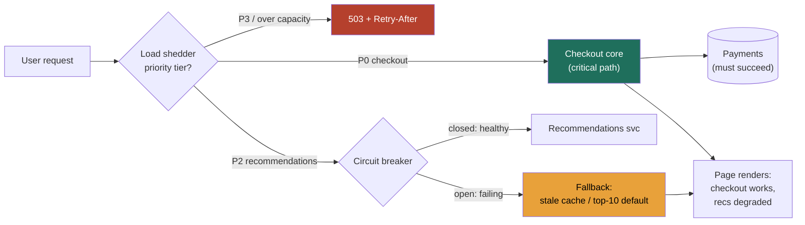

### Learning objectives
- State the **bend-don't-break thesis**: when a dependency fails, a Director-grade system serves a *degraded-but-working* experience that protects the revenue path, instead of a cascading failure that takes everything down with it.
- Name and sequence the **resilience patterns** that produce that outcome, circuit breakers, fallbacks, load shedding, backpressure, bulkheads, and bounded retries with jitter, and know which one each failure calls for.
- Recognize the two amplifiers that turn a small failure into an outage, the **retry storm** and the **cascade**, and design them out with budgets, jitter, and breakers before they appear in an incident.
- Build the **replay/backfill path** so "the number is wrong" is an idempotent re-run from retained raw, not an outage-grade scramble.
- Treat **on-call load as a system you manage**, not noise you tolerate, symptom-only alerts, a per-shift alert budget, a humane rotation, and pager load tracked as a first-class metric.

### Intuition first
A good building does not try to be unbreakable in an earthquake, it tries to **bend**. The frame flexes, sacrificial fuses give way in a controlled order, the non-essential cladding can fall off, but the structure stays standing and everyone walks out. A rigid building that refuses to bend is the one that pancakes. Resilience is not the absence of failure, it is the *choreography* of failure: deciding in advance what is allowed to break, in what order, so that the thing you cannot lose stays up.

Your system is that building, and an outage is the earthquake. When the recommendations service falls over, the question is not "how do we keep recommendations perfect," it is "what is allowed to break so that **checkout** stays standing." A circuit breaker is the sacrificial fuse that trips before the bad floor drags down the good ones. A fallback is the plain default you show when the fancy feature is gone. Load shedding is throwing the non-essential cargo overboard to keep the ship afloat. And the people on the pager are part of the structure too: a rotation that pages on everything is a building with a fire alarm that rings all night, the alarm stops meaning anything, and the humans burn out long before the next real quake. Design the bending, on both halves, and the rest of this lesson is detail.

### Deep explanation

**Two distinct probes live in this topic, and a Director owns both.** The first, *"dependency X is down, what happens to your system?"*, tests whether you build systems that degrade gracefully instead of cascading. The second, *"how do you keep on-call sustainable for a large org?"*, tests whether you treat pager load as an operating-model problem you manage rather than a tax engineers absorb. The through-line: **resilience is a system property you engineer on purpose**, in the request path and in the rotation, and naming the trade-offs (degrade vs fail-hard, alert sensitivity vs fatigue) is the signal.

**Graceful degradation is the headline behavior, serve a degraded-but-working experience, never a blank page.** When a non-critical dependency fails, the system should *flag the feature off* and keep the core path alive: a product page renders without the "customers also bought" carousel, search returns results without the personalized re-ranking, the feed loads from a slightly stale cache instead of the live ranker. The discipline is to classify every dependency as *critical* (the request cannot succeed without it, the payment authorizer for checkout) or *non-critical* (the request is merely worse without it, recommendations, related-items, the activity sidebar) and to make non-critical failures invisible to the revenue path. You **reject** "fail the whole request if any dependency errors" because it converts a recommendations outage, which should cost you nothing, into a checkout outage, which costs you the business.

**A circuit breaker stops you from hammering a service that is already on the floor, and it is the single most important pattern for preventing the cascade.** A breaker wraps every call to a dependency and watches the error rate. While the dependency is healthy the breaker is *closed* and calls pass through. When errors cross a threshold, say **more than 50% of calls failing over a 10-second rolling window of at least 20 requests**, the breaker *opens* and every subsequent call fails fast (returns immediately to the fallback) for a cool-down of, typically, **5 to 30 seconds**, instead of piling onto a dependency that is timing out. After the cool-down the breaker goes *half-open* and lets a small probe of traffic through: if those succeed it closes, if they fail it re-opens. The number that matters is *fail-fast latency*: an open breaker returns in microseconds, so a downstream that is timing out at 30 seconds stops consuming your threads, connections, and patience. You **reject** "just retry until it works" because retrying into a saturated dependency is exactly how you keep it saturated.

**A fallback is what you serve when the breaker is open, and it must be cheap and pre-decided.** The hierarchy, best to worst: a *fresher* cached value, a *staler* cached value, a *static default* (the global top-10 instead of the personalized list), an *empty-but-graceful* response (the carousel just isn't there), and only as a last resort a *typed error the caller can degrade around*. Decide the fallback per dependency *before* the incident, and make it not depend on the thing that's down, a fallback that calls the same failing service is no fallback at all. The stated trade-off of a stale-cache fallback: you serve **possibly-wrong-because-old** data over **definitely-absent** data, which is correct for recommendations and wrong for an account balance, so the classification has to be deliberate.

**Load shedding protects the core by dropping low-priority traffic under overload, on purpose, early.** When demand exceeds capacity, a system that admits everything degrades for *everyone*, latency climbs, queues fill, and it eventually falls over serving no one. Shedding inverts that: you assign **priority tiers** (P0 = the paying checkout and login path, P1 = core reads, P2 = best-effort features, P3 = batch/abusive/bot traffic) and, when a saturation signal fires (CPU over ~80%, queue depth past a watermark, p99 latency past the SLO), you start refusing the lowest tier first with a fast `503` and a `Retry-After`. The math a Director carries: if capacity is 100k QPS and demand spikes to 130k, shedding the bottom 30k of P3/P2 traffic keeps the P0/P1 100k *served well* instead of serving 130k *all badly*. You **reject** "auto-scale through it" as the only answer because scaling takes minutes and the spike is now, shedding is the instantaneous valve and scaling is the slower refill.

**Backpressure makes "slow down" propagate upstream instead of letting work pile up invisibly.** The anti-pattern is unbounded buffering: an upstream producer keeps accepting work, queues it in an in-memory list that grows without limit, and the system runs fine right up until it OOMs and dies all at once. Backpressure replaces infinite buffers with **bounded queues** and a signal: when the queue is full, the producer is told to slow or stop (a blocking `put`, a rejected enqueue, a TCP window that stops advancing, a Kafka consumer that stops polling). The effect is that overload surfaces as *controlled slowness at the edge* rather than *silent accumulation followed by collapse*. The quantified version: a queue bounded at, say, 10k items with a known per-item service time gives you a *bounded* worst-case latency and a clear shed point, an unbounded queue gives you an unbounded latency and a memory time-bomb.

**Bulkheads isolate failure domains so one exhausted pool cannot sink the whole ship.** Named for a ship's watertight compartments: give each dependency (or tenant, or traffic class) its *own* bounded resource pool, separate thread pools, connection pools, rate limits, so that when one dependency goes slow and exhausts *its* pool, the threads serving *other* dependencies are untouched. Without bulkheads, a single slow downstream consumes every thread in a shared pool and the whole service hangs on it, the classic "one bad dependency took down the entire app" incident. The trade-off is utilization: partitioned pools are less efficient than one shared pool (you can't lend idle threads across compartments), and you pay that overhead to buy blast-radius containment.

**Retries are necessary and dangerous, and the danger has a name: the retry storm.** A transient blip means retrying is correct, but naive retries amplify an outage catastrophically. If every client retries 3 times immediately the instant a dependency hiccups, the dependency now sees **4× its normal load** at the exact moment it is weakest, the thundering herd that turns a 2-second blip into a 20-minute outage. Three controls defang it. **Jitter**: randomize the backoff (exponential backoff *with* full jitter) so retries spread out instead of synchronizing into a wave. **A retry budget**: cap retries as a *fraction* of total requests (e.g. retries may not exceed **10%** of base traffic), so a system-wide failure can't multiply load, when the budget is exhausted you fail fast instead of retrying. And **idempotency keys** so a retried write doesn't double-charge. You **reject** "retry 3× on every error" because retrying on a non-transient error (a 4xx, a poisoned request) just burns the budget and amplifies load for nothing, retry only what is plausibly transient, and only within budget.

**The replay/backfill path is the answer to "the number is wrong," and it must exist before you need it.** Bugs ship: a transformation mislabels a field, a join fans out, a timezone is mishandled, and now hours or months of computed data are wrong. The difference between a *re-run* and an *outage-grade scramble* is whether the system was built to **reprocess idempotently from retained raw**. The properties: keep the **raw immutable inputs** (the events, the source extracts) long enough to recompute from; make every transformation **deterministic and idempotent**, re-running it over the same partition produces the same output and overwrites cleanly, keyed so reprocessing a day replaces that day rather than duplicating it; and partition by time so you can **backfill a bounded range** (just the affected days) without recomputing all of history. With that in place, "the number is wrong" becomes "fix the logic, replay the affected partitions, done in an hour," instead of a heroic manual reconstruction. You **reject** mutating data in place with no retained raw, because the first bug makes the error permanent and unrecoverable.

**On-call health is the second half, and the governing idea is that pager load is a system you manage, not noise engineers absorb.** The cultural failure mode is treating burnout as the cost of doing business. The Director move is to instrument and bound the pager the way you instrument anything else. **Alert hygiene** is the core lever: **page only on user-facing symptoms, not on causes.** A symptom is "checkout success rate dropped below 99%" or "p99 latency breached the SLO", things a *user* feels. A cause is "CPU is at 85%" or "this one host's disk is filling", things that may be totally fine and that the system might auto-heal. Paging on causes generates a flood of alerts that don't correspond to user pain, the operator learns to ignore the pager (alert fatigue), and the one real alert gets missed in the noise. Symptom-based alerting plus rich diagnostics (so when you *are* paged you can find the cause fast) is the discipline.

**An alert budget turns "is on-call healthy?" into a number you can defend.** Set a target, a sustainable shift gets **fewer than ~2 actionable pages**, and effectively zero between midnight and 6am. Then track actuals: pages per shift, the *actionable ratio* (a low one means you're paging on noise), time-to-acknowledge, and how concentrated pages are on a few services (the noisy neighbor that needs investment). When a rotation blows the budget, that's a *signal to fix the system*, add a breaker, tune an alert to a symptom, fix the flaky service, not a signal to ask the human to tough it out. The **rotation design** is itself a lever: a **primary/secondary** model gives the primary backup without doubling load; **follow-the-sun** (handing the pager across time zones so each region is on-call only during its working day) eliminates the 3am page for global orgs, at the cost of staffed teams in multiple regions and clean handoffs. Round it out with the operating-model hygiene Directors own: compensation or time-off recognition for on-call, a no-blame culture, and treating pager-load-reducing postmortem action items as real, prioritized work.

Go deeper — circuit-breaker states, shed signals, and retry-budget math (IC depth, optional)

- **Breaker state machine.** *Closed*: calls pass, a rolling counter tracks failures over a window. Trip condition is usually a *rate* over a *minimum volume*, e.g. `failureRate > 50% AND requestCount >= 20` over a 10s window (the volume floor stops a single failure on a cold path from tripping the breaker). *Open*: all calls short-circuit to the fallback for the cool-down (e.g. 5s), no traffic touches the dependency. *Half-open*: after the cool-down, allow N probe requests (often just 1, or a small percentage); if the success rate of probes clears a threshold, transition to closed, else back to open and restart the cool-down. Hystrix/Resilience4j/Envoy outlier-detection all implement variants of this; Envoy does it at the proxy so app code is untouched.
- **Saturation signals for shedding.** Prefer a *control signal* that leads the failure: queue depth or in-flight request count against a concurrency limit (e.g. adaptive concurrency / Little's Law: `concurrency = throughput × latency`, so a latency rise at fixed throughput means in-flight count is climbing toward the limit) beats raw CPU, which lags. Netflix's adaptive concurrency limits and the CoDel-style "controlled delay" shedders drop requests that have already waited past a target (e.g. >5ms in queue) rather than oldest-first, which keeps tail latency bounded under load.
- **Retry budget arithmetic.** With no budget and a uniform 3-retry policy, a dependency at error rate `e` sees an amplification factor up to `1 + 3e` of *extra* load precisely when `e` is high, at `e = 1.0` (total outage) that's 4× load on the thing that's down. A token-bucket budget capping retries at 10% of base RPS bounds the worst case to 1.1× regardless of `e`. Full-jitter backoff: `sleep = random(0, min(cap, base × 2^attempt))`, which (vs equal or "decorrelated" jitter) gives the best spread and lowest contention in AWS's published simulations.
- **Idempotency.** A client-supplied idempotency key + a server-side dedup window (store key → result for, say, 24h) makes a retried `POST /charge` safe; the second attempt returns the first result instead of charging twice. This is what makes "retry" and "exactly-once-effect" compatible.

### Diagram: keeping checkout alive while a dependency fails

### Worked example: recommendations dies, checkout survives, and a bad metric gets replayed
A retail platform's **recommendations** service starts timing out at 30s under a bad deploy. Without resilience, every product page calls recommendations, blocks on the 30s timeout, exhausts the shared thread pool, and the *entire* storefront, including checkout, goes down with it. The classic cascade: a P2 feature outage becomes a P0 revenue outage.

- **Contain it.** Recommendations is wrapped in a **circuit breaker**: error rate crosses 50% over 10s, the breaker opens, and calls fail fast in microseconds instead of blocking 30s. The product page renders from a **fallback**, the cached "popular in this category" list, so the page is whole minus personalization. **Bulkheads** mean recommendations has its own thread pool, so even before the breaker trips, a saturated recs pool can't starve the threads serving checkout. Net: **checkout stays at 100%, recommendations degrades to a sane default, revenue is untouched.** The thing I reject is failing the page when recs errors, which would have traded a feature for the business.
- **Survive the spike.** The bad deploy also drove a retry wave. The clients use **exponential backoff with full jitter** and a **retry budget capped at 10%** of base traffic, so the recovering service sees at most ~1.1× load instead of 4×, no thundering herd. And a **load shedder** sheds P3 bot traffic first when CPU passes 80%, keeping P0 checkout served. I reject "just auto-scale," which takes minutes the spike doesn't give me, shedding is the instant valve.
- **Fix the wrong number.** Separately, a transformation bug double-counted refunds, so three days of the revenue mart are wrong. Because the platform retains **raw immutable events** and every transform is **idempotent and partitioned by day**, the fix is: correct the logic, **replay** the three affected day-partitions (each re-run overwrites cleanly, keyed by day), recompute the mart in under an hour. I reject a manual SQL reconstruction, which is error-prone and unrepeatable; the replay path turns an outage-grade scramble into a bounded re-run.
- **Quiet the pager.** The old recs rotation paged on *every* host whose CPU passed 80%, generating ~15 noisy pages a shift, most auto-healing, none user-facing. I re-cut the alerts to **symptoms only** (recommendations fallback rate over 20%, storefront p99 over SLO), wiring a breaker so transient recs failures never page at all. Pages drop from ~15/shift to under 2/shift, all actionable.

The number a Director brings out of this isn't "we added a circuit breaker"; it's *"checkout held at 100% through a dependency outage, the bad metric was replayed in an hour, and the rotation went from 15 noisy pages a shift to under 2 actionable ones."*

### Trade-offs table: degrade vs fail-hard, and how you stop hammering a sick dependency
| Decision | Degrade gracefully | Fail hard (whole request errors) | Circuit-break + fallback | Naive retry / timeout only |
|---|---|---|---|---|
| **What the user sees** | core works, feature missing | error page, nothing works | core works, served default | hangs, then errors |
| **Blast radius** | contained to the failed feature | whole request | contained, dependency protected | cascade as threads exhaust |
| **Complexity** | medium (per-dep fallbacks) | low (do nothing) | medium-high (breaker + fallback config) | low, but amplifies outages |
| **Risk** | serving stale/default data | losing the revenue path | a wrong fallback served confidently | retry storm, thread exhaustion |
| **Use when…** | the dependency is non-critical | the dependency is genuinely critical (payments) | a flaky dependency you must protect and recover | never as the only control; only inside a budget+jitter+breaker |

The Director move is classifying each dependency *critical vs non-critical first*, then degrading the non-critical ones behind a breaker with a pre-decided fallback, and reserving fail-hard for the dependencies the request genuinely cannot succeed without.

### What interviewers probe here
- **"Dependency X just went down. Walk me through what happens to your system."** *Strong signal:* immediately classifies X as critical or non-critical, describes circuit-breaking it, serving a pre-decided fallback, and shedding low-priority load so the core path holds, and names the cascade (thread exhaustion via a shared pool) as the thing they designed bulkheads to prevent. *Red flag:* "the request would just fail" with no breaker, no fallback, and no awareness that one slow dependency can hang the whole service.
- **"You see a load spike and your service is falling over. What do you do in the first 60 seconds?"** *Strong:* shed the lowest-priority traffic *now* to protect P0 (auto-scaling is the slower refill, not the instant valve), confirm breakers are open on any sick downstream, and check that retries aren't amplifying the spike into a storm. *Red flag:* "scale up and wait", treating a minutes-long remedy as the answer to a now-problem, or turning retries up, which pours fuel on the fire.
- **"Your dashboard shows the wrong number for the last three days. How bad is this?"** *Strong:* it's a *re-run*, not an outage, because raw inputs are retained and transforms are idempotent and time-partitioned, so they replay the affected days and move on; they treat the missing replay path as the real defect to fix. *Red flag:* a manual one-off reconstruction with no idempotency, which risks introducing a second error and can't be repeated next time.
- **"How do you keep on-call sustainable across a 200-engineer org?"** *Strong:* pager load is a tracked metric with a budget (under ~2 actionable pages/shift, ~zero overnight); alerts page on user-facing symptoms not causes; a rotation that blows the budget triggers an engineering fix (breaker, alert tuning, fixing the flaky service), plus follow-the-sun or primary/secondary to bound human load. *Red flag:* "we have a rotation and people deal with it", paging on everything, tolerating burnout as the cost of operations.

The through-line at Director altitude: resilience is engineered on purpose, in the request path (degrade the non-critical, break the cascade, bound the retries) and in the rotation (symptom-only alerts, a bounded pager). I'd have the platform team benchmark our resilience defaults, say Envoy outlier-detection plus adaptive-concurrency shedding versus app-level Resilience4j breakers, on our actual latency and failure profile; my prior is the proxy-level mesh approach because it makes degradation a platform property every service inherits rather than per-team code we have to police.

### Common mistakes / misconceptions
- **No circuit breaker, so a slow dependency becomes a cascading outage.** One downstream timing out at 30s exhausts the shared thread pool and hangs the whole service; the fix is a breaker that fails fast plus bulkheads that isolate the pool.
- **Retry storms from naive retries.** Retrying 3× immediately on every error multiplies load up to 4× exactly when the dependency is weakest; the fix is exponential backoff *with jitter*, a retry budget capping retries at ~10% of traffic, and retrying only transient errors.
- **Failing hard instead of degrading.** Erroring the whole request when a non-critical feature fails trades a recommendations outage for a checkout outage; classify dependencies and serve a fallback for the non-critical ones.
- **No replay/backfill path for bad data.** Without retained raw and idempotent, time-partitioned transforms, "the number is wrong" is an outage-grade manual scramble instead of a one-hour replay of the affected partitions.
- **Paging on causes and on everything.** Alerting on CPU and per-host noise instead of user-facing symptoms buries the one real page in fatigue; page on symptoms, bound the pager to a budget, and fix the system when the budget blows.

### Practice questions

**Q1.** Your checkout flow calls a fraud-scoring service and a recommendations service. The fraud service is critical; recommendations is not. Design the failure behavior for each.
> *Model:* Different classifications, different behavior. **Recommendations (non-critical):** wrap it in a circuit breaker (opens at >50% errors over a 10s window, 5–10s cool-down, half-open probe to recover), give it its own thread pool via a bulkhead so it can't starve checkout, and on failure serve a pre-decided fallback, the cached "popular items" list, or just render the page without the carousel. The user never notices; checkout is untouched. **Fraud (critical):** I can't simply skip it, but failing every checkout when fraud is down is also unacceptable. So I design a *deliberate* degraded mode: a breaker that, when fraud is unavailable, falls back to a conservative rule, auto-approve transactions under a low-risk threshold (small amount, established account) and queue the rest for async review, accepting a quantified, bounded fraud-risk exposure for the outage window rather than dropping all revenue. The point a Director makes: even the "critical" dependency gets a designed degradation with a stated risk trade-off, not a hard fail.

**Q2.** A downstream service hiccups for 2 seconds. Twenty minutes later it's still down and the whole region is degraded. What most likely happened and how do you prevent it?
> *Model:* A **retry storm** turned a 2-second blip into a self-sustaining outage. When the service hiccuped, every client retried immediately, often 3×, synchronized into a wave, so the recovering service got hit with ~4× normal load the instant it came back, knocked it over again, and the cycle locked in (a metastable failure). Prevention is three controls: **exponential backoff with full jitter** so retries spread out instead of synchronizing; a **retry budget** capping retries at ~10% of base traffic so a system-wide failure can't multiply load (when the budget's exhausted, fail fast); and a **circuit breaker** that opens during the failure so most calls short-circuit to a fallback instead of retrying into the fire. With those, the 2-second blip stays a 2-second blip. The Director framing: naive retries are an *amplifier*, and an unbounded amplifier on a shared dependency is how small failures become regional outages.

**Q3.** On-call for your platform team is generating 18 pages a shift and engineers are burning out. Walk me through fixing it as a system, not a morale problem.
> *Model:* I treat pager load as a metric with a budget, target under ~2 actionable pages/shift and effectively zero overnight, and I measure the *actionable ratio*. At 18 pages/shift it's near-certainly mostly noise. First, audit what's paging: I'll bet most alerts fire on **causes** (CPU 80%, a host's disk filling, a transient error blip) that are auto-healing and not user-facing. I re-cut alerts to **symptoms only**, things a user feels, SLO breaches on latency or success rate, and route everything else to a dashboard or ticket, not the pager. Second, the services that page most get *engineering* investment: a circuit breaker so transient downstream failures self-heal without paging, fixing the actual flaky component. Third, structural relief: **follow-the-sun** to kill the 3am page if we're global, or **primary/secondary** so the primary has backup. And I make pager-load-reduction action items real, prioritized work, not "when we have time," plus on-call compensation/recognition. The Director point: 18 pages a shift is a *system defect* I fix with breakers and alert hygiene, not a toughness problem I push onto people.

**Q4.** Your real-time metrics pipeline shipped a bug that double-counts events for the last 5 days. The numbers feed an exec dashboard. What's your move, and what made it possible (or impossible)?
> *Model:* Whether this is a one-hour fix or a multi-day crisis was decided *before* the bug, by whether the pipeline was built to replay. The good case: I retained the **raw immutable events**, every transformation is **idempotent and partitioned by day**, so I correct the logic, **replay the 5 affected day-partitions** (each re-run overwrites that day's output cleanly, keyed by day, no duplication), recompute the mart, and the dashboard is right within an hour, with a note to the exec on which days were restated and why. I reject a manual SQL patch, it risks a *second* error and can't be repeated. The bad case is if we mutated aggregates in place with no retained raw; then the original events are gone and the only recovery is a painful partial reconstruction. So the real action item is structural: retain raw, make transforms idempotent and time-partitioned, and treat the replay path as a first-class capability, the difference between "the number is wrong" being a routine re-run versus an incident.

### Key takeaways
- **Bend, don't break:** when a non-critical dependency fails, serve a degraded-but-working experience (feature off, stale-cache or default fallback) and keep the revenue path alive; reserve fail-hard only for dependencies the request genuinely cannot succeed without.
- **Circuit breakers prevent the cascade:** trip on error rate (e.g. >50% over 10s), fail fast to a fallback, half-open to probe recovery, so a slow dependency can't exhaust your threads and hang the whole service; bulkheads isolate the pools so it can't anyway.
- **Shed and apply backpressure under overload:** drop low-priority/abusive traffic by tier to protect P0 (the instant valve; scaling is the slower refill), and bound your queues so overload surfaces as controlled slowness, not a silent pile-up that OOMs.
- **Bound your retries or they become an outage:** exponential backoff *with jitter* plus a retry budget (~10% of traffic) plus idempotency keys turns a transient blip into a non-event instead of a 4× retry storm; build the **replay/backfill** path (retained raw + idempotent, time-partitioned transforms) so "the number is wrong" is an hour-long re-run.
- **On-call is a system you manage:** page on user-facing **symptoms not causes**, hold a budget (under ~2 actionable pages/shift, ~zero overnight), track pager load as a metric, and when the budget blows, fix the system (breaker, alert tuning, follow-the-sun) rather than asking the human to absorb it.

> **Spaced-repetition recap:** Build systems that **bend** like an earthquake-rated building, choreograph what's allowed to break so the core stays standing. **Circuit-break** a failing dependency (open at >50% errors, fail fast to a **fallback**, half-open to recover), **bulkhead** the pools so one can't starve the rest, **shed** low-priority traffic by tier to protect P0 (the instant valve; scaling is the refill), and apply **backpressure** with bounded queues instead of infinite buffering. Bound retries with **jitter + a ~10% budget + idempotency** or a 2-second blip becomes a 4× **retry storm**; build the **replay/backfill** path (retained raw + idempotent, time-partitioned transforms) so "the number is wrong" is a one-hour re-run. And treat **on-call as a system**: page on **symptoms not causes**, hold a budget of under ~2 actionable pages/shift, and fix the system when it blows instead of tolerating burnout.

---

*End of Lesson 13.6. Resilience is the choreography of failure, in the request path you decide what's allowed to break so the core survives, and on the pager you bound the load so the humans do too.*
