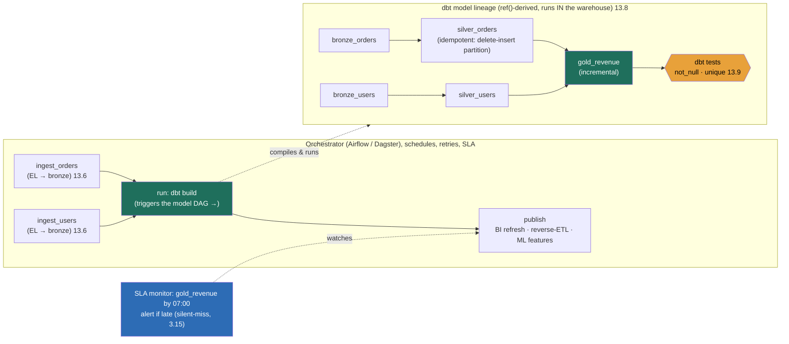

### Learning objectives
- State the thesis: a data platform is **not a pipeline, it's a graph of interdependent jobs**, and the layer that schedules, sequences, retries, backfills, and SLA-monitors that graph (the **orchestrator**) plus the layer that defines the transformations as versioned, tested code (**dbt**) are what make the platform reliable and *rebuildable* (the governing invariant).
- Reason about a pipeline as a **DAG**: tasks, dependency edges, schedules, retries with backoff, and SLAs/alerting, reusing the scheduler/executor machinery of 3.15 and 5.14 rather than re-deriving it, and knowing where the data-platform orchestrator adds *data-aware* concerns the generic scheduler does not.
- Internalize the property that makes everything survivable: **idempotent, partition-scoped tasks** so any date can be re-run deterministically, which is what makes **backfill** a bounded, costable operation (`N partitions × per-partition cost`) instead of an outage, the same instinct as the idempotent reprocessing.
- Choose between **task-centric orchestration** (Airflow: mature, imperative, ubiquitous) and **data/asset-aware orchestration** (Dagster/Prefect: lineage- and freshness-native, better local dev, smaller ecosystem), naming the rejected alternative's cost.
- Place **dbt** correctly: SQL models compiled to and run *in* the warehouse, a `ref()`-built DAG with lineage, built-in tests and docs, incremental models, the "analytics engineering" discipline, and know exactly **where orchestration ends and transformation begins**.

### Intuition first
Think of a data platform as a **commercial kitchen during dinner service.** The raw deliveries (ingested data) arrive at the back door, and a finished plate (a `gold` table a dashboard reads) is the result of a *chain* of prep steps: wash and chop, make the stock, build the sauce, plate. Two completely different people run this kitchen, and conflating them is the classic mistake.

The **expediter** stands at the pass and calls the order: *"sauce can't start until the stock is done; the stock can't start until the bones are roasted; everything for table 9 must be out by 8:00."* The expediter doesn't cook a single thing. He owns **sequence, timing, dependencies, and the promise to the table**, start each station when its inputs are ready, re-fire a station that flubbed a step, and raise hell if table 9 is going to be late. That's the **orchestrator** (Airflow/Dagster/Prefect): it knows *when* each job is due and *what must finish first*, and it owns the SLA.

The **line cook** at a station actually transforms ingredients into food: applies the recipe, turns stock and roux into sauce. The recipe is **written down, versioned, and tested**, not improvised from memory, so any cook can reproduce the same sauce tomorrow, and a new cook can read the recipe and see exactly which ingredients it depends on. That's **dbt**: the transformation logic as readable, version-controlled, tested SQL, with the dependency between recipes (this sauce *refs* that stock) declared so the lineage is explicit.

Hold that split, **expediter calls the order, line cook follows the recipe.** And the property that saves the kitchen on a bad night: every recipe is reproducible from the raw deliveries, so if you discover the stock was wrong all week, you don't panic, you **re-roast the bones and re-fire just the affected stations for just the affected days.** That deterministic re-cook is **idempotent partition-scoped backfill**, and it's the whole reason the platform is trustworthy.

### Deep explanation

**A data platform is a DAG of jobs, and that single fact creates the need for orchestration.** A real platform has hundreds of tables, each derived from others: ingestion lands `bronze`, a cleaning job builds `silver`, a rollup builds `gold`, a feature job reads three `gold` tables to build an ML feature set. These have **dependency edges** ("build `silver_orders` only after `bronze_orders` *and* `bronze_users` land") and **schedules** ("the daily marts run after the 02:00 ingestion completes"). Modeled as a **directed acyclic graph**, nodes are tasks, edges are "must finish before", this is the shape a generic cron cannot manage: cron fires job B at a guessed time and *prays* job A finished, which couples correctness to a timing guess. The orchestrator instead fires B **when A's success is recorded**, and that dependency-driven firing is the reason the discipline exists. At a mid-size company a single platform commonly runs **hundreds to low-thousands of DAGs** with **tens of thousands of task instances per day**; the orchestrator is the control plane that keeps that graph correct, retried, on time, and observable.

**What the orchestrator owns (and what it reuses).** The orchestrator is a specialized scheduler, and 3.15 / the job-scheduler problem already taught the hard mechanics, a durable job store as source of truth, leader election fenced against zombie double-fires, the scheduler/executor split through a queue, at-least-once execution made safe by idempotency. **Do not re-derive that here; reuse it.** Airflow's scheduler → executor → worker topology *is* the split. What the *data-platform* orchestrator adds on top of a generic task scheduler is four data-aware concerns:

- **Dependency-driven firing.** A task runs when its upstream tasks *succeed*, not at a wall-clock guess. The edge is the unit, not the time.
- **Retries with backoff, per task.** A flaky source API or a transient warehouse error gets `retries=3, retry_delay=exponential+jitter` (the policy) so one blip doesn't fail a 200-task DAG; the task that genuinely can't recover surfaces, the rest don't.
- **SLAs and alerting on lateness.** "The `dau_by_region` mart must land by 07:00." A *missed* run is silent (the silent-miss problem) unless the orchestrator alarms on `expected_completion vs actual`. This is the freshness contract of 13.1 made operational.
- **Backfill as a first-class operation.** "Re-run every day from 2026-01-01 to today." The orchestrator parameterizes each run by its **partition** (usually a date) and can launch one run per partition deterministically, *if the tasks are idempotent*, which is the next point.

**The load-bearing property: idempotent, partition-scoped tasks.** This is the single most important design rule in the lesson, and it ties straight back to the *rebuildable* invariant and the idempotent reprocessing. Each task run is **scoped to one partition** (e.g. `WHERE event_date = '2026-06-22'`) and is **idempotent**, re-running it for that date *replaces* that date's output rather than appending to it. The standard implementation is **delete-insert (or `INSERT OVERWRITE`) on the partition**: the task deletes the target partition and rewrites it from the retained raw input, so running it once or five times yields the identical result. Contrast the **rejected alternative, a non-idempotent append** (`INSERT INTO target SELECT … FROM source`): on any retry, a failover, or a backfill, the rows are added *again*, and you **double-count**. A retry of a flaky task silently inflates revenue 2×; nobody sees it until finance disputes the number. The Director-altitude statement: *I make every task idempotent and partition-scoped, delete-insert the partition, never blind-append, so a retry, a backfill, or a replay is deterministic and safe; that property is what makes the platform rebuildable rather than fragile.*

**Backfill, quantified, the payoff of idempotency.** Because tasks are idempotent and partition-scoped, **backfill is a bounded, costable operation**, not an emergency. You found a bug in the `silver_orders` logic that's been wrong for 90 days; the fix is "re-run `silver_orders` and everything downstream of it for those 90 partitions." The cost is **`N partitions × per-partition cost`**, if each daily run scans 200 GB at \$5/TB, that's **90 × 200 GB × \$5/TB ≈ \$90**, and at, say, 20 parallel runs it finishes in **90 ÷ 20 ≈ 5 waves**, well under an hour. You can *quote that number before you run it*. Without idempotency the same fix is an outage: you'd have to manually figure out what to delete, risk double-counting, and probably take the table offline. The discipline of 13.1, rebuildable from retained raw via idempotent recomputation, is exactly what turns a logic bug from an incident into a parameterized re-run.

**Task-centric (Airflow) vs data/asset-aware (Dagster, Prefect).** The major orchestration decision. **Airflow** is task-centric and imperative: you write a DAG of *operators* ("run this Python", "run this SQL", "wait for this file"), and the unit Airflow reasons about is *the task and whether it ran*. It is the **mature, ubiquitous default**, vast ecosystem, every cloud has a managed version (MWAA, Cloud Composer), every data engineer knows it. Its cost: it is **task-aware, not data-aware**, Airflow knows task X ran, but not *what data asset* X produced, so lineage, freshness, and "which downstream assets are now stale" are bolted on, not native; local development and testing are historically awkward. **Dagster** (and to a lighter degree **Prefect**) is **asset-aware**: you declare the *data assets* (tables) and their dependencies, and the framework derives the DAG, tracks **asset lineage and freshness natively**, and offers far better local dev, typing, and testability. Its cost: a **smaller ecosystem and community**, fewer pre-built integrations, and a newer operational track record. The Director move: *reject Dagster's asset model for Airflow when the team already runs Airflow at scale and the ecosystem/hiring-pool advantage outweighs lineage ergonomics; reject Airflow for Dagster on a greenfield platform where asset lineage, freshness SLAs, and local testability are first-order and the smaller ecosystem is acceptable.* Tie the bake-off to a stated prior and delegate it.

**Transformation: dbt, and the analytics-engineering discipline.** Once data is ingested as raw `bronze` (the **EL** of ELT), the **T**, turning raw into clean, conformed, business-ready tables, is where dbt lives. dbt's model: you write each transformation as a **`SELECT` statement in a `.sql` file**; dbt **compiles it and runs `CREATE TABLE/VIEW AS` inside the warehouse** (Snowflake/BigQuery/Databricks), so the heavy compute happens where the data already is, no separate processing cluster moving terabytes out and back. The defining mechanic is **`ref()`**: a model says `FROM {{ ref('silver_orders') }}` instead of hardcoding a table name, and from those `ref()` calls dbt **infers the dependency DAG and the full lineage graph automatically**, it knows `gold_revenue` depends on `silver_orders` depends on `bronze_orders`, builds them in the right order, and renders the lineage. On top of that dbt gives you four things hand-rolled SQL doesn't: **version control** (models are code in git, reviewed and rollback-able), **built-in tests** (`not_null`, `unique`, `accepted_values`, relationship tests, feeding 13.9), **auto-generated docs and lineage**, and **incremental models** (process only new/changed partitions instead of rebuilding the whole table, the same partition-scoped idea as above, so an incremental `silver` over 2 TB of history processes only today's few GB).

**dbt vs the rejected alternatives, why "analytics engineering" beats scripts.** Before dbt, the T was a pile of **hand-rolled SQL scripts** run by a cron, or **stored procedures** living in the database. Both are **untested, unversioned, and opaque**: there's no dependency graph (you maintain run-order by hand and it rots), no tests (a column silently goes null and the metric is wrong, the silent-wrong-number failure), no lineage (when finance asks "where does this number come from?" you read 4,000 lines of SQL to find out), and stored procs are invisible to git and code review. **Reject hand-rolled scripts / stored procs for dbt** because dbt turns transformation into *software*: versioned, tested, documented, with an automatically-derived and rebuildable DAG. That is the whole "analytics engineering" discipline, applying software-engineering rigor (review, tests, CI, modularity) to the SQL transformation layer. The trade-off to name honestly: dbt adds a **build-and-deploy toolchain and a learning curve**, and it's SQL-centric (Python transforms need dbt's Python models or a separate processing step); for a three-table throwaway pipeline that overhead may not pay for itself, but at any real platform scale it does.

**Where orchestration ends and transformation begins, separation of concerns.** This boundary is a design decision interviewers probe. The clean answer: **the orchestrator schedules and sequences; dbt transforms.** dbt has its *own* internal DAG (the `ref()` graph of models), but dbt does **not** schedule itself, retry across infrastructure failures, or wait on external dependencies, that's the orchestrator's job. The standard, correct pattern is **orchestrate-the-transform**: the orchestrator runs ingestion, then triggers `dbt build` (often as a single task, or sharded into per-model tasks for granular retries), then triggers downstream consumers (BI refresh, reverse-ETL, ML feature jobs), and owns the SLA and alerting over the whole chain. The **rejected alternative, transform-inside-ingestion** (do the cleaning and conforming *during* the EL step, e.g. transform-on-the-fly in the ingestion job), couples two concerns that fail and evolve independently: you can't re-run a transform without re-ingesting, you can't test the transform in isolation, and a transform-logic change forces an ingestion redeploy. Keeping EL and T separate (ELT, not ETL) is what lets you re-run the T over already-landed raw, which is, once more, the rebuildable invariant of 13.1.

Go deeper, Airflow task semantics: execution_date, idempotency, and SKIP LOCKED (IC depth, optional)

- **`execution_date` / `logical_date` is the partition key.** Airflow passes each DAG run the *logical* date it represents (not wall-clock now), and idempotent tasks template their SQL on it: `WHERE event_date = '{{ ds }}'` with a delete-insert. This is what makes `airflow dags backfill --start-date … --end-date …` deterministic, each run rewrites exactly its own partition.
- **Catchup and backfill.** Airflow's `catchup=True` will, on first deploy or after a pause, schedule a run for *every* missed interval, the 3.15 catch-up-firing behavior. Teams usually set `catchup=False` and backfill explicitly to avoid an accidental thundering herd of historical runs (the herd, applied to DAGs).
- **HA scheduling reuses SKIP LOCKED.** Airflow 2.x runs multiple active schedulers against one metadata DB using `SELECT … FOR UPDATE SKIP LOCKED` (the exact pattern) so two schedulers never claim the same task instance, the decentralized-contention topology, not a single leader.
- **dbt incremental internals.** An incremental model wraps its `SELECT` in a merge/insert against only rows newer than the current max (` WHERE updated_at > (SELECT max(updated_at) FROM {{ this }}) `), and a `--full-refresh` rebuilds from scratch, the manual escape hatch when the incremental logic itself changed.

### Diagram: an orchestration DAG triggering a dbt medallion lineage

The orchestrator owns the outer DAG (sequence, retries, the 07:00 SLA); dbt owns the inner `ref()`-derived model DAG and runs it inside the warehouse. The boundary between them is the `run: dbt build` task, that's where orchestration ends and transformation begins.

### Worked example: nightly marts for a marketplace, with a 90-day backfill
A marketplace runs nightly analytics: orders and users are ingested to `bronze`, transformed through `silver` to a `gold_revenue_by_seller` mart that feeds finance and a seller dashboard, with a contract that the mart **lands by 07:00**.

- **The DAG.** One Airflow DAG, scheduled daily. Tasks: `ingest_orders` and `ingest_users` (EL) run in parallel; both must succeed before `dbt_build`, which compiles and runs the dbt models (`bronze → silver → gold`) inside BigQuery; then `refresh_bi` and `sync_to_finance` (reverse-ETL) run. ~40 task instances/night across this DAG; the platform has ~300 such DAGs.
- **Idempotency and partitioning.** Every dbt model is partition-scoped on `event_date` with delete-insert semantics, and `gold_revenue_by_seller` is **incremental** (only today's partition is recomputed, ~8 GB, not the 2 TB of history). **Rejected alternative:** a blind `INSERT INTO gold_revenue SELECT …`, a single retried task would double-count a day's revenue and silently overstate seller payouts. The delete-insert is the safety property.
- **Retries and SLA.** Each task has `retries=3` with exponential backoff + jitter so a transient BigQuery or source-API error self-heals. The orchestrator alarms if `gold_revenue_by_seller` hasn't landed by **07:00**, the freshness contract made operational; without that alarm a missed run is silent and finance discovers it, not on-call.
- **The 90-day backfill, quantified.** A bug is found: `silver_orders` mishandled refunds for the last 90 days. The fix is a one-line dbt change, then `dbt build --select silver_orders+ ` (the `+` selects everything downstream) backfilled across **90 partitions**. Cost ≈ **90 × 8 GB × \$5/TB ≈ \$3.60** of scan; at 15 parallel runs it drains in **90 ÷ 15 = 6 waves**, ~30 minutes. We **quote that before running it**. Because the models are idempotent and partition-scoped, the backfill *replaces* each day's `silver`/`gold` deterministically, no double-count, no downtime. **Rejected alternative** (non-idempotent appends): a manual, error-prone delete-then-reload with the table offline, an incident, not a re-run. This is the rebuildable invariant and the idempotent reprocessing paying off directly.
- **Trust and lineage.** dbt tests (`not_null` on `seller_id`, `unique` on the grain, a relationship test to `silver_users`) run as the final models build; dbt's `ref()`-derived lineage answers finance's "where does this number come from?" by tracing `gold_revenue_by_seller ← silver_orders ← bronze_orders ← the orders ingestion` automatically (the modeling of *what* those tables are is 13.8).

The number a Director carries out: *"day-fresh by 07:00 with an SLA alarm, every model idempotent so a logic bug is a ~\$4, 30-minute parameterized backfill instead of an outage, and lineage that traces every figure to source."*

### Trade-offs table: orchestration and transformation choices
| Decision | Option A | Option B | Rejected-alternative cost | Use when… |
|---|---|---|---|---|
| **Orchestrator model** | **Airflow**, task-centric, imperative, mature, huge ecosystem, managed everywhere | **Dagster / Prefect**, asset-aware, native lineage + freshness, better local dev/testing | A: not data-aware (lineage/freshness bolted on, awkward local dev). B: smaller ecosystem, fewer integrations, newer ops track record | A: team already runs Airflow at scale, ecosystem/hiring wins. B: greenfield where asset lineage + freshness SLAs are first-order |
| **Transform layer** | **dbt**, SQL models in git, `ref()` DAG, tests, docs, incremental | **Hand-rolled SQL scripts / stored procs** | B: untested, unversioned, opaque, no lineage, run-order maintained by hand and rots (silent-wrong-number risk) | A: any real platform, versioned, tested, rebuildable T. B: ~never at scale; only a throwaway 2–3 table job |
| **Task semantics** | **Idempotent, partition-scoped** (delete-insert / `INSERT OVERWRITE`) | **Non-idempotent append** (`INSERT INTO … SELECT`) | B: retries, failovers, and backfills **double-count**, silent revenue inflation | A: always. There is no good case for B in a platform that retries or backfills |
| **Transform placement** | **Orchestrate-the-transform** (EL, then trigger dbt, then publish) | **Transform-inside-ingestion** (clean/conform during EL) | B: can't re-run T without re-ingesting; can't test T in isolation; transform change forces ingestion redeploy | A: ELT, almost always, keeps T rebuildable over landed raw |

The Director move across all four rows: match the choice to **rebuildability and operational cost**, and never let the transform double-count or couple to ingestion.

### What interviewers probe here
- **"How do you handle re-running a pipeline after you fix a bug, say the logic was wrong for the last three months?"**, *Strong signal:* tasks are **idempotent and partition-scoped** (delete-insert per date), so a backfill is `N partitions × per-partition cost`, a bounded operation you can *quote a number for* (e.g. "90 days × 8 GB × \$5/TB ≈ \$4, ~30 min at 15-way parallelism") and run with no downtime and no double-count, the rebuildable invariant. *Red flag:* "I'd write a script to delete and reload" with no idempotency, no partition scoping, and no awareness that a blind append double-counts.
- **"Airflow or Dagster, and why?"**, *Strong:* names the **task-centric vs asset-aware** axis, picks against a stated prior (Airflow for ecosystem/scale-of-team, Dagster for native lineage/freshness on greenfield), and delegates the bake-off. *Red flag:* "Airflow, it's the standard" with no notion of what asset-awareness buys or costs.
- **"Where does dbt fit, and what does it replace?"**, *Strong:* dbt is the **T** of ELT, SQL models compiled and run *in the warehouse*, `ref()`-derived DAG and lineage, built-in tests and docs, incremental models, replacing untested/unversioned scripts or stored procs with versioned, tested, rebuildable transformation (analytics engineering). *Red flag:* thinks dbt ingests data, or that dbt schedules itself.
- **"Where does orchestration end and transformation begin?"**, *Strong:* the orchestrator **schedules, sequences, retries, and owns the SLA**; dbt **transforms** via its own internal model DAG; the seam is the `dbt build` task; keep EL and T separate (orchestrate-the-transform) so the T is re-runnable over landed raw. *Red flag:* transforms inside ingestion, coupling two concerns that fail and evolve independently.
- **"A nightly mart didn't land. How do you even know?"**, *Strong:* an **SLA/freshness alarm** on `expected vs actual completion` (the freshness contract of 13.1, the silent-miss discipline of 3.15), a missed run is silent unless you alarm on the non-event. *Red flag:* "someone would notice the dashboard is stale", i.e. the customer is the alarm.

The through-line at Director altitude: a data platform is a **DAG of idempotent, partition-scoped jobs**; the orchestrator owns scheduling/retries/SLA (reusing the machinery), dbt owns the versioned, tested transform, and idempotency is what makes the whole thing **rebuildable**, a logic bug becomes a costable backfill, not an outage.

### Common mistakes / misconceptions
- **Non-idempotent appends.** `INSERT INTO target SELECT …` double-counts on every retry, failover, or backfill, silent revenue/metric inflation. The fix is delete-insert (or `INSERT OVERWRITE`) on the partition so a re-run is deterministic.
- **Treating the platform as one big pipeline instead of a DAG.** Without dependency-driven firing you schedule job B at a guessed time and pray A finished; the orchestrator fires B on A's *recorded success*, decoupling correctness from a timing guess.
- **Thinking dbt ingests or schedules.** dbt only transforms (the T), runs *in* the warehouse, and has its own model DAG, but the orchestrator schedules it, retries it, and owns the SLA. Confusing the two is the most common altitude miss.
- **Transform-inside-ingestion.** Coupling cleaning/conforming to the EL step means you can't re-run or test the transform independently and a logic change forces an ingestion redeploy; keep EL and T separate (ELT) so the T stays rebuildable over landed raw.
- **No freshness/SLA alarm.** A late or missed run is silent; without an alarm on `expected vs actual completion`, the stakeholder discovers staleness before on-call does.

### Practice questions

**Q1.** A teammate's pipeline appends to a `gold_revenue` table on every run. After a transient error, Airflow retried one task and finance now sees revenue 2× too high for a day. What happened, and how do you fix it permanently?
> *Model:* The task is **non-idempotent**, it `INSERT INTO`s the day's rows, so the retry added them a *second* time and double-counted. The permanent fix is **idempotent, partition-scoped** semantics: scope each run to its date (`event_date = '{{ ds }}'`) and **delete-insert** (or `INSERT OVERWRITE`) that partition so a re-run *replaces* the day rather than appending. Now a retry, a failover, or a backfill is deterministic, run it once or five times, same result. This is the rebuildable invariant and the idempotent reprocessing; it's also what makes the bad day fixable with a single re-run of that partition rather than a manual surgery.

**Q2.** You discover a transformation bug that's been wrong for 60 days. Walk through the backfill and estimate its cost and time.
> *Model:* Because models are idempotent and partition-scoped, backfill is "re-run the affected model **and everything downstream** for those 60 partitions": fix the dbt model, then `dbt build --select the_model+` backfilled `--start-date` 60 days back. Cost = **`N partitions × per-partition scan × $/TB`**, if each daily run scans ~150 GB at \$5/TB, that's **60 × 150 GB × \$5/TB ≈ \$45**; at 20 parallel runs it drains in **60 ÷ 20 = 3 waves**, well under an hour. I'd quote that number *before* running. No table goes offline and nothing double-counts because each partition is *replaced* deterministically, the difference between a parameterized re-run and an outage is exactly the idempotency property.

**Q3.** Airflow vs Dagster for a brand-new analytics platform with a small team that cares a lot about data freshness SLAs and being able to test transforms locally. Make the call and name what you give up.
> *Model:* I'd lean **Dagster**: it's **asset-aware**, so lineage and **freshness** are native (you declare freshness policies on assets and it tracks staleness), and local dev/typing/testing are markedly better, both first-order for this team. What I give up: a **smaller ecosystem** (fewer pre-built integrations than Airflow's), a smaller hiring pool, and a newer operational track record, so I'd verify the integrations we need exist. If instead this were an org already running Airflow at scale with deep operational muscle and a big hiring pool, I'd **reject Dagster for Airflow**, the ecosystem and team-familiarity win outweighs asset ergonomics. Either way I'd state the prior and delegate the bake-off on our integration and scale profile.

**Q4.** Explain to a skeptical engineer why dbt is worth the toolchain overhead versus the SQL scripts and stored procedures they run today.
> *Model:* Their scripts are **untested, unversioned, and opaque**: run-order is maintained by hand and rots, there are no tests so a column silently going null produces a confidently wrong metric (the silent-wrong-number), there's no lineage so "where does this number come from?" means reading thousands of lines, and stored procs are invisible to git and code review. dbt turns the **T** into software: models in git (reviewed, rollback-able), a **`ref()`-derived DAG and lineage** built automatically, **built-in tests** (`not_null`/`unique`/relationships, feeding 13.9), auto docs, and **incremental models** that process only new partitions. The cost is honest, a build/deploy toolchain and a learning curve, but at any real platform scale it buys rebuildability, trust, and reviewability that scripts can't. For a literal 2–3 table throwaway, the overhead may not pay; for a platform, it always does.

**Q5.** Where exactly is the boundary between the orchestrator (Airflow/Dagster) and dbt? Give the pattern and the anti-pattern.
> *Model:* The orchestrator **schedules, sequences across systems, retries on infra failure, and owns the SLA**; dbt **transforms**, with its own internal `ref()` model DAG, running *inside* the warehouse. The **pattern (orchestrate-the-transform):** the orchestrator runs ingestion (EL), then triggers `dbt build`, then triggers publish steps (BI refresh, reverse-ETL, ML features), alarming if the whole chain misses its freshness SLA. dbt does *not* schedule itself or wait on external dependencies, that's the orchestrator's job. The **anti-pattern (transform-inside-ingestion):** doing the cleaning/conforming during the EL step couples two concerns that fail and evolve independently, you can't re-run or test the transform without re-ingesting, and a transform change forces an ingestion redeploy. Keeping EL and T separate (ELT) is what keeps the transform rebuildable over already-landed raw.

### Key takeaways
- **A data platform is a DAG of interdependent jobs, not a pipeline.** The **orchestrator** (Airflow/Dagster/Prefect) is the control plane that schedules by dependency (fire B on A's *recorded success*, not a timing guess), retries with backoff, and owns freshness **SLAs/alerting**, reusing the durable-store + leader-election + scheduler/executor machinery of 3.15 / 5.14, adding *data-aware* concerns on top.
- **Idempotent, partition-scoped tasks are the load-bearing property.** Delete-insert (or `INSERT OVERWRITE`) each partition so a re-run *replaces* rather than appends; the **rejected non-idempotent append double-counts** on every retry, failover, or backfill. This is the rebuildable invariant and the idempotent reprocessing.
- **Backfill is therefore bounded and costable:** `N partitions × per-partition cost`, quote the number before you run it (e.g. 90 × 200 GB × \$5/TB ≈ \$90, minutes at parallelism), with no downtime and no double-count. A logic bug becomes a parameterized re-run, not an outage.
- **dbt is the T of ELT:** SQL models compiled and run *in* the warehouse, a **`ref()`-derived DAG and lineage** built automatically, **built-in tests** and docs, and **incremental models**. It **replaces untested, unversioned, opaque scripts/stored procs** with versioned, tested, rebuildable transformation, the analytics-engineering discipline.
- **Know the boundary:** the orchestrator schedules/sequences/retries/SLA-monitors; dbt transforms via its own model DAG; the seam is the `dbt build` task. Keep EL and T separate (orchestrate-the-transform), not coupled inside ingestion, so the T stays re-runnable over landed raw. *What* to model (star/SCD/medallion) is 13.8.

> **Spaced-repetition recap:** A data platform is a **kitchen at dinner service**: the **expediter** (orchestrator, Airflow task-centric vs Dagster/Prefect asset-aware) calls the order, sequence, dependency-driven firing, retries+backoff, the 07:00 **SLA** (reusing 3.15/the scheduler machinery, silent-miss alarmed), and the **line cook** (dbt) follows a **versioned, tested recipe**: SQL models run *in* the warehouse, `ref()`-derived DAG + lineage, tests + incremental models, replacing opaque scripts/stored procs. The property that saves a bad night: every task **idempotent + partition-scoped** (delete-insert, never blind-append → no double-count), so **backfill = N partitions × per-partition cost**, a costable re-run not an outage, the rebuildable invariant, the idempotent reprocessing. Orchestrate-the-transform; don't transform-inside-ingestion. Next: 13.8, the dimensional/medallion modeling those dbt models actually build.

---

*End of Lesson 13.7. The control plane is what turns a heap of jobs into a reliable, rebuildable platform: an orchestrator that schedules a DAG of idempotent, partition-scoped tasks (so backfill is a costable re-run, not an outage), and dbt doing the versioned, tested "T" inside the warehouse. Next: 13.8, dimensional modeling and the medallion architecture (star schemas, SCDs, bronze/silver/gold), the *what* those dbt models build, to this lesson's *how* they run.*
