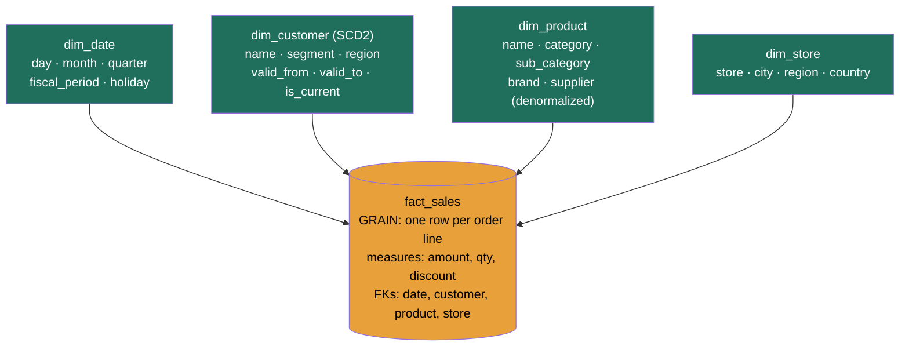

### Learning objectives
- State the **inversion**: OLTP schemas are normalized for *correct, conflict-free writes on one entity*, analytical schemas are **denormalized and modeled for scans and human questions over all entities**, and the same data is laid out the opposite way for the opposite job.
- Run **dimensional modeling** (Kimball) at architecture altitude: separate **facts** (the measurements/events you sum) from **dimensions** (the who/what/when/where you slice and filter by), and **declare the grain first**, one row of the fact means exactly one thing.
- Decide **star vs snowflake** and **SCD type 1 vs type 2** on their actual trade-offs (join count, redundancy, history) and quantify the scan/storage cost each way.
- Place dimensional modeling inside the **medallion architecture** (bronze→silver→gold), gold *is* the dimensional/aggregate layer, and know when the modern **One Big Table** wide-table pattern on columnar storage replaces the star.
- Name the **semantic / metrics layer** as the single governed definition of a business metric, and why two dashboards disagreeing by 3% is a modeling-and-governance failure, not a query bug.

### Intuition first
A normalized OLTP schema is a **filing cabinet built for the clerk who updates it.** Every fact lives in exactly one folder, the customer's address in the `customers` folder, the product's price in the `products` folder, so when an address changes, the clerk edits one card and nothing else can contradict it. That is normalization: store each fact once, so writes are cheap and can never disagree with themselves. It is the right design when a thousand clerks are updating a thousand entities a second, which is the OLTP world.

An analytical table is a **briefing pack built for the executive who reads it.** The executive never updates anything; she asks *"revenue by region by product category by month,"* and she does not want to chase the price out of one folder and the region out of another for every one of fifty million orders, that is fifty million folder-lookups (joins) to answer one question. So you build her a pack where **each line already carries its own context**: the order amount sits on the same row as the region, the category, the date, the customer segment, pre-stitched. She sweeps down the page and sums. The redundancy that would horrify the filing clerk, the same region name copied onto a million rows, is exactly what makes her question fast, and on a columnar store that repeated text compresses almost to nothing.

Two organizing frameworks build that briefing pack, and they are not rivals. **Dimensional modeling** (Kimball) decides the *shape* of the human-facing tables: a central **fact** of measurements surrounded by **dimensions** of context, the star. The **medallion architecture** decides the *refinement path* the data travels to get there: raw **bronze** → cleaned **silver** → business-ready **gold**, and the gold layer is precisely where the dimensional stars and aggregates live. Shape and path. Get both pictures and the rest is detail.

### Deep explanation

**The inversion is the foundational fact, and everything falls out of it.** OLTP normalization (3NF, the Codd rules) minimizes redundancy so that every fact is stored once and updates can't create contradictions, the cost is that reading a complete picture requires re-joining the pieces, which is fine for one entity but ruinous across millions. Analytical modeling makes the opposite bet: **storage is cheap and columnar-compressible, joins across huge row counts are expensive, and the data is write-once-read-many**, so you *denormalize*, duplicate context onto the rows that need it, to turn a many-way join into a single scan. The Director-altitude statement: *you normalize to make writes safe and you denormalize to make reads cheap, and an analytical store is read-cheap by design.* You **reject** the production 3NF schema for analytics because answering "revenue by region by category by month" against it means joining `orders → customers → regions → products → categories` for every row, five joins fanning across fifty million rows, which is slow, expensive, and contends with the OLTP traffic that owns those tables.

**Dimensional modeling splits the world into facts and dimensions.** This is Ralph Kimball's framework and it maps cleanly onto how humans ask analytical questions: *"sum this measurement, sliced by these contexts."*

- A **fact table** holds the **measurements/events**, the numbers you aggregate (order amount, quantity, click, watch-seconds). Facts are tall and thin: billions of rows, mostly numeric measures plus a handful of **foreign keys** pointing at dimensions. The fact is what you `SUM`, `COUNT`, `AVG`.
- A **dimension table** holds the **context**, the *who* (customer), *what* (product), *when* (date), *where* (store/region) you filter and group by. Dimensions are short and wide: thousands to millions of rows, many descriptive text columns. Dimensions are what you put in the `WHERE` and `GROUP BY`.

The question *"revenue by region last quarter"* becomes: scan the `sales` fact, filter the `date` dimension to last quarter, group by the `region` attribute of the `store` dimension, sum the `amount` measure. **The grain comes first.** Before a single column, you declare what **one row of the fact represents**, "one row per order line item," or "one row per ad impression," or "one row per account per day." The grain is the contract: it fixes what you can and can't sum, prevents double-counting, and determines the row count. *Declaring the grain first is the single most important move in dimensional modeling*, and skipping it is the most common cause of silently-wrong numbers (a fact at "order" grain joined to a "line-item" dimension double-counts revenue).

**Star vs snowflake is the first concrete decision.** A **star schema** keeps each dimension **denormalized into one flat table**, `dim_product` carries product name, category, sub-category, brand, supplier all in one row, redundancy and all. A **snowflake schema** **normalizes** the dimensions, `dim_product` points to `dim_category` points to `dim_department`, splitting the hierarchy across linked tables.

- **Star**, the default. A query joins the fact to *one* dimension table per dimension (`fact → dim_product`), so a five-dimension query is five joins, all one hop deep. The cost is redundancy: "Electronics" is repeated on every product row. On a columnar store that repetition compresses to near-nothing (dictionary encoding stores "Electronics" once and a tiny code per row), so the redundancy is nearly free and the join count is minimized.
- **Snowflake**, normalized dimensions. The same query becomes `fact → dim_product → dim_category → dim_department`, three hops deep *per dimension*, so the join count multiplies. You save a little storage (the category name is stored once) and gain referential tidiness, but you pay it back in joins on every read.
- **Director-altitude statement:** *prefer the star; reject the snowflake for analytics because it trades a storage saving you don't need (columnar compression already eliminates it) for join cost you pay on every query.* Snowflake earns its place only for a genuinely huge, frequently-changing dimension where the normalization saves meaningful maintenance, a delegated, table-by-table call, not the default.

**Slowly-changing dimensions (SCDs) decide how you handle history, and this is where analytics diverges hardest from OLTP.** A customer moves from California to Texas. OLTP overwrites the address, it only cares about *now*. Analytics has to choose, because *"sales by state"* for last year must still attribute that customer's old orders to California. The three classic strategies:

- **SCD Type 1, overwrite.** Just update the attribute in place; history is lost. Simple, no row growth. *Use when* the attribute genuinely has no analytical history value (a typo correction, a cosmetic rename). The cost: every historical query silently re-attributes the past to the present, last year's California sales retroactively become Texas sales, and nobody notices.
- **SCD Type 2, new row with validity.** Insert a *new* dimension row for the changed customer with `valid_from` / `valid_to` timestamps (and often an `is_current` flag), keeping the old row intact. The fact rows point at whichever version was current when the event happened, via a **surrogate key**. History is preserved exactly: old orders stay joined to the California version, new orders to the Texas version. This is **the analytics default**, because preserving point-in-time context is the whole reason the warehouse exists. The cost: the dimension grows by one row per change, and transforms must manage the validity windows.
- **SCD Type 3, add a column.** Keep a `previous_state` column alongside `current_state`. Captures exactly *one* prior value, rare, used when you need "current vs the immediately-prior value" and nothing deeper.

**Director-altitude statement:** *default to SCD Type 2 for any dimension whose history matters to a metric; reject Type 1 for those because overwriting silently rewrites the past and corrupts every historical comparison.* The trade, Type 1 is trivially simple but loses history, Type 2 preserves history at the cost of row growth and validity-window logic, is the one interviewers probe, because it reveals whether you understand that *an analytical store's job is to remember what was true at a point in time*, which an OLTP store deliberately doesn't.

**Surrogate keys make Type 2 work.** A dimension uses a **surrogate key**, a meaningless integer the warehouse generates, as its primary key, *not* the source system's natural/business key (the `customer_id`). Why: under SCD Type 2 the same business customer has *multiple* dimension rows (one per version), so the business key is no longer unique; the surrogate key uniquely identifies *a version of a customer*, and the fact points at the exact version. Surrogate keys also insulate the warehouse from source-key changes and let you conform dimensions across systems. *Reject the natural key as the dimension PK* the moment you adopt Type 2, because it can't distinguish versions.

**Conformed dimensions** are the shared `dim_date`, `dim_customer`, `dim_product` used identically across *every* fact (sales, support, web). When "customer" means the same table everywhere, you can compare and join across business processes, "did support tickets correlate with churn?" works because both facts hang off the same `dim_customer`. The alternative, each team building its own slightly-different customer dimension, is how two dashboards end up disagreeing.

**The medallion architecture is the refinement path, and gold is where the dimensional model lives.** The warehouse/lakehouse problem designs this in full; here is the relationship: **bronze** is raw, append-only, retained-as-replay-source; **silver** is cleaned, typed, deduped, conformed base tables; **gold** is the **business-ready layer, and gold is precisely where the dimensional stars, conformed dimensions, SCD-managed history, and pre-aggregates live.** Dimensional modeling answers *what shape the gold tables take*; medallion answers *how raw data is refined into them and why it's rebuildable* (re-run the silver→gold transforms from retained bronze). The two frameworks compose, Kimball for the shape, medallion for the path, and the modern stack builds gold with dbt (the orchestration lesson owns that tool; not repeated here).

**Denormalization for scan, and the modern One Big Table trend.** The star already denormalizes dimensions; the wide-table or **One Big Table (OBT)** pattern goes further and **pre-joins the fact and all its dimensions into a single flat table**, every order row physically carries region, category, customer segment, date attributes, no joins at all. On a **columnar store** this is cheap: the duplicated context columns dictionary-compress to near-nothing, and the query touches only the columns it projects. *The trade:* OBT eliminates joins (fastest possible scan, simplest for BI tools and analysts) at the cost of flexibility, a dimension attribute change must be propagated across every row, the table is rigid, and you lose the clean reusability of conformed dimensions. **Director-altitude statement:** *use the star as the governed default for flexibility and reuse; reject OBT as the universal pattern, but reach for a wide gold table for a specific high-traffic dashboard where the join cost is real and the schema is stable*, it's a per-mart optimization, not a modeling philosophy. Columnar storage is what made OBT viable at all.

**Normalization (Inmon) vs dimensional (Kimball), briefly.** Two historical schools for warehouse design. **Inmon** builds a normalized (3NF) enterprise warehouse first, then spins dimensional *marts* off it, more upfront modeling, strong consistency, slower to deliver. **Kimball** builds dimensional marts directly with conformed dimensions, faster to value, business-friendly, the dominant approach in the cloud era. The modern medallion stack is effectively Kimball-flavored (silver ≈ conformed base, gold ≈ dimensional marts). The distinction is worth naming at altitude, not relitigating.

**The semantic / metrics layer, one governed definition of a metric.** The recurring analytical failure is *"the revenue dashboard and the finance report disagree by 3%"*, two teams encoded "revenue" with slightly different logic (gross vs net, timezone of "day," whether late refunds are subtracted). The fix is a **semantic layer** (a.k.a. metrics layer): a single, governed, code-defined definition of each business metric that every consumer queries through, so "revenue" is computed *one way* in *one place*. It sits above gold and is the modeling-and-governance answer to definitional drift. The Director point: disagreeing dashboards are a **governance and modeling** problem (no single definition), not a query bug, which is why the semantic layer and metric ownership exist.

Go deeper, fact-table types, degenerate dimensions, and the date dimension (IC depth, optional)

- **Fact table types.** *Transaction* facts (one row per event, the default, e.g. one row per sale). *Periodic snapshot* facts (one row per entity per time bucket, e.g. account balance per day, for "state over time" questions). *Accumulating snapshot* facts (one row per process instance, updated as it moves through milestones, e.g. an order's lifecycle with `ordered_at`, `shipped_at`, `delivered_at` columns). The grain differs in each; pick by the question.
- **Additive / semi-additive / non-additive measures.** *Additive* measures sum across all dimensions (revenue). *Semi-additive* sum across some but not time (a bank balance, you don't sum balances across days, you take the end-of-period). *Non-additive* can't be summed at all (ratios, percentages, you must recompute from the additive components). Misclassifying a measure is a silent-wrong-number source.
- **Degenerate dimensions.** A dimension attribute that lives *on the fact* with no separate table, e.g. an `order_number` you filter/group by but that has no other attributes. Storing it inline avoids a pointless one-column dimension.
- **Junk dimensions.** Collapse a handful of low-cardinality flags (is_gift, is_promo, channel) into one small dimension rather than many tiny ones or many fact columns.
- **The date dimension is always explicit.** Never derive date parts in the query; build a `dim_date` with columns for day, week, month, quarter, fiscal period, holiday flag, day-of-week. It's the most-reused conformed dimension and it makes "fiscal Q3" or "business days only" a simple filter rather than per-query date math.
- **SCD Type 2 mechanics.** The transform compares incoming source rows to the current dimension version; on a change it closes the old row (`valid_to = now`, `is_current = false`) and inserts a new row (`valid_from = now`, `is_current = true`, fresh surrogate key). Fact loads look up the surrogate key valid at the event timestamp. Types 4 (history table), 6 (hybrid 1+2+3) exist for special cases.

### Diagram: a star schema (central fact + surrounding dimensions)

The fact sits at the center holding the numbers and the foreign keys; each dimension is one flat hop away (the star). `dim_customer` is SCD Type 2, it carries validity columns so a customer's region change is remembered, not overwritten. A query joins the fact to only the dimensions it slices by, each a single hop. A snowflake would split `dim_product` into `product → category → department`, adding hops; One Big Table would fold every dimension's columns into `fact_sales` itself, removing the joins entirely.

### Worked example: modeling e-commerce sales for the analytics warehouse
A retailer wants a sales analytics layer: revenue and units by region, category, customer segment, and time, with correct historical attribution as customers and product categorizations change.

- **Declare the grain.** *One row per order line item.* This fixes everything: revenue is `SUM(amount)` at this grain (summing at "order" grain would lose per-line detail; a coarser grain couldn't answer "units by product"). Stated first, before any column.
- **Facts.** `fact_sales`, measures `line_amount`, `quantity`, `discount`, `cost`; foreign keys to `dim_date`, `dim_customer`, `dim_product`, `dim_store`. Billions of rows, thin and numeric.
- **Dimensions, star not snowflake.** `dim_product` is *flat*: name, category, sub-category, brand, supplier on one row, *rejected snowflake* (`product→category→department`) because on the columnar store the repeated "Electronics" dictionary-compresses to a byte, so normalizing only buys join cost. `dim_store`, `dim_date` (always explicit, conformed) likewise flat.
- **History, SCD Type 2 on customer and product.** A customer relocating CA→TX gets a **new** `dim_customer` row with `valid_from`/`valid_to`; old orders keep pointing (via surrogate key) at the CA version, so *"2025 revenue by region"* still credits California. *Rejected SCD Type 1* (overwrite) because it would retroactively move last year's CA sales to TX, the silent corruption of every historical comparison. Same for product re-categorization: when a SKU moves from "Phones" to "Smart Devices," Type 2 keeps last quarter's sales under "Phones."
- **Scan cost, quantify the win.** The naive path is the 3NF production schema: `orders → customers → regions → products → categories`, **five joins across ~50M order rows** per query. The dimensional star is at most **four single-hop joins**, and for the top dashboard we build a **gold pre-aggregate**, `agg_sales_by_region_category_day` at the rollup grain, so the dashboard scans **a few thousand pre-summed rows instead of 50M raw lines**, roughly a **10,000× scan reduction** (50M rows → ~5K rows), turning a multi-second multi-dollar scan into a sub-second sub-cent one (the cost model).
- **Governance.** One `dim_customer`, `dim_date`, `dim_product` *conformed* across the sales, returns, and web facts, so cross-process questions join cleanly. "Revenue" gets **one definition in the semantic layer** (net of returns, settled, in store-local day) that BI, finance, and the board deck all read, so they can't disagree by 3%.

The number a Director brings out of this isn't "we built a star schema"; it's *"correct point-in-time history via SCD2, five joins collapsed to a single pre-aggregated scan, one governed definition of revenue, all rebuildable from raw."*

### Trade-offs table: the analytical-modeling decisions
| Decision | Option A | Option B | Option C | Use when… |
|---|---|---|---|---|
| **Dimension shape** | **Star** (denormalized dims, fewer joins, some redundancy) | **Snowflake** (normalized dims, less redundancy, more joins) | **One Big Table** (pre-joined, no joins, rigid) | **A** the default, columnar compression makes redundancy free, minimizes joins. **B** only a huge, churny dimension where normalization saves real maintenance. **C** a high-traffic, stable-schema dashboard where join cost is real. |
| **History (SCD)** | **Type 1** (overwrite, no history) | **Type 2** (new row + validity, full history) | **Type 3** (prior-value column) | **A** only attributes with no analytical history (typo fix). **B** the analytics default, any attribute whose history affects a metric. **C** when you need exactly one prior value. |
| **Schema philosophy** | **Kimball** (dimensional marts, conformed dims) | **Inmon** (3NF enterprise warehouse → marts) |, | **A** the cloud-era default, fast to value, business-friendly, fits medallion gold. **B** heavy-governance enterprises wanting a normalized core first. |
| **Key choice** | **Surrogate key** (warehouse integer) | **Natural/business key** (source id) |, | **A** mandatory once SCD2 is in play, uniquely IDs a *version*. **B** only an append-only fact with no versioned dimensions. |

The Director move is defaulting to **star + SCD2 + surrogate keys + conformed dimensions**, and reaching for snowflake or OBT only as a justified per-table exception.

### What interviewers probe here
- **"Why not just run analytics on the normalized production schema?"**, *Strong signal:* the inversion, 3NF minimizes redundancy for safe writes but forces many-way joins to assemble a picture; analytics is read-cheap-by-design, so you denormalize into a star to collapse joins into scans, and you never contend with OLTP traffic. Quantifies the join reduction. *Red flag:* "add a read replica," which just moves the five-join full scan one box over.
- **"A customer changes region, how does last year's revenue-by-region stay correct?"**, *Strong:* SCD Type 2, new dimension row with validity, old facts point at the old version via surrogate key, so history is preserved; names Type 1's silent corruption as the rejected alternative. *Red flag:* "update the customer's region," not seeing that overwrite retroactively rewrites the past.
- **"Star or snowflake, and why?"**, *Strong:* star by default, fewer joins, and columnar dictionary-compression makes the dimension redundancy nearly free, so snowflake trades a non-existent storage win for real join cost; snowflake only for a specific huge/churny dimension. *Red flag:* "snowflake is more normalized so it's better," importing an OLTP value into an analytical context.
- **"What's the first thing you do when modeling a fact table?"**, *Strong:* declare the **grain**, exactly what one row represents, before any column, because it fixes what you can sum and prevents double-counting. *Red flag:* starts listing columns with no grain, the root cause of silently-wrong aggregates.
- **"Two dashboards report different revenue. What's wrong and how do you prevent it?"**, *Strong:* two ungoverned definitions of the metric; fix with a **semantic/metrics layer**, one definition every consumer reads, and conformed dimensions; it's a governance/modeling problem, not a query bug. *Red flag:* debugs the SQL, missing that the cause is the absence of a single definition.

The through-line at Director altitude: analytical modeling is **denormalize for scans, declare grain first, preserve history with SCD2, govern the metric definition**, and delegate the per-table snowflake/OBT and CoW/MoR tuning with a stated prior ("star + SCD2 as the standard; the platform team picks where a wide table earns its rigidity," 14.1).

### Common mistakes / misconceptions
- **Carrying OLTP normalization into the warehouse.** 3NF is correct for writes and wrong for analytical reads; it forces many-way joins across huge row counts. Denormalize into a star, the redundancy is free on columnar storage and the join collapse is the whole point.
- **Not declaring the grain first.** Building a fact without fixing what one row means is the root cause of double-counted, silently-wrong metrics (a fact at the wrong grain joined to a dimension fans out).
- **SCD Type 1 by default.** Overwriting a dimension loses history and retroactively rewrites every historical comparison; Type 2 (new row + validity) is the analytics default for any history-bearing attribute.
- **Using the natural/business key as the dimension primary key.** Once SCD2 is in play the business key isn't unique (multiple versions per entity); you need a surrogate key to identify *a version*.
- **No single metric definition.** Letting each team encode "revenue" their own way guarantees disagreeing dashboards; one governed definition in a semantic layer, queried by all, is the fix.

### Practice questions

**Q1.** An interviewer says "just point the BI tool at our production Postgres, it's already got all the data." Walk through your response.
> *Model:* I'd reject querying production directly on two grounds. First, the **layout**: a normalized 3NF schema stores each fact once, so "revenue by region by category by month" means joining `orders → customers → regions → products → categories` across tens of millions of rows for every refresh, slow and expensive, and on a row store it reads every column to touch a few. Second, **contention**: those unselective aggregate scans starve the point-lookup traffic that serves customers. Instead I'd land the data in the warehouse (CDC into bronze) and model a **dimensional star** in gold: a `fact_sales` at declared line-item grain surrounded by flat `dim_customer`/`dim_product`/`dim_date`/`dim_store`. The five-join scan becomes at most four single-hop joins, and the dashboard reads a pre-aggregate of a few thousand rows instead of 50M. Net: correct, fast, cheap, and production is untouched.

**Q2.** A customer moves from California to Texas. Show how SCD Type 1 vs Type 2 changes the answer to "2025 revenue by state," and which you'd choose.
> *Model:* Under **Type 1** you overwrite `dim_customer.state` to Texas. Now *every* historical query joins that customer's 2025 orders to "Texas," so last year's California revenue silently migrates to Texas, the report is precise and wrong, and nobody notices. Under **Type 2** you insert a *new* `dim_customer` row (new surrogate key, `valid_from = move date`, the old row closed with `valid_to`); the 2025 fact rows still point at the *California* version via their surrogate key, so "2025 revenue by state" correctly credits California and 2026 credits Texas. I'd choose **Type 2**, preserving point-in-time attribution is exactly why the warehouse exists; Type 1 is only acceptable for attributes with no historical meaning (a misspelled name). The cost of Type 2 is one extra dimension row per change plus validity-window logic in the transform, cheap for correct history.

**Q3.** Estimate the scan reduction from adding a gold pre-aggregate for a dashboard that currently scans a 50M-row `fact_sales` table to show revenue by region by day.
> *Model:* The raw query scans all **50M line-item rows** every refresh, summing on the fly. A pre-aggregate `agg_revenue_by_region_day` at the (region × day) grain has, say, 50 regions × 365 days ≈ **~18K rows per year**, holding pre-summed revenue. The dashboard reads ~18K rows instead of 50M, roughly a **2,700× row reduction**, and since it's columnar and the dashboard projects ~3 columns, the bytes scanned drop further. A multi-second, multi-cent scan becomes sub-second and effectively free (the cost model). The trade: the aggregate must be refreshed by the transform and only answers questions at its grain, ad-hoc drill-downs below (region × day) still hit the fact. So I pre-aggregate the *known high-traffic* rollups and keep the detailed star for exploration. Layout and pre-aggregation are the lever, not a bigger cluster.

**Q4.** When would you deliberately choose a wide One Big Table over a star, and what do you give up?
> *Model:* I'd reach for OBT for a **specific, high-traffic, stable-schema dashboard** where the join cost is measurable and the analysts/BI tool benefit from zero joins, every row already carries region, category, segment, date attributes, so the query is a pure columnar scan with no joins at all, the fastest possible. It's viable *because* columnar storage dictionary-compresses the duplicated context to near-nothing. What I give up is **flexibility and reuse**: a dimension attribute change must be propagated across every row of the wide table, I lose conformed dimensions shared across facts, and the table is rigid to schema change. So OBT is a **per-mart optimization**, not a modeling philosophy, I keep the governed star as the default for flexibility and reuse, and materialize a wide table only where a hot dashboard justifies the rigidity. *Rejected:* making OBT the universal pattern, which sacrifices the warehouse's reusability for a speed win most queries don't need.

**Q5.** Your finance report and your product dashboard both show "revenue" and disagree by 3%. What's the cause and the fix?
> *Model:* Almost certainly **two different definitions** of revenue encoded in two places, gross vs net of returns, the timezone of "day," whether late-arriving refunds are subtracted, or one reads a fast approximate path and the other the settled batch (the speed-vs-truth split of 9.7). Neither is "wrong"; they answer subtly different questions. The fix is **not** to debug one query, it's a **semantic/metrics layer**: one governed, code-defined definition of "revenue" (net, settled, store-local day) that finance, product, and the board deck all query through, plus **conformed dimensions** so "customer"/"date" mean the same thing everywhere, and **lineage** so each number's source and logic are inspectable. The Director point: disagreeing dashboards are a **modeling and governance** failure (no single definition), not a SQL bug, which is precisely why semantic layers and metric ownership exist.

### Key takeaways
- **Analytical modeling inverts OLTP:** you normalize (3NF) to make writes safe and conflict-free on one entity; you **denormalize** to make scans cheap across all entities. The redundancy that horrifies an OLTP designer is free on columnar storage (dictionary compression) and collapses many-way joins into single scans.
- **Dimensional modeling = facts + dimensions, grain first.** Facts hold the measurements you `SUM` (tall, thin, FK-heavy); dimensions hold the who/what/when/where you slice by (short, wide, descriptive). **Declare the grain, what one fact row means, before any column**, or you get silently-wrong, double-counted metrics.
- **Star over snowflake; SCD Type 2 over Type 1.** Star minimizes joins and columnar-compresses the redundancy away, reject snowflake (more joins for a storage win you don't need). SCD Type 2 (new row + validity + surrogate key) preserves point-in-time history, reject Type 1 (overwrite) for any history-bearing attribute, because it silently rewrites the past.
- **Gold in the medallion model is the dimensional layer.** Kimball gives the *shape* (stars, conformed dimensions, aggregates); medallion gives the *path* (bronze→silver→gold, rebuildable from retained raw). One Big Table is a per-mart, columnar-enabled optimization that trades flexibility for zero joins, not the default.
- **One governed metric definition.** Disagreeing dashboards are a governance/modeling failure, not a query bug; a **semantic/metrics layer** plus conformed dimensions gives every consumer one definition of "revenue," computed one way in one place.

> **Spaced-repetition recap:** Analytical modeling is the **briefing pack, not the filing cabinet**, denormalize for scans because storage is cheap and columnar-compressible while many-way joins across millions of rows are not (the inversion of OLTP 3NF). **Dimensional modeling (Kimball):** central **fact** (measurements you SUM, FK-heavy) + surrounding **dimensions** (who/what/when/where you slice by) = the **star**; **declare the grain first** (what one fact row means). **Star vs snowflake:** star wins, fewer joins, redundancy is free on columnar (dictionary encoding), snowflake only for a huge churny dimension. **SCD:** Type 1 overwrites (loses history, silently rewrites the past), **Type 2** = new row + valid_from/valid_to + **surrogate key** = the analytics default (preserves point-in-time attribution); Type 3 = one prior column. **Conformed dimensions** shared across facts enable cross-process joins. **Gold in the medallion model is where the dimensional stars/aggregates live**, Kimball is the shape, medallion the path, both rebuildable from raw. **One Big Table** pre-joins everything (no joins, rigid), a per-mart columnar optimization, not the default. A **gold pre-aggregate** turns a 50M-row scan into a few-thousand-row read (~thousands× reduction). **Semantic/metrics layer** = one governed definition of a metric, the fix for disagreeing dashboards. Next: 13.9, data quality and testing, engineering the *trust* that this modeled data is actually right.

---

*End of Lesson 13.8. Analytical tables are modeled for scans and human questions, denormalized into dimensional stars (facts + dimensions, grain declared first), with SCD Type 2 preserving point-in-time history, conformed dimensions enabling cross-process analysis, and the medallion gold layer as their home. Next: 13.9, data quality, testing, and contracts, how you engineer the trust that the numbers this model produces are actually right.*
