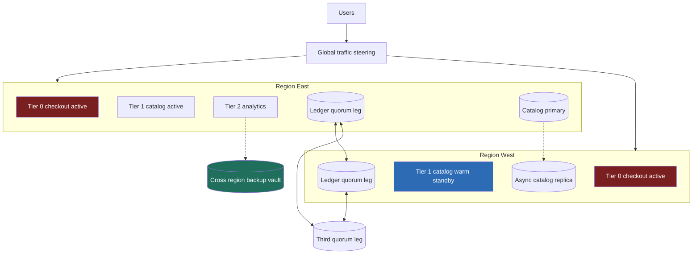

> **This question has a dedicated section in every 2026 senior question bank, and L6+ candidates are expected to raise multi-region failure modes unprompted.** The standard EM form is concrete: *"A region just died during peak. Walk me through it."* The junior answer draws two identical regions and says "active-active." The Director answer knows **RPO≈0 active-active roughly doubles infra cost *and* imports a write-conflict problem you didn't have yesterday**, so it tiers services by criticality, pays the 2× only for checkout, lets analytics ride on backups, states the spend delta, and treats an untested DR plan as fiction. "Everything active-active" is not the strong answer. It is the failure mode.

### Learning objectives
- Run an **adapted RESHADED** spine on a resilience strategy: R becomes **RTO/RPO pinned per service tier** (a business sign-off, not an engineering preference), E becomes **cost-delta math**, 2× infra vs revenue-at-risk per hour.
- Argue the load-bearing tension: **blanket active-active** (~2× spend, conflicts everywhere) vs **tiered DR**, checkout active-active, catalog warm-standby, analytics backup-restore, with the dollar delta stated.
- Pick a per-tier data strategy with CAP and quorum reasoning: where to pay cross-region write latency for RPO 0, where to accept seconds of RPO, where conflicts are *avoided* rather than resolved.
- Deliver the **"region just died at peak" walkthrough** as a rehearsed script whose only live decision is *declare*.
- Run the program like a Director: game-day cadence, survivor-region capacity as a budget line, restore-tested backups, delegated depth with priors.

### Intuition first
Think of how a city protects its buildings against fire. The hospital has a second fully-staffed operating theater across town, running 24/7, ambulances pre-routed, because an hour of "the hospital is down" kills people. The library has smoke detectors, insurance, and an off-site archive of its catalog, if it burns, you rebuild over months, and that's *fine*. Nobody runs a duplicate, fully-staffed library "just in case"; the cost is absurd relative to what's at risk. **Disaster recovery is the same allocation problem: protection priced to what each thing is worth, not one gold-plated standard for everything.**

Two definitions carry the topic. **RTO** (recovery time objective): how long until service is back, the *outage clock*. **RPO** (recovery point objective): how much recently-written data you may lose, the *amnesia window*. Every DR architecture is a price point on these two dials, and the pricing is brutally non-linear: RTO of a day costs almost nothing (restore from backup); RTO of minutes with RPO of zero means a second region running hot, roughly **double the bill**, plus a problem money can't dissolve: if both regions accept writes, the same cart can be written in two places at once, and *someone* must decide who wins. That's the CAP trade with a 70 ms ocean in the middle.

So the Director's move is never "pick active-active or active-passive." It's: **which services are the hospital, and which are the library?**

---

## R: Requirements

> **Adaptation, said out loud:** in a product design, R scopes features. Here R produces the **tier catalog with RTO/RPO pinned per tier**, and those numbers are *business sign-offs with a price tag*, not engineering aesthetics. Finance and product own "how much is an hour of checkout worth"; engineering owns "here is what each answer costs."

**Anchor scenario:** an e-commerce platform, **$1B/yr revenue**, single-region today in us-east, **$40M/yr infra spend**, ~80 services. Peak weeks (Black Friday) run ~8× average traffic and a disproportionate share of annual revenue.

**Clarifying questions I'd ask (with assumed answers):**
- *What does an hour of full outage cost?* → Average ≈ **$115K/hr** ($1B ÷ 8,760). At peak, ~**$1M/hr** plus trust damage and press. Revenue-at-risk is *spiky*.
- *Is revenue uniform across services?* → No, the whole game. **~90% of revenue-at-risk flows through ~15% of services**: checkout, payments, cart, auth, orders.
- *Threat model?* → Full regional failure, historically **about once every 1-2 years, lasting 2-6 hours**, in every major cloud. Also bad deploys and data corruption, which replication *propagates* rather than protects against, backups stay mandatory even with active-active.
- *Compliance floor?* → Payment and order data must survive regional loss regardless of cost, a constraint, not a choice.

**The deliverable of this step, the tier catalog:**

| Tier | Services | RTO | RPO | Signed off by |
|---|---|---|---|---|
| **0, revenue path** | checkout, payments, cart, auth, orders | **< 5 min** | **≈ 0** (ledger), seconds (cart) | CFO + CPO |
| **1, customer experience** | catalog, search, recommendations, profile | **< 30 min** | **< 5 min** | CPO |
| **2, internal / batch** | analytics, ML training, BI, internal tools | **< 24 h** | **< 24 h** | Eng + data lead |

**Explicitly NOT requirements:** "five nines for everything," multi-*cloud* (a different, far more expensive problem, defer unless a regulator forces it), active-active for Tier 2 "for consistency." Uniformity is not a requirement; it's a failure to prioritize.

**Non-functional constraints:** failover executable by the on-call without heroics (runbook-as-code); the surviving region absorbs **100% of peak**; the plan is **rehearsed**, an RTO never measured in a game day is a guess.

---

## E: Estimation

> **Adaptation, said out loud:** no QPS sizing here. Estimation becomes **cost-delta math**, each DR posture's annual cost versus the expected revenue-at-risk it removes. Same estimation discipline: round aggressively, state assumptions, let the numbers decide.

**Option math, on the $40M base.** A region that must survive alone must carry **100% of peak by itself**, so blanket active-active isn't "2 × 50%," it's close to 2 × 100%-capable:

- **Blanket active-active (everything, RPO≈0):** ≈ **+$30M/yr** (~1.75× total), duplicate stateful fleets, cross-region replication egress (real money at PB scale), and the engineering tax of making 80 services conflict-safe.
- **Blanket active-passive (warm standby for everything):** ≈ **+$13M/yr** at ~30% standby capacity, but RTO is now 30-60 min *for checkout too*, and a warm fleet that never takes traffic is the classic failover that fails.
- **Tiered (the proposal):** Tier 0 ≈ 15% of spend, fully duplicated → **+$6M**; Tier 1 warm standby at ~30% capacity on ~50% of spend → **+$6M**; Tier 2 backups + vault → **+$0.5M**. Total ≈ **+$12.5M/yr, ~$18M/yr less than blanket active-active**, with a *better* RTO on the revenue path than blanket-passive.

**What the spend buys.** Expected event: one regional outage per ~2 years, ~4 hours. At peak: 4 × $1M ≈ **$4M** plus trust damage, call expected loss **~$20M/decade, almost all of it in Tier 0**. Blanket active-active spends **$300M/decade** against that, mostly protecting analytics pipelines nobody would miss for a day. Tiered spends **$125M/decade**, concentrated where the loss concentrates. **Saying the ~$18M/yr delta out loud is the Director signal.**

**The number people forget:** survivor-region **capacity headroom**. Tier 0 in each region must be provisioned, or pre-warmed with reserved quota, for 100% of peak Tier-0 traffic. Cloud quota limits are the silent DR killer. That headroom is *in* the +$6M; omit it and your RTO is fiction.

**What estimation decided:** tiering is the only posture the math supports. RPO≈0 is bought only for the order/payment ledger; everything else trades amnesia-window for dollars at a stated exchange rate.

---

## S: Storage

> **Adaptation, said out loud:** S here is the **per-tier replication strategy**, and the *write-conflict problem is created or avoided in this step*. Replication mechanics and why cross-region agreement costs an RTT are covered elsewhere; here we only place those tools.

**Tier 0, two sub-decisions, because "checkout" is not one data shape:**

- **Order/payment ledger, cross-region quorum, RPO 0.** Writes commit to a majority of replicas spanning 3 regions (N=3, W=2), Spanner-style. *Cost:* every ledger write pays ~30-70 ms of cross-region RTT, acceptable, because order placement is once-per-checkout, and compliance demands RPO≈0 anyway. *Rejected, multi-master with LWW/CRDT merge for money:* last-write-wins on a ledger double-charges or loses orders. **For money, avoid conflicts; don't resolve them.**
- **Carts and sessions, single-writer-per-key, async replication.** Each user's cart is **homed** to one region; only the home region writes it; async replication mirrors it. On regional death, the survivor takes over homing, accepting **seconds of RPO on carts homed to the dead region**. A lost cart line is an apology; a conflicted payment is an incident. *Rejected, quorum writes for carts:* 70 ms on every cart-add to protect apology-grade data is the wrong exchange rate.

**Tier 1, async replica, promote on failover.** Catalog/search/profile keep a cross-region **asynchronous replica**; seconds of lag = seconds of RPO, well inside the 5-min sign-off. *Rejected, sync replication:* an RTT inside every catalog write to protect data the business agreed to lose 5 minutes of.

**Tier 2, backup-restore.** Snapshots and incrementals to a **cross-region, logically isolated vault**; rebuild compute from infrastructure-as-code. The rule everyone skips: **a backup never restored is a hope, not a backup**, quarterly timed restore drills, the measured time *becoming* the real RTO. *Rejected, warm standby for analytics:* paying 24/7 compute to protect a 24-hour RTO.

**Backups exist in every tier, including Tier 0**, replication faithfully copies corruption and `DELETE`s region-to-region in milliseconds. Replication is for region death; point-in-time backups are for human and software error. Conflating them is a classic red flag.

---

## H: High-level design

> The shape to make visible: **one global front door, two regions, three protection levels**, the diagram must show *asymmetry*, because symmetric diagrams are how "everything active-active" sneaks in.



**Steady state:** traffic steering (latency-based DNS or anycast) splits users by proximity. Tier 0 serves actively in **both** regions, carts homed per user, ledger on the 3-leg quorum. Tier 1 serves from East with West warm at ~30%, replica trailing by seconds. Tier 2 lives in East only, shipping backups to the vault.

**Region-death state:** steering withdraws East; West's Tier 0, *already live*, absorbs the rest within minutes. **Tier 0's failover is a traffic shift, not a cold start**, that's why its RTO is minutes. Tier 1 promotes its replica and scales to full. Tier 2 waits, or restores from the vault.

**The load-bearing property:** Tier 0's standby is never idle, it serves production daily, so it cannot silently rot. Active-passive's deepest flaw isn't the 30-min RTO; it's that the passive side is **unproven by construction** until the worst possible moment.

---

## A: API design

> **Adaptation, said out loud:** no product endpoints here. The "interfaces" of a DR architecture are the **contracts that make failover safe and executable**: write semantics that survive a replay, a health contract the steering layer can trust, and a control plane that is itself region-independent.

```
# 1. Idempotency on every Tier 0 write — failovers cause retries and replays
POST /v1/orders   headers: { Idempotency-Key: <uuid> }
  -> 200 (same response on replay; never a double-charge)

# 2. Health contract for steering — answered from OUTSIDE the region
GET  /healthz/regional  -> 200 | 503
  # synthetic probes from 3+ external vantage points; a region cannot
  # be trusted to report its own death

# 3. DR control plane — runbook as code, hosted outside both regions
POST /dr/declare   { region, incident_id, commander }   # human-gated
POST /dr/drain     { region }          # steering withdraws, TTL 60s
POST /dr/promote   { tier: 1 }         # replica promotion, pre-scripted
POST /dr/shed      { below_tier: 2 }   # load-shedding order, pre-agreed
```

**Design notes (each with its rejected alternative):**
- **Idempotency keys on the revenue path are non-negotiable**, a failover mid-request *will* produce retries against the other region. *Rejected: trusting clients not to retry.* They always retry.
- **Health is judged externally.** *Rejected: in-region monitoring deciding failover*, a dying region's monitoring dies with it. The observability stack observes; an external arbiter decides.
- **`declare` is human-gated; everything after it is automation.** *Rejected: fully automatic regional failover*, a false positive evacuates the company on a network blip, and split-brain (both regions believing they're primary) is worse than the outage.

---

## D: Data model

> **Adaptation, said out loud:** the data model of a DR *program* is not a table schema, it's the **catalog mapping every service and dataset to its tier, strategy, conflict policy, and owner**. New services must register a row before launch; the row is what auditors, finance, and the game-day team all read.

| Service | Tier | RTO / RPO | Data strategy | Conflict policy | Owner |
|---|---|---|---|---|---|
| payments-ledger | 0 | 5 min / 0 | 3-region quorum | impossible by construction | payments |
| cart | 0 | 5 min / seconds | home-region per user, async mirror | single writer per key | checkout |
| auth/sessions | 0 | 5 min / seconds | same as cart | single writer per key | identity |
| catalog | 1 | 30 min / 5 min | async replica, promote | n/a, single primary | catalog |
| search index | 1 | 30 min / rebuildable | re-index from catalog | n/a | search |
| analytics lake | 2 | 24 h / 24 h | vault backups + IaC rebuild | n/a | data |

**Two structural decisions hiding in this table:**
- **Conflict policy is a per-dataset column, not a system-wide choice.** The ledger makes conflicts impossible (quorum); carts make them impossible differently (one *regional* writer per key); nothing *resolves* conflicts after the fact. The interview trap is proposing multi-master and hand-waving "we'll use CRDTs", the CAP trade applied: pick where you pay, latency now or reconciliation later; for money, always pay now.
- **"Rebuildable" is a legitimate strategy.** The search index is derived data, re-indexable from the catalog. Exempting derived datasets from replication spend is free money, a surprising fraction of most storage is derived.

<details>
<summary>Go deeper, conflict-resolution mechanics if you must go multi-master (IC depth, optional)</summary>

If a dataset genuinely needs concurrent writes in two regions (collaborative editing, social counters), the options ladder: **LWW** (last-write-wins by timestamp), simplest, silently drops the losing write, and cross-region clock skew makes "last" a lie; acceptable only where any value is as good as another (presence flags). **Vector clocks / sibling resolution** (Dynamo-style), detects concurrency instead of hiding it, pushes resolution to the application (quorum reads return siblings); operationally heavy. **CRDTs**, counters, sets, registers that merge deterministically; ideal for likes/counters (sharded counters generalize to G-Counters across regions), unusable for invariant-bearing data ("balance ≥ 0" is not CRDT-expressible). **Single-writer-per-key** (our cart choice) sidesteps the ladder entirely by making concurrency impossible per key, at the cost of a homing directory and a re-homing step during failover. The prior: exhaust single-writer designs before accepting any merge semantics, and never put money behind LWW.

</details>

---

## E: Evaluation

> **Adaptation, said out loud:** Evaluation for DR has exactly one form, **game days**. You cannot code-review your way to confidence in a failover; an untested DR plan is fiction with a budget line. This is also where the interview's signature moment lives: *the live walkthrough*.

**The "region just died at peak" script.** 11:40 AM, Black Friday. us-east goes dark. The interviewer wants to watch you run it, and the defining property of a Director answer is that **every decision in the script was made months ago; the only live decision is declaring.**

- **T+0-3 min, detect and declare.** External synthetic probes show East unreachable; internal dashboards are *also* gone, itself the signal. Pre-written rule: *unreachable from a majority of external vantage points for 3 minutes → declare; do not debug first.* One named incident commander declares via the out-of-region control plane. The classic failure: **30 minutes of diagnosis before anyone owns the word "disaster"**, the RTO clock started at T+0 regardless.
- **T+3-6 min, drain.** `dr/drain east`: steering (60 s DNS TTL or anycast withdrawal) shifts users west. Tier 0 in West is already live, checkout recovers within minutes. Carts homed East lose seconds of writes: the signed RPO, now collected.
- **T+5-15 min, promote and scale.** `dr/promote tier 1`: catalog replica promotes; the warm fleet scales 30% → 100% against **pre-reserved quota**. If West strains, the pre-agreed shedding order activates: Tier 2 and internal traffic first, then recommendations, then degraded search, **checkout sheds last, by written policy, not by whoever's loudest on the bridge.**
- **T+15-30 min, verify and communicate.** Synthetic checkout transactions confirm the revenue path. Status page at T+10 (pre-drafted copy); execs get the number they care about: *revenue path restored at T+12, est. loss $200K, Tier 1 degraded 20 more minutes.*

**Re-check vs the signed objectives:** Tier 0 RTO ~6-12 min against a 5-min target at *first* rehearsal, exactly why game days exist: the gap surfaces in a drill, not on Black Friday. RPO: seconds of carts, zero ledger. Tier 1: ~25 min. Pass, barely, with a punch list.

**Game-day cadence (the program, not the event):** quarterly full-region evacuation in production, Netflix has run these as routine for a decade; it's a solved discipline, plus monthly Tier-1 promotion drills and quarterly timed Tier-2 restores. Each drill's measured RTO replaces the aspirational one in the catalog. **Budget the drills**: an evacuation costs engineer-days and elevated error rate; that cost is part of the +$12.5M, and saying so is the credibility move.

**Remaining bottlenecks, named:** the steering layer is now the critical dependency (DNS TTLs are honored unevenly, anycast or client-side failover for the tail); the third quorum leg's placement is a latency-vs-blast-radius choice; split-brain is prevented by the human-gated declare plus steering that never routes to a declared-dead region.

<details>
<summary>Go deeper, DNS vs anycast failover mechanics and timings (IC depth, optional)</summary>

DNS-based steering (Route 53-style latency/health routing): TTL 30-60 s, but real-world convergence is 1-5 min, a long tail of resolvers and ISPs ignore TTLs, and some mobile stacks pin resolutions for the app's lifetime. Health-check-driven record withdrawal is automatic but inherits the same tail. Anycast (Cloudflare/Google front-door style): one IP announced from many POPs; withdrawing a region is a BGP route withdrawal converging in seconds, no client-cache problem, but it requires owning or renting an anycast edge. Belt-and-suspenders for Tier 0: client SDKs with a fallback endpoint list and aggressive timeouts, so even TTL-ignoring clients fail over at the application layer within one retry cycle. Measure the real number in game days, "drain completes in 90 s for 95% of traffic, 5-min tail for the rest" is the measured fact that replaces hand-waving.

</details>

---

## D: Design evolution

> Push the design along the axes it will actually be pushed: more regions, data sovereignty, and the cost curve.

**Two regions → three.** The third region already exists as the quorum tiebreaker; it grows a Tier 0 presence when latency or capacity demands. Three active regions improve the math: each needs headroom for only ~50% extra (one peer's share), not 100%, **N+1 across three regions is cheaper per unit of resilience than mirrored pairs.** The price: per-key homing gets a directory service, and the game-day matrix grows from 2 scenarios to 6.

**Data sovereignty arrives.** EU customer data must stay in EU regions, and suddenly *failover itself is constrained*: you cannot evacuate EU users to us-east. Sovereignty forces region-pairs *within* jurisdictions and turns the tier catalog into a tier-×-jurisdiction matrix. Raise this unprompted; it's a 2026-grade signal.

**The cost curve bends the right way.** The +$12.5M is mostly step-cost; revenue growth doesn't double it. And the Tier 0 fleet isn't pure insurance, it serves traffic closer to users and absorbs peak as shared capacity. Mature multi-region spend partially *pays for itself*; blanket active-active for Tier 2 never does.

**What I'd revisit:** if outage data beats the 1-per-2-years prior, Tier 1 relaxes to pilot-light (replicas + IaC, no warm fleet), saving ~$4M; if the business launches same-day delivery, order-management's tier row gets re-signed.

**Where I'd delegate (the explicit Director move):**
- **Steering:** *"The traffic team owns DNS-vs-anycast and the client-failover SDK; my prior is an anycast front door with DNS fallback, because resolver-TTL tails are the documented failure mode, they own the measured drain time."*
- **Quorum-store bake-off:** *"Storage benchmarks Spanner vs DynamoDB global tables vs self-run CockroachDB on ledger-write p99 across our three regions; my prior is the managed option, a self-run consensus layer is an on-call surface we'd be buying with the savings."*
- **Game-day program:** *"Resilience engineering owns the drill calendar and chaos tooling; I own attending the quarterly evacuation and signing the measured-RTO report."* What I keep, the tier catalog, the RTO/RPO sign-offs, the spend delta, and what I hand off, with priors, is the altitude.

---

### Trade-offs table: the pivotal decisions

| Decision | Option A | Option B | Option C | Use when... |
|---|---|---|---|---|
| **DR posture** | **Tiered**, active-active Tier 0, warm Tier 1, backup Tier 2 | **Blanket active-active** (+$30M/yr, conflicts everywhere) | **Blanket active-passive** (cheaper; RTO 30-60 min for everything) | **A** as default (our choice), protection priced to revenue-at-risk. **B** only when nearly all services are genuinely revenue-critical (payment networks). **C** only if the business signs off 30+ min RTO on the revenue path, rarer than executives think until shown the peak-hour number. |
| **Tier 0 write strategy** | **Quorum across 3 regions**, RPO 0, +30-70 ms/write | **Single-writer-per-key + async mirror**, RPO seconds, no conflicts | **Multi-master + merge (LWW/CRDT)** | **A** for money and invariants (our ledger). **B** for per-user data where seconds of loss is an apology (our carts). **C** only for merge-friendly data, counters, presence, never invariants. |
| **Failover trigger** | **Human-gated declare, automated execution** | **Fully automatic** | **Fully manual runbook** | **A** (our choice), one judgment call, then scripts. **B** risks split-brain and blip-triggered evacuations. **C** turns a 6-min failover into a 90-min one at 3 AM. |

---

### What interviewers probe here (Director altitude)

- **"A region just died at peak, go."** *Strong:* runs the script, declare on a pre-written rule, drain, promote, shed in pre-agreed order, communicate with a revenue number. *Red flag:* starts debugging the region, or describes a failover never drilled.
- **"Why not active-active everywhere, one posture, simpler?"** *Strong:* two costs, quantified, ~+$18M/yr over tiered, *and* a write-conflict problem imported into 80 services that mostly don't need it. *Red flag:* agrees, or rejects it on vibes without the dollar delta.
- **"Where do write conflicts come from, and what's your policy?"** *Strong:* conflicts are *created by* allowing two writers per key; we avoid them, quorum for the ledger, single-writer-per-key for carts. *Red flag:* "we'll handle conflicts with timestamps."
- **"Who set RPO to 5 minutes for catalog?"** *Strong:* the CPO did, with the price of the alternative in front of them, RTO/RPO are business sign-offs engineering prices. *Red flag:* "we picked numbers that seemed reasonable."
- **"How do you know your RTO is real?"** *Strong:* quarterly production evacuations with measured numbers replacing aspirational ones; timed restores for Tier 2; the drill budget named. *Red flag:* points at the architecture diagram as evidence.

---

### Common mistakes

- **"Everything active-active."** The genre's signature failure: ~2× spend defended with "resilience," plus a conflict-resolution problem in every service. Tiering by revenue-at-risk *is* the answer; uniformity is the absence of one.
- **Replication confused with backup.** Replication copies your bad deploy and your `DELETE` to every region in milliseconds. Point-in-time backups survive in every tier, including Tier 0.
- **A failover that has never run.** Passive fleets rot, quotas bite, runbooks drift. If the last "test" was a tabletop exercise, the real RTO is unknown, and unknown means *long*.
- **Survivor region without peak capacity.** Drain succeeds, then the West fleet hits a quota wall at 60% of Black Friday load. Pre-reserved headroom is part of the DR bill, not an afterthought.
- **Treating RTO/RPO as engineering constants.** They're purchases. The Director's job is putting the price list in front of the people who own the revenue and getting signatures.

---

### Interviewer follow-up questions (with model answers)

**Q1. It's Black Friday peak and us-east just went dark. First 15 minutes?**
> *Model:* T+0-3: external probes confirm from three vantage points; the pre-written rule says declare at 3 minutes unreachable, the incident commander declares via the out-of-region control plane; nobody debugs first. T+3-6: drain East; Tier 0 in West is already serving production, so checkout recovers inside ~6 minutes; carts homed East lose seconds of writes, the RPO we signed. T+5-15: promote the Tier 1 replica, scale the warm fleet against pre-reserved quota, activate the shedding order, analytics first, checkout last, by written policy. T+10-15: synthetic checkout transactions verify the revenue path; status page and exec comms go out with a dollar estimate. The only live decision was *declare*, everything else was rehearsed in quarterly evacuations, which is why I can give minute marks instead of adjectives.

**Q2. The CFO asks why checkout runs at 40% utilization across two regions. Defend the spend.**
> *Model:* Insurance with a stated premium and payout. Premium: ~$6M/yr for Tier 0 active in both regions, each able to carry full peak. Risk covered: regional outages run about once per 1-2 years for 2-6 hours; an hour of checkout at peak is ~$1M plus trust damage. Without it, checkout's RTO is 30-60 minutes of cold promotion, optimistically. Note what I'm *not* asking for: the same posture for analytics, that rides backup-restore at +$0.5M, which is why the total is +$12.5M, not the +$30M a blanket policy costs. And the fleet isn't idle: it serves real traffic daily, which is also what keeps it provably working.

**Q3. A staff engineer proposes multi-master writes everywhere so "any region can take any write." Response?**
> *Model:* One question: *what's the merge rule when both regions write the same key?* For the payment ledger there is no acceptable answer, LWW under clock skew loses or duplicates money, and "balance ≥ 0" isn't expressible as a CRDT. That's the CAP trade made concrete: accepting writes everywhere means paying in reconciliation later, and for invariant-bearing data that bill is unbounded. So the ledger gets a 3-region quorum, conflicts impossible, ~50 ms per write, affordable once per checkout, and carts get single-writer-per-key. Exhaust designs that make conflicts impossible before adopting any that make them merely resolvable.

**Q4. Your catalog says Tier 1 RTO is 30 minutes. How do you know that's true?**
> *Model:* Because we measure it, the measured number, not the aspiration, lives in the catalog. Monthly drills promote the catalog replica in production and time it; quarterly we evacuate a full region for real. Our first evacuation missed the Tier 0 target, 12 minutes against 5, and that drill-found gap produced the pre-reserved-quota fix and the client-failover SDK. For Tier 2 the discipline is timed restores: a backup never restored is a hope. The drills cost engineer-days and elevated error rates; that's budgeted inside the DR line, because an untested DR plan is fiction we'd be paying $12.5M a year to print.

---

### Key takeaways
- **DR is an allocation problem, not an architecture pattern.** Tier by revenue-at-risk: checkout active-active, catalog warm-standby, analytics backup-restore. ~90% of the loss flows through ~15% of services. Blanket active-active ≈ +$30M/yr vs ~+$12.5M tiered; the $18M delta buys conflict problems, not resilience.
- **RTO and RPO are purchases signed by the business.** Engineering prices the menu, RTO of a day is nearly free; RTO of minutes with RPO 0 is ~2× the relevant infra, and finance/product sign the line items.
- **RPO≈0 across regions imports the write-conflict problem.** Avoid conflicts rather than resolve them: quorum for money, single-writer-per-key for user data, merge semantics only for counter-like data. Never LWW behind a ledger.
- **The best standby is never idle.** Tier 0 active-active works *because* both sides serve production daily; and replication is not backup, point-in-time backups survive in every tier.
- **An untested DR plan is fiction.** Quarterly production evacuations, measured RTOs replacing aspirational ones, restore-tested backups, pre-reserved survivor capacity, a script where the only unscripted decision is *declare*.

> **Spaced-repetition recap:** Multi-region DR = **tier by revenue-at-risk, price each tier's RTO/RPO, pay 2× only where the money flows.** Tier 0 (checkout) active-active, ledger on 3-region quorum (RPO 0, +50 ms/write), carts single-writer-per-key (RPO seconds, no conflicts); Tier 1 async-replica promote (RTO 30 min); Tier 2 backup-restore (RTO 24 h). Blanket active-active ≈ +$30M/yr and conflicts everywhere; tiered ≈ +$12.5M. Region dies at peak: declare on a pre-written rule, drain, promote, shed checkout-last, communicate, every decision pre-made except *declare*. Untested DR is fiction: quarterly evacuations, timed restores.

---

*End of Lesson 14.4. Multi-region DR closes the strategy arc the way the migration lessons opened it: the technology is the easy 30%, replication, quorums, and CAP's bill, and the Director's 70% is the tier catalog, the signed RTO/RPO price list, the $18M/yr delta defended to a CFO, and a game-day program that turns a region's death at peak into twelve scripted minutes.*
