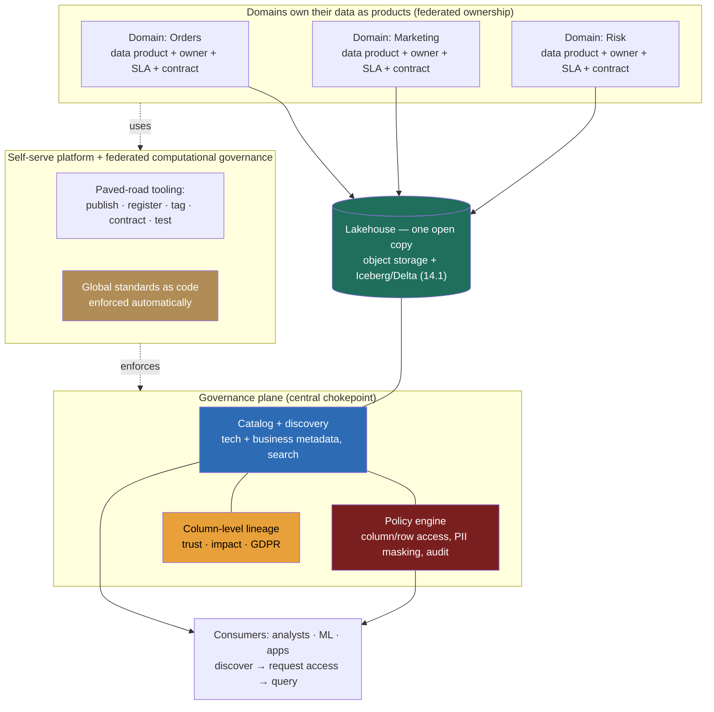

> **This is the question that hides an org chart inside an architecture diagram, and the trap is solving only half of it.** A weak answer hears "hundreds of datasets nobody can find or trust" and reaches for a tool ("we'll stand up a catalog"), drawing boxes for search and access control while the real failure, *a central data team that has become the bottleneck for every domain's data*, goes untouched. A Director-level answer recognizes that data sprawl at scale is a **Conway's-law problem** (Module 8): the architecture mirrors the org, and a single central team owning all the data is a serialization point no catalog fixes. So the answer splits into two interlocking decisions, **the governance plane** (catalog, column-level access, lineage, the chokepoint that makes data findable, trustworthy, and compliant) *and* **the operating model** (centralized platform vs federated **data mesh** with domain-owned data products). The load-bearing move is refusing to cargo-cult mesh: at small scale, centralized governance is *correct* and mesh is over-engineering; mesh earns its considerable complexity only when the number of domains overwhelms a central team's throughput. The signal is naming that crossover with numbers, not reciting "data mesh" as a destination.

### Learning objectives
- Run the **RESHADED** spine on an **org-plus-architecture** problem where **E becomes the scale of domains, datasets, teams, and access policies** (not QPS), and surface the load-bearing tension: **a governance plane over the lake, and centralized-platform vs federated-mesh as a Conway's-law operating-model choice.**
- Open with the **"how many domains, and is the central data team the bottleneck?"** clarifying question, and show how the answer flips the operating model between centralized and federated.
- Design the governance plane, **catalog/discovery, column- and row-level access control with PII tagging and policy-as-code, and column-level lineage**, as a central chokepoint, and reject ungoverned-lake and manual-review with reasons.
- Define **data products** (domain-owned, with owners, SLAs, schemas, docs) and **data contracts** as the inter-domain interface (13.9), and explain **federated computational governance**, global standards enforced by a self-serve platform, local ownership of the data.
- Name the crossover in numbers (domains, datasets, central-team queue depth, domain-onboarding time) where centralized stops scaling and mesh's complexity becomes worth paying, and **delegate the tooling bake-off and per-domain quality with stated priors.**

### Intuition first
Think of the company's data as a **city's worth of warehouses**, and the question as **who runs the city.** Early on there's one well-run central warehouse and a small staff who know where everything is, you ask them, they fetch it, they decide who's allowed in. That's the **centralized data team**, and at a handful of warehouses it's *great*: one consistent filing system, one access desk, one source of truth. But the city grows to hundreds of warehouses across dozens of neighborhoods (domains), and now every request, every "where is the customer-churn data," every "can marketing read this," every new dataset, queues at that one central desk. The staff become a **bottleneck**: they don't know every neighborhood's data, the backlog grows to weeks, and frustrated teams start hoarding their own unmarked copies in basements (the **data swamp**, sprawl nobody can find or trust).

The **data mesh** is the decision to **let each neighborhood run its own warehouse as a published, owned product**, while the *city* still enforces universal rules: every warehouse must have a posted address and inventory (a catalog entry), a named superintendent (an owner) and posted hours (an SLA), standard signage and a standard access-badge system (interoperable schemas and policy-as-code). Crucially, the city doesn't *inspect* each warehouse by hand, it builds the **standard shelving, the badge readers, and the inventory system once** (the self-serve platform) so that complying is the path of least resistance. That's **federated computational governance**: global standards, *automatically* enforced by shared infrastructure, with local teams owning their own warehouses. The neighborhoods scale independently; the city stays coherent.

The mistake to avoid is treating mesh as a fashion. A single well-run central warehouse beats a sprawling mesh you don't have the maturity to govern, mesh trades a *central bottleneck* for *distributed inconsistency*, and that trade only pays once the bottleneck is real. The art is knowing **when** you've outgrown the central desk, and never before.

---

## R: Requirements

> Pin the sprawl, the trust gap, the governance bar, and, the architecture-flipping question, **how many domains and whether the central team is the bottleneck.** R does double duty: it extracts both the governance requirements and the centralized-vs-mesh driver.

**The opening Director move, the question I ask first:** *"How many distinct domains and teams produce data, how many datasets are we talking about, and is the central data team the bottleneck, i.e., are domains waiting weeks on a central queue to publish, change, or get access to data? Because at small scale a centralized platform team owning governance is the right, simpler answer, and a federated mesh is over-engineering; mesh only earns its complexity once the central team can't keep up with the domains."* The answer flips the operating model:
- **Few domains (say <10), one team can hold the whole model in its head, central queue is days not weeks** → a **centralized data-platform team** owns ingestion, modeling, governance, and serving. One filing system, one source of truth, lowest coordination cost. Mesh here is pure overhead.
- **Many domains (dozens to hundreds), the central team is a multi-week bottleneck, no one team understands every domain's data** → a **federated data mesh**: domains own their data as products, a central *platform* team owns the self-serve substrate and the global standards, governance is *computational* (enforced by the platform), not manual.

I'll design for the **harder, increasingly-standard large-org case: the mesh with a strong governance plane**, because the scenario, hundreds of datasets across many teams, nobody can find or trust data, central team is the bottleneck, *is* the post-crossover case, and I'll name explicitly where the crossover sits so I'm not cargo-culting.

**Clarifying questions I'd ask (with assumed answers):**
- *How many domains/teams and datasets?* → **~30-50 producing domains, low-thousands of datasets/tables**, well past what one central team can model. The central decision.
- *Is the central team the bottleneck?* → **Yes**, new-dataset publishing and access requests queue **2-6 weeks**; the symptom that justifies federation.
- *Governance bar?* → **High**, PII/PCI columns, regulated data, column- and row-level access, audit trails, and **GDPR/CCPA lineage** (trace and erase). Table stakes.
- *Trust bar?* → Consumers must **find** data (search/discovery), **judge** it (owner, freshness, quality, lineage), and **rely** on it (SLAs, contracts). The "can't trust data" half.
- *What's the storage substrate?* → The **lakehouse** of 14.1 (object storage + Iceberg/Delta + a catalog). This lesson governs and organizes *that*; it does not re-pick storage.

**Functional requirements:**
1. **Catalog & discovery**, a searchable inventory of all data: technical metadata (schema, location, format) *and* business metadata (owner, description, domain, sensitivity, SLA), so any analyst finds and judges a dataset without asking a human.
2. **Access control**, column-level and row-level authorization with PII/sensitive tagging and masking, enforced at a central chokepoint, with audit.
3. **Lineage**, column-level upstream/downstream lineage for trust ("where did this number come from"), impact analysis ("what breaks if I change this"), and compliance ("every table derived from this user's PII").
4. **Data products & contracts**, the unit of ownership: a domain-published dataset with an owner, SLA, documented schema, and a **data contract** (13.9) as the stable interface other domains depend on.
5. **Self-serve platform & federated governance**, infrastructure that lets a domain publish a compliant, cataloged, access-controlled, lineage-tracked data product *without* the central team, with **global standards enforced computationally** by that platform.

**Explicitly CUT (scoping is the signal):** the lakehouse storage internals (14.1 owns format/layout/scan-cost), the ingestion/CDC mechanics that fill it (14.3), the BI/ML tools that consume it, and the *people-leadership* of building the data org, hiring, re-org, incentives (that's 13.13's domain; I'll name the org *shape* here but not the change-management playbook). I scope to **catalog → access → lineage → data-product/contract model → the federated operating model.**

**Non-functional requirements:**
- **Discoverability at scale**, a new analyst finds the right trustworthy dataset in **minutes, not by Slack-asking around for days**, across thousands of datasets.
- **Governance that scales sub-linearly with datasets**, adding a domain or a dataset must **not** add proportional central-team toil; policy is **as-code and automated**, not per-request review.
- **Compliance-grade access + lineage**, column/row-level enforcement, audit, and lineage complete enough to answer a GDPR erasure or a regulator's "who can see this" in hours.
- **Domain autonomy with global coherence**, domains ship independently (the mesh promise) while every product is interoperable, discoverable, and policy-compliant (the federation guardrail).
- **Fast domain onboarding**, a new domain stands up its first governed data product in **days**, via self-serve, not a central-team project.
- **No new bottleneck**, the governance plane must be a *chokepoint for policy*, not a *queue for humans*; the failure mode is replacing the central modeling bottleneck with a central governance bottleneck.

**The skew, stated:** this is a **discovery-, trust-, and governance-heavy, coordination-bound** problem, not a throughput one. The hard parts are *organizational scaling (Conway), policy-explosion management, lineage capture across heterogeneous engines, and keeping domain quality consistent without a central inspector*, not bytes or QPS. That shapes every downstream choice: automate governance, federate ownership, centralize standards.

---

## E: Estimation

> Enough math to make a defensible call. Here **E is not QPS, it's the scale of domains, datasets, policies, and team throughput**, the numbers that decide whether centralized governance still fits or the mesh crossover has arrived.

**Assumptions:** ~**40 producing domains**, ~**2,000 datasets/tables** (growing ~30%/yr), ~**500 data consumers** (analysts, scientists, apps), a central data team of ~**15 engineers**, regulated data (PII/PCI present).

**The crossover math (the load-bearing estimate):**
- **Central-team throughput vs demand.** Suppose each new/changed data product needs ~2 days of central-team modeling+governance work, and there are ~**3 changes/dataset/year × 2,000 datasets ≈ 6,000 change-events/year** plus a steady stream of access requests. That's ~**12,000 engineer-days/year** of central work against a 15-person team's ~**3,300 productive engineer-days/year**, a **~3.6× shortfall.** *This is the bottleneck, quantified*: demand outruns a central team by multiples, so the queue grows without bound and onboarding stretches to weeks. **This number is what justifies federation**, the central team cannot linearly scale to 40 domains.
- **Where centralized still wins.** Run the same math at **5 domains, 150 datasets**: ~450 change-events/year ≈ ~900 engineer-days against a 5-person team's ~1,100, *it fits.* **Below roughly ~10 domains / a few-hundred datasets, centralized governance is the right call**, and mesh's per-domain platform investment is unjustified overhead. **That's the crossover I name aloud.**

**Governance / policy scale (why manual review is impossible):**
- Column-level access: ~2,000 datasets × ~30 columns × sensitivity classification = **~60,000 column-policy decisions**, multiplied across ~**dozens of roles/teams**. Hand-reviewing access for that surface is a full-time team forever and still inconsistent. *This number forces policy-as-code*: you write **~tens of tag-based rules** ("mask `pii.email` for all but the privacy-cleared role"), not 60,000 per-column grants.

**Onboarding & discovery targets (the user-facing promise):**
- **Domain onboarding:** from a central-team **multi-week project** today to a self-serve **~2-3 days** (provision a product, register in the catalog, attach the standard policy templates, lineage auto-captured).
- **Dataset discovery:** from **days of Slack-archaeology** to a **catalog search of seconds**, with enough metadata (owner, freshness, lineage, quality score) to *judge* trust in minutes.
- **Lineage coverage:** target **>90% of gold/silver tables** with automated column-level lineage; the long tail of hand-built pipelines is the gap to close.

**What estimation decided:** the **~3.6× central-team shortfall at 40 domains** is the quantitative trigger for federation; the **~60,000-column policy surface** is the trigger for policy-as-code; and the **crossover sits near ~10 domains / a few-hundred datasets**, below it centralized wins. These numbers, not the buzzword, are what a Director defends, and they point straight at the data-product, policy-as-code, and self-serve-platform design below.

---

## S: Storage

> The bytes live in the lakehouse (14.1), not here. What this layer *stores* is **metadata**: the catalog (technical + business), the policy store, and the lineage graph, three specialized stores chosen for their access patterns.

**1. The catalog / metastore (the discovery + governance chokepoint).**
- *What it holds:* every dataset's **technical metadata** (schema, location, format, partitioning) and **business metadata** (owner, domain, description, sensitivity tags, SLA, quality score), plus the table-format snapshots from 14.1.
- *Choice:* a **central catalog** (Unity Catalog, Apache Polaris / Iceberg REST catalog, AWS Glue + a discovery layer like DataHub/Amundsen/Collibra for the rich business-metadata and search experience). The catalog is deliberately the **single chokepoint** through which engines resolve tables, so it's the natural home for access control and the anchor for lineage (14.1).
- *Rejected, per-engine / per-team metadata (the swamp's status quo):* every tool keeps its own notion of what exists and who may read it, so discovery fails, governance has nowhere to live, and you get the unmarked-basement-copies failure. A central catalog is non-negotiable precisely *because* it's the one chokepoint.

**2. The policy store (access control as data).**
- *What it holds:* **tag-based, as-code policies** ("role `analyst` may read columns not tagged `pii`; `pii.email` is masked except for role `privacy`; rows are filtered by `region` for regional teams") plus the audit log of every access decision.
- *Choice:* a **policy engine** (the catalog's native ABAC like Unity Catalog, or OPA / Apache Ranger / a purpose-built engine) evaluating **attribute-based rules against column/row tags** at query time, with decisions logged. Policy lives in **version-controlled code**, reviewed and deployed like software.
- *Rejected, per-object ACLs (grant-by-grant):* the ~60,000-column surface makes hand-maintained grants drift into chaos and audit-failure within a quarter. *Rejected, app-layer enforcement:* every consuming tool re-implements (and re-bugs) access control; the chokepoint must be *below* the engines, at the catalog.

**3. The lineage graph.**
- *What it holds:* a **column-level directed graph**, node = (dataset, column), edge = a transform that derived one from another, captured automatically from query/job execution.
- *Choice:* a **graph store** (or graph-shaped index, e.g., OpenLineage emitting into DataHub/Marquez/Unity) because the queries are inherently traversals: *upstream* ("what feeds this column," for trust), *downstream* ("what breaks if I change it," for impact), and *transitive closure* ("every table touching this user's PII," for GDPR). 
- *Rejected, a relational schema with recursive joins for deep lineage:* multi-hop transitive lineage across thousands of tables is exactly the recursive-traversal workload a graph model serves and a relational one fights. *Rejected, manually-maintained lineage docs:* stale the day they're written; lineage must be **captured from execution**, not authored.

**The resolution:** these three metadata stores are **small relative to the data they describe** (kilobytes-to-megabytes of metadata per terabyte of data), so the engineering is about *access patterns and freshness* (search, policy-eval, graph-traversal, all auto-captured), not volume. They compose *onto* the lakehouse of 14.1, the data stays one open copy on object storage; this layer makes it findable, governed, and traceable.

---

## H: High-level design

> The shape to make visible: **domains publish data products into one lakehouse, a governance plane (catalog + policy engine + lineage) spans all of them as the chokepoint, and a self-serve platform makes domain ownership feasible while enforcing global standards.** This is the centralized-platform-team vs data-mesh decision rendered as a picture.



**Happy path, compressed (publish then consume).** A **domain team** (say Orders) builds a **data product**, a curated, documented dataset, *using the self-serve platform's paved road*: they land it in the **lakehouse** (one open copy, 14.1), register it in the **catalog** with business metadata (owner, description, SLA, sensitivity tags), declare a **data contract** (13.9) for the schema other domains will depend on, and the platform's standard pipeline **auto-tags PII columns, attaches the org's policy templates, runs the contract/quality tests, and emits lineage** as the job runs. Global standards (naming, required metadata, classification, contract presence) are **enforced computationally**, a product that doesn't comply can't publish, no human gate. On the **consume** side, an analyst **searches the catalog**, judges the dataset by its owner/freshness/lineage/quality, **requests access** (granted by a tag-based policy, not a ticket to the central team), and queries it through the **policy engine**, which masks the PII columns they're not cleared for and logs the access. The **lineage graph** lets anyone trace that number to its Orders-domain source, and lets a privacy engineer find every table derived from a deleted user.

**The shape to notice:** two load-bearing structures. (1) **Federated ownership over a shared substrate**, domains own *products*, not infrastructure; one lakehouse, many owners (the mesh). (2) **A central governance plane that is a policy chokepoint, not a human queue**, the catalog/policy/lineage triad spans every domain, but compliance is *automated by the platform*, so adding a domain doesn't add central toil. The whole design's tension is right there: **autonomy (domains ship independently) held coherent by computation (the platform enforces global rules), so you scale with domains without a data swamp.**

---

## A: API design

> The "API" of this layer is three contracts: the **data-product / data-contract** interface (how a domain publishes and how consumers depend), the **catalog/discovery** interface (find and judge), and the **policy** interface (tag-based access as code). These contracts *are* the federation, they're what lets domains ship independently while staying coherent.

```yaml
# 1) Data product + contract: the inter-domain interface (domain-published, 13.9)
data_product:
  name: orders.fulfilled_orders          # domain-namespaced; discoverable
  domain: orders
  owner: orders-data@company.com         # a named, on-call owner — not "the data team"
  sla: { freshness: "≤1h", availability: "99.9%" }
  classification: { pii_columns: [customer_email], pci: false }
  contract:                               # the stable promise other domains build on
    schema:
      order_id:        { type: string, nullable: false }   # contract: never null
      customer_email:  { type: string, tags: [pii] }       # auto-masked by policy
      amount_cents:    { type: long,   nullable: false }
      status:          { type: enum,   values: [placed, fulfilled, cancelled] }
    guarantees: { backward_compatible: true }   # breaking change requires a new version
    quality_tests: [not_null(order_id), unique(order_id), accepted_values(status)]
```

```sql
-- 2) Catalog / discovery: find and JUDGE a dataset without asking a human
SEARCH CATALOG 'customer churn'                      -- full-text + tag + lineage search
  WHERE classification = 'pii' AND owner IS NOT NULL
  RETURN name, owner, sla.freshness, quality_score, lineage_upstream;

-- 3) Policy as code: tag-based, attribute-driven access (NOT per-object grants)
GRANT SELECT ON TAG 'domain:orders'  TO ROLE analyst   -- coarse: domain-level read
  EXCEPT COLUMNS TAGGED 'pii';                          -- minus the PII columns
MASK COLUMNS TAGGED 'pii.email'      FOR ROLE analyst   USING email_mask();  -- fine: masking
ROW FILTER ON TAG 'regional'         FOR ROLE eu_team   USING (region = 'EU'); -- row-level
-- every decision above is logged to the audit store
```

**Design notes (each with its rejected alternative):**
- **The data contract is the inter-domain API, and a breaking change requires a new version**, this is what lets domain B depend on domain A's product without depending on A's *internals* (13.9). *Rejected: consumers reading another domain's raw tables directly*, which couples every consumer to a producer's private schema, so the producer can't evolve and you're back to a tangled monolith with no real ownership boundaries.
- **Discovery returns enough to *judge* trust (owner, SLA, quality, lineage), not just to *find***, because the scenario's pain is "can't *trust* data," not only "can't find it." *Rejected: a bare name-and-location catalog*, which solves discovery but not trust; an analyst still can't tell if the dataset is authoritative or abandoned.
- **Access is tag-based policy-as-code, evaluated at the catalog chokepoint**, you tag data (`pii`, `domain:orders`, `regional`) and write ~tens of rules over tags, so a new dataset inherits policy automatically the moment it's tagged. *Rejected: per-object ACLs granted on request*, which doesn't scale past the ~60,000-column surface and *recreates the central-team bottleneck* as an access-request queue, the exact failure we're designing away.
- **Every access decision is audited**, non-negotiable for regulated data; audit is a first-class output of the policy engine, not bolted on. *Rejected: trust-and-log-nothing*, an instant compliance failure.
- **Global standards (required metadata, classification, contract presence, naming) are enforced by the platform at publish time**, computational governance: non-compliant products *can't ship*. *Rejected: a governance committee that reviews each product*, which is manual review by another name, doesn't scale, and reintroduces the human queue.

---

## D: Data model

> Two models matter here, both metadata: the **data-product / catalog-entry model** (the unit of ownership and discovery) and the **lineage-and-policy metadata model** (trust and enforcement). The data itself is modeled in 14.1/13.8; this is the model *about* the data.

**The data-product entry (the unit of federated ownership):**
- `data_product`: `(name [domain-namespaced], domain, owner, sla, classification, contract_ref, location_ref → lakehouse table, status [active/deprecated])`. The **owner** and **SLA** are what make it a *product* and not just a table, there's a named team on the hook for it, which is the organizational primitive the whole mesh rests on.
- `contract` (versioned): the schema + guarantees + quality tests above; **versioned independently** so a breaking change is a new contract version, not a silent break (13.9). Consumers pin a version.
- `tags`: the **classification and routing labels** (`pii`, `pci`, `domain:x`, `regional`, `gold/silver/bronze`) that policy and discovery key off. **Tags, not per-object rules, are the scaling primitive**: policy is written over tags once, and every newly-tagged column inherits it.

**The governance metadata model:**
- **Lineage node/edge:** `node = (dataset, column)`; `edge = (from_node, to_node, transform_job, timestamp)`. Column-level, captured from execution. The three queries it must serve, stated as the model's reason to exist: **upstream** (trust), **downstream** (impact-analysis before a breaking change), **transitive closure** (compliance, "everything derived from this PII").
- **Policy as data:** `(principal/role, action, tag-predicate, effect [allow/mask/row-filter], obligation [audit])`, ABAC rules over tags, not a grant matrix over objects. This is the single most consequential modeling choice for scale: **modeling access as *attributes over tags* makes governance grow sub-linearly with datasets**, whereas modeling it as *grants over objects* makes it grow with datasets × columns × roles and collapses.
- **Audit record:** `(principal, dataset, columns, decision, policy_version, timestamp)`, append-only, the compliance evidence.

*Rejected, modeling a data product as just a database table:* you lose the owner, SLA, contract, and classification, the very things that distinguish a *governed, trustworthy product* from an *anonymous table in the swamp*. The metadata *is* the product. *Rejected, table-level (not column-level) lineage and policy:* "this table is PII" is too coarse, it over-restricts (masking a whole table when one column is sensitive) and fails GDPR's column-precise erasure and the analyst's need to read the 29 non-PII columns. **Column-level granularity is what makes both access and lineage usable**, and it's the modeling decision a Director defends against the simpler table-level shortcut.

---

## E: Evaluation

> Re-check against the NFRs, then hunt the bottlenecks, naming each trade-off. The recurring theme: every fix must avoid *recreating a central human bottleneck*, the failure this whole design exists to kill.

**Re-check vs NFRs:** discoverability, the catalog + rich business metadata + search; sub-linear governance, tag-based policy-as-code; compliance-grade access+lineage, the policy chokepoint + column-level lineage graph + audit; domain autonomy with coherence, data products + contracts + self-serve platform; fast onboarding, the paved road; no new bottleneck, computational enforcement, not human review. Now the bottlenecks.

**Bottleneck 1, governance-at-scale / policy explosion (the central money risk of mesh).**
As domains and datasets grow, naive per-object access rules explode toward the ~60,000-column surface and become unmaintainable and inconsistent, *and* a poorly-designed governance process becomes the new central queue.
*Fix:* **tag-based policy-as-code** evaluated at the catalog chokepoint, write ~tens of rules over tags (`pii`, `domain:x`, `regional`), so policy scales with *rule count* (near-constant) not *dataset count*; auto-tag PII at publish via the platform. *Trade-off named:* policy-as-code demands real upfront investment (a policy engine, a tagging discipline, classification automation) and a team to own the rule library, versus the deceptive "ease" of ad-hoc grants, *which is a debt that compounds into an audit failure.* *Rejected: manual access review*, it doesn't scale and reintroduces the human bottleneck.

**Bottleneck 2, the discovery / stale-catalog problem (the trust killer).**
A catalog is only as good as its metadata; if datasets are uncataloged, undocumented, or the metadata is stale, discovery fails and you still can't *trust* what you find, the swamp persists *with* a catalog bolted on.
*Fix:* **make cataloging automatic and mandatory at publish** (the platform won't ship an un-registered, un-tagged, owner-less product, computational governance), **auto-harvest technical metadata and lineage from execution**, and surface a **freshness/quality score** so consumers can judge staleness. *Trade-off:* mandatory metadata adds friction to publishing (you can't ship a quick untracked table), accepted because *untracked data is exactly the swamp.* *Rejected: voluntary cataloging*, it always decays to stale and partial; humans don't document under deadline.

**Bottleneck 3, lineage capture across heterogeneous engines (the compliance gap).**
Lineage is easy to claim and hard to capture: data flows through Spark, dbt, Trino, the warehouse, streaming jobs, hand-rolled scripts, and column-level lineage must span all of them or GDPR/impact-analysis has blind spots.
*Fix:* **standardize on an open lineage spec** (OpenLineage) emitted by the platform's paved-road tools, so any job run on the standard rails contributes lineage automatically; **route as many pipelines as possible onto the paved road** to shrink the dark-lineage long tail; accept and *track* the residual gap from legacy jobs. *Trade-off:* full automated column-level lineage across every engine is genuinely hard, the honest target is **>90% coverage of gold/silver with a known, shrinking gap**, not a false 100%. *Rejected: hand-maintained lineage docs*, stale on day one.

**Bottleneck 4, the central-team bottleneck itself (the org failure the design targets).**
The originating pain: a central team serializing every domain's data work, *and* the subtle re-failure where the new platform/governance team becomes the next bottleneck (every publish or policy change queues on them).
*Fix:* **federate ownership to domains and re-charter the central team from *doing the work* to *building the paved road and owning the standards*** (the platform-team model, Conway, Module 8). Domains self-serve; the central team's throughput is no longer in the critical path of every dataset. *Trade-off, stated plainly:* this is an **org change, not just an architecture change**, it needs domain teams with the maturity and headcount to own data products, which many orgs lack; *that maturity gap is the real reason mesh fails*, and naming it (and the people-side handoff to 13.13) is the Director signal. *Rejected: a bigger central team*, you can't hire your way out of a serialization point; throughput scales with parallel domain ownership, not central headcount.

**Bottleneck 5, inconsistent domain quality / "distributed swamp" (mesh's signature failure mode).**
Federation's risk: 40 domains produce 40 different levels of quality, naming, and documentation, and "find/trust" fails *across* domains even if each domain is internally fine, plus duplicated, subtly-different copies of the same entity proliferate.
*Fix:* **federated computational governance**, global standards (naming, required metadata, contract presence, classification, interoperability of key entities) **enforced by the self-serve platform**, so a non-conforming product literally can't publish; and **identify and govern the few cross-domain "master" entities** (customer, account) centrally as shared products to prevent the duplicate-customer-table problem. *Trade-off:* global standards constrain domain autonomy, the federation tension is *real*, you trade some local freedom for cross-domain coherence, and getting that balance right (enough standard to interoperate, enough freedom to move) is the core mesh design judgment. *Rejected: pure domain autonomy with no global standards*, that's not a mesh, it's a sanctioned swamp.

**Closing re-check:** policy scales by tags-as-code, not per-object review; discovery and lineage are auto-captured and mandatory, not voluntary and stale; the central team is re-chartered to the paved road so it's not the queue; and global standards are *computed* by the platform so federation doesn't fragment into inconsistency. The plane is discoverable, governed, traceable, and, critically, *not a new bottleneck*.

---

## D: Design evolution

> Push the dimensions and find what breaks; here the central evolution argument is **centralized platform vs federated mesh**, *when* to make the move, and how to do it incrementally rather than as a big-bang reorg.

**The headline trade-off, centralized governance vs data mesh (and why not to cargo-cult either).** Centralized is genuinely better on *consistency and simplicity*; mesh is better on *scaling with domains and removing the central bottleneck*, at a real cost in complexity and required org maturity. The honest Director position:
- **Stay/Start centralized** when you're below the crossover, **<~10 domains, a few-hundred datasets, the central team's queue is days not weeks.** One filing system, one source of truth, lowest coordination cost; mesh here is over-engineering that buys distributed inconsistency you don't need. **Most companies are here and should stay here.**
- **Move to / build mesh** when you're past the crossover, **dozens of domains, low-thousands of datasets, the central team is a multi-week bottleneck (my ~3.6× shortfall math), and no one team can understand every domain's data.** Federate ownership, invest in the self-serve platform, enforce standards computationally.
- **My prior:** for *this* large-org, ~40-domain, bottlenecked profile, the **mesh with a strong central governance plane**, but I would **never lead with "we're doing data mesh."** I'd lead with the *bottleneck symptom and the crossover number*, then introduce mesh as the *response*, and I'd migrate **incrementally**: stand up the governance plane (catalog/policy/lineage) and the self-serve platform *first* (they help even a centralized org), then **peel off the highest-pain, highest-maturity domains into ownership one at a time**, leaving low-maturity domains centrally managed until they're ready. The two models **coexist during the transition**, which is the pragmatic end-state for years, not a clean cutover. **The deepest trap is treating mesh as the goal rather than the bottleneck as the problem**; mesh is a means, and below the crossover it's the wrong one.

**At 10× (hundreds of domains, tens of thousands of datasets, thousands of consumers):** the **governance plane and standards become the binding complexity**, not the storage. Policy-as-code is now existential (no human could review the surface); the **catalog's discovery quality** (search relevance, metadata freshness, quality scoring) becomes the make-or-break UX, a bad search at this scale *is* a swamp; **cross-domain master-data governance** (the shared customer/account entities) becomes a dedicated function to stop entity-duplication sprawl; and **lineage's transitive-closure performance** matters for GDPR at scale (the graph store earns its keep). The central platform team's leverage is entirely in the **paved road**, the better the self-serve tooling, the more domains it scales to without a central queue.

**Hardest trade-offs to defend:**
- **Mesh complexity vs centralized simplicity (the crossover).** You take on a self-serve platform, federated governance, and an org change to win domain-scaling and kill the bottleneck; defending *why that complexity is worth it at this scale, and would be wrong below it*, with the crossover number, is the senior tell.
- **Domain autonomy vs global coherence.** Too much autonomy → distributed swamp; too much central standard → you've recreated the central bottleneck as a standards committee. Drawing that line (federated *computational* governance, enforced by the platform, not a committee) is the core mesh judgment.
- **Org maturity as the real constraint.** Mesh assumes domain teams that can *own* data products, headcount, skills, on-call. Many orgs adopt the architecture without the org and get a worse swamp. Naming that *people-and-org* precondition (and that it's the usual failure cause) is the altitude; the change-management of getting there is 13.13's job.

**Where I'd delegate (the explicit Director move):**
- **Governance/catalog tooling bake-off:** *"Data platform benchmarks Unity Catalog vs Polaris+DataHub vs a Collibra/Atlan-class tool against our multi-engine lineage and column-level policy needs; my prior is the native catalog of our lakehouse for the chokepoint plus a discovery layer for business metadata, the category, central-chokepoint catalog + policy-as-code + auto-lineage, is decided; the specific product isn't load-bearing."*
- **Per-domain data-product quality and the contract library:** *"Each domain owns its products' quality and SLAs against the global standard; the platform team owns the standard, the contract framework (13.9), and the quality-test harness. I own that *every* product has an owner, a contract, and a classification, not the per-domain schemas."*
- **The org transition / change management:** *"The people side, which domains are mature enough to own products, the re-charter of the central team, the incentives, is the leadership work of 13.13; my prior is to peel off high-maturity domains first and keep the rest centrally managed until ready. I own the operating-model decision and the crossover; I delegate the rollout sequencing with that prior."* What I keep, **the governance-plane architecture (catalog/policy-as-code/lineage chokepoint), the data-product-and-contract model, federated computational governance, and the centralized-vs-mesh crossover call**, is the altitude.

**Handoff:** this layer *governs and organizes* the lakehouse (14.1) and the pipelines that fill it (14.3); the **data-contract and quality** mechanics it depends on are 13.9; the **people-and-org leadership** of standing up the data org and the mesh transition is 13.13; and the **Conway's-law operating-model reasoning** generalizes from Module 8.

---

## Trade-offs table: the pivotal decisions

| Decision | Option A | Option B | Option C | Use when… |
|---|---|---|---|---|
| **Operating model** | **Federated data mesh** (domain-owned products + central platform + federated governance) | **Centralized data-platform team** (one team owns ingest/model/govern/serve) | **Ungoverned lake** (teams dump data, no owners) | **A** past the crossover, dozens of domains, central team is a multi-week bottleneck (our choice). **B** below it, <~10 domains, few-hundred datasets, queue is days (the right default for most). **C never**, it *is* the data swamp. |
| **Governance enforcement** | **Policy-as-code + computational** (tag-based ABAC, enforced by the platform) | **Governance committee / manual review** (humans approve products & access) | **Per-object ACLs** (grant-by-grant on request) | **A** at any real scale, scales with rule-count not dataset-count (our choice). **B never** alone, it's the human bottleneck reborn. **C** only at tiny scale; collapses past ~hundreds of datasets. |
| **Access granularity** | **Column- & row-level** (mask PII columns, filter rows) | **Table-level** (allow/deny whole datasets) | **Database-level** (coarse, by schema) | **A** for regulated/PII data, the realistic default, GDPR-precise (our choice). **B** when no column is differentially sensitive. **C** only for fully-public or fully-internal coarse zones. |
| **Catalog/tooling** | **Buy** (Collibra/Atlan/DataHub-class + native catalog) | **Use the lakehouse-native catalog** (Unity/Polaris/Glue) | **Build in-house** | **B** for the governance *chokepoint* (it's where engines resolve tables). **A** layered on top for rich discovery/business-metadata UX. **C** rarely, only if a unique requirement justifies owning it; mostly not worth the build. |

---

## What interviewers probe here (Director altitude)

- **"Centralized data team or data mesh, and why?"**, *Strong:* names the **crossover** first, centralized below ~10 domains / few-hundred datasets, mesh once the central team is a multi-week bottleneck, and quantifies it (the ~3.6× central-throughput shortfall); frames it as a **Conway's-law operating-model decision**, not a tooling one; refuses to cargo-cult mesh. *Red flag:* "we'll do data mesh" as a destination with no scale trigger, or "we'll add a catalog" while ignoring the org bottleneck entirely.
- **"How does governance scale to thousands of datasets without becoming the new bottleneck?"**, *Strong:* **policy-as-code over tags** (ABAC), enforced *computationally* by the self-serve platform so non-compliant products can't publish and access is rule-based not ticket-based, scaling with rule-count, not dataset-count. *Red flag:* a governance committee or per-object grants, i.e., manual review, the human queue reborn.
- **"A regulator asks who can see this customer's data and to delete it. Walk me through it."**, *Strong:* **column-level access policy** answers "who can see" from the policy store + audit log; **column-level lineage's transitive closure** finds every table derived from that user's PII for erasure; classification tags make both tractable; names snapshot/time-travel expiry as the gotcha. *Red flag:* table-level granularity, or no lineage, can't answer either precisely.
- **"What actually makes data mesh fail in practice?"**, *Strong:* **org maturity**, domains lack the headcount/skills to own data products, so you get a *distributed* swamp; and **missing global standards**, autonomy without federated computational governance fragments into inconsistency. Names that it's a people problem (13.13) as much as an architecture one. *Red flag:* treats mesh as a pure tech rollout, no mention of the org precondition.
- **"You have a swamp today. What's the first thing you build, and what do you not do?"**, *Strong:* build the **governance plane (catalog + policy-as-code + auto-lineage) and the self-serve platform first** (they help even a centralized org), peel off high-maturity domains **incrementally**; do *not* big-bang-reorg into mesh or lead with the buzzword. *Red flag:* a top-down "everyone owns their data now" mandate with no platform and no sequencing.

---

## Common mistakes

- **Cargo-culting data mesh.** Adopting mesh because it's fashionable, below the crossover, where a centralized platform team is simpler and *correct*. Mesh trades a central bottleneck for distributed inconsistency; that trade only pays once the bottleneck is real and quantified.
- **Solving discovery, ignoring the org.** Standing up a catalog while the central team stays the serialization point for every dataset. A catalog over a central bottleneck is a nicer-looking swamp; the architecture mirrors the org (Conway), and the org is the bottleneck.
- **Manual governance.** A review committee or per-object access grants over thousands of datasets, it doesn't scale, drifts into inconsistency and audit failure, and *recreates the human bottleneck* as an access-request queue. Governance must be **policy-as-code, computationally enforced.**
- **Treating data products as just tables.** Dropping the owner, SLA, contract, and classification, the very metadata that makes data *trustworthy and discoverable*, so consumers still can't judge or rely on it. The metadata *is* the product.
- **Mesh without the platform or the org maturity.** Mandating domain ownership without building the self-serve paved road, or without domains that can actually own products. You get a *distributed* swamp, the signature mesh failure, and the cause is usually people, not technology.

---

## Interviewer follow-up questions (with model answers)

**Q1. We have 2,000 datasets across 40 teams and nobody can find or trust anything. Where do you start, centralized cleanup or mesh?**
> *Model:* First I'd confirm the **bottleneck**: are domains waiting weeks on a central team to publish or get access? At 40 domains the central-team math doesn't close, roughly 12,000 engineer-days of change-work a year against a ~15-person team's ~3,300, a ~3.6× shortfall, so the queue grows without bound; that *is* the bottleneck, and it's why a bigger central team can't fix it (you can't hire past a serialization point). So the direction is **federation**, but I would *not* big-bang reorg or lead with "data mesh." I'd build the **governance plane and self-serve platform first**, catalog with rich business metadata so people can *find and judge* data, policy-as-code so access stops queuing, auto-captured column-level lineage so people can *trust* it, then **peel off the highest-pain, highest-maturity domains into ownership one at a time**, leaving the rest centrally managed until ready. The two models coexist for years; the platform helps either way. The crossover I'd name aloud: below ~10 domains I'd stay centralized.

**Q2. How do you do access control over thousands of datasets and tens of thousands of columns without it becoming a full-time queue?**
> *Model:* **Tag-based policy-as-code (ABAC), enforced at the catalog chokepoint.** I classify data with tags (`pii`, `pci`, `domain:orders`, `regional`) at publish, automatically where I can, then write ~tens of rules over *tags*, "role `analyst` reads any `domain:*` except columns tagged `pii`; `pii.email` is masked except for `privacy`; `regional` rows filter by the requester's region." A new dataset inherits all of that the moment it's tagged, so governance scales with **rule-count (near-constant), not dataset-count**. Every decision is audited. The alternative, per-object grants on request, is the ~60,000-column surface by hand: it drifts into inconsistency, fails audit, and recreates the central bottleneck as an access-ticket queue. The cost of policy-as-code is real upfront investment, a policy engine, a tagging discipline, classification automation, and that's the trade I'd defend, debt-free scaling for upfront effort.

**Q3. What's the difference between a "data product" and just a table in the lake, and why does it matter?**
> *Model:* A table is anonymous; a **data product** has a **named owner, an SLA, a documented schema published as a versioned data contract, and a sensitivity classification.** That metadata is exactly what the scenario is missing, it's why nobody can *trust* the data. The owner means someone's on the hook; the SLA means consumers know the freshness/availability they can build on; the **contract (13.9)** means another domain can depend on the product's *interface* without coupling to its internals, and a breaking change requires a new version rather than silently breaking downstream; the classification drives automatic policy. The product is the **unit of federated ownership**, it's what makes the mesh a mesh rather than a shared dumping ground. Modeling data as products, not tables, is the decision that turns sprawl into a governed, discoverable catalog.

**Q4. A regulator demands you delete a specific customer's data everywhere within 30 days. How does this design make that tractable?**
> *Model:* Two pieces do the work. **Column-level lineage**, captured automatically from job execution as a graph, lets me run a **transitive closure** from the source PII column to *every* downstream table derived from it across bronze/silver/gold, so I find all of it, not just the obvious tables. Then the **table format's column-precise delete** (14.1) erases the rows, and I use **column-level classification** so I knew exactly which columns are that customer's PII in the first place. The gotcha I'd name: **time-travel snapshots**, the deleted data lingers in old snapshots, so snapshot expiry must be set inside the compliance window. The audit log proves who could access it before deletion. This is why I insist on **column-level** lineage and policy, not table-level: table-level can't answer "which columns, derived where" precisely, and GDPR is column-precise. Lineage that's hand-maintained would have blind spots; it has to be captured from execution.

**Q5. Your CTO read about data mesh and wants it everywhere by next quarter. You run 6 domains and the team isn't backed up. What do you say?**
> *Model:* I'd push back with the crossover. At **6 domains and a central team whose queue is days, not weeks, we're *below* the threshold where mesh pays.** Mesh trades a central bottleneck, which we don't yet have, for distributed inconsistency and a heavy self-serve-platform investment and an org change that demands domain teams mature enough to own products, which is the usual reason mesh *fails*. So forcing it now would likely give us a *worse* swamp and slower delivery. What I'd do instead: **invest in the parts that help us today regardless**, a real catalog, policy-as-code, automated lineage, all valuable in a centralized model, and **define the bottleneck metric** (central-team queue depth, onboarding time) that would *trigger* federation. When we cross it, dozens of domains, multi-week queue, we'll peel off mature domains incrementally with the platform already in place. That's leading with the *problem* (the bottleneck), not the *buzzword* (mesh), which is the whole discipline here.

---

### Key takeaways
- **This is an org-plus-architecture problem (Conway), not a tooling problem.** Data sprawl at scale is a *central-team bottleneck*; the architecture mirrors the org. Open with **"how many domains, and is the central team the bottleneck?"**, it flips the operating model between centralized and mesh, and **E becomes the scale of domains/datasets/policies/team-throughput**, not QPS.
- **Don't cargo-cult mesh, name the crossover.** Below ~10 domains / a few-hundred datasets, a **centralized platform team is correct and simpler**; mesh earns its complexity only once the central team is a multi-week bottleneck (the ~3.6× throughput-shortfall math). Mesh trades a central bottleneck for distributed inconsistency, pay it only when the bottleneck is real.
- **The governance plane is a policy chokepoint, not a human queue: catalog + policy-as-code + column-level lineage.** Discovery must let consumers *judge* trust (owner, SLA, quality, lineage), not just find; access is **tag-based ABAC enforced computationally** so it scales with rule-count, not dataset-count; **column-level** lineage and policy are what make GDPR and impact-analysis tractable.
- **Data products + contracts are the unit of federated ownership.** A product has an owner, SLA, versioned contract (13.9), and classification, the metadata that turns an anonymous table into trustworthy, discoverable data; the contract is the inter-domain interface that lets domains ship independently.
- **Federated computational governance is the resolution of the autonomy-vs-coherence tension:** global standards enforced *automatically* by a self-serve platform (non-compliant products can't publish), local ownership of the data. Mesh's real failure cause is **org maturity** (domains that can't own products) and **missing standards** (a distributed swamp), it's a people problem (13.13) as much as an architecture one. Delegate the tooling bake-off and per-domain quality with priors; keep the operating-model call, the crossover, and the governance-plane architecture.

> **Spaced-repetition recap:** "Govern the data lake / data mesh" = **an org problem wearing an architecture diagram (Conway).** Open with **"how many domains, is the central team the bottleneck?"** Below the crossover (~<10 domains, few-hundred datasets, queue in days) → **centralized platform team**, simpler and correct. Past it (dozens of domains, low-thousands of datasets, multi-week central queue, the ~3.6× shortfall) → **federated data mesh**: domains own **data products** (owner + SLA + versioned **contract** (13.9) + classification), a central **platform team** owns the **self-serve paved road** and the **global standards**. The **governance plane** is a *policy chokepoint, not a human queue*: **catalog** (find *and judge*: owner/freshness/quality/lineage), **policy-as-code** (tag-based ABAC, **column/row-level**, computationally enforced, scales with rule-count not dataset-count), **column-level lineage** (trust/impact/GDPR transitive-closure, auto-captured). **Federated computational governance** = global standards *automatically enforced* + local ownership; it resolves autonomy-vs-coherence. Bottlenecks: policy explosion (→ tags-as-code), stale catalog (→ mandatory auto-cataloging), heterogeneous-engine lineage (→ OpenLineage paved road, >90% coverage), the central-team bottleneck (→ re-charter to the paved road), inconsistent domain quality (→ computational standards + central master-data). **Never cargo-cult mesh**; lead with the *bottleneck*, not the buzzword; migrate incrementally, the models coexist for years. Real failure cause = **org maturity** (people, 13.13). Governs the lakehouse (14.1), depends on contracts/quality (13.9). Delegate tooling + per-domain quality + rollout with priors; keep the operating-model call, the crossover, and the governance-plane architecture.

---

*End of Lesson 14.5. The data-lake-governance / data-mesh question is the one that hides an org chart inside an architecture diagram: data sprawl at scale is a Conway's-law central-team bottleneck, and the answer is two interlocking decisions, a **governance plane** (catalog + policy-as-code + column-level lineage, a policy chokepoint, not a human queue) and an **operating model** (centralized below the crossover, federated mesh past it). The load-bearing discipline is refusing to cargo-cult mesh, naming the crossover in numbers, leading with the bottleneck rather than the buzzword, and recognizing that mesh's real failure mode is org maturity, not technology. Governs the lakehouse of 14.1, rests on the data contracts of 13.9, and hands the people-and-org transition to 13.13. Next: 14.6.*
