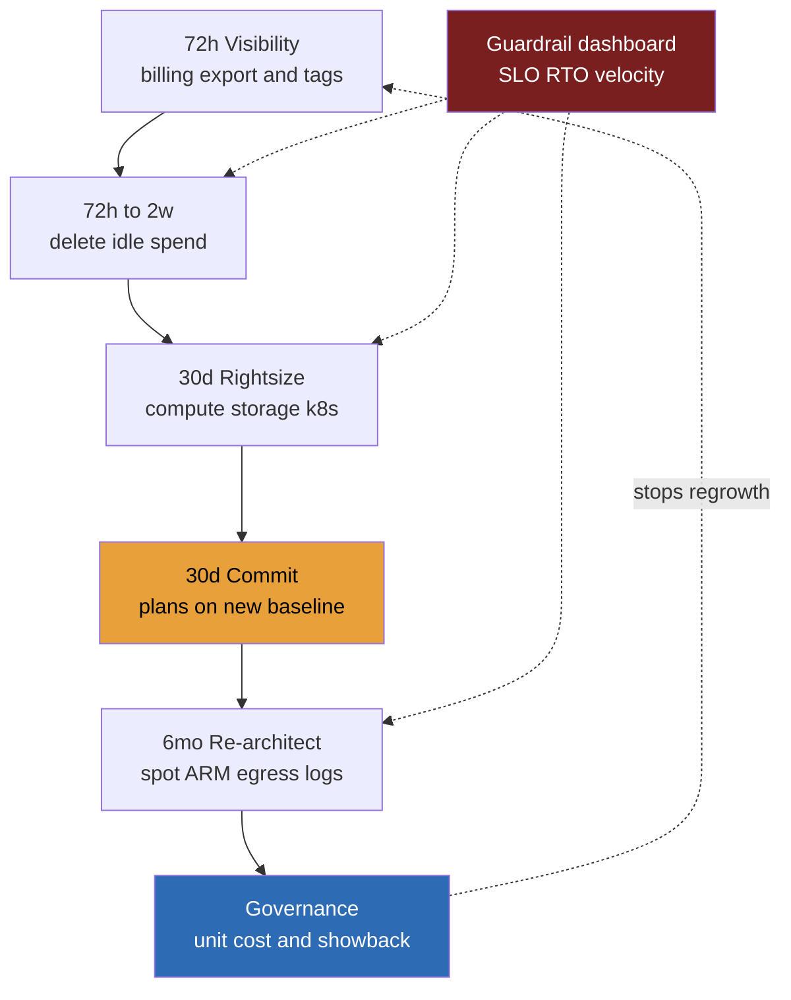

> **This question is a fixture of post-ZIRP Director loops because it is the job.** Boards stopped paying for growth-at-any-cost around 2023 and never went back; loops now ask it straight, "your bill is $X, cut 30-50% without breaking anything: 72 hours, 30 days, 6 months", with a behavioral twin behind it. A junior answer is a grab-bag of tips: spot, reserved instances, delete old stuff. A Director answer is a **sequenced program with guardrails**: a decomposition saying where the money actually is, a savings ladder whose *ordering* is load-bearing, quick wins funding the slow re-architecture, named SLO and velocity metrics that must hold throughout, and **one cut you refuse to make, defended to the CFO's face**. The refusal is the credibility moment: anyone can cut; leaders know what the cheap-looking line items are buying.

### Learning objectives
- Decompose a cloud bill into its **5-6 spend drivers** and attach a realistic savings percentage to each, reason in dollars, not vibes.
- Run the **savings ladder in order**, delete idle → rightsize → commitment discounts → re-architect, and explain why the ordering is a correctness property.
- Structure the answer as the **72-hour / 30-day / 6-month plan**, where ~30% lands in 30 days and buys the budget and credibility for the 6-month tail.
- Define the **guardrails before the cuts**: the SLOs, RTO/RPO, and velocity metrics that must hold, on a dashboard from hour zero.
- Name the **one cut you refuse to make**, capacity whose job is to look idle, and defend it as risk management, not empire defense.

### Intuition first
A turnaround consultant walks into a company bleeding cash. The amateur move is to cut 10% from every department by email, fast, fair-looking, and wrong: it starves the profitable lines and barely dents the bloated ones. The professional sequence is different. First, **read the books**, you cannot cut what you cannot see. Then **stop the obvious bleeding**: cancel unused licenses, sublet the empty floor, money nobody will miss, banked in days, buying the board's patience. Then **renegotiate the contracts** on what you're keeping, only *after* you know what you're keeping, because a three-year lease on an office you're about to vacate is waste with a signature on it. Only then the slow, structural work: change how the company operates so costs don't grow back. Throughout, two things stay sacrosanct: the **insurance policies**, pure waste right up until the fire, and the **pace of the business**, because a company that saves 30% and stops shipping has not been saved.

That is this lesson. Cloud bill = the books. Idle resources = the empty floor. Commitments = the contracts. Re-architecture = the re-org. SLOs, RTO, deploy frequency = the insurance and the pace. The interview tests which way you cut.

---

## R: Requirements

> Adaptation, stated out loud: in a cost program, R gathers the **guardrails**, not product features. The "functional requirements" are the invariants that must hold *while* you cut, a savings target with no guardrails is how you buy an outage with the savings.

**Anchor scenario:** a **$10M/yr cloud bill** (~$833K/mo) at a 400-engineer company, one hyperscaler, traffic growing ~20%/yr. Mandate: **cut 30-50% of run-rate within two quarters** without hurting reliability or delivery.

**Clarifying questions I'd ask (with assumed answers):**
- *Run-rate or absolute?* → **Run-rate, growth-normalized.** The honest metric is **unit cost** (per 1K requests / per DAU), not the headline bill, agree this with finance up front or argue about it forever.
- *Reliability commitments?* → 99.9% SLO; **RTO 1 hour, RPO 5 minutes** on tier-1 data. Contractual; the program must not move them.
- *Is engineering time a cost?* → Yes, saving $2M of cloud by burning $3M of payroll and a quarter of roadmap is a loss.
- *Compliance floors?* → 7-year audit-log retention, 35-day backups. **Cuts below these are off the table regardless of how the line item looks.**

**The guardrails (this design's functional requirements):**
1. **SLOs hold:** error-budget burn stays at baseline; any cut producing sustained burn reverts, no debate.
2. **RTO/RPO hold, and are re-proven.** Every cut touching redundancy, backups, or failover triggers a **DR drill** before the saving is banked. Untested DR is the classic silent casualty of cost programs.
3. **Velocity holds:** deploy frequency and lead time flat; product teams spend **≤10% of the quarter** on cost work, the heavy lifting belongs to a central team of 3-4.
4. **Compliance floors are invariants.**

**Explicitly CUT from scope:** SaaS/vendor renegotiation (procurement's program), headcount, and cloud repatriation (returns in Design evolution as a deliberately rejected default). Scope: **the cloud bill, two quarters, guardrails as stated, one owner (me), weekly guardrail review.** Program NFRs: every cut **reversible or rehearsed** (commitments are the exception, why they come last among the quick wins); savings reported as **realized run-rate** against a baseline finance has signed.

---

## E: Estimation

> Adaptation: E is the **spend decomposition and the savings ladder**, where the $10M sits and what each rung realistically takes. Cutting without decomposing is hand-waving in dollars instead of requests.

**Decompose the $10M (typical product-company shape; round aggressively):**

| Driver | $/yr | % | What's in it |
|---|---|---|---|
| Compute (VMs / k8s nodes) | $4.0M | 40% | prod + non-prod fleets, CI |
| Managed databases + caches | $2.0M | 20% | RDS/Aurora, Redis, search |
| Storage + snapshots | $1.5M | 15% | S3/blob, EBS, snapshot sprawl |
| Data transfer + networking | $0.8M | 8% | egress, cross-AZ, NAT |
| Observability + logging | $0.7M | 7% | log ingest, metrics, APM |
| Support plan + everything else | $1.0M | 10% | enterprise support ≈ 3-10% of bill |

Two insights fall out: **compute + databases are 60% of the bill**, the program lives there; and nobody reaches 30% by optimizing the 7% line, though observability is usually the most bloated *proportionally* (log-tiering fixes the log-ingest default).

**The savings ladder, each rung with its number; the ordering is the design:**

**Rung 1, Delete idle (72 hours → 2 weeks): ~8% ≈ $0.8M/yr.** Unattached volumes, orphaned snapshots, dead environments, over-retained logs, non-prod running nights and weekends (~65% of hours idle, scheduling it off is free money). Zero risk, instantly reversible, and the real product is **credibility**: $0.8M in two weeks is what makes the CFO fund the rest.

**Rung 2, Rightsize (30 days): ~12% ≈ $1.2M/yr.** Typical prod fleets run **15-25% p95 utilization**; k8s requests sit 3-4× actual; gp2→gp3 and lifecycle tiering (70% of objects untouched in 90 days → infrequent-access at 45-80% off) are config changes, not projects. Reversible in minutes, which is what makes it safe to do fast.

**Rung 3, Commitments (30 days, *after* rung 2): ~12% ≈ $1.2M/yr.** Savings Plans at ~30-35% off, ~75% coverage of the **post-rightsizing** baseline (~$5M compute + DB). **Ordering is load-bearing:** commit first and you've signed a 1-3 year contract to keep paying for the waste rung 2 was about to remove. The one rung that *reduces* reversibility, hence last among the quick wins.

**30-day subtotal: ~32% (~$3.2M run-rate)**, the mandate's floor, met by configuration and procurement alone. Say that out loud.

**Rung 4, Re-architect (6 months): another ~8-15%.** Spot for CI, batch, stateless workers (60-90% off that slice); ARM/Graviton (~15-20% price-perf); data-transfer surgery, CDN egress offload, cross-AZ chatter, NAT; log tiering and sampling (the $0.7M line typically halves); caching to shrink the DB tier. Lands at **~40-47%**, inside the band, honest about diminishing returns at the top.

**What estimation decided:** the money is in compute + databases; 30 days delivers ~32% at near-zero risk via delete → rightsize → commit *in that order*; the last ~10-15% costs 6 months of real engineering; and the program reports unit cost, not the absolute bill.

<details>
<summary>Go deeper, rightsizing and commitment mechanics (IC depth, optional)</summary>

**Rightsizing targets:** size to **p95 utilization + ~30% headroom**, never the mean (hides the daily peak), never p100 (one spike inflates the fleet forever). Kubernetes: set requests from observed p95 (VPA in recommendation mode), limits ~2× requests for burst; node utilization below ~50% usually means requests, not workloads, are wrong.

**Commitment math:** coverage = committed $ / eligible $; utilization = used / committed. Target 70-80% coverage of the *post-rightsize* baseline so variance and later optimization don't strand the commitment, unused commitment is contractual loss, worse than on-demand waste. 1-year no-upfront (~28-35% off) is the default; 3-year (~45-55% off) only for the floor you'd bet the company keeps (core DB tier), because a 3-year commit also forecloses the Graviton/spot moves rung 4 wants.

**Storage quick math:** gp2→gp3 ≈ 20% cheaper at equal baseline IOPS, no downtime; snapshot sprawl is typically 10-20% of the storage line; S3 lifecycle to IA at 30 days / archive at 90 for cold prefixes, but check retrieval pricing against access patterns first, or the savings reverse.

</details>

---

## S: Storage

> Adaptation: S is **where the money sleeps**, the storage-shaped ~25% of the bill (storage, snapshots, logs, backups), plus the program's own storage problem: the cost-allocation data. You cannot run showback on an untagged bill.

**The storage-shaped spend, three moves, each with its guardrail:**
- **Lifecycle tiering** for blobs (hot → IA → archive by access age) and **log tiering** (7-14 day hot window, then cheap object storage, delete at the compliance floor, *not before it*). *Rejected: "shorten retention everywhere"*, retention is where cost programs commit compliance violations.
- **Snapshot hygiene as policy, not cleanup:** automated expiry, or the sprawl regrows in two quarters.
- **Untouched:** backup frequency and the cross-region replica that honor RPO 5 min / RTO 1 hr, the insurance; more in Evaluation.

**The program's own data layer.** Untagged spend at this size is typically **30-50% of the bill**, per-team accountability is fiction until it's fixed. The 72-hour window turns on the resource-level billing export; the 30-day window adds a **tagging mandate enforced at provision time** in IaC. *Rejected: a manual tagging crusade*, it decays immediately; only enforcement at the gate sticks.

---

## H: High-level design

> Adaptation: H is the **architecture of the program**, the 72-hour / 30-day / 6-month plan, with the guardrail dashboard wired in parallel to every phase. The boxes are phases and feedback loops, not services.



**72 hours, see, stop, freeze.** Billing export on; top-20 line items (~20 items ≈ 80% of any cloud bill); delete only the provably orphaned; **freeze new commitments and large provisioning**; stand up the **guardrail dashboard**, SLO burn, RTO drill status, deploy frequency, *before* any risky cut, because a guardrail added after the cuts is an alibi, not a control. Output: a one-page decomposition for the CFO and ~$0.5-0.8M banked.

**30 days, the quick-win engine.** Rung 2 then rung 3: rightsize off p95 data, schedule non-prod off-hours, then commit at ~75% coverage of the new baseline. Each rightsizing wave ships like a deploy, canary a tier, watch the dashboard 48h, proceed or revert. Output: **~32% down**, guardrails demonstrably flat, political capital secured.

**6 months, re-architecture, funded by the quick wins.** The central team of 3-4 runs the structural moves (spot, ARM, egress and cross-AZ surgery, log tiering); product teams contribute ≤10% capacity from a ranked backlog. The quick wins fund this phase twice over: the banked $3.2M makes the engineering spend obviously positive-ROI, and the early credibility is why the CFO tolerates a 6-month tail at all.

**The shape to notice:** the guardrail dashboard runs parallel to *every* phase, the load-bearing wall of this design, as the waiting room was for a hot-shard queue. And the diagram is a **loop**: without the governance edge, the bill regrows to fill the budget in 4-6 quarters.

---

## A: API design

> Adaptation: the "APIs" here are the program's **interfaces to teams and finance**, the contracts that make cost visible, attributable, and bounded. Vague interfaces are why most cost programs produce one good quarter and then decay.

```
# The four interfaces of the program (contract sketch)

showback(team)        -> { spend_by_service, unit_cost_trend, vs_budget }
                         # monthly, automatic — visibility precedes accountability
unit_cost(service)    -> dollars per 1K requests | per DAU | per job
                         # THE program metric; growth-normalized; finance signs it
budget_alert(team)    -> page the owning team, not a central cop
                         # anomaly + forecast; a $40K NAT surprise found week 1
provision_gate(res)   -> ALLOW | DENY untagged | ESCALATE above $X/mo
                         # tags + size policy enforced in IaC, not by audit
```

**Design notes (each with the rejected alternative):**
- **Showback before chargeback.** Showback changes behavior at low friction; chargeback (your P&L pays) adds real incentives *and* real gaming, reservation hoarding, shared-cost disputes. *Rejected as default: immediate chargeback*, it's the escalation for chronically unresponsive teams, not the opener.
- **Unit cost, not absolute targets.** *Rejected: absolute spend caps*, at 20%/yr growth they force teams to "save" by blocking product growth, violating the velocity guardrail.
- **Alerts page the owning team.** *Rejected: a central FinOps cop on every change*, it bottlenecks and teaches teams cost is someone else's job. The center owns leverage (commitments, platform moves); teams own their own curve.

---

## D: Data model

> Adaptation: the schema of a cost program is the **allocation taxonomy**, the dimensions every dollar must be attributable to. Get this wrong and every later report is fiction.

Four mandatory dimensions on every resource: **`team`** (answers the budget alert), **`service`** (the unit-cost denominator), **`env`** (prod vs non-prod, entirely different cut policies), **`cost_center`** (finance's join key, COGS vs R&D decides whether a dollar hits gross margin). Shared-platform spend (k8s control plane, data platform, observability) is **allocated by a published formula**, by usage where measurable, by headcount where not. *Rejected: leaving shared costs unallocated*, they're 20-30% of the bill, and unallocated is unaccountable. Also rejected: a 15-tag taxonomy, beyond 4-5 enforced dimensions, compliance collapses.

One derived table outranks the rest: **`unit_cost(service, month)`**, allocated spend ÷ demand driver. The growth-normalizer, and the only number that proves savings *stuck* rather than merely happened.

---

## E: Evaluation

> Adaptation, the sharpest of the eight: Evaluation here is **proving the guardrails held**. A cost program is graded on two axes, dollars saved *and* damage avoided. Most candidates report only the first.

**Savings realized:** run-rate −32% at day 30, −42% at month 6; **unit cost −48%** against the signed baseline. Reported from the billing export, not project-team self-grading. *Rejected: counting "projected" savings*, only the invoice trend counts.

**Guardrail evidence (the half juniors skip):**
- **SLO:** error-budget burn flat through every rightsizing wave, with **one revert on the record** (a DB downsize pushed p99 past the SLO; canary caught it in 48h, rolled back in minutes). State the revert proudly: a program with zero reverts wasn't measuring.
- **RTO/RPO:** re-drilled *after* the storage and replica changes, RTO 41 min against the 1-hour budget. An untested DR path post-cuts is a cut you made without admitting it.
- **Velocity:** deploy frequency and lead time flat; product-team cost work peaked at 8%. If velocity dips, the program, not the roadmap, yields.

**Where these programs actually fail:**
1. **Savings regrowth**, the #1 failure mode. Fix: the governance loop (next section).
2. **Stranded commitments**, usage drops below coverage after later optimization; the discount becomes contractual loss. Fix: the 70-80% ceiling, quarterly review, the rung ordering.
3. **The invisible reliability cut**, deleting capacity that was idle *by design*. Which is the refusal:

**The one cut I refuse, say it unprompted.** The decomposition will surface a line that looks like pure waste: **standby DR capacity and N+1 failover headroom**, ~$400K/yr, utilization ~0%. I don't cut it, and the CFO gets one sentence: *"Its job is to be idle, an insurance premium; cutting it converts $400K of visible cost into an invisible RTO regression we'd discover during the worst hour of the company's year."* Same protected class: backup retention at the compliance floor, and incident-time observability (sample logs in steady state; never the telemetry you'd debug an outage with). **The refusal, with its dollar figure, proves you know what the spend buys, anyone can read a utilization graph.**

<details>
<summary>Go deeper, egress, NAT, and cross-AZ transfer surgery (IC depth, optional)</summary>

Data transfer is the line nobody can explain: internet egress ~$0.05-0.09/GB, cross-AZ ~$0.01-0.02/GB *each direction*, NAT gateways ~$0.045/GB *processing on top*, private-subnet traffic to S3 through a NAT pays triple for nothing (fix: VPC gateway endpoints, free for S3/DynamoDB). Cross-AZ microservice chatter is the silent one: topology-aware routing / zonal affinity in the mesh often cuts that line 50-70%, checked against the availability posture, since aggressive affinity concentrates failure domains. Internet egress is a CDN problem: every edge cache hit is a gigabyte that never bills as origin egress; media-heavy products find the CDN pays for itself in egress before counting latency. Order of attack: gateway endpoints (free, hours) → NAT consolidation → zonal affinity → CDN offload ratio.

</details>

---

## D: Design evolution

> Adaptation: evolution here is **governance, the machinery that makes savings stick**, plus absorbing the next constraint. A 30% cut that regrows in a year is a failed program with a good first quarter.

**The governance loop (what survives the program team):**
- **Unit-cost targets enter quarterly planning** beside latency and availability, cost becomes an NFR every design review states.
- **Showback monthly and automatic; chargeback stays the escalation tool**, the friction trade argued in A holds in steady state.
- **The provision gate stays on; commitment coverage reviewed quarterly**, a portfolio to manage, not a purchase to forget.
- **A standing FinOps function of 2-3** owns leverage. *Rejected: "every team owns cost" with no center*, diffuse ownership means commitment management, the highest-ROI lever, belongs to nobody.

**Under new constraints:**
- **Growth resumes at 40%/yr:** nothing breaks, because the metric was unit cost all along, the bill grows while unit cost falls.
- **LLM/GPU spend arrives:** a new top-3 line with inverted physics, GPU capacity is scarce, so the idle-capacity reflex flips (you hold reserved GPU you can't instantly rebuy), and the unit metric becomes cost per 1K tokens, driven by batching and serving efficiency, not rightsizing. The governance loop absorbs it; the rung-1 reflexes don't.
- **Repatriation** ("would colo beat 50% cloud savings?"): a deliberate non-default. The math can work for stable workloads at this scale, but it trades elasticity and managed-service leverage for capex, a hardware-ops capability you'd have to build, and a 12-18 month migration (the live-migration playbook at maximum size). Exhaust the ladder first; revisit only for stable-floor workloads if the unit-cost curve flattens.

**Where I'd delegate (the explicit Director move):** *"Platform benchmarks ARM on our top-10 services; my prior is 15-20% price-perf with two weeks of toolchain work, since the stack is JVM and Go with no native exotica. Data-platform owns log-tiering against the observability pipeline; my prior is a 7-day hot window covers 95% of queries, they verify against query-age telemetry. Finance owns commitment mechanics; I own the coverage ceiling and the rung ordering."* I keep the guardrails, the ordering, the refusal, and the unit-cost definition; everything benchmarkable is delegated with a stated prior.

---

### Trade-offs table: the pivotal decisions

| Decision | Option A | Option B | Option C | Use when... |
|---|---|---|---|---|
| **Commitment depth** | **1-yr no-upfront plans** ~30% off, flexible | **3-yr commitments** ~50% off, locked | **On-demand** 0% off, fully liquid | **A** default on the post-rightsize baseline (our choice, preserves rung-4 moves). **B** only for the floor you'd bet the company keeps (core DB tier). **C** for volatile workloads and anything spot-eligible. |
| **Accountability model** | **Showback** + provision gate | **Chargeback** to team P&L | **Central mandate** FinOps approves all | **A** default, 80% of behavior, 20% of friction (our choice). **B** targeted escalation for unresponsive teams. **C** never steady-state, acceptable only as the 72-hour freeze. |
| **Deep-savings path** | **Re-architect in cloud** spot, ARM, egress, tiering | **Repatriate** stable workloads to colo | **Renegotiate** the enterprise agreement | **A** first, most of the gap, least risk, reversible (our choice). **B** after the ladder is exhausted, hardware-ops capability priced in. **C** in parallel always, $10M/yr is leverage; procurement work, not engineering risk. |

---

### What interviewers probe here (Director altitude)

- **"You have 72 hours, what do you do?"**, *Strong:* visibility first (billing export, top-20 items), delete only the provably orphaned, freeze commitments, and stand up the guardrail dashboard *before* any risky cut. *Red flag:* cutting on day one with no decomposition, or spending the 72 hours forming a committee.
- **"Why commitments after rightsizing?"**, *Strong:* a commitment is a contract on the baseline; commit first and you pay for the waste for 1-3 years, the ordering is a correctness property. *Red flag:* "buy reserved instances" as the opening move.
- **"How do I know reliability didn't pay for this?"**, *Strong:* names evidence, flat error-budget burn, a *post-cut* DR drill with the RTO number, one revert on the record, and volunteers the refused cut. *Red flag:* "we were careful"; zero reverts (nothing was measured).
- **"The bill is back up 18% a year later. What failed?"**, *Strong:* governance, not the cuts, names the loop, then checks whether regrowth is bad (unit cost up) or fine (growth with falling unit cost). *Red flag:* proposes another one-time purge, surgery for a chronic condition, twice.
- **"What cut do you refuse?"**, *Strong:* a specific line with a dollar figure and a one-sentence CFO-language defense, insurance premium vs invisible RTO regression. *Red flag:* "nothing important" (content-free), or no refusal at all.

---

### Common mistakes

- **Cutting before decomposing.** Peanut-butter cuts ("everyone trims 20%") starve efficient teams, miss the concentrated waste, and break guardrails, designing before requirements, in dollars.
- **Committing before rightsizing.** Locks the waste into a 1-3 year contract; the most expensive ordering mistake and the easiest probe to fail.
- **Reporting absolute spend instead of unit cost.** At 20% growth, absolute targets put the program at war with the business.
- **Cutting the insurance:** idle DR, N+1 headroom, backup retention, incident telemetry. Savings visible this quarter; the RTO regression invisible until the worst day. Name the refusal before being asked.
- **No governance loop.** A one-time purge regrows in 4-6 quarters; you've scheduled a rerun of the same program with less credibility.

---

### Interviewer follow-up questions (with model answers)

**Q1. The CFO wants 40% in two quarters. Walk me through the first 30 days.**
> *Model:* First 72 hours: visibility and freeze, billing export on, top-20 line items (~80% of a $10M bill), delete the provably orphaned (~$0.5-0.8M run-rate), freeze new commitments, stand up the guardrail dashboard before anything that could bite. Days 3-30, the ladder in order: rightsize compute, k8s requests, and storage off p95 utilization (~12%), shipped like deploys, canary, watch 48h, proceed or revert, *then* 1-year Savings Plans at ~75% coverage of the new baseline (~12%). That's ~32% at near-zero risk, the mandate's floor, and it funds the 6-month re-architecture that closes to ~40-45%. The ordering is the design: visibility before cuts, rightsize before commit, quick wins before structural work.

**Q2. A team claims your rightsizing will blow their latency SLO. How do you adjudicate?**
> *Model:* With the mechanism, not authority. The framework already defines the test: canary the downsize on a slice, watch p99 and error-budget burn 48 hours against baseline, and the data decides, sustained burn means automatic, pre-agreed revert in minutes; that reversibility is *why* rightsizing sits on rung 2. Either the team is padding out of habit (p95 utilization data settles it) or the cut is genuinely wrong, and the revert happening *visibly and cheaply* is what keeps every other team cooperating. A cost program that argues with its own guardrails once loses all of them.

**Q3. Why not 3-year commitments everywhere? The discount is nearly double.**
> *Model:* A commitment is a contract on a forecast, and the program is about to invalidate the forecast twice, rightsizing shrinks the baseline in month 1, and rung 4 (spot, ARM) restructures what's left. An early 3-year commit either strands (utilization below coverage, contractual loss, worse than on-demand waste) or forecloses the re-architecture by making the old fleet artificially cheap to keep. So: 1-year no-upfront at 70-80% coverage of the post-rightsize baseline as default, 3-year only on the floor I'd bet the company keeps, the core DB tier, with quarterly coverage review. I'll trade ~15 points of discount for not betting three years against my own roadmap.

**Q4. Name a cut you'd refuse under direct CFO pressure, and defend it.**
> *Model:* The standby DR capacity and N+1 headroom, ~$400K/yr at ~0% utilization, the worst-looking line on the report. Its job is to be idle: it's an insurance premium, and cutting it converts $400K of visible cost into an invisible RTO regression that materializes during the worst hour of the company's year. Same protected class: backup retention at the compliance floor, incident-time observability. What I offer instead: rungs 1-3 deliver 8× that amount in 30 days from spend that buys nothing, and I re-drill DR after every change touching redundancy so the premium provably still pays for coverage. If the CFO still wants the $400K, I want the revised RTO in writing, then it's a business decision made with open eyes, not a cost cut.

---

### Key takeaways
- **Decompose before you cut.** $10M ≈ 40% compute, 20% databases, 15% storage, 8% transfer, 7% observability, the program lives where the money is.
- **The ladder's ordering is the design:** delete idle (~8%) → rightsize (~12%) → commit (~12%) → re-architect (~8-15%). Commit *after* rightsizing or you contract to keep the waste; ~32% lands in 30 days and funds the 6-month tail to ~40-47%.
- **Guardrails precede cuts:** SLO burn, RTO/RPO re-drilled *after* changes, deploy frequency, on a dashboard from hour zero, reverts pre-agreed. Evaluation = dollars saved *and* damage provably avoided; one revert on the record is evidence, not embarrassment.
- **The refusal is the credibility moment:** idle DR / N+1 headroom (~$400K) is an insurance premium, name it, with the dollar figure, unprompted, in CFO language.
- **Savings stick only with governance:** growth-normalized unit cost as the signed metric, showback + provision gate as the interface, chargeback as escalation, commitments as a quarterly portfolio. Without the loop, the bill regrows in 4-6 quarters.

> **Spaced-repetition recap:** Cost-cutting = a **sequenced program with guardrails**, not a tip list. Decompose (compute+DB ≈ 60%); run the ladder **in order**, delete > rightsize > **then** commit > re-architect, as **72h (see/stop/freeze) → 30d (~32%) → 6mo (~40-47%)**. Guardrails from hour zero: SLO burn, post-cut DR drill, deploy frequency; report **unit cost**, not the bill. Refuse the insurance cut (idle DR ≈ $400K, "its job is to be idle"). Governance loop or it all regrows.

---

*End of Lesson 14.5. The cost question inverts the usual design problem: instead of spending money to buy reliability and scale, you remove money while proving reliability and velocity never moved, the guardrail dashboard plays the role the waiting room played for a hot-shard queue, the rung ordering is as load-bearing as the expand-migrate-contract ladder of a live migration, and the refused cut is where the interviewer learns whether you know what the spend was buying.*
