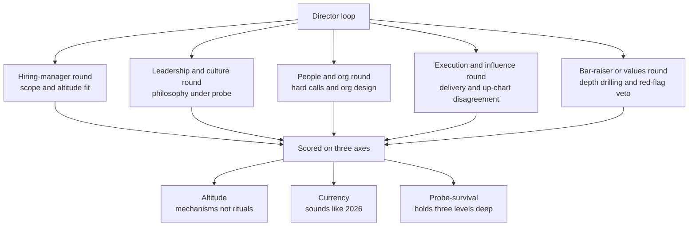

> **Why this track exists, and why it is not "soft":** You can run RESHADED flawlessly and still fail the loop in the behavioral rounds. At Director and Senior Director, the leadership interview is *not* a vibe check, it is a graded technical assessment of judgment, run by the same Principal/Staff engineers and senior leaders who scored your system design, probing **3-4 levels deep** to dismantle any rehearsed or AI-prepped surface answer. The two house rules from the system-design track carry over verbatim: **quantify everything**, and **every position names its limit and the alternative you rejected**. A philosophy answer with no numbers and no downside is the behavioral equivalent of "it scales horizontally." This lesson sets the altitude and exposes the trap most senior candidates walk into: **answers calibrated to the 2015 growth era that the post-2022 world now actively penalizes.**

### Learning objectives
- Distinguish what the **Director leadership round scores** (altitude, currency, probe-survival) from what an **EM loop** scores (individual coaching, sprint mechanics).
- Internalize the **six environmental shifts** since 2015 that silently re-grade every answer, and what each one rewards and penalizes *now*.
- Use the **track map** and a recommended path to sequence your prep.
- Carry **altitude consistency** from the RESHADED track into behavioral answers: quantify, name the trade-off, name the rejected alternative.

### Intuition first

Think of your story bank as code you wrote in 2015 and never recompiled. It still runs in your head, clean narrative, confident delivery. But the **grading compiler** was silently upgraded after the 2022 correction: ZIRP ended, founder-mode became a meme, AI ate the assistant layer, and "hire great people and get out of the way" went from wisdom to red flag. Run your old answers through the 2026 compiler and half of them now throw warnings you can't hear, *"empire-building,"* *"abdication,"* *"not operating at level."* The interviewer hears the warning; you hear applause. This track is the recompile pass. Same raw experience, re-graded against the world that exists now.

The good news: the *fix* is rarely a new story. It is a reframe, adding the output-per-dollar angle, the tripwire, the "what I told my team," the number you were missing. The work is calibration, not invention.

---

## What the Director leadership round actually scores

An **EM loop** scores you as a coach of individuals: do you give feedback, run a tight sprint, grow a junior, resolve a two-person conflict. The unit is the **person and the team**. A **Director loop** scores you as an owner of a *system of teams*: the unit is the **org, the operating cadence, and the durable mechanism**. "I coached him to a strong-performer rating" is a fine EM answer and a weak Director one, at Director the interviewer wants the **mechanism** ("I instrumented regretted-attrition and a 30/60/90 calibration so the *next* low performer surfaces in weeks, not a cycle later").

Three dimensions carry the score across every round:

- **Altitude**, Director *mechanisms* (org design, operating system, span math, decision logs), not EM *rituals* (standups, 1:1 cadence). Too low reads as *not yet at level*; too high (pure vision, no hands-on depth) reads as *can't actually run it*. This is the exact two-sided failure from the system-design track (§2 of the course): hand-waving versus rat-holing.
- **Currency**, does the answer sound like **2026** or like a re-run of a 2018 growth-era story? A "scaled 10→60" story told with no efficiency angle now codes as ZIRP empire-building (see the efficiency-era lesson). Currency is what this whole lesson arms.
- **Probe-survival**, every story must hold **three levels of depth** below the headline: numbers, the rejected alternative, the stakeholders, the timeline. 2026 loops are sustained Socratic drilling (Amazon bar-raiser style) engineered to find the floor of a rehearsed answer. If level three is empty, the story wasn't yours. The answer-shape mechanics for surviving this live in the frameworks lesson.

Note what each round is *really* testing, not its label. The hiring-manager round is leveling, does your scope match the title. The bar-raiser round exists to find the floor of your weakest story and carries **veto power** at companies like Amazon. The execution round is where business acumen is now scored *inside* the behavioral answer, not in a separate case round.

---

## The six environmental shifts that re-score every answer

These are the load-bearing change since 2015. Each one rewards a posture and penalizes its opposite. Memorize the **penalty**, because that is the warning the interviewer hears when your story is stale.

**1. Post-ZIRP efficiency.** Capital got expensive in 2022; **output-per-dollar replaced headcount growth** as the proxy for good leadership. Business acumen, cloud cost per transaction, payback period, unit economics, is now scored *inside* behavioral answers, not quarantined to a case round.
- *Rewards:* "I delivered the roadmap with a flat or shrinking team via platform leverage."
- *Penalizes:* "I scaled the org from 10 to 60" with no efficiency angle → reads as empire-building. **Headcount is now the expensive option you must justify, not the default plan.**

**2. Founder-mode (Sept 2024).** Paul Graham's essay made **pure delegation near-disqualifying** in front of founders. "Hire great people and get out of the way" now reads as absenteeism; but the overcorrection, "I'm founder-mode, I'm in the details", reads as a micromanagement confession.
- *Rewards:* **selective depth with standing mechanisms**, "I go deep on the two decisions that turn the architecture and the one underperforming team; everything else runs on a cadence I don't sit in."
- *Penalizes:* either pole. The whole binary is the trap.

**3. AI as topic *and* format disruptor.** AI is asked directly *and* woven into hiring, org-design, and metrics, and it is **changing the interview format itself** (Meta's AI-enabled CoderPad round, Shopify's BYO-AI interview). It has no 2015 ancestor, so both ditches are well-mapped.
- *Rewards:* the **accountable operator**, "I ran a rollout, here's the J-curve and the ROI I defend like a headcount ask."
- *Penalizes:* "we're still evaluating / I let each team decide" (abdication) **and** "AI made us 10× faster" with no methodology (the Klarna/Salesforce overclaim). Context interviewers carry: 85%+ of engineers use assistants, Pichai's "~75% of new Google code is AI-generated," yet ~51% of leaders believe GenAI is currently net-negative, so **honest J-curve talk scores; breathlessness doesn't.**

**4. RTO / hybrid norms.** Remote-execution literacy is assumed, and the answer is scored on **separating personal preference from organizational stewardship**. The known data point: Amazon's 5-day RTO polled **1.4/5** internally with **91% unhappy**, and regretted attrition concentrated among strong engineers, candidates are expected to know that trade-off math.
- *Rewards:* a written async operating system (RFCs, decision logs) and a **retention-risk plan for whatever policy the company sets**.
- *Penalizes:* workplace ideology in *either* direction; "management by walking around."

**5. Psychological-safety-plus-accountability (post-backlash).** Naming Project Aristotle alone is now table stakes and slightly suspect. The current bar is **Edmondson's definition paired explicitly with accountability**.
- *Rewards:* "Safety protects people who take interpersonal risks, it does **not** protect people *from* performance consequences."
- *Penalizes:* safety as a synonym for *nice*, with no accountability mechanism attached.

**6. Performance-management tightening.** The clock moved to **weeks, not quarters**. A real, well-run termination is now **table stakes** for Director (Meta's low-performer cuts, Microsoft's PIP-or-severance ultimatum, ~30% rise in formal performance procedures since 2020). And layoff experience moved from rare to near-assumed.
- *Rewards:* decisiveness-with-dignity, early dated feedback, a real process, the call made on time, *and* a raised compassion bar (cold "easy call" answers score worse than they used to).
- *Penalizes:* "I coach indefinitely; firing is a failure of my leadership" → now reads as **not operating at level**.

Go deeper, why "calibrate to 2026" is not the same as "chase the trend" (optional)

The risk in a recalibration lesson is teaching candidates to parrot whatever is current, which collapses on the first probe, because a borrowed opinion has no level-three depth. The defense: each shift above is anchored to a **named source and a number** (Graham's essay, the Amazon 1.4/5 poll, the ~30% rise in performance procedures, the McKinsey developer-productivity debate). You are not adopting a fashion; you are demonstrating that you operate in the world that produced those data points. When an interviewer pushes back, "isn't founder-mode just micromanagement?", you answer from the trade-off, not the slogan: "It's a correction against absentee delegation; the failure mode on the other side is exactly the micromanagement you're describing, which is why my version is *selective* depth with standing mechanisms." That sentence survives the probe; "I believe in founder-mode" does not.

---

## The track map and a recommended path

Twelve more lessons, in three layers. **Frameworks first, then your story portfolio, then the nine question categories, then calibration and a live capstone.**

| # | Lesson | What it gives you |
|---|---|---|
| 10.2 | **Answer frameworks & probe-resistance** | The four answer shapes (STARL, Clarify→Principles→Options→Decide→Tripwires, Position→Mechanism→Number→Limit, SCQA) and *when* each applies, and how to hold three levels deep without announcing the framework aloud. |
| 10.3 | **The story portfolio** | A 12-15 story bank in a coverage matrix; the mandatory slots interviewers check (an up-chart disagreement you *won*; one you *lost* and committed to; a termination you ran; a layoff you owned; a decision you got *wrong*; an incident you commanded). |
| 10.4 | Leadership philosophy & style | The calibrated "who are you as a leader" answers. |
| 10.5 | Hiring & the talent bar | Designing the hiring system, not just passing it; AI-era assessment. |
| 10.6 | Hard people calls | Low performers, PIPs, firing, brilliant jerks, flight risks. |
| 10.7 | Managing managers & org design | Manager pipelines, span math, succession, skip-levels. |
| 10.8 | Operating system, delegation & metrics | Cadence, DORA/SPACE/DX Core 4, async-first OS. |
| 10.9 | Execution under pressure | Failing projects, incidents, your own bad calls. |
| 10.10 | Influence & executive communication | Up-chart disagreement, disagree-and-commit, bad-news systems. |
| 10.11 | Efficiency-era leadership | Layoffs, budget cuts, RTO and other mandates you didn't choose. |
| 10.12 | AI-era engineering leadership | Rollout ROI, the junior pipeline, both sides of the hiring table. |
| 10.13 | Company calibration | The *same* story scored at Amazon vs Meta vs Google vs Netflix vs a founder-led startup. |
| 10.14 | **Demonstrate-don't-describe capstone** | Modern loops replace "tell me your philosophy" with live exercises (critique an OKR, read an org-health survey, deliver hard feedback in roleplay, present a first-90-days plan), plus a self-scoring rubric. |

**Recommended path.** Do the **frameworks and the story portfolio first, non-negotiable**, they are the RESHADED-spine analog; the nine category lessons are far weaker without an answer shape and a story bank behind them. Then take the category lessons **in your weakest-first order**, not sequentially, most senior candidates are strong on philosophy and execution and thin on the hard people calls and the efficiency/AI canon, which is exactly where the 2026 re-scoring bites hardest. Finish with company calibration to tune for your target company and the capstone to rehearse the live-exercise format under load. If you only have one evening: read this, the frameworks, the story portfolio, and the cheat sheet.

---

## Altitude consistency with the system-design track

The most under-appreciated fact in this whole module: **post-flattening, the same Principal/Staff interviewer often scores both your system-design and your leadership rounds**, and calibrates you *across* them. The two course laws are not a system-design quirk; they are how that interviewer reads *every* answer, and they transfer verbatim:

- **Always quantify.** A behavioral answer with no number is hand-waving. "I turned the team around" is the "it scales" of the leadership round. Bring the metric: *"regretted attrition dropped from ~18% to ~7% over two quarters,"* *"shipped 80% of committed scope after I cut the bottom 20%,"* *"MTTR fell from 45 min to under 10."*
- **Every position names its limit and the rejected alternative.** Just as no storage choice is presented without a critique, no leadership stance is presented without its downside and the path you didn't take. *"I chose to kill the project rather than push the date, the cost was three months of sunk work and a hard conversation with the VP who sponsored it; the alternative, a heroic crunch, would have shipped a fragile thing we'd pay for in on-call."*

If you nail RESHADED and then give a vague, number-free, no-trade-off behavioral answer, you read as *inconsistent*, strong on the whiteboard, soft on judgment, and that inconsistency is itself a flag. The bar is one bar. (See the system-design rubric these axes mirror, and the org-and-cost reasoning that shows up on both sides of the loop.)

---

### Key takeaways
- The Director leadership round is a **graded judgment assessment**, not a vibe check, scored on **altitude** (mechanisms, not rituals), **currency** (sounds like 2026), and **probe-survival** (holds three levels deep). It is run by the same senior engineers who scored your system design.
- **Six shifts since 2015 silently re-grade every answer:** post-ZIRP efficiency, founder-mode killing pure delegation, AI as topic *and* format, RTO/hybrid stewardship, psych-safety-*plus*-accountability, and performance-management tightening to weeks-not-quarters. Memorize each shift's **penalty**.
- The fix for a stale story is usually a **reframe, not a new story**, add the efficiency angle, the tripwire, the "what I told my team," the missing number.
- **Do the frameworks and the story portfolio first**, then take category lessons weakest-first; finish with company calibration and the live-exercise capstone.
- The **two course laws are one bar across both tracks**: quantify everything, and name the limit and the rejected alternative. The same interviewer calibrates your whiteboard and your behavioral answers against the same standard.

> **Spaced-repetition recap:** The leadership loop scores **altitude · currency · probe-survival**, probed 3-4 levels deep. **Six shifts re-grade every answer**, efficiency over headcount, founder-mode over pure delegation, AI-as-operator, RTO-as-stewardship, safety-*with*-accountability, weeks-not-quarters performance management. A stale 2015 growth-era story throws warnings only the interviewer hears. Carry both course laws in: **quantify, and name the trade-off and the alternative rejected.** The frameworks and the story portfolio are the spine, build them first.

---

*End of Lesson 15.1. The leadership track recompiles your experience against the world that exists now: same raw stories, re-graded by a tougher, more current rubric. Next: the four answer shapes and probe-resistance, the behavioral analog of the RESHADED spine.*
