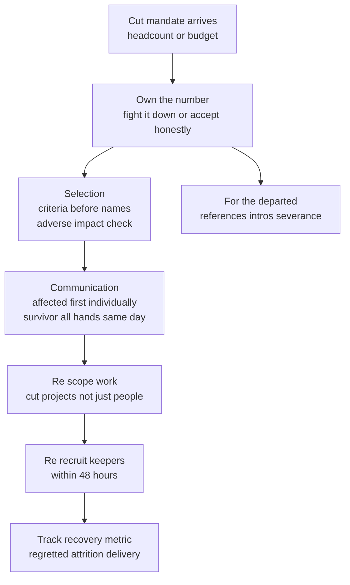

> This cluster barely existed in Director loops before 2020 and is now close to assumed experience: running a RIF end to end, absorbing a budget or headcount cut, executing a mandate you didn't choose. What interviewers score is **ownership of decisions made above you**, "finance gave me a list and I executed it" is the signature fail, because it tells them you'll distance yourself from your own org the moment it's uncomfortable. The second thing they score is the *survivor-rebuild* half, where most candidates have nothing and strong ones lead, because a layoff is judged not by the day itself but by how the remaining 90% perform and whether your best people stay. And the sharpest 2025-26 probe lives here too: "how did you *know* the org could absorb the cut?", the question that catches an AI-justified layoff that was really just a number from above.

### Learning objectives
- Run the efficiency-era story as **own-it-end-to-end STAR-L** with three pull-able sub-stories, **selection** (criteria before names), **communication** (with dignity), **rebuild** (the survivor half), owning every decision downward even when it was made above you.
- Build **selection** on criteria-before-names: role and skill criticality against the *future* org shape, an adverse-impact sanity check, and honest ownership of the number, not gut, likeability, or last-in-first-out.
- Land **communication with dignity**: affected people first and individually, a same-day survivor all-hands with the honest why and what's *not* changing, and "this is the only planned round" only if it's true.
- Lead the **rebuild**: re-scope the work to the smaller team (cut projects, not just people), re-recruit keepers inside 48 hours, and track a named recovery metric, the half that separates a Director from an executor.
- Answer the **RTO / unpopular-mandate** variant as **disagree-and-commit-with-mitigation**, and **budget cuts** as a prioritization call with a ranked stop-doing list, not peanut-butter.

### Intuition first
A field surgeon doing triage after a disaster has a job that doesn't end when the cutting does. The amateur focuses entirely on the casualties, who gets treated, who doesn't. But that's only the first third. What decides whether the unit survives is what happens *next*: whether the people still standing know why the calls were made, trust the bleeding has stopped, and can still function as a unit instead of scattering. A surgeon who saves the right patients but leaves the survivors panicked, overloaded, and certain they're next has failed even if every individual call was correct. That's the efficiency-era cluster exactly. Selection is the visible part everyone braces for. Communication decides whether people leave with their dignity intact or with a badge that stopped working mid-sentence. But the *rebuild*, re-scoping the work so survivors aren't carrying 130% load, re-recruiting your keepers before they update their LinkedIn, holding the org through a quarter of grief, is what interviewers are actually scoring, because it's the part only a leader can do and the part most candidates skip. They want to see you treated the layoff as a system to be led through, not a list to be executed.

---

## The questions

These are mostly past-event questions (STAR-L), with the mandate and budget variants leaning toward how-you'd-operate hypotheticals (Clarify → Principles → Options → Decide).

| Variant | What it's really testing |
|---|---|
| "Have you run a layoff? How did you decide who? Walk me through the day." | Ownership of the call, criteria-before-names selection, basic legal literacy without hiding behind process. |
| "How did you communicate it, to the affected, and to the survivors?" | Dignity in delivery; the survivor all-hands; no badge-deactivation, no mass email. |
| "How did you rebuild morale and delivery? What was regretted attrition the next two quarters?" | The survivor half, the differentiator; a named recovery metric, not a vibe. |
| "Tell me about absorbing a budget / headcount cut, what did you *stop* doing?" | A prioritization call with a ranked stop-doing list, not peanut-butter across everything. |
| "An RTO (or other unpopular) mandate comes down that you disagree with." | Separating personal preference from org stewardship, disagree-and-commit-with-mitigation. |
| "How did you *know* the org could absorb the cut?" | The 2025-26 trap, whether the number was reasoned or just handed down and rationalized with AI. |
| "Were you laid off / why is this tenure short?" | The mirror question, destigmatized, but bitterness or evasiveness still fails. |

The merge: the layoff, budget-cut, and "were you laid off" variants are **past-event**, STAR-L on the spine below. The RTO/mandate variant is usually a **hypothetical**, answer it as **disagree-and-commit-with-mitigation**. Either way, the through-line is the same: did you *own it*, all the way down to the survivors.

---

## The framework

One spine, three pull-able sub-stories. A full layoff answer walks all three; a narrower question pulls the relevant one. The whole thing defends a single posture, *I owned this, not the people above me*, under probe.

- **Selection, criteria before names.** Define the future org shape first, then derive criteria: role and skill criticality, coverage you can't lose, documented performance. Names come *out of* the criteria, never the reverse. Run an **adverse-impact sanity check** with HR/legal so the cut doesn't disproportionately land on a protected group. And own the number, fought down with a model or accepted honestly, but never "they gave me a list."
- **Communication, with dignity.** Affected people first, individually, by their own manager or by you, *before* any org-wide message, never a mass email or a dead badge. Then a **same-day survivor all-hands**: the honest *why*, what is explicitly *not* changing, and "this is the only planned round" *only if it's true*, say nothing rather than lie, because the survivors will remember which one you did.
- **Rebuild, the survivor half.** Re-scope the work to the smaller team: **cut projects, not just people**, survivors carrying 130% load is a failure signal, not heroism. Re-recruit keepers with explicit "you have a future here" conversations inside 48 hours, before they self-select out. Over-communicate for a quarter. And track a **named recovery metric**, regretted attrition among keepers, delivery recovery, so "it went fine" has a number behind it. The compassion marker for the *departed* lives here too: references, intro calls, severance advocacy.

For the **RTO / unpopular mandate**: **disagree-and-commit-with-mitigation**, advocate upward with data (quit-intent and attrition math), then implement *humanely* with regretted attrition as a tracked KPI, separating personal preference from your duty as a steward. For **budget cuts**: an ROI structure, no-headcount alternatives first, then a **ranked list of what won't happen** with the requester's explicit sign-off. Never peanut-butter until nothing works.

Never announce the spine aloud, and never let the answer stop at selection, an interviewer who hears about *who* and not about the survivors has heard half a leader.

Go deeper, jurisdiction sidebars: US, India, UAE (IC depth, optional)

The body keeps legal content neutral on purpose, criteria, consistency, documentation, dignity travel across borders, and a Director shows literacy without hiding behind process or pretending to be counsel. The specifics differ sharply by jurisdiction, and a Sr Director operating across geographies should know the shape of each and partner with local employment counsel for the detail.

**United States, WARN and at-will.** Default employment is *at-will* (either side can end it without cause), so there's no statutory notice for an individual termination, but mass layoffs are governed by the federal **WARN Act**: employers of 100+ generally owe **60 days' advance notice** for a plant closing or "mass layoff" (roughly 50+ losing their jobs at a single site, with thresholds), and several states (California, New York, New Jersey) have stricter *mini-WARN* rules, California's threshold is lower and its notice is also 60 days. Severance is contractual or policy-driven, not legally required; releases over age 40 invoke **OWBPA/ADEA** disclosure rules. The live risk is **disparate impact**, an adverse-impact analysis on the selection list is the standard defensive step.

**India: notice and severance are statutory.** Not at-will. For "workmen" under the **Industrial Disputes Act**, retrenchment generally requires **one month's notice (or pay in lieu)** and **retrenchment compensation of 15 days' average pay per completed year of service**, plus *last-in-first-out* within a category absent a documented reason otherwise, and larger establishments (100+, or 300+ in states that raised it) may need **government permission** to retrench. Non-workmen (most managers/engineers) fall under their contract and the relevant Shops & Establishments Act, where **30-90 day notice periods** are the norm. **Gratuity** (Payment of Gratuity Act) is owed at ~15 days' wages per year after 5 years' service.

**UAE: Labour Law and end-of-service.** Governed by **Federal Decree-Law No. 33 of 2021**. Termination requires a **written notice period of 30-90 days**, and redundancy must rest on a *legitimate economic reason*, arbitrary dismissal exposes the employer to compensation of up to ~3 months' wages. The signature obligation is **end-of-service gratuity**: for unlimited/standard contracts, roughly **21 days' basic wage per year for the first 5 years and 30 days' per year thereafter**, capped at two years' total pay. Expat workforce means **visa and residency timelines** are part of the humane plan, a grace period to remain in-country and transfer sponsorship matters as much as severance does in the US.

The Director move across all three: own the criteria and the dignity yourself, and partner with local counsel for the statutory mechanics, never wing the legal detail, never hide behind it.

---

## 2015 vs 2026: the calibration

No cluster has shifted harder in a decade, it went from a rare, almost-untellable story to near-assumed experience, and the scoring moved with it. Six shifts separate a current answer from a stale one.

- **Layoff experience moved from rare to near-assumed.** A decade ago "I've never had to do a layoff" was a fortunate answer. In 2026 it's forgivable *only* with a credible "here's exactly how I'd run it" framework, no point of view now reads as having operated only in the easy years.
- **The survivor half became the differentiator.** The 2015 answer often stopped at the day-of. The current bar is explicit: *a layoff is judged by how the remaining 90% perform and whether your best people stay.* Re-scoping the work, re-recruiting keepers, and a named recovery metric are where most of the score now lives, and where most candidates have nothing.
- **"How did people find out?" is a deliberate trap.** The public failures, the Better.com Zoom mass-firing, the badge-deactivation-before-the-meeting stories, made *delivery mechanics* scored. Mass email, a deactivated badge, or a calendar invite with no human on it is an instant fail.
- **"How did you know the org could absorb it?" is the sharp 2025-26 follow-up.** With AI-justified cuts and quiet re-hiring in the headlines, interviewers probe whether the number was *reasoned*, a revenue-per-team model, or rationalized after the fact. "We assumed AI would cover it" with no measurement is the new fail; a real absorption model (what work stops, what tooling closes the gap) scores.
- **The growth-era story inverted.** "I scaled the org from 10 to 60" told with *no* efficiency angle now codes as ZIRP empire-building. **Output-per-dollar is the new strong story**, business-metric fluency (cost per transaction, payback periods, revenue per engineer) expected *inside* the answer, because Directors own budgets now.
- **RTO is scored on stewardship, not ideology.** The expected answer separates personal preference from stewardship, with the **Amazon 5-day RTO data as known context**, an internal satisfaction score around **1.4 out of 5** with ~91% unhappy, attrition concentrated among *strong* engineers. Tribal certainty in either direction fails; the math and the mitigation plan score.

---

## Model answers

### Answer 1: "Have you run a layoff? Walk me through it." (own-it-end-to-end STAR-L)

> *(Situation/Task)* "I had to cut **12% of a 90-person org**, about eleven people, when a product line we'd bet on didn't convert and next year's budget came back materially smaller. *(Action, own the number)* The first number floated was 18%. I built a revenue-per-team model, which teams were tied to revenue we were keeping versus the failed bet, and argued the cut down to 12% by showing the deeper number would have gutted coverage we'd need in two quarters. I won that, and then I owned the 12% completely, I never once told my team 'finance made me.' *(Action, selection)* Selection was **criteria before names**: I defined the post-cut roadmap first, then derived the criteria, role criticality against it, skill coverage we couldn't lose, documented performance, and names fell out of the criteria, not the reverse. Then an **adverse-impact review with HR and legal** flagged one pattern concentrating on a single team, which we corrected before finalizing. *(Action, communication)* I delivered **five of the eleven conversations myself**, my managers the other six, every one 1:1 and *before* any org-wide message, nobody learned they were laid off from a dead badge or a group email. Same day, a survivor all-hands: the honest why, what was explicitly *not* changing, and that no further round was planned. That last part was true; if it hadn't been, I'd have said nothing rather than lie, because the survivors remember which one you did. *(Action, rebuild)* Then the part that determines whether a layoff works: I **cut three projects, not just people**, so survivors weren't suddenly carrying 130%, I killed the deprioritized roadmap, not just the headcount on it. I had explicit 'you have a future here' conversations with my **eight keepers within 48 hours**, before they self-selected out. For the departed, I made **fourteen intro calls** and fought for severance above policy. *(Result)* Two quarters later: **zero regretted attrition among the keepers**, delivery recovered by **week six**. *(Learning)* The honest cost: two of my best people told me they'd never fully trust the company again, and they were right to say it. Managing well *inside* that truth, instead of pretending it came back on schedule, was the actual job. Structurally, I now keep a living 'if we had to cut 10%' criteria sketch updated quarterly, so a future cut is reasoned from a model I already trust, not assembled under panic."

**Why it scores:**
- **It owns the number twice**, fought 18% down to 12% with a model, *and* refused to distance ("I never told my team finance made me"), the single posture this cluster is built to test, hit head-on.
- **Selection is criteria-before-names with an adverse-impact check**, the legally literate, non-gut answer, and every beat carries a number (12%, 5 of 11 delivered personally, 8 keepers, 48 hours, week six), probe-resistant three levels down (the house rule honored in a behavioral answer).
- **Communication dodges every public trap**, individual, by a human, before any broadcast, no dead badge, and "say nothing rather than lie" proves the candidate thought about the survivor's memory, not just the day.
- **The rebuild is the load-bearing half**, cut *projects* not just people (130%-load failure signal avoided), keepers re-recruited in 48 hours, a real recovery metric (zero regretted attrition, week-six delivery), exactly where weaker candidates have nothing.
- **The Learning holds the human cost without flinching or performing**, two people who'll never fully trust the company, owned as true, plus an upstream mechanism: the decisive-and-humane synthesis applied to layoffs.

### Answer 2: "An RTO mandate comes down that you disagree with. What do you do?" (disagree-and-commit-with-mitigation)

> *(Situation/Task)* "This happened, a **5-day-in-office mandate** came down company-wide, and my org had hired heavily remote over the prior two years on an explicit remote-friendly promise. *(Action, preference vs stewardship)* My first move was to separate my *personal* take from my *job*: my preference is hybrid, but I'm not paid to optimize that, I'm paid to steward the org through whatever policy the company sets, and to surface the real cost if there is one. *(Action, advocate with data)* So I advocated upward with data, not opinion: I modeled quit-intent against our actual geography, roughly a third of my strongest engineers were more than a commute from any office, and showed the regretted-attrition risk was concentrated among exactly the people we could least afford to lose, the pattern the public Amazon data shows too (internal satisfaction around 1.4 out of 5, attrition skewed toward strong engineers). I asked for two mitigations: a geography-based exception path and a phased timeline. *(Action, commit with mitigation)* I won the phased timeline and a narrow exception path; I lost the broader hybrid argument. Then I committed *for real*, I presented the policy to my org **in my own voice**, with the actual business reasoning, not 'leadership decided, don't shoot the messenger,' which is commit theater the team sees through instantly. *(Result / mitigation)* Operationally, I treated regretted attrition as a tracked KPI for two quarters and negotiated a tripwire with my VP: if it exceeded a threshold among our top-rated engineers, we'd revisit the exception scope. *(Learning)* It cost us two strong people who left rather than relocate, within the range I'd forecast, which is partly why the tripwire and exception path got approved. The lesson: on a mandate you don't control, your leverage is the *mitigation* and the *honesty of the framing*, not the veto, 'I protected my team from the policy' would have been both insubordinate and a lie."

**Why it scores:**
- **It separates personal preference from organizational stewardship explicitly**, the exact dimension this question tests, instead of arguing workplace ideology in either direction.
- **It advocates with data, not opinion**, quit-intent modeled against real geography, the Amazon 1.4/5 figure cited as known context, landing the 2026 calibration that RTO answers carry the trade-off math.
- **"In my own voice, not leadership decided" nails the commit-not-obedience line**, the near-universal "what did you tell your team?" follow-up answered before it's asked, commit-theater named and rejected.
- **The tripwire and tracked-KPI mitigation** turn disagree-and-commit into disagree-and-commit-*with-mitigation*, the senior move, and the forecasted, owned cost proves the model was real. It refuses the hero framing ("I protected my team from the policy") as both insubordinate and dishonest.

---

### What interviewers probe here

- **"Who made the call, you or finance?"**, *Strong:* you owned it; you fought the number down with a model or accepted it honestly, and never distanced from it to your team. *Red flag:* "they gave me a list," "finance decided", the signature fail, because it predicts you'll abandon your org whenever it's uncomfortable.
- **"How did people find out?"**, *Strong:* affected people individually, by a human, *before* any broadcast; survivor all-hands same day with the honest why. *Red flag:* mass email, a deactivated badge, a calendar invite with no person on it, the deliberate trap, an instant fail.
- **"What did regretted attrition look like the next two quarters?"**, *Strong:* a real number, because you re-recruited keepers in 48 hours and cut projects not just people. *Red flag:* no survivor story, or "I assume it was fine", half a leader.
- **"How did you know the org could absorb the cut?"**, *Strong:* a reasoned absorption model, what work stops, what tooling closes the gap, not an AI hand-wave. *Red flag:* "we figured AI would cover it" with no measurement; the 2025-26 trap that catches a number rationalized after the fact.
- **"You absorbed a budget cut, what did you *stop* doing?"**, *Strong:* a named, ranked stop-doing list with the requester's sign-off on what gets dropped. *Red flag:* "we tightened everywhere", peanut-buttering until nothing works is an abdication of the prioritization call.

---

### Common mistakes

- **Distancing language.** "Finance gave me a list," "leadership decided, I just executed." The whole cluster exists to catch this. Own the number, fight it down or accept it honestly, never hand the blame upward to your own team.
- **Stopping at selection.** A story about *who* with nothing about the survivors is half an answer. The rebuild, re-scoping work, re-recruiting keepers, a recovery metric, is where most of the score lives, and where weak candidates go silent.
- **Survivors at 130% load.** Cutting people without cutting projects is a failure signal, not toughness, it triggers the *second* wave of attrition you didn't plan. Cut the deprioritized roadmap, not just the headcount on it.
- **Peanut-buttering a budget cut.** Spreading the cut thinly until everything degrades dodges the prioritization call. The Director move is a ranked stop-doing list with explicit sign-off on what dies.
- **Emotional flatness or performative anguish.** Zero acknowledged human cost reads as cold; theatrical grief with no plan reads as hollow. The bar is both, a real plan *and* honest acknowledgment that some trust doesn't come back. On RTO, pure ideology ("leadership said so," or "office attendance proves commitment") fails, stewardship plus the trade-off math is the answer.

---

### Practice prompts

1. **Walk the full layoff on the spine.** "You had to cut 15%, take me through it." *(Sketch: own-it-end-to-end STAR-L, own the number first (fought down or accepted, never 'they gave me a list'); criteria-before-names selection with an adverse-impact check; individual-and-before-broadcast communication plus the same-day survivor all-hands; rebuild by cutting projects not just people, re-recruiting keepers in 48 hours, a named recovery metric. Hold every number for the probe.)*
2. **Defend the absorption model.** "How did you *know* the org could deliver after losing those people?" *(Sketch: a reasoned model, not a vibe, what work stopped, what tooling closed the gap, the recovery metric you tracked. If AI is part of the story, instrument it, don't hand-wave it, bridges to AI-era leadership.)*
3. **Make a budget cut a prioritization call.** "Your budget is down 20%, what do you stop doing?" *(Sketch: ROI structure, no-headcount alternatives first, then a ranked stop-doing list with the requester's explicit sign-off on what dies. Output-per-dollar framing. Never peanut-butter; cost cuts in system terms.)*
4. **Hold an RTO mandate you disagree with.** "Five days in office, company-wide, go." *(Sketch: disagree-and-commit-with-mitigation, separate preference from stewardship; advocate with quit-intent and geography data (Amazon 1.4/5 as context); commit in your own voice; mitigate with a tracked regretted-attrition KPI and a tripwire.)*

---

### Key takeaways
- **Own the number, never distance.** Fight the cut down with a model or accept it honestly, but never tell your team "finance gave me a list." Distancing is the signature fail, it predicts you'll abandon your org under pressure.
- **Selection is criteria before names.** Define the future org shape, derive criteria (role/skill criticality, coverage, documented performance), then names fall out, plus an adverse-impact sanity check. Never gut, likeability, or last-in-first-out.
- **Communication with dignity, no public traps.** Affected people individually and by a human *before* any broadcast, never a mass email or a dead badge, then a same-day survivor all-hands with the honest why and "only planned round" *only if true*.
- **The rebuild is the differentiator.** Cut projects not just people (130% survivor load is a failure signal), re-recruit keepers in 48 hours, track a named recovery metric. A layoff is judged by how the remaining 90% perform.
- **RTO and budget cuts are stewardship, not ideology.** RTO = disagree-and-commit-with-mitigation (advocate with data, commit in your own voice, mitigate with a tracked KPI). Budget = a ranked stop-doing list with sign-off, never peanut-butter. "How did you know the org could absorb it?" demands a reasoned model, not an AI hand-wave.

> **Spaced-repetition recap:** Efficiency-era leadership is scored on **ownership of decisions made above you**, "finance gave me a list" is the signature fail. Answer as **own-it-end-to-end STAR-L** with three sub-stories: **selection** (criteria before names + adverse-impact check), **communication** (affected first and individually, survivor all-hands same day, no dead badge), **rebuild** (cut projects not just people, re-recruit keepers in 48 hours, a named recovery metric, the differentiator). **RTO** = disagree-and-commit-with-mitigation, preference separated from stewardship, with the Amazon 1.4/5 data and a tracked attrition KPI. **Budget** = a ranked stop-doing list, never peanut-butter. **2026 bar:** layoff experience near-assumed, the survivor half differentiates, "how did you know the org could absorb it?" demands a reasoned model not an AI hand-wave. Keep legal content neutral and partner with local counsel for the statutory detail.

---

*End of Lesson 15.11. Efficiency-era leadership is the own-it-end-to-end cluster; "how did you know the org could absorb the cut?" hands directly to AI-era leadership, where the absorption model has to survive "did delivery actually improve?" and conviction-with-instrumentation replaces the hand-wave.*
