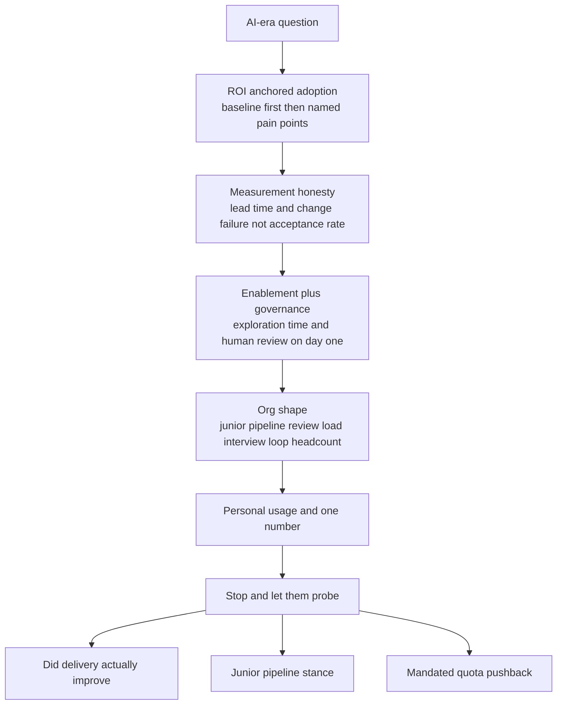

> This is the only Director question with no 2015 ancestor, and by 2026 it's near-universal, asked directly and woven through hiring, org-design, and metrics rounds. The interviewer is not asking whether you've *heard of* Copilot. They're testing whether you've **already run an AI rollout and can defend its ROI with the same rigor as a headcount ask**, because that's the bar now, with 85%+ of engineers using assistants and boards pressing for the productivity dividend. Two failure ditches are well-mapped and both are fatal: *mandate-theater hype* ("AI made us 10x faster," no methodology, the Klarna/Salesforce overclaim pattern) reads as credulous; *dismissive wait-and-see* ("we're still evaluating," "I let each team decide") reads as asleep at the wheel. The expected posture between them is the **accountable operator**: conviction backed by instrumentation, an honest J-curve, a real position on the junior pipeline, and your own hands-on usage, because a Director who doesn't use the tools can't credibly govern them.

### Learning objectives
- Answer in the **measured-operator shape**: ROI-anchored adoption → measurement honesty → enablement-plus-governance → org-shape implications → personal usage with one concrete number, describing a rollout you ran, not a trend you've read about.
- Refuse the **vanity metrics** (lines of code, commits, Copilot acceptance rate) and name what actually moves: lead time, change-failure rate, downstream review/defect load, DevEx surveys, measured against a *baseline you took first*.
- Hold the **honest-dividend position**: cite the contested data (≈60% of leaders report no significant boost; 51% believe GenAI is net-negative for the industry) and the **2025 DORA finding that AI amplifies whatever system it lands in**, so the prerequisite investment is the engineering system itself.
- State a defensible **junior-pipeline and org-shape** position, you still hire and grow juniors, onboarding rebuilt around *directing and verifying* AI output, with a view on seniority mix, review load, and the interview loop.
- Avoid **both failure ditches** (mandate-theater hype, dismissive wait-and-see) and govern credibly: security/IP guardrails, human review on AI-generated code, structured exploration time, and your own daily usage as the credibility floor.

### Intuition first
Treat AI tooling the way you'd treat any **platform investment**, not the way a pundit treats a hype cycle. When a platform team proposes a new CI system, no serious Director accepts "it'll make us faster", you ask: *what pain are we solving, what's the baseline, what number will move, and what do we kill if it doesn't?* AI is the same investment, governed the same way. The credulous leader skips the baseline, mandates the tool, and quotes the vendor's "10x" slide. The asleep leader never runs the experiment and says "we're evaluating." The operator does what they'd do with any infra bet: **baseline DevEx first, anchor adoption to named pain points, instrument the outcomes, defend the ROI in a board meeting.** And here's the twist the 2025 DORA research made concrete, AI is a *force multiplier on your existing engineering system*, not an independent gain: drop it on a strong platform team and it amplifies their throughput; drop it on a chaotic one and it amplifies the chaos faster. So the real question isn't "do you use AI", it's "did you have a system worth amplifying, and can you prove what the amplification bought."

---

## The questions

These look like eight separate questions; they're one rollout, probed from different angles.

| Variant | What it's really testing |
|---|---|
| "How are your teams using AI, and did it actually make you faster? How do you measure it?" | Whether you have a *baseline and real outcome metrics*, or a vibe and a vendor stat. |
| "Walk me through your AI tooling rollout, adoption, guardrails, where the time went." | Whether you ran it as a governed platform investment or a top-down mandate. |
| "What's your AI governance policy, review of AI-generated code, security, IP?" | Whether guardrails existed on day one, or not at all. |
| "How do you keep juniors growing when AI writes the first draft? What's it doing to your seniority mix?" | A defensible pipeline stance, not "we just hire seniors now." |
| "Where does AI change your headcount math, what's worth building at all?" | Whether you connect AI leverage to the build/buy/hire decision. |
| "How did AI change your interview loop?" | Bridge to hiring, assess *direct-and-verify*, not *write code*. |
| "How do you use AI yourself, day to day?" | The credibility floor, a leader who governs tools they don't use is a tell. |
| "An exec mandates AI-usage quotas, what do you do?" | Whether you push back on quota-as-metric and reframe to outcomes. |

The merge: every variant is the **same rollout** from a different face. The strong answer threads one instrumented investment, *adoption → measurement → governance → org shape → personal usage*, through all of them rather than treating them as eight opinions.

---

## The framework

The answer shape is the **measured-operator structure**: four parts, then evidence. It mirrors how you'd defend any platform spend, which is exactly the altitude the question wants.

- **ROI-anchored adoption.** Anchor the investment to **named pain points**, test generation, a specific migration, internal support docs, onboarding, not tool sprawl or a blanket license. Treat it like any platform bet: **baseline DevEx and DORA keys first**, target the pain, instrument the result, kill what doesn't move numbers. Adoption that follows real pain doesn't need a quota.
- **Measurement honesty.** Refuse the vanity metrics, acceptance rate, lines of code, commits, *and say why*: coding is only ~20-25% of an engineer's week, source code is a liability rather than output, and AI distorts *self-reported* speed. Measure what ships: **lead time, change-failure rate, downstream review/defect load, DevEx surveys.** Cite the contested dividend honestly and name the **2025 DORA amplifier finding**.
- **Enablement + governance.** The two halves no serious rollout separates: enablement (skill ground-truthing, safe-to-experiment norms, *structured* exploration time) and governance (human review on AI-generated code, security/IP policy, no customer data in prompts), on day one, not bolted on after the first incident.
- **Org-shape implications.** A **junior-pipeline plan** (onboarding rebuilt around direct-and-verify), **review-load management** (AI shifts work from authoring to reviewing), **interview-loop redesign**, and **headcount math**, AI leverage as the cheaper alternative to a req.
- **Evidence: personal usage + one number.** Close with how *you* use it daily and one concrete result, the credibility floor; without it the whole answer reads as secondhand.

---

## 2015 vs 2026: the calibration

This question had **no 2015 equivalent**, there was no assistant to govern, no dividend to defend, no junior-pipeline threat to answer for. Everything here is new since 2023 and hardened into a required position by 2026. Four shifts define the current calibration.

- **The default assumption flipped from "evaluating" to "you've already run it."** In 2023 "we're piloting Copilot with a few teams" was fine. In 2026 it reads as abdication, 85%+ of engineers already use assistants, so "we're still evaluating" means *you've lost a year of leverage your competitors banked*. The interviewer assumes you ran a rollout and probes the ROI you got, exactly as they'd probe a headcount you spent.
- **Honest J-curve talk scores; breathlessness fails.** The board's numbers cut against the hype: ≈60% of leaders report **no significant productivity boost**, and **51% believe GenAI is net-negative** for the industry. Set against Pichai's "75% of new Google code is AI-generated," the field is genuinely contested. So an honest "lead time dropped 22% in the migration-heavy teams and was *flat* everywhere else" beats "10x faster" every time, the overclaim (Klarna walking back AI-only support, Salesforce's productivity slides) is now a credulity tell, not a strength.
- **The 2025 DORA finding reset the mental model.** AI is an **amplifier, not an independent gain**: it magnifies whatever engineering system it lands on. A strong platform team gets faster; a team with no tests, no CI discipline, and a tangled codebase gets *worse* faster. So the prerequisite to a dividend is the **engineering system itself**, which is why "we bought licenses" is not a strategy and "we invested in the platform, then AI amplified it" is.
- **A position on the junior pipeline and on assessment is mandatory, both sides of the hiring table.** When AI writes the first draft, the easy answer ("we hire fewer juniors now") is a trap: a senior-only org has no bench in three years and no one who grew up in *your* systems. The expected stance is that you still hire and grow juniors, with onboarding and the interview loop **rebuilt around directing and verifying** AI output.

---

## Model answers

### Answer 1: "How are your teams using AI, did it make you faster, and how do you measure it?" (measured-operator, ~100s, then stop)

> *(ROI-anchored adoption)* "I ran it as a platform investment, not a mandate. We **baselined first**, a DevEx survey plus our DORA keys, then targeted three *named* pain points instead of a blanket license: test generation, a Python 2→3 migration we'd been deferring, and internal support docs. Because the targets were real pain, **adoption hit about 80% in a quarter with no quota**, people reach for a tool that removes work they hate. *(Measurement honesty)* Measurement is where most of these claims fall apart, so we refused acceptance-rate and lines-of-code from the start, coding is maybe a quarter of an engineer's week, and source code is a liability, not output. What we tracked was delivery: **lead time came down 22% in the migration-heavy teams and was flat everywhere else**, that's the honest answer, not a blanket 10x. **Change-failure rate actually went *up* three points in month two**, which told us our review practices hadn't caught up to AI-authored diffs, so we added a human-review gate and an 'AI-authored' label, and it came back down. *(Governance)* Guardrails were day one: security and IP policy, no customer data in prompts, exploration time *structured* into the sprint rather than stolen from it. *(Org shape)* On org shape, we kept hiring juniors but rebuilt onboarding around directing-and-verifying AI output, and the interview loop now has candidates use the tools live while we score what they *catch*. *(Evidence)* I use it daily myself, most recently to draft the migration runbooks. *(Net position)* Net: conviction with instrumentation. The 2025 DORA finding matches exactly what I saw, AI amplified our strongest platform teams and amplified chaos in the messy ones, so the real prerequisite was the engineering system, not the license."

**Why it scores:**
- Opens with **"platform investment, not a mandate" and a baseline taken first**, the phrase that separates the operator from both ditches and makes every later number defensible.
- The measurement section is **honest to the point of self-incrimination**: 22% *in some teams, flat elsewhere*, and change-failure rate going *up* before the fix. Volunteering a regression is the strongest signal the metrics are real, not curated.
- **Explicitly rejects acceptance rate and LOC and says why** (coding is ~a quarter of the week; source is a liability), naming the vanity metrics is the tell that you've actually instrumented a rollout.
- Governance and org-shape are *compressed*, day-one guardrails, juniors-plus-loop-redesign, so it covers the full structure without ballooning past 100 seconds.
- Lands on the **DORA amplifier finding as a thesis, plus daily personal usage**, conviction with instrumentation, the posture between hype and wait-and-see, and tees up the "did delivery *really* improve" probe instead of burning it.

### Answer 2: "An exec mandates AI-usage quotas across engineering. What do you do? And what's it doing to your juniors?"

> *(Reframe the quota)* "I'd push back on the *quota*, not the intent. A usage quota measures the wrong thing, it optimizes for prompts sent, not problems solved, and the predictable failure mode is engineers gaming acceptance rate while change-failure quietly climbs. So I'd take the exec's actual goal, which is ROI on the AI spend, and reframe it to **outcome metrics they can take to the board**: lead time, change-failure rate, and review load, baselined and tracked, the same way I'd defend any platform investment. I'd commit to *that* accountability, which is stronger than a quota, and I'd show the data within a quarter. The one thing I won't do is mandate usage with no quality gate, that's how you manufacture the Klarna-style overclaim and then walk it back. *(Junior pipeline)* On the juniors, I hire and grow them deliberately, and I can defend it. A senior-only org feels efficient for eighteen months and then has no bench: no one who grew up in our systems, no one to promote into the staff gaps. What AI changes is *how* I develop them, not *whether*. The old apprenticeship was 'write the boilerplate until you understand the system', AI writes the boilerplate now, so a junior's month-one job is to **drive AI on a scoped task and build the judgment to know when its output is wrong**, paired with a senior who reviews the *reasoning*, not the syntax. The trade-off I accept is that the payback is slower, call it three quarters to net-positive instead of two, and I justify it as bench investment, the same way I'd justify a platform bet. The review-load shift is the part most leaders miss: AI moves work from authoring to *reviewing*, so seniors become the bottleneck unless I budget for it explicitly."

**Why it scores:**
- **Separates the quota from the intent** and reframes to board-defensible outcome metrics, influence-without-authority applied to the AI hype: you don't refuse the exec, you give them a *better* instrument.
- Names the **exact failure mode of a quota**, gaming acceptance rate while change-failure climbs, and ties it to the Klarna overclaim pattern, showing you know the hype ditch by name.
- **"What I won't do is mandate usage with no quality gate"** proves the position holds under direct pressure from a senior, when it's costly, the mandate-theater ditch avoided out loud.
- The junior stance gives a **concrete payback number (three quarters vs two), defends it with the senior-only failure mode**, and reframes the question from *whether* to *how*, the 2026 calibration stated precisely.
- Surfaces the **review-load shift** (AI moves work from authoring to reviewing; seniors become the bottleneck), a second-order org-shape insight most answers miss, signaling you've operated this, not just adopted it.

---

## What interviewers probe here

- **"Forget adoption, did *delivery* actually improve? Prove it."**, *Strong:* a baseline taken first, then delivery metrics (lead time, change-failure, review load) with an *honest* mixed result, improvement in some teams, flat in others, a regression caught and fixed. *Red flag:* acceptance rate, LOC, commits, or a vendor stat, and no answer when pressed on whether anything *shipped* faster.
- **"What's your governance on AI-generated code?"**, *Strong:* human review gate, security/IP policy and no customer data in prompts on day one, an AI-authored label so reviewers calibrate, IP/license awareness on generated code. *Red flag:* "we trust our engineers" (no guardrails) *or* "we banned it" (testing a world that ended), both are ditches.
- **"AI writes the first draft, why hire juniors at all?"**, *Strong:* still hires them, defends a real % with the senior-only-org-has-no-bench failure mode, onboarding rebuilt around direct-and-verify, review-load budgeted. *Red flag:* "we just hire seniors now", no bench, no pipeline, no view on the seniority mix.
- **"An exec wants AI-usage quotas. React."**, *Strong:* pushes back on quota-as-metric, reframes to outcome accountability the exec can defend, refuses mandated usage with no quality gate. *Red flag:* implements the quota to look compliant, or refuses the exec outright with no alternative.
- **"How do *you* use AI day to day?"**, *Strong:* a specific recent example (runbooks, a design doc, log triage), unforced. *Red flag:* hand-waving, or "my engineers handle that", you can't credibly set policy on a tool you don't touch.

---

## Common mistakes

- **Vanity metrics as success.** Citing acceptance rate, lines of code, or commits is the cardinal tell, it measures activity, not delivery, and AI inflates exactly those numbers while distorting self-reported speed. Use lead time, change-failure, and review load against a baseline.
- **No baseline, so no defensible ROI.** Adopting first and measuring after means you can never prove the dividend. The discipline is *baseline → target → instrument → kill-what-doesn't-move*, skip the baseline and the claim is unfalsifiable.
- **Living in a ditch.** "AI made us 10x faster" (credulous, the Klarna/Salesforce overclaim) and "we're still evaluating / each team decides" (asleep at the wheel) are *both* fails. The scored posture is conviction with instrumentation, in between.
- **Governance missing or absolute.** No guardrails at all (security/IP/customer-data exposure) and an outright ban are equal-and-opposite failures. The answer is human review on AI-generated code plus a security/IP policy from day one, enablement *and* governance, never one without the other.
- **No personal usage, no junior plan.** A leader who doesn't use the tools can't credibly govern them; one with no junior-pipeline or seniority-mix stance has no view on what AI does to the org. Both are mandatory, not optional color.

---

## Practice prompts

1. **Deliver your AI rollout in 100 seconds, then stop.** Adoption → measurement → governance → org shape → personal usage. *(Sketch: platform investment not mandate; baseline first then 2-3 named pain points; refuse acceptance-rate/LOC and say why; an honest mixed result with a regression caught and fixed; day-one guardrails; juniors-plus-loop-redesign; one personal-usage number; close on the DORA amplifier thesis, then tee up the "did delivery really improve" probe.)*
2. **An exec mandates AI-usage quotas. Respond.** *(Sketch: push back on the quota not the intent; name the failure mode, gaming acceptance rate while change-failure climbs; reframe to outcome metrics the exec can take to the board; refuse mandated usage with no quality gate; commit to data within a quarter.)*
3. **State your junior-pipeline position and defend the number.** "AI writes entry-level code now, why hire juniors?" *(Sketch: still hire a real %; senior-only-org-has-no-bench failure mode; onboarding rebuilt around direct-and-verify; slower payback owned as bench investment; the review-load shift seniors absorb.)*
4. **Defend the dividend honestly to a skeptical board.** "60% of leaders say AI didn't boost productivity, did yours?" *(Sketch: cite the contested data and the DORA amplifier finding; give the mixed-but-real result with a baseline; argue the prerequisite was the engineering system; what you'd kill if the numbers didn't move.)*

---

### Key takeaways
- **Answer as an accountable operator, not a pundit:** the measured-operator shape is *ROI-anchored adoption → measurement honesty → enablement-plus-governance → org-shape → personal usage*. You're assumed to have already run a rollout and to defend its ROI like a headcount ask.
- **Refuse the vanity metrics and say why**, acceptance rate, LOC, and commits measure activity (coding is ~a quarter of the week; source is a liability, and AI distorts self-reported speed). Measure lead time, change-failure, review load against a **baseline taken first**, and an honest mixed result beats a 10x claim.
- **Both ditches are fatal:** mandate-theater hype (the Klarna/Salesforce overclaim) reads as credulous; dismissive wait-and-see reads as asleep at the wheel. The scored posture is **conviction with instrumentation** between them, with an honest J-curve.
- **The 2025 DORA finding is the thesis:** AI **amplifies whatever engineering system it lands on**, strong platforms get faster, chaos gets faster too. The prerequisite to a dividend is the engineering system itself; "we bought licenses" is not a strategy.
- **Org-shape positions are mandatory:** still hire and grow juniors (onboarding rebuilt around *direct-and-verify*, defended against the senior-only-no-bench failure mode), budget the review-load shift, redesign the interview loop, and use the tools yourself daily, because you can't govern what you don't touch.

> **Spaced-repetition recap:** AI-era leadership is the round with **no 2015 ancestor**, scored as whether you've **run a rollout and can defend its ROI like a headcount ask**. Shape: *ROI-anchored adoption (baseline first, named pain, no quota) → measurement honesty (lead time + change-failure, not acceptance rate/LOC; an honest mixed result) → enablement + governance (exploration time, human review on AI code, day one) → org shape (juniors rebuilt around direct-and-verify, review-load shift, loop redesign, headcount math) → personal usage + one number*. Avoid **both ditches**, hype (Klarna/Salesforce overclaim) and wait-and-see. Thesis: the **2025 DORA finding**, AI **amplifies** the system it lands on, so invest in the system first. On quotas: reject quota-as-metric, reframe to board-defensible outcomes.

---

*End of Lesson 15.12. AI-era leadership is the efficiency era's most concrete lever, the same accountable-operator discipline from the efficiency era (defend every spend, leverage before bodies), now pointed at the tool that boards most want a dividend from. Next: company calibration tunes every position in this track to the specific company you're interviewing, Amazon's Leadership Principles, Meta's talent-density bar, Google's org-design round, the startup's founder-mode reality, so the same answer lands at the right altitude in the room you're actually in.*
