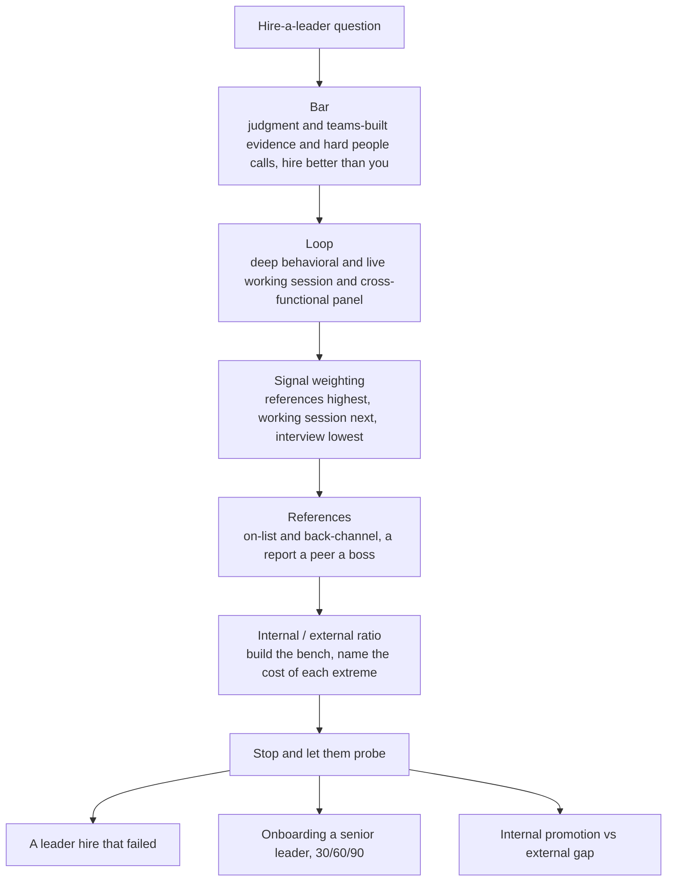

> Most Director loops probe whether you can hire *leaders*, not just engineers, and the panel scores it as a separate competency for a reason: a manager or director hire is a **leveraged** bet, it multiplies or divides the output of a whole team, and the error is expensive *and* slow to surface. A weak leader's damage, the attrition, the lowered bar, the missed roadmap, shows up two quarters later, filtered through the people who already left, so by the time the numbers move the good ones are gone. And the interview itself is your weakest instrument here, because leaders are, by trade, good at interviews; a career of running loops is a career of learning to perform in them. They are scoring: do you assess leadership *judgment* over pedigree and polish, do you run a real leadership loop instead of four pleasant chats, do you treat **references** as the highest-signal step rather than a formality, do you hold a "hire people better than you" bar, and do you build a leadership *bench* by balancing external hires against internal promotion. This is the round where the difference between a Director and a senior EM is starkest, because the senior EM has hired ICs and the Director has had to underwrite leaders.

### Learning objectives
- Answer the hire-a-leader question in its own shape, **Bar → Loop → Signal weighting → References → Internal/external ratio**, with a hard-call story held in reserve, and know why this is *not* the IC hiring loop run faster.
- Define leadership as **assessable competencies** (judgment under ambiguity, evidence of teams built and grown, hard people calls actually made, technical credibility at altitude, cross-functional influence) rather than pedigree, span, or charisma.
- Weight the **signal sources honestly**: interview lowest (they are good at it), live working session higher, **references highest**, and know how to run a leader reference (on-list and back-channel, a report and a peer and a boss).
- Hold a defensible **internal-versus-external ratio** (state one, and the failure mode of each extreme) and explain how it *builds a bench* rather than just filling a seat.
- Own a **senior-hire onboarding plan** (a deliberate 30/60/90 with your sponsorship and an early scoped win) and a hard-call story: a leader you hired who failed, or a strong-on-paper leader you passed on.

### Intuition first
Hiring a leader is a leveraged bet, not a linear one. An IC hire adds roughly one unit of output; a leader hire *multiplies* (or divides) the output of everyone beneath them, and you will not see which for two quarters, by which point the strong engineers a bad manager drove out have already resigned. So the mistake is not to run the IC playbook faster, it is to change the *instrument*. The polished 45-minute story is exactly what a career of interviewing optimizes for, so you stop trusting the monologue and start weighting the things a leader cannot rehearse: judgment under live pressure in a working session, and the pattern of how they actually treated people, which only shows up in references from below. It is closer to underwriting a loan than to grading a test. On a test you score the performance in front of you; underwriting a loan, you assume the applicant will present well and you go pull the credit history, because the default risk is expensive and the applicant is motivated to look good. The interviewer is watching whether you know which of those two activities you are doing.

---

## The questions

These look like eight separate questions; they are one competency, *can you hire and grow leaders*, probed from different angles.

| Variant | What it's really testing |
|---|---|
| "How do you hire a manager or director, and how is it different from hiring an IC?" | Whether you know the bet is *leveraged* and re-tool the instrument, or just run the IC loop. |
| "You need to hire three EMs this quarter, walk me through the loop and the scorecard." | Loop architecture for a leader, competencies as a rubric, not four chats. |
| "How do you assess leadership in an interview, not just past titles and headcount?" | Judgment over pedigree; can you name what you actually probe for. |
| "Tell me about the best leader you ever hired, and the worst. What did the loop miss?" | Real volume and honesty; whether you trace a miss to the instrument. |
| "Do you promote from within or hire externally? How do you build a leadership bench?" | The internal/external ratio with a reason, and bench as a deliverable. |
| "How do you reference-check a senior leader?" | Whether references are the highest-signal step or a box you tick. |
| "How do you onboard a senior hire so they don't fail in 90 days?" | Whether the signed offer is the finish line or the start line. |
| "How has the efficiency and AI era changed how you hire leaders?" | The mandatory 2026 calibration: reqs justified, span dethroned, bench first. |

The merge: all of these take the **hire-a-leader shape**, **Bar → Loop → Signal weighting → References → Internal/external ratio**, with a hard-call story in reserve. The strong answer threads one instrument through every variant, and the tell of a weak one is that it is visibly the IC hiring answer with the word "manager" swapped in.

---

## The framework

The answer shape is a description of the instrument you use to underwrite a leader, not a list of traits you admire. Each move names the cost it accepts, per the house rule.

- **Define the bar as assessable competencies, not vibes.** Judgment under ambiguity; *evidence* they have built and grown teams (span, promotions produced, regretted attrition, with numbers, not "I led a large org"); whether they have made a hard people call (have they actually exited someone, and how did they do it); technical credibility at the right altitude; cross-functional influence; and how they treat people under stress, which is a reference-only signal you will not get from the room. Layered on top, "hire people better than you" as a real mechanism: each leader hire must raise the leadership team's median on some *named* axis (operational rigor, product judgment, a domain you are thin in). The cost accepted: it is slower, and occasionally bruising to your own ego to hire someone visibly stronger than you on a dimension.
- **Design the loop for a leader, not four interviews.** A structured behavioral track probed several levels deep (not "tell me about a time" but "what did the other person say, then what did *you* do, then what happened to them"); a **live working session or case**, because it is unfakeable in a way the story is not; a cross-functional panel of the peers they will actually partner with, since a leader's job is largely lateral; and a "what would your reports say" lens threaded throughout. The cost: it is heavier and slower than an IC loop, which is correct given the leverage, you are spending loop-hours in proportion to the size of the bet.
- **Weight the signal sources honestly.** The interview is the *lowest*-signal instrument for a leader (they are good at it by trade). The working session is higher (judgment under observation, harder to script). **References are the highest.** Say this explicitly, because most candidates invert it and lead with interview impressions.
- **Run references as the highest-signal, most-skipped step.** On-list *and* back-channel; ask behavioral and specific, not "was she great" but "tell me about a time a report struggled under her, what did she do, and where is that person now" and "would you work for him again, and why or why not." Triangulate a **report, a peer, and a boss**, because how a leader treats people only shows from *below*, and a boss-only reference is a reference into a mirror. The cost: it is slow and awkward, back-channels take real relationship capital to pull, and you do it anyway because it is the signal the resume cannot give you.
- **Set an internal-versus-external ratio, and build the bench.** State one, context-dependent, I lean roughly **60/40 internal to external**, because all-internal breeds a monoculture and grows no new muscle, while all-external guts morale, kills the promotion path the strong internal people are working toward, and dilutes the culture faster than it can absorb. Building a bench means both: deliberately *growing* internal candidates toward leadership, and *hiring external scar tissue* for the gaps you have no bench for. The cost of each extreme is named rather than assumed away.
- **Hard-call story in reserve.** A leader you hired who failed, or a strong-on-paper leader you passed on, held back for the probe, because the probe is where the bar is actually tested.

---

## 2015 vs 2026: the calibration

This category was re-scored hard, because the efficiency era broke the empire-building reflex and AI reset what a "big" team even signals.

- **Every leadership req now has to justify itself.** Flatter orgs, fewer manager slots, and a player-coach expectation mean a new leadership head is a budget line you defend, not a default of growth. "I hire great leaders whenever I find them" reads as ZIRP-era empire-building. The credible opener asks whether the leadership work can be absorbed by an internal promotion, a wider span, or fewer-larger teams *before* it opens an external req.
- **Span is no longer the seniority signal; scope and leverage are.** "I managed 200 people" is a *weaker* flex in 2026 than "I ran a high-leverage team of 25 that shipped the thing three larger orgs failed to." As AI raises per-person output and teams get smaller, a candidate who leads with headcount is telling you their mental model is stuck in 2015, and you probe for whether they can run a small, high-leverage team rather than needing a big one to feel senior.
- **You are hiring leaders who can run AI-leveraged teams.** Smaller, higher-output, a direct-and-verify culture where the team drives AI and the humans own the judgment. Part of what you assess now is whether a candidate's operating model *assumes* 2015 headcount, whether their instinct when handed more scope is "give me twelve more engineers" or "here is the leverage play." A leader who can only scale by hiring is a liability in a flat-org era.
- **References matter more post-layoffs, not less.** Track records are noisier now: titles inflated during the boom, teams that succeeded on tailwinds, resumes that survived three rounds of cuts for reasons that had nothing to do with performance. The triangulated back-channel does the work the resume no longer can, and skipping it because "her CV is obviously strong" is exactly the 2015 move that gets you a polished hire who cannot lead.
- **Growing the internal bench is the default; external hiring is reserved for genuine gaps.** With fewer external reqs to spend, the credible answer is not "always be hiring leaders," it is "I grow my bench deliberately and hire external only where I have no internal candidate and a real capability gap." A Director who reaches for the external req first, in 2026, reads as someone who has not invested in the people they already have.

---

## Model answers

### Answer 1: "How do you hire a manager, and what's different from hiring an IC?" (the hire-a-leader shape, ~90s, then stop)

> *(The leverage framing, set the frame first.)* "The first thing I'd say is that it's a different *kind* of bet. An IC hire adds about one unit of output; a manager hire multiplies or divides the output of the whole team, and I won't know which for two quarters, by which point a bad one has already cost me my strongest people. So I don't run the IC loop faster, I change the instrument. *(The reweighting.)* Concretely, I trust the interview *least*, because good leaders are, by trade, good at interviews, and I weight two things higher: a **live working session** and **references**. The working session is something like 'here's a struggling team's real data, walk me through your first 90 days,' or 'critique this org design,' because judgment under live pressure is unfakeable in a way the rehearsed story isn't. *(The bar.)* I score against named competencies, not vibes: judgment under ambiguity, real evidence they've built *and grown* teams with numbers behind it, whether they've actually made a hard people call, technical credibility at altitude, and cross-functional influence. And I hold a 'hire better than you' bar, every leader hire has to raise the team's median on some axis I name up front; the cost is it's slower and sometimes bruising to my ego, which is the point. *(Reserve.)* References are the highest-signal step and the one most people rush, so I imagine you'll want to push on how I run those, and on internal-versus-external, which is where the bench conversation lives."

**Why it scores:**
- Opens with the **leverage framing**, the single insight that separates hiring a leader from hiring an IC, so the whole answer is anchored in *why* the instrument changes rather than listing steps.
- **Reweights the instrument explicitly** (interview lowest, working session and references higher), which is the exact inversion most candidates get wrong, and gives a concrete, unfakeable working-session prompt.
- States the bar as **named competencies plus "hire better than you," and names the cost** (slower, bruising to the ego), the house rule applied.
- **Lands in ~90 seconds and tees up the references and internal/external probes** instead of burning them, inviting the drill where the real signal is.

### Answer 2: "Tell me about the best and the worst leader you hired. What did the loop miss?" (the owned failure, traced to the instrument)

> *(The worst, owned.)* "I'll take the worst first, it's more useful. I hired an EM, ex-brand-name, who interviewed beautifully, polished, strategic, great whiteboard presence. The panel loved him. We were under time pressure to fill the slot, and I **rushed the references**, I called the two names he gave me, both former bosses, both glowing, and I skipped the back-channel I'd normally pull. *(The damage, on the leveraged clock.)* The cost showed up exactly where these costs always show up: about two quarters in, as **regretted attrition**. Two of my strongest engineers left within a month of each other, and it was only in their exit conversations that the pattern came out, he took credit up and pushed blame down, and he'd quietly stopped giving the strong people anything hard because he found them threatening. A back-channel to *anyone who'd reported to him*, not just his bosses, would have caught that in one call. *(The trace to the instrument, not the person.)* And that's the important part, I don't file this as 'I misjudged a guy.' I file it as an **instrument gap**. My loop over-weighted the interview, where he was strong, and under-weighted the two things that would have exposed him: how he behaved under real pressure, and how he'd treated people below him. *(The fix.)* So I changed the loop, permanently. Now a leadership loop has a **mandatory live working session** scored on judgment, not polish; a **required back-channel reference to a former report**, not just the on-list bosses; and a specific probe, 'walk me through a low performer you managed out, what you did and where they landed,' because how someone handles that tells you almost everything. *(The best, briefly.)* The best hire I made cleared exactly that redesigned bar, she was less polished in the room and the working session was where she pulled ahead, and three of her reports have since been promoted. Same instrument, opposite result, which is how I know the fix was real and not luck."

**Why it scores:**
- **Owns a real, specific bad hire** with volume behind it, and refuses to blame the candidate, the failure is traced to *his* decision to rush the references under time pressure.
- The damage is on the **leveraged, delayed clock the framing promised** (regretted attrition of two strong engineers at two quarters, surfacing only in exit conversations), which proves the leverage framing is lived, not recited.
- **Traces the miss to an instrument gap, not a character misread**, over-weighted interview, under-weighted working session and below-the-line references, exactly the shape this round rewards.
- The **fix prevents the class, not the instance** (mandatory working session, required back-channel to a former report, the managed-out-a-low-performer probe), and the best-hire coda shows the redesigned instrument producing the opposite outcome.

---

### What interviewers probe here

- **"How do you actually assess leadership in the room, not just their titles?"**, *Strong:* named competencies scored against a rubric (judgment, teams grown *with numbers*, a hard people call actually made), plus a live working session, and an explicit statement that the interview is the *weakest* signal. *Red flag:* pedigree, charisma, or headcount as a proxy, "she ran a 300-person org so she can clearly lead."
- **"How do you reference-check a senior leader?"**, *Strong:* on-list *and* back-channel, a report and a peer and a boss, behavioral and specific questions, and the frank admission that it is slow and awkward and worth it. *Red flag:* "I called the names on the list and they were positive", a boss-only reference into a mirror.
- **"Internal or external?"**, *Strong:* a stated ratio (say 60/40) with a *reason*, and the failure mode of each extreme named (monoculture vs gutted morale), framed as building a bench. *Red flag:* dogma in either direction, "I always promote from within" or "you need outside blood," with no cost acknowledged.
- **"How do you onboard a senior hire so they don't fail in 90 days?"**, *Strong:* a deliberate 30/60/90 with *your* active sponsorship (you introduce them into the political map, you don't let them wander it alone), an early scoped win to build credibility, and a check-in cadence to catch a bad fit early. *Red flag:* "they're senior, they'll figure it out", treating the signed offer as the finish line.
- **"Tell me about a leader hire you got wrong."**, *Strong:* owns it, traces it to an instrument gap, shows the loop change that closed it. *Red flag:* has never gotten one wrong (no real volume, or no honesty), or blames the hire entirely.

---

### Common mistakes

- **Hiring on pedigree, charisma, or headcount.** The brand-name resume, the great whiteboard presence, the "managed 200 people" line, all are proxies, and all are exactly what a career of interviewing optimizes. The bar is assessable competencies and judgment under live observation, scored against a rubric.
- **Skipping or box-checking references.** Calling the on-list bosses and stopping is the single most common and most expensive miss, because how a leader treats people only shows from below. Back-channel to a former report, or you are underwriting the loan without pulling the credit history.
- **Treating span as seniority.** Rewarding "I ran the biggest org" over "I ran the highest-leverage team" is a 2015 reflex; in a flat-org, AI-leveraged era it selects for the wrong instinct, the leader who scales only by hiring.
- **Internal-only or external-only as dogma.** All-internal breeds monoculture and grows no new muscle; all-external guts morale and kills the promotion path. A ratio with a reason beats a principle held on faith.
- **Treating the signed offer as the finish line.** No onboarding plan, no sponsorship, no early scoped win, "they're senior, they'll figure it out." A senior leader dropped cold into an unfamiliar political map fails at 90 days, and you own that, not them.

---

### Practice prompts

1. **Deliver the hire-a-leader answer in 90 seconds, then stop.** *(Sketch: lead with the leverage framing, IC adds one unit, a leader multiplies or divides and you won't know for two quarters; reweight the instrument, interview lowest, working session and references highest; the bar as named competencies plus "hire better than you" with its cost; then tee up the references and internal/external probes instead of answering them.)*
2. **Design the leadership loop and scorecard for hiring three EMs this quarter.** *(Sketch: deep behavioral track probed several levels; a live working session with a real prompt, "here's a struggling team's data, first 90 days"; a cross-functional peer panel; references as the weighted-highest step; each competency on the scorecard tied to a signal source, and name the cost, it's heavier and slower than an IC loop, correctly.)*
3. **Reference-check a senior leader out loud.** *(Sketch: on-list and back-channel; triangulate a report, a peer, a boss; behavioral and specific, "tell me about a report who struggled under her, what happened, where are they now," "would you work for him again and why"; and say plainly why the report matters most, treatment shows from below.)*
4. **Tell a leader hire that failed, and the fix.** *(Sketch: a specific owned miss, ideally references rushed under time pressure; the damage on the leveraged clock, regretted attrition surfacing at two quarters; trace it to an instrument gap, not a character misread; the permanent loop change, mandatory working session, required below-the-line back-channel, a managed-out-a-low-performer probe.)*

---

### Key takeaways
- **Hiring a leader is a leveraged bet, so you change the instrument, not the speed.** A leader multiplies or divides a whole team's output and the error surfaces two quarters late as regretted attrition, so you weight the working session and references over the interview, which is the thing a career of interviewing has optimized.
- **Define the bar as assessable competencies, not pedigree:** judgment under ambiguity, teams built and grown *with numbers*, a hard people call actually made, technical credibility at altitude, cross-functional influence, plus "hire better than you" on a named axis, cost accepted.
- **References are the highest-signal, most-skipped step.** On-list and back-channel, a report and a peer and a boss, behavioral and specific, because how a leader treats people only shows from below, and it matters *more* post-layoffs, not less.
- **Hold an internal/external ratio with a reason** (say 60/40), name the failure mode of each extreme (monoculture vs gutted morale), and treat it as building a bench, grow internal candidates *and* hire external scar tissue for the gaps you have no bench for.
- **The signed offer is the start line.** Onboard a senior leader with a deliberate 30/60/90, your active sponsorship into the political map, and an early scoped win, and carry a hard-call story, a leader hire that failed traced to an instrument gap, because a bar you have never defended under pressure is not a bar.

> **Spaced-repetition recap:** Hiring leaders is scored as its own competency because it is a **leveraged** bet, a leader multiplies or divides a team and the error surfaces two quarters late through the people who left. So change the instrument, not the speed. Answer in **Bar → Loop → Signal weighting → References → Internal/external ratio**, story in reserve. The bar is assessable competencies (judgment, teams grown with numbers, a real people call, altitude, influence) plus "hire better than you." The loop is deep behavioral plus a **live working session** (unfakeable) plus a cross-functional panel. Weight **references highest** and the interview lowest; run references on-list *and* back-channel, a report and a peer and a boss, because treatment shows from below. Hold a ratio (~60/40 internal) with the cost of each extreme, and build a **bench**. Onboard with a 30/60/90, your sponsorship, and an early win. 2026 calibration: reqs justify themselves, **scope beats span**, references matter more post-layoffs, and growing the internal bench is the default. Pedigree, charisma, skipped references, and "they'll figure it out" are the tells.

---

*End of Lesson 15.13. You now hire the leaders who fill the org, weighting judgment and references over the polish a career of interviewing optimizes. Next: company calibration, re-aiming these same stories and stances to the specific company in the room, so the hiring bar you describe is the one that company actually rewards.*
