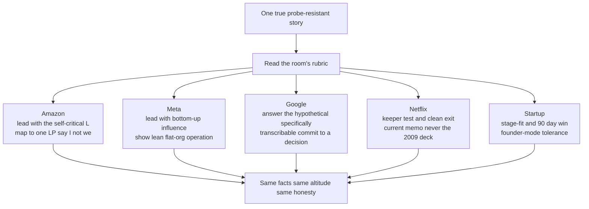

> Every other lesson in this track taught you to build an answer that is *true* and *probe-resistant*. This one teaches the last 20% that separates a strong candidate from a hired one: the same true story is **scored against a different rubric in every loop**, and a Director who can't read the room's grading scheme leaves signal on the table or trips a tripwire they never saw. Amazon maps your story to a Leadership Principle and hands one interviewer a veto. Netflix reads it against a 2024 culture memo and flinches if you quote the 2009 deck. A founder-led startup is barely listening for process, they're listening for whether you'll survive contact with founder mode and ship in 90 days. The story doesn't change. The **emphasis, the vocabulary, and the close** do. This is calibration, not invention, the same recompile-don't-rewrite move from the opening lesson, now pointed at the specific company instead of the era.

### Learning objectives
- Read the **grading scheme** of the five archetypal loops, Amazon (LP-mapped, bar-raiser veto), Meta (behavioral-heavy, bottom-up influence, flat-org efficiency), Google (G&L rubric, hypothetical-heavy, hiring-committee packet), Netflix (2024 memo, keeper test both directions, no-PIP), founder-led startup (stage-fit, founder-mode tolerance, 90-day plan, references over rounds).
- **Re-aim one story per company** without changing the facts, shifting which beat you lead with, which vocabulary you reach for, and what you close on.
- Avoid the **archetype-specific tripwires** that fail an otherwise-strong answer: quoting Netflix's stale deck, importing Amazon's STAR drilling into a Google hypothetical, selling growth-era scale to a flat-org loop.
- Calibrate **how much process to show**: heavy and documented at Amazon, light and velocity-forward at a seed startup, with the trade-off each emphasis accepts.
- Keep **altitude and honesty constant** across all five, calibration tunes emphasis, never truth; a story re-aimed into a lie is the one fail worse than mis-calibration.

### Intuition first

You wrote one technical talk. You're giving it five times this month, to a FAANG platform team, a Series-A all-hands, a regulated-bank architecture board, a research lab, and a founder over dinner. The *content* is identical: same system, same numbers, same hard-won lesson. But you'd be a fool to deliver it five times the same way. The bank wants the failure modes and the audit trail up front; the founder wants to know if you can ship it by Q3 and what it costs; the research lab wants the one non-obvious idea and will tune out the operational scaffolding. Read the wrong room and a great talk lands flat, not because it was wrong, but because you led with the beat *that audience* discounts.

Company calibration is exactly this for behavioral answers. Your termination story, your disagree-and-commit story, your layoff story, all true, all already built to survive a probe. The interviewer's company has pre-installed a rubric that decides *which beat is load-bearing* and *which vocabulary signals "one of us."* Calibration is choosing the open, the framing, and the close that match the rubric in the room, without ever bending a fact to do it.

---

## The five grading schemes

Five archetypes cover most Director loops. Each scores the *same* dimensions this track named, altitude, decision quality, self-awareness, quantification, probe-survival, but weights them differently and tests them through a different instrument.

**Amazon, LP-mapped, bar-raiser veto, vocally self-critical.** Every answer is silently mapped to one of the 16 Leadership Principles, with interviewers pre-assigned which LPs they score. The loop includes a **Bar Raiser**, a trained interviewer outside the hiring chain with an explicit veto, there to protect the long-term bar against a hiring manager's pressure to fill a req. They drill STAR-L three and four levels deep (the hard-people round is run Amazon-style for exactly this reason) and reward **"vocally self-critical"**, their actual phrase, volunteering what you got wrong before they dig. "I" not "we": at a company scoring individual ownership, an all-plural story reads as someone who was *near* the work, not driving it.

**Meta, behavioral-heavy, bottom-up influence, flat-org efficiency.** Meta scores **influence without authority** as a first-class dimension, the flat, matrixed org means a Director moves peers they don't own rather than ordering down a chain. Post-2023 "Year of Efficiency," they also score whether you operate *lean*, flatter org, higher talent density, more output per head without demanding another layer. The strong story is one where you *built the case* and pulled an org along, not where you got a mandate and cascaded it.

**Google, G&L rubric, hypothetical-heavy, transcribable packet.** Google scores a dedicated **"Googleyness & Leadership"** dimension and leans on **hypotheticals** ("how *would* you scale this org") far more than Amazon's past-event drilling. The structural reason: the interviewer doesn't decide, a **hiring committee** that never met you reads a written packet, so your answer must be **specific enough to transcribe**. Vague philosophy survives the room and dies in the packet. Reach for **Clarify → Principles → Options → Decide → Tripwires** and commit, because "it depends" is unscoreable on paper.

**Netflix, 2024 memo, keeper test both directions, no-PIP.** Netflix re-issued its culture guidance in 2024; the operative artifact is the **current** memo (talent density, "people over process," dissent-and-commit, the keeper test), **not** the 2009 slide deck. Quoting the 2009 deck, or "we're a family," which Netflix rejects for "dream team", is the fastest tell of stale prep. The **keeper test runs both directions** ("would you fight to keep this person? would they fight to keep *you*?"), and the **no-PIP, generous-severance** culture means a long PIP arc that scores at Microsoft reads as *slow and process-bound* here. The call made cleanly with a fat severance, not a 90-day improvement arc.

**Founder-led startup, stage-fit, founder-mode tolerance, 90-day plan, references over rounds.** A founder isn't scoring a rubric, they're scoring **fit to stage and tolerance for founder mode**. The 50-person process you'd install at a scale-up is a *red flag* at a 15-person seed; they hear "this person will slow us down." They want a concrete **90-day plan with an early win**, evidence you'll get your hands dirty, and comfort with a founder who skip-levels into your org daily. They also verify differently: **references over rounds**, a founder weights three calls to people who worked for you above any interview answer.

---

## The framework: re-aim, don't rewrite

The move is mechanical once you see it. Hold the facts fixed, then turn three dials per company: **the open** (which beat you lead with), **the vocabulary** (which company's language signals fluency), **the close** (which dimension you land on). Same story, same honesty, you're choosing emphasis, the way you'd choose which slide to dwell on for a given audience.

The discipline is the constant at the bottom of the diagram. Calibration tunes which beat carries the weight; it never edits the facts, inflates the numbers, or claims a stance you don't hold. A story re-aimed until it's a lie scores worse than no calibration at all, a probing interviewer at *any* of these companies finds the seam, and an invented beat is exactly where the probe lands.

A reusable per-company read before the worked example:

| Company | Leads with | Vocabulary that signals fluency | Closes on | The tripwire |
|---|---|---|---|---|
| **Amazon** | The self-critical learning (volunteered) | LP names, "I" not "we," "vocally self-critical" | The mechanism you built so it can't recur | Telling it all in "we"; hiding the mistake until probed |
| **Meta** | Bottom-up influence / lean operation | "talent density," "influence without authority," efficiency | More output per head, peers pulled along | A story that needed org-chart authority to work |
| **Google** | A specific, committed decision | Clarify-Principles-Options-Decide, "Googleyness" | A transcribable, defensible call | "It depends" with no decision; vague philosophy |
| **Netflix** | The clean call + the keeper test | "talent density," "dissent and commit," current memo | A fast, humane, fat-severance exit | The 2009 deck; "we're a family"; a slow PIP arc |
| **Startup** | Stage-fit + a 90-day early win | "ship," "hands-on," founder-mode comfort | What you'd do by day 90, and the cost | Importing big-co process; needing more layers |

---

## 2015 vs 2026: the calibration

Company calibration *itself* got re-graded since 2015, in five concrete ways. The companies moved; an answer aimed at the 2015 version of each is now mis-aimed.

- **Netflix swapped its canonical text.** Through the 2010s, the 2009 "Freedom & Responsibility" deck was what every prepped candidate quoted. Netflix **re-issued the memo in 2024**, dropped some original framing, and sharpened "dream team, not family." Quoting the 2009 deck in 2026 tells the room you studied for the last decade's interview.
- **Every loop now scores efficiency-era operation through its own lens.** In 2015 you sold scale everywhere, "I grew the org 10 to 60." Now Meta scores it as **lean talent density**, Amazon as **frugality + ownership**, a startup as **doing it with fewer bodies**. The same growth story without an output-per-dollar angle reads as ZIRP empire-building at all five, the *fact* of scaling is fine; leading with headcount growth as the achievement is the dated move.
- **Founder mode (Sept 2024) re-graded the startup loop.** Pre-2024, "I hire great people and get out of the way" was safe with a founder. Post-Graham's essay it's near-disqualifying *in front of one*, read as the exec who'll go hands-off and lose the plot. The shift: from "show me you'll delegate" to "show me you'll stay engaged at the work level without smothering."
- **Google's packet got stricter as loops went remote.** With committees reading transcripts rather than vibing in a room, the **transcribable bar rose**, charismatic in-room delivery that papers over a vague answer no longer survives, because the charisma doesn't make the packet. Specificity is load-bearing in a way it wasn't when committees leaned on an interviewer's verbal "trust me."
- **Amazon's bar raiser held its line while others softened.** Through the 2022-2024 correction many companies loosened loops to hire faster; the bar-raiser veto is structurally built to resist exactly that, which is why a 2026 Amazon loop still drills as hard as 2018. Betting "they'll go easier now hiring is tight" is the mis-calibration, the bar raiser exists so they don't.

The meta-point: calibration is a moving target because the companies move. Re-read the *current* artifact (the 2024 Netflix memo, the live LP list, the G&L guidance) the week of the loop, your 2021 prep notes are themselves a stale-deck problem.

---

### Worked example: one termination story, three companies

Take the firing story, senior engineer, eight years tenured, missed three committed milestones on a revenue-blocking payments integration, diagnosed system-then-skill-vs-will, dated feedback March 4th, a 60-day plan, hit one of four criteria, exited personally in eight minutes with severance above policy, velocity recovered in a sprint, learning "act a quarter earlier" plus a two-week-trigger mechanism. **Every fact below is identical.** Watch only the open, vocabulary, and close move.

### Amazon: lead with the self-critical L, map to an LP, say "I"

> "This maps to **Hire & Develop the Best** and, honestly, where I was weakest, **Have Backbone, Disagree and Commit** with myself: I knew by March and didn't act formally until I'd burned another quarter of the team's velocity. *I* diagnosed the system first, scope was stable, two peers were landing their pieces, so it was the person, and the harder read was will-versus-skill. *I* gave the first explicit feedback March 4th, in writing the next day. *I* ran a 60-day plan with passable criteria; he hit one of four, and *I* delivered the exit myself, eight minutes, severance above policy. Team velocity recovered within a sprint. The part I own and will say before you ask: an engineer told me in a skip-level it was *overdue*, the team paid for my extra quarter of hope. So I built the mechanism: any missed committed milestone now triggers the explicit conversation within two weeks, not two months. That's the change that outlasts the one termination."

**Why it scores at Amazon:**
- **Opens on volunteered self-criticism** ("where I was weakest… before you ask"), "vocally self-critical" is a literal LP, and leading with the mistake denies the bar raiser the satisfaction of digging it out.
- **Maps to named LPs** (Hire & Develop, Disagree and Commit), the interviewer scores specific principles; naming them does the mapping for them. And **"I" carries every beat**, first-person is the difference between *drove it* and *was near it*.
- **Closes on a durable mechanism**, not a feeling, the two-week trigger is the *Insist on the Highest Standards* payoff, probe-resistant three levels down (dates, the one-of-four, the skip-level quote).

### Netflix: keeper test, clean fat-severance exit, current memo, no PIP-worship

> "I'd frame it as a keeper-test failure I was slow to act on. By March I knew I wouldn't fight to keep him, three missed committed milestones on revenue-blocking work, two peers landing the same scope, so not the system. Talent density means the question isn't 'can we run a 60-day process,' it's 'would we enthusiastically re-hire him today', and the answer was no. I gave direct dated feedback, but I'll own I ran a longer formal plan than this culture would, and I'd compress that. The exit was the right shape for here: clean, personal, eight minutes, severance well above policy, a generous goodbye, not a drawn-out arc. Velocity recovered in a sprint, confirming the keeper-test read. What I keep: dissent-and-commit with myself faster, I had the data in March and let process slow the call."

**Why it scores at Netflix:**
- **Re-frames the story through the keeper test** ("would I fight to keep him"), Netflix's actual instrument, making the decision the headline rather than the process, and uses the current memo's vocabulary ("talent density," "dissent and commit," "enthusiastically re-hire"), pointedly never the 2009 deck or "family."
- **Owns that the long PIP-style plan is *off-culture here* and would be compressed**, turning the hard-people process strength into a calibrated self-critique, the move that proves you understand *this* company, not just process in general.
- **Lands on a clean, fat-severance exit**, "generous goodbye, not a drawn-out arc" is the no-PIP signature: humane without being slow.

### Founder-led startup: stage-fit, velocity, what it means for the next 90 days

> "Quick version, because at your stage the lesson matters more than the ceremony: a senior engineer blocked a revenue-critical integration for a quarter, and *my* mistake was waiting, I had the signal in March and let a formal process stretch the call out. At fifteen people you can't afford that; one blocked critical path is the whole roadmap. So here's what it means for your first 90 days with me: I move on a clear miss in weeks, not months, because the cost of carrying it is higher the smaller you are. I gave him a real, dated shot, paired with our strongest engineer, passable criteria, and when he hit one of four, exited him myself, generous severance, eight minutes; velocity recovered in a sprint. The mechanism I'd bring you: any missed commitment on a critical path triggers the hard conversation inside two weeks, lightweight, no process overhead, a rule that keeps a blocker from eating a quarter you don't have."

**Why it scores at a startup:**
- **Opens by compressing the ceremony** ("the lesson matters more than the ceremony"), signaling you won't import heavy process, the startup's core fear about a big-co Director, and **ties the lesson to stage** ("at fifteen people… one blocked critical path is the whole roadmap"), which is what the founder is actually scoring.
- **Bridges to a concrete 90-day install**, the founder hears not a war story but *what you'll do here in month one*, explicitly "lightweight, no process overhead."
- **Keeps the hands-on signal** (paired the struggling engineer with the strongest, delivered the exit personally), founder-mode tolerance reads as *you'll get in the work*, not steer from above.

Meta and Google follow the same dials: at Meta, lead with how you pulled the team and peers through the recovery without authority and how the smaller post-exit team ran leaner; at Google, anticipate the hypothetical turn ("how *would* you build the system so this surfaces in two weeks, not two months") and answer it specifically enough to transcribe. Same facts, three dials.

---

### What interviewers probe here

- **"Why do you want to work *here* specifically?"**, *Strong:* a calibrated read of the company's actual operating model (Amazon's ownership culture, Netflix's talent density, the startup's stage) tied to how you work, with a current reference. *Red flag:* generic "great mission, smart people," or praising a value the company has publicly moved off (the 2009 Netflix deck, "we're a family").
- **"Map that story to one of our principles."** (Amazon, explicitly), *Strong:* a precise LP, including the one you scored *yourself* low on. *Red flag:* fumbling the LP names, or mapping a self-congratulatory story to a principle that demands self-criticism.
- **"How would you handle this?"** (Google/Meta hypothetical), *Strong:* Clarify → Principles → Options → Decide → Tripwires with a committed, specific, transcribable call. *Red flag:* "it depends" with no decision, or telling a past-event STAR story when asked a forward-looking hypothetical (wrong instrument).
- **"What would your first 90 days here look like?"** (startup/most loops), *Strong:* a stage-appropriate listen-fast-then-act plan with an early win and *no* premature reorg. *Red flag:* a 50-person playbook at a 15-person company, or "I'd spend a quarter listening", too slow for any 2026 loop.
- **"Who can we call who worked for you?"** (startup, references-over-rounds), *Strong:* named people who'll vouch, including someone you managed *out* who'd still take the call. *Red flag:* hesitation, or only peers and bosses, no direct reports.

---

### Common mistakes

- **Re-aiming until it's a lie.** Calibration tunes emphasis and vocabulary, never facts. Inventing a beat to fit a rubric is the one fail worse than mis-calibration, the probe lands exactly on the invented part.
- **Quoting stale canon.** The Netflix 2009 deck, "we're a family," 2021 LP phrasings, using last-cycle's artifact is the loudest tell of stale prep. Re-read the *current* source the week of the loop.
- **One-size-fits-all delivery.** Telling the identical story with the identical open at all five companies leaves signal on the table everywhere, and trips the specific tripwire at the one company whose rubric you ignored.
- **Wrong instrument for the company's style.** Drilling a rehearsed STAR monologue at Google (hypothetical-heavy, committee-read) or going vague-philosophical at Amazon (STAR-drilled, LP-mapped) is reaching for the wrong shape in the wrong room.
- **Over-calibrating into pandering.** Parroting a company's slogans without substance reads as a candidate who studied the careers page, not one who operates that way. Calibration is emphasis and vocabulary on a *real* story, not a personality transplant.

---

### Practice prompts

1. **Re-aim your firing story for Amazon and Netflix back-to-back.** *(Sketch: same facts. Amazon, open on the volunteered self-criticism, map to Hire & Develop + Disagree-and-Commit, "I" throughout, close on the two-week mechanism. Netflix, re-frame through the keeper test, current-memo vocabulary, own that the long plan is off-culture and you'd compress it, close on the clean fat-severance exit. Change only the open, vocabulary, and close.)*
2. **Turn one disagree-and-commit story into a Google hypothetical.** *(Sketch: anticipate "how would you handle a VP overruling your architecture call?", answer Clarify → Principles → Options → Decide → Tripwires, commit to a specific path, make it transcribable. Don't tell the past-event STAR version; that's the wrong instrument for a committee packet.)*
3. **Calibrate your scaling story for Meta vs a seed startup.** *(Sketch: Meta, lead with bottom-up influence and lean talent density, output-per-head, peers pulled along without authority. Startup, strip the headcount-growth framing entirely, lead with a 90-day win and hands-on stage-fit; "I grew the org to 60" is the wrong headline at fifteen people.)*
4. **Pick a company you're actually interviewing and name its three dials.** *(Sketch: read the current artifact this week. Write the one-line open, the three vocabulary words, and the close-on dimension for that specific company, then run one story through them out loud, checking nothing factual changed.)*

---

### Key takeaways
- **The same true story is scored against a different rubric in every loop.** Amazon maps to LPs with a bar-raiser veto; Meta scores bottom-up influence and lean operation; Google reads a transcribable committee packet; Netflix runs the keeper test against the *2024* memo; a founder scores stage-fit, founder-mode tolerance, and a 90-day win with references over rounds.
- **Calibrate three dials, never the facts:** the **open** (which beat leads), the **vocabulary** (which company's language signals fluency), the **close** (which dimension you land on). Re-aim, don't rewrite.
- **Each company has a signature tripwire:** the Netflix 2009 deck and "we're a family"; "we" instead of "I" at Amazon; "it depends" with no decision at Google; importing big-co process at a startup; selling headcount growth as the win anywhere post-ZIRP.
- **Show the right *amount* of process:** heavy, documented, LP-mapped at Amazon; clean-call-and-fat-severance at no-PIP Netflix; lightweight and velocity-forward at a seed startup, with the trade-off each emphasis accepts named.
- **Calibration is a moving target because the companies move** (Netflix's 2024 memo, founder mode, the stricter remote-era packet). Re-read the current artifact the week of the loop; your old prep notes are themselves a stale-deck risk. And calibration never bends truth, a story re-aimed into a lie fails worse than one left flat.

> **Spaced-repetition recap:** Company calibration = **same true story, different rubric per loop**. **Amazon**, LP-mapped, bar-raiser veto, vocally self-critical, "I" not "we"; **Meta**, behavioral-heavy, bottom-up influence, lean flat-org; **Google**, G&L rubric, hypothetical-heavy, transcribable committee packet, *commit* to a decision; **Netflix**, 2024 memo (never the 2009 deck), keeper test both directions, no-PIP clean-and-generous exit; **startup**, stage-fit, founder-mode tolerance, 90-day plan, references over rounds. **Re-aim three dials, open, vocabulary, close, never the facts.** Signature tripwires: stale Netflix deck, "we" at Amazon, "it depends" at Google, big-co process at a startup, ZIRP-era headcount bragging anywhere. Re-read the *current* artifact the week of the loop; calibration tunes emphasis, never truth.

---

*End of Lesson 15.13. Company calibration is the last layer over every story you've built, the same facts, re-aimed to the rubric in the room. Next: the demonstrate-don't-describe capstone, where the modern loop stops asking for stories and makes you *perform*, critique a bad set of OKRs live, read a synthesized org-health survey and act, present a first-90-days plan, scored against the rubric this whole track has been teaching you to see.*
