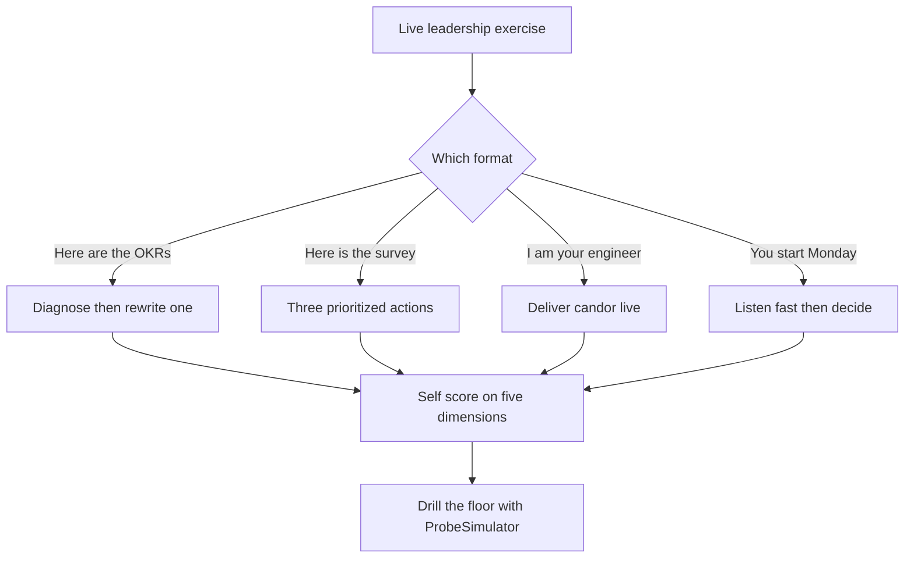

> Every lesson before this taught you to *describe* leadership well, frameworks, a probe-hardened story bank, a current position per category, tuned to the room. This lesson is where the loop stops letting you describe and makes you *do*. The 2026 Director loop assumes the monologue is rehearsed and possibly AI-drafted, so it replaces "what's your philosophy?" with a live exercise: here are your team's OKRs, fix them; here's an engagement survey, your first three moves; you're my struggling staff engineer, give the feedback now; you start Monday, present your first 90 days. The exercise is unfakeable in a way the monologue isn't, which is exactly why interviewers reach for it. This is the behavioral twin of the system-design drive-and-critique exercise: there you drove a fresh system design and critiqued it against a RESHADED rubric; here you run four live exercises and score yourself against the five dimensions a real panel uses. The skill isn't having good answers, it's *performing judgment under observation*. Drive these yourself, out loud, on a timer.

### Learning objectives
- Recognize the **four live-exercise formats** the modern loop uses to replace philosophy monologues, OKR critique, org-health read, feedback roleplay, 90-day plan, and the distinct judgment each tests.
- Run a **full worked rep** of each: prompt, strong response, and the annotations on *why it scores* at Director altitude.
- Carry a reusable **first-90-days template**, listen fast → diagnose → operating system → first structural changes, that survives the "post-layoff, no headcount" twist.
- **Self-score** any rep against the five interviewer dimensions, scope-for-level, decision quality, self-awareness, quantification, altitude consistency, and find your floor before a panel does.
- Wire the track's drill tools, **ProbeSimulator** and the **story matrix**, into a repeatable loop, because demonstration is a rehearsed muscle, not a talent.

### Intuition first
A driving test, not a driving interview. You can describe a perfect three-point turn at the kitchen table all day, mirror, signal, lock, reverse, and the examiner learns nothing, because anyone can recite the manual. So they put you behind the wheel: *do it now, with traffic coming*. The wobble shows up only in the doing, do you actually check the mirror, or just say you would? The modern leadership loop made the same move. For a decade it asked candidates to *describe* the maneuver, "how do you give hard feedback?", and accepted a fluent answer, until it noticed fluency was cheap, increasingly LLM-shaped, and predicted nothing about who could deliver the feedback when the engineer pushed back. So it handed over the wheel. The four exercises below are the road test; reading about them is the kitchen-table version. The only prep that transfers is gripping the wheel until the wobble is gone.

---

## The four formats: what each live exercise actually tests

The loop's live exercises aren't random; each isolates a competency the monologue lets you fake. Read the format, name the test, reach for the move.

| Exercise | The prompt shape | What it actually tests | The fail it catches |
|---|---|---|---|
| **OKR / goals critique** | "Here are a team's OKRs, what's wrong with them?" | Can you tell outcomes from activity, and *rewrite*, not just complain | Lists problems, never produces a better version, diagnosis without prescription |
| **Org-health read** | "Here's a synthesized engagement survey, your first three actions?" | Do you read data into *prioritized action*, or drown in it | Reads every number, acts on none; or acts on the loudest, not the load-bearing |
| **Feedback roleplay** | "I'm your underperforming staff engineer. Go." | Can you deliver candor *live*, specific, kind, with a path, under push-back | Describes the feedback model fluently, can't say the hard sentence to a face |
| **First-90-days plan** | "You start Monday. Present your plan." | Listen-fast-then-act sequencing at Director scope, not an EM onboarding | A listening tour with no decisions, or day-one reorg with no diagnosis |

The through-line: every format punishes **description and rewards production**, the rewritten objective not a teardown, three moves not a summary, the sentence said out loud not the framework named, sequenced decisions not a calendar. Below is one full worked rep of each; drive each yourself before reading the annotations.

---

## Exercise 1: Critique badly written OKRs

> **The prompt (handed to you on a slide):** "These are a real team's Q-OKRs. Walk me through what's wrong, and fix them."
>
> **Objective: Improve platform quality.**
> - KR1: Migrate 80% of services to the new framework.
> - KR2: Reduce technical debt.
> - KR3: Increase test coverage to 90%.
> - KR4: Ship the new observability stack.

**Strong response:** "One root fault, then a rewrite. The root: every key result is an **output, not an outcome**, 'migrate 80%', 'ship the stack', '90% coverage' measure motion, not result, and '90% coverage' is the classic trap, gameable with worthless tests and silent on whether defects fell. KR2, 'reduce technical debt', is unmeasurable as written, so it's marked green by assertion. And the objective, 'improve platform quality', isn't something the business feels. The tell across all four: an *engineering activity list* with no line of sight to a business metric, so you can hit every KR and have a worse platform. Here's the rewrite:

**Objective: Make the platform a reliability and velocity advantage, not a tax.**
- KR1: Cut customer-facing Sev-1/Sev-2 incidents from 9/quarter to ≤3.
- KR2: Reduce P95 deploy lead time from 3 days to under 4 hours.
- KR3 (guardrail): Hold change-failure rate under 10%, so we don't buy speed with breakage.

The migration, observability stack, and coverage work are now *initiatives*, the how, not goals. They earn their place only if they move KR1 or KR2; if the migration reduces neither, this rewrite just told us to question whether it's worth the quarter. That's the point of outcome KRs: they make the work argue for itself."

Go deeper, why the OKR rewrite scores (annotations)

- **Diagnoses the category error, doesn't just nitpick**, names output-vs-outcome (the post-McKinsey-debate literacy) as the *root* fault, not four separate complaints.
- **Produces a better artifact**, the rewrite is the deliverable; critique-only fails the "demonstrate" bar. The new KRs are DORA-shaped, with a baseline *and* a target.
- **Includes a guardrail KR** (change-failure), proves they know outcome metrics get gamed, and reframes the initiatives as subordinate, even willing to question whether the migration is worth it (cost discipline). A number on every KR, house rule one, live.

---

## Exercise 2: Read an org-health survey and propose actions

> **The prompt:** "Your new org's last engagement survey, 80 engineers. First three moves?"
>
> - **Manager effectiveness: 4.2/5** (up from 4.0) · **Priority clarity: 2.4/5** (down from 3.1) · **"I can do my best work here": 2.8/5** · **eNPS: -15** (was +10)
> - **Free-text themes:** "constant re-prioritization," "we start things and kill them," "I don't know who decides."

**Strong response:** "I'd read the *pattern*, not the lowest cell, the data tells one story. Managers score fine (4.2, up), so this isn't a people-management problem; it's a **decision-and-focus problem above the managers**. Priority clarity cratered 3.1 → 2.4, eNPS swung 25 points negative, and all three free-text themes are one complaint: thrash. So the diagnosis isn't 'low engagement,' it's 'this org is whipsawed and nobody owns the why.' Three moves:

**Move one, stop the bleeding on focus.** Within two weeks, cut the active initiative count (thrashing orgs typically run 2-3x what they can finish) and publish a single ranked priority list with explicit *not-doing* items. The signal isn't the list, it's visibly *killing* something and protecting the rest for a quarter.

**Move two, fix the decision-rights gap (the root cause).** 'I don't know who decides' is structural: publish a decision-rights map and a lightweight written-decision log, so reversals have a visible reason instead of feeling random. That directly attacks 'we start things and kill them.'

**Move three, close the loop.** Take this exact reading back to the org in two weeks, 'here's what you told me, here's the pattern, here's what's changing', because surveying then doing nothing visible is the fastest way to drop eNPS further. Re-pulse in 90 days on priority clarity specifically, as my scorecard.

What I would *not* do: a morale or perks push at the 2.8 'best work' number. That's a *symptom* of the thrash, not a cause, treat focus and decision rights and 'best work' recovers with it."

Go deeper, why the survey read scores (annotations)

- **Reads the pattern, not the worst cell**, connects four metrics and three themes into one diagnosis (decision-thrash). That's "read data into action," not "summarize data."
- **Uses the *non*-alarming number diagnostically**, manager effectiveness being *fine* localizes the problem above the managers. A senior move.
- **Three sequenced, prioritized moves**, names the one it would *not* do with the reason (house rule two), and closes the loop with a 90-day re-pulse scorecard; surveying-then-silence is a named trap. Director altitude, decision rights and initiative portfolio, not "skip-level coffee chats."

---

## Exercise 3: Deliver hard feedback in a roleplay

> **The prompt:** "I'll play your staff engineer, Maya. She's brilliant technically but the last two design reviews ended with junior engineers going silent, two of them have privately said they dread her reviews. Deliver the feedback. I'll push back."

The roleplay is the format candidates fear most, no framework to hide behind, you have to *say the sentence*. The move is SBI-shaped (situation-behavior-impact), but the score is in the delivery: specific, direct, kind, and holding the line under push-back without caving or getting cold.

**Strong response (you, opening):** "Maya, I want to be direct because I respect your work too much to be vague. In Tuesday's review, when Priya proposed the caching approach, you said 'that's obviously not going to work' and moved on, and Priya didn't speak again the whole meeting. Same pattern with Sam in the auth review last week. *(situation + behavior, specific, dated)* The impact: two engineers have told me they've stopped bringing ideas to your reviews, so we're losing the exact thing reviews are *for*, catching problems early. Your technical bar is an asset; right now the *delivery* of it is costing us their contribution. *(impact, business-framed)*"

> **(Push-back):** "But I'm *right*, their designs *were* flawed. Am I supposed to pretend bad ideas are good?"

**Strong response (holding the line):** "No, I'd be worried if you lowered the bar. This isn't about less rigor; it's about rigor that keeps people in the room. 'That's obviously not going to work' ends the conversation; 'what happens to that under write-heavy load?' holds the *same* bar and makes them think, and you get a better design *and* an engineer who comes back. The standard isn't the problem; 'obviously' is. So, concretely: in the next two reviews, when you see a flaw, ask the question that exposes it instead of stating the verdict. I'll be in both, not to police you, to give you a read afterward, and I'll tell you straight in our 1:1 whether it's changing."

**Why this scores:**
- **Says the hard sentence**, the exact quote, the dated incident, the named people; no retreat into "some feedback I've heard." Specificity is what makes it land and proves you'd actually deliver it.
- **Separates the asset from the behavior**, "your bar is an asset; the delivery is the cost", protecting the strength while being unambiguous on the change (the brilliant-jerk discipline, as live coaching).
- **Holds the line under push-back**, concedes the valid point (don't lower the bar), reframes to the real issue (verdict vs. question); caving fails, going cold fails, it threads both. Ends with a concrete, observable ask *and* an inspection plan, feedback with no next step reads as venting.
- **Warm and direct at once**, the 2026 calibration: the compassion bar rose, so cold delivery scores worse, but conflict-avoidance still fails. Candor *and* care.

Go deeper, the SBI spine and the three roleplay failure modes (IC depth, optional)

**SBI** keeps live feedback from wandering: **S**ituation (the specific when/where, "Tuesday's review"), **B**ehavior (the observable act, quoted, not interpreted, "you said 'obviously not'", *not* "you were dismissive"), **I**mpact (the consequence, business-framed, "two engineers stopped contributing"). Interpretations ("you're arrogant") trigger defensiveness; observed behavior plus impact is hard to argue with.

The three ways the roleplay fails, in order of how common they are:
1. **The cushion**, so much praise and hedging that the actual message never lands ("you're amazing, just maybe, possibly, a tiny bit…"). Maya leaves not knowing she has to change. This is the most common Director-candidate failure: senior people who've gotten conflict-avoidant.
2. **The framework recital**, describing SBI instead of *doing* it ("so I'd use situation-behavior-impact here, where the situation is…"). The interviewer is playing Maya; talk to *her*, not about the model. Announcing the framework breaks the roleplay the way it breaks a STAR answer.
3. **The freeze under push-back**, folding the moment Maya pushes ("oh, well, if you think the designs were bad, maybe it's fine"). The push-back *is* the test. Concede what's true, hold what matters.

---

## Exercise 4: Present a first-90-days plan

> **The prompt:** "You start as Director of this 60-person org on Monday. Present your first 90 days. By the way, they just absorbed a layoff two months ago, and you're not getting new headcount this year."

The near-universal closing exercise, with a sharp modern calibration: "I'd spend a quarter listening" now reads *slow*. The shape is **listen fast → diagnose → install the operating system → make the first structural changes**, diagnosis visible by day 30, first decisions by 60-90. The layoff-and-no-headcount twist tests whether your plan survives constraint or assumes growth.

**Strong response (a plan, not a calendar):** "First I classify the situation, it sets my clock. A 60-person org that just took a layoff with no headcount coming is a **stabilize-and-refocus**, not a growth build: the 90-day job is trust, focus, and more output from the team I have, not scaling it. Three phases (detail in the template below):

- **Days 1-30, listen fast with evidence:** time-boxed 1:1s and skip-levels *plus* the hard data (delivery, incidents, the attrition list, the survey), with two questions in every conversation, *do you have a future here* and *what work shouldn't we be doing*, and a **diagnosis presented back to my VP and org by day 30**, so my read is visible and falsifiable.
- **Days 30-60, install the operating system and make the first focus call:** the cadence that gives truth without micromanaging, and the first structural decision, survivors are carrying too much, so I **kill 1-2 low-value projects** to get the portfolio back inside capacity. Cutting *work*, not just absorbing the cut, is what makes a layoff actually work.
- **Days 60-90, first org changes and a re-recruit:** redraw a thrash-causing boundary, address one manager if the data says so (a real coaching arc, not a snap exit), and re-recruit high-potentials with scope, with no promotion budget, *interesting problems* are my retention currency, plus one visible win.

Two things I would *not* do: reorg in week one (rearranging a problem I don't understand yet), and promise no further cuts unless it's true, post-layoff, survivor trust is the asset, and one lie about safety spends it permanently. Scorecard: diagnosis by day 30, portfolio inside capacity, zero regretted attrition among named keepers, one shipped win."

**Why this scores:**
- **Classifies the situation first** (stabilize-and-refocus vs. growth), sets the clock and proves the plan is diagnosed, not templated; the same move opens the inherited-team answer.
- **Listens fast with evidence**, time-boxed 1:1s *plus* hard data, diagnosis *presented back* by day 30. Beats the dated "quarter of listening" and makes it falsifiable.
- **Survives the constraint**, the post-layoff, no-headcount twist is met head-on: cut initiatives, re-recruit with scope not comp, no false safety promises. A growth-assuming plan fails here.
- **Installs an operating system, not a meeting list** (artifacts, decision rights), names the first structural call with a number, says what it would *not* do with reasons, and ends with a scorecard it'll be held to.

### The reusable first-90-days template

Carry this shape into any version of the prompt; swap specifics to the situation you classified on day one.

| Phase | The job | Concrete moves | The output |
|---|---|---|---|
| **Days 1-30, Listen fast** | Diagnose with evidence, not impressions | 1:1s + skip-levels (time-boxed); read delivery/incident/attrition/survey data; for each person: future-here + what-to-stop | A **diagnosis presented back** to VP and org, visible, falsifiable |
| **Days 30-60, Install the OS** | Get truth without micromanaging; first focus call | Weekly written ops review on one dashboard; themes-based 1:1s; skip-level cadence; **kill 1-2 low-value initiatives** | An operating cadence + portfolio back inside capacity |
| **Days 60-90, First structural changes** | The decisions the diagnosis earned | Redraw a thrash-causing boundary; address one manager (coaching arc); re-recruit keepers with scope; ship one visible win | First org changes + a **90-day scorecard** you're held to |

The adaptors: a **turnaround** moves the manager call earlier; **growth** (rare in 2026, interrogate headcount-vs-output) adds the hiring machine and span math at 30-60; a **strong inherited team** lightens the structural changes and lengthens trust-building. The spine holds; the emphasis shifts with the situation.

---

## 2015 vs 2026: the calibration

The shift to live exercises *is* the calibration, and the bar inside each one also moved.

- **The format is the headline shift.** A 2015 loop ran on monologue questions and accepted a fluent answer. The 2026 loop assumes fluency is cheap and possibly AI-generated, so it reaches for the *exercise* precisely because performance under observation can't be pre-drafted. Prepare only polished answers and the live exercise is where the floor falls out.
- **The listening tour got a clock.** "I'd spend 90 days listening" was respected in 2015; in 2026 it reads slow. The calibration is **listen-fast-then-act**, visible diagnosis by day 30, first decisions by 60-90, evidenced by *specifics*, not duration.
- **Every exercise carries an efficiency constraint.** The 90-day prompt comes with "post-layoff, no headcount"; the OKR rewrite questions whether the work is worth the quarter; the survey response can't reach for a perks budget. The post-ZIRP assumption is baked into the prompts, a plan that assumes growth dates you instantly.
- **Feedback's compassion bar rose alongside its candor bar.** Cold, clinical delivery now scores *worse* post-2022, while conflict-avoidant cushioning still fails. The scored delivery is candor *and* care, held under push-back.
- **Outcome-over-activity is assumed literacy.** Post-McKinsey-debate and post-AI (code volume is free), output KRs are an instant fail, the exercise scores whether you reach for *outcome* metrics with guardrails.

---

## The self-scoring rubric: five dimensions a panel uses

After any rep, yours or a model answer, score it on the five dimensions a real panel scores, 1-3 each. This is the behavioral counterpart of the system-design self-assessment scorecard: the point isn't the total, it's finding the dimension where you're a 1 and drilling it.

| Dimension | 3, Strong signal | 1, Red flag |
|---|---|---|
| **Scope-for-level** | Operates on systems, decision rights, initiative portfolio, org boundaries, operating cadence | Operates on EM rituals, runs the standup, reviews the PR, plans the offsite |
| **Decision quality** | Commits to a move, names the rejected alternative and the trade-off, sequences it | Lists problems or options and never decides; or decides with no alternative considered |
| **Self-awareness** | Names a limit, a thing it would *not* do, or a cost it's accepting, and why | Flawless, costless, all-upside, reads as rehearsed or unreflective |
| **Quantification** | Real numbers, baselines, targets, team sizes, percentages, timelines | "It'll improve," "significantly," "a lot", house rule one violated |
| **Altitude consistency** | Holds Director altitude across all four exercises and three probe levels | Drifts up into hand-waving or down into IC detail when pushed |

Two columns are this track's house rules: **quantification** is "always quantify," and **decision quality**'s rejected-alternative requirement is "name the trade-off." Both transfer verbatim from the system-design track, the same Principal/Staff interviewer often scores both your rounds, so altitude consistency *across* rounds is itself a signal. The system-design self-critique loop applies exactly: run the exercise, score it cold, find the 1, drill *that* dimension rather than re-running your strongest one.

**The drill loop.** Wire the track's two tools into a repeatable rep: run an exercise out loud on a timer, then turn the **ProbeSimulator** on your answer to push each follow-up three levels deep until your specifics run out, that floor is your real score. Pull the live material from your **story matrix**: your actual OKR rewrites, a real survey you read, hard feedback you've delivered. The matrix supplies true events, the simulator finds where they're thin, this rubric says which dimension to harden.

---

## What interviewers probe here

- **"Now write me a better OKR, live."**, *Strong:* a quantified, outcome-shaped KR with a guardrail metric on the spot. *Red flag:* can only diagnose; the rewrite is vague or another output metric.
- **"Of your three survey actions, which is first and why?"**, *Strong:* names the load-bearing one (decision rights/focus), why the others are downstream, what it would *not* chase. *Red flag:* treats all three as equal, or leads with the morale symptom.
- **The feedback push-back.**, *Strong:* holds the line, concedes the valid point, reframes, stays warm, ends with an observable ask. *Red flag:* caves, goes cold, or recites SBI at the interviewer-as-Maya.
- **"Your 90-day plan, but post-layoff with no headcount."**, *Strong:* the plan visibly changes, cut work, re-recruit with scope, no false promises. *Red flag:* the same growth-era plan, unmodified.
- **"Where would *this* plan be wrong?"**, *Strong:* names its own tripwires and the assumption that breaks it. *Red flag:* defends it as airtight, the costless-plan tell.

---

## Common mistakes

- **Critiquing without producing.** Listing what's wrong and never building the better version. The premise is *demonstrate*, the rewrite, the three moves, the said sentence *is* the answer; the teardown alone fails.
- **Reciting the framework instead of running it.** "I'd use SBI here," or "first a listening tour" as a label. The interviewer wants the maneuver performed, not named, announcing it breaks the moment, exactly as in a STAR answer.
- **Acting on the loudest number, not the load-bearing one.** Reaching for the 2.8 "best work" score or a morale initiative instead of the decision-thrash root cause. Read the *pattern*; treat the cause.
- **A 90-day plan that's a calendar, not decisions**, meetings with no diagnosis presented, no structural call, no scorecard; or the dated full-quarter listen before any action. Visible diagnosis by day 30 is the bar.
- **Assuming growth and comfort.** A plan or survey response that needs new headcount, a perks budget, or "no further cuts" promises. The 2026 prompts come with constraints baked in; assuming the good times dates you in one sentence.

---

## Practice prompts

1. **Rewrite a real OKR set live.** Take your team's actual OKRs, 5-minute timer: name the category error, then rewrite objective and KRs into outcomes with one guardrail metric. *(Sketch: "ship X, migrate Y, hit Z% coverage" are outputs, re-anchor to incidents/lead time/a business metric, and demote the originals to initiatives that must earn their place.)*
2. **Read a survey cold.** Use Exercise 2's data; give three *prioritized* actions in 3 minutes, naming the first and the one you'd refuse. *(Sketch: connect metrics and free-text into one diagnosis before acting; use a good number diagnostically; close with a re-pulse date.)*
3. **Run the feedback roleplay with push-back.** Have a peer play your hardest real report and refuse to make it easy. *(Sketch: quote the behavior, frame the impact, concede the valid point, reframe to the real issue, end with an observable ask and inspection plan, stay warm throughout.)*
4. **Present a 90-day plan under a constraint.** Run the template for a *specific* hard situation, post-layoff, a turnaround, or a strong team asked to do more flat. *(Sketch: classify on day one; listen fast with data; install the OS and first focus call by 60; org changes and a quantified scorecard by 90; name two things you would not do and why.)*

---

### Key takeaways
- **The modern loop replaced "describe" with "do."** Four live formats, OKR critique, org-health read, feedback roleplay, 90-day plan, each isolate a competency the monologue lets you fake; that's why interviewers reach for them, and why polished-answer-only prep fails here.
- **Every exercise rewards production over critique.** Rewrite the OKR, give three prioritized moves, say the hard sentence, present sequenced decisions, the artifact you build *is* the answer; the teardown alone fails.
- **The first-90-days shape is listen-fast → diagnose → install the OS → first structural changes** (diagnosis by day 30, decisions by 60-90), and it must survive the post-layoff/no-headcount twist by cutting work, re-recruiting with scope, and refusing false safety promises.
- **Score every rep on five dimensions**, scope-for-level, decision quality, self-awareness, quantification, altitude consistency, and drill the one where you're a 1. Two are this course's house rules (quantify; name the trade-off) applied to behavior.
- **Demonstration is a rehearsed muscle.** Drive a real exercise out loud on a timer, probe it to its floor with the ProbeSimulator on stories from your matrix, harden the weak dimension, the system-design drive-then-critique reflex, transferred verbatim.

> **Spaced-repetition recap:** Modern loops replace philosophy monologues with **four live exercises**, rewrite broken OKRs (outputs → outcomes + guardrail), read a survey (pattern not worst-cell → three prioritized moves + re-pulse), deliver feedback live (SBI, say the sentence, hold the line, warm + direct), present first 90 days (classify → listen-fast → install the OS → structural changes; survive post-layoff/no-headcount). Every exercise **rewards production over critique** under a 2026 efficiency constraint. **Self-score on five dimensions, drill your 1.** The behavioral twin of the system-design drive-and-critique exercise: drive, critique, close the gap.

---

*End of Lesson 15.14, and of the Leadership Track. You arrived with frameworks, built a probe-hardened story bank, calibrated a position for every category, and tuned it to the room. This capstone is where it all has to leave your mouth under observation, the OKR you rewrite, the survey you act on, the feedback you deliver to a face, the plan you present on day one. The two house rules, quantify everything, name every trade-off, govern the RESHADED system-design track too, because the same senior interviewer increasingly scores both your rounds and calibrates your altitude across them. Don't read this again. Drive the four exercises out loud, on a timer, until the wobble is gone.*
