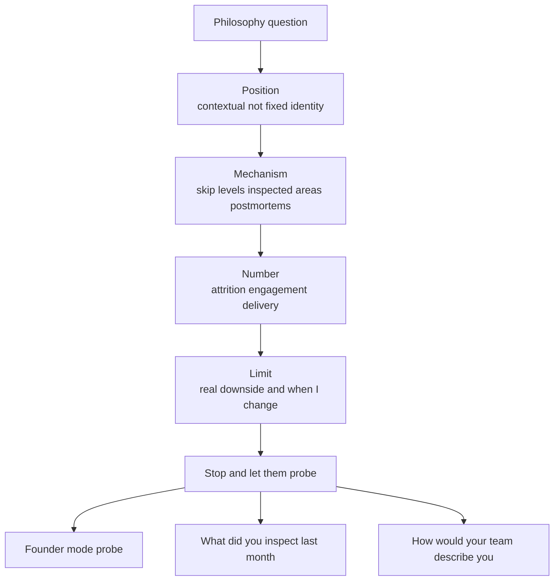

> Every Director loop has a "who are you as a leader" round, the hiring manager or a culture interviewer asking your style, how hands-on you are, how you build culture and psychological safety, where you stand on remote. They are **not** scoring whether you hold the "right" philosophy; there isn't one. They're scoring three things: **altitude** (do you describe Director mechanisms or EM rituals), **currency** (does the answer sound like 2026 or like a 2015 leadership book), and **probe-survival** (the monologue is assumed rehearsed and possibly AI-drafted, so the follow-up, or a live exercise, *is* the real test). This is the category where a dated answer is most instantly fatal: "I'm a servant leader, I hire great people and get out of the way" now reads as abdication, and "I'm founder mode" reads as a micromanagement confession. The whole lesson is about landing between those two ditches.

### Learning objectives
- Deliver a philosophy answer in **Position → Mechanism → Number → Limit** (~90 seconds, story held in reserve), and know why the **Limit** is where the score is won.
- Handle the **founder-mode false binary**: reject "delegate and disappear" *and* "review every PR," and replace both with selective depth plus standing mechanisms.
- State **psychological safety in Edmondson's risk-taking definition, explicitly paired with accountability**, not as comfort or absence of conflict.
- Talk culture as **designed, measured mechanisms** (written principles, postmortems, decision logs, attrition and survey trends), never perks or proximity, and hold a **stewardship** stance on RTO with the trade-off math.
- Pass the depth probe: "what did you personally inspect at the work level last month?" and "how would your team describe you when you're not in the room?"

### Intuition first
A good chef de cuisine doesn't cook every plate, and doesn't vanish into an office either. They taste on the pass, a few dishes a night, the ones most likely to go wrong, and they run standing systems (the recipe book, mise-en-place checks, the post-service debrief) so the kitchen's quality doesn't depend on whether they personally plated tonight's risotto. Ask them their "style" and the weak answer is an identity label, "I'm hands-off" or "I'm a perfectionist." The strong answer is a *function*: I taste where the risk is, I run the systems that tell me the truth without standing over every station, and here's the downside of how I work. That's the shape of a Director philosophy answer. You are not auditioning a personality; you're describing an operating instinct, **where you go deep, the mechanisms that surface truth without you in the room, and the honest cost of your default.** The interviewer is on the pass with you, tasting whether the answer is real.

---

## The questions

These are the open, calibrated-general questions of the hiring-manager and culture rounds. They look like invitations to monologue; they're really setups for a probe.

| Variant | What it's really testing |
|---|---|
| "What's your leadership style / philosophy?" | Altitude + currency: a contextual position with a real mechanism and a real downside, in 90 seconds. |
| "How hands-on are you? Founder mode or manager mode? How deep do you go technically?" | Whether you handle the false binary or fall into a ditch. |
| "How do you build and scale culture? Does it survive a reorg?" | Culture as designed mechanism vs perks/proximity/"we're a family." |
| "How do you create psychological safety while holding a high bar?" | Edmondson + accountability, or comfort-as-safety (the 2026 tell). |
| "Where do you stand on remote / hybrid / RTO?" | Organizational stewardship vs personal workplace ideology. |
| "What's a weakness of your style? How would your team describe you when you're not in the room?" | Self-awareness, disqualifying at L7+ if weak. |
| "Your CEO constantly skip-levels into your org, how do you react?" | Founder-mode-adjacent: do you channel engagement or defend turf. |
| "What did you personally inspect at the work level last month?" | The currency trap, abdication has no answer here. |

The merge: all of these are **philosophy-shape** questions, so they all take **Position → Mechanism → Number → Limit**, and every one resolves into a probe or a live exercise. Spend the whole answer on the monologue and you've failed the actual test, which is the follow-up.

---

## The framework

The answer shape is **Position → Mechanism → Number → Limit**, ~90 seconds, then *stop* and let them drill.

- **Position**, one sentence, stated as *contextual*, not a fixed identity. "My default is delegation with explicit inspection points; I drop altitude where risk concentrates" beats "I'm a delegator." The contextual framing is what dodges the founder-mode trap before it's sprung.
- **Mechanism**, the named, standing practice that makes the position real and verifiable: skip-level cadence, one or two inspected areas per quarter, written operating principles, blameless postmortems with owned actions, a decision log. This is the layer that separates an operator from an inspirational poster.
- **Number**, one quantified outcome that proves the mechanism works: regretted attrition, an engagement trend, a delivery metric. The house rule applies to your philosophy exactly as it applies to "it scales."
- **Limit**, a genuine downside of *your own* style and when you deliberately change it. This is the "name your trade-off and rejected alternative" rule turned on yourself, and at Director level it carries more of the score than the Position does.

Then hold the rest in reserve. The monologue is the opening; the probe is the round. Never announce the framework aloud.

---

## 2015 vs 2026: the calibration

This is the category the modern world re-scored most violently. Five shifts separate a current answer from a stale one.

- **Founder-mode killed the clean delegation answer.** After Paul Graham's September 2024 essay, "hire great people and get out of the way" is near-disqualifying in front of founders, it reads as abdication. But the over-correction is its own ditch: "I'm founder mode, I go deep on everything" reads as a micromanagement confession and as someone who can't scale. The 2026 synthesis is **selective depth with standing mechanisms**: go deep where risk concentrates, run systems that surface truth everywhere else. Chesky's actual lesson was *engaged* leadership, not reviewing every pull request, say that, because the cliché version of founder mode is itself a stale read.
- **Psychological safety got a backlash, so the definition matters.** Naming Project Aristotle alone is now table stakes and slightly suspect. The current answer states **Edmondson's definition, safety is the freedom to take *interpersonal* risks (admit a mistake, dissent, ask a dumb question) without humiliation, and explicitly pairs it with accountability**: "safety protects people who take risks, not people from performance consequences." Psych safety framed as comfort or absence of conflict is a 2026 red flag.
- **Culture is mechanism, not perks or proximity.** Post-ZIRP, "ping-pong tables and a family vibe" is dead. Culture you can defend is *designed and measured*: written operating principles, blameless postmortems, decision logs, regretted-attrition and engagement-survey trends. The probe "does it survive a reorg?" is asking exactly this, perks don't survive a distribution; mechanisms do.
- **RTO is a stewardship question, not an ideology test.** The currency bar is separating personal preference from organizational stewardship. Strong candidates know the trade-off math, Amazon's 5-day RTO polled ~1.4/5 internally with ~91% unhappy, and regretted attrition concentrates among strong engineers, and bring a *retention-risk plan for whatever policy the company sets*, not tribal certainty in either direction.
- **Player-coach is the post-flattening signal.** With layers cut, the credible Director is comfortable delivering in a flatter org and inspecting at the work level, not demanding more headcount to abstract themselves away from the work. "What did you personally inspect last month?" has no good answer if your philosophy is pure abstraction.

---

## Model answers

### Answer 1: "What's your leadership style?" (Position → Mechanism → Number → Limit, ~90s)

> *(Position)* "My style is a function of team maturity and risk, not a fixed identity. My default is to delegate the decision with context and run on an operating cadence, and then pick one or two areas a quarter to inspect at the work level, wherever the quarter could actually die. *(Mechanism)* Concretely: weekly manager 1:1s on themes, skip-levels every six weeks across about 25 people, a written decision log so I can audit reasoning without sitting in every room, and I read the postmortems myself because they tell me how the org actually thinks. Last quarter the inspected area was our payments migration, I was in the design reviews and read the reconciliation code, because that's where the quarter could die. *(Number)* Evidence it works: regretted attrition under 5% for two years while we cut delivery lead time from nine days to three. *(Limit)* The downside of my default is that with a struggling or junior team it's too hands-off, I learned that on an inherited team in 2023, where I had to drop to weekly milestone reviews for two quarters before I'd earned my way back up to delegation. So: delegation with inspection points, and I drop altitude when the situation demands it."

**Why it scores:**
- The Position rejects the false binary in its first clause ("not a fixed identity"), the founder-mode calibration, stated before the trap is sprung.
- The Mechanism is *named and standing* (skip-level cadence, decision log, reading postmortems), not "I empower my team," which has no verification layer, and it pre-answers "what did you inspect last month?"
- One clean Number pairs a quality outcome (attrition under 5%) with a delivery one (lead time 9→3), quantification as the house rule demands.
- The Limit is specific, dated, and names *when he changes altitude*, that's what makes the position falsifiable rather than a slogan, and it's where the score is won at L7+.
- It lands in ~90 seconds and stops, inviting the probe instead of burning the reserve story.

### Answer 2: "How hands-on are you? Are you founder mode or manager mode?"

> "It's a false binary, and I'd push back on the framing. Chesky's actual lesson wasn't 'review every PR', it was engaged leadership instead of disengaged delegation. So my answer is selective depth. I go deep where risk concentrates, the irreversible one-way-door decisions, the key hires, the one migration that can kill the quarter, and I run standing mechanisms so I'm never *dependent on the org chart for truth*: skip-levels every six weeks, demo reviews, reading the postmortems and the design docs myself. Last month, concretely, I inspected our payments cutover at the code level and sat in two senior-hire debriefs; I did *not* inject myself into the three teams that were green and shipping, because that would just slow them down and signal I don't trust my managers. What I don't do is defend turf with a delegation lecture when a founder or CEO dives into my area, I channel it: give them full context, agree on guardrails, keep information symmetric, and let them go as deep as they want. The exec hires who fail at founder-led companies are the ones who treat the CEO's curiosity as a boundary violation."

**Why it scores:**
- Names the binary as false and corrects the *cliché* version of founder mode (the Chesky line), double currency: post-2024 calibration plus a refusal to take the lazy reading.
- Gives a concrete answer to the buried probe "what did you inspect last month?" *and* names what he deliberately *didn't* touch, selective depth made falsifiable, with the rejected alternative (injecting into green teams) stated.
- "Never dependent on the org chart for truth" is the Director instinct, mechanisms over hierarchy, phrased memorably without slogan-ese.
- The CEO-skip-level handling ("channel it, don't defend turf") directly answers the adjacent question and signals he's been near founder-led companies and survived.
- No number here is acceptable because Answer 1 already carried it; under a real probe he'd attach the lead-time figure to the inspected migration.

---

## What interviewers probe here

- **"What did you personally inspect at the work level last month?"**, *Strong:* a specific area, why it (risk concentration), and what he found, plus what he deliberately left alone. *Red flag:* nothing concrete, or a generic "I review dashboards", the abdication tell.
- **"How would your team describe you when you're not in the room?"**, *Strong:* an honest, slightly unflattering read that matches the stated Limit ("decisive but sometimes moves before everyone's bought in"), with the mechanism he uses to compensate. *Red flag:* a flawless self-portrait, or a virtue dressed as a flaw ("too passionate").
- **"How is your psychological safety different from just being nice?"**, *Strong:* Edmondson's risk-taking definition explicitly paired with accountability, safety to dissent and admit mistakes, *not* safety from performance consequences; a mechanism (blameless postmortems that still produce owned action items). *Red flag:* safety as comfort, harmony, or absence of conflict.
- **"Your CEO keeps skip-levelling into your org. React."**, *Strong:* channel the engagement, full context, agreed guardrails, symmetric information; treat it as a signal to inspect, not a turf breach. *Red flag:* "I'd ask them to come through me", reads as turf-defense and founder-mode-intolerant.
- **"Where do you stand on RTO?"**, *Strong:* separates personal preference from stewardship, knows the trade-off math, brings a retention-risk plan for whatever policy is set. *Red flag:* tribal certainty either way, or office attendance used as a performance proxy.

---

## Common mistakes

- **A one-word style label with no mechanism.** "I'm a servant leader" / "I'm hands-off" / "I empower people", a label with no standing practice and no number is a poster, not a philosophy. State a contextual Position, then a *named* mechanism.
- **Falling into a founder-mode ditch.** Pure delegation ("get out of the way") reads as abdication; "I go deep on everything" reads as a micromanager who can't scale. The answer is selective depth plus mechanisms, and correct the *cliché* version of founder mode, don't recite it.
- **Psych safety as comfort.** Framing safety as harmony or no-conflict, or naming Project Aristotle and stopping. Use Edmondson's risk-taking definition and pair it with accountability explicitly.
- **Culture as perks or proximity.** "Ping-pong, off-sites, we're a family", none of it survives a reorg, and "family" implies you won't fire family. Culture is written principles, postmortems, decision logs, and measured trends.
- **No Limit, or a fake one.** No downside named, or a humble-brag ("I care too much"). The Limit is where L7+ self-awareness is scored; make it real, dated, and paired with when you change.

---

## Practice prompts

1. **Deliver your style in 90 seconds, then shut up.** Write Position-Mechanism-Number-Limit for your own leadership and time it. *(Sketch: contextual Position; one named standing mechanism with a cadence; one number pairing quality + delivery; one dated, real Limit with "and here's when I change", then stop and let the probe come.)*
2. **Answer the founder-mode question cold.** "Are you founder mode or manager mode?" *(Sketch: name the binary as false, correct the Chesky cliché, give selective-depth with a concrete "last month I inspected X and deliberately left Y alone," and add the CEO-skip-level channeling line.)*
3. **Define psychological safety to a skeptic.** The interviewer says "isn't psych safety just an excuse for low performers?" *(Sketch: Edmondson's interpersonal-risk definition; the explicit split, safety for risk-takers, not from consequences; a blameless-postmortem mechanism that still produces owned actions and pairs with the high bar.)*
4. **State your RTO stance as a steward.** "We're going 4 days in-office, react." *(Sketch: separate preference from stewardship, cite the trade-off math (Amazon 1.4/5, attrition concentrated among strong engineers), commit to executing the policy *and* bring a regretted-attrition tripwire and a retention plan, disagree-and-commit.)*

---

### Key takeaways
- **Philosophy answers take Position → Mechanism → Number → Limit, ~90 seconds, then stop**, the monologue is the opening; the probe or live exercise is the round.
- **Reject the founder-mode binary.** Not "delegate and disappear," not "go deep on everything", selective depth where risk concentrates, plus standing mechanisms so you're never dependent on the org chart for truth. Correct the Chesky cliché; don't recite it.
- **Psych safety is Edmondson + accountability.** Freedom to take interpersonal risks (dissent, admit mistakes), *not* freedom from performance consequences, and never comfort or absence of conflict.
- **Culture is designed, measured mechanism**, never perks or proximity: written principles, blameless postmortems, decision logs, attrition and survey trends, the stuff that survives a reorg.
- **RTO is stewardship, not ideology.** Know the trade-off math, separate preference from policy, execute whatever's set with a retention-risk tripwire, and always carry a real answer to "what did you inspect at the work level last month?"

> **Spaced-repetition recap:** The "who are you as a leader" round scores **altitude, currency, and probe-survival**, not the right philosophy. Answer in **Position → Mechanism → Number → Limit** (~90s, contextual position, named mechanism, one number, a real dated Limit), then stop and let them drill. Two centerpiece calibrations: **founder-mode is a false binary**, selective depth plus standing mechanisms, not delegate-and-disappear or go-deep-on-everything; and **psych safety is Edmondson's interpersonal-risk-taking paired with accountability**, never comfort. Culture = measured mechanism, not perks; RTO = stewardship with the trade-off math; and always have an answer to "what did you personally inspect last month?"

---

*End of Lesson 15.4. Philosophy is the calibrated-general round; the next lesson narrows to the hiring bar, designing the loop, the AI-era assessment redesign, and the junior-pipeline stance, where the same "designed mechanism, with a number" instinct from this lesson becomes a system you own.*
