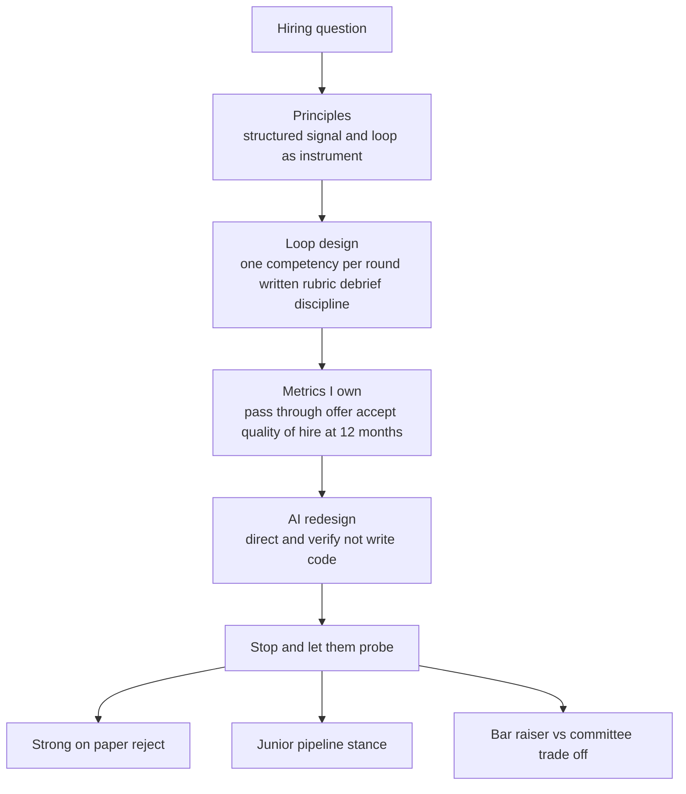

> Most Director loops have a dedicated hiring round, Amazon maps it to *Hire & Develop the Best*, Meta scores "raising the bar" and talent density, Google probes how you'd staff a hiring-committee packet. They are not asking whether you can interview; an EM can do that. They're scoring whether you **design the hiring system**, the rubrics, the loop architecture, the debrief discipline, the funnel metrics you personally own, versus merely sitting in loops someone else built. And this is the category AI broke most concretely: take-homes are dead, ~71% of leaders say AI makes assessment harder, and Meta and Shopify now run AI-enabled rounds. A 2026 answer that is "a phone screen plus four algorithm rounds" is a fail before the probe even starts. This lesson is about owning hiring as an instrument with a feedback loop, and having a real position on the two questions every modern panel asks: *how did AI change your loop*, and *do you still hire juniors*.

### Learning objectives
- Answer hiring in the **system-description shape**: **Principles → Loop design → Metrics you own → AI-era redesign → one hard-call story in reserve**, describing the instrument, not your taste.
- Name the **loop-architecture trade-offs**, bar-raiser vs hiring-committee vs HM-owned, and pick *per company stage* instead of importing one model everywhere.
- State the **funnel metrics a Director owns** with real numbers: pass-through by stage, offer-accept, time-to-hire, and **quality-of-hire at 6/12 months against the original packet**.
- Hold the mandatory **AI-era position**: you stopped assessing whether people can write code and started assessing whether they can **direct and verify** it, live human+AI rounds scored on judgment.
- Hold a defensible **junior-pipeline stance** (a senior-only org has no bench in three years) and a hard-call story: a strong-on-paper candidate you rejected, or a req you killed.

### Intuition first
Think of hiring like a diagnostic test in medicine, not a job interview. A test has a *false-positive rate* (you hire someone who can't do the job) and a *false-negative rate* (you reject someone who could have been great), and the only way to know whether the test works is to **follow the patients**, check, twelve months later, whether the people the test passed actually got healthy. A weak leader runs the test on instinct ("I can tell in ten minutes") and never checks the outcomes. A Director treats the loop as an instrument with a measurable predictive quality: every round measures one named thing against a written rubric, the readings are recorded before anyone compares notes so the loudest voice can't bias the result, and the whole instrument is *recalibrated* against how the hires actually performed. The interviewer isn't asking what you look for in a person. They're asking whether you understand that your hiring loop is a measurement device, one with error rates you can drive down, a calibration you maintain, and a result you audit. And in 2026 they're asking one more thing: whether you've re-tooled the instrument now that the candidate has an AI sitting next to them.

---

## The questions

These look like eight separate questions; they're one system, probed from different angles.

| Variant | What it's really testing |
|---|---|
| "What's your hiring philosophy? What do you look for?" | Whether you describe *principles with a trade-off each accepts*, or a vibe. |
| "Design the interview loop for this org. Bar-raiser vs committee vs HM-owned?" | Loop architecture, and whether you pick per stage or import one model. |
| "How do you raise the bar / hold talent density while hiring fast?" | Whether "raise the bar" means a real mechanism or just harder LeetCode. |
| "How has AI changed how you assess engineers? How did you redesign the loop?" | The mandatory 2026 position, judgment over syntax. |
| "Do you still hire juniors when AI absorbs entry-level work? What's your seniority mix?" | A defensible pipeline stance with a number, not a dodge. |
| "How do you measure whether your hiring is working?" | Funnel metrics + quality-of-hire, the instrument's predictive quality. |
| "Tell me about a strong-on-paper candidate you rejected, or a hire you got wrong." | The hard-call story; whether your bar is real under pressure. |
| "Generalists vs specialists? How do you grow and calibrate interviewers?" | Whether you build the interviewer *pipeline*, not just sit in loops. |

The merge: all of these are **system-description-shape** questions. They take **Principles → Loop design → Metrics → AI redesign → hard-call story**, and the strong answer threads a single instrument through every variant rather than treating them as eight opinions.

---

## The framework

The answer shape is the **system-description structure**: describe the instrument and the loop that maintains it, with a hard-call story held back for the probe.

- **Principles (1-2, each with the trade-off it accepts).** Not a values list, two load-bearing commitments. "Structured signal over narrative" (accepts: slower, less room for a charismatic save). "The loop is an instrument I maintain, not a ritual I run" (accepts: I spend real time on retros instead of just filling slots). Each principle names what it costs, per the house rule.
- **Loop design.** One competency per round, written rubric, work-sample over trivia, and **debrief discipline: written feedback submitted before discussion** so the loudest voice doesn't anchor the room. This is the layer that separates designing a loop from participating in one.
- **Metrics you personally own.** Pass-through by stage, offer-accept rate, time-to-hire, and the one most candidates skip, **quality-of-hire at 6 and 12 months scored against the original interview packet**, which is the only thing that tells you whether the instrument predicts. Plus loop retros when a number drifts.
- **AI-era redesign.** What you assess *now* that AI writes the first draft: direction, verification, code review of AI output, system reasoning, and *when not to reach for it*. A position here is mandatory in 2026, not optional color.
- **Hard-call story in reserve.** A strong-on-paper rejection, a killed req, or a non-obvious hire you defended, held back for the probe, because the probe is the real test.

---

## 2015 vs 2026: the calibration

This category was re-scored harder than almost any other, because AI broke the assessment mechanics and the efficiency era broke the "just hire" reflex. Five shifts separate a current answer from a stale one.

- **Every req now has to justify itself, headcount is the expensive option.** In 2015 the hiring question started at "how do you interview." In 2026 it starts one step earlier: *do we hire at all*, or can automation, a platform investment, or AI leverage absorb the work first? A philosophy that opens with "I'm always hiring great people" reads as ZIRP-era empire-building. The credible opener treats a new head as a budget line you have to defend, not a default.
- **"Culture fit" is dead; "values/competency-add" replaced it.** Post-2020, "fit" reads as a bias vector, a license to hire people like yourself. The current language is **competency-add against a structured rubric**: what does this person add that the team lacks, scored against a written bar, not "would I get a beer with them." If you say "culture fit" unguarded in a 2026 loop, you've flagged yourself.
- **A position on AI-era assessment is mandatory.** Take-homes are dead, a candidate with Claude or Copilot makes the unsupervised take-home pure noise. The modern loop runs **live human+AI sessions**: the candidate uses the tools and you score *direction, verification, and judgment*, what they catch in the AI's output, what they reject, how they reason about system behavior (Meta's AI-enabled CoderPad round, Shopify's BYO-AI interview). "Four algorithm rounds and a phone screen" is a fail; so is "we ban AI in interviews," which tests a world that no longer exists.
- **A defensible junior-pipeline stance is expected.** ~18% of orgs expect fewer junior hires as AI absorbs entry-level work, and "I only hire seniors now" is a tempting, dangerous answer. The strong Director articulates *why they still hire some*, a senior-only org has no bench in three years and no one who grew up in *your* systems, and how onboarding is now designed **around** AI-assisted work, not despite it.
- **The bar-raiser/committee debate is now a per-stage call, not a doctrine.** Importing Amazon's bar-raiser into a 40-person startup is as wrong as running HM-owned hiring at FAANG scale. The current answer knows the trade-offs, bar-raiser (consistency, veto, but slow and centralized), hiring committee (debiased, packet-based, but heavy), HM-owned (fast, accountable, but drifts without calibration), and matches the model to the company's stage and talent density.

---

## Model answers

### Answer 1: "What's your hiring philosophy, and how has AI changed it?" (system-description, ~90s, then stop)

> *(Principles)* "Two principles. First, **structured signal over narrative**, every round measures one named competency against a written rubric, work-sample style, and feedback goes in *writing before the debrief* so the loudest voice in the room doesn't anchor everyone else. The cost I accept is that it's slower and a charismatic candidate can't talk their way out of a weak signal, which is the point. Second, **the loop is an instrument I maintain, not a ritual I run.** *(Loop design)* So I own four numbers: pass-through by stage, offer-accept, time-to-hire, and quality-of-hire at twelve months scored against the original packet. *(Metrics)* That last one is what makes it a loop, when our onsite-to-offer rate dropped to about 12%, I pulled the retro and found two rounds measuring the same problem-solving competency, so we collapsed one and added a systems-design round we were missing; offer rate came back to the low 20s and the false-negative complaints stopped. *(AI redesign)* The biggest change is AI. I stopped assessing whether people can *write* code and started assessing whether they can **direct and verify** it. We moved to a live session where the candidate uses AI tools on a real-ish problem and we score what they catch in the output, what they reject, and how they reason about the system's behavior under load. Source code is a liability now, not output, anyone can generate it; judgment about it is the scarce thing. *(Reserve)* And I hold a real position on the junior pipeline, which I'm sure you'll want to push on."

**Why it scores:**
- Opens with **principles that each name their cost** ("slower… charismatic candidate can't talk their way out"), the house rule applied to hiring, not a values poster.
- "The loop is an instrument I maintain" plus four owned numbers, including **quality-of-hire at 12 months against the original packet**, is the exact signal that separates *designing* a loop from *sitting in* one.
- The 12%-offer-rate retro is a **real feedback-loop story with a number and a fix**: it proves the instrument framing is operated, not recited.
- The AI redesign is concrete and current, "direct and verify, not write," "source code is a liability", and matches the Meta/Shopify reality rather than banning tools or ignoring them.
- It **lands in ~90 seconds and tees up the junior-pipeline probe** instead of burning the reserve, inviting the drill.

### Answer 2: "Do you still hire juniors when AI absorbs entry-level work? And tell me about someone strong-on-paper you rejected."

> *(Pipeline stance)* "I do, deliberately, at roughly **15-20% of reqs**, and I can defend the number. A senior-only org feels efficient for eighteen months and then has no bench: no one who grew up in *your* systems, no one to promote into the staff gaps your seniors will leave, and a hiring market where you're competing only at the most expensive, most contested tier. AI changes *how* I onboard juniors, not *whether*. The old apprenticeship was 'write the boilerplate until you understand the system'; AI writes the boilerplate now, so I rebuilt onboarding around **directing and verifying**, a junior's job in month one is to drive AI on a scoped task and develop the judgment to know when its output is wrong, paired with a senior who reviews the *reasoning*, not the syntax. The trade-off I accept is that juniors are a slower payback than they were, call it three quarters to net-positive instead of two, and I justify that as bench investment, the same way I'd justify a platform bet. *(Hard-call story)* On the strong-on-paper rejection: we had a staff candidate, ex-FAANG, flawless coding rounds, who in the AI-assisted systems round took every suggestion the model made without challenging a single one, including one that would have silently dropped writes under partition. Pure narrative, zero verification. Three interviewers independently flagged 'doesn't pressure-test the machine' in their *written* feedback before the debrief, which is exactly why I trust that signal, it wasn't groupthink, it was the rubric catching the thing that matters now. I rejected over the objection of the hiring manager who was anchored on the pedigree. Six months later I'm confident: the bar held."

**Why it scores:**
- Gives a **specific number (15-20%) and defends it with a real downside of the alternative**, "no bench in three years," the senior-only failure mode, instead of a dodge in either direction.
- Reframes the junior question as **how onboarding changed, not whether to hire**, the post-AI calibration stated precisely, with the apprenticeship-model shift made concrete.
- Names the **trade-off of the stance itself** (slower payback, three quarters vs two) and justifies it as bench investment, quantified, with the cost owned.
- The rejection story is **AI-era-native** (the candidate failed *verification*, the exact thing the redesigned loop tests) and shows the **debrief discipline working**, three independent written flags, not a room talking itself into a no.
- He **rejected over the HM's pedigree anchor and stands by it at six months**, the bar is real under pressure, which is the whole point of the hard-call question.

---

## What interviewers probe here

- **"How do you actually measure whether your loop works?"**, *Strong:* quality-of-hire at 6/12 months scored against the original packet, plus pass-through and offer-accept, with a story of a number drifting and a retro that fixed it. *Red flag:* funnel metrics only (time-to-fill) with no link to whether the hires succeeded, measures speed, not the instrument's predictive quality.
- **"Bar-raiser, committee, or HM-owned, which, and why?"**, *Strong:* names the trade-off of each and picks *for this company's stage and talent density* (bar-raiser for consistency at scale; HM-owned for speed in a startup, with a calibration mechanism to stop drift). *Red flag:* importing one model as doctrine, or not knowing the trade-offs.
- **"AI writes the code now. What are you even testing?"**, *Strong:* direction, verification, code review of AI output, system reasoning, and when *not* to use it, a live human+AI round, not a banned-tools algorithm screen. *Red flag:* "we ban AI in the interview," or "I still do four LeetCode rounds", testing a world that ended.
- **"What does 'raise the bar' mean operationally?"**, *Strong:* a mechanism, every hire must be better than the median of the team on the competency they're hired for, enforced by rubric and a calibrated cross-team reviewer. *Red flag:* "harder problems / higher LeetCode difficulty", confusing the bar with the difficulty knob.
- **"Tell me about a hire you got wrong."**, *Strong:* owns it, traces it to a *gap in the instrument* (a competency the loop didn't test), and shows the rubric change that closed it. *Red flag:* blames the candidate, or has never gotten one wrong (no real volume, or no honesty).

---

## Common mistakes

- **Gut-feel hiring.** "I can tell in ten minutes" / "I hire for fit" is the cardinal red flag, it's an unmeasured instrument with a bias vector built in. State structured signal, written rubrics, and competency-add against a bar.
- **No funnel numbers and no quality-of-hire.** Describing how you interview without owning pass-through, offer-accept, and 12-month outcomes against the packet reads as someone who *participates* in hiring rather than *runs* it. The numbers are the instrument.
- **No position on AI, or the wrong one.** Banning AI in interviews, or ignoring it, both fail. So does "AI made interviewing easy." The answer is a redesigned loop that scores direction and verification, and you must have run it, not theorized it.
- **Confusing the bar with the difficulty knob.** "Raising the bar" is not "harder LeetCode." It's a mechanism for talent density (better-than-median on the hired competency, calibrated cross-team), and post-AI, algorithm difficulty is *less* predictive, not more.
- **Never having rejected a strong-on-paper candidate, or killed a req.** A bar you've never defended under pressure isn't a bar. If every story is a hire you made, the interviewer reads you as someone whose bar bends to pedigree or to filling the slot.

---

## Practice prompts

1. **Deliver your hiring philosophy in 90 seconds, then stop.** Principles → Loop design → Metrics → AI redesign, story in reserve. *(Sketch: two principles each with a cost; one competency per round + written-debrief discipline; four owned numbers including quality-of-hire at 12 months; the direct-and-verify AI redesign, then tee up the junior-pipeline probe instead of answering it.)*
2. **Design the loop for a 40-person startup, then for a 4,000-person org.** *(Sketch: startup → HM-owned for speed *plus* a calibration mechanism and a single cross-team bar-raiser to stop drift; FAANG-scale → hiring committee + bar-raiser for consistency and debiasing across thousands of loops; name the trade-off each accepts, speed vs consistency, and refuse to import one model into the other.)*
3. **State your junior-pipeline position and defend the number.** "AI does entry-level work now, why hire juniors at all?" *(Sketch: a real % of reqs; the senior-only-org failure mode (no bench in three years); onboarding rebuilt around direct-and-verify; the trade-off of slower payback owned as bench investment.)*
4. **Tell the strong-on-paper rejection.** *(Sketch: the pedigree that made it tempting; the specific competency they failed, ideally an AI-era one like verification; the debrief discipline that made the signal trustworthy (independent written flags); rejecting over an anchored HM; the bar held, confirmed later.)*

---

### Key takeaways
- **Hiring answers take the system-description shape**, Principles → Loop design → Metrics → AI redesign → hard-call story, because the round tests whether you *design and maintain the instrument*, not whether you can interview.
- **Own the numbers, especially quality-of-hire at 12 months against the original packet.** Pass-through, offer-accept, and time-to-hire measure speed; quality-of-hire measures whether the loop *predicts*, and a drift-and-retro story proves you operate it as a feedback loop.
- **The AI redesign is mandatory and concrete:** stop assessing whether people can *write* code, start assessing whether they can **direct and verify** it, live human+AI rounds scored on judgment, not banned tools or four algorithm screens.
- **Hold a defensible junior-pipeline stance**, a real % of reqs, defended by the senior-only-org-has-no-bench failure mode, with onboarding rebuilt *around* AI-assisted work, not despite it.
- **Pick loop architecture per company stage** (bar-raiser vs committee vs HM-owned, each with its trade-off), and have a hard-call story, a strong-on-paper rejection or a killed req, because a bar you've never defended under pressure isn't a bar.

> **Spaced-repetition recap:** The hiring round scores whether you **design the loop as an instrument you maintain**, not whether you interview well. Answer in **Principles → Loop design → Metrics → AI redesign → hard-call story**: principles each name a cost; one competency per round with written-debrief discipline; own pass-through, offer-accept, time-to-hire, and **quality-of-hire at 12 months against the packet**. Two mandatory 2026 positions: the **AI redesign** (assess *direct-and-verify*, not *write code*, live human+AI rounds, take-homes dead) and the **junior pipeline** (still hire ~15-20%, because a senior-only org has no bench; onboard around AI, not despite it). Pick bar-raiser/committee/HM-owned *per stage*; carry a strong-on-paper rejection. "Culture fit" and "harder LeetCode" are tells.

---

*End of Lesson 15.5. Hiring is the instrument that fills the org; the next lesson turns to the harder edge of the same bar, the people calls once someone is already inside: low performers, PIPs, the brilliant jerk, and the termination you have to run with dignity and decisiveness.*
