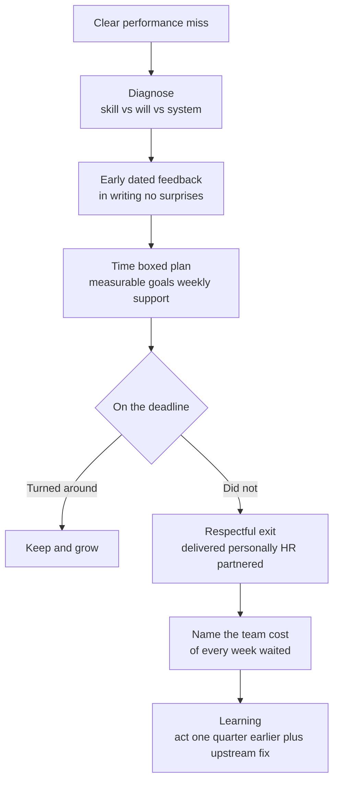

> Every Director loop runs a hard-people-calls round, and it's the single most-probed behavioral cluster, Amazon bar-raisers drill it three and four levels deep precisely because it's the easiest place to catch a rehearsed or AI-drafted story. What they're scoring is **decisiveness with dignity**: did you diagnose before you acted, give early dated feedback, run a real process, make the call on a deadline, and own the team cost of waiting too long. At Director altitude the variants escalate, the low performer is a *manager*, the calibration spans teams you don't personally observe, and a candidate who has *never* terminated anyone reads as conflict-avoidant. This is the lesson where "I coach indefinitely, firing is a failure of leadership" stopped scoring around 2022, and where a cold "it was an easy call" scores *worse* than it used to. The round lives in the narrow band between those two failures.

### Learning objectives
- Run the hard-people story on a **process spine**, diagnose skill vs will vs *system*, early dated feedback, a time-boxed plan, a decision with a deadline, the cost of inaction, the "one quarter earlier" learning, delivered as STAR-L.
- Build the story **probe-resistant**: hold the numbers, the alternatives, the timeline, and the stakeholders three levels below the headline, because this is the cluster interviewers drill hardest.
- Answer the **PIP-philosophy** variant with candor about its **dual function**, a genuine improvement vehicle *and* legal documentation the employee reads as a termination notice, landing between naive ("PIPs usually work") and cynical ("PIPs are paperwork").
- Hold the **brilliant-jerk line** under modern efficiency pressure: acknowledge the louder post-layoffs business case to keep them, and still make the call, with the cost math.
- Calibrate to the **2026 bar**: weeks not quarters, a real termination story as table stakes, and a *higher* compassion bar than 2015, the decisive-and-humane synthesis.

### Intuition first
A good surgeon's hardest skill isn't cutting, it's calling the operation. Three failures, all fatal in their own way. **Operate too late**: you watch the vitals slide for months, hope they stabilize, and by the time you move the damage has spread to everything around the problem, that's the manager who lets a low performer drift for three quarters while the team quietly rots. **Operate carelessly**: you cut without a diagnosis, blame the patient, and walk away cold, that's the surprise firing, the "easy call," the contempt. The skill is the *third* path: read the vitals early, run the diagnostic to know whether it's skill, will, or a system you built wrong, give the patient a real and dated shot at recovery, and when the call has to be made, make it cleanly, on time, and humanely, owning that you watched the chart too long. Interviewers in this round are reading *your* chart. They want to see that you diagnose before you cut, that you moved when the data said move, and that you can describe the hardest thing a leader does, ending someone's job, without either flinching from it or enjoying it.

---

## The questions

These are all past-event questions (STAR-L), with one philosophy-shaped exception, the PIP-view question, that switches instruments mid-cluster.

| Variant | What it's really testing |
|---|---|
| "Tell me about managing an underperformer." (Director: an underperforming *manager* or team) | Diagnose-before-act, dated feedback, a real process, a decision, not endless coaching. |
| "Have you ever fired someone? Walk me through it. What would you do differently?" | A real, well-run termination is table stakes; the "differently" is where self-awareness scores. |
| "What's your view on PIPs? Did anyone ever pass?" | Candor about the dual function, philosophy-shape, not a story (Position-Mechanism-Number-Limit). |
| "Your highest performer is toxic to the team, what do you do?" (brilliant jerk) | Behavior-is-performance, and holding the line under the post-layoffs business case to keep them. |
| "Your top performer resigns / has an offer." | Charter over checkbook, creative retention and honest triage, not a panic counter-offer. |
| "How do you run performance calibration fairly? A manager inflates ratings?" | Cross-team fairness, forced-distribution pressure, legal-defensible documentation. |
| "How fast do you act on a clear miss? When did you wait too long?" | The 2026 decisiveness bar, weeks not quarters, plus owned self-criticism. |
| Netflix: "Apply the keeper test. Would you re-hire everyone today?" | Whether you can hold a high bar without dressing it as cruelty. |

The merge: every one of these except the PIP-view question is a **past-event** question, so they take **STAR-L** built on the process spine below. The PIP-view variant is **philosophy-shape**, answer it in Position → Mechanism → Number → Limit, because there's no single story to tell, there's a stance to defend.

---

## The framework

The spine is a process, and the story *is* the process executed once. Six beats, in order, they double as the probe-defense, because each beat is exactly where a senior interviewer drills.

- **Diagnose, skill vs will vs system.** Before you blame the person, rule out the system: was the expectation unclear, the project a bad fit, the onboarding broken, *your hiring*? Then separate skill (can't, a coaching problem) from will (won't, a different problem). Naming this split is the first signal you're a leader, not a complainer.
- **Early, dated, explicit feedback.** *When exactly* did you first say it plainly, and in writing. "No surprises" starts here. The most common red flag in the whole cluster is feedback that arrives for the first time inside a PIP.
- **Time-boxed structured plan.** Measurable goals, weekly check-ins, named support (a paired senior engineer, a coach), 30-90 days end to end. A plan with a date, not "I kept coaching."
- **Decision with a deadline.** A documented turnaround or a respectful exit, delivered *personally*, never a surprise, HR partnered not outsourced. The deadline is what separates a decision from indefinite hope.
- **Cost of inaction, named.** What the team paid for every extra week you waited, velocity, morale, an engineer who told you in a skip-level it was overdue. Owning this cost is the maturity marker.
- **Learning, almost always "one quarter earlier."** Plus the upstream fix: tighter calibration, a hiring-rubric change, a "missed-commitment triggers the conversation in two weeks" rule. The story ends in a mechanism, not a feeling.

Then survive the probe: hold the numbers, the rejected alternatives (did you consider a transfer? a role change?), the timeline, and the HR/stakeholder partnership three levels down. Never announce the spine aloud.

For the **PIP-view** question, switch to philosophy-shape: **Position** (a PIP formalizes a conversation already happening, it never *starts* it) → **Mechanism** (passable criteria, weekly check-ins, the candid negotiated-exit path offered alongside) → **Number** (your real pass rate, some pass, most don't, and say so) → **Limit** (its dual function as documentation is real, and pretending otherwise to the employee is the dishonest move).

---

## 2015 vs 2026: the calibration

This cluster got re-scored hard in both directions at once, more decisive *and* more humane. Six shifts separate a current answer from a stale one.

- **The center of gravity moved to decisiveness, weeks, not quarters.** "I coach indefinitely; firing is a failure of leadership" now reads as not operating at level. Meta's low-performer cuts, Microsoft's PIP-or-severance ultimatum, and a ~30% rise in formal performance procedures since 2020 set the context: the strong answer acts on a clear miss in weeks. "When did you wait too long?" expects a real, owned answer, almost always "a quarter too long."
- **But the compassion bar rose too, post-2022.** A cold "it was an easy call, I just cut him" scores *worse* than it used to. The decisive-and-humane synthesis is the bar: you moved fast *and* you treated the exit with dignity, severance advocacy, intro calls, an eight-minute conversation that was direct but not cruel. Relish or contempt is an instant fail; so is flinching.
- **A real termination story is table stakes.** At Director level, never having run one, with no adjacent story (a managed-out transfer, a PIP you owned), reads as inexperience or conflict-avoidance. You need one loaded.
- **PIPs are scored on candor about the dual function.** A PIP is *both* a genuine improvement vehicle *and* legal documentation, and the employee reads it as a termination notice the day they get it. Naive "PIPs usually work" and cynical "PIPs are just paper for the file" both fail. The honest answer holds both truths and offers the negotiated-exit path candidly.
- **The brilliant-jerk line is now contested under efficiency pressure.** Post-layoffs, the business case to keep the toxic top performer got *louder*, "we can't afford to lose that output right now." The scored answer acknowledges that pressure and still holds the line, with the cost math: the research figure is a toxic worker costing roughly **$12,500** in turnover-driven costs versus a superstar adding roughly **$5,300** of value, the toxic star is net-negative even before you count the silent attrition. Behavior is performance.
- **Retention shifted from checkbook to charter.** Comp budgets are tight, so the flight-risk answer is creative non-monetary retention (scope, a hard problem, a real career conversation) plus honest triage, *who do I let the market take*, not a panic counter-offer, which mostly buys a six-month rental at a higher number. And calibration answers now have to handle forced-distribution pressure without torching trust, with legally defensible documentation.

---

## Model answers

### Answer 1: "Have you ever fired someone? Walk me through it." (STAR-L on the process spine)

> *(Situation/Task)* "A senior engineer, eight years tenured, missed three consecutive committed milestones on a revenue-blocking payments integration, the kind of person everyone assumes is safe because of seniority, which is exactly why it festered. *(Action, Diagnose)* First I checked the system, not the person: scope was clear, the spec was stable, and two peers on the same project were landing their pieces, so it wasn't a broken setup or a bad-fit project. That pointed at the person. The harder diagnosis was skill versus will: he was clearly capable at level historically, so this read as a will-to-coast problem dressed up as a skill gap, which it often is at senior levels. *(Action, Feedback)* First explicit conversation was March 4th, direct, named the pattern, and I put it in writing the next day so there was no ambiguity later. That date matters: he heard it plainly twelve weeks before anything formal, never a surprise. *(Action, Plan)* A 30-day expectations doc with measurable milestones, weekly check-ins, and I paired him with a staff engineer on the hardest reconciliation piece so support wasn't the missing variable. Two check-ins showed effort but the gap held. *(Action, Decision)* I partnered with HR in week three and ran a 60-day formal plan with criteria he could genuinely hit, passable, not a trap. He hit one of four. I delivered the termination myself, eight minutes, direct and humane; he told me he wasn't surprised, which is the only acceptable outcome of that conversation. Severance above policy, and I made two intro calls for him. *(Result)* Team velocity recovered within a sprint, and in a skip-level afterward an engineer told me it was overdue. *(Learning)* That last part is the one I own, the team paid for my extra quarter of hope. What I changed structurally: any missed *committed* milestone now triggers the explicit conversation within two weeks, not two months. I'd rather have the uncomfortable talk early and be wrong than wait and make the team carry it."

**Why it scores:**
- **The diagnosis comes first and rules out the system before the person**, system, then skill-vs-will, which is the single fastest way to signal you're a leader who looks in the mirror, not a complainer.
- **Every beat carries a date or a number** (March 4th, 30/60 days, week three, one of four, recovered within a sprint), probe-resistant three levels down, and the house rule honored in a behavioral answer.
- **It's decisive *and* humane**, twelve weeks to the call, but delivered personally, eight minutes, severance above policy, intro calls, landing the 2026 synthesis instead of either ditch.
- **"He wasn't surprised" is the load-bearing line**, it proves the no-surprises process worked, and senior interviewers listen for exactly that.
- **The Learning is "one quarter earlier" plus an upstream mechanism** (the two-week trigger), not a feeling, the cost of inaction owned without self-flagellation, which is where the L is scored at L7+.

### Answer 2: "Your highest performer is toxic to the team. What do you do?" (the brilliant jerk)

> *(Situation/Task)* "Our strongest IC, owned the billing core, top of every output ranking, and I'd traced two regretted attritions and one stalled senior hire directly to how he operated: public demolitions in design reviews, contempt for anyone slower. *(Action, Diagnose)* I made the diagnosis explicit to myself first: behavior *is* performance, so his net contribution was actually negative once you counted the people leaving and the people going silent around him. That reframes the whole problem, this isn't 'great engineer, rough edges,' it's a negative-output situation that happens to ship a lot of code. *(Action, Feedback)* I told him exactly that, with three documented incidents, and made it concrete: change was a condition of staying, not a suggestion. No hinting. *(Action, Plan)* A real chance, not a setup, 60 days, an executive coach, and *observable* criteria: design reviews where others spoke first, zero public takedowns. He improved for about six weeks and then reverted, which is the common arc. *(Action, Decision)* I exited him despite the roadmap risk everyone was afraid of, we spent one quarter on a knowledge transfer we should have forced years earlier, and that's a cost I named going in. *(Result)* The aftermath was the canonical one: the team got measurably faster within two quarters, because three people who'd gone quiet started contributing again, the hidden tax he'd been levying came off. *(Learning)* The lesson I now give my own managers: every month you keep a brilliant jerk, you're teaching the whole team that output buys immunity. And here's the 2026 part, post-layoffs, when the pressure to keep your top producer is *loudest*, that's exactly when the line matters most, because that's when everyone's watching what you actually reward. The cost math backs it: the research has a toxic worker running ~$12.5k in downstream costs against ~$5.3k of superstar value, net-negative before you even count the silent attrition I was watching in real time."

**Why it scores:**
- **"Behavior is performance" reframes the trap**, the question assumes a trade-off between talent and team; the answer dissolves it by counting the toxic star as net-negative output, which is the only stance that holds up.
- **It gives a real, time-boxed chance with observable criteria** before exiting, not a snap "fire the jerk," which would read as impulsive, and names the reverted-after-six-weeks arc honestly.
- **It names and pays the roadmap-risk cost explicitly** (one quarter of knowledge transfer "we should have forced years earlier") rather than pretending the call was free, the rejected alternative (keep him for the roadmap) considered and overridden with reasoning.
- **It hits the 2026 calibration head-on**, the post-layoffs business case to keep them is named as *louder*, and the line held anyway, with the cost figures, exactly the contested-under-efficiency-pressure beat interviewers now probe.
- **The Learning scales past the one person**, it's a principle handed to his managers ("output buys immunity"), which is Director altitude, not IC.

---

### What interviewers probe here

- **"When did you first tell the person, exactly?"**, *Strong:* a specific early date, in writing, weeks before anything formal; the PIP or exit was never the first signal. *Red flag:* the feedback first appeared inside the PIP, a surprise termination dressed as process.
- **"Did anyone ever pass your PIP? What's your real pass rate?"**, *Strong:* honest candor, some pass, most end in exit, and the PIP is *both* an improvement vehicle and documentation the employee reads as a notice; offers the negotiated-exit path candidly. *Red flag:* "PIPs usually work" (naive) or "I PIP to paper the file" (cynical), both fail.
- **"What did waiting cost the team?"**, *Strong:* a concrete cost, velocity, a quiet engineer, a skip-level "this was overdue", owned without self-flagellation, paired with the upstream fix. *Red flag:* no cost named, or a story where the manager is the hero with no team toll.
- **"Post-layoffs, why not keep the brilliant jerk for the roadmap?"**, *Strong:* names the louder business case, holds the line on behavior-is-performance with the cost math, and accepts the roadmap risk knowingly. *Red flag:* "we routed around him" or "we quarantined him" as the *end state*, tolerating toxicity is the fail.
- **"Your top performer just resigned with an offer. Go."**, *Strong:* diagnose why first (comp, growth, manager, burnout, comp is rarely the real reason), then charter-not-checkbook retention or honest triage; a counter-offer only as a deliberate bridge, never a panic reflex. *Red flag:* an instant counter-offer, which buys a six-month rental and signals you only act when threatened.

---

### Common mistakes

- **The PIP is the first the person hears of it.** A surprise termination is the cardinal sin of this cluster. Feedback is early, dated, and in writing; the formal plan formalizes a conversation already months old, it never starts it.
- **Coaching with no deadline.** "I kept working with them" with no decision date reads as conflict-avoidance and as not operating at level. A plan has a clock; a decision has a deadline.
- **Describing the person with contempt, or the exit with relish.** Cold "easy call" energy scores worse in 2026 than it did in 2015. So does performative anguish with no plan. The bar is decisive *and* humane, direct, dignified, severance and references where you can.
- **Tolerating the brilliant jerk as an end state.** "We route around him" or "we quarantined him to a solo project" is a fail, it teaches the team that output buys immunity. Behavior is performance; make the call.
- **No self-reflection, or a 100% save rate.** Blaming the employee with zero "I should have acted a quarter earlier," or claiming you've turned everyone around, both read as fabricated. The honest learning and a real failure rate are what make the story credible.

---

### Practice prompts

1. **Run the firing story on the spine, with dates.** "Walk me through someone you let go." *(Sketch: STAR-L on the process spine, diagnose system-then-skill-vs-will, the dated first conversation in writing, a time-boxed plan with named support, the decision delivered personally with severance and references, the named team cost, and "one quarter earlier" plus the two-week-trigger upstream fix. Hold every date and number for the probe.)*
2. **Defend your PIP philosophy to a skeptic.** "Aren't PIPs just legal cover?" *(Sketch: philosophy-shape, Position: a PIP formalizes a conversation already happening; Mechanism: passable criteria, weekly check-ins, the candid negotiated-exit path offered alongside; Number: your real pass rate, some pass most don't; Limit: the documentation function is real and pretending otherwise to the employee is the dishonest move. Land between naive and cynical.)*
3. **Hold the brilliant-jerk line under pressure.** "It's right after a layoff and he owns the billing core, you can't lose him." *(Sketch: name the louder business case, reframe with behavior-is-performance and the $12.5k-vs-$5.3k cost math, give the real time-boxed chance with observable criteria, accept the roadmap risk knowingly, and end with the principle for your managers, output buys immunity is the lesson you refuse to teach.)*
4. **Keep a flight risk without a checkbook.** "Your best engineer has a 30% higher offer." *(Sketch: diagnose the real driver first, comp is rarely it; charter-not-checkbook retention (scope, a hard problem, an honest career path) or deliberate triage if the gap is genuinely about money you can't match; a counter-offer only as a conscious bridge with a tripwire, never a reflex, and accept that some you let the market take.)*

---

### Key takeaways
- **Run the process spine, every time:** diagnose system-then-skill-vs-will, early dated feedback in writing, a time-boxed plan with named support, a decision on a deadline delivered personally, the named team cost, and the "one quarter earlier" learning with an upstream fix. The story *is* the process executed once (STAR-L).
- **Decisive *and* humane is the 2026 synthesis.** Weeks not quarters on a clear miss, but severance, references, an eight-minute dignified conversation, and "he wasn't surprised." Cold scores worse than it used to; so does flinching.
- **PIP candor: hold the dual function.** A genuine improvement vehicle *and* documentation the employee reads as a notice. Naive "they usually work" and cynical "it's just paper" both fail; some pass, most don't, and offer the negotiated exit candidly.
- **Brilliant jerk: behavior is performance.** Net-negative output once you count silent attrition (~$12.5k cost vs ~$5.3k value). Name the louder post-layoffs business case and hold the line anyway, tolerating toxicity teaches the team that output buys immunity.
- **Flight risk: charter over checkbook.** Diagnose the real driver, retain with scope and hard problems, triage honestly, and never reflexively counter-offer, it buys a six-month rental. A termination story you can defend to the floor is table stakes at Director level.

> **Spaced-repetition recap:** Hard-people calls is the most-probed behavioral cluster, scored on **decisiveness with dignity**. Answer in **STAR-L on a six-beat spine**: diagnose (system → skill vs will), early dated feedback in writing, time-boxed plan with support, decision on a deadline delivered personally with HR, the named team cost, and "one quarter earlier" plus an upstream fix. **2026 bar: weeks not quarters, but a higher compassion bar than 2015**, decisive *and* humane. **PIP** = dual function (improvement vehicle *and* documentation), candor about both, some pass most don't. **Brilliant jerk** = behavior is performance, net-negative (~$12.5k vs ~$5.3k), hold the line even when the post-layoffs case to keep them is loudest. **Flight risk** = charter over checkbook. Never let the PIP be the first feedback; never describe the exit with contempt or relish.

---

*End of Lesson 15.6. Hard people calls is the decisiveness-with-dignity cluster; the next lesson lifts the same instincts up a level to managing managers and org design, where the underperformer is a manager you can't directly observe, and diagnosis runs on second-hand, delayed signal.*
