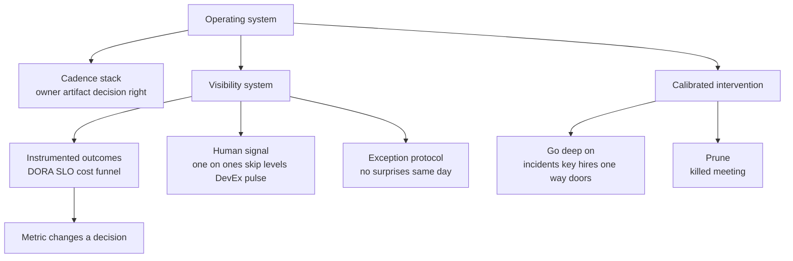

> Every Director loop now runs a "how do you actually run the org" round, barely asked below Director a decade ago, today a hard leveling question. Interviewers are scoring whether you have an **operating system**, not a list of meetings: a cadence where every recurring forum has an owner, an artifact, and a decision right; a visibility layer that catches a slipping migration at week three instead of week twelve; and metrics literacy that has moved from "do you track velocity" to "do you know why story points are a fail and what you'd use instead." There's a hard modern vocabulary bar, DORA, SPACE, DX Core 4, async-written operating systems, cost/AI-ROI inside the review, and a meta-position the strongest candidates state unprompted: **metrics diagnose systems, they never rank individuals.** Both ditches are fatal: activity metrics (LOC, commits, story points) are an instant fail, worse now that AI makes code volume free; metrics-nihilism ("metrics are gamed, I lead by feel") is equally disqualifying.

### Learning objectives
- Describe your **operating system** as a layered cadence stack, staff, metrics review, planning, 1:1s, skip-levels, the incident loop, where **every recurring meeting has an owner, an artifact, and a decision right**, and explain how it changes from 30 to 300 engineers.
- Answer **"how do you know what's happening without micromanaging"** as a three-layer visibility system, instrumented outcomes, human channels, exception protocols, plus calibrated intervention.
- Carry **DORA / SPACE / DX Core 4** as assumed vocabulary, and state the meta-position unprompted: **diagnose systems, never rank individuals**; pair quantitative with DevEx survey data; tie to business outcomes.
- Avoid both ditches, **activity metrics** (LOC, commits, story points) and **metrics-nihilism**, and put **cost-per-request and AI-tooling ROI** inside the review, because Directors own budgets.
- Carry the **killed-meeting** evidence and **one metric-changed-a-decision** story, the two proofs your system is real and pruned, not theater.

### Intuition first
A good pilot doesn't fly by staring out the window. At cruise altitude over an ocean at night there's nothing to see, and "I'll just watch the wings" is how you fly into a mountain. What a pilot runs instead is an **instrument system**: a small panel of the gauges that matter, altitude, heading, fuel, engine temp, scanned on a fixed rhythm, with thresholds that trigger a specific action when a needle leaves its band. The instruments don't fly the plane; they tell the pilot *where to point attention* so the crew can fly the rest. The failure modes map exactly. The pilot who ignores the panel and flies by feel is the Director who says "I hire great people and get out of the way" with no verification layer, not delegation, abdication, and it ends in a crater. The pilot who fixates on one gauge and hand-flies every input is the Director down in the PR queue and the standup, monitoring activity instead of outcomes, too busy reading dials to command the aircraft. The skill is the panel itself: pick the instruments that predict trouble, scan them on a cadence, set thresholds that trigger action, and keep your hands free for the moments that need a human. Interviewers here are checking whether you've built a panel or you're flying by feel.

---

## The questions

This whole cluster is **present-tense "how do you operate"**, so it takes the system-description shape, *not* STAR-L. There's no single past story; there's a system to describe, anchored with one or two pieces of evidence that it's real.

| Variant | What it's really testing |
|---|---|
| "What's your management operating system / cadence? How does it change 30 → 300?" | Whether you have a *layered system* that scales, not a fixed list of meetings. |
| "How do you know what's happening without micromanaging?" | Visibility *without surveillance*, outcomes + human signal + exception protocols. |
| "How do you measure team performance / productivity / health?" | DORA/SPACE/DX-Core-4 literacy *and* the diagnose-systems-not-individuals meta-position. |
| "Walk me through a metric going red and what you did." | That your metrics *drive decisions*, the one proof a number changed an action. |
| "What meeting or process did you kill? How do you ensure predictable delivery at scale?" | Pruning discipline and planning/release-gating mechanics, a system that grows forever is process maximalism, a fail. |
| "How do you measure whether AI tooling is actually paying off?" | Cost/ROI literacy inside the review, bridges to AI-era leadership. |
| "What would your first 90 days here look like?" | Listening tour → diagnosis → install the OS (the near-universal closer). |

The merge: every one is **present-tense system-shape**, so the instrument is the layered-system answer below, describe the stack, then prove it with the killed meeting and the metric-changed-a-decision story. First-90-days is the same system sequenced: listen, diagnose, *then* install.

---

## The framework

The answer is a system in three layers plus calibrated intervention. The shape interviewers reward is **"every recurring meeting has an owner, an artifact, and a decision right"**, say that sentence; it separates an operating system from a calendar.

- **The cadence stack, purpose per layer, not a meeting list.** Weekly leadership staff (decisions and blockers only; *status goes async/written*). Monthly business/metrics review (delivery, reliability, hiring funnel, team health, **cost**). Quarterly planning tied to headcount and budget. Plus 1:1s, skip-levels every six weeks, and the incident/postmortem loop. Each forum names its **owner** (who runs it), its **artifact** (the doc/dashboard it produces), and its **decision right** (what it can decide). A meeting with no decision right is a status meeting, and status should be written.
- **The visibility system, three channels plus an exception protocol.** *Instrumented outcomes:* a DORA-class dashboard, SLO burn, cost per transaction, hiring funnel, read async, discussed only on exceptions. *Human signal:* 1:1s on themes not tasks, skip-levels, a quarterly DevEx pulse, surveys catch what dashboards can't. *Artifacts:* design docs and postmortems you read yourself. *Exceptions:* no-surprises norms, sev-1s, key-person flight risk, any one-way door come to you same-day.
- **Calibrated intervention, name when you DO go deep.** Incidents, key hires, one-way-door decisions, one inspected area per quarter. **Audit depth scales inversely with demonstrated track record**, a new team gets weekly milestone reviews, a proven one a monthly glance. Naming *when* you dive deep is what makes the delegation credible rather than abdication.
- **The two proofs.** A **killed meeting** (the async review made the monthly status all-hands redundant) and a **metric that changed a decision** (a 20-point DevEx drop surfaced a failing manager two quarters before delivery data would have). Without these, the system reads as theory.

The meta-position, stated unprompted: **metrics diagnose systems, they never rank individuals.** Never announce the framework; describe the system, drop the proofs in.

For the **first-90-days** variant, sequence the same system over a clock: weeks 1-30 listening tour (1:1s, delivery and incident data, the artifacts), 30-60 diagnosis and first structural calls, 60-90 install the operating system. Listening is evidenced by *specifics*, not duration, "I spent a quarter listening" reads slow.

---

## 2015 vs 2026: the calibration

This cluster has a hard literacy bar that re-scores every answer. Five shifts separate a current answer from a stale one.

- **DORA / SPACE / DX Core 4 are now assumed vocabulary**, the way "agile" was in 2010. The four DORA keys (deployment frequency, lead time, change-failure rate, time to restore) are table stakes; SPACE and DX Core 4 signal you know throughput alone misses developer experience. But naming them isn't the differentiator, the **meta-position is**: diagnose systems, never rank individuals; pair quantitative with DevEx survey; tie to business outcomes. Reciting acronyms without that stance reads as someone who read a blog post.
- **Activity metrics are an instant fail, and worse now.** LOC, commits, story points as productivity was a fail post-McKinsey-debate; post-AI it's a *crater*, because code volume is essentially free when a model writes the first draft. Source code is a liability, not output. Count artifacts produced rather than outcomes delivered and the round is over. **Metrics-nihilism fails just as hard:** "it's all gamed, I judge by feel" is the equal-and-opposite ditch, hold both truths, metrics are gameable *and* indispensable, which is exactly why you diagnose systems with them rather than rank people.
- **An async-first, written operating system is expected.** RFCs/ADRs, decision logs, templated reviews, status-goes-written. A meeting-dense answer reads as a remote/hybrid failure, "I walk the floor" describes a system that breaks the moment the team is distributed, which it now always is. Management-by-walking-around is obsolete with wide spans and hybrid norms.
- **Cost and AI-ROI live inside the operating review.** Cost per request, cloud spend, and AI-tooling payback now sit in the monthly business review, because Directors own budgets. "I track delivery and reliability" with no cost line reads as someone who's never owned a P&L. The AI-ROI question folds in: can you measure whether the tooling moved lead time, or are you quoting vendor claims.
- **Surveillance is a named red flag, distinct from outcome monitoring.** Monitoring *activity*, keystroke trackers, PR-count leaderboards, time-in-IDE, is an explicit fail: you instrument the system's outputs (lead time, reliability, cost), never the individuals' inputs. And process maximalism (SAFe-heavy, ceremony for its own sake) is as damaging as no system, minimal, metric-anchored, visibly pruned is the bar.

---

## Model answers

### Answer 1: "How do you know what's happening in your org without micromanaging?" (the centerpiece)

> "Three layers plus an exception protocol, and the design principle is that I instrument *outcomes*, never activity, because the second I start counting PRs or watching time-in-IDE I've built surveillance, not visibility, and the team optimizes for the dial.
>
> *(Layer 1, instrumented outcomes.)* A weekly ops review on a one-page dashboard: the DORA four keys, SLO burn, cost per transaction, the hiring funnel. Written and async, thirty minutes of live discussion, only on exceptions, because if a number's in its band there's nothing to say. That dashboard is the panel I scan; it tells me where to point attention, not what to conclude.
>
> *(Layer 2, human signal.)* Manager 1:1s on themes, not task status, status is written, the 1:1 is for what the dashboard can't see. Skip-levels every six weeks, and a quarterly DevEx pulse. The surveys are load-bearing: last year a 20-point drop in one team's developer-experience score surfaced a failing manager two full quarters before delivery data would have. The dashboard is a lagging indicator of a people problem; the survey is a leading one.
>
> *(Layer 3, artifacts.)* I read the design docs and postmortems myself, not to approve them, but to see how the org *thinks*, where the reasoning is sharp and where it's hand-wavy. Cheapest, highest-signal hour in my week.
>
> *(Exception protocol.)* No-surprises norms: a sev-1, a key-person flight risk, and any one-way-door decision come to me same-day. Everything else waits for the cadence.
>
> And I'm explicit about *when* I dive deep, because that's what makes the rest delegation and not abdication: incidents, senior hires, and exactly one inspected area per quarter, last quarter a payments migration, because that's where the quarter could die. Audit depth scales inversely with track record, a new team gets weekly milestone reviews until it's earned the monthly glance.
>
> The test of whether it works: this past year it caught a slipping migration at week three instead of week twelve, off a lead-time trend, and I killed our monthly all-team status meeting because the written review made it redundant, nobody noticed it was gone, which is how you know it was theater. That pruning discipline is the part I'd bring here: removing a meeting is a decision you make on a cadence too."

**Why it scores:**
- **It opens with the surveillance-vs-visibility distinction**, naming and ruling out the 2026 red flag (monitoring activity), which signals current literacy in the first sentence.
- **Every layer has a purpose, an artifact, and a rhythm**, async exception-driven dashboard, themes-not-status 1:1, leading-indicator survey, so it reads as a designed system, not a meeting list; and the 20-point DevEx-drop story is the metric-changed-a-decision proof, probe-resistant (the quantify rule, honored in a behavioral answer).
- **It names *when* it goes deep**, incidents, key hires, one inspected area per quarter, converting "delegation" into something verifiable, the line between trust and abdication.
- **It carries both proofs**, the week-three migration catch and the killed status meeting, closing on pruning discipline, the evidence interviewers check that the system is real and maintained.

### Answer 2: "How do you measure engineering team performance? And a metric just went red: what did you do?" (literacy + the intervention)

> "First, the stance, because it determines everything else: **metrics diagnose systems, they never rank individuals.** The moment a DORA number is used to stack-rank engineers it gets gamed and people stop trusting the instrument, so I use it to find where the *system* is slow, never who is. The panel is the DORA four keys for flow and stability, paired with a DX-Core-4-style DevEx survey for the half throughput metrics can't see, friction, focus time, confidence in the codebase, all tied to a business outcome, because lead time that doesn't connect to revenue or cost is a vanity number. What I refuse to count is activity: lines of code, commits, story points. A weak proxy in 2015, actively misleading now that AI writes the first draft, code volume is free, and source code is a liability, not output.
>
> The red-metric story: our change-failure rate climbed from ~8% to 15% over two months, stability degrading while deployment frequency held, the signature of a system shipping faster than its safety net. I did *not* hunt for which team 'caused' it, that's the stack-rank trap. I treated it as a system question: where did the safety net thin out? Two teams had ramped AI-assisted code generation hard and review practice hadn't caught up, more change, same review rigor, so defects leaked. The fix was systemic: a human-review gate on AI-authored diffs, a labeling convention so reviewers knew what they were looking at, and a DevEx-survey baseline so the gate didn't just add friction. Change-failure rate came back under 10% within a quarter and lead time held. The metric didn't tell me who to blame; it told me *where the system was under-built*, which is the only way I let these numbers be used."

**Why it scores:**
- **It leads with the diagnose-systems-not-individuals meta-position**, stated unprompted, the highest-signal move in this cluster, and explains *why* (gaming + trust collapse), then pairs DORA with DevEx survey, ties to a business outcome, and rejects activity metrics with the AI-era reasoning (code volume is free): the exact 2026 literacy bar.
- **The red-metric story is a real intervention with numbers** (8% → 15% → under 10%, lead time held), and the fix is *systemic*, a review gate, not "I found the team responsible", the meta-position demonstrated in action.
- **It bridges to AI-ROI cleanly** (the change-failure climb was an AI-rollout side effect the system caught), showing the cost/AI lens lives inside the operating review.

---

### What interviewers probe here

- **"Give me a meeting you killed, and how you knew it was safe to."**, *Strong:* a specific forum removed because an artifact made it redundant (the async review replacing the status all-hands), "nobody noticed" as the evidence. *Red flag:* no killed meeting, a system that only adds is process maximalism, and you'll bloat the calendar here too.
- **"How would you use DORA to find your weakest engineers?"**, *Strong:* you wouldn't, that's the stack-rank trap; DORA diagnoses where the *system* is slow, individual performance runs through 1:1s and calibration, not a flow dashboard. *Red flag:* taking the bait and ranking people by a team-level metric (or naming LOC, commits, or velocity as a productivity measure, an instant fail, harder post-AI).
- **"How does the OS change from 30 to 300 engineers?"**, *Strong:* more goes async/written, the cadence adds a manager-of-managers layer and a metrics review, and *more* gets delegated with the exception protocol carrying the load, flatter on your calendar, not denser. *Red flag:* the same meetings, just more of them, or "I'd hire a chief of staff" with no system change.
- **"How do you know your AI tooling is paying off?"**, *Strong:* it's in the operating review, lead time and change-failure rate before/after, not acceptance rate or LOC, with cost per transaction tracked. *Red flag:* Copilot acceptance rate or commit volume as the ROI proof, or no measurement at all.

---

### Common mistakes

- **A list of meetings with no decisions attached.** A cadence is not an operating system. Every recurring forum needs an owner, an artifact, and a decision right, a meeting that only shares status should be a written doc.
- **"I hire great people and get out of the way" with no verification layer.** The abdication ditch, delegation without a visibility system is flying by feel. The fix is the three channels and the exception protocol that let you trust *and* verify.
- **Activity metrics as productivity, or metrics-nihilism.** LOC, commits, story points, velocity as productivity is an instant fail (worse post-AI); "metrics are gamed, I lead by feel" is the equal-and-opposite fail. Hold both truths: metrics diagnose systems, feel is one input. And monitoring *activity*, keystroke trackers, PR leaderboards, time-in-IDE, is surveillance, a named red flag distinct from instrumenting outputs.
- **No killed meeting and no metric-changed-a-decision story.** Without the two proofs the system is theory, and a system that never shrinks is as damaging as no system at all.

---

### Practice prompts

1. **Describe your operating system, then prove it.** "What's your management operating cadence?" *(Sketch: the layered stack, staff for decisions, monthly metrics review with a cost line, quarterly planning, 1:1s/skip-levels/incident loop, each with owner, artifact, decision right; then the visibility three channels + exception protocol; close with the killed meeting and the metric-changed-a-decision proof. Say the "owner, artifact, decision right" sentence aloud.)*
2. **Walk a red metric to a systemic fix.** "Your change-failure rate doubled, go." *(Sketch: diagnose-systems-not-individuals, 'where did the safety net thin,' not 'who broke it'; a real cause, a systemic fix (a review gate, not a person), the recovery number with lead time held. State the meta-position explicitly.)*
3. **Defend your metrics stance against a nihilist.** "Aren't all engineering metrics just gamed?" *(Sketch: hold both truths, gameable *and* indispensable, which is why you diagnose systems, never rank people; pair DORA with DevEx survey, tie to business outcomes, reject activity metrics with the AI-era reasoning; and note the 30 → 300 scaling answer is *flatter* not denser, more async, more delegated to the exception protocol. Land between recitation and nihilism.)*

---

### Key takeaways
- **An operating system is layered, not a meeting list:** a cadence stack where every forum has an **owner, an artifact, and a decision right**; a three-channel visibility system (instrumented outcomes + human signal + exception protocol); and calibrated intervention where you *name when you go deep* (incidents, key hires, one inspected area per quarter).
- **Visibility without micromanaging = instrument outcomes, not activity.** Async DORA dashboard, themes-not-status 1:1s, skip-levels, a DevEx pulse that catches people problems two quarters early, postmortems you read yourself. Surveillance (keystrokes, PR leaderboards) is a named fail.
- **The metrics meta-position, stated unprompted: diagnose systems, never rank individuals.** DORA/SPACE/DX-Core-4 are assumed vocabulary; pair quantitative with DevEx survey, tie to business outcomes. Both ditches fail, activity metrics (LOC, commits, story points, worse post-AI) and metrics-nihilism.
- **Cost and AI-ROI live inside the operating review.** Cost per transaction in the monthly review; AI tooling measured on lead time and change-failure rate, never acceptance rate or LOC. Directors own budgets.
- **Carry the two proofs:** a **killed meeting** (a system that only grows is process maximalism) and a **metric that changed a decision**, without them the system is theory. First-90-days is the same OS sequenced: listen with specifics, diagnose, then install.

> **Spaced-repetition recap:** Your operating system is a **leveling question** scored on whether you have a *system*, not a calendar. Answer in **system-shape**: a **cadence stack** (every meeting has an owner, an artifact, a decision right; status async/written), a **visibility system** (instrumented outcomes + human signal + exception protocol), and **calibrated intervention** (name when you go deep). Meta-position, said unprompted: **metrics diagnose systems, never rank individuals**, DORA/SPACE/DX-Core-4 paired with DevEx survey, tied to business outcomes. **Both ditches fail:** activity metrics (LOC/commits/story points, worse post-AI) and metrics-nihilism. Put **cost and AI-ROI inside the review**. Carry the two proofs: a **killed meeting** and a **metric that changed a decision**. Surveillance ≠ visibility.

---

*End of Lesson 15.8. The operating system is how you run the org day to day; the next lesson takes the same instruments into the crucible, execution under pressure, where the dashboard you built here is what lets you see the slip at week three instead of week twelve, and the exception protocol gets the sev-1 to your desk in time to command it.*
