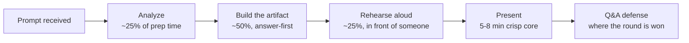

> Somewhere in most Director loops, the talking stops and someone asks you to write. A one-pager presented to a panel, a two-page narrative read in silence, a 30-60-90 plan defended to the leadership team. The round exists because writing is the one format where sloppy thinking has nowhere to hide, and in 2026 it doubles as the anti-AI filter: the artifact may be drafted with help, so the score has shifted to the live defense. Five formats, one craft: answer first, compress hard, survive the Q&A.

### Learning objectives
- Recognize the **five written-round formats** (project one-pager plus presentation, take-home writing exercise, document-of-significance, 30-60-90 plan, strategy case) and what each one scores.
- Build any artifact **answer-first**: recommendation in the first sentence, two to four supporting arguments, data underneath, and an operational close (rollback and verification).
- Present at Director altitude, where every technical point carries its **business rationale and a measurable result**, because the written round is explicitly used for leveling.
- Run the **Q&A defense**: pause, never bluff a number, reframe hostile questions, and treat the mid-presentation constraint change as the test it is.

### Intuition first
An artist's render versus a structural engineer's load calculation. A slide deck can be a render: beautiful, persuasive, and physically impossible, because the picture hides the joints. A written narrative is the load calculation, every assumption visible, every joint holding a stated weight, and that is precisely why doc-culture companies force the format: complete sentences make it hard to hide thinking that does not connect. This lesson teaches you to produce the calculation, not the render, and then to stand next to it while a panel leans on every joint. The artifact gets you into the room; the leaning is the round.

---

## The five formats and what each one scores

| Format | Who runs it | Mechanics | What is actually scored |
|---|---|---|---|
| **Project one-pager + presentation** | Stripe (Staff+/EM (engineering manager)), doc-culture companies | ~1,000 words on a project you led, written ahead; ~20-min presentation; heavy Q&A; panel deliberately mixes one staff engineer with one junior note-taker | Written and verbal clarity, business impact (used for **leveling**: pure mechanics gets down-leveled), adaptability when they change a constraint mid-round, cross-team influence |
| **Take-home writing exercise** | Amazon (L6+), narrative-culture loops | Two prompts, pick one; ~2 pages in ~48 hours; **no slides**; graphs go in an appendix | "Clarity of thought and expression": complete answer, coherent organization, visible effort; STAR (Situation, Task, Action, Result) structure with quantified results |
| **Document of significance** | Startup VP/Head-of-Eng loops, exec search | Prompt shared ahead; doc or deck, presented to the leadership team; one variant is **built live in ~30 minutes** with the panel interjecting | Managing upward, structured argument under ambiguity, reasonable assumptions stated as assumptions |
| **30-60-90 plan** | Director/VP capstone round, cross-industry | Build and present a first-90-days plan: learn (1-30), diagnose (31-60), act (61-90) | Ramp judgment and the **quality of the questions you ask**; realism of the one or two named early wins |
| **Strategy case** | Coinbase (explicit), consulting-style exec loops | A business or technical-strategy prompt with prep time, presented to a group | The framework used to reach the answer, not just the output; org design and build-vs-buy judgment, never component architecture |

Two cross-cutting facts. The **mixed-seniority audience is a feature**, not an accident: you are being checked for legibility to a peer and to someone junior at the same time, so an answer pitched only at the senior reader fails half the room. And at Director altitude the "system design" inside these rounds is **org design and technical strategy**, portfolio decisions and manager-of-manager moves, not boxes and arrows.

## The craft: answer-first, compressed, operational

**Answer-first is the load-bearing rule.** The structure is a pyramid: one conclusion at the top, two to four key arguments under it, grouped data under each. Execs read the first sentence, decide whether to trust you, then sample. The memo frame is SCQA (Situation, Complication, Question, Answer) with the Answer promoted to the opening line, the same instrument the exec-comms shape uses in spoken form. For decks, apply the **slide-title test**: reading only the titles top to bottom must tell the entire story, which means each title is an assertion ("Buying cuts time-to-value from 9 months to 6 weeks"), never a label ("Vendor comparison"). One idea per slide, the load-bearing number visually marked.

**Compression is the test, not a constraint on it.** Stripe's single page and Amazon's two pages are deliberate: anyone can be clear in ten pages. Prose beats bullets for narrative memos because complete sentences expose logic gaps that bullets hide, which is the point of the format. Tables and graphs go to an appendix; the body stays an argument.

**Altitude decides your level.** Every technical decision in the artifact carries its business rationale and a measurable result: "we re-architected the ingestion path" is an IC sentence; "we re-architected ingestion, which took onboarding a new market from 6 weeks to 4 days and unlocked the LATAM launch" is a Director one. Interviewers state this bluntly: candidates who cannot communicate business impact get down-leveled from this round specifically. Alternatives you rejected belong in the artifact too, with why, because the panel scores the decision framework, not the decision.

**End operational.** Any design or strategy artifact closes with a rollback plan and a verification strategy, how you would know it is working and how you would back out. It is one short section and it reads as operational maturity, the thing renders never show.

**Budget the prep honestly:** roughly a quarter on analysis, half on building, and a quarter on rehearsal, with the core walkthrough compressed to 5-8 spoken minutes. Rehearsal is not optional polish; delivery dominates how the room scores the content, and the only way to find the questions that will rattle you is a live mock. For every question that does, write the recovered answer at 60 seconds or less and drill it.

### Worked example: the build-vs-buy one-pager, compressed

Skeleton of a scoring one-pager (observability platform, ~200 words), try drafting yours first

**Line 1 (the answer):** "Recommendation: buy (Datadog, committed-use), revisit at ~$2.4M annual spend, and I need a decision by March 15 to hit the Q3 compliance deadline."

**Argument 1 (time-to-value):** self-hosting the open-source stack costs ~3 engineers for 6 months before parity ($900k loaded, 6 months of compliance exposure); the vendor lands in 6 weeks.

**Argument 2 (true cost curve):** at our volume (40 TB/month ingest) the vendor is ~$70k/month; the crossover where build wins is ~3x today's volume, roughly 2027 at current growth, hence the revisit trigger, stated as a number, not a vibe.

**Argument 3 (risk, named honestly):** vendor lock-in is real; mitigation is OpenTelemetry-standard instrumentation so the exit cost is a backend swap, not a re-instrumentation.

**Rejected alternative:** build on ClickHouse + Grafana, rejected now because observability is not where we differentiate, and the 3-engineer team it needs forever is the hidden line item most build cases omit.

**Operational close:** rollout by team in 3 waves, success = MTTR (mean time to recovery) down 30% by Q4, rollback = dual-write instrumentation for the first 90 days.

The whole document argues in numbers, names its rejected option, and ends with verification. That is the calculation, not the render.

---

## The Q&A defense: where the round is won

The artifact earns you a hearing; the score moves during questioning. Five mechanics:

- **Pause two seconds before answering.** It reads as consideration, not weakness, and it buys your first sentence its structure.
- **Never bluff a number.** "I don't have that exact figure; the related number I do know is X, and I'll get you the precise one today" beats an invented statistic every time, because exec panels have tuned detectors and one caught fabrication contaminates the whole loop.
- **Reframe hostile questions before answering.** "If I understand correctly, you're asking whether the timeline survives a vendor slip", restated neutrally, strips the heat and hands you the framing.
- **Bridge back to the message.** Short answer first, then "the thing that matters for the decision is...", one bridge per answer, not a filibuster.
- **Treat the moved goalpost as the test.** Stripe's signature move is changing a constraint mid-Q&A ("assume the budget is halved"). The failure mode is defending the original as if attacked; the pass is reasoning openly about the new trade-off, because adaptability is the dimension being scored, not consistency.

## 2015 vs 2026: the calibration

In 2015 the written round lived mostly at Amazon and in consulting-style loops; everywhere else, talking was the whole interview. Two forces spread it. Doc culture won at the companies that scaled best, and after 2023, **AI made polished verbal prep cheap**, so loops added formats where the thinking has to happen in front of witnesses. The 2026 consequence: assume the panel assumes your artifact had AI help (some companies now explicitly allow it), which means the artifact alone proves little and the **live defense carries the score**. Practically: never submit a document containing a claim, number, or trade-off you cannot expand three levels deep out loud, because the Q&A is designed to find the layer where the document stops being yours. The efficiency era also sharpened content expectations: a 30-60-90 that spends money in week two, or a strategy case with no cost line, reads as a 2019 answer in a 2026 room.

---

### What interviewers probe here

- **"Where did this number come from?"** *Strong:* the assumption chain, stated aloud, with the source named. *Red flag:* precision with no visible arithmetic, the render giveaway.
- **The constraint flip.** *Strong:* re-derives the recommendation from the new constraint, and says plainly if the answer changes. *Red flag:* defending the original document as if the question were an insult.
- **The junior-audience check.** *Strong:* the note-taker could reconstruct your argument from your talk. *Red flag:* jargon density that only the senior panelist can follow, legibility is the scored skill.
- **"Why only two wins in your 90-day plan?"** *Strong:* "because I don't yet know what I don't know; the listening tour is what makes the wins the right ones", ramp judgment stated as judgment. *Red flag:* a reorg or a rewrite promised in the first 30 days.
- **The effort check.** Amazon's is explicit: a writing sample dashed off in 30 minutes is visible, and it scores as disrespect for the format. *Strong:* an artifact that is clearly the product of hours, then defended lightly, like it was easy.

---

### Common mistakes

- **Building the render.** A beautiful deck whose titles are labels, whose numbers have no chain, and whose risks section is decoration; the panel's first "why" collapses it.
- **Chronological structure.** Starting with background and building to the recommendation buries the answer; senior readers stop before you arrive. Answer first, always.
- **Treating the artifact as the deliverable.** The Q&A is the deliverable; a document you cannot defend three levels deep is a liability you authored yourself, especially in 2026 when AI drafting is assumed.
- **Over-promising in the first 30 days.** The 30-60-90 that restructures the org in week three reads as arrogance, not energy; front-load listening, name one or two wins, tie them to relationships built.
- **Skipping rehearsal.** The single highest-leverage hour of prep is a live mock with someone instructed to push back; every rattled answer found there is one that will not rattle you in the room.

---

### Practice prompts

1. **The managing-up memo.** Write a one-page memo to your CTO proposing one initiative with its investment, graspable in 90 seconds. 

Model answer, try yours out loud first

Structure: ask in sentence one ("I'm asking for 4 engineers for two quarters to build X; it returns Y"). Then SCQA compressed: the situation in one line, the complication in one (what breaks if we do nothing, with a number), the answer expanded in three short arguments (value, cost, risk-with-mitigation), the rejected alternative in one line, and an operational close (how we will know by when, and the exit if wrong). Under 400 words. The test of success: your CTO can repeat the ask and the return to *their* boss without re-reading.

2. **The Amazon-style narrative.** Two pages on the most inventive thing you have led: problem, why it mattered, your specific actions, measurable result. 

Model answer, try yours out loud first

STAR in prose, proportions like the spoken version: one paragraph of situation with stakes quantified, the body on your decisions including the alternative you rejected and why, and a results section with at least three numbers (the outcome, the counterfactual cost, the durable mechanism it left behind). Name the Leadership Principle you are demonstrating without ceremony. Graphs in an appendix. Then the 48-hour discipline: draft on day one, cut 30% on day two, because the compression pass is where the "clarity of thought" score is actually earned.

3. **The 30-60-90 defense.** Build the plan for a Director role at a company you know, then have a partner challenge "why so slow?" 

Model answer, try yours out loud first

The plan: days 1-30 listening tour (every direct, key peers in product and sales, skip-levels, the last three postmortems, the budget), days 31-60 diagnosis shared in writing with your manager (what is strong, what is broken, what is ambiguous), days 61-90 one or two wins (an unblocked delivery, a filled key role) plus the operating cadence installed. The defense of "why so slow": "the expensive failure mode at this level is confidently fixing the wrong thing; the two wins I do commit to are chosen precisely because they will still be right whatever the diagnosis says." That sentence, delivered calmly, is the round.

4. **Defend-your-design under fire.** Present a past architecture decision to a panel briefed to push hard; drill pause, reframe, bridge on every challenge. 

Model answer, try yours out loud first

Pick a decision with a real rejected alternative and one known weakness. Present in 6 minutes, answer-first. The drill is in the responses: two-second pause before each answer; one deliberate "I don't know that number, here's the adjacent one I do"; one reframe of the most aggressive question; and when the panel flips a constraint ("now assume 10x traffic"), reason forward from the new world instead of defending the old one, out loud, showing the joints. Score yourself on recovery quality, not on never being hit.

---

### Key takeaways
- **Five formats, one craft.** One-pager, writing exercise, document-of-significance, 30-60-90, strategy case: all score answer-first structure, quantified arguments, visible assumptions, and an operational close.
- **Compression is the test.** One or two pages is the format's way of asking whether you can rank your own arguments; ten clear pages is easy and worthless.
- **Altitude sets your level.** Business rationale plus measurable result on every technical point, and rejected alternatives shown; mechanics-only artifacts get down-leveled from this round specifically.
- **The Q&A is the round.** Pause, never bluff a number, reframe hostility, bridge back, and welcome the moved goalpost; in 2026 the live defense outweighs the artifact because AI drafting is assumed.
- **Rehearse like it counts.** A quarter of prep time on a live mock; every question that rattles you gets a written 60-second recovery answer.

> **Spaced-repetition recap:** The written round is the load calculation, not the render: answer in sentence one, a pyramid of 2-4 arguments over data, assumptions and rejected alternatives visible, rollback and verification at the end, compressed to the page limit because compression is the test. Present a 5-8 minute core, then win the Q&A: pause two seconds, never invent a number, reframe then answer, bridge back, and reason openly when they flip a constraint. 30-60-90s front-load listening and promise only two wins. In 2026 the artifact is assumed AI-assisted; the three-levels-deep live defense is what is actually scored.

---

*End of Lesson 17.17. The four frameworks gave you spoken shapes; this round asks for the same discipline in writing, then tests whether you can stand next to the document while the room leans on it. The final lesson in the loop's arc covers what happens when the interviewing flips: the questions you ask them, and the offer that follows.*
