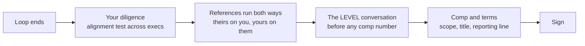

> The loop does not end when they stop asking questions. Your questions are scored as signal, the level you accept moves more money than any negotiation ever will (the Director-versus-one-below gap runs $450k to $650k a year at big tech), and at this altitude references get run on you whether you prepare them or not. This lesson covers the final act: due diligence by target, the alignment test, reading and contesting a down-level, and closing on scope and terms while you still have leverage. After day one, you are standard HR process.

### Learning objectives
- Run a **scored reverse interview**: sharp questions per target (founder, future boss, peer execs, the team, the board), and the **alignment test** that catches top-level dysfunction before you sign.
- Ask the **capital-structure questions** that gate startup compensation (shares outstanding, valuation, preferences, runway), and treat deflection as the red flag it is.
- Read the **leveling decision**: what Director maps to across companies, why down-leveling is structural rather than performance-based, and the level-first sequence for contesting it.
- Prepare for **references run on you** (back-channels, reports weighted, two jobs back), and negotiate the close where the leverage is: **scope, title, reporting line, and terms**, not just the number.

### Intuition first
Joining as a Director is a merger, not a purchase, and mergers run diligence in both directions. The acquirer who asks only "what's the culture like?" before wiring the money is the acquirer who discovers the liabilities after close; the seller, meanwhile, is quietly grading the diligence itself, because sloppy questions mark a naive counterparty and sharp ones mark a peer. Everything in this lesson is deal mechanics: the diligence checklist (your questions), the quality-of-earnings check (capital structure), the valuation fight (leveling), the counterparty's diligence on you (references), and the deal terms (the close). Sign well and the merger starts healthy; skip the diligence and no first-90-days plan will save it.

---

## Your questions are scored

Interviewers read candidate questions as data: how you think, what you value, whether you have actually modeled the role. Generic questions ("what's a typical day like?") read as junior; at Director level they read as someone who has not done the work. The upgrade pattern is always the same, move from ambient curiosity to a question only an operator would ask:

| Weak (ambient) | Strong (operator) | What the strong version reveals |
|---|---|---|
| "What does success look like?" | "What outcomes would you want this role driving in the first six months?" | You think in outcomes and time horizons |
| "How does the team work together?" | "How do decisions get made when priorities compete?" | You probe decision rights, not vibes |
| "What are the biggest challenges?" | "What tends to be hardest for people stepping into this role?" | You are modeling failure modes, including your own |

And the single highest-yield technique costs nothing: **the alignment test**. Ask the CEO, your future boss, the peer execs, and (if you get one) a board member the *same* question, "what problems do you want to solve by hiring me?", and compare the answers afterward. Aligned answers mean a real mandate. Divergent answers mean you are about to inherit a fight between your bosses that the loop was hiding, and it is the most common discoverable cause of the 12-to-18-month exec washout.

## The diligence checklist, by target

**The founder/CEO.** Strategy and candor: where is the company in five years, why do you win and lose deals, why do you lose employees, and the one that separates confident founders from fragile ones, "what is the most likely way this company fails?" A founder who can answer that calmly is a founder you can bring bad news to.

**The capital-structure block (startups, non-negotiable before signing).** Total shares outstanding, last-round valuation and the latest 409A (the independent fair-market-value appraisal that prices your options), liquidation preferences and participation rights, monthly burn and runway, ARR (annual recurring revenue) against plan. Without these, an equity grant is a number without units; 1% of what, ahead of whom, with how many months of life? **Deflection on any of these is itself the answer**: a company that will not tell you the share count is obfuscating your compensation, and the diligence has just returned its finding.

**Your future boss.** Describe the ideal candidate; why hasn't this been filled from within (the answer maps the internal candidate you may be inheriting as a rival); how often do you release; what was engineering attrition last year and why; what separates your good days from bad ones. The last one tells you what actually lands on this person's desk, which is what will land on yours.

**Peer execs (product, sales, finance).** What is on your wishlist from engineering; who do we lose deals to and why; what percentage of reps hit quota the last two quarters. The quota question is the quality-of-earnings check in miniature: a sales org at 30% attainment means the growth story you were sold in the loop is aspiration, not trajectory.

**The team you would inherit.** Ask to meet them before signing; strong companies say yes. What are the challenges, who left recently and why, what do new joiners struggle with, and the artifact question: "can you show me a non-trivial code review?" One real review thread reveals the quality bar, the tone, and the deploy maturity better than any claim in the loop.

**Red flags, consolidated:** divergent answers on the alignment test; capital-structure deflection; leaders trash-talking former employees; unexplained senior turnover; an instant hard "no" to any negotiation ask; "we're a family"; and, at the other end, a loop with no rigor at all. That last one deserves emphasis: a **vibes-only exec hiring process is itself a red flag**, because it means the peers alongside you were hired the same way. Welcome the back-channels and working sessions; be suspicious of their absence.

---

## Leveling: the decision worth more than the negotiation

Titles do not map cleanly across companies. Approximate equivalences (community-sourced; none of this is officially published, treat it as orientation, not gospel): a Director sits around Google L8, Meta D1, Amazon L8; Senior Director around Google L9, Meta D2 (Amazon has no L9, it jumps to L10). The same title also spans wildly different scope across companies, one company's Principal covers 20 engineers, another's covers 4,000, which is why the interviewer's first leveling read comes from the **scope in your stories**, not your business card.

The money at stake dwarfs negotiation. The gap between Director and one level below runs roughly **$650k a year at Google, $600k at Meta, $475k at Amazon, $450k at Microsoft**, more than a million dollars over two years, which is 10x to 20x what a hard comp negotiation at a fixed level typically moves. And here is the uncomfortable mechanic: down-leveling is usually **structural, decided before you ever walked in**, driven by title inflation between company tiers, compensation-band politics, and borderline signals rounding down, not by how you interviewed on the day.

Two consequences. First, **prevention lives inside your stories**: every Situation opens with scope and impact quantified (org size, budget, the decision that was yours), because the level packet is assembled from those numbers. Second, if the offer comes in low, **fight the level before you discuss anything else**. The sequence is level → comp → start date → paperwork; the moment you negotiate salary you have implicitly accepted the level. Say it plainly ("this isn't the level I'm targeting; what signal was missing?"), which forces a re-read of the packet; the strongest lever is a competing offer at the target level from a same-tier company; and the last lever is the willingness to walk, because a level accepted wrongly compounds for years, in scope, in refreshers, and in every future external mapping of your title.

## The references they run on you

At this level, expect a **Larson-grade reference process**: three or four people who worked with you directly over an extended period, back-channels beyond your provided list, calls reaching **two jobs back** (the references you did not curate), and **former reports weighted heaviest**, because how a leader treats people only shows from below. The probes are behavioral: how did they handle personalities unlike their own, what would their detractors say, can they build a *manager* bench, who did they promote and who left and why, would you work for them again, and the quiet killer, "have they reached their peak?" Reference-callers are listening for **themes, not incidents**, and for self-awareness gaps between how you described events and how the references do.

Preparation is legitimate and expected: pre-brief your referees on the role's scope so their examples land at the right altitude, include a report, a peer, and a boss, and, the senior move, include **someone you managed out who would still take the call**, because that reference is unfakeable. The etiquette norm runs both ways: a serious company tells you before it back-channels off-list; a company that ambushes your current employer's grapevine has told you something about how it will treat you as an employee.

## The close: scope and terms before money

Maximum leverage exists in the window between offer and signature; after day one you are standard HR process. Spend the leverage in this order:

1. **Scope, title, reporting line.** Pin the title, who you report to, and the responsibilities in the written agreement; vague duties are how roles get quietly shrunk. If the title you want is not available now, negotiate a **promotion trigger with written criteria and the next level's compensation pre-baked into the offer**, a dated review against named outcomes, not a verbal "we'll revisit." Secure the headcount and budget that make the charter real, or the title is decoration.
2. **The equity mechanics nobody volunteers.** Ask explicitly about **refresher grants** (amount and timeline; recruiters reliably underspecify them, and at big tech refreshers are where long-tenure comp actually lives), sign-on clawback terms (negotiable), and vesting acceleration on change of control. At a startup, revisit the capital-structure block above; then calibrate the grant against stage norms: day-one exec equity runs roughly **0.8-2% fully diluted at seed, 1-2% at Series A, 0.5-1.5% at Series B, 0.3-0.8% at Series C+** (VP-level, compressing as valuation rises).
3. **Downside protection.** Severance is a standard executive term, roughly six months at VP level, and asking for it signals sophistication, not pessimism; same for a bonus floor and a narrowed non-compete. The operating rule from every exec-comp practitioner: everything is negotiable, and nothing you do not ask for arrives on its own.

**2015 vs 2026 calibration:** the leverage backdrop flipped. Post-ZIRP, median senior-leadership packages softened (one 2025 survey has VP-plus on-target earnings down roughly 13% year over year, a sales-weighted but directionally right number) and the flattening era means fewer Director seats per company, so down-level pressure is up and the walk-away threat is weaker than your 2021 memory of it. The response is not to accept less; it is to run *more* diligence (company quality variance has widened, especially among AI-boom startups), fight the level harder because seats are scarcer, and weight downside terms (severance, acceleration, refresher schedules) more than the headline number, because in a softer market the terms are where offers actually differ.

---

### What interviewers probe here

- **"What questions do you have for me?"** *Strong:* two or three operator questions calibrated to this interviewer's seat, and a follow-up that builds on their answer. *Red flag:* "I think you've covered everything", read as no model of the role.
- **"What level are you targeting?"** *Strong:* a direct answer anchored in scope ("Director-level scope, an org of 40-plus and a seat at the planning table; title matters less than the mandate"). *Red flag:* "whatever you think is fair", the sentence that pre-accepts the down-level.
- **The negotiation-behavior watch.** How you negotiate is treated as a preview of how you will negotiate *for the company*. *Strong:* firm, specific, warm, and fast to converge once terms are met. *Red flag:* grinding for weeks over 2% while ignoring scope, or folding instantly.
- **"Who should we talk to about you?"** *Strong:* a balanced slate named without hesitation, including a former report, with context on each. *Red flag:* bosses only, or visible discomfort at the idea of back-channels.
- **Your diligence, observed.** Asking the founder the failure-mode question or the CFO the quota question is itself scored. *Strong:* the room remembers the question. *Red flag:* questions answerable by the careers page.

---

### Common mistakes

- **Interviewing right up to the offer, then going passive.** The offer window is where a Director's judgment is cheapest to demonstrate and most expensive to skip; treat the close with the same rigor as the loop.
- **Talking money before level.** Any comp conversation implicitly accepts the level on the table; run the sequence level → comp → start → paperwork, always.
- **Signing startup equity without the capital-structure block.** A percentage without share count, preferences, and runway is not a number; and deflection on those questions is a finding, not an inconvenience.
- **Curating only upward references.** A slate of former bosses reads as hiding from the view below; the report who would still take the call, including one you exited well, is the highest-signal reference you can offer.
- **Negotiating only the headline number.** Scope, reporting line, refreshers, severance, and acceleration move more long-run value than base salary at this level, and in a soft market they are where offers genuinely differ.

---

### Practice prompts

1. **Build your alignment-test plan for a live process.** Pick the question, list who you will ask, and define what divergence would make you walk. 

Model answer, try yours out loud first

The question: "what problems do you want to solve by hiring me?" asked verbatim to the CEO, the CTO (future boss), the CPO, and the board member in the final round. Log each answer the same evening. Convergence looks like a shared theme with different vocabulary (say, delivery predictability). Walk-grade divergence: the CEO wants speed, the CTO wants quality discipline, and the CPO wants engineering "to stop saying no", three mandates that cannot be held simultaneously, and whichever one hired you loses to the other two within a year. Softer divergence (same theme, different first priority) is negotiable: surface it in the offer conversation and ask the CEO to arbitrate the ranking before you sign, which is itself a test of how conflicts will get resolved later.

2. **Run the capital-structure conversation with a founder, out loud.** Practice asking for shares outstanding, valuation/409A, preferences, and runway without apologizing. 

Model answer, try yours out loud first

Framing beats bravado: "Before I can evaluate the equity, I need the same four numbers any exec candidate needs: fully diluted share count, the last round's valuation and current 409A, the preference stack, and runway at current burn. Happy to sign an NDA." Then silence. A serious founder answers in five minutes or sends the deck. If the answer is "we don't share that," the response stays warm and final: "then I can't price the grant, so let's talk about what you *can* share." Practicing it aloud matters because the failure mode is not asking wrong, it is not asking at all, and folding here previews folding in every budget negotiation the role will ever contain.

3. **Rehearse the down-level conversation.** The recruiter says "we're bringing you in one level below, comp will still be strong." Respond. 

Model answer, try yours out loud first

"Before we discuss the package: the level. I'm targeting Director because that is the scope I run today, a 45-engineer org, a $9M budget, and the architecture decisions I walked the panel through. Help me understand what signal was missing, because I would rather address that than negotiate around it." That does three things: refuses the implicit acceptance, forces a packet re-read, and stays collaborative. If the answer is band politics rather than signal, the honest levers are a same-tier competing offer at the target level, or the walk, said without heat: "then we may be mistimed; the level compounds in scope and refreshers, and starting a level down costs more than this offer can make up." Never negotiate the salary until this conversation has ended, one way or the other.

4. **Write your reference slate.** Name a boss, a peer, two reports (one you exited), pre-brief notes for each. 

Model answer, try yours out loud first

For each name, three lines: the relationship and dates; the two stories they can speak to at the right altitude (pre-briefed, not scripted: "the payments turnaround and the reorg, with scope numbers"); and the honest weakness they will name if asked, because a reference with no critique reads as coached, and reference-callers explicitly fish for what detractors would say. The exited report gets a fourth line: confirm they will take the call, and let them tell the termination story unprompted; that story, told fairly by the person it happened to, outweighs every upward reference on the slate.

---

### Key takeaways
- **Your questions are scored.** Operator-grade diligence questions, capped by the alignment test asked identically across execs, are signal you cannot fake and the cheapest differentiation in the loop.
- **At a startup, capital structure is not optional.** Shares, valuation/409A, preferences, burn; a grant without them is a number without units, and deflection is the finding.
- **The level is the negotiation.** The Director-vs-one-below gap runs $450-650k a year; down-leveling is structural and pre-decided, so prevent it with scope-first stories and contest it level-first, before any comp number.
- **References run on you, from below.** Expect back-channels two jobs back with reports weighted heaviest; offer the slate that includes someone you managed out, and welcome rigor as a sign of the peers you are joining.
- **Close on scope and terms.** Title, reporting line, promotion triggers with criteria, refreshers, severance, acceleration; in the post-ZIRP market the terms, not the headline, are where offers differ, and after day one the leverage is gone.

> **Spaced-repetition recap:** The final act is a two-way merger. Diligence: operator questions per target, the alignment test ("what problems do you want to solve by hiring me?") across CEO, boss, peers, board, divergence = the washout you are signing up for; at startups, the capital-structure block (shares, 409A, preferences, runway) or no equity conversation. Leveling: Director ≈ Google L8 / Meta D1 / Amazon L8 (approximate), the one-level gap = $450-650k/yr, down-leveling is structural, fight it level → comp → start → paperwork. References: back-channels, two jobs back, reports weighted; slate includes an exited report. Close: scope, title, reporting line, promotion triggers, refreshers, severance, acceleration, before day one, because after it you are standard HR process.

---

*End of Lesson 17.18. This closes the leadership track end to end: the frameworks, the portfolio, the category clusters, the calibration, the drills, the written round, and now the two-way finale, the diligence you run, the level you defend, and the terms you sign.*
