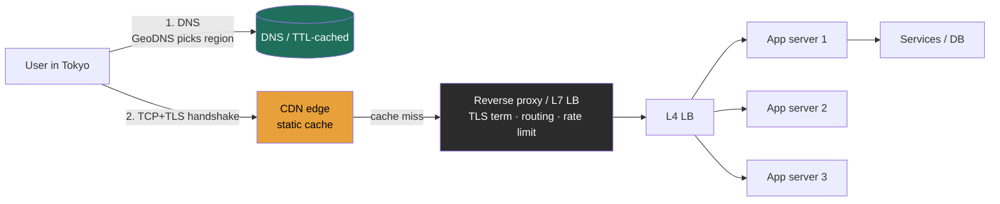

### Learning objectives
- Trace a request from URL to response at the altitude a Director needs (DNS → TCP/TLS → HTTP), and know where the time goes.
- Distinguish a **forward proxy** from a **reverse proxy** and state what each buys you.
- Place load balancers, reverse proxies, API gateways, and CDNs in the request path and explain where they overlap.
- Reason about global routing and failover (GeoDNS, anycast, TTLs) and their latency/availability implications.

### Intuition first
The network is a **postal system.** DNS is the *address book*, it turns a human name (`api.example.com`) into a location (an IP). A **forward proxy** is *your* mail-forwarding service: it acts on behalf of the **client**, representing or hiding you as you reach out. A **reverse proxy** is the *company mailroom*: it acts on behalf of the **servers**, fronting them, deciding who handles each piece of incoming mail, and never letting outsiders see the internal office layout.

### Deep explanation
**The request lifecycle (what actually happens when a user hits your service):**
1. **DNS resolution**, the resolver walks root → TLD → authoritative servers, heavily cached at each layer with **TTLs**. Result: a name maps to one or more IPs. *This is eventually consistent and cached*, a fact with real consequences (below).
2. **TCP handshake**, SYN / SYN-ACK / ACK, ~1 round trip.
3. **TLS handshake**, ~1 RTT with TLS 1.3 (down from 2 in TLS 1.2); **0-RTT resumption** for returning clients. On a cross-region path each RTT is ~150 ms, so handshakes alone can dominate first-byte latency.
4. **HTTP exchange**, HTTP/1.1 (head-of-line blocking per connection) → HTTP/2 (multiplexed streams over one connection) → HTTP/3 (QUIC over UDP, removes TCP head-of-line blocking, faster on lossy/mobile links).

**DNS as a control plane, not just a phonebook.** Record types you should name: A/AAAA (IPv4/IPv6), CNAME (alias), NS, MX. The **TTL trade-off** is the interview point: a *low* TTL means fast failover (you can repoint traffic in seconds) but more lookups and resolver load; a *high* TTL means fewer lookups but **slow propagation** when you need to drain a dead region. **GeoDNS / latency-based routing** steers users to the nearest healthy region; **anycast** advertises one IP from many locations so the network routes to the closest, both are how global services cut RTT and survive regional loss.

**Forward vs. reverse proxy:**
- **Forward proxy**, sits next to the **client**, faces the internet on the client's behalf. Uses: corporate egress control, content filtering, client-side caching, anonymity. The *server* doesn't know the real client.
- **Reverse proxy**, sits in **front of your servers**, faces clients on the servers' behalf. Uses: load balancing, **TLS termination**, caching, compression, request routing, and security (WAF, rate limiting, hiding backend topology). The *client* doesn't know which backend served it. Named tech: Nginx, Envoy, HAProxy.

**The overlapping front-door family (a Director should disambiguate these cleanly):**
- **Load balancer**, distributes traffic across backends. **L4** (transport: routes by IP/port, fast, connection-level, no payload inspection) vs **L7** (application: routes by URL/header/cookie, can do sticky sessions, smarter but costlier).
- **API gateway**, application-layer concerns at the edge: authn/authz, rate limiting, request routing, response aggregation, protocol translation.
- **CDN**, a geographically distributed reverse-proxy cache at the *edge*, close to users, for cacheable/static-ish content.
These are concentric, not mutually exclusive: a reverse proxy can *be* your L7 LB and API gateway; a CDN is a reverse proxy you don't run.

### Diagram: request path and where the front door sits

### Worked example: getting a Tokyo user to a US-hosted service fast
1. **GeoDNS** resolves the Tokyo user to your Asia-Pacific region (or to an anycast IP routed to the nearest PoP).
2. A **CDN edge** in Tokyo serves static assets locally (~10-30 ms) and terminates TLS near the user, so the expensive handshakes don't cross the Pacific.
3. Dynamic `/api` requests hit a regional **reverse proxy (Envoy)** that terminates TLS, applies rate limiting, and routes to services.
4. An **L4 LB** spreads connections across stateless app servers.
5. **Failover:** if the AP region dies, health checks + a *low DNS TTL* (e.g., 30-60 s) repoint traffic to another region within ~a minute. The Director-level caveat: DNS caching means failover is **not instant**, so for hard SLAs you pair it with anycast withdrawal or a global L7 LB that fails over faster than DNS can.

### Trade-offs table: load balancing layer
| Option | Pro | Con | Use when… |
|---|---|---|---|
| **L4 (transport)** | Very fast, low overhead, protocol-agnostic | No content awareness, no per-URL routing | Raw throughput, TCP/UDP, simple spread |
| **L7 (application)** | Smart routing, sticky sessions, header/path rules, TLS term | Higher CPU/latency, must parse payloads | Microservice routing, A/B, canary, WAF |
| **DNS-based / GSLB** | Global, simple, no single choke point | Slow failover (TTL caching), coarse | Geo steering across regions |

### What interviewers probe here
- **"How does a user in Tokyo reach your service quickly?"**, *Strong:* GeoDNS/anycast + CDN edge + regional termination, with RTT numbers. *Red flag:* "they just connect to the server."
- **"Where do you terminate TLS, and why?"**, *Strong:* at the edge/reverse proxy to avoid carrying handshakes deep into the stack, with re-encryption inside if compliance requires. *Red flag:* no opinion.
- **"A region dies, how fast does traffic move, and what limits it?"**, *Strong:* health checks + low DNS TTL, *and* the caveat that DNS caching bounds failover speed. *Red flag:* assuming DNS is instant.

### Common mistakes / misconceptions
- Treating DNS as instant and globally consistent, it's cached and eventual; TTL governs failover speed.
- Conflating forward and reverse proxy (client-side vs server-side).
- Forgetting TLS handshake cost on cross-region first connections.
- Treating "the load balancer" as one box, it's itself a redundancy/SPOF concern.
- Assuming L7 everywhere, it's costlier; L4 is right when you don't need content awareness.

### Practice questions
**Q1.** Why might you deliberately set a low DNS TTL, and what's the cost?
> *Model:* Low TTL enables fast failover/traffic shifting (repoint within seconds). The cost is more frequent resolver lookups (load, marginal latency) and reliance on clients/resolvers honoring the TTL, many don't perfectly, so DNS failover is a best-effort floor, not a guarantee. For tight RTOs, pair it with anycast or a global L7 LB.

**Q2.** A client complains the *first* request to your API is slow but subsequent ones are fast. What's likely, and what would you do?
> *Model:* Cold-path costs: DNS lookup (uncached), TCP + TLS handshakes (multiple RTTs, worse cross-region), and possibly connection-pool warm-up. Mitigations: edge TLS termination near the user, TLS 1.3 / 0-RTT resumption, HTTP/2 or HTTP/3 connection reuse, and keeping warm connection pools.

**Q3.** When is a forward proxy the right tool rather than a reverse proxy?
> *Model:* When the concern is *client-side*: corporate egress control/filtering, outbound caching, or anonymizing/representing clients reaching external services. A reverse proxy solves *server-side* concerns (fronting, balancing, terminating, protecting your backends). They're not interchangeable, they sit on opposite ends of the connection.

### Key takeaways
- The request path is DNS → TCP → TLS → HTTP; each cross-region RTT is ~150 ms, so terminate handshakes near the user.
- DNS is a cached, eventually-consistent control plane; TTL trades failover speed against lookup load.
- Forward proxy = client-side representative; reverse proxy = server-side front door.
- L4 (fast, dumb) vs L7 (smart, costlier); GeoDNS/anycast for global steering.
- "The load balancer" must itself be redundant, don't make your front door a SPOF.

> **Spaced-repetition recap:** Postal system. DNS = cached address book (TTL governs failover). Forward proxy fronts clients; reverse proxy fronts servers and absorbs LB/gateway/cache duties. Push TLS and caching to the edge; never trust DNS to fail over instantly.

---
