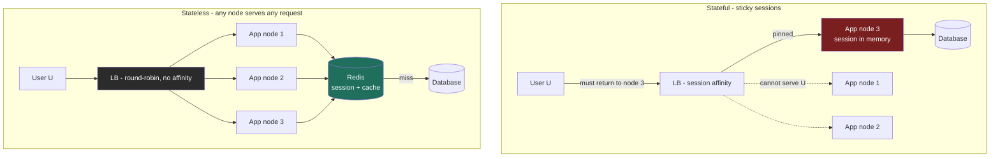

import CachingStrategiesSimulator from '@components/widgets/CachingStrategiesSimulator.jsx';

### Learning objectives
- Contrast the three dominant API styles - **REST**, **RPC/gRPC**, and **GraphQL** - on coupling, over-/under-fetching, streaming, tooling, and browser support, and choose one from the *consumer* and *team-boundary*, not from fashion.
- Distinguish **synchronous** (request-response) from **asynchronous** (message/event) communication as a **coupling decision**, not a syntax one, and name what each costs.
- Explain why a **stateless** app tier scales horizontally and a **stateful** one does not - and show the server math - then externalize session state to a shared store (Redis) so any node can serve any request.
- Place **caching** in the stateless story: it is the shared, fast tier that makes statelessness cheap, which is exactly why its **write strategy** (cache-aside / write-through / write-back) is a consistency-vs-latency-vs-durability trade you must pick deliberately.

### Intuition first
Two everyday pictures carry this whole lesson.

**API styles are three ways to order food.** **REST** is ordering from a fixed printed menu organized by *dish* (a noun: `GET /orders/42`, `DELETE /orders/42`) - everyone understands the menu, caching the menu is trivial, but if you want "just the soup and half the salad" you take the whole plate and scrape off what you don't want (over-fetching), or you make three separate orders to assemble one meal (under-fetching). **RPC/gRPC** is leaning into the kitchen and telling the chef a *verb*: "reprice this cart," "transcode this video" - fast, compact, strongly typed, perfect between cooks who work in the same restaurant, but useless to a walk-in customer off the street who can't speak kitchen shorthand. **GraphQL** is a build-your-own-plate counter: you hand over one slip describing *exactly* what you want on the plate and get back precisely that, no more, no less - wonderful for a fussy diner (a mobile screen on a slow network), but now the counter has to be smart enough to assemble any arbitrary plate, and a malicious diner can ask for a plate the size of a table.

**Stateful vs stateless is whether the cashier remembers you.** A **stateful** cashier keeps your running tab in their own head, so you *must* come back to that same cashier every time - and if they go on break mid-meal, your tab is gone. A **stateless** cashier remembers nothing between visits; you carry your own receipt (a token, a session ID) and present it each time, so *any* cashier on shift can serve you and you never care which one. Add more cashiers and throughput rises linearly - because no cashier is special. The tab still has to live *somewhere*, though, and that somewhere is a shared ledger every cashier can read fast: the cache (Redis). That shared ledger is why the whole scheme works, which is why how you *write* to it matters as much as how you read it.

Hold both pictures. Almost every decision below is "which menu, and does the cashier remember you?"

### Deep explanation

#### Part 1 - API / communication styles

All three styles move bytes between a caller and a callee. They differ in **who is coupled to whom**, **who decides the shape of the response**, and **what the network and tooling give you for free**.

**REST (resource-oriented over HTTP).** Model the domain as **resources** (nouns) addressed by URL, manipulated with HTTP verbs (`GET`/`POST`/`PUT`/`DELETE`), stateless per request. What you get for free is the entire HTTP ecosystem you already met in Lesson 2.1: **caching** (a `GET` is cacheable by CDNs, reverse proxies, and browsers via `Cache-Control`/`ETag`), uniform semantics, idempotency conventions, and universal client support. The cost is **over-fetching** (an endpoint returns a fixed payload; a mobile feed card needs 4 of its 30 fields but ships all 30) and **under-fetching / N+1 round trips** (rendering one screen needs `/user`, then `/user/posts`, then `/posts/{id}/comments` - three sequential round trips, and at ~50-150 ms each over mobile that is real wall-clock time, recall Lesson 1.4). REST endpoints also tend to **couple to a client's screen** over time (you grow `/feed?expand=author,comments` knobs), which is the smell that pushes teams toward GraphQL.

**RPC / gRPC (procedure-oriented).** Model the interface as **methods** (verbs): `RepriceCart(cart) -> Cart`. gRPC specifically uses **Protocol Buffers** (a compact binary schema, typically 3-10x smaller on the wire than JSON) over **HTTP/2**, which buys **multiplexing** and, crucially, **streaming** - server-streaming, client-streaming, and bidirectional - that REST's request-response shape does not natively offer. Code generation gives you **strongly typed stubs** in every language, so the contract is enforced at compile time, not discovered at runtime. The costs: it is **not natively consumable by a browser** (browsers can't speak raw HTTP/2 framing to arbitrary servers, so you need **gRPC-Web** plus a proxy like Envoy to translate); the binary payload is **not human-readable** (harder to `curl`/debug); and Protobuf creates **tighter producer-consumer coupling** through the shared schema. This is why gRPC's home is **east-west, internal, service-to-service** traffic at scale - it's how the cooks talk - and not usually the public edge.

**GraphQL (query-oriented, single endpoint).** The client sends a **query** describing the exact fields it wants from a typed **schema/graph**, to one endpoint (`POST /graphql`), and gets back exactly that shape. This **kills over- and under-fetching in one stroke**: the mobile team asks for 4 fields and one round trip assembles the whole screen, even spanning what used to be several REST resources. The costs are real and Director-relevant: **HTTP caching breaks** (everything is one `POST` to one URL, so the free CDN/proxy `GET` caching of REST evaporates - you re-implement caching at the resolver/field layer, e.g. Facebook's DataLoader, or with persisted queries); the server is exposed to the **N+1 resolver problem** (a naive `posts { comments }` fires one DB query per post unless you batch); **arbitrary query complexity** is an availability and cost risk (a client can request a deeply nested graph that melts your DB - you need depth/complexity limits and cost analysis); and you've moved real engineering effort server-side. GraphQL shines when **many heterogeneous clients** (iOS, Android, web, partners) each need a *different slice* of the same graph and you don't want to ship a bespoke endpoint per screen.

**The unifying trade:** REST optimizes for **uniformity, cacheability, and universal reach**; gRPC for **performance, typing, and streaming between services you control**; GraphQL for **client-driven flexibility across many consumers** at the cost of giving back HTTP's free caching and taking on complexity/abuse surface. The rejected-alternative discipline here is concrete: choosing GraphQL means you are *rejecting* free edge caching and *accepting* resolver-level batching and query-cost defense; choosing gRPC at the edge means *rejecting* browser-native consumption and *accepting* a translation proxy. State which you gave up.

#### Synchronous vs asynchronous - a coupling decision

This axis is orthogonal to the style above and is where candidates most often think "syntax" when the interviewer means **coupling**.

- **Synchronous (request-response):** the caller **blocks** waiting for the callee's reply. Simple, immediately consistent, easy to reason about - but it creates **temporal coupling** (both services must be up *at the same moment*) and **cascading latency/failure** (if the callee slows to 500 ms or falls over, the caller's thread is stuck and the failure propagates up the chain). A synchronous chain of 5 services each at 50 ms is *at best* 250 ms, and its availability is the **product** of the links (five services at 99.9% each ≈ 99.5% combined, ~3.6 hours/month of downtime - the math compounds against you).
- **Asynchronous (message / event):** the caller hands a message to a **broker** (Kafka, RabbitMQ, SQS) and moves on; the callee processes when it can. This **decouples** producer from consumer in time (the consumer can be down and catch up later), **absorbs bursts** (the queue is a shock absorber - recall the batch-vs-stream framing of Lesson 2.9), and **isolates failure** (a slow consumer grows a backlog instead of stalling the caller). The price is **eventual consistency** (the result isn't ready when you return), **operational complexity** (a broker to run, monitor, and capacity-plan), and **harder debugging** (no single call stack; you trace across topics). Backpressure, retries, dead-letter queues, and **idempotent consumers** (a message may be delivered more than once) become your problem.

The Director framing: use **synchronous** where the caller genuinely needs the answer *now* to proceed (a price quote at checkout); use **asynchronous** to decouple, smooth load, and survive partial failure (send the confirmation email, fan out the new post to followers' feeds, kick off video transcoding). "Make it async" is not a performance trick - it's a deliberate trade of immediacy and simplicity for decoupling and resilience. Modules 3 (Messaging Queue, Pub-Sub) and 5 build entire systems on this seam.

#### Part 2 - Stateful vs stateless, and why stateless scales horizontally

A service is **stateful** if it keeps client-session state (who you are, your cart, your in-progress wizard) **in its own memory** between requests. It is **stateless** if every request carries (or references) everything needed to serve it, and the node holds **nothing** client-specific between requests.

**Why this decides horizontal scalability - with the math.** Suppose you need to serve **30,000 QPS** and one app node handles **3,000 QPS** (the kind of estimate you'd produce in Lesson 1.3's E step), so you want **10 nodes** behind a load balancer.

- **Stateful (in-memory sessions):** user U's session lives only on node 3. The load balancer must therefore send *every* U request back to node 3 - **sticky sessions** (session affinity). Consequences: (1) **uneven load** - a few hot users pin to a few nodes while others idle, so you can't actually use all 10 evenly; (2) **scaling is not transparent** - add node 11 and existing sessions don't rebalance to it, so it only helps *new* sessions; (3) **node death loses state** - node 3 crashes and every session on it is gone (carts emptied, users logged out); (4) **deploys are disruptive** - rolling a node drops its sessions. You have made each node *special*, and special things don't scale linearly.
- **Stateless (externalized session):** move the session out of node memory into a **shared, fast store** - **Redis** (Lesson 2.2's key-value family) is the canonical choice: a session token keys a small blob, sub-millisecond reads, TTL-based expiry built in. Now **any** node can serve **any** request by looking up the session in Redis. The load balancer can use plain round-robin or least-connections (Lesson 3.2) with no affinity; load spreads evenly across all 10; **adding node 11 instantly takes its share**; a dead node takes **zero** session state with it (the LB just routes elsewhere); deploys are trivial. You scale by **adding identical, disposable nodes** - the definition of horizontal scale.

The trade you're making by externalizing: you've added a **network hop to Redis on every request** (~1 ms, vs ~100 ns for in-process memory - four orders of magnitude, per Lesson 1.4) and made Redis a dependency you must make **highly available** (it's now in the critical path, so replicate it and plan failover - Lesson 2.4). That is a deliberate, almost always correct trade: a 1 ms session lookup to buy linear, resilient scaling and painless deploys. The rejected alternative - sticky sessions - is acceptable only as a *short-term bridge* for an app that can't yet externalize, and you should name it as debt.

A subtlety worth stating at altitude: "stateless" means the **app tier** is stateless. The state didn't vanish - it **moved** to a tier *designed* to be shared (Redis, the database, a blob store). You are not eliminating state; you are **relocating it out of the disposable compute layer** so that layer can be cattle, not pets. JWTs push this further - a signed token carries the session *in the client*, so even Redis isn't consulted for identity - at the cost of not being able to revoke a token before it expires without re-introducing server-side state.

#### How caching completes the stateless story

Once the app tier is stateless, **the shared tiers it leans on - the database and the cache - become the scaling bottleneck and the latency floor.** Caching is the lever. A **read-through cache** (Redis/Memcached in front of Postgres) lets ten stateless nodes serve a hot key from a ~1 ms cache hit instead of ten of them hammering the database with ~10 ms reads. With a **90% hit rate**, you've cut origin database load by 10x and dropped p50 read latency from ~10 ms toward ~1 ms - the single highest-leverage move for a read-heavy system. The cache *is* the shared, fast ledger from the intuition; statelessness is what lets every node use it freely.

But a cache introduces a **second copy of the truth**, and the moment you have two copies you must answer: *when the data changes, how do cache and database stay in agreement, and who pays the latency?* This is the PACELC consistency-vs-latency tension from Lesson 2.7 made concrete at the cache layer (and the same dial as the quorum trade in Lesson 2.8): keeping the copies in lockstep costs latency; letting them drift costs freshness. That question has three classic answers on the **write** path - and they trade **consistency, write latency, and durability** against each other. That is precisely what the simulator below lets you feel.

### Diagram - stateful (sticky) vs stateless (externalized session + cache)

### Caching write strategies - run the trade yourself

The widget below is a single-writer **caching write-strategy simulator**. The **read** path is identical for all three strategies - check the cache, return on a hit, on a miss read the database, populate the cache, return - so reads aren't where they differ. The **write** path is the whole game, and the simulator makes the cost visible by giving every key a monotonically increasing **version number**: whenever the cache and database disagree, you see it as an integer of staleness (cache `v5` / db `v3` = the database is two versions behind).

- **Cache-aside (lazy load):** on write, the app updates the **database**, then **invalidates** (deletes) the cache key; the next read lazily re-loads it. The database is the source of truth, the cache can only go stale via a race, and nothing is ever lost - at the cost of an extra miss + reload after each write. This is the sensible default.
- **Write-through (sync both):** on write, the app updates **cache and database together**, both before acknowledging. Reads-after-writes always **hit** and are always **fresh** - cache-aside's post-write miss disappears - but you pay the **highest write latency** (cache + DB on the critical path) and churn the cache for write-heavy, rarely-read keys.
- **Write-back (write-behind):** on write, the app updates the **cache only**, marks the key **dirty**, and acknowledges immediately; the database is flushed **later, asynchronously**. This gives the **lowest write latency** (cache-speed acks) and absorbs write bursts - but until the flush the database is stale to any direct reader, and a **crash before flush loses every dirty write**.

Pick a strategy and a **workload** (read-after-write on a hot key, write-heavy, or read-heavy) and step or auto-run the operation stream. Watch the **hit/miss rate**, the per-key **cache-vs-db version skew** (the staleness meter), and the **write-latency bars** (the model assumes a ~1 ms cache write and a ~10 ms database write - what the client waits for before its ack). The discriminating move: run the **write-heavy** preset, then hit **Crash** mid-stream and watch only **write-back** report lost versions while cache-aside and write-through lose nothing. That single observation is the durability half of the trade made tangible.

<CachingStrategiesSimulator client:load />

### Worked example - the API surface and app tier of a photo-sharing app

Continue the polyglot photo-sharing app from Lesson 2.2. The communication and statefulness decisions fall straight out of *who is talking to whom* and *what must be remembered*.

- **Public edge / mobile app -> backend:** the iOS, Android, and web clients each render a feed card needing a *different slice* of the same data, on networks where every extra round trip hurts. Use **GraphQL** (or a REST BFF - backend-for-frontend - per client) at the edge to **kill over-fetching**: one round trip assembles `author { name, avatar } caption likeCount viewerHasLiked`, instead of three REST hops or a 30-field over-fetch. The trade accepted out loud: we give up REST's free CDN `GET` caching and take on resolver batching (DataLoader) and query-cost limits to stop a client from requesting a million-node graph.
- **Service-to-service (feed service -> ranking, media, counts):** internal, high-volume, latency-sensitive, all teams we control. Use **gRPC** - compact Protobuf, HTTP/2 multiplexing, typed stubs, and **server-streaming** for paginating a ranked feed. We reject REST here (JSON overhead and no native streaming) and accept that this isn't browser-consumable - it never needs to be; it's east-west.
- **Fan-out on a new post:** writing a post must not block on updating millions of followers' timelines. Make it **asynchronous** - the post write returns immediately, and an event on **Kafka** drives feed fan-out, notification delivery, and any transcoding. We accept eventual consistency (your followers see the post a second or two later) to decouple the write from the fan-out and absorb the burst when a celebrity posts.
- **App tier:** every app node is **stateless** behind an L7 load balancer (Lesson 2.1). Session/auth lives in **Redis** keyed by token, so any node serves any user; we scale the tier by adding identical nodes and lose zero state when one dies. Sticky sessions are explicitly rejected - they'd pin hot users and make deploys drop sessions.
- **Hot timeline reads:** the precomputed timeline and counts are served **cache-aside from Redis** in front of Cassandra/the timeline store. A ~90% hit rate cuts origin reads ~10x; on a write we invalidate the affected timeline key so the next read reloads it. Write-back is rejected here - a crash losing timeline versions is not worth the marginal write-latency win when the database write is cheap and durability matters.

The signal isn't any single pick - it's that **each boundary chose its style and its statefulness from the consumer and the consistency need**, and named what it gave up.

### Trade-offs table - API styles
| | **REST** | **gRPC** | **GraphQL** |
|---|---|---|---|
| Model | resources / nouns (HTTP verbs) | procedures / verbs (typed methods) | typed graph, one endpoint, client picks fields |
| Wire format | JSON (human-readable) | Protobuf binary (3-10x smaller) | JSON over a query |
| Over/under-fetch | over-fetches; N+1 round trips | tight (method returns just what's defined) | **eliminates both** (client specifies shape) |
| Streaming | not native (request-response) | **first-class** (uni/bi-directional, HTTP/2) | subscriptions (bolt-on) |
| Caching | **free** via HTTP `GET`/`ETag`/CDN | none at HTTP layer | **lost** (one POST endpoint); rebuild per-field |
| Browser support | universal | needs gRPC-Web + proxy | universal (it's HTTP POST) |
| Coupling | loose (uniform interface) | tight (shared Protobuf schema) | medium (shared schema, flexible queries) |
| **Use when** | public APIs, CRUD, cacheable reads, max reach | **internal service-to-service**, low latency, streaming, polyglot | **many heterogeneous clients** each needing a different slice; mobile bandwidth |

### Trade-offs table - communication & state axes
| Axis | Option A | Option B | Use when… |
|---|---|---|---|
| Sync vs async | **Synchronous** - simple, immediate, but temporal coupling + cascading failure (availability multiplies down the chain) | **Asynchronous** - decoupled, burst-absorbing, failure-isolating, but eventually consistent + a broker to run | Sync when the caller needs the answer *now* to proceed; async to decouple, smooth load, survive partial failure |
| State location | **Stateful** (in-memory) - needs sticky sessions, uneven load, loses state on node death, deploy-disruptive | **Stateless** (externalized to Redis) - any node serves any request, even load, dies cleanly, scales by adding nodes | Stateless by default for the app tier; stateful only as named short-term debt |
| Cache write path | **Cache-aside / write-through** - DB written synchronously, durable, cache fresh or invalidated | **Write-back** - cache-speed acks, absorbs bursts, but DB stale until flush and crash loses dirty writes | Aside/through when durability matters (most data); write-back only when the source is reconstructable and a loss window is tolerable |

### What interviewers probe here
- **"Why gRPC internally but REST or GraphQL at the edge?"** - *Strong:* gRPC's Protobuf/HTTP-2/streaming/typed-stubs win **east-west between services you own**, while the **public edge** needs browser reach and cacheability (REST) or per-client field selection (GraphQL); names that gRPC needs gRPC-Web + a proxy to reach a browser. *Red flag:* "gRPC is just faster, use it everywhere," with no edge/browser/caching awareness.
- **"GraphQL kills over-fetching - so what did you give up?"** - *Strong:* **HTTP caching** (one POST endpoint, so CDN/proxy `GET` caching is gone - rebuilt per-field), the **N+1 resolver** problem (batch with DataLoader), and **query-complexity/cost** as an availability risk (depth limits). *Red flag:* treating GraphQL as free lunch.
- **"How does your app tier scale horizontally?"** - *Strong:* **stateless nodes, session externalized to Redis**, plain LB, add nodes to add capacity, dead node loses nothing; states the ~1 ms Redis hop as the deliberate cost and Redis HA as a new dependency. *Red flag:* "add servers" while sessions live in node memory (sticky sessions), or not noticing the contradiction.
- **"Where does session/cart state live, and what happens when that node dies?"** - *Strong:* in a shared store (Redis/DB), so node death is a non-event for state. *Red flag:* "in the server's memory" with no recovery story.
- **"This call chain is synchronous and 6 services deep - what's your concern?"** - *Strong:* **multiplied latency and multiplied failure** (availability is the product of the links), and a proposal to make non-critical hops async/event-driven and add timeouts/circuit-breakers. *Red flag:* not seeing that synchronous chains compound latency *and* failure.
- **"What's the cost of the cache, beyond memory?"** - *Strong:* a **second copy of the truth** to keep coherent - invalidation, staleness windows, the write-strategy trade (consistency/latency/durability), and stampede/thundering-herd on a cold key. *Red flag:* "just add a cache," treating it as free correctness.

### Common mistakes / misconceptions
- **GraphQL everywhere.** Adopting it for a single first-party client with stable needs - you take on resolver complexity, lose free HTTP caching, and open a query-abuse surface for benefits you didn't need. REST or a BFF was simpler.
- **gRPC at the browser edge** without realizing browsers can't speak it natively - you still need gRPC-Web and a translating proxy (Envoy).
- **"We're stateless" while sessions sit in process memory.** Then quietly turning on sticky sessions to "fix" the bugs - which re-introduces every stateful problem (uneven load, lost-on-death, deploy churn) under a different name.
- **Treating sticky sessions as a scaling strategy** rather than as debt. They pin load and defeat the point of a load balancer.
- **Confusing async with "faster."** Async doesn't make the work shorter; it **decouples** caller from callee and trades immediacy for resilience and burst absorption.
- **Forgetting cache invalidation and the second-copy problem.** A cache without an invalidation/write strategy silently serves stale data; write-back without a durable, reconstructable source silently loses writes on crash.
- **N+1 everywhere** - the REST under-fetch round-trip storm *and* the GraphQL naive-resolver fan-out are the same disease; both need batching.

### Practice questions
**Q1.** Your mobile team complains the feed screen makes 4 sequential API calls and over-fetches huge JSON on a slow network. What do you propose, and what's the cost?
> *Model:* Collapse the 4 round trips into **one** by letting the client specify exactly the fields the card needs - either **GraphQL** or a **REST backend-for-frontend (BFF)** that aggregates server-side. One round trip instead of 4 (saving ~150-450 ms of mobile RTT) and only the needed fields cross the wire. Costs to name: GraphQL **gives up free HTTP/CDN caching** (rebuild caching at the resolver/persisted-query layer), exposes the **N+1 resolver** problem (batch with DataLoader), and needs **query-complexity limits** to prevent abuse; a BFF avoids those but adds a per-client service to maintain. I'd choose based on how many *heterogeneous* clients exist - one client → BFF; several divergent clients → GraphQL.

**Q2.** A team wants to scale the web tier by "just adding more servers," but sessions are stored in each server's memory. What breaks, and what's the fix?
> *Model:* In-memory sessions make each node **stateful**, forcing **sticky sessions**: load can't spread evenly (hot users pin to a few nodes), new nodes only help *new* sessions, a crashing node **loses every session on it** (users logged out, carts emptied), and deploys drop sessions. The fix is to make the tier **stateless** by **externalizing session to a shared store** - Redis keyed by session token, with TTL expiry - so any node serves any request with plain round-robin LB; add nodes for linear capacity and lose zero state on node death. The deliberate cost: a ~1 ms Redis hop per request and a new HA dependency (replicate Redis, plan failover). Sticky sessions are acceptable only as a stopgap, named as debt.

**Q3.** You're putting a Redis cache in front of Postgres for a read-heavy service. Which write strategy, and when would you change your mind?
> *Model:* Default to **cache-aside**: on write, update Postgres (durable source of truth) and **invalidate** the cache key; the next read lazily reloads. It's the most common pattern, never loses data, and the cache can only go stale via a race. Switch to **write-through** if read-after-write must be **fresh and warm** on a hot key (it keeps the just-written key cached, eliminating cache-aside's post-write miss) - accepting higher write latency (cache + DB on the critical path). Reach for **write-back** *only* when write latency or burst absorption dominates **and** the data is reconstructable or a small loss window is tolerable - because a crash before flush loses every un-flushed write. Tie it to the requirement: durability/consistency-first → aside or through; extreme write throughput on reconstructable data → back.

**Q4.** A checkout flow is a synchronous chain: API → pricing → inventory → payment → fulfillment, five hops. Where's the risk and what would you change?
> *Model:* Synchronous depth **multiplies latency** (best case the sum of all hops, e.g. 5 × 50 ms = 250 ms floor) and **multiplies failure** (overall availability ≈ the product of each link's availability - five services at 99.9% ≈ 99.5%, far worse than any single one). Keep **synchronous** only the steps the user must block on to get a result (pricing, inventory check, payment authorization), and add **timeouts + circuit breakers** so a slow downstream fails fast instead of stalling threads. Make the rest **asynchronous/event-driven**: emit an `OrderPlaced` event to a broker (Kafka/SQS) that drives **fulfillment, email, and analytics** so they can't stall checkout or take it down, with idempotent consumers for at-least-once delivery. The trade: those steps become eventually consistent (fulfillment kicks off a moment later), bought in exchange for a faster, more resilient critical path.

### Key takeaways
- API style is chosen from the **consumer and team boundary**: REST for cacheable public reach, **gRPC for internal service-to-service** (Protobuf/HTTP-2/streaming/typed), GraphQL for **many clients each wanting a different slice** - and each choice forfeits something (GraphQL gives up free HTTP caching; edge gRPC gives up browser reach). Name what you dropped.
- **Sync vs async is a coupling decision, not a speed trick**: sync is simple but multiplies latency and failure down a chain; async decouples, absorbs bursts, and isolates failure at the cost of eventual consistency and a broker to operate.
- A **stateless** app tier scales horizontally because every node is identical and disposable - any node serves any request; a **stateful** one needs sticky sessions, loads unevenly, loses state on death, and churns on deploys.
- Make the tier stateless by **externalizing session to Redis** (state moves to a tier built to be shared; it doesn't disappear) - accepting a ~1 ms hop and a new HA dependency to buy linear, resilient scaling.
- **Caching is what makes statelessness cheap** (one shared fast tier for many nodes), but it's a second copy of the truth: the **write strategy** - cache-aside (default, durable), write-through (fresh, slower writes), write-back (fast, lossy on crash) - is a deliberate consistency-vs-latency-vs-durability trade.

> **Spaced-repetition recap:** Three menus (REST = cacheable nouns; gRPC = typed verbs for the kitchen, internal only; GraphQL = build-your-own-plate, you lose HTTP caching) and a cashier who either remembers you (stateful → sticky, loses state on death) or doesn't (stateless → externalize session to Redis, any node serves anyone, scales by adding nodes). Sync couples in time and multiplies failure; async decouples for resilience at the cost of eventual consistency. Caching makes statelessness cheap - but it's a second copy, so its write strategy (aside / through / back) trades consistency vs latency vs durability.

---

*End of Lesson 2.10 - and of Module 2, the trade-off vocabulary the rest of the course speaks in. Next: Module 3 begins building the canonical components - 3.1 DNS and 3.2 Load Balancers (+ the Load-balancing comparison widget), where the stateless app tier, session store, and caching tiers from this lesson become concrete building blocks.*
