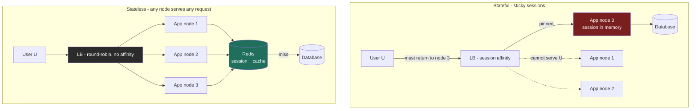

import CachingStrategiesSimulator from '@components/widgets/CachingStrategiesSimulator.jsx';

### Learning objectives
- Contrast the three dominant API styles - **REST**, **RPC/gRPC**, and **GraphQL** - on coupling, over-/under-fetching, streaming, tooling, and browser support, and choose one from the *consumer* and *team-boundary*, not from fashion.
- Distinguish **synchronous** (request-response) from **asynchronous** (message/event) communication as a **coupling decision**, not a syntax one, and name what each costs.
- Explain why a **stateless** app tier scales horizontally and a **stateful** one does not - and show the server math - then externalize session state to a shared store (Redis) so any node can serve any request.
- Place **caching** in the stateless story: it is the shared, fast tier that makes statelessness cheap, which is exactly why its **write strategy** (cache-aside / write-through / write-back) is a consistency-vs-latency-vs-durability trade you must pick deliberately.

### Intuition first
Two everyday pictures carry this whole lesson.

**API styles are three ways to order food.** **REST** is a fixed printed menu organized by *dish* (a noun: `GET /orders/42`) - everyone understands it and caching it is trivial, but you take the whole plate and scrape off what you don't want (over-fetching), or place three orders to assemble one meal (under-fetching). **RPC/gRPC** is leaning into the kitchen and telling the chef a *verb*: "reprice this cart" - fast, compact, strongly typed, perfect between cooks in the same restaurant, useless to a walk-in customer who can't speak kitchen shorthand. **GraphQL** is a build-your-own-plate counter: one slip describing *exactly* what you want, returned precisely - wonderful for a fussy diner (a mobile screen on a slow network), but the counter must assemble any arbitrary plate, and a malicious diner can ask for one the size of a table.

**Stateful vs stateless is whether the cashier remembers you.** A **stateful** cashier keeps your tab in their head, so you *must* return to that cashier - and if they go on break mid-meal, your tab is gone. A **stateless** cashier remembers nothing; you carry a receipt (a token) and *any* cashier serves you. Add cashiers and throughput rises linearly - no cashier is special. The tab still lives *somewhere*: a shared ledger every cashier can read fast - the cache (Redis) - which is why how you *write* to it matters as much as how you read it.

Hold both pictures. Almost every decision below is "which menu, and does the cashier remember you?"

### Deep explanation

#### Part 1 - API / communication styles

All three styles move bytes between a caller and a callee. They differ in **who is coupled to whom**, **who decides the shape of the response**, and **what the network and tooling give you for free**.

**REST (resource-oriented over HTTP).** Model the domain as **resources** (nouns) addressed by URL, manipulated with HTTP verbs, stateless per request. You get the entire HTTP ecosystem from the networking lesson for free: **caching** (`GET` is cacheable by CDNs, proxies, and browsers via `Cache-Control`/`ETag`), uniform semantics, idempotency conventions, universal client support. The cost is **over-fetching** (a mobile feed card needs 4 of an endpoint's 30 fields but ships all 30) and **under-fetching / N+1 round trips** (one screen needs `/user`, then `/user/posts`, then `/posts/{id}/comments` - three sequential round trips at ~50-150 ms each over mobile, recall 1.4). REST endpoints also tend to **couple to a client's screen** over time (`/feed?expand=author,comments` knobs) - the smell that pushes teams toward GraphQL.

**RPC / gRPC (procedure-oriented).** Model the interface as **methods** (verbs): `RepriceCart(cart) -> Cart`. gRPC uses **Protocol Buffers** (compact binary, typically 3-10x smaller than JSON) over **HTTP/2**, which buys multiplexing and, crucially, **streaming** - server, client, and bidirectional - that REST's request-response shape doesn't natively offer; code generation gives **strongly typed stubs** in every language, enforcing the contract at compile time. The costs: gRPC needs a proxy like Envoy to reach browsers; the binary payload is harder to `curl`/debug; and the shared Protobuf schema couples producer and consumer more tightly. This is why gRPC's home is **east-west, internal, service-to-service** traffic at scale - it's how the cooks talk - and not usually the public edge.

**GraphQL (query-oriented, single endpoint).** The client sends a **query** describing the exact fields it wants from a typed **schema/graph**, to one endpoint (`POST /graphql`), and gets back exactly that shape. This **kills over- and under-fetching in one stroke**: the mobile team asks for 4 fields and one round trip assembles the whole screen, even spanning what used to be several REST resources. The costs are real and Director-relevant: **HTTP caching breaks** (everything is one `POST` to one URL, so REST's free CDN/proxy `GET` caching evaporates - you rebuild caching at the resolver layer or with persisted queries); naive resolvers fan out a query per field - batch with DataLoader; **arbitrary query complexity** is an availability and cost risk (a deeply nested query can melt your DB - you need depth/complexity limits); and you've moved real engineering effort server-side. GraphQL shines when **many heterogeneous clients** (iOS, Android, web, partners) each need a *different slice* of the same graph and you don't want a bespoke endpoint per screen.

Go deeper - edge and cache mechanics (IC depth, optional)

- **Why gRPC can't reach browsers directly:** browsers can't speak raw HTTP/2 framing to arbitrary servers, so you need **gRPC-Web** on the client plus a translating proxy (Envoy) in front of the service.
- **The N+1 resolver problem:** a naive GraphQL `posts { comments }` resolver fires one DB query per post. **DataLoader** coalesces all the per-item loads in one tick of the event loop into a single batched query, and memoizes within the request.
- **Write-back crash mechanics:** dirty keys live only in cache memory until the asynchronous flush; a crash before flush loses every dirty write with no recovery path unless the cache itself is replicated/persistent (e.g., Redis AOF) or the data can be recomputed from an upstream source. That's why write-back is reserved for reconstructable, loss-tolerant data (view counters, metrics) or paired with a durable log.

**The unifying trade:** REST optimizes for **uniformity, cacheability, and universal reach**; gRPC for **performance, typing, and streaming between services you control**; GraphQL for **client-driven flexibility across many consumers** at the cost of HTTP's free caching plus a complexity/abuse surface. Choosing GraphQL *rejects* free edge caching; choosing gRPC at the edge *rejects* browser-native consumption. State which you gave up.

#### Synchronous vs asynchronous - a coupling decision

This axis is orthogonal to the style above and is where candidates most often think "syntax" when the interviewer means **coupling**.

- **Synchronous (request-response):** the caller **blocks** for the reply. Simple, immediately consistent - but it creates **temporal coupling** (both services must be up *at the same moment*) and **cascading latency/failure** (a slow or dead callee stalls the caller's thread and propagates up the chain). A synchronous chain of 5 services at 50 ms each is *at best* 250 ms, and its availability is the **product** of the links: five services at 99.9% each ≈ 99.5% combined, ~3.6 hours/month of downtime.
- **Asynchronous (message / event):** the caller hands a message to a **broker** (Kafka, RabbitMQ, SQS) and moves on. This **decouples** producer from consumer in time (a down consumer catches up later), **absorbs bursts** (the queue is a shock absorber - recall 2.9), and **isolates failure** (a slow consumer grows a backlog instead of stalling the caller). The price: **eventual consistency**, a broker to run and capacity-plan, harder debugging (no single call stack), and retries/dead-letter queues/**idempotent consumers** (at-least-once delivery) become your problem.

The Director framing: use **synchronous** where the caller genuinely needs the answer *now* to proceed (a price quote at checkout); use **asynchronous** to decouple, smooth load, and survive partial failure (send the confirmation email, fan out the new post to followers' feeds, kick off video transcoding). "Make it async" is not a performance trick - it's a deliberate trade of immediacy and simplicity for decoupling and resilience. The messaging-queue and pub-sub building blocks, and the design problems, build entire systems on this seam.

#### Part 2 - Stateful vs stateless, and why stateless scales horizontally

A service is **stateful** if it keeps client-session state (who you are, your cart, your in-progress wizard) **in its own memory** between requests. It is **stateless** if every request carries (or references) everything needed to serve it, and the node holds **nothing** client-specific between requests.

**Why this decides horizontal scalability - with the math.** Suppose you need to serve **30,000 QPS** and one app node handles **3,000 QPS** (the kind of estimate you'd produce in the E step), so you want **10 nodes** behind a load balancer.

- **Stateful (in-memory sessions):** user U's session lives only on node 3, so the load balancer must send every U request back there - **sticky sessions**. Consequences: **uneven load** (hot users pin to a few nodes), **opaque scaling** (node 11 only helps *new* sessions), **node death loses state** (carts emptied, users logged out), and **disruptive deploys** (rolling a node drops its sessions). You've made each node *special*, and special things don't scale linearly.
- **Stateless (externalized session):** move the session into a **shared, fast store** - **Redis** (the key-value family): a session token keys a small blob, sub-millisecond reads, TTL expiry built in. Now **any** node serves **any** request; the LB runs plain round-robin, load spreads evenly, **adding node 11 instantly takes its share**, a dead node takes zero state with it, deploys are trivial. You scale by **adding identical, disposable nodes** - the definition of horizontal scale.

The trade you're making by externalizing: you've added a **network hop to Redis on every request** (~1 ms, vs ~100 ns for in-process memory - four orders of magnitude, per the latency-numbers lesson) and made Redis a dependency you must make **highly available** (it's now in the critical path, so replicate it and plan failover - the replication lesson). That is a deliberate, almost always correct trade: a 1 ms session lookup to buy linear, resilient scaling and painless deploys. The rejected alternative - sticky sessions - is acceptable only as a *short-term bridge* for an app that can't yet externalize, and you should name it as debt.

A subtlety worth stating at altitude: "stateless" means the **app tier** is stateless. The state didn't vanish - it **moved** to a tier *designed* to be shared, so the compute layer can be cattle, not pets. JWTs push this further - a signed token carries the session *in the client* - at the cost of not being able to revoke a token before expiry without re-introducing server-side state.

#### How caching completes the stateless story

Once the app tier is stateless, **the shared tiers it leans on - database and cache - become the scaling bottleneck and the latency floor.** Caching is the lever: Redis/Memcached in front of Postgres lets ten stateless nodes serve a hot key from a ~1 ms cache hit instead of hammering the database with ~10 ms reads. At a **90% hit rate** you've cut origin load 10x and dropped p50 read latency from ~10 ms toward ~1 ms - the single highest-leverage move for a read-heavy system.

But a cache is a **second copy of the truth**, so you must answer: *when the data changes, how do cache and database stay in agreement, and who pays the latency?* This is the consistency-vs-latency tension made concrete at the cache layer. The question has three classic answers on the **write** path, trading **consistency, write latency, and durability** against each other - which is precisely what the simulator below lets you feel.

### Diagram - stateful (sticky) vs stateless (externalized session + cache)

### Caching write strategies - run the trade yourself

The widget below is a single-writer **caching write-strategy simulator**. The **read** path is identical for all three strategies (cache hit, or miss → read DB → populate); the **write** path is the whole game. The simulator makes the cost visible by versioning every key: whenever cache and database disagree, you see the staleness as an integer (cache `v5` / db `v3` = two versions behind).

- **Cache-aside (lazy load):** on write, the app updates the **database**, then **invalidates** (deletes) the cache key; the next read lazily re-loads it. The database is the source of truth, the cache can only go stale via a race, and nothing is ever lost - at the cost of an extra miss + reload after each write. This is the sensible default.
- **Write-through (sync both):** on write, the app updates **cache and database together**, both before acknowledging. Reads-after-writes always **hit** and are always **fresh** - cache-aside's post-write miss disappears - but you pay the **highest write latency** (cache + DB on the critical path) and churn the cache for write-heavy, rarely-read keys.
- **Write-back (write-behind):** on write, the app updates the **cache only** and acknowledges immediately; the database is flushed later, asynchronously. Lowest write latency, absorbs bursts - but write-back loses unflushed writes on crash; use it only for reconstructable data.

Pick a strategy and a **workload** and step or auto-run the operation stream, watching the **hit/miss rate**, the per-key **cache-vs-db version skew** (the staleness meter), and the **write-latency bars** (~1 ms cache write vs ~10 ms database write). The discriminating move: run the **write-heavy** preset, hit **Crash** mid-stream, and watch only **write-back** report lost versions, the durability half of the trade made tangible.

<CachingStrategiesSimulator client:load />

### Worked example - the API surface and app tier of a photo-sharing app

Continue the polyglot photo-sharing app from the SQL-vs-NoSQL lesson. The communication and statefulness decisions fall straight out of *who is talking to whom* and *what must be remembered*.

- **Public edge / mobile app -> backend:** iOS, Android, and web each render a feed card needing a *different slice* of the same data, on networks where every round trip hurts. Use **GraphQL** (or a REST BFF per client) at the edge to **kill over-fetching**: one round trip assembles `author { name, avatar } caption likeCount viewerHasLiked` instead of three REST hops or a 30-field over-fetch. Trade accepted out loud: we give up REST's free CDN `GET` caching and take on resolver batching and query-cost limits.
- **Service-to-service (feed -> ranking, media, counts):** internal, high-volume, latency-sensitive, all teams we control. Use **gRPC** - compact Protobuf, typed stubs, and **server-streaming** for paginating a ranked feed. We reject REST here (JSON overhead, no native streaming) and accept that this isn't browser-consumable - it never needs to be.
- **Fan-out on a new post:** the post write must not block on updating millions of followers' timelines. Make it **asynchronous** - the write returns immediately and a **Kafka** event drives fan-out, notifications, and transcoding. We accept eventual consistency (followers see the post a second or two later) to decouple the write and absorb the celebrity-post burst.
- **App tier:** every node is **stateless** behind an L7 load balancer; session/auth lives in **Redis** keyed by token, so any node serves any user and we scale by adding identical nodes. Sticky sessions are explicitly rejected - they'd pin hot users and make deploys drop sessions.
- **Hot timeline reads:** the precomputed timeline is served **cache-aside from Redis** in front of Cassandra; ~90% hit rate cuts origin reads ~10x, and writes invalidate the affected key. Write-back is rejected - a crash losing timeline versions isn't worth the marginal write-latency win when durability matters.

The signal isn't any single pick - it's that **each boundary chose its style and its statefulness from the consumer and the consistency need**, and named what it gave up.

### Trade-offs table - API styles
| | **REST** | **gRPC** | **GraphQL** |
|---|---|---|---|
| Model | resources / nouns (HTTP verbs) | procedures / verbs (typed methods) | typed graph, one endpoint, client picks fields |
| Wire format | JSON (human-readable) | Protobuf binary (3-10x smaller) | JSON over a query |
| Over/under-fetch | over-fetches; N+1 round trips | tight (method returns just what's defined) | **eliminates both** (client specifies shape) |
| Streaming | not native (request-response) | **first-class** (uni/bi-directional, HTTP/2) | subscriptions (bolt-on) |
| Caching | **free** via HTTP `GET`/`ETag`/CDN | none at HTTP layer | **lost** (one POST endpoint); rebuild per-field |
| Browser support | universal | needs gRPC-Web + proxy | universal (it's HTTP POST) |
| Coupling | loose (uniform interface) | tight (shared Protobuf schema) | medium (shared schema, flexible queries) |
| **Use when** | public APIs, CRUD, cacheable reads, max reach | **internal service-to-service**, low latency, streaming, polyglot | **many heterogeneous clients** each needing a different slice; mobile bandwidth |

### Trade-offs table - communication & state axes
| Axis | Option A | Option B | Use when… |
|---|---|---|---|
| Sync vs async | **Synchronous** - simple, immediate, but temporal coupling + cascading failure (availability multiplies down the chain) | **Asynchronous** - decoupled, burst-absorbing, failure-isolating, but eventually consistent + a broker to run | Sync when the caller needs the answer *now* to proceed; async to decouple, smooth load, survive partial failure |
| State location | **Stateful** (in-memory) - needs sticky sessions, uneven load, loses state on node death, deploy-disruptive | **Stateless** (externalized to Redis) - any node serves any request, even load, dies cleanly, scales by adding nodes | Stateless by default for the app tier; stateful only as named short-term debt |
| Cache write path | **Cache-aside / write-through** - DB written synchronously, durable, cache fresh or invalidated | **Write-back** - cache-speed acks, absorbs bursts, but DB stale until flush and crash loses dirty writes | Aside/through when durability matters (most data); write-back only when the source is reconstructable and a loss window is tolerable |

### What interviewers probe here
- **"Why gRPC internally but REST or GraphQL at the edge?"** - *Strong:* gRPC's Protobuf/HTTP-2/streaming/typed-stubs win **east-west between services you own**, while the **public edge** needs browser reach and cacheability (REST) or per-client field selection (GraphQL); names that gRPC needs gRPC-Web + a proxy to reach a browser. *Red flag:* "gRPC is just faster, use it everywhere," with no edge/browser/caching awareness.
- **"GraphQL kills over-fetching - so what did you give up?"** - *Strong:* **HTTP caching** (one POST endpoint, so CDN/proxy `GET` caching is gone - rebuilt per-field), the **N+1 resolver** problem (batch with DataLoader), and **query-complexity/cost** as an availability risk (depth limits). *Red flag:* treating GraphQL as free lunch.
- **"How does your app tier scale horizontally?"** - *Strong:* **stateless nodes, session externalized to Redis**, plain LB, add nodes to add capacity, dead node loses nothing; states the ~1 ms Redis hop as the deliberate cost and Redis HA as a new dependency. *Red flag:* "add servers" while sessions live in node memory (sticky sessions), or not noticing the contradiction.
- **"Where does session/cart state live, and what happens when that node dies?"** - *Strong:* in a shared store (Redis/DB), so node death is a non-event for state. *Red flag:* "in the server's memory" with no recovery story.
- **"This call chain is synchronous and 6 services deep - what's your concern?"** - *Strong:* **multiplied latency and multiplied failure** (availability is the product of the links), and a proposal to make non-critical hops async/event-driven and add timeouts/circuit-breakers. *Red flag:* not seeing that synchronous chains compound latency *and* failure.
- **"What's the cost of the cache, beyond memory?"** - *Strong:* a **second copy of the truth** to keep coherent - invalidation, staleness windows, the write-strategy trade (consistency/latency/durability), and stampede/thundering-herd on a cold key. *Red flag:* "just add a cache," treating it as free correctness.

### Common mistakes / misconceptions
- **GraphQL everywhere.** Adopting it for a single first-party client with stable needs - you take on resolver complexity, lose free HTTP caching, and open a query-abuse surface for benefits you didn't need. REST or a BFF was simpler.
- **gRPC at the browser edge** without realizing it needs gRPC-Web plus a translating proxy to get there.
- **"We're stateless" while sessions sit in process memory** - then quietly turning on sticky sessions, which re-introduces every stateful problem (uneven load, lost-on-death, deploy churn) under a different name. Sticky sessions are debt, not a scaling strategy.
- **Confusing async with "faster."** Async doesn't make the work shorter; it **decouples** caller from callee and trades immediacy for resilience and burst absorption.
- **Forgetting the second-copy problem.** A cache without an invalidation/write strategy silently serves stale data; write-back on non-reconstructable data silently loses writes on crash.

### Practice questions
**Q1.** Your mobile team complains the feed screen makes 4 sequential API calls and over-fetches huge JSON on a slow network. What do you propose, and what's the cost?
> *Model:* Collapse the 4 round trips into **one** by letting the client specify exactly the fields it needs - **GraphQL** or a **REST backend-for-frontend (BFF)** that aggregates server-side. One round trip instead of 4 saves ~150-450 ms of mobile RTT, and only the needed fields cross the wire. Costs to name: GraphQL gives up free HTTP/CDN caching, needs resolver batching (DataLoader) and query-complexity limits; a BFF avoids those but adds a per-client service to maintain. I'd choose on how many *heterogeneous* clients exist - one client → BFF; several divergent clients → GraphQL.

**Q2.** A team wants to scale the web tier by "just adding more servers," but sessions are stored in each server's memory. What breaks, and what's the fix?
> *Model:* In-memory sessions make each node **stateful**, forcing **sticky sessions**: uneven load, new nodes only help *new* sessions, a crashing node loses every session on it, and deploys drop sessions. The fix: make the tier **stateless** by **externalizing session to Redis** keyed by token with TTL expiry - any node serves any request behind a plain round-robin LB; add nodes for linear capacity, lose zero state on death. The deliberate cost: a ~1 ms Redis hop per request and a new HA dependency (replicate Redis, plan failover). Sticky sessions are acceptable only as a stopgap, named as debt.

**Q3.** You're putting a Redis cache in front of Postgres for a read-heavy service. Which write strategy, and when would you change your mind?
> *Model:* Default to **cache-aside**: update Postgres (durable source of truth), **invalidate** the cache key, let the next read lazily reload. Never loses data; the cache can only go stale via a race. Switch to **write-through** if read-after-write must be fresh and warm on a hot key - accepting higher write latency (cache + DB on the critical path). Reach for **write-back** *only* when write latency or burst absorption dominates **and** the data is reconstructable - it loses unflushed writes on crash. Tie it to the requirement: durability-first → aside or through; extreme write throughput on reconstructable data → back.

**Q4.** A checkout flow is a synchronous chain: API → pricing → inventory → payment → fulfillment, five hops. Where's the risk and what would you change?
> *Model:* Synchronous depth **multiplies latency** (5 × 50 ms = 250 ms floor) and **multiplies failure** (availability ≈ the product of the links - five services at 99.9% ≈ 99.5%). Keep **synchronous** only the steps the user must block on (pricing, inventory check, payment authorization), with **timeouts + circuit breakers** so a slow downstream fails fast. Make the rest **asynchronous**: emit an `OrderPlaced` event to a broker (Kafka/SQS) driving fulfillment, email, and analytics, with idempotent consumers for at-least-once delivery. The trade: those steps become eventually consistent, bought in exchange for a faster, more resilient critical path.

### Key takeaways
- API style is chosen from the **consumer and team boundary**: REST for cacheable public reach, **gRPC for internal service-to-service** (Protobuf/HTTP-2/streaming/typed), GraphQL for **many clients each wanting a different slice** - and each choice forfeits something (GraphQL gives up free HTTP caching; edge gRPC gives up browser reach). Name what you dropped.
- **Sync vs async is a coupling decision, not a speed trick**: sync is simple but multiplies latency and failure down a chain; async decouples, absorbs bursts, and isolates failure at the cost of eventual consistency and a broker to operate.
- A **stateless** app tier scales horizontally because every node is identical and disposable - any node serves any request; a **stateful** one needs sticky sessions, loads unevenly, loses state on death, and churns on deploys.
- Make the tier stateless by **externalizing session to Redis** (state moves to a tier built to be shared; it doesn't disappear) - accepting a ~1 ms hop and a new HA dependency to buy linear, resilient scaling.
- **Caching is what makes statelessness cheap** (one shared fast tier for many nodes), but it's a second copy of the truth: the **write strategy** - cache-aside (default, durable), write-through (fresh, slower writes), write-back (fast, lossy on crash) - is a deliberate consistency-vs-latency-vs-durability trade.

> **Spaced-repetition recap:** Three menus (REST = cacheable nouns; gRPC = typed verbs for the kitchen, internal only; GraphQL = build-your-own-plate, you lose HTTP caching) and a cashier who either remembers you (stateful → sticky, loses state on death) or doesn't (stateless → externalize session to Redis, any node serves anyone, scales by adding nodes). Sync couples in time and multiplies failure; async decouples for resilience at the cost of eventual consistency. Caching makes statelessness cheap - but it's a second copy, so its write strategy (aside / through / back) trades consistency vs latency vs durability.

---

*End of Lesson 2.10 - and of the core-concepts track, the trade-off vocabulary the rest of the course speaks in. Next: The building-blocks track begins building the canonical components - 3.1 DNS and 3.2 Load Balancers (+ the Load-balancing comparison widget), where the stateless app tier, session store, and caching tiers from this lesson become concrete building blocks.*
