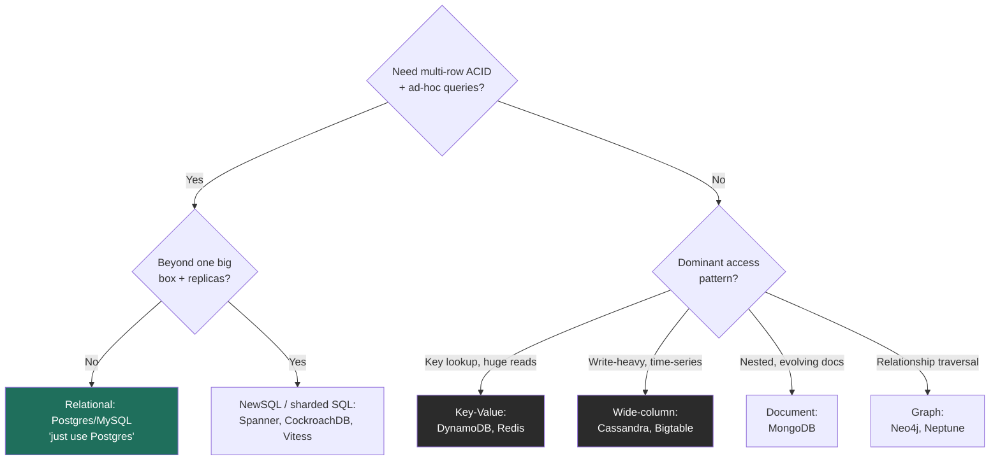

### Learning objectives
- State the *real* axes of difference (data model, consistency/transactions, scaling model, query flexibility), not the myth "SQL doesn't scale."
- Map the NoSQL families (KV, document, wide-column, graph) to access patterns and named technologies.
- Choose a store from requirements and defend it with trade-offs.
- Know when "just use Postgres" is the correct, senior answer, and when it isn't.

### Intuition first
**SQL is a meticulously organized filing cabinet** with enforced forms (schema), cross-references between drawers (joins), and a notary who guarantees every multi-step change is all-or-nothing (ACID transactions). **NoSQL is a set of specialized storage units**, each optimized for one job: giant labeled bins for instant lookup (key-value), flexible folders that hold whatever shape you put in (document), a columnar warehouse built to absorb floods of appends (wide-column), and a relationship web (graph). NoSQL trades the notary and the cross-references for raw scale, flexibility, or relationship speed.

### Deep explanation
**The four axes that actually differ (memorize these, not slogans):**

1. **Data model**, relational normalized tables (+ joins) vs document / key-value / wide-column / graph.
2. **Schema**, enforced *schema-on-write* (rigid, validated up front) vs flexible *schema-on-read* (the app interprets shape; "schemaless" still has a schema, it just lives in your code).
3. **Consistency & transactions**, classic SQL gives **ACID** with rich multi-row transactions; many NoSQL stores default to **BASE** (basically-available, soft-state, eventual) with limited transaction scope. *This line is blurring:* DynamoDB has transactions; **NewSQL** (Spanner, CockroachDB) delivers ACID *and* horizontal scale.
4. **Scaling model**, SQL traditionally scales **up** (bigger box) plus read replicas, and sharding is painful because cross-shard joins/transactions are hard; most NoSQL is built to scale **out** horizontally from day one.

**The NoSQL families → use case → named tech:**

| Family | Shape | Sweet spot | Tech |
|---|---|---|---|
| **Key-Value** | opaque value by key | caching, sessions, pure lookups, huge read scale | Redis, DynamoDB, Riak |
| **Document** | nested JSON-ish docs | evolving/semi-structured data, content, catalogs | MongoDB, Couchbase |
| **Wide-column** | rows with dynamic columns, partitioned | write-heavy, time-series, massive scale, tunable consistency | Cassandra, HBase, Bigtable |
| **Graph** | nodes + edges | relationship traversal (social, fraud, recommendations) | Neo4j, Neptune |

**The decision framework (what to say out loud):**
- Strong transactional integrity + complex ad-hoc queries + moderate scale → **relational (Postgres/MySQL)**.
- Massive write throughput + simple/known access patterns + horizontal scale + AP availability → **wide-column (Cassandra)** or **KV (DynamoDB)**.
- Flexible, nested, fast-evolving schema → **document (Mongo)**.
- Queries that are fundamentally about *relationships and traversal* → **graph**.
- Need both scale and ACID → **NewSQL (Spanner/CockroachDB)** or **sharded SQL (Vitess)**.

**The Director-level nuance, and the strongest signal here:** "Just use Postgres" is correct far more often than candidates assume. Modern Postgres scales further than its reputation (read replicas, declarative partitioning, `JSONB` for document-style flexibility, logical replication), and premature NoSQL adoption *gives away* transactions and ad-hoc query power you will miss, and pushes consistency/joins into application code. The mature move is to **choose by access pattern and consistency need**, acknowledge **polyglot persistence** (real systems use several stores, relational for core entities, blob for media, KV for cache, wide-column for feeds), and treat the database choice as reversible-with-cost rather than dogma.

### Diagram: store-selection decision tree

### Worked example: picking stores for a photo-sharing app (polyglot)
- **User accounts, follows, auth** → relational (Postgres, or Vitess-sharded MySQL at FB/IG scale): needs integrity, the social graph has real relational queries, and transactions matter for account state.
- **Photo binaries** → **blob store (S3)** + CDN, never the database; DBs are terrible at large opaque bytes.
- **Photo metadata + home feed** → **wide-column (Cassandra)** or precomputed **KV**: write-heavy, partition by user, tunable consistency, eventual is fine for feeds.
- **Hot read cache** → **Redis** for sessions and hot timelines.
Justify each by access pattern + consistency need. The signal isn't picking one database, it's recognizing that *different data has different needs* and matching deliberately.

### Trade-offs table: the four store types head-to-head
| | **Relational** | **Document** | **Wide-column** | **Key-Value** |
|---|---|---|---|---|
| Data model | tables + joins | nested docs | partitioned wide rows | opaque value by key |
| Consistency | ACID, strong | tunable, often eventual | tunable (quorum) | tunable, often eventual |
| Scaling | up + replicas; shard is hard | out | out (built for it) | out (built for it) |
| Query flexibility | high (ad-hoc, joins) | medium | low (design for queries) | lowest (key only) |
| **Use when** | integrity + complex queries | evolving semi-structured | write-heavy at massive scale | caching / pure lookups |

### What interviewers probe here
- **"Why NoSQL here, can't Postgres do it?"**, *Strong:* a specific reason tied to scale/access pattern/availability, *and* honesty that Postgres often could until a named threshold. *Red flag:* "NoSQL scales, SQL doesn't."
- **"What's your partition/shard key, and what goes wrong if you pick badly?"**, *Strong:* a key that spreads load and matches the read pattern; hot-partition risk if skewed (Lesson 2.5). *Red flag:* no shard key in mind.
- **"You chose Mongo, how do you do a transaction across two documents?"**, *Strong:* you know the support and limits (Mongo has multi-doc transactions but they're costlier; you'd design to avoid needing them). *Red flag:* assuming it's free, or unaware it's constrained.

### Common mistakes / misconceptions
- The myth "SQL doesn't scale", NewSQL and sharded SQL exist; Postgres goes further than people think.
- Choosing NoSQL, then discovering you need joins or multi-row transactions.
- Believing "schemaless" means no schema, it just moves schema enforcement into your app.
- Ignoring that NoSQL pushes consistency, joins, and validation into application code (a real cost).
- Treating the choice as religion rather than a per-access-pattern, reversible-with-cost decision.

### Practice questions
**Q1.** A URL shortener: which store, and why?
> *Model:* **Key-value (DynamoDB)**. Access is pure `shortcode → long URL` lookup, no joins, no ad-hoc queries, with enormous read skew and a need for high availability. KV gives O(1) lookups, horizontal scale, and AP behavior; the redirect tolerates eventual consistency. Relational would add overhead with no benefit for this access pattern.

**Q2.** When is wide-column (Cassandra) clearly better than relational?
> *Model:* Write-heavy, massive-scale, partition-friendly workloads, time-series, event logs, messaging, feeds, where you can design tables around known queries, tolerate eventual/quorum consistency, and need linear horizontal scale and multi-region availability without a single leader. The trade is no ad-hoc joins and you must model for the read up front.

**Q3.** What's the senior case for defaulting to Postgres?
> *Model:* It gives ACID, rich queries, mature operability, and `JSONB` flexibility, and scales via replicas/partitioning past most products' real needs. NoSQL trades away transactions and query power that you'll likely miss; adopting it prematurely adds distributed-systems complexity before you've hit the limit that justifies it. Choose by evidence (measured limits), not fashion.

### Key takeaways
- Differences that matter: data model, schema rigidity, consistency/transactions, scale-up vs scale-out, not "old vs new."
- NoSQL families map to access patterns: KV (lookups/cache), document (evolving), wide-column (write-heavy scale), graph (relationships).
- NewSQL (Spanner/Cockroach) and sharded SQL (Vitess) dissolve the "scale vs ACID" dichotomy.
- "Just use Postgres" is often the senior answer; choose by access pattern and consistency need.
- Real systems are polyglot, match each kind of data to the store that fits it.

> **Spaced-repetition recap:** Filing cabinet (SQL: schema, joins, ACID) vs specialized units (KV/document/wide-column/graph). Pick by access pattern + consistency need, not dogma; default to Postgres until a measured limit forces out-scaling; assume polyglot persistence.
