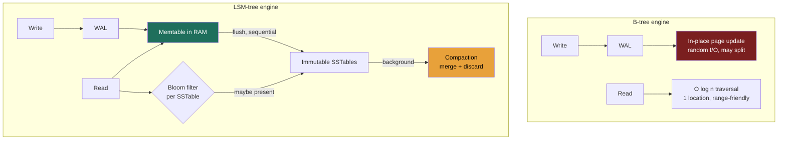

### Learning objectives
- Explain why indexes exist and the fundamental read / write / space trade-off they impose.
- Contrast **B-tree** (read-optimized, in-place) with **LSM-tree** (write-optimized, append + compact).
- Match a storage engine to a workload, and connect it back to the database families.
- Reason about secondary indexes and their cost, especially in distributed stores.

### Intuition first
An index is the **index at the back of a textbook.** Without it you scan every page (O(n)); with it you jump straight to the right page (O(log n)). But it isn't free, every addition must also update the index. **A B-tree is a meticulously maintained, always-sorted index that you edit in place**, superb for lookups, pricier per edit. **An LSM-tree is jotting new entries on sticky notes (instant append) and periodically reorganizing them into the master index in big batches** (compaction), superb for writes, but a lookup may check several stacks of notes.

### Deep explanation
**Why index at all, and the unavoidable trade-off:** an index turns an O(n) scan into an O(log n) lookup. The cost: indexes **speed reads but slow writes** and **consume space.** This three-way tension, read vs. write vs. space amplification, is the entire subject.

**The two engines, mechanics in one line: B-tree = in-place updates + WAL; LSM = append + background compaction.**

**B-tree (and B+tree):** a balanced, sorted tree updated in place. Reads are O(log n), predictable, and excellent for **range queries**; writes pay **random I/O** and write amplification. Used by Postgres, MySQL/InnoDB, most relational engines, read-optimized and operationally mature.

**LSM-tree (Log-Structured Merge):** every write is a cheap **sequential append** (recall: sequential ≫ random), batched in memory and flushed as immutable, sorted **SSTables**. Reads may have to check several files (**read amplification**), mitigated by **Bloom filters**; background **compaction** merges files and discards dead keys. Compaction strategy (size-tiered vs leveled) is a write-vs-read/space knob, name the trade, then hand the tuning to the storage team. Used by Cassandra, RocksDB, LevelDB, HBase, Bigtable, ScyllaDB, write-optimized.

Go deeper, write/read path mechanics and compaction strategies (IC depth, optional)

- **B-tree write path:** fixed-size pages (typically 4-16 KB) edited in place; inserting into a full page triggers a **page split** (write amplification), and every change is journaled to a **write-ahead log (WAL)** first for crash durability. Leaf pages are linked in sorted order, that's what makes range scans cheap.
- **LSM write path:** append to the WAL + insert into an in-memory sorted **memtable**; when it fills, flush the whole thing to disk as one immutable SSTable in a single sequential write.
- **LSM read path:** check the memtable, then SSTables newest→oldest; a per-SSTable Bloom filter lets a read skip files that provably don't contain the key.
- **Compaction strategies:** **size-tiered** merges similarly-sized SSTables, least write amplification, but more overlapping files per read and transient ~2× space during merges (write-optimized). **Leveled** maintains non-overlapping, size-bounded levels, fewer files per read and tighter space, at the cost of more rewrite work per ingested byte (read/space-optimized). RocksDB defaults to leveled; Cassandra defaults to size-tiered with leveled as the opt-in for read-heavy tables.

**The core trade, stated cleanly:** B-tree pays in **write amplification + random I/O** to keep reads cheap; LSM pays in **read amplification + space amplification + background compaction** to make writes a cheap sequential append. So write-heavy workloads (logs, metrics, messaging, feeds) favor LSM; read-heavy transactional workloads favor B-tree.

**Secondary indexes, the hidden tax:** every secondary index **slows every write and costs space.** In distributed stores they're constrained, DynamoDB's **global secondary index** is effectively another replicated table; in Cassandra you usually **denormalize into a second query-shaped table** instead.

**The operational point a Director should raise:** compaction is a **background tax**, CPU, disk I/O, **latency spikes**, temporary space bloat. "LSM is fast at writes" is incomplete; the full statement is "fast writes, paid back later by compaction you must capacity-plan and monitor."

### Diagram: write and read paths

### Worked example: metrics ingestion vs. an orders table
- **Metrics/time-series ingest** (recall the ~700k writes/s): overwhelmingly write-heavy, append-shaped, reads mostly over recent ranges → **LSM (Cassandra/Bigtable).** Sequential flushes absorb the write flood; Bloom filters keep read amplification in check.
- **Orders table** needing multi-row transactions, joins, and ad-hoc reporting → **B-tree (Postgres).** Reads and integrity dominate at modest write rate, in-place updates and rich indexing are exactly what you want.
The decision falls straight out of the **read:write ratio** plus the query shape, which is why you establish those in RESHADED's R step.

### Trade-offs table: B-tree vs LSM
| Engine | Write amp | Read amp | Space amp | Use when… |
|---|---|---|---|---|
| **B-tree** | higher (in-place, random I/O) | low (one location) | low | Read-heavy, transactional, range + ad-hoc queries |
| **LSM** | low (sequential append) | higher (multiple SSTables; Bloom filters help) | higher (transient, until compaction) | Write-heavy at scale: logs, metrics, messaging, feeds |

### What interviewers probe here
- **"Why is Cassandra so fast at writes?"**, *Strong:* sequential append to memtable+WAL, deferred sorting/merging via compaction, no in-place random I/O. *Red flag:* "it's distributed" (that's orthogonal).
- **"What does LSM cost you on reads, and how is it mitigated?"**, *Strong:* read amplification across SSTables, mitigated by Bloom filters and leveled compaction. *Red flag:* believing LSM reads are as cheap as writes.
- **"What's the operational cost of compaction?"**, *Strong:* CPU/IO load, latency spikes, transient space bloat, must be capacity-planned. *Red flag:* unaware it exists.

### Common mistakes / misconceptions
- Treating indexes as free, every index taxes writes and storage.
- Believing LSM is universally superior; it trades read/space/compaction cost for write speed.
- Over-indexing a write-heavy table (each secondary index multiplies write cost).
- Ignoring compaction as an operational concern.
- Forgetting that distributed secondary indexes are expensive/limited, denormalize instead.

### Practice questions
**Q1.** Why does LSM win for writes, and what do you give up in exchange?
> *Model:* LSM turns every write into a cheap sequential append instead of B-tree's random in-place I/O, sequential ≫ random is the whole win. You give up **read amplification** (several SSTables per lookup; Bloom filters and compaction bound it), transient **space amplification**, and **compaction itself**, a background CPU/I/O tax you must capacity-plan or it surfaces as latency spikes. Decide from the read:write ratio: pay compaction later only if writes dominate now.

**Q2.** Why does an LSM engine pair so naturally with the "sequential ≫ random" insight?
> *Model:* LSM deliberately converts random user writes into large **sequential** disk writes (flush) and sequential merges (compaction), dodging the random-I/O penalty that dominates write cost on disks, trading expensive random I/O now for cheaper, deferred, batched sequential I/O later.

**Q3.** When would you accept B-tree's higher write amplification on purpose?
> *Model:* When reads and consistency dominate: transactional systems with ad-hoc queries, range scans, and integrity needs at moderate write volume, predictable single-location reads and mature transactional support outweigh the in-place write cost. Exactly the relational-store case.

### Key takeaways
- Indexes trade faster reads for slower writes and more space, never free.
- B-tree: in-place, read-optimized, range-friendly, random write I/O → relational/transactional.
- LSM: append + compact, write-optimized, sequential I/O → write-heavy at scale (Cassandra/RocksDB).
- LSM read cost is tamed by Bloom filters + leveled compaction; compaction is an operational tax.
- Choose the engine from the read:write ratio and query shape, secondary indexes cost real money per write.

> **Spaced-repetition recap:** Textbook index. B-tree = sorted, in-place, cheap reads/pricier writes. LSM = sticky-notes + batched reorg (compaction), cheap sequential writes/pricier reads (Bloom filters help). Match engine to read:write ratio.

---
