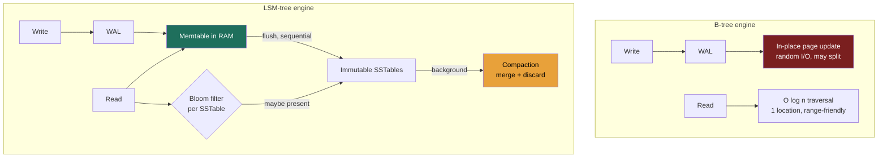

### Learning objectives
- Explain why indexes exist and the fundamental read / write / space trade-off they impose.
- Contrast **B-tree** (read-optimized, in-place) with **LSM-tree** (write-optimized, append + compact).
- Match a storage engine to a workload, and connect it back to the database families in Lesson 2.2.
- Reason about secondary indexes and their cost, especially in distributed stores.

### Intuition first
An index is the **index at the back of a textbook.** Without it you scan every page (a full table scan, O(n)); with it you jump straight to the right page (O(log n)). But the index isn't free — every time you add content you must also update the index. **A B-tree is a meticulously maintained, always-sorted index that you edit in place** — superb for lookups, but each change is a careful, somewhat expensive edit. **An LSM-tree is jotting new entries on sticky notes (instant append) and periodically reorganizing them into the master index in big batches** (compaction) — superb for writes, but a lookup may have to check several stacks of notes before it finds the answer.

### Deep explanation
**Why index at all, and the unavoidable trade-off:** an index turns an O(n) scan into an O(log n) lookup. The cost: indexes **speed reads but slow writes** (every write must maintain every index) and **consume space.** This three-way tension — read amplification vs. write amplification vs. space amplification — is the entire subject.

**B-tree (and B+tree):** a balanced, sorted tree of fixed-size pages, updated **in place.**
- *Reads:* O(log n), predictable, and excellent for **range queries** (leaf nodes are linked in order).
- *Writes:* in-place updates cause **random I/O**, occasional **page splits** (write amplification), and require a **write-ahead log (WAL)** for crash durability.
- *Used by:* Postgres, MySQL/InnoDB, most relational engines. Read-optimized and operationally mature.

**LSM-tree (Log-Structured Merge):** optimized for write throughput.
- *Write path:* append to a WAL + insert into an in-memory sorted **memtable**; when it fills, flush it to an immutable on-disk **SSTable** as one **sequential** write (recall 1.4: sequential ≫ random).
- *Read path:* check memtable, then SSTables newest→oldest — potentially several files (**read amplification**). **Bloom filters** (Lesson 2.9) let a read skip SSTables that provably don't contain the key.
- *Compaction:* a background process merges SSTables, discarding overwritten and deleted keys. Strategy is a tunable knob: **size-tiered** (more write-optimized) vs **leveled** (more read- and space-optimized).
- *Used by:* Cassandra, RocksDB, LevelDB, HBase, Bigtable, ScyllaDB. Write-optimized.

**The core trade, stated cleanly:** B-tree pays in **write amplification + random I/O** to keep reads cheap; LSM pays in **read amplification + space amplification + background compaction** to make writes a cheap sequential append. So write-heavy workloads (logs, metrics, messaging, feeds) favor LSM; read-heavy transactional workloads favor B-tree.

**Secondary indexes — the hidden tax:** an index on a non-primary column. Each one **slows every write and costs space.** In distributed stores they get expensive and constrained — DynamoDB distinguishes **local** vs **global** secondary indexes (the global one is effectively another replicated table); Cassandra's secondary indexes are notoriously limited and you usually **denormalize into a second query-shaped table** instead.

**The operational point a Director should raise:** compaction is a **background tax** — it consumes CPU and disk I/O and can cause **latency spikes** and temporary space bloat. "LSM is fast at writes" is incomplete; the full statement is "fast writes, paid back later by compaction you must capacity-plan and monitor."

### Diagram — write and read paths

### Worked example — metrics ingestion vs. an orders table
- **Metrics/time-series ingest** (recall the ~700k writes/s from Lesson 1.3): overwhelmingly write-heavy, append-shaped, reads mostly over recent ranges → **LSM (Cassandra/Bigtable).** Sequential flushes absorb the write flood; recent-range reads stay in the upper SSTable levels; Bloom filters keep point-lookup read amplification in check.
- **Orders table** needing multi-row transactions, joins to customers/products, and ad-hoc reporting → **B-tree (Postgres).** Reads and integrity dominate; write rate is modest; in-place updates and rich indexing are exactly what you want.
The decision falls straight out of the **read:write ratio** plus the query shape — which is why you establish those in RESHADED's R step.

### Trade-offs table — storage engine / compaction strategy
| Engine | Write amp | Read amp | Space amp | Use when… |
|---|---|---|---|---|
| **B-tree** | higher (in-place, splits) | low (one location) | low | Read-heavy, transactional, range + ad-hoc queries |
| **LSM size-tiered** | low | higher | higher (transient) | Very write-heavy, throughput over read latency |
| **LSM leveled** | medium | medium | lower | Write-heavy but reads/space also matter |

### What interviewers probe here
- **"Why is Cassandra so fast at writes?"** — *Strong:* sequential append to memtable+WAL, deferred sorting/merging via compaction, no in-place random I/O. *Red flag:* "it's distributed" (that's orthogonal).
- **"What does LSM cost you on reads, and how is it mitigated?"** — *Strong:* read amplification across SSTables, mitigated by Bloom filters and leveled compaction. *Red flag:* believing LSM reads are as cheap as writes.
- **"What's the operational cost of compaction?"** — *Strong:* CPU/IO load, latency spikes, transient space bloat — must be capacity-planned. *Red flag:* unaware it exists.

### Common mistakes / misconceptions
- Treating indexes as free — every index taxes writes and storage.
- Believing LSM is universally superior; it trades read/space/compaction cost for write speed.
- Over-indexing a write-heavy table (each secondary index multiplies write cost).
- Ignoring compaction as an operational concern.
- Forgetting that distributed secondary indexes are expensive/limited — denormalize instead.

### Practice questions
**Q1.** Your write throughput is fine but read latency is spiky on a Cassandra table. What's likely and what would you tune?
> *Model:* Reads are touching many SSTables (high read amplification), worsened by size-tiered compaction falling behind. Tune toward **leveled compaction** (fewer SSTables per read, better read/space at the cost of more write amplification), verify Bloom filter sizing, and ensure the data is modeled so reads hit a single partition. Confirm compaction isn't starved for I/O.

**Q2.** Why does an LSM engine pair so naturally with the "sequential ≫ random" insight from Lesson 1.4?
> *Model:* LSM deliberately converts random user writes into large **sequential** disk writes (flush) and large sequential merges (compaction), avoiding the random-I/O penalty that dominates write cost on disks. It pays this back as deferred, batched, sequential compaction work — trading expensive random I/O now for cheaper sequential I/O later.

**Q3.** When would you accept B-tree's higher write amplification on purpose?
> *Model:* When reads and consistency dominate: transactional systems with ad-hoc queries, range scans, and strong integrity needs at moderate write volume. The predictable single-location reads and mature transactional support outweigh the in-place write cost — exactly the relational-store case.

### Key takeaways
- Indexes trade faster reads for slower writes and more space — never free.
- B-tree: in-place, read-optimized, range-friendly, random write I/O → relational/transactional.
- LSM: append + compact, write-optimized, sequential I/O → write-heavy at scale (Cassandra/RocksDB).
- LSM read cost is tamed by Bloom filters + leveled compaction; compaction is an operational tax.
- Choose the engine from the read:write ratio and query shape — secondary indexes cost real money per write.

> **Spaced-repetition recap:** Textbook index. B-tree = sorted, in-place, cheap reads/pricier writes. LSM = sticky-notes + batched reorg (compaction), cheap sequential writes/pricier reads (Bloom filters help). Match engine to read:write ratio.

---
