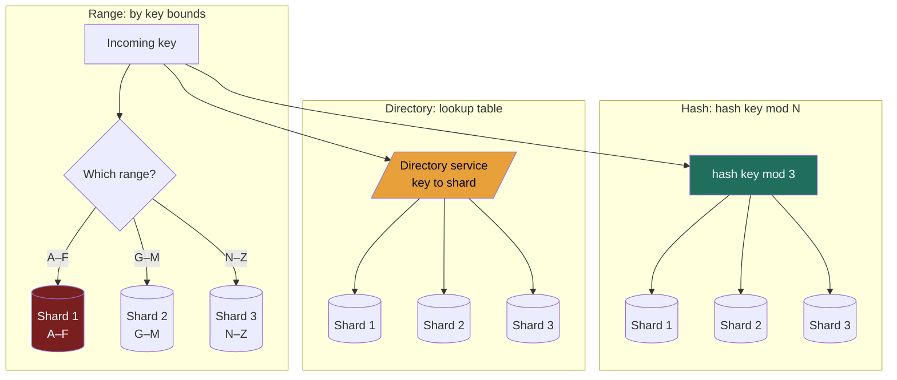

import ShardingVisualizer from '@components/widgets/ShardingVisualizer.jsx';

### Learning objectives
- Explain *why* we partition — when data volume or write throughput outgrows a single node — and distinguish partitioning from replication (the topic of 2.4).
- Contrast the three partitioning strategies — **range**, **hash**, and **directory/lookup** — and state the trade-off each makes on routing, range scans, and skew.
- Reason about **hot spots / celebrity keys**, and know which strategy each one is vulnerable to and how it's mitigated.
- Quantify the **rebalancing tax** — how much data moves when N changes — and choose a **partition key** that spreads load *and* matches the read pattern.

### Intuition first
Replication (Lesson 2.4) was photocopying one book so many people could read it at once. **Partitioning is the opposite problem: the library has grown too big for one building, so you split the *collection* across several branches** — no single branch holds everything. Now every patron needs a rule for *which branch* a given book lives in.

Three rules are possible. **Range:** "A–F downtown, G–M uptown, N–Z at the airport." Browsing "everything by authors starting with B" is one trip — but if a hit author drops a series, that one branch is mobbed while the others sit idle. **Hash:** "run the title through a blender; the number that pops out picks the branch." Load spreads beautifully evenly — but "everything A–F" is now scattered everywhere, so a range browse means visiting every branch. **Directory:** "ask the master index desk which branch holds your book." Total flexibility to place anything anywhere — but every request starts at that one desk, and if the desk is down, the library is down.

Three rules, three different things you're optimizing and giving up. That choice — not the mechanics of any one of them — is the lesson.

### Deep explanation

**Why partition at all (and the clean distinction from replication).** Two independent ceilings force the split: **data volume** (50 TB does not fit a 2 TB NVMe box — ~25 shards just to hold the bytes) and **write throughput** (the 700k writes/s metrics-ingest figure from Lesson 1.3 against ~30k writes/s per node — replicas don't help, because every replica must absorb *every* write). Hold the distinction precisely: **replication = the same data copied to many nodes** (availability, read scale); **partitioning (sharding) = different data split across many nodes** (capacity, write scale). They're orthogonal, and nearly every real system does both — partition first, then replicate each partition ~3×. "Partition" is the textbook word, "shard" the operational one.

**Horizontal vs vertical.** *Vertical* partitioning splits by **columns** — move the rarely-read `bio`/blob columns out so the hot row stays cache-dense; a locality optimization, still capped at one machine. *Horizontal* partitioning splits by **rows** and is the only one that raises the data/throughput ceiling — it's what "sharding" means, and what this lesson means by "partitioning."

**1) Range partitioning.** Contiguous key ranges per partition (`A–F`, `G–M`, `N–Z`; Jan–Mar on shard 1). *Win:* **range scans are cheap and local**, and keys arrive sorted — exactly what an LSM-tree (2.3) wants. *Cost:* **skew is the default failure mode** — range-partition by timestamp and *all* of today's writes land on the single newest shard (the "hot-shard-of-the-day"). Used by HBase, Bigtable, MongoDB (ranged), CockroachDB, Spanner — these lean on **automatic range splitting**: a too-big or too-hot range splits in two and one half migrates, no human required.

**2) Hash partitioning.** Hash the key and let the hash decide — naively, `partition = hash(key) mod N`. *Win:* uniform scatter; sequential/time-ordered keys stop hot-spotting. *Cost:* **locality destroyed** — range scans become a scatter-gather across every partition — and `mod N` has a second, vicious cost: **change N and almost every key remaps** (below). Used by Cassandra and DynamoDB (partition-key hashing), Redis Cluster (hash slots), MongoDB (hashed). The common refinement: **hash a high-cardinality prefix to pick the shard, keep a sortable suffix for local ordering** — Cassandra's compound partition/clustering keys — buying even spread *and* local range scans within a partition.

**3) Directory / lookup partitioning.** An explicit **lookup table** mapping key → partition, consulted on every request. *Win:* **total flexibility** — place any key anywhere, move a single hot key, run heterogeneous shards. *Cost:* an **extra hop on every request and a potential SPOF/bottleneck** — replicate and cache it aggressively. The model behind **Vitess** (sharded MySQL at YouTube/Slack) and the **HDFS NameNode / GFS master** — the directory's availability *is* the system's availability.

**Hot spots / celebrity keys.** Even a perfect hash assumes key *access* is uniform; real workloads are Zipfian — a Justin Bieber tweet or a Black-Friday SKU concentrates traffic onto **one key**, and one key lives on one partition. **Hashing spreads keys, not a single key's load.** Mitigations, in escalating order: (a) **salting** — append a bucket suffix to spread one hot key across ~10 physical partitions, scatter-gather on read (DynamoDB's "write sharding"); (b) a **dedicated shard** for known whales (placed via a directory); (c) **cache the hot key** in Redis — the most common real answer for read-hot keys (Lesson 2.10); (d) **fan-out-on-read** for celebrities instead of fan-out-on-write (Twitter's hybrid timeline). The Director signal: *uniform key spread ≠ uniform load*, and naming the salt/cache/dedicated-shard fix.

**Rebalancing — the `mod N` cliff.** When N changes, reassignment means **copying real bytes over the network while serving live traffic.** Under `hash(key) mod N`, going from 4 to 5 nodes remaps roughly **80% of all keys** — on a 50 TB dataset that's ~40 TB of movement and a cache-miss storm just to add 25% capacity. That pain is precisely what **consistent hashing (Lesson 2.6)** exists to fix: only ~**K/N keys** move when a node joins or leaves. Range systems avoid the cliff by splitting/merging individual ranges; directory systems edit the lookup table for just the moved keys.

**Choosing a partition key — the decision that quietly governs everything.** A good key has **high cardinality**, **uniform access**, and **alignment with the dominant query** — and the three pull against each other. `user_id` spreads writes beautifully but makes "all orders in the last hour" a global scatter-gather; `timestamp` makes the time query local but hot-spots the newest shard. **The partition key pre-commits which query is cheap and which query you've made expensive** — so pick it from RESHADED's R step (the dominant access pattern and read:write ratio) and name the query you deliberately sacrificed. Composite keys (hash the user, sort by time within the partition) often reconcile the tension.

### Diagram — the three partitioning strategies (same 8 keys, three placements)

Range keeps neighbors together (cheap scans, skew risk, red = the hot newest shard). Hash scatters for even load (green = uniform spread, scans fan out). Directory adds a flexible-but-load-bearing lookup hop (amber = the bottleneck/SPOF you must replicate).

### Try it — partitioning strategies and skew, live
The widget places a stream of keys across N shards under each strategy so you can *watch the load distribution*. Add a **celebrity key** and see hashing fail to flatten it until you apply salting; switch to **range** and watch sequential keys pile onto the newest shard; then **add or remove a node** — naive `hash mod N` lights up almost the whole keyspace as "moved," while range-split and directory move only the affected slice. It makes the rebalancing tax and the celebrity-key problem visible before 2.6 formalizes the fix.

<ShardingVisualizer client:load />

### Worked example — Discord's message store (and a Twitter celebrity)
Discord stores **trillions of messages** on Cassandra/ScyllaDB; the dominant query — "recent messages **in this channel**" — dictates the partition key. The pattern: a **composite partition key of `channel_id` plus a coarse time bucket, hashed together, with messages time-ordered within the partition** (the exact schema is the data team's to own; the decision is the shape). Hashing the composite gives even spread (no hot-shard-of-the-day); the channel query resolves to **one partition**, already time-sorted; and because the time bucket is *in* the partition key, no megachannel grows one unbounded partition. The accepted cost: a query spanning many time windows reads several partitions, and a cross-channel search is a full fan-out — rare queries deliberately made expensive so the common one stays cheap. That is the whole game: **choose the key from the dominant access pattern, and name the query you made expensive.**

Go deeper — Discord's exact Cassandra schema (IC depth, optional)

The schema is `PRIMARY KEY ((channel_id, bucket), message_id)`. The double parens matter: `(channel_id, bucket)` is a *composite partition key* — both columns hashed together to place the partition — and `message_id`, a time-ordered Snowflake ID, is the *clustering key* that sorts messages within each partition. `bucket` is a coarse (~10-day) time window; putting it in the partition key rather than the clustering key is the deliberate move, because Cassandra punishes huge partitions — bounding partition size is exactly why the bucket lives there. A read resolves `channel_id` plus the current bucket to a single partition and walks back through older buckets only when a page spans windows.

Now the **celebrity** version: a Twitter user with 100M followers. Even with perfectly hashed user partitions, that *one* `user_id` is a single hot partition for fan-out writes and profile reads — hashing can't split a single key. Twitter's answer is hybrid: ordinary users get **fan-out-on-write** (push tweets to followers' precomputed timelines); celebrities get **fan-out-on-read** (merged in at read time) plus heavy **caching** of the hot key — the "uniform-key-spread ≠ uniform-load" mitigation in production.

### Trade-offs table — range vs hash vs directory
| | **Range** | **Hash (`mod N` / consistent)** | **Directory / lookup** |
|---|---|---|---|
| Load distribution | uneven; skews easily | **even** (good hash) | as even as you place it |
| Range scans | **cheap, local** (sorted) | expensive (scatter-gather) | depends on placement |
| Routing cost | compute range, no extra hop | compute hash, no extra hop | **extra hop** to the directory |
| Hot-spot risk | **high** (time/sequential keys) | low for keys; *single hot key still hot* | low (move the hot key) |
| Rebalancing | split/merge a range | naive `mod N`: ~all keys move; consistent: ~1/N | edit table for moved keys only |
| Failure surface | per-shard | per-shard | **directory is a SPOF** (must replicate) |
| **Use when…** | range/recency queries dominate (time-series, leaderboards, scans) | uniform point-lookups, even spread, no scans (KV, sessions, feeds) | you need surgical placement / heterogeneous shards / per-key moves (Vitess, GFS/HDFS masters) |

### What interviewers probe here
- **"Replication or partitioning — which problem are you solving?"** — *Strong:* names them as orthogonal (replication for availability/read-scale, partitioning for capacity/write-scale) and does both — partition for the bytes/writes, replicate each partition ~3×. *Red flag:* "add replicas" to fix a write-throughput ceiling.
- **"What's your partition key, and what query did you just make expensive?"** — *Strong:* high cardinality + uniform access + alignment to the dominant read, *and* explicit ownership of the now-costly scatter-gather query. *Red flag:* no key in mind, or a key like `timestamp`/`country` that hot-spots — with no awareness of it.
- **"A single celebrity key melts one shard — now what?"** — *Strong:* recognizes hashing can't split one key; reaches for salting, a dedicated shard, caching the hot key, or fan-out-on-read. *Red flag:* "hash it" (hashing spreads *keys*, not one key's load).
- **"You add a node to a 4-shard hash cluster — what happens?"** — *Strong:* under `mod N` ~80% of keys relocate (a data-movement and cache-miss storm) — which is *why* consistent hashing exists (~1/N moves); sets up 2.6. *Red flag:* assuming adding a node is cheap/instant.
- **"How does this rebalance operationally?"** — *Strong:* live migration cost, throttled backfill to protect tail latency, automatic split/merge (Bigtable/Cockroach) or consistent hashing (Cassandra/Dynamo) keeping it humane. *Red flag:* treats rebalancing as free (a Director owns this operational pain).

### Common mistakes / misconceptions
- **Conflating partitioning with replication** — they solve different problems and you almost always need both.
- **Thinking hashing cures *all* hot spots** — it cures skewed *key distribution*, not a single overloaded *key*; celebrity keys need salting/caching/dedicated shards.
- **Range-partitioning by timestamp** without realizing all current writes pile onto one shard (the hot-shard-of-the-day).
- **Ignoring the `mod N` rebalancing cliff** — naive hash sharding makes adding capacity move almost the entire dataset (the motivation for 2.6).
- **Picking a low-cardinality/skewed key** (`country`, one giant `tenant_id`) **or one that fights the dominant read** — a few shards swell while every query scatter-gathers.

### Practice questions
**Q1.** You're storing IoT sensor readings (high write volume, queried as "this device's readings over a time window"). Range or hash partitioning, and on what key?
> *Model:* Hash on a **composite of `device_id` plus a coarse time bucket**, with readings time-ordered within the partition. Pure range-on-timestamp hot-spots the newest shard; pure hash-on-time scatters a device's time scan across the whole cluster. The composite buys even write spread *and* a local, already-sorted per-device scan, and the bucket bounds partition size so one chatty device can't grow an unbounded partition — the Discord pattern. The query made expensive: cross-device analytics becomes a fan-out, acceptable because it's the rare access pattern. The exact schema is the data team's call; the key shape is the decision.

**Q2.** A naive service uses `shard = hash(user_id) mod 8`. Traffic grows; you add 2 shards (→10). What happens, and how would you have designed to avoid it?
> *Model:* Going `mod 8 → mod 10` re-maps almost every key — only ~**20% keep their slot, so ~80% of the dataset relocates**, with a cache-miss storm and migration load against live traffic. (The counter-intuitive part: a bigger cluster doesn't reshuffle less — you can't grow your way out.) The fix is **consistent hashing** (Lesson 2.6): a ring where a new node steals only ~**1/N** of keys from its neighbors. Alternatively a **directory** remaps only the keys you choose to move. `hash mod N` is fine until N changes — and N *will* change.

**Q3.** Your design partitions an e-commerce orders table by `country`. What's wrong, and what would you do?
> *Model:* `country` is **low-cardinality and badly skewed** — the US/India shard dwarfs the Vatican shard, a handful of partitions saturate while most idle, and you can't grow past the number of countries or split a mega-country under this key. Repartition on a **high-cardinality, uniform key aligned to the dominant query** — hashed `user_id` if most reads are "this user's orders." If geo genuinely matters (data residency, latency), keep `country` as a *routing/region* dimension and shard *within* each region by a high-cardinality key — never let the partition key itself be the skewed dimension.

**Q4.** When is directory/lookup partitioning worth its extra hop and SPOF risk over plain hashing?
> *Model:* When you need **placement control hashing can't give**: isolating a whale key on its own shard, running **heterogeneous** shards, migrating individual keys/tenants surgically, or evolving topology frequently (Vitess resharding MySQL). You pay an extra lookup hop and must make the directory highly available (replicate + cache, as GFS/HDFS do with their masters). If access is uniform point-lookups with no surgical moves needed, plain (consistent) hashing is simpler — don't take on a directory you don't need.

### Key takeaways
- **Partition when data or write throughput outgrows one node** — replication multiplies reads; only partitioning raises the per-node *write/capacity* ceiling; do both (partition, then replicate each shard).
- **Range** = cheap local scans but skew/hot-spot risk; **hash** = even spread but no scans and the `mod N` cliff; **directory** = total placement flexibility but an extra hop and a SPOF.
- **Hashing spreads keys, not a single hot key** — celebrity/Zipfian keys need salting, a dedicated shard, caching, or fan-out-on-read.
- **`hash mod N` rebalancing is catastrophic** — ~80% of keys move to grow a 4-node cluster by one; exactly what consistent hashing (2.6) fixes (~1/N moves).
- **Pick the partition key from the dominant access pattern** — high cardinality + uniform access + query alignment — and explicitly name the query you made expensive.

> **Spaced-repetition recap:** Replication copies the same data (read scale); partitioning splits different data (write/capacity scale) — do both. Range = local scans + skew; hash = even spread, no scans, `mod N` reshuffles everything; directory = flexible placement + a load-bearing lookup. Hashing can't split one celebrity key (salt/cache/dedicate it). The partition key pre-commits the query you made expensive; `mod N`'s rebalancing pain is what 2.6 solves.
