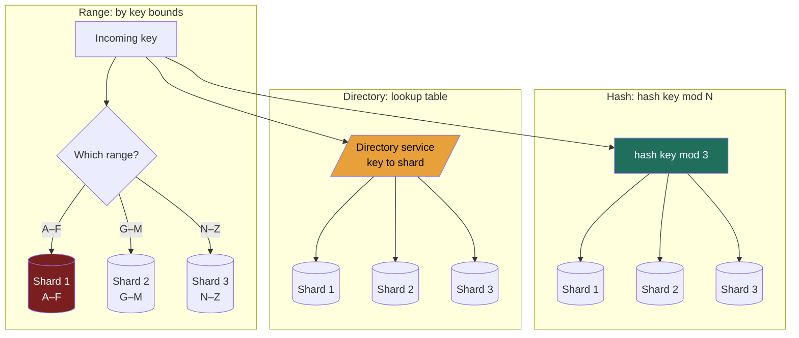

import ShardingVisualizer from '@components/widgets/ShardingVisualizer.jsx';

### Learning objectives
- Explain *why* we partition — when data volume or write throughput outgrows a single node — and distinguish partitioning from replication (the topic of 2.4).
- Contrast the three partitioning strategies — **range**, **hash**, and **directory/lookup** — and state the trade-off each makes on routing, range scans, and skew.
- Reason about **hot spots / celebrity keys**, and know which strategy each one is vulnerable to and how it's mitigated.
- Quantify the **rebalancing tax** — how much data moves when N changes — and choose a **partition key** that spreads load *and* matches the read pattern.

### Intuition first
Replication (Lesson 2.4) was photocopying one book so many people could read it at once. **Partitioning is the opposite problem: the library has grown too big for one building, so you split the *collection* across several branches** — no single branch holds everything. Now every patron and every shelving cart needs a rule for *which branch* a given book lives in.

Three rules are possible. **Range:** "A–F at the downtown branch, G–M uptown, N–Z at the airport." Browsing "everything by authors starting with B" is one trip — but if a hit author drops a series and everyone wants the D shelf, that one branch is mobbed while the others sit idle. **Hash:** "run the title through a blender, and the number that pops out decides the branch." Load spreads beautifully evenly — but "everything A–F" is now scattered across all branches, so a range browse means visiting all of them. **Directory:** "there's a master index desk; ask it which branch holds your book." Total flexibility to place anything anywhere — but every single request now starts at that one desk, and if the desk is down, the whole library is down.

Three rules, three different things you're optimizing and three different things you're giving up. That choice — not the mechanics of any one of them — is the lesson.

### Deep explanation

**Why partition at all (and the clean distinction from replication).** Two independent ceilings force the split. (1) **Data volume:** a single node has a finite disk. 50 TB of data does not fit on a 2 TB NVMe box — you need ~25 shards just to hold the bytes, before any performance argument. (2) **Throughput:** a single node has finite CPU, memory, and IOPS. If your write rate is 700k writes/s (the metrics-ingest figure from Lesson 1.3) and one node sustains ~30k writes/s, no amount of replication helps — replicas multiply *reads*, but every replica must absorb *every* write, so the write ceiling is per-node and only **partitioning** raises it. Hold the distinction precisely: **replication = the same data copied to many nodes** (availability, read scale); **partitioning (sharding) = different data split across many nodes** (capacity, write scale). They are orthogonal and nearly every real system does both — partition first to spread the data, then replicate each partition ~3× for durability and read availability. The terms are interchangeable in practice; "partition" is the textbook word, "shard" the operational one.

**Horizontal vs vertical partitioning — don't confuse the two.** *Vertical* partitioning splits a table by **columns** — move the rarely-read, fat `bio` and `avatar_blob` columns into a separate table so the hot `users` row stays small and cache-dense. It's a schema/locality optimization and caps out at one machine's worth of one column set. *Horizontal* partitioning (the one that matters for scale, and what "sharding" almost always means) splits by **rows** — user IDs 1–1M on shard A, 1M–2M on shard B. Only horizontal partitioning lets total data and total throughput exceed a single node. For the rest of this lesson, "partitioning" means horizontal.

**The three strategies — what each optimizes and what it costs.**

**1) Range partitioning.** Assign contiguous key ranges to partitions (timestamps `Jan→Mar` on shard 1, `Apr→Jun` on shard 2; usernames `A–F`, `G–M`, `N–Z`). *Win:* **range scans are cheap and local** — "all events in Q1" or "usernames A–C" hit one or two adjacent shards, and keys arrive **sorted**, which is exactly what an LSM-tree (2.3) wants. *Cost:* **skew and hot spots are the default failure mode.** Time-ordered keys are the classic trap — if you range-partition by timestamp, *all* of today's writes land on the single newest shard while every older shard goes cold (the "hot-shard-of-the-day" problem). Used by **HBase, Bigtable, MongoDB (ranged), CockroachDB, Spanner** — note these systems lean on **automatic range splitting**: a range that gets too big or too hot is split in two and one half migrates, which keeps ranges balanced without a human.

**2) Hash partitioning.** Apply a hash to the key and let the hash decide the partition — the canonical naive form is `partition = hash(key) mod N`. *Win:* a good hash **uniformly scatters** keys, so load spreads evenly and sequential/time-ordered keys stop being a hot-spot risk — `hash(t)` for consecutive `t` lands on different shards. *Cost:* you **destroy locality** — adjacent keys are flung apart, so **range scans must fan out to every partition** (a "scatter-gather"). And `mod N` has a second, vicious cost that sets up the next lesson: **change N and almost every key remaps** (below). Used by **Cassandra and DynamoDB** (via partition-key hashing), Redis Cluster (hash slots), and MongoDB (hashed sharding). A common refinement is **hash-of-prefix + range-within**: hash a high-cardinality prefix to pick the shard, keep a sortable suffix for local ordering — Cassandra's compound partition/clustering keys are exactly this, buying even spread *and* local range scans within a partition.

**3) Directory / lookup partitioning.** Keep an explicit **lookup table** (the "directory") mapping key → partition, consulted on every request. *Win:* **total flexibility** — you can place any key on any shard, move a single hot key off its shard, add capacity and remap surgically, and run heterogeneous shards. It decouples the key from its location entirely. *Cost:* the directory is **an extra hop on every request and a potential single point of failure / bottleneck**; you must replicate and cache it aggressively. This is the model behind **Vitess** (the `VSchema`/topology service for sharded MySQL, used by YouTube/Slack) and the master/metadata services in **HDFS (NameNode)** and **GFS (master)** — and it's why those masters are so heavily engineered for HA: the directory's availability *is* the system's availability.

**Hot spots / celebrity keys — the skew problem each strategy must answer.** Even a perfect hash assumes *key access is uniform.* Real workloads are Zipfian: a Justin Bieber tweet, a Black-Friday SKU, or a viral video concentrates a huge fraction of traffic onto **one key** — and a single key, by definition, lives on a single partition. Hashing spreads keys but **cannot spread a single hot key** — that's the failure hashing alone won't save you from. The mitigations, in escalating order: (a) **key salting / decomposition** — append a bucket suffix (`celebrityId#0..#9`) to spread one logical key across 10 physical partitions, then scatter-gather on read (DynamoDB's "write sharding" guidance); (b) a **dedicated shard** for known whales (place that one key alone via a directory); (c) **cache the hot key** in Redis so the hot partition is shielded from the read flood (Lesson 2.10) — the most common real answer for read-hot keys; (d) **fan-out-on-read for celebrities** rather than fan-out-on-write (Twitter's hybrid timeline). The Director signal is recognizing that *uniform-key-spread ≠ uniform-load*, and naming the salt/cache/dedicated-shard fix.

**Rebalancing — the cost of moving data when N changes.** When you add a node (capacity) or lose one (failure), keys must be reassigned, and **reassignment means copying real bytes over the network while serving live traffic.** This is where naive hashing is a disaster. Under `hash(key) mod N`, moving from `N=4` to `N=5` changes the modulus for *almost every key*: only the keys where `hash(key) mod 4 == hash(key) mod 5` stay put — empirically about **1/N**, so roughly **80% of all keys relocate** to grow a 4-node cluster by one node. On a 50 TB dataset that's ~40 TB of data movement and a cache-miss storm just to add 25% capacity. That pain — that `mod N` rebalancing is catastrophically expensive — is precisely the problem **consistent hashing (Lesson 2.6)** exists to solve, by guaranteeing only ~**1/N of keys** (~K/N keys) move when a node joins or leaves. Range and directory schemes avoid the `mod N` cliff differently: range systems **split/merge** individual ranges (move one range, not the whole keyspace); directory systems **edit the lookup table** for just the keys being relocated.

**Choosing a partition key — the decision that quietly governs everything.** A good partition key satisfies three things at once: **high cardinality** (enough distinct values to spread across all shards), **uniform access** (no single value carries a disproportionate share of traffic), and **alignment with the dominant query** (the key your reads filter on, so a query hits one shard, not all of them). These pull against each other — `user_id` spreads writes beautifully but forces a *global* scatter-gather for "all orders in the last hour"; `timestamp` makes that time query local but hot-spots the newest shard. The senior move is to pick the key from the **R step of RESHADED** — the *dominant* access pattern and read:write ratio — and explicitly name the query you're making expensive. Composite keys (`user_id` + `timestamp`) often reconcile the tension: hash the user for spread, sort by time within the partition for local recency scans.

### Diagram — the three partitioning strategies (same 8 keys, three placements)

Range keeps neighbors together (cheap scans, skew risk, red = the hot newest shard). Hash scatters for even load (green = uniform spread, scans fan out). Directory adds a flexible-but-load-bearing lookup hop (amber = the bottleneck/SPOF you must replicate).

### Try it — partitioning strategies and skew, live
The widget below lets you place a stream of keys across N shards under each strategy and *watch the load distribution*. Add a **celebrity key** and see hashing fail to flatten it (one bar spikes regardless of N) until you apply salting; switch to **range** and watch sequential keys pile onto the newest shard; then **add or remove a node** and compare how much data relocates — naive `hash mod N` lights up almost the entire keyspace as "moved," while range-split and directory move only the affected slice. It makes the rebalancing tax and the celebrity-key problem visible before we formalize the fix in 2.6.

<ShardingVisualizer client:load />

### Worked example — Discord's message store (and a Twitter celebrity)
Discord stores **trillions of messages**; the data plainly exceeds any single node, so it must be partitioned. The dominant query is "give me the recent messages **in this channel**," which dictates the partition key. They shard Cassandra/ScyllaDB on the schema `PRIMARY KEY ((channel_id, bucket), message_id)` — the double-parens matter: **`(channel_id, bucket)` is a *composite partition key*** (the two are hashed *together* to place the partition), and **`message_id`** — a time-ordered Snowflake — is the **clustering key** that orders messages *within* each partition. The `bucket` is a coarse time window (e.g. a ~10-day span); folding it into the partition key is the deliberate move, because it makes each `channel × time-window` its own partition rather than letting one busy channel accrete a single unbounded partition.

Watch how this resolves the tensions: hashing the composite `(channel_id, bucket)` gives **even spread** across the cluster (no hot-shard-of-the-day); the read filters on `channel_id` and resolves to the current `bucket`, so "recent messages in channel X" hits **one partition**, not a scatter-gather; messages sort by `message_id` *inside* that partition, so the recency scan is **local and already time-ordered**; and because `bucket` is *in the partition key*, no single megachannel's partition grows unbounded (Cassandra punishes huge partitions — the bound is the reason `bucket` lives in the partition key, not the clustering key). The cost they accept: a query spanning many time windows reads several partitions, and a cross-channel query ("search all of a user's messages everywhere") is a full fan-out — but those are the rare queries, so they make the common one cheap and pay for the rare one. That is the whole game: **choose the key from the dominant access pattern, and name the query you deliberately made expensive.**

Now the **celebrity** version of the same problem: a Twitter user with 100M followers. Even with perfectly hashed user partitions, that *one* `user_id` is a single hot partition for both fan-out writes and profile reads — hashing can't split a single key. Twitter's answer is hybrid: ordinary users get **fan-out-on-write** (push the tweet to followers' precomputed timelines), but celebrities get **fan-out-on-read** (their tweets are merged in at read time) plus heavy **caching** of the hot key — exactly the "uniform-key-spread ≠ uniform-load" mitigation.

### Trade-offs table — range vs hash vs directory
| | **Range** | **Hash (`mod N` / consistent)** | **Directory / lookup** |
|---|---|---|---|
| Load distribution | uneven; skews easily | **even** (good hash) | as even as you place it |
| Range scans | **cheap, local** (sorted) | expensive (scatter-gather) | depends on placement |
| Routing cost | compute range, no extra hop | compute hash, no extra hop | **extra hop** to the directory |
| Hot-spot risk | **high** (time/sequential keys) | low for keys; *single hot key still hot* | low (move the hot key) |
| Rebalancing | split/merge a range | naive `mod N`: ~all keys move; consistent: ~1/N | edit table for moved keys only |
| Failure surface | per-shard | per-shard | **directory is a SPOF** (must replicate) |
| **Use when…** | range/recency queries dominate (time-series, leaderboards, scans) | uniform point-lookups, even spread, no scans (KV, sessions, feeds) | you need surgical placement / heterogeneous shards / per-key moves (Vitess, GFS/HDFS masters) |

### What interviewers probe here
- **"Replication or partitioning — which problem are you solving?"** — *Strong:* names them as orthogonal (replication for availability/read-scale, partitioning for capacity/write-scale) and says you'd do both — partition for the bytes/writes, replicate each partition ~3×. *Red flag:* using them interchangeably, or "add replicas" to fix a write-throughput ceiling.
- **"What's your partition key, and what query did you just make expensive?"** — *Strong:* a key with high cardinality + uniform access + alignment to the dominant read, *and* explicit ownership of the now-costly scatter-gather query. *Red flag:* no key in mind, or a key (like `timestamp` or `country`) that hot-spots — and no awareness of it.
- **"A single celebrity key melts one shard — now what?"** — *Strong:* recognizes hashing can't split one key; reaches for salting/decomposition, a dedicated shard, caching the hot key, or fan-out-on-read. *Red flag:* "hash it" (hashing spreads *keys*, not a single key's load).
- **"You add a node to a 4-shard hash cluster — what happens to the data?"** — *Strong:* under `mod N` ~80% of keys relocate (a data-movement and cache-miss storm), which is *why* consistent hashing exists (~1/N moves) — sets up 2.6. *Red flag:* assuming adding a node is cheap/instant.
- **"How does this shard rebalance operationally?"** — *Strong:* talks about live data migration cost, throttling backfill to protect tail latency, and that automatic split/merge (Bigtable/Cockroach) or consistent hashing (Cassandra/Dynamo) is what keeps it humane. *Red flag:* treats rebalancing as free or never mentions it (a Director owns this operational pain).

### Common mistakes / misconceptions
- **Conflating partitioning with replication** — they solve different problems and you almost always need both.
- **Thinking hashing cures *all* hot spots** — it cures skewed *key distribution*, not a single overloaded *key*; celebrity keys need salting/caching/dedicated shards.
- **Range-partitioning by timestamp** without realizing all current writes pile onto one shard (the hot-shard-of-the-day).
- **Ignoring the `mod N` rebalancing cliff** — naive hash sharding makes adding capacity move almost the entire dataset (the motivation for 2.6).
- **Picking a low-cardinality or skewed key** (`country`, `status`, `tenant_id` with one giant tenant) — a few shards swell, the rest idle.
- **Choosing a key that fights the read** — partitioning by `user_id` but querying by `time`, forcing every read into a scatter-gather.
- **Forgetting the directory is load-bearing** — an un-replicated lookup service is a single point of failure for the whole store.

### Practice questions
**Q1.** You're storing IoT sensor readings (high write volume, queried as "this device's readings over a time window"). Range or hash partitioning, and on what key?
> *Model:* Use a **composite partition key `(device_id, time_bucket)`** clustered by a finer `timestamp` — i.e. `PRIMARY KEY ((device_id, time_bucket), timestamp)`. Hashing the composite key spreads writes evenly (avoiding the hot-shard-of-the-day you'd get from range-on-time alone), and putting the coarse `time_bucket` *in the partition key* bounds each partition's size so one chatty device doesn't grow an unbounded partition; the finer `timestamp` is the **clustering key**, so a single device's time-window query stays **local to one (or a few adjacent) partition(s)** and reads already sorted. Pure range-on-timestamp would hot-spot the newest shard; pure hash-on-time would scatter the per-device time scan across all shards. The composite key reconciles even-write-spread with cheap recency scans — the Discord/Cassandra pattern. You accept that a cross-device query becomes a fan-out, which is the rarer access pattern here.

**Q2.** A naive service uses `shard = hash(user_id) mod 8`. Traffic grows; you add 2 shards (→10). What happens, and how would you have designed to avoid it?
> *Model:* Going `mod 8 → mod 10` re-maps almost every key — a key only stays put when `hash mod 8 == hash mod 10`, which is `gcd(8,10)/10 = 1/5`, so just ~**20% keep their slot and ~80% of the dataset relocates**, with a brutal cache-miss storm and migration load while serving live traffic. (Note the counter-intuitive part: 4→5 *also* moves ~80% — a *bigger* cluster doesn't reshuffle less, so you can't grow your way out of the pain.) The fix is **consistent hashing** (Lesson 2.6): map keys and nodes onto a ring so adding a node only steals ~**1/N** of the keys from its ring neighbors (~K/N keys moved), not the whole keyspace. Virtual nodes further smooth the spread. Alternatively a **directory** lets you remap only the specific keys you choose to move. The lesson: `hash mod N` is fine until N changes — and N *will* change.

**Q3.** Your design partitions an e-commerce orders table by `country`. What's wrong, and what would you do?
> *Model:* `country` is **low-cardinality and badly skewed** — the US/India shard dwarfs the Vatican shard, so a handful of partitions saturate while most idle, and you can't grow past the number of countries. Worse, one mega-country can't be split further under this key. Repartition on a **high-cardinality, uniform key aligned to the dominant query** — `order_id` or `user_id` (hashed) for even spread; if most reads are "this user's orders," partition by `user_id` so they stay local. If geo-locality genuinely matters (data residency, latency), keep `country` only as a *routing/region* dimension and shard *within* each region by a high-cardinality key — never let the partition key itself be the skewed dimension.

**Q4.** When is directory/lookup partitioning worth its extra hop and SPOF risk over plain hashing?
> *Model:* When you need **placement control that hashing can't give**: isolating a celebrity/whale key on its own shard, running **heterogeneous** shards (some on bigger boxes), migrating individual keys/tenants surgically without a global reshuffle, or evolving the topology frequently (Vitess resharding MySQL). You pay an extra lookup hop and must make the directory highly available (replicate + cache it, as GFS/HDFS do with their masters). If your access is uniform point-lookups with no need for surgical moves, plain (consistent) hashing is simpler and avoids the SPOF — don't take on a directory you don't need.

### Key takeaways
- **Partition when data or write throughput outgrows one node** — replication multiplies reads, only partitioning raises the per-node *write/capacity* ceiling; do both (partition, then replicate each shard).
- **Range** = cheap local scans but skew/hot-spot risk; **hash** = even spread but no scans and the `mod N` cliff; **directory** = total placement flexibility but an extra hop and a SPOF.
- **Hashing spreads keys, not a single hot key** — celebrity/Zipfian keys need salting, a dedicated shard, caching, or fan-out-on-read.
- **`hash mod N` rebalancing is catastrophic** — ~80% of keys move to grow a 4-node cluster by one; that pain is exactly what consistent hashing (2.6) fixes (~1/N moves).
- **Pick the partition key from the dominant access pattern** — high cardinality + uniform access + query alignment — and explicitly name the query you made expensive.

> **Spaced-repetition recap:** Replication copies the same data (read scale); partitioning splits different data (write/capacity scale) — do both. Range = local scans + skew; hash = even spread, no scans, `mod N` reshuffles everything; directory = flexible placement + a load-bearing lookup. Hashing can't split one celebrity key (salt/cache/dedicate it). Choose the key from the dominant query; `mod N`'s rebalancing pain is what 2.6 solves.
