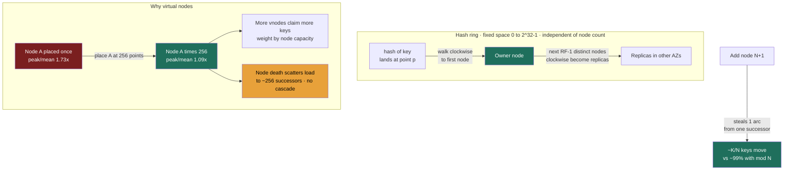

import ConsistentHashingRing from '@components/widgets/ConsistentHashingRing.jsx';

### Learning objectives
- Explain why `hash(key) mod N` is a rebalancing trap, and quantify how much data moves when `N` changes.
- Describe the **consistent-hashing ring** and show that a membership change moves only ~**K/N** keys instead of nearly all of them.
- Reason about **virtual nodes**: why a naive ring is lumpy, how vnodes smooth load, and how they encode **heterogeneous node capacity**.
- Place consistent hashing in real systems (Cassandra, DynamoDB, Riak, memcached/Ketama, CDNs, L7 load balancers), connect it back to partitioning (2.5), and set up CAP (2.7) and the Module 3 building blocks.

### Intuition first
Imagine seating guests at a wedding by a rule: `seat = hash(name) mod (number of tables)`. It works perfectly, until one more table arrives. Now the divisor changes from, say, 10 to 11, and **almost every guest's seat number changes at once.** You don't reseat one table's worth of people; you reseat the whole room. That stampede is exactly what `hash mod N` does to a distributed cache or database every time you add or remove a server.

**Consistent hashing replaces the table-number rule with a clock face.** Place every server at some position around a circular clock. To find a key's home, hash the key to a point on the same clock and **walk clockwise until you hit the first server.** Now add a twelfth server: it drops onto the clock at one position and quietly takes over only the slice of keys between it and its counter-clockwise neighbor. **Everyone else keeps their seat.** Removing a server is the mirror image, only *its* slice moves, to the next server clockwise. The whole point is that membership changes become **local** instead of **global**.

### Deep explanation

**The rebalancing trap, quantified.** The naive way to spread `K` keys over `N` nodes is `node = hash(key) mod N`. It distributes evenly and is O(1), but `N` is baked into the formula, so changing `N` re-shuffles almost everything:

| Change | Keys that remap (`hash mod N`) | Keys that *should* move (ideal) |
|---|---|---|
| 4 → 5 nodes | **80%** | 20% |
| 10 → 11 nodes | **90.9%** | 9.1% |
| 100 → 101 nodes | **99.0%** | 1.0% |

Read the right column: the *minimum* data you must move to rebalance onto one new node out of `N+1` is `1/(N+1)`, about **1%** at 100 nodes. The `mod N` scheme moves **99%**. For a cache, that's a near-total miss storm and a thundering herd onto your database the instant you scale the fleet. For a database, it's shipping nearly the entire dataset across the network to add one box, and cross-node transfer is the expensive tier of the latency hierarchy (Lesson 1.4), so "move 99% vs move 1%" is a real bandwidth-and-hours bill. **This is the problem consistent hashing exists to solve, and it's the first thing to say in the interview.**

**The ring.** Consistent hashing maps both keys and nodes into the *same* fixed hash space, a ring (Cassandra uses a 64-bit token range; Dynamo's paper used MD5's 128-bit space). The space is **independent of how many nodes you have**, that's the trick.

- **Node placement:** hash each node's id to a point on the ring.
- **Key placement:** hash the key, then **walk clockwise to the first node at or after that point**, that node owns the key.
- **Add a node:** it takes over only the arc between it and its predecessor, stealing keys from exactly **one** successor. Expected data moved ≈ **K/N**.
- **Remove a node:** its arc merges into its clockwise successor; only ≈ K/N keys move, to one place.

For replication (tie-in to **Lesson 2.4**), you don't stop at the first node, you keep walking clockwise and place the next `RF−1` distinct physical nodes as replicas. Cassandra's `NetworkTopologyStrategy` does exactly this, skipping nodes to land replicas in different racks/AZs. The ring isn't just a partitioner; it's also the **replica-placement** function.

**Why a naive ring is lumpy, and why that's unacceptable.** Random placement of a handful of nodes does **not** carve the ring into equal arcs: with 10 nodes placed once each, the busiest node owns roughly **1.7×** the average load, so you over-provision the whole fleet to the peak. Worse, when a node dies, **all** of its load lands on its single clockwise neighbor, instantly doubling that neighbor's traffic, a cascading-overload hazard. A plain ring fixes the *rebalancing* problem but creates a *load-balance* problem.

**Virtual nodes (vnodes), the fix, and the trade.** Place each physical node at **many** ring points (say 100-256) instead of once, so every machine owns many small, interleaved arcs. **Vnodes smooth the plain ring's ~1.7× peak imbalance down to ~1.1×, the difference between provisioning the fleet for 1.7× and 1.1× fair share, roughly a 35% capacity saving; the cost is more ring metadata and gossip.** Two further payoffs: a dead node's many little arcs scatter to many successors, so failure load **spreads across the cluster** instead of cascading onto one neighbor; and capacity becomes "number of vnodes," so a 2×-sized box simply gets 2× the vnodes, heterogeneous fleets without manual key juggling. The full trade you're accepting: larger routing tables, more ranges to stream and repair, and fragmented range scans, which is why vnode count is a **tuning decision, not "max it out"** (Cassandra walked its default back from 256 to 16 for exactly this reason; numbers below). The rejected alternative, no vnodes, is operationally simpler but gives you the lumpy load and cascade-on-failure; you'd choose it only when ranges must stay large and contiguous and you balance manually.

Go deeper, vnode smoothing numbers and the Cassandra 256→16 story (IC depth, optional)

More independent placements invoke the law of large numbers; imbalance shrinks roughly as `1/√(vnodes)`. Measured over 10 physical nodes:

| Vnodes per node | Peak / mean load | Load spread (CV) |
|---|---|---|
| 1 (plain ring) | 1.73× | 52% |
| 10 | 1.29× | 20% |
| 100 | 1.13× | 9% |
| 256 | 1.09× | 5% |

At 256 vnodes the hottest node sits within ~9% of fair share instead of 73% over it. Cassandra shipped a default of 256 vnodes for years, then dropped it to **16** (paired with the smarter `num_tokens` allocation algorithm) because 256 tokens per node made streaming, repair, and token-range bookkeeping heavy at scale, the smoothing benefit had plateaued while the metadata cost kept growing.

**A nuance worth banking: consistent hashing balances *keyspace*, not *traffic*.** It spreads keys uniformly, but if **one key is a celebrity** (the hot-partition / Bieber problem from **Lesson 2.5**), that key still lands on exactly one node and that node still melts. Consistent hashing does not solve hot keys, you need hot-key replication, request coalescing, or a dedicated cache tier. Saying this unprompted is a strong-signal move; it shows you know the boundary of the tool. One variant to name: **bounded-load consistent hashing** (Google, 2017) caps any node at `(1+ε)×` the average and overflows to the next node, a hard ceiling on imbalance for request routing, at a small locality cost.

**Named alternative to know: rendezvous (HRW) hashing.** Same minimal-movement property, no ring to maintain, naturally handles weighting, but **O(N) per lookup vs the ring's O(log N)**. Pick HRW when `N` is small (a CDN choosing among a few origins, GlusterFS) and simplicity wins; pick the ring when `N` is large or you need ring-based replica placement. Presenting the ring as one of *two* standard answers, with the lookup-cost-vs-simplicity axis, is exactly the trade-off articulation a Director loop rewards.

### Diagram: the ring, virtual nodes, and a key walking clockwise

### Interactive widget: feel the remap
The widget renders a live hash ring. Drag the **node count**: the ring recolors only the one arc a new node steals (≈ K/N of the dots), while the side-by-side `hash mod N` panel recolors almost everything, the 80% / 90% / 99% figures made visual. Toggle **virtual nodes** (1 → 256) to watch the load bars converge from a lumpy ~1.7× peak toward ~1.1×, weight one node to see it claim more keys, and check the counter for the exact **percentage of keys moved** on the last change.

<ConsistentHashingRing client:load />

### Worked example: scaling a Cassandra ring vs resizing a memcached fleet
**Database (Cassandra), scale-out under load.** A 10-node cluster holding 10 TB is at 75% disk and you add 2 nodes. Because vnodes are scattered across the existing ring, the newcomers each claim ~1/12 of the token space *from many existing nodes at once*, each streams out a thin slice rather than one node dumping everything on one neighbor. Total data moved ≈ `2/12 × 10 TB ≈ 1.7 TB`, in parallel from all 10 sources, versus `mod N`, where 10→12 reshuffles ~83% (≈ 8.3 TB). The Director-altitude point is *operational*: that 1.7 TB stream competes with live traffic for network and disk I/O, so you **throttle streaming** and add nodes one at a time in low-traffic windows, accepting slower, capacity-planned scale-out (hours) to protect the latency SLO. This is also where you say "I'd have the storage team validate streaming throughput and repair time per node", delegating the IC depth while owning the decision.

**Cache (memcached + Ketama), capacity change.** A memcached fleet fronting your database uses a **Ketama** consistent-hashing client (the de-facto standard, ~160 vnodes per server). Scaling 9 → 10 nodes moves only ~10% of keys, which miss once and refill, a brief, bounded miss bump. With a plain `mod N` client, ~90% of keys would miss simultaneously and **all** of those re-reads slam the database at once: a self-inflicted thundering herd that can take it down precisely when you were adding capacity. The decision, Ketama over `mod N`, is justified by "10% gradual miss bump vs 90% miss storm," and the rejected alternative is rejected for the cache-stampede risk, not on aesthetics.

### Trade-offs table: how to spread keys across nodes
| Approach | Movement on Δnode | Load balance | Lookup cost | Use when… |
|---|---|---|---|---|
| **`hash mod N`** | ~`(N−1)/N` (80-99%) | excellent (even) | O(1) | `N` is **fixed forever** (static shard set, never resized) |
| **Consistent hashing (plain ring)** | ~`K/N` (minimal) | poor (~1.7× peak @10 nodes) | O(log N) | rarely alone, almost always with vnodes |
| **Consistent hashing + vnodes** | ~`K/N`, scattered | good (~1.1× peak); supports weighting | O(log N) | dynamic clusters: Cassandra, DynamoDB, Riak, Ketama caches, ring-hash LBs |
| **Rendezvous (HRW) hashing** | ~`K/N` (minimal) | good, easy weighting | **O(N)** per key | small `N` (few origins/backends), weighting wanted, simplicity prized |
| **Range partitioning (2.5)** | a split moves one range | great for range scans; hot-spot risk | O(log N) via router | **ordered** access / range queries dominate (HBase, Spanner) |

### What interviewers probe here
- **"Why not just `hash(key) mod N`?"**, *Strong:* quantifies it, adding one node to `N` should move ~`1/N` of keys but `mod N` moves ~`(N−1)/N` (≈90% at 10 nodes, 99% at 100), causing cache-miss storms / full reshuffles; the ring moves ~`K/N`. *Red flag:* "it doesn't distribute evenly" (it does, the problem is *rebalancing*, not distribution).
- **"What are virtual nodes for, and what do they cost?"**, *Strong:* names **both** payoffs (smooths ~1.7× peak to ~1.1×; scatters a dead node's load; encodes heterogeneous capacity) **and** the cost (gossip/metadata, streaming/repair overhead, fragmented ranges, why Cassandra dropped 256→16). *Red flag:* "they just make it more even" with no cost named.
- **"Does consistent hashing solve hot keys?"**, *Strong:* no, it balances *keyspace*, not *traffic*; a celebrity key still lands on one node; you need hot-key replication / coalescing / bounded-load CH. *Red flag:* assuming uniform key distribution implies uniform load.
- **"You're scaling 10 → 12 nodes in production, walk me through the risk."**, *Strong:* bandwidth/streaming cost (≈1/6 of data moves), throttling, off-peak windows, SLO protection, and *delegating* the per-node throughput benchmark to the storage team while owning the rollout decision. *Red flag:* "just add the nodes."

### Common mistakes / misconceptions
- Believing consistent hashing makes load even on its own, a **plain** ring is lumpy (~1.7× peak at 10 nodes) and a dead node dumps **all** its load on **one** neighbor; **virtual nodes** fix both.
- Thinking it eliminates data movement, it **minimizes** it (~K/N); some keys must always move to use a new node.
- Assuming it fixes hot keys, it balances **keyspace**, not **traffic**; a single hot key still overloads one node.
- Maxing out vnodes "for evenness" and ignoring the streaming/repair/gossip tax (why Cassandra's default fell 256→16).
- Confusing it with rendezvous hashing, same goal, but HRW is O(N) per lookup with no ring; pick by `N` and simplicity.

### Practice questions
**Q1.** You run a 20-node Redis cache with a `hash mod N` client. You add 5 nodes at peak traffic and the database falls over. Explain precisely what happened and the fix.
> *Model:* Changing the divisor from 20 to 25 re-evaluates `hash(key) mod N` for every key, and the vast majority change owner at once. Every remapped key misses on its new node and re-reads from the database simultaneously, a thundering herd. Fix: a **consistent-hashing** client (Ketama or rendezvous), so adding 5 nodes to 20 moves only ~`5/25 = 20%` of keys, and those miss gradually. Add capacity off-peak, and consider request coalescing to flatten any residual spike. The decision is justified by ~20% gradual misses vs ~80% simultaneous misses.

**Q2.** Your Cassandra cluster (vnodes enabled) has one node pinned at 90% CPU while the rest sit at 55%. What's your read of the situation, and what do you decide?
> *Model:* Vnodes make *keyspace* even, so a persistent single-node hot spot is almost certainly **traffic** imbalance, a hot partition key, the celebrity problem from 2.5, which consistent hashing cannot fix by design. Decision path: confirm hot key vs token-allocation artifact (I'd have the storage team pull per-partition metrics and ownership share, a quick check, and my prior is hot key), then fix at the **data-model level**, bucket/salt the key, cache the hot row, or replicate it, rather than re-tuning the ring. The red-flag move is adding nodes: that re-spreads keyspace but leaves the one hot key on one node.

**Q3.** A teammate proposes rendezvous hashing instead of a ring for routing requests across backend servers. When is that the better call, and when not?
> *Model:* Rendezvous gives the same minimal-movement property with no ring state and easy per-node weighting. It's the better call when `N` is **small** (a handful of backends/origins), O(N) per lookup is negligible and you avoid maintaining ring metadata. It's the worse call when `N` is **large** (hundreds+), where O(N) per request hurts and the ring's O(log N) wins, or when you need ring-based replica placement across AZs as Cassandra does. Pick HRW for small fan-out + simplicity; the ring for large `N` + replica-placement semantics.

**Q4.** How would you make a consistent-hashing cache cluster handle nodes of different sizes (a mix of 16-core and 64-core machines)?
> *Model:* Encode capacity as **vnode count**: give the 64-core box 4× the vnodes of the 16-core box, so it claims ~4× the keyspace and traffic, even per-core load across heterogeneous hardware, no manual key assignment. The trade: more ring metadata, and on failure of the big node a larger (but still scattered) redistribution, acceptable versus the rejected alternative of treating all nodes equally, which overloads the small machines or wastes the big ones. Rendezvous hashing achieves the same via per-node weights if you prefer no ring.

### Key takeaways
- `hash mod N` distributes evenly but **rebalances catastrophically**, adding 1 node to `N` moves ~`(N−1)/N` of keys (90% at 10 nodes, 99% at 100); that's the problem consistent hashing solves.
- The **ring** maps keys and nodes into one fixed hash space and walks clockwise; a membership change moves only ~`K/N` keys, to/from a single successor.
- A **plain** ring is lumpy (~1.7× peak at 10 nodes) and cascades on failure; **virtual nodes** smooth it to ~1.1×, scatter failure load, and encode **heterogeneous capacity** by vnode count.
- Vnodes cost gossip/metadata, streaming, and repair overhead (Cassandra cut its default 256→16), the count is a **tuning trade-off**, not "max it out."
- Consistent hashing balances **keyspace, not traffic**, it does **not** fix hot keys; it's used by Cassandra, DynamoDB, Riak, Ketama/memcached, CDNs, and ring-hash load balancers, and underpins the Key-Value Store and Distributed Cache building blocks in Module 3.

> **Spaced-repetition recap:** Clock face, not table-numbers. `mod N` reseats the whole room when you add a server (~90-99% move); the ring reseats only one slice (~K/N). A bare ring is lumpy and cascades, **virtual nodes** make load even (~1.1× peak), spread failure, and weight by capacity, at the cost of metadata/streaming. It balances keyspace, not traffic, so hot keys still need separate handling.
