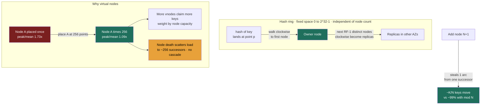

import ConsistentHashingRing from '@components/widgets/ConsistentHashingRing.jsx';

### Learning objectives
- Explain why `hash(key) mod N` is a rebalancing trap — and quantify how much data moves when `N` changes.
- Describe the **consistent-hashing ring** and show that a membership change moves only ~**K/N** keys instead of nearly all of them.
- Reason about **virtual nodes**: why a naive ring is lumpy, how vnodes smooth load, and how they encode **heterogeneous node capacity**.
- Place consistent hashing in real systems (Cassandra, DynamoDB, Riak, memcached/Ketama, CDNs, L7 load balancers), connect it back to partitioning (2.5), and set up CAP (2.7) and the Module 3 building blocks.

### Intuition first
Imagine seating guests at a wedding by a rule: `seat = hash(name) mod (number of tables)`. It works perfectly — until one more table arrives. Now the divisor changes from, say, 10 to 11, and **almost every guest's seat number changes at once.** You don't reseat one table's worth of people; you reseat the whole room. That stampede is exactly what `hash mod N` does to a distributed cache or database every time you add or remove a server.

**Consistent hashing replaces the table-number rule with a clock face.** Place every server at some position around a circular clock (12-hour dial, but with billions of minute-marks). To find a key's home, hash the key to a point on the same clock and **walk clockwise until you hit the first server.** Now add a twelfth server: it drops onto the clock at one position and quietly takes over only the slice of keys that fall between it and its counter-clockwise neighbor. **Everyone else keeps their seat.** Removing a server is the mirror image — only *its* slice moves, to the next server clockwise. The whole point is that membership changes become **local** instead of **global**.

### Deep explanation

**The rebalancing trap, quantified.** The naive way to spread `K` keys over `N` nodes is `node = hash(key) mod N`. It distributes evenly and is O(1) to compute — but `N` is baked into the formula, so changing `N` re-shuffles almost everything. Concretely, going from `N` to `N+1` moves a fraction of keys close to `N/(N+1)`:

| Change | Keys that remap (`hash mod N`) | Keys that *should* move (ideal) |
|---|---|---|
| 4 → 5 nodes | **80%** | 20% |
| 10 → 11 nodes | **90.9%** | 9.1% |
| 100 → 101 nodes | **99.0%** | 1.0% |

(These are measured over a million random 64-bit keys, not hand-waved.) Read the right column: the *minimum* data you must move to rebalance onto one new node out of `N+1` is `1/(N+1)` — about **1%** at 100 nodes. The `mod N` scheme moves **99%**. For a cache, that means a near-total miss storm and a thundering herd onto your database the instant you scale the fleet. For a database, it means shipping nearly your entire dataset across the network to add one box — recall from **Lesson 1.4** that cross-node transfer is the expensive tier of the latency hierarchy, so "move 99% vs move 1%" is a real bandwidth-and-hours bill, not a curiosity. **This is the problem consistent hashing exists to solve, and it's the first thing to say in the interview.** The decision to abandon `mod N` is justified by exactly this number.

**The ring.** Consistent hashing maps both keys and nodes into the *same* fixed hash space — a ring, typically `0 .. 2^32−1` or `2^128−1` (Cassandra uses a 64-bit `[−2^63, 2^63)` token range with the Murmur3 partitioner; Dynamo's original paper used MD5's 128-bit space). The space is fixed and **independent of how many nodes you have** — that's the trick. Placement:

- **Node placement:** hash each node's id (e.g., its IP or token) to a point on the ring.
- **Key placement:** hash the key to a point on the ring, then **walk clockwise to the first node at or after that point.** That node owns the key. (A node owns the arc from its counter-clockwise predecessor up to itself.)
- **Add a node:** it lands at one point and takes over only the arc between it and its predecessor — stealing keys from exactly **one** successor. Expected data moved ≈ **K/N**.
- **Remove a node:** its arc merges into its clockwise successor; only that node's worth of keys (≈ K/N) move, and only to one place.

For replication (tie-in to **Lesson 2.4**), you don't stop at the first node — you walk clockwise and place the next `RF−1` distinct physical nodes as replicas. Cassandra's `NetworkTopologyStrategy` does exactly this, skipping nodes to land replicas in different racks/availability zones so a rack failure doesn't take all copies. So the ring isn't just a partitioner; it's also the **replica-placement** function.

**Why a naive ring is lumpy — and why that's unacceptable.** Random placement of a handful of nodes does **not** carve the ring into equal arcs. With only 10 nodes placed once each, the busiest node owns roughly **1.7×** the average load (measured: peak/mean ≈ 1.73, coefficient of variation ≈ 52%). That means one machine runs hot at ~170% of fair share while another idles — you've over-provisioned the whole fleet to the peak. Worse, when a node dies, **all** of its load lands on its single clockwise neighbor, instantly doubling that neighbor's traffic — a cascading-overload hazard. A plain ring fixes the *rebalancing* problem but creates a *load-balance* problem.

**Virtual nodes (vnodes) — the fix, and the trade.** Instead of placing each physical node once, place it at **many** points on the ring (say 100–256), each a "virtual node." Now every physical machine owns many small, *interleaved* arcs scattered around the ring. Two payoffs:

1. **Load smoothing.** More independent placements means the law of large numbers kicks in; imbalance shrinks as ~`1/√(vnodes)`. Measured, for 10 physical nodes:

   | Vnodes per node | Peak / mean load | Load spread (CV) |
   |---|---|---|
   | 1 (plain ring) | 1.73× | 52% |
   | 10 | 1.29× | 20% |
   | 100 | 1.13× | 9% |
   | 256 | 1.09× | 5% |

   At 256 vnodes the hottest node is within ~9% of fair share instead of 73% over it — the difference between provisioning for 1.1× and 1.7×, i.e. a direct ~35% capacity-cost saving on the fleet.

2. **Graceful failure and heterogeneity.** When a node dies, its ~256 little arcs scatter to ~256 different successors, so the lost load is **spread across the whole cluster** rather than dumped on one neighbor — no cascade. And because "capacity" is just "number of vnodes," you can give a beefy machine **2× the vnodes** of a small one so it earns ~2× the keys. This is how a real cluster runs **mixed instance types** without manual key juggling.

The trade you're accepting: vnodes add **metadata and bookkeeping** (more ring entries to gossip, larger routing tables, more ranges to repair and stream during operations) and they **fragment data into many small ranges**, which can make large sequential range scans less efficient. That cost is why the right vnode count is a tuning decision, not "max it out" — Cassandra shipped a default of **256** for years, then walked it back to **16** (with the more even `num_tokens` allocation algorithm) precisely because 256 made streaming, repair, and token-range bookkeeping heavy at scale. The rejected alternative — *no vnodes* — is simpler operationally but gives you the lumpy load and cascade-on-failure above; you'd only choose it when ranges must stay large and contiguous and you balance manually.

**A nuance worth banking for the interview: consistent hashing balances *keyspace*, not *traffic*.** It spreads keys uniformly, but if **one key is a celebrity** (a hot partition — the Bieber problem from **Lesson 2.5**), that key still lands on exactly one node and that node still melts. Consistent hashing does not solve hot keys; you need replication of the hot key, request coalescing, or a dedicated cache tier for that. Saying this unprompted is a strong-signal move — it shows you know the boundary of the tool. A variant called **bounded-load consistent hashing** (Google, 2017; used by Vimeo's HAProxy fork and exposed in some service meshes) caps any node at `(1+ε)` times the average and overflows to the next node when full, trading a little locality for a hard ceiling on imbalance — useful for request routing where you cannot tolerate a hot server.

**Named alternative to know:** **rendezvous hashing** (highest-random-weight, HRW) achieves the same "minimal movement on membership change" property without an explicit ring: for a key, compute `hash(key, node)` for every node and pick the max. It's simpler to reason about and naturally handles weighting, but it's **O(N) per lookup** vs the ring's O(log N) (binary search over sorted node positions), so it shines when `N` is small (e.g., a CDN choosing among a few origins, or GlusterFS) and the ring wins when `N` is large. Mentioning that the ring is one of *two* standard answers, with the cost axis (lookup cost vs simplicity), is exactly the trade-off articulation a Director loop rewards.

### Diagram — the ring, virtual nodes, and a key walking clockwise

### Interactive widget — feel the remap
The widget below renders a live hash ring. Drag the **node count** up and down and watch the keys' colored ownership: with the plain ring, adding a node recolors only the one arc it steals (≈ K/N of the dots), while a side-by-side `hash mod N` panel recolors almost the entire ring — the 80% / 90% / 99% figures made visual. Toggle **virtual nodes** and slide the vnode count from 1 to 256 to watch the per-node load bars converge from a lumpy 1.7× peak toward an even ~1.1×, and give one node extra weight to see it claim proportionally more keys. The counter reports the exact **percentage of keys that moved** on the last membership change, so you can confirm for yourself that the ring stays near 1/N while `mod N` blows past 90%.

<ConsistentHashingRing client:load />

### Worked example — scaling a Cassandra ring vs resizing a memcached fleet
**Database (Cassandra), scale-out under load.** A 10-node Cassandra cluster holding 10 TB is at 75% disk and you add 2 nodes. Because tokens (vnodes) are placed across the existing ring, the two newcomers each claim ~1/12 of the token space *from many existing nodes at once*, so each existing node streams out a thin slice rather than one node dumping everything to one neighbor. Total data moved is ≈ `2/12 × 10 TB ≈ 1.7 TB`, **streamed in parallel from all 10 sources** — versus a `mod N` world where going 10→12 would reshuffle ~83% (≈ 8.3 TB) and likely require a full rebuild. The Director-altitude point is the *operational* one: this 1.7 TB stream consumes real network and disk I/O and competes with live traffic, so you **throttle streaming** and add nodes one at a time during low-traffic windows. The trade-off is named explicitly: you accept slower, throttled scale-out (hours, capacity-planned) to avoid a load spike that would breach your latency SLO. This is also where you'd say "I'd have the storage team validate the streaming throughput and repair time per node before we standardize the runbook" — delegating the IC depth while owning the decision.

**Cache (memcached + Ketama), capacity change.** A memcached fleet fronting your database uses a **Ketama/libketama** consistent-hashing client (the de-facto standard, ~160 vnodes per server). You scale the cache from 9 to 10 nodes. With Ketama, only ~`1/10` of keys (≈ 10%) change owner and miss once, refilling from the database — a brief, bounded miss bump. With plain `mod N` clients, ~90% of keys would suddenly miss, and **all** of that re-reads slam the database simultaneously: a self-inflicted thundering herd that can take the database down precisely when you were trying to add capacity. The decision — Ketama over `mod N` — is justified by "10% miss bump vs 90% miss storm," and the rejected alternative (naive modulo) is rejected for the cache-stampede risk, not on aesthetics.

### Trade-offs table — how to spread keys across nodes
| Approach | Movement on Δnode | Load balance | Lookup cost | Use when… |
|---|---|---|---|---|
| **`hash mod N`** | ~`(N−1)/N` (80–99%) | excellent (even) | O(1) | `N` is **fixed forever** (static shard set, never resized) |
| **Consistent hashing (plain ring)** | ~`K/N` (minimal) | poor (1.7× peak @10 nodes) | O(log N) | rarely alone — almost always with vnodes |
| **Consistent hashing + vnodes** | ~`K/N`, scattered | good (~1.1× @256 vnodes); supports weighting | O(log N) | dynamic clusters: Cassandra, DynamoDB, Riak, Ketama caches, ring-hash LBs |
| **Rendezvous (HRW) hashing** | ~`K/N` (minimal) | good, easy weighting | **O(N)** per key | small `N` (few origins/backends), weighting wanted, simplicity prized |
| **Range partitioning (2.5)** | a split moves one range | great for range scans; hot-spot risk | O(log N) via router | **ordered** access / range queries dominate (HBase, Spanner) |

### What interviewers probe here
- **"Why not just `hash(key) mod N`?"** — *Strong:* quantifies it — adding one node out of `N` should move ~`1/N` of keys but `mod N` moves ~`(N−1)/N` (≈90% at 10 nodes, 99% at 100), causing cache-miss storms / full data reshuffles; consistent hashing moves ~`K/N`. *Red flag:* "it doesn't distribute evenly" (it does — the problem is *rebalancing*, not distribution).
- **"What are virtual nodes for, and what do they cost?"** — *Strong:* names **both** payoffs (smooths a lumpy ring from ~1.7× to ~1.1× peak; scatters a dead node's load to avoid cascade; encodes heterogeneous capacity by vnode count) **and** the cost (more gossip/metadata, harder streaming/repair, fragmented ranges — why Cassandra dropped 256→16). *Red flag:* "they just make it more even" with no cost named.
- **"Does consistent hashing solve hot keys?"** — *Strong:* no — it balances *keyspace*, not *traffic*; a celebrity key still lands on one node; you need hot-key replication / coalescing / bounded-load CH. *Red flag:* assuming uniform key distribution implies uniform load.
- **"You're scaling the cluster from 10 to 12 nodes in production — walk me through the risk."** — *Strong:* talks bandwidth/streaming cost (≈1/6 of data moves), throttling, off-peak windows, SLO protection, and *delegates* the per-node throughput benchmark to the storage team while owning the rollout decision. *Red flag:* "just add the nodes" — no operational or cost awareness.

### Common mistakes / misconceptions
- Believing consistent hashing makes load perfectly even — a **plain** ring is lumpy (~1.7× peak at 10 nodes); evenness comes from **virtual nodes**.
- Thinking it eliminates data movement — it **minimizes** it (~K/N); some keys must always move to use a new node.
- Assuming it fixes hot keys — it balances **keyspace**, not **traffic**; a single hot key still overloads one node.
- Forgetting the failure mode of a vnode-less ring — a dead node dumps **all** its load on **one** neighbor, risking a cascade.
- Maxing out vnodes "for evenness" and ignoring the streaming/repair/gossip tax (the reason Cassandra's default fell from 256 to 16).
- Confusing it with rendezvous hashing — same goal, but HRW is O(N) per lookup with no ring; pick by `N` and simplicity.

### Practice questions
**Q1.** You run a 20-node Redis cache with a `hash mod N` client. You add 5 nodes at peak traffic and the database falls over. Explain precisely what happened and the fix.
> *Model:* Changing the divisor from 20 to 25 re-evaluates `hash(key) mod N` for every key, and the vast majority (~80%+, measured) change owner at once. Every remapped key misses on its new node and re-reads from the database simultaneously — a thundering herd that overwhelms it. Fix: switch the client to **consistent hashing** (e.g., Ketama/Rendezvous), so adding 5 nodes to 20 moves only ~`5/25 = 20%` of keys, and those miss gradually. Add capacity off-peak, and consider request coalescing / a brief negative-cache to flatten any residual miss spike. The decision (consistent hashing over modulo) is justified by ~20% gradual misses vs ~80% simultaneous misses.

**Q2.** Your Cassandra cluster has 1 node consistently at 90% CPU while others sit at 55%. The ring uses vnodes. What are the likely causes and your diagnostic path?
> *Model:* Vnodes make *keyspace* even, so a single hot node usually means uneven **traffic**, not uneven keyspace: (a) a **hot partition** — one partition key getting disproportionate reads/writes (the celebrity problem); consistent hashing can't fix this, so you'd re-model the key (add a bucketing suffix) or replicate/cache the hot row; (b) too few vnodes / poor token allocation leaving that node owning a fat range — check `num_tokens` and rebalance; (c) the node also being a coordinator hotspot or hosting a hot replica. Diagnostic: per-partition read metrics and `nodetool` token/ownership before touching the ring. The signal is separating "keyspace imbalance (vnode/token issue)" from "traffic imbalance (hot key — orthogonal to consistent hashing)."

**Q3.** A teammate proposes rendezvous hashing instead of a ring for routing requests across backend servers. When is that the better call, and when not?
> *Model:* Rendezvous (HRW) gives the same minimal-movement property and easier weighting, computed as `argmax hash(key,node)`. It's the better call when `N` is **small** (a handful of backends/origins) — O(N) per lookup is negligible and you avoid maintaining ring state — and when you want simple per-node weights. It's the worse call when `N` is **large** (hundreds/thousands of nodes), where O(N) per request hurts and the ring's O(log N) binary search wins, or when you need ring-based replica placement across AZs as Cassandra does. So: pick HRW for small fan-out + simplicity; pick the ring for large `N` + replica-placement semantics.

**Q4.** How would you make a consistent-hashing cache cluster handle nodes of different sizes (a mix of 16-core and 64-core machines)?
> *Model:* Encode capacity as **vnode count**: assign each physical node a number of virtual nodes proportional to its capacity (e.g., the 64-core box gets 4× the vnodes of the 16-core box), so it claims ~4× the keyspace and ~4× the traffic. This keeps per-core load even across heterogeneous hardware without manual key assignment. The trade-off: more vnodes on the big nodes means more ring metadata and, on failure of the big node, a larger (but still scattered) load redistribution — acceptable versus the rejected alternative of treating all nodes equally, which would overload the small machines or waste the big ones. Rendezvous hashing achieves the same via per-node weights if you prefer no ring.

### Key takeaways
- `hash mod N` distributes evenly but **rebalances catastrophically** — adding 1 node to `N` moves ~`(N−1)/N` of keys (90% at 10 nodes, 99% at 100); that's the problem consistent hashing solves.
- The **ring** maps keys and nodes into one fixed hash space and walks clockwise; a membership change moves only ~`K/N` keys, to/from a single successor.
- A **plain** ring is lumpy (~1.7× peak at 10 nodes) and cascades on failure; **virtual nodes** smooth it to ~1.1× (at 256), scatter failure load, and encode **heterogeneous capacity** by vnode count.
- Vnodes cost gossip/metadata, streaming, and repair overhead (Cassandra cut its default 256→16) — the count is a **tuning trade-off**, not "max it out."
- Consistent hashing balances **keyspace, not traffic** — it does **not** fix hot keys; it's used by Cassandra, DynamoDB, Riak, Ketama/memcached, CDNs, and ring-hash load balancers, and underpins the Key-Value Store and Distributed Cache building blocks in Module 3.

> **Spaced-repetition recap:** Clock face, not table-numbers. `mod N` reseats the whole room when you add a server (~90–99% move); the ring reseats only one slice (~K/N). A bare ring is lumpy and cascades — **virtual nodes** make load even (~1.1× peak), spread failure, and weight by capacity, at the cost of metadata/streaming. It balances keyspace, not traffic, so hot keys still need separate handling.
