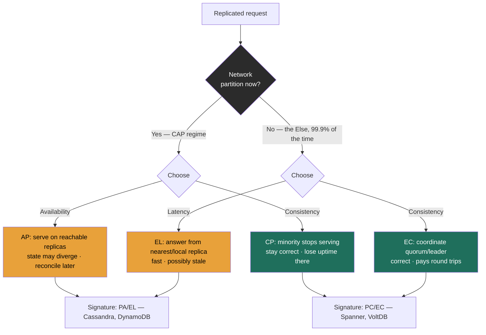

import CapPacelcExplorer from '@components/widgets/CapPacelcExplorer.jsx';

### Learning objectives
- State **CAP** precisely, under a network **partition** you must choose **C** or **A**, and explain why "**CA** system" is a category error at runtime.
- Explain why CAP describes one rare moment (the partition) and **PACELC** describes the other 99.9% (the **Else**: latency vs consistency with no partition).
- Classify real systems on both axes (**PC/EC**, **PA/EL**, **PA/EC**) and defend the classification from how each store actually behaves.
- Frame CAP/PACELC as a **per-operation requirements decision** tied to RESHADED's R step, not a religious label for a whole database.

### Intuition first
Picture a company with two offices, New York and London, that share one ledger, kept in sync over a phone line. Normally a clerk in either office can read or write, and changes are dictated across the line so both ledgers agree.

Now **the phone line goes dead** (a network partition). A customer walks into the London office and asks to update their balance. The London clerk faces exactly two choices, and there is no third:

- **Refuse to act** until the line is restored, so the two ledgers can never disagree. That is choosing **Consistency**, you stay correct but London is **unavailable**.
- **Make the change locally** and reconcile later when the line comes back. That is choosing **Availability**, London keeps serving, but for now the two ledgers **disagree** (you gave up consistency).

That is the whole of CAP: *when the line is cut, you pick correctness or uptime, you cannot have both.* The deeper question is what the clerks do on a **normal day when the line works fine**: confirm every change with the other office before saying "done" (slower, always in agreement), or answer instantly and sync in the background (faster, briefly stale)? **That** everyday trade, speed versus agreement when nothing is broken, is what PACELC adds, and it is the one you pay every single day.

### Deep explanation

**CAP, stated precisely.** Brewer's theorem concerns three properties of a distributed system:
- **C: Consistency** (specifically *linearizability*): every read sees the most recent acknowledged write, as if there were a single copy. Note this is a **stronger** C than the "C" in ACID (which is about integrity constraints), a frequent point of confusion.
- **A: Availability**: every request to a non-failing node gets a non-error response (not necessarily the latest data).
- **P: Partition tolerance**: the system keeps operating despite the network dropping or delaying messages between nodes.

The precise statement is **not** "pick any two of three." It is: **when a partition occurs, you must forfeit either C or A.** The reason is mechanical, if node A and node B cannot communicate and both keep accepting writes, their states diverge (C lost); the only way to preserve C is for at least one side to stop answering (A lost). There is no algorithm that escapes this; it is a proven impossibility, not an engineering gap.

**Why "we built a CA system" is a category error.** In any system that spans a network, i.e., every distributed system, **partitions are not optional**. NICs fail, switches reboot, a fiber gets cut, GC pauses and overloaded links create *effective* partitions even when cables are intact. P is a fact of the environment, not a design choice. So the real menu under a partition is **CP** (stay consistent, sacrifice availability on the minority side) or **AP** (stay available, sacrifice consistency). "**CA**" only describes a single non-distributed node, or a cluster's behavior *while no partition is happening*, which is to say, it describes the moment the theorem doesn't talk about. Claiming a distributed datastore is "CA" tells an interviewer you think partitions are avoidable. They are not. **That single sentence is one of the highest-leverage things you can get right in this topic.**

**CAP is a statement about one rare moment, and that is its weakness.** Partitions, in a healthy single-region cluster, are rare, maybe minutes per quarter. A framework that only describes behavior during a partition says **nothing** about how the system behaves the other **99.9%** of the time. Yet that 99.9% is where your latency budget lives. CAP is necessary but radically incomplete.

**PACELC closes the gap (Abadi, 2012).** Read it as a sentence: **"if Partition, then (A or C); Else, (L or C)."**
- The **P→(A or C)** half *is* CAP, under partition, availability vs consistency.
- The **E→(L or C)** half is the new, everyday part, **when there is no partition**, a replicated system still chooses between **Latency** and **Consistency.** To make a read or write strongly consistent, you must coordinate across replicas (wait for a quorum, route to a leader, run consensus), and coordination **costs round trips and therefore latency.** This is where the latency map bites: a cross-AZ hop is sub-millisecond-to-few-ms, but a cross-region round trip is **~150 ms**, so a strongly-consistent read that must reach a quorum spanning regions can cost two orders of magnitude more than a local answer. To go faster, you answer from the nearest/local replica and accept that it might be momentarily stale.

So PACELC gives a system a **two-letter signature**: its partition behavior (PA or PC) and its no-partition behavior (EL or EC).

| Signature | Under partition | Normally (no partition) | Plain reading |
|---|---|---|---|
| **PA/EL** | favor **A**vailability | favor **L**atency | "Fast and available; eventual consistency." |
| **PC/EC** | favor **C**onsistency | favor **C**onsistency | "Correct always; pays coordination latency." |
| **PA/EC** | favor **A**vailability | favor **C**onsistency | "Consistent on a good day; degrades to available under partition." |
| **PC/EL** | favor **C**onsistency | favor **L**atency | "Stays correct under partition, but serves fast local (possibly stale) reads on a normal day." |

**Classifying real systems (and *why*, which is what gets probed):**

- **PA/EL, Cassandra, DynamoDB, Riak (default/tunable).** Dynamo-style leaderless stores: under a partition they keep accepting reads/writes on whatever replicas are reachable (**PA**), and in normal operation their default low quorums (`R=1`/`W=1`, or `ONE`) answer from the nearest replica for minimal latency (**EL**), reconciling via read-repair and hinted handoff. *Crucially these are **tunable**:* crank Cassandra to `QUORUM`/`QUORUM` and you've moved its **E** behavior toward **EC** (paying latency for consistency), which is exactly why PACELC is per-configuration, not a fixed badge.
- **PC/EC, Google Spanner, VoltDB, classic single-leader RDBMS clusters.** Spanner uses Paxos majorities and TrueTime commit-wait: under a partition the minority cannot form a majority and **stops serving** there (**PC**, it chooses consistency over availability); in normal operation it **still** pays the coordination/commit-wait cost to remain externally consistent (**EC**). It does *not* sacrifice consistency for latency, that is the defining PC/EC stance, and the reason Spanner advertises "external consistency" rather than "low latency."
- **PC/EL, the inverse corner: lax on a good day, strict when the network breaks.** Yahoo's PNUTS is the canonical example of this rare PC/EL signature, fast, possibly-stale local reads normally, but it refuses writes rather than diverge under partition. Knowing this corner exists (and isn't PA/EC, the common mislabel) shows you understand the framework rather than memorized four labels.

Go deeper, PNUTS and per-record timeline consistency (IC depth, optional)

PNUTS gives **per-record timeline consistency** by funneling each record's writes through that record's **master** replica. On a normal day its default read (`read-any`) returns whatever the nearest local replica holds, possibly stale, for minimal latency (**EL**). Under a partition, a region that can no longer reach a record's master **cannot accept writes** for those records: it gives up availability to avoid violating the per-record timeline (**PC**), without relaxing consistency further. That makes it the mirror image of Dynamo-style stores, which is why people so often assert it is "PA/EC" and get it backwards.

- **PA/EC, MongoDB with majority concern (the genuinely rare corner).** "Strong-ish normally, but availability wins when the network breaks" is the hard quadrant, and even MongoDB only lands here under a specific config: `w:majority` writes plus `readConcern:"majority"`/`linearizable` reads coordinate a majority on the normal path (**EC**), while under a partition the side that retains a primary keeps serving (**PA**). The quadrant is rare because it demands a system engineered to *change its mind* about consistency exactly at the partition boundary, most stores pick one stance and hold it.

**The Director framing, this is a requirements decision, not dogma.** The mature move is to refuse the question "is the system CP or AP?" as malformed and re-ask it **per operation, from the requirement**:
- *Money movement / "charge the card once" / inventory decrement* → you want **C** under partition (**CP/EC**); a wrong balance or double-charge is worse than a few seconds of "try again." (Tie this to the R step: the NFR is correctness, not 100% uptime, for this path.)
- *Shopping-cart add, social feed, likes, presence, view counts* → you want **A** under partition (**AP/EL**); showing a slightly stale feed or briefly losing a like beats showing an error. (Amazon's cart, the system that *motivated* Dynamo, deliberately chose AP, a re-added deleted item is a better failure than a refused checkout.)
- The same company runs **both** in one product (polyglot persistence): Postgres/Spanner for the ledger, DynamoDB/Cassandra for the feed. **The signal is choosing the axis per data-flow and naming the cost, not labeling the whole company "AP."**

This builds directly on replication: leaderless quorum stores are the tunable PA/EL↔EC family, single-leader systems are PC-leaning. It sets up the **W + R > N** quorum rule, the concrete dial that *moves a system along the PACELC axes*, turning these letters into numbers you can set.

### Diagram: the PACELC decision and where the cost lands

The interactive explorer below makes this concrete. Toggle the **partition** switch to flip into the CAP regime, where the only choice is **C or A**; release it to land in the **Else**, where the choice is **Latency or Consistency**. As you move the consistency/latency lever, the panel plots where named systems sit, DynamoDB and Cassandra in **PA/EL**, Spanner and VoltDB in **PC/EC**, PNUTS in **PC/EL**, majority-concern MongoDB in **PA/EC**, and shows the round-trip cost of each configuration (a local `ONE` read at ~1-5 ms versus a cross-AZ `QUORUM` read at ~5-15 ms, or a cross-region strong read in the tens-to-hundreds of ms). The point it drives home: a single store can be **dragged between quadrants** by its quorum settings, so the label is a *consequence of configuration*, not an identity.

<CapPacelcExplorer client:load />

### Worked example: one checkout flow, two PACELC choices in the same request
A user clicks **Buy**. That single action splits into two data-flows with *opposite* requirements:

1. **Decrement inventory + charge the card.** Requirement (R step): never sell the last unit twice, never double-charge. Under a partition we **must** choose **C**, better to show "please retry" than to oversell. This path lives on a **PC/EC** store (Spanner, or a single-leader Postgres with a strong primary). We knowingly pay the **EC** tax: a Spanner commit pays commit-wait + Paxos majority, adding perhaps single-digit-to-low-tens of milliseconds per write versus a local append. **Rejected alternative:** putting inventory on DynamoDB with `ONE` reads (PA/EL), it would stay available during a partition but could oversell, and the cost of overselling (refunds, support, reputation) dwarfs the cost of a brief retry. We reject availability *here* on purpose.

2. **Append to the order-history feed / "recently viewed" / cart.** Requirement: show the user *something* instantly; a few seconds of staleness is invisible and harmless. We choose **A** under partition and **L** normally → a **PA/EL** store (DynamoDB/Cassandra at `ONE`). We knowingly accept eventual consistency: a just-added item might take a beat to appear on another device. **Rejected alternative:** routing this through the strongly-consistent ledger store, it would add coordination latency to every feed write and make the feed unavailable during a partition, buying correctness nobody needs for view counts. We reject consistency *here* on purpose.

The interview-grade insight: **PACELC is chosen per operation, and the same checkout demonstrates both signatures.** Quantify the stakes on each side (cost of staleness vs cost of unavailability) and the decision makes itself, straight out of the R and E steps.

### Trade-offs table: the three signatures you'd design toward
| Signature | Partition behavior | Normal-day cost | Example systems | Use when… |
|---|---|---|---|---|
| **PA/EL** | stays available; replicas diverge, reconcile via read-repair/hinted handoff | lowest latency (local/`ONE` reads, ~1-5 ms); eventual consistency | Cassandra, DynamoDB, Riak (defaults) | Feeds, carts, likes, presence, metrics, staleness cheap, uptime sacred |
| **PC/EC** | minority stops serving to stay correct | pays coordination every op (quorum/leader/commit-wait, +ms to tens of ms) | Spanner, VoltDB, single-leader RDBMS | Money, inventory, identity, anything where a wrong read is unacceptable |
| **PA/EC** | majority side keeps a primary and stays available | consistent on a good day (majority read/write concern); higher latency than EL | MongoDB (`w:majority`) | Want strong-ish reads normally but availability must win when the network breaks |

### What interviewers probe here
- **"Is this a CA system?"** (often a trap), *Strong:* "There's no such thing at runtime in a distributed system, partitions aren't optional, so the real choice under partition is CP or AP; CA only describes a single node or the no-partition moment." *Red flag:* confidently designing a "CA" datastore, i.e., assuming partitions can be engineered away.
- **"CAP only covers the partition, what about the rest of the time?"**, *Strong:* invokes PACELC's **Else**, explains the latency-vs-consistency coordination cost with a number (extra RTTs for a quorum/cross-region read). *Red flag:* thinks the trade-off only exists during failures.
- **"You picked Cassandra/DynamoDB, does that make your whole system AP?"**, *Strong:* "No, that's per data-flow. The ledger is CP/EC on Spanner; the feed is AP/EL on Cassandra; one product, both signatures." *Red flag:* labeling the entire architecture with one letter pair.
- **"You called Spanner CP, but Google sells five-nines. Reconcile that."**, *Strong:* CAP is about behavior *during a partition* (minority stops), which is rare; very high availability over a *year* is compatible with sacrificing availability in the *rare partition moment*, TrueTime/redundancy keep partitions short and infrequent. *Red flag:* thinking "CP" means "frequently down."
- **"How would you *move* this system's consistency without changing databases?"**, *Strong:* turn the quorum dial, raise `W`/`R` toward `W+R>N` to shift **E** from **EL** to **EC**, accepting more latency. *Red flag:* treating the C/A character as immutable per product.

The Director-altitude signal throughout: you treat CAP/PACELC as a **lever you set against a requirement and a budget**, you can **delegate the dial-setting** credibly ("I'd have the data team benchmark `QUORUM` vs `ONE` p99 in our AZ topology; my prior is `LOCAL_QUORUM` for the ledger"), and you always **name the cost** of the side you didn't pick.

### Common mistakes / misconceptions
- **"Pick any two of three."** CAP only forces a choice *during a partition*; the rest of the time you have C and A simultaneously. The "two of three" phrasing is the single most common error.
- **Believing "CA" is a buildable runtime mode.** P is environmental; you don't opt out. The choice is CP or AP.
- **Conflating CAP's C (linearizability) with ACID's C (constraints).** Different guarantees; they share a letter, nothing more.
- **Thinking CP means "often unavailable."** It means *sacrifice availability during a partition*, a rare event; CP systems routinely hit high yearly availability.
- **Treating PACELC as a fixed label per database.** It's per-configuration and per-operation; `R`/`W` tuning slides a store between EL and EC.
- **Forgetting the Else.** CAP-only reasoning ignores the latency-vs-consistency cost you pay every normal day, usually the *more* expensive trade in practice.

### Practice questions
**Q1.** A candidate says "we'll use a CA database for our core service so we never have to choose." How do you respond?
> *Model:* CA isn't a runtime option for anything spanning a network, partitions are inevitable (NIC/switch/fiber failures, GC pauses, overloaded links), so P is a given. The real choice under partition is **CP** (stay correct, minority stops) or **AP** (stay available, reconcile later); "CA" only describes a single node or the no-partition moment. I'd ask them to specify, per operation, whether correctness or uptime wins when the network breaks, and to name the cost of the side they drop.

**Q2.** Two systems are both "eventually consistent and highly available." One reads from the nearest replica by default; the other always routes reads through a record master. Same CAP class, how does PACELC distinguish them?
> *Model:* CAP only sees the partition; both are AP there. PACELC separates them on the **Else**: the nearest-replica reader is **EL** (favors latency, ~1-5 ms local reads, accepts staleness), classic Cassandra/DynamoDB defaults; the master-routed reader is **EC** (favors consistency normally, pays the extra hop/coordination, e.g., cross-AZ latency), the majority-concern MongoDB / PA-EC pattern. So they're **PA/EL** vs **PA/EC**: identical under partition, opposite on a normal day, which is precisely the everyday cost CAP can't express.

**Q3.** You're told "make the feed strongly consistent" on a Cassandra-backed feed running `R=1,W=1`. What do you do, what does it cost, and would you push back?
> *Model:* Mechanically: raise the quorum so **W + R > N** (e.g., `N=3, W=2, R=2`) → reads now overlap the latest write set, moving the store's **E** behavior from **EL** to **EC**. Cost: every read/write now waits on a majority of replicas (often cross-AZ), so latency rises from ~1-5 ms toward ~5-15 ms+ and availability drops (you need 2 of 3 up, not 1 of 3). Director pushback: *does the feed's requirement actually justify it?* Feeds are the canonical AP/EL case, staleness is usually invisible. I'd confirm the real NFR before paying a latency/availability tax on a path that rarely needs it, and likely reserve strong consistency for the ledger, not the feed.

**Q4.** Reconcile: "Spanner is CP" with "Spanner offers five-nines availability." Is that a contradiction?
> *Model:* No. "CP" describes the choice made *in the instant of a partition*, the minority replica set stops serving to avoid divergence, and that moment is rare. Yearly availability (five-nines = ~5 min/year of downtime) is an aggregate dominated by the 99.99%+ of time with no partition, where Spanner is fully available; redundant paths and TrueTime keep partitions short and infrequent. CP is about *which property you drop when forced*, not how often you're down.

### Key takeaways
- CAP's real statement: **under a partition you must forfeit C or A**, not "any two of three"; the rest of the time you have both.
- "**CA** system" is a category error at runtime, partitions are environmental, so the live choice is **CP** or **AP**.
- CAP describes one rare moment; **PACELC** adds the **Else**, with no partition, replicated systems trade **Latency vs Consistency** (coordination = round trips), the cost you pay 99.9% of the time.
- Classify by behavior: **PA/EL** (Cassandra/DynamoDB, fast, eventual), **PC/EC** (Spanner/VoltDB, correct, coordinated), **PA/EC** (majority-concern MongoDB, strong-ish normally, available under partition), and the rare **PC/EL** corner (PNUTS, strict under partition, fast/stale normally).
- It's a **per-operation requirements decision**: ledger → CP/EC, feed → AP/EL, in *one* product; name the cost of the side you drop, and remember the quorum dial slides a store between quadrants.

> **Spaced-repetition recap:** The dead phone line: under a partition pick correctness (CP) or uptime (AP), there is no CA. PACELC adds the normal day: even with no partition, strong consistency costs round trips (EC) while local reads are fast but stale (EL). Cassandra/DynamoDB = PA/EL, Spanner = PC/EC, majority-MongoDB = PA/EC, PNUTS = the rare PC/EL corner. Choose per operation, name the cost, turn the quorum dial to move along the axis.

---

*End of Lesson 2.7.*
