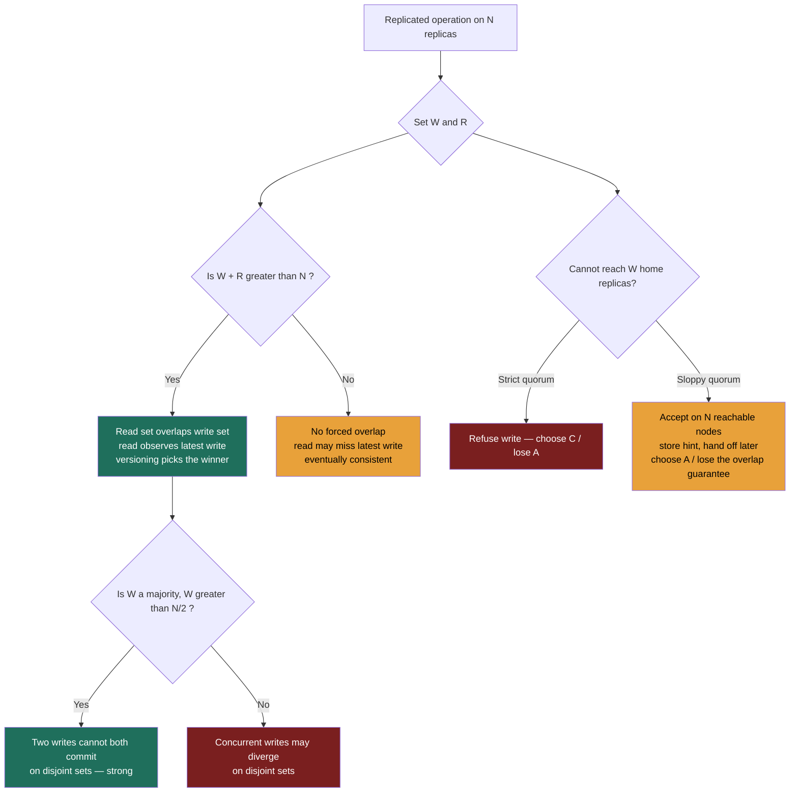

import QuorumCalculator from '@components/widgets/QuorumCalculator.jsx';

### Learning objectives
- Place the major **consistency models** on a spectrum, from linearizable down to eventual, plus the session guarantees **read-your-writes** and **monotonic reads**, and say what each costs (callback to the replication-lag anomalies).
- State the quorum rule **W + R > N**, what it buys, and what it does *not* guarantee.
- Distinguish the two quorum rules that matter, `W + R > N` (read sees latest write) and `W > N/2` (two writes can't both commit), and reason about availability and tail-latency in numbers.
- Explain **sloppy quorums + hinted handoff** and name the exact guarantee they trade away to buy write availability.
- Choose a model per data-flow (money/inventory vs feeds/likes) and defend it against cost and risk, turning the PACELC dial into concrete `N/W/R` settings.

### Intuition first
Imagine a fact that lives in several notebooks at once, three assistants, each holding a copy of a customer's account balance. Two questions decide everything.

**When you write, how many notebooks must you update before you call it "done"? When you read, how many must you consult before you trust the answer?** Call those numbers **W** (write quorum) and **R** (read quorum), out of **N** copies total.

Update *all three* before confirming a write and any single-notebook read sees the latest number, but one absent assistant blocks every write. Update *one* and move on and writes never block, but a reader might hold a stale copy and never know. The art is in the middle: **as long as the set you wrote and the set you read are forced to share at least one notebook, the reader cannot miss the latest write**, and two sets out of three *must* overlap the moment their sizes sum to more than three. That counting fact, `W + R > N`, is the entire quorum mechanism.

The broader backdrop: "consistency" is a **dial**, not a binary, from *every reader instantly sees the latest write* (expensive, coordinated) down to *copies drift and eventually re-converge* (cheap, fast, available). Quorums are how you set that dial to a number.

### Deep explanation

#### The consistency spectrum (strongest to weakest)

Each model is a **promise to the reader**, and the promises form a spectrum: at the top, **linearizable**, everyone sees the latest write instantly, as if there were one copy, which is expensive because every operation coordinates across replicas (quorum, leader, or consensus round trips); at the bottom, **eventual**, replicas drift and re-converge if writes stop, which is cheap and stays available. In between sit weaker orderings (sequential, causal) and, most usefully in practice, **session guarantees** like read-your-writes that promise recency only to the client who needs it. Stronger promise = more coordination = more latency and less availability: the **E → L vs C** trade from PACELC, now made specific.

<details>
<summary>Go deeper, formal definitions of the four models (IC depth, optional)</summary>

- **Linearizable (strong/atomic).** Every operation appears to take effect instantaneously at a single point in real time, between call and return; every read sees the most recent completed write. Examples: Spanner reads, ZooKeeper writes (reads are only sequential unless you `sync`), etcd, a single-leader RDBMS primary. Scope note: linearizability is *recency of a single object in real time*, not serializability, which is about multi-object transactions in *some* serial order; they're orthogonal, and *strict serializability* is both at once.
- **Sequential.** All operations appear in *some* single global order consistent with each process's program order, but that order need not match real time. Rarely a production datastore's explicit target; it's the conceptual rung between linearizable and causal.
- **Causal.** Causally related operations (*happens-before*) are seen in order by everyone; concurrent operations may be seen in different orders on different replicas. The strongest model still compatible with high availability under partition, the ceiling for AP systems, and the fix for the consistent-prefix anomaly.
- **Eventual.** If writes stop, replicas converge, eventually. No bound, no interim ordering. The default of Dynamo-style stores at low quorums, reconciled by read-repair and anti-entropy.

</details>

**Two session guarantees that sit beside the spectrum**, these are scoped to *one client's view over time*, not to the whole system, which is exactly why they're cheap (callback to the 2.4 anomalies and their fixes):

- **Read-your-writes (read-after-write):** once *you* have written a value, *your* subsequent reads never see a version older than your write. Fixes the "I posted a comment, refreshed, and it vanished" anomaly.
- **Monotonic reads:** if you read a value, later reads never return an *earlier* value, time doesn't appear to run backwards for you. Fixes "the comment count flickered 5 → 4 → 5" as your reads bounced between a fresh and a lagging replica.

The Director-grade distinction: **these are per-session, not system-wide.** You deliver read-your-writes *without* linearizability, pin the user's reads to a current replica, sticky-route the session, or track their last-write version (the cheap fixes). A full quorum buys something stronger and more expensive: recency for **every** reader. Knowing you usually only need the session guarantee, and shouldn't pay for global recency to get it, is the senior move.

#### The quorum rule: W + R > N

Leaderless (Dynamo-style) replication has no single authority. A coordinator writes a value to **N** replicas and waits for **W** acknowledgements; a read queries replicas and waits for **R** responses, taking the newest. The rule:

```
W + R > N
```

**What it buys:** whenever the sizes of the write set and the read set sum to more than N, the two sets are forced to share at least one replica, so a read **cannot miss** the latest acknowledged write. That forced overlap is exactly what the widget below visualizes: write set shoved to one end, read set to the other, and the amber overlap cells that survive only when `W + R > N`.

<details>
<summary>Go deeper, the pigeonhole derivation (IC depth, optional)</summary>

There are **N** replica slots. A successful write has durably landed on **at least W** of them; a read collects responses from **at least R**. The adversary chooses *which* replicas are in each set, trying to make them miss each other, worst case, the write set at one end, the read set at the other. The forced overlap is `max(0, W + R − N)`. The two sets are guaranteed to share at least one replica precisely when `W + R − N ≥ 1`, i.e. `W + R > N`; that shared replica carries the latest write, so the read cannot miss it.

</details>

**One critical caveat, overlap proves presence, not recognition.** The guarantee is that the latest value is *somewhere in the R responses*; it does **not** tell the reader *which* response is newest. The reader needs **version metadata**, a timestamp, logical clock, or **version vector**, to pick the winner. Quorum overlap and conflict-resolution metadata are two separate machines; omitting the second is a classic interview gap.

#### The *second* rule: W > N/2

`W + R > N` is about **read/write overlap**, reads see the latest write. There's a distinct hazard it does **not** cover: two *concurrent writes* both succeeding on **disjoint** replica sets, leaving the system permanently divided about the truth (a lost update / divergence). To stop that, two write quorums must themselves be forced to overlap:

```
W > N/2     (equivalently W ≥ ⌊N/2⌋ + 1, a majority)
```

If every write requires a strict majority, two writes can't both commit without sharing a replica, which forces a conflict to be *detected* (and then resolved by versioning) rather than silently diverging. So the two rules guard two different things:

| Rule | Guards against | Guarantee |
|---|---|---|
| `W + R > N` | a read missing the latest write | **read/write overlap**, reads observe the most recent acknowledged write |
| `W > N/2` | two writes committing on disjoint sets | **write/write overlap**, concurrent writes are forced to collide and be detected |

Setting `W = R = ⌊N/2⌋ + 1` (majority quorum) satisfies **both** at once, which is why "majority read, majority write" is the canonical *strong* configuration for leaderless stores.

#### Availability and latency: the price of a higher quorum (RULE 1)

Quorums are not free, and the cost is quantifiable:

- **Failure tolerance.** Writes succeed as long as `W` replicas are reachable, so writes tolerate **N − W** failures; reads tolerate **N − R**. With `N=3, W=R=2`: you survive **1** replica down for both reads and writes. Push to `W=3` for cheap `R=1` reads and **any single failure now blocks every write**, you traded write availability for read speed.
- **Tail latency.** A quorum operation can't return until its slowest required replica answers, it waits on the **W-th (or R-th) fastest** replica. Raising the quorum means waiting on a slower node, which **lifts p99.** Reusing the numbers for continuity: a local `R=1` read is ~**1-5 ms**; a cross-AZ majority read is ~**5-15 ms**; a cross-region strong read is **tens to hundreds of ms** (each cross-region RTT ~150 ms). The arithmetic of the quorum is also the arithmetic of your latency budget.

This is the dial 2.7 promised: cranking `W` and `R` up to satisfy `W + R > N` moves a store's **E** behavior from **EL** (fast, eventual) toward **EC** (consistent, coordinated), the same store, *dragged along the PACELC axis* by these numbers.

#### Sloppy quorums + hinted handoff (and the guarantee they break)

A **strict** quorum talks to the key's **home replicas**, the N nodes that own that key's slice of the ring, and **refuses the write** when W of them are unreachable (the CP move). A **sloppy** quorum instead accepts the write on the first N *reachable* nodes, even if some aren't home replicas; the stand-ins store a **hint** and forward the write home when the owner recovers (**hinted handoff**), how Dynamo/Cassandra stay write-available through failures.

**The trade, in one line (RULE 2): a sloppy quorum buys write availability by suspending the `W + R > N` guarantee, a home-set read can miss the write until hinted handoff completes.** Right call for a feed or cart write (a brief recency gap is invisible); wrong call for a balance decrement that must read-its-own-write immediately. The rejected alternative, strict quorum, preserves recency but refuses writes during the failure. Naming this trade is the most-missed nuance on the topic.

### Diagram: the quorum decision and where the guarantee lives


The interactive **Quorum Calculator** below turns these letters into a dial you can feel. Set **N**, **W**, and **R**; the widget pushes the write set to one end and the read set to the other, the worst case, so you can watch the amber **forced-overlap** cells appear or vanish, alongside the availability numbers (writes tolerate `N − W` down, reads `N − R`), the latency lean, and the `W > N/2` safety check. Try the presets, *read-optimized* (`W=N, R=1`), *write-optimized* (`W=1, R=N`), *balanced strong* (`W=R=majority`), and predict the verdict before you let go of the slider; that prediction *is* the skill.

<QuorumCalculator client:load />

### Worked example: Amazon DynamoDB / Cassandra: one cluster, two quorum settings

Both descend from the Dynamo paper and expose `N`, `W`, `R` *per operation*, the same physical cluster serves two opposite consistency contracts, which is the whole point.

**Shopping-cart writes and the home feed, `N=3, W=1, R=1` (eventual, PA/EL).** Requirement (the R step): the cart must *always* accept an add, even during a partition, and a half-second of staleness on another device is invisible. So `W=1` (write returns on the first ack, lowest latency, survives 2 of 3 replicas down) and `R=1` (read the nearest replica, ~1-5 ms). Here `W + R = 2`, which is **not** `> 3`, deliberately eventual. Conflicts (the same cart edited on phone and laptop) are reconciled by version vectors / read-repair; Amazon famously let a re-added deleted item win rather than lose a sale. Under a partition this runs as a **sloppy quorum**, the add lands on whatever node is reachable, hinted-handed-off later, knowingly forgoing the overlap guarantee for the seconds before the hint delivers. **Rejected alternative:** majority quorum on the cart would lift every write to ~5-15 ms cross-AZ and refuse adds when ⌊N/2⌋+1 replicas are unreachable, paying a latency and availability tax to buy recency that a cart simply does not need.

**Inventory decrement / "charge the card once", `N=3, W=2, R=2` (strong, EC).** Requirement: never sell the last unit twice, never double-charge. Now `W + R = 4 > 3`, every read overlaps the latest write, so a decrement reads its own effect immediately; and `W = 2 > 3/2` (majority) means two concurrent decrements can't both commit on *disjoint* replica sets, their write sets are forced to share a node. The price, stated honestly: every read and write waits on the 2nd-fastest of 3 replicas (often cross-AZ, ~5-15 ms), and the path goes **unavailable** the moment 2 of 3 replicas are unreachable, you need a quorum, not just any one node. **Rejected alternative:** `W=1,R=1` on inventory would stay available and fast under partition but could oversell; the cost of an oversell (refund, support ticket, lost trust, possibly a fraud vector) dwarfs the cost of asking the user to retry. We reject availability *here* on purpose, the mirror image of the cart decision.

**But the quorum alone does *not* finish the job, and saying so is the senior move.** A decrement is a **read-modify-write**, and a majority quorum makes the *read* strong, not the *sequence* atomic: two concurrent decrements can each read `stock = 1` through their own quorum and each write `0`, oversold, with `W + R > N` holding throughout. To actually prevent the lost update you layer a **conditional write / compare-and-set** on top, DynamoDB's `ConditionExpression` or a Cassandra **lightweight transaction** (`UPDATE … IF stock > 0`), which serializes the contending writes. Quorum overlap delivers recency; serializing a read-modify-write is a separate machine you bolt on.

The interview-grade takeaway: **the same store, the same three replicas, two quorum settings, chosen per data-flow from the requirement, with the cost of the rejected side quantified each time.** That is exactly the PACELC-dial-as-numbers idea from 2.7, made concrete.

### Trade-offs table: quorum configurations on N = 3
| Config (N=3) | `W+R` vs N | Consistency | Write availability | Read availability | Tail latency | Use when… |
|---|---|---|---|---|---|---|
| **`W=1, R=1`** | 2 < 3 | eventual (no overlap) | tolerates 2 down | tolerates 2 down | lowest (nearest replica) | Feeds, likes, view counts, carts, presence, staleness invisible, uptime sacred |
| **`W=2, R=2` (majority)** | 4 > 3 | **strong** (overlap + `W>N/2`) | tolerates 1 down | tolerates 1 down | medium (2nd-fastest, often cross-AZ) | Money, inventory, identity, a wrong/stale read is unacceptable |
| **`W=3, R=1`** | 4 > 3 | strong, read-optimized | **tolerates 0 down** (any failure blocks writes) | tolerates 2 down | write tail high, reads fastest | Read-mostly + must be strong (config/feature flags read constantly, written rarely) |
| **`W=1, R=3`** | 4 > 3 | strong, write-optimized | tolerates 2 down | **tolerates 0 down** (any failure blocks reads) | write fastest, read tail high | Write-heavy ingest needing strong reads on a rare audit path |

### What interviewers probe here
- **"What does `W + R > N` actually buy you?"**, *Strong:* the read set and write set are forced to share a replica, so a read can't miss the latest acknowledged write, per key, in a leaderless store, with versioning still needed to pick the winner. *Red flag:* claiming it makes the *whole system* strongly consistent, or treating it as a transaction mechanism.
- **"`W + R > N` holds, does the reader now know the latest value?"**, *Strong:* it guarantees the latest value is *present* in the R responses, not which one is newest; you still need version metadata (timestamps/version vectors) to choose. *Red flag:* assuming overlap alone resolves conflicts.
- **"There's a second quorum rule. What is it and what does it protect?"**, *Strong:* `W > N/2`, forces two concurrent writes to overlap so they can't both commit on disjoint sets and silently diverge; distinct from the read/write overlap rule. *Red flag:* unaware there are two rules.
- **"What does a sloppy quorum cost you?"**, *Strong:* it accepts writes on non-home reachable nodes (hinted handoff forwards them later), buying write availability through failure, but until the hint delivers, a home-set read can miss the write, so `W + R > N` no longer guarantees recency. *Red flag:* thinking sloppy quorum is "free" availability with no consistency cost.
- **"You need read-your-writes, must you go full quorum?"**, *Strong:* no, read-your-writes is a *session* guarantee; pin the user's reads to a current replica, sticky-route the session, or track their write version. Full quorum buys *system-wide* recency for every reader, which is stronger and more expensive than this path needs. *Red flag:* reaching for majority quorum when a session guarantee suffices.
- **"You said majority quorum for inventory, does `W=R=2` by itself stop two buyers overselling the last unit?"**, *Strong:* no. A decrement is a read-modify-write; the quorum makes the *read* strong but not the *sequence* atomic, so two concurrent decrements can each read `1` and write `0`. Preventing the lost update needs a conditional write / compare-and-set (`IF stock > 0`) or a lightweight transaction on top of the quorum. *Red flag:* insisting quorum alone serializes the decrement.

The Director-altitude signal throughout: you treat `N/W/R` as a **lever set against a requirement and a budget**, you **quantify the cost of the side you drop** (latency p99, failures tolerated, dollars of an oversell), and you **delegate the dial-setting credibly**, "I'd have the data team benchmark `LOCAL_QUORUM` vs `ONE` p99 across our AZ topology; my prior is majority for the ledger and `ONE` for the feed, but I want the tail numbers before we commit."

### Common mistakes / misconceptions
- **Treating "consistency" as binary.** It's a spectrum plus session guarantees; the skill is picking the *weakest* model that still satisfies the requirement, and not paying for global recency when a per-client session guarantee (read-your-writes via sticky routing or version tracking) suffices.
- **Believing `W + R > N` makes the system strongly/globally consistent.** It's a per-key recency guarantee in a leaderless store, it needs versioning to pick the winner, and it says nothing about multi-key transactions.
- **Forgetting the second rule (`W > N/2`).** Overlap of *reads with writes* isn't the same as overlap of *writes with writes*; without a majority write, concurrent writes can diverge.
- **Thinking sloppy quorum preserves the `W + R > N` guarantee.** It explicitly relaxes it, writes go to reachable, possibly non-home nodes; recency is restored only after hinted handoff.
- **Assuming a majority quorum makes a counter or decrement safe.** Quorum gives a strong single-object *read*, not an atomic *read-modify-write*, preventing the lost update needs a conditional write / compare-and-set or a lightweight transaction layered on top.

### Practice questions
**Q1.** Your store satisfies `W + R > N`. What exactly is guaranteed, and name two things that are *not*.
> *Model:* Guaranteed: the read set and write set must share at least one replica, so the latest acknowledged write is *present* among the R responses, a per-key recency guarantee. Not guaranteed: (1) which response is newest, you still need version metadata (timestamps / version vectors) to pick the winner; (2) atomicity of anything beyond a single read or write, no multi-key transactions, and no atomic read-modify-write (a decrement still needs a conditional write / LWT).

**Q2.** Your team runs a Cassandra feed at `N=3, W=1, R=1` and a product manager asks to "make it strongly consistent." Walk through what you'd change, what it costs, and whether you'd push back.
> *Model:* Mechanically, raise the quorums so `W + R > N`, e.g. `W=R=2` (majority), which also satisfies `W > N/2`. Cost: every operation now waits on the 2nd-fastest of 3 replicas (often cross-AZ), so p99 rises from ~1-5 ms toward ~5-15 ms, and you tolerate only 1 replica down, not 2. Director pushback: feeds are the canonical eventual case, staleness is usually invisible, so I'd confirm the *actual* requirement before paying that tax. Likely outcome: keep the feed eventual, reserve majority quorum for the ledger, and use read-your-writes routing if the only real need is that the *author* sees their own post.

**Q3.** A partition means your write path can't reach W home replicas. For (a) cart adds and (b) balance decrements, do you enable sloppy quorum? Defend each call.
> *Model:* (a) **Yes.** The requirement is "never lose an add"; sloppy quorum keeps writes available by accepting them on reachable stand-in nodes, at the cost of suspending the `W + R > N` recency guarantee until hinted handoff completes, a brief recency gap on a cart is invisible, and the rejected alternative (strict quorum) would refuse the sale. (b) **No.** A balance decrement must read-its-own-write immediately; a write parked on a stand-in node that a home-set read can miss is exactly the failure we can't accept. Strict quorum, refuse and retry, is correct here; the cost is a window of write unavailability, which is cheaper than a wrong balance. Same mechanism, opposite calls, each defended from the requirement.

**Q4.** You only need a user to reliably see their *own* most recent comment immediately. Two engineers propose: (a) majority quorum `W=R=2`, (b) route that user's reads to a known-current replica for a few seconds after they write. Which is right and why?
> *Model:* (b). The requirement is **read-your-writes, a session guarantee scoped to one client**, not system-wide recency. Option (b) delivers it cheaply: pin the writer's reads to a current replica (or track their write version and read a replica at least that fresh) for a short window, leaving everyone else's reads fast and eventual. Option (a) buys *global* recency for *every* reader, strictly stronger and more expensive than needed: it lifts all reads/writes to cross-AZ quorum latency and reduces availability, to satisfy a guarantee only the one writer required. Match the mechanism to the scope of the need.

### Key takeaways
- Consistency is a **spectrum**, linearizable (real-time recency) → sequential → causal → eventual (converge if writes stop), plus *session* guarantees (read-your-writes, monotonic reads) that are cheap because they're per-client, not system-wide.
- **`W + R > N`** is the read/write overlap rule: the read set is forced to share a replica with the write set, so a read *contains* the latest write, but you still need **version metadata** to pick the winner.
- **`W > N/2`** is the *second* rule, write/write overlap, that stops two concurrent writes committing on disjoint sets; `W=R=majority` satisfies both and is the canonical strong config.
- Higher quorums cost **availability** (writes tolerate `N − W` down, reads `N − R`) and **tail latency** (you wait on the W-th/R-th fastest replica), the same dial that moves a store from PACELC **EL** toward **EC**.
- **Sloppy quorum + hinted handoff** buys write availability by accepting writes on non-home nodes, explicitly *breaking* `W + R > N` until the hint delivers; choose `N/W/R` per data-flow (money/inventory → majority quorum *plus a conditional write / LWT for read-modify-write paths*, feeds/likes → `W=R=1`) and name the cost of the side you drop.

> **Spaced-repetition recap:** Three notebooks (N): how many to write (W), how many to read (R)? Two sets in a pool of N must share one the moment `W + R > N`, the read can't miss the latest write (versioning picks the winner). Second rule, `W > N/2`, stops two writes diverging. Higher quorum = less availability + higher p99 = the PACELC dial in numbers. Sloppy quorum trades the overlap guarantee for write availability. Money → majority plus a conditional write/LWT for decrements; feeds → `W=R=1`; read-your-writes is a cheap session fix, not full quorum.

---

*End of Lesson 2.8. Next: 2.9, Bloom filters, latency vs throughput, and batch vs stream, the supporting mechanics that keep the read/write paths in this module fast.*
