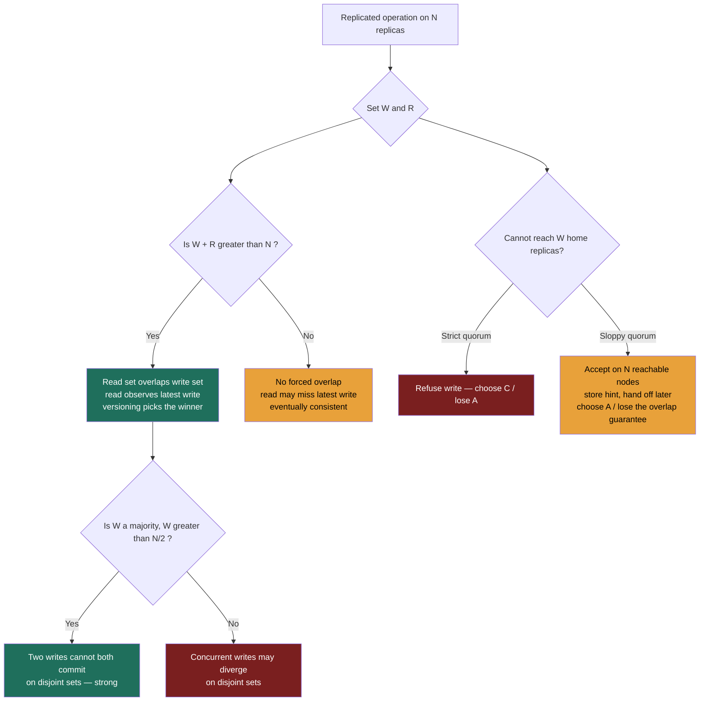

import QuorumCalculator from '@components/widgets/QuorumCalculator.jsx';

### Learning objectives
- Place the major **consistency models** on a spectrum — linearizable, sequential, causal, eventual, plus the session guarantees **read-your-writes** and **monotonic reads** — and say what each costs (callback to the replication-lag anomalies in 2.4).
- **Derive** the quorum rule **W + R > N** from first principles, and state precisely what it does and does *not* guarantee.
- Distinguish the two quorum rules that matter — `W + R > N` (read sees latest write) and `W > N/2` (two writes can't both commit) — and reason about availability and tail-latency in numbers.
- Explain **sloppy quorums + hinted handoff** and name the exact guarantee they trade away to buy write availability.
- Choose a model per data-flow (money/inventory vs feeds/likes) and defend it against cost and risk — turning the PACELC dial from 2.7 into concrete `N/W/R` settings.

### Intuition first
Imagine a fact that lives in several notebooks at once — three assistants, each holding a copy of a customer's account balance. Two questions decide everything.

**When you write, how many notebooks must you update before you call it "done"? When you read, how many must you consult before you trust the answer?** Call those numbers **W** (write quorum) and **R** (read quorum), out of **N** copies total.

If you insist on updating *all three* before confirming a write, then a reader who consults *any one* notebook is guaranteed to see the latest number — but a single absent assistant now blocks every write. If instead you update *one* notebook and move on, writes never block, but a reader consulting one notebook might be holding a stale copy and never know it. The art is in the middle: **as long as the set of notebooks you wrote and the set you read are forced to share at least one notebook in common, the reader cannot miss the latest write.** Two sets out of a pool of three *must* overlap the moment their sizes add up to more than three. That single counting fact — `W + R > N` — is the entire quorum mechanism, and the rest of this lesson is about what it buys, what it doesn't, and when a cheaper guarantee is the right call.

The broader backdrop: "consistency" is not one thing you have or lack. It's a **dial** running from *every reader everywhere instantly sees the latest write* (expensive, coordination-heavy) down to *copies drift apart and eventually re-converge if writes ever stop* (cheap, fast, available). Quorums are how you set that dial to a number.

### Deep explanation

#### The consistency spectrum (strongest to weakest)

Each model is a **promise to the reader** about what they're allowed to observe. Stronger promises require more coordination (round trips, leaders, consensus), which costs latency and availability — the **E → L vs C** trade from PACELC (2.7), now made specific.

- **Linearizable (a.k.a. strong / atomic consistency).** Every operation appears to take effect **instantaneously at a single point in real time**, between its call and its return, and every read sees the most recent completed write. The system behaves *as if there were one copy.* This is the strongest single-object guarantee. Cost: a write/read must coordinate across replicas (quorum or leader) before returning. Examples: Spanner reads, ZooKeeper writes (its reads are only sequentially consistent unless you issue a `sync`), etcd, a single-leader RDBMS primary. **Note the careful scope:** linearizability is about *recency of a single object in real time* — it is **not** serializability, which is about multi-object transactions executing in *some* serial order. They're orthogonal (2.7 made the same distinction for CAP's "C"); the gold standard *strict serializability* is both at once.
- **Sequential consistency.** All operations appear in *some* single global order, and each process's operations appear in that order in the sequence it issued them — but that global order **need not match real time**. A write you completed before I started mine can legitimately be ordered *after* it, as long as everyone agrees on one order. Weaker than linearizable (it drops the real-time clock), rarely the explicit target of a production datastore — keep it as the conceptual rung between linearizable and causal, not a knob you'll set.
- **Causal consistency.** Operations that are **causally related** (a reply must come after the message it answers — the *happens-before* relation) are seen in that order by everyone; operations that are **concurrent** (neither caused the other) may be seen in different orders on different replicas. This is the strongest model still compatible with high availability under partition, which is why it's the ceiling for AP systems. It directly fixes the **consistent-prefix** anomaly from 2.4 (causally-ordered writes never appear out of order).
- **Eventual consistency.** The only promise: **if writes stop, all replicas converge to the same value, eventually.** No bound on when, no ordering guarantee in the meantime — a read may see any past write, or none. Cheapest and most available. This is the default of Dynamo-style stores (Cassandra/DynamoDB) at low quorums, reconciled by read-repair and anti-entropy (2.4).

**Two session guarantees that sit beside the spectrum** — these are scoped to *one client's view over time*, not to the whole system, which is exactly why they're cheap (callback to the 2.4 anomalies and their fixes):

- **Read-your-writes (read-after-write):** once *you* have written a value, *your* subsequent reads never see a version older than your write. Fixes the "I posted a comment, refreshed, and it vanished" anomaly.
- **Monotonic reads:** if you read a value, later reads never return an *earlier* value — time doesn't appear to run backwards for you. Fixes "the comment count flickered 5 → 4 → 5" as your reads bounced between a fresh and a lagging replica.

The Director-grade distinction: **these are per-session, not system-wide.** You can deliver read-your-writes *without* making the system linearizable — by pinning a user's reads to a current replica for a window, sticky-routing a session to one replica, or tracking the user's last-write version and reading a replica at least that fresh (the cheap fixes from 2.4). A full quorum (`W + R > N`, below) gives you something *stronger and more expensive* — recency for **every** reader, which subsumes read-your-writes for the writer. Knowing you usually only need the session guarantee — and shouldn't pay for global recency to get it — is the senior move.

#### Deriving the quorum rule W + R > N

Leaderless (Dynamo-style) replication from 2.4 has no single authority. A coordinator writes a value to **N** replicas and waits for **W** acknowledgements; a read queries replicas and waits for **R** responses, taking the newest. The question is: **what relationship between W, R, and N guarantees a read observes the latest acknowledged write?**

Reason by pigeonhole. There are **N** replica slots. A successful write has durably landed on **at least W** of them. A read collects responses from **at least R** of them. The adversary gets to choose *which* replicas are in each set, trying to make them miss each other. In the worst case, push the write set to one end and the read set to the other — they share as few replicas as the arithmetic allows. The size of that forced overlap is:

```
overlap = max(0, W + R − N)
```

The two sets are **guaranteed to share at least one replica** precisely when `W + R − N ≥ 1`, i.e.:

```
W + R > N
```

When they overlap, at least one replica in the read set carries the latest write — so the read **cannot miss it.** That's the whole theorem, and it's exactly what the widget below visualizes: the write set shoved to the left, the read set to the right, and the amber "forced overlap" cells that survive only when `W + R > N`.

**One critical caveat — overlap proves presence, not recognition.** The guarantee is that the latest value is *somewhere in the R responses*. It does **not** tell the reader *which* of the R values is newest. The reader needs **version metadata** — a timestamp, logical clock, or **version vector** (2.4) — to pick the winner among the responses. Quorum overlap and conflict-resolution metadata are two separate machines; the rule gets the latest write into your hands, versioning tells you it's the one to keep. Omitting this is a classic interview gap.

#### The *second* rule: W > N/2

`W + R > N` is about **read/write overlap** — reads see the latest write. There's a distinct hazard it does **not** cover: two *concurrent writes* both succeeding on **disjoint** replica sets, leaving the system permanently divided about the truth (a lost update / divergence). To stop that, two write quorums must themselves be forced to overlap:

```
W > N/2     (equivalently W ≥ ⌊N/2⌋ + 1, a majority)
```

If every write requires a strict majority, two writes can't both commit without sharing a replica — which forces a conflict to be *detected* (and then resolved by versioning) rather than silently diverging. So the two rules guard two different things:

| Rule | Guards against | Guarantee |
|---|---|---|
| `W + R > N` | a read missing the latest write | **read/write overlap** — reads observe the most recent acknowledged write |
| `W > N/2` | two writes committing on disjoint sets | **write/write overlap** — concurrent writes are forced to collide and be detected |

Setting `W = R = ⌊N/2⌋ + 1` (majority quorum) satisfies **both** at once — which is why "majority read, majority write" is the canonical *strong* configuration for leaderless stores.

#### Availability and latency — the price of a higher quorum (RULE 1)

Quorums are not free, and the cost is quantifiable:

- **Failure tolerance.** Writes succeed as long as `W` replicas are reachable, so writes tolerate **N − W** failures; reads tolerate **N − R**. With `N=3, W=R=2`: you survive **1** replica down for both reads and writes. Push to `W=3` for cheap `R=1` reads and **any single failure now blocks every write** — you traded write availability for read speed.
- **Tail latency.** A quorum operation can't return until its slowest required replica answers — it waits on the **W-th (or R-th) fastest** replica. Raising the quorum means waiting on a slower node, which **lifts p99.** Reusing the 2.7 numbers for continuity: a local `R=1` read is ~**1–5 ms**; a cross-AZ majority read is ~**5–15 ms**; a cross-region strong read is **tens to hundreds of ms** (each cross-region RTT ~150 ms, from 1.4). The arithmetic of the quorum is also the arithmetic of your latency budget.

This is the dial 2.7 promised: cranking `W` and `R` up to satisfy `W + R > N` moves a store's **E** behavior from **EL** (fast, eventual) toward **EC** (consistent, coordinated) — the same store, *dragged along the PACELC axis* by these numbers.

#### Sloppy quorums + hinted handoff (and the guarantee they break)

A **strict** quorum talks to the key's **home replicas** — the N nodes that own that key's slice of the ring (2.6). What happens during a partition or a node failure, when you can't reach W of the home nodes? Two choices:

- **Strict quorum:** refuse the write (sacrifice availability — the CP move).
- **Sloppy quorum:** accept the write on the first **N reachable** nodes, *even if some aren't the key's home replicas.* A stand-in node accepts the write and stores a **hint** ("this really belongs to home-node X"); when X recovers, the stand-in performs **hinted handoff** — it forwards the buffered write home and deletes its copy. This is how Dynamo/Cassandra stay **write-available** through failures (2.4 named it; here's the mechanics).

**The trade you are making — and must name (RULE 2).** A sloppy quorum buys write availability at the cost of the `W + R > N` guarantee. Once a write lands on non-home stand-in nodes, a *read* of the home replicas can legitimately **miss it** — the read set and the write set were no longer drawn from the same N nodes, so the overlap proof collapses until hinted handoff completes. You have chosen **AP**: the write is durable and the system stayed up, but recency is no longer guaranteed for the window before the hint is delivered. The rejected alternative — a strict quorum — would have preserved consistency but **refused the write** during the failure. Sloppy quorum is the right call for a feed or cart write (a brief recency gap is invisible); it is the *wrong* call for a balance decrement that must read-its-own-write immediately. Naming this trade — *availability bought with a temporary loss of the overlap guarantee* — is the most-missed nuance on this entire topic.

### Diagram — the quorum decision and where the guarantee lives


The interactive **Quorum Calculator** below turns these letters into a dial you can feel. Move the **N** slider to set the replica count, then **W** and **R**; the widget lays out all N replicas and pushes the write set to one end and the read set to the other — the *worst case* — so you can watch the amber **forced-overlap** cells appear or vanish. It computes `max(0, W + R − N)` live and renders the verdict: **strong overlap** when `W + R > N`, *adjacent-but-disjoint* exactly at `W + R = N` (touching, but a read can still entirely miss the latest write — not strong), and *eventually consistent* below. Alongside it shows the two availability numbers (writes tolerate `N − W` down, reads `N − R`), the latency lean (which quorum sets the tail), and a separate check for the `W > N/2` write-quorum-safety rule. Try the presets — *read-optimized* (`W=N, R=1`), *write-optimized* (`W=1, R=N`), *balanced strong* (`W=R=majority`) — and predict the verdict before you let go of the slider; that prediction *is* the skill.

<QuorumCalculator client:load />

### Worked example — Amazon DynamoDB / Cassandra: one cluster, two quorum settings

DynamoDB and Cassandra both descend from the Dynamo paper and both expose `N`, `W`, `R` *per operation* — the same physical cluster serves two opposite consistency contracts depending on the numbers, which is the whole point.

**Shopping-cart writes and the home feed — `N=3, W=1, R=1` (eventual, PA/EL).** Requirement (the R step): the cart must *always* accept an add, even during a partition, and a half-second of staleness on another device is invisible. So `W=1` (write returns on the first ack — lowest latency, survives 2 of 3 replicas down) and `R=1` (read the nearest replica — ~1–5 ms). Here `W + R = 2`, which is **not** `> 3` — deliberately eventual. Conflicts (the same cart edited on phone and laptop) are reconciled by version vectors / read-repair; Amazon famously let a re-added deleted item win rather than lose a sale. Under a partition this runs as a **sloppy quorum** — the add lands on whatever node is reachable, hinted-handed-off later — knowingly forgoing the overlap guarantee for the seconds before the hint delivers. **Rejected alternative:** majority quorum on the cart would lift every write to ~5–15 ms cross-AZ and refuse adds when ⌊N/2⌋+1 replicas are unreachable — paying a latency and availability tax to buy recency that a cart simply does not need.

**Inventory decrement / "charge the card once" — `N=3, W=2, R=2` (strong, EC).** Requirement: never sell the last unit twice, never double-charge. Now `W + R = 4 > 3` — every read overlaps the latest write, so a decrement reads its own effect immediately; and `W = 2 > 3/2` (majority) means two concurrent decrements can't both commit on *disjoint* replica sets — their write sets are forced to share a node. The price, stated honestly: every read and write waits on the 2nd-fastest of 3 replicas (often cross-AZ, ~5–15 ms), and the path goes **unavailable** the moment 2 of 3 replicas are unreachable — you need a quorum, not just any one node. **Rejected alternative:** `W=1,R=1` on inventory would stay available and fast under partition but could oversell; the cost of an oversell (refund, support ticket, lost trust, possibly a fraud vector) dwarfs the cost of asking the user to retry. We reject availability *here* on purpose — the mirror image of the cart decision.

**But the quorum alone does *not* finish the job — and saying so is the senior move.** A decrement is a **read-modify-write** (read stock, compute stock−1, write it back), and a majority quorum makes the *read* strong, not the *whole sequence* atomic. Two concurrent decrements can each read `stock = 1` through their own `R=2` quorum, each compute `0`, and each write `0` through `W=2` — and you have oversold by one even though `W + R > N` held the entire time. What `W > N/2` buys you is only that the two writes **collide on a shared replica** so the conflict is *detectable* — and "detectable" is generous: Cassandra's default last-write-wins resolution will silently *discard* one of the two decrements by timestamp (one unit sold, two carts charged), and even version vectors only surface the divergence as siblings for the *application* to reconcile after the fact. Detection is not prevention. To actually prevent the oversell you must layer a **conditional write / compare-and-set** on top of the quorum — DynamoDB's `ConditionExpression` (`SET stock = stock − 1 IF stock > 0`) or a Cassandra **lightweight transaction** (`UPDATE … IF stock > 0`, which runs a Paxos round to serialize the contending writes). This is the lesson's own thesis made concrete: **quorum overlap delivers recency; serializing a read-modify-write is a *separate* machine you bolt on.** Conflating the two — "majority quorum makes the counter safe" — is the single most common way this worked example is gotten wrong in an interview.

The interview-grade takeaway: **the same store, the same three replicas, two quorum settings — chosen per data-flow from the requirement, with the cost of the rejected side quantified each time.** That is exactly the PACELC-dial-as-numbers idea from 2.7, made concrete.

### Trade-offs table — quorum configurations on N = 3
| Config (N=3) | `W+R` vs N | Consistency | Write availability | Read availability | Tail latency | Use when… |
|---|---|---|---|---|---|---|
| **`W=1, R=1`** | 2 < 3 | eventual (no overlap) | tolerates 2 down | tolerates 2 down | lowest (nearest replica) | Feeds, likes, view counts, carts, presence — staleness invisible, uptime sacred |
| **`W=2, R=2` (majority)** | 4 > 3 | **strong** (overlap + `W>N/2`) | tolerates 1 down | tolerates 1 down | medium (2nd-fastest, often cross-AZ) | Money, inventory, identity — a wrong/stale read is unacceptable |
| **`W=3, R=1`** | 4 > 3 | strong, read-optimized | **tolerates 0 down** (any failure blocks writes) | tolerates 2 down | write tail high, reads fastest | Read-mostly + must be strong (config/feature flags read constantly, written rarely) |
| **`W=1, R=3`** | 4 > 3 | strong, write-optimized | tolerates 2 down | **tolerates 0 down** (any failure blocks reads) | write fastest, read tail high | Write-heavy ingest needing strong reads on a rare audit path |

### What interviewers probe here
- **"Derive the quorum rule — why `W + R > N`?"** — *Strong:* pigeonhole — a write hits ≥ W of N replicas, a read hits ≥ R; worst-case overlap is `max(0, W+R−N)`, so they're forced to share a replica exactly when `W + R > N`, and that shared replica carries the latest write. *Red flag:* reciting the rule with no derivation, or claiming it makes the *whole system* strongly consistent (it's per-key, leaderless, and needs versioning to pick the winner).
- **"`W + R > N` holds — does the reader now know the latest value?"** — *Strong:* it guarantees the latest value is *present* in the R responses, not which one is newest; you still need version metadata (timestamps/version vectors) to choose. *Red flag:* assuming overlap alone resolves conflicts.
- **"There's a second quorum rule. What is it and what does it protect?"** — *Strong:* `W > N/2` — forces two concurrent writes to overlap so they can't both commit on disjoint sets and silently diverge; distinct from the read/write overlap rule. *Red flag:* unaware there are two rules.
- **"What does a sloppy quorum cost you?"** — *Strong:* it accepts writes on non-home reachable nodes (hinted handoff forwards them later), buying write availability through failure — but until the hint delivers, a home-set read can miss the write, so `W + R > N` no longer guarantees recency. *Red flag:* thinking sloppy quorum is "free" availability with no consistency cost.
- **"You need read-your-writes — must you go full quorum?"** — *Strong:* no — read-your-writes is a *session* guarantee; pin the user's reads to a current replica, sticky-route the session, or track their write version. Full quorum buys *system-wide* recency for every reader, which is stronger and more expensive than this path needs. *Red flag:* reaching for majority quorum when a session guarantee suffices.
- **"You said majority quorum for inventory — does `W=R=2` by itself stop two buyers overselling the last unit?"** — *Strong:* no. A decrement is a read-modify-write; the quorum makes the *read* strong but not the *sequence* atomic, so two concurrent decrements can each read `1` and write `0`. `W>N/2` only forces the writes to collide so the conflict is *detectable*; preventing the lost update needs a conditional write / compare-and-set (`IF stock > 0`) or a lightweight (Paxos/LWT) transaction on top of the quorum. *Red flag:* insisting quorum alone serializes the decrement, or not knowing Cassandra's default LWW could silently drop one of the two writes.

The Director-altitude signal throughout: you treat `N/W/R` as a **lever set against a requirement and a budget**, you **quantify the cost of the side you drop** (latency p99, failures tolerated, dollars of an oversell), and you **delegate the dial-setting credibly** — "I'd have the data team benchmark `LOCAL_QUORUM` vs `ONE` p99 across our AZ topology; my prior is majority for the ledger and `ONE` for the feed, but I want the tail numbers before we commit."

### Common mistakes / misconceptions
- **Treating "consistency" as binary.** It's a spectrum (linearizable → sequential → causal → eventual) plus session guarantees; the skill is picking the *weakest* model that still satisfies the requirement.
- **Conflating linearizability with serializability.** Linearizable = real-time recency of a single object; serializable = a serial order over multi-object transactions. They're orthogonal (same trap as CAP's "C" in 2.7).
- **Believing `W + R > N` makes the system strongly/globally consistent.** It's a per-key recency guarantee in a leaderless store, it needs versioning to pick the winner, and it says nothing about multi-key transactions.
- **Forgetting the second rule (`W > N/2`).** Overlap of *reads with writes* isn't the same as overlap of *writes with writes*; without a majority write, concurrent writes can diverge.
- **Thinking sloppy quorum preserves the `W + R > N` guarantee.** It explicitly relaxes it — writes go to reachable, possibly non-home nodes; recency is restored only after hinted handoff.
- **Assuming a majority quorum makes a counter or decrement safe.** Quorum gives a strong single-object *read* (recency), not an atomic *read-modify-write*. Two concurrent decrements can each read `1` and each write `0` with `W+R>N` holding throughout — `W>N/2` only makes the collision *detectable* (and Cassandra's default LWW may even discard one silently). Preventing the lost update needs a conditional write / compare-and-set or a lightweight (Paxos) transaction layered on top.
- **Paying for global recency to get a session guarantee.** Read-your-writes/monotonic reads are per-client and cheap (routing/sticky/version-tracking); don't default to majority quorum for them.
- **Quoting `W=R=1` as "no consistency."** It's *eventual* consistency — replicas still converge via read-repair/anti-entropy; the missing word is the whole point.

### Practice questions
**Q1.** Derive the condition under which a quorum read is guaranteed to see the latest acknowledged write, and state one thing the condition does *not* give you.
> *Model:* A write durably reaches at least **W** of **N** replicas; a read collects at least **R**. Worst case the two sets are chosen to overlap minimally, giving overlap `= max(0, W + R − N)`. They must share ≥ 1 replica — so a read can't miss the latest write — exactly when **`W + R > N`**. What it does *not* give: it guarantees the latest value is *present* among the R responses, not *which* response is newest — you still need version metadata (timestamps / version vectors) to pick the winner, and it says nothing about multi-key atomicity.

**Q2.** Your team runs a Cassandra feed at `N=3, W=1, R=1` and a product manager asks to "make it strongly consistent." Walk through what you'd change, what it costs, and whether you'd push back.
> *Model:* Mechanically, raise the quorums so `W + R > N` — e.g. `W=R=2` (majority), which also satisfies `W > N/2`, giving both read/write and write/write overlap. Cost: every read and write now waits on the 2nd-fastest of 3 replicas (often cross-AZ), so p99 rises from ~1–5 ms toward ~5–15 ms, and the path goes unavailable when 2 of 3 replicas are unreachable (you tolerate only 1 down, not 2). Director pushback: feeds are the canonical eventual/PA-EL case — staleness is usually invisible, so I'd confirm the *actual* requirement before paying a latency and availability tax. Likely outcome: keep the feed eventual and reserve majority quorum for the paths that truly need recency (the ledger), possibly using read-your-writes routing if the only real need is that the *author* sees their own post.

**Q3.** A node is partitioned away. Contrast what a strict quorum and a sloppy quorum do to a write to a key that node owns, and name the guarantee each preserves or sacrifices.
> *Model:* **Strict quorum:** if W home replicas can't be reached, the write is **refused** — availability is sacrificed, but consistency (the `W + R > N` overlap) is preserved (CP behavior). **Sloppy quorum:** the write is accepted on the first N *reachable* nodes — some not home replicas — which store a **hint** and perform **hinted handoff** to the home node on recovery. This preserves **write availability** (AP) but **sacrifices the `W + R > N` guarantee** in the interim: a read of the home replicas can miss the write until the hint is delivered. The choice is the requirement: refuse-to-lose-correctness for a balance decrement; accept-and-reconcile for a cart or feed write.

**Q4.** You only need a user to reliably see their *own* most recent comment immediately. Two engineers propose: (a) majority quorum `W=R=2`, (b) route that user's reads to a known-current replica for a few seconds after they write. Which is right and why?
> *Model:* (b). The requirement is **read-your-writes — a session guarantee scoped to one client**, not system-wide recency. Option (b) delivers it cheaply: pin the writer's reads to a current replica (or track their write version and read a replica at least that fresh) for a short window, leaving everyone else's reads fast and eventual. Option (a) buys *global* recency for *every* reader — strictly stronger and more expensive than needed: it lifts all reads/writes to cross-AZ quorum latency and reduces availability, to satisfy a guarantee only the one writer required. Match the mechanism to the scope of the need.

### Key takeaways
- Consistency is a **spectrum** — linearizable (real-time recency) → sequential → causal → eventual (converge if writes stop) — plus *session* guarantees (read-your-writes, monotonic reads) that are cheap because they're per-client, not system-wide.
- **`W + R > N`** is the read/write overlap rule, derivable by pigeonhole (`overlap = max(0, W + R − N)`); it guarantees a read *contains* the latest write, but you still need **version metadata** to pick the winner.
- **`W > N/2`** is the *second* rule — write/write overlap — that stops two concurrent writes committing on disjoint sets; `W=R=majority` satisfies both and is the canonical strong config.
- Higher quorums cost **availability** (writes tolerate `N − W` down, reads `N − R`) and **tail latency** (you wait on the W-th/R-th fastest replica) — the same dial that moves a store from PACELC **EL** toward **EC** (2.7).
- **Sloppy quorum + hinted handoff** buys write availability by accepting writes on non-home nodes — explicitly *breaking* `W + R > N` until the hint delivers; choose `N/W/R` per data-flow (money/inventory → majority quorum *plus a conditional write / LWT for read-modify-write paths*, feeds/likes → `W=R=1`) and name the cost of the side you drop.

> **Spaced-repetition recap:** Three notebooks (N): how many to write (W), how many to read (R)? Two sets in a pool of N must share one the moment `W + R > N` — so the read can't miss the latest write (but versioning picks the winner). Second rule, `W > N/2`, stops two writes diverging. Higher quorum = less availability + higher p99 = the PACELC dial in numbers. Sloppy quorum trades the overlap guarantee for write availability. Money → majority (and a conditional write/LWT for decrements — quorum gives recency, not atomic read-modify-write); feeds → `W=R=1`; read-your-writes is a cheap session fix, not full quorum.

---

*End of Lesson 2.8. Next: 2.9 — Bloom filters, latency vs throughput, and batch vs stream — the supporting mechanics that keep the read/write paths in this module fast.*
