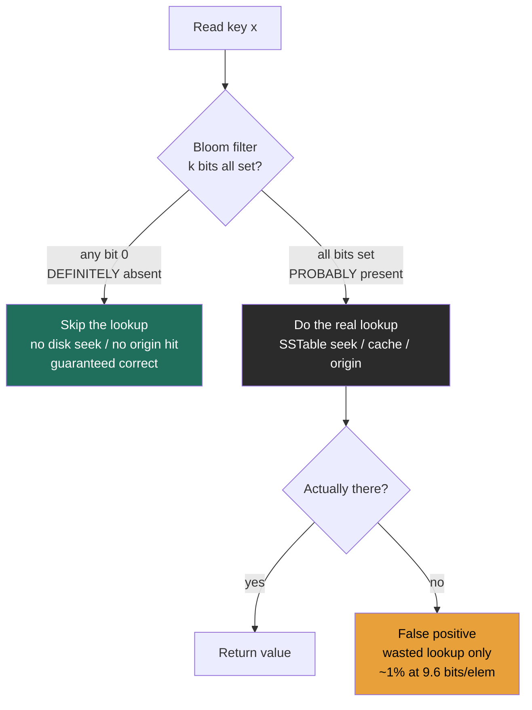
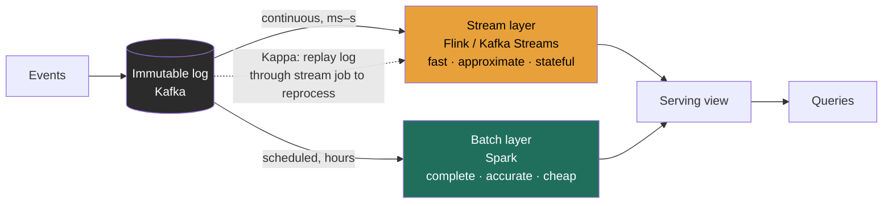

### Learning objectives
- Explain a **Bloom filter** — probabilistic set membership with **no false negatives** and a **tunable false-positive rate** — and do the back-of-envelope sizing (`m` bits, `k` hashes, false-positive `p`), connecting it to LSM reads (Lesson 2.3) and cache/CDN guards (Lesson 2.10).
- Distinguish **latency** from **throughput**, show why pushing one can hurt the other, and use **Little's Law** (`concurrency = throughput × latency`) and **tail latency (p99/p99.9)** to reason about it.
- Choose between **batch** and **stream** processing from a freshness/cost/complexity requirement, and name the systems (Spark vs Flink / Kafka Streams) and the **Lambda vs Kappa** architectural split.
- Across all three: state the trade-off you're taking and the alternative you're rejecting, in numbers — these are tools you *tune against a requirement and a budget*, not facts to recite.

### Intuition first
Three small, unrelated ideas — so three short analogies, each before its jargon.

**Bloom filter — the nightclub bouncer with a "definitely-not-on-the-list" guarantee.** A bouncer holds a tiny crib-sheet instead of the full guest list. If the sheet says you're *definitely not* on the list, you're turned away — and that's never wrong. If the sheet says you *might* be, he radios the back office to check the real list. He occasionally waves through a "maybe" who turns out not to be a guest (a false positive — a wasted radio call), but he **never** turns away a real guest (no false negatives). The crib-sheet fits in his pocket; the real list fills a binder. You trade a few wasted lookups for carrying a binder you'd otherwise have to haul everywhere.

**Latency vs throughput — one barista vs the morning rush.** *Latency* is how long *your* coffee takes; *throughput* is how many coffees the shop serves per hour. They are not the same lever, and pushing one often hurts the other: if the barista waits to fill a tray of 12 before starting the machine, the shop's hourly output goes *up* (fewer machine starts) but *your* wait goes *up* too (you're stuck until the tray fills). Speeding up one customer and maximizing the shop's hourly count pull in opposite directions.

**Batch vs stream — developing a roll of film vs a live security feed.** *Batch* is dropping a roll at the photo lab: cheap per photo, but you see nothing until the whole roll is developed hours later. *Stream* is a live CCTV monitor: you see each frame the instant it happens, at the cost of running and watching the feed continuously. Same footage, opposite freshness-vs-cost trade.

### Deep explanation

#### 1. Bloom filters — buy space and read-skips with a little accuracy

A **Bloom filter** answers one question — *is `x` in the set?* — using a bit array of `m` bits and `k` independent hash functions. **Insert:** hash `x` with all `k` functions, set those `k` bits to 1. **Query:** hash `x`, check those `k` bits — if **any** is 0, `x` is *definitely absent*; if **all** are 1, `x` is *probably present*. That asymmetry is the entire value proposition:

- **No false negatives.** If the filter says "absent," it is *always* right — you set every bit on insert, so a real member can never read back a 0. This is what makes the filter *safe to use as a skip*: an "absent" answer lets you avoid expensive work with **zero risk of correctness loss**.
- **Tunable false positives.** "Present" might be wrong — `k` bits can all be 1 by coincidence of *other* keys' hashes. A false positive only costs a **wasted real lookup**, never a wrong answer.

**The math you should be able to sketch on a whiteboard.** For `n` inserted elements, the false-positive probability is

`p ≈ (1 − e^(−kn/m))^k`

and the optimal number of hashes for a given size is `k* = (m/n)·ln 2 ≈ 0.69 × (m/n)`. The clean rule of thumb that falls out:

| Target `p` | Bits per element (`m/n`) | Hashes (`k`) |
|---|---|---|
| 10% | ~4.8 | 3–4 |
| **1%** | **~9.6** | **7** |
| 0.1% | ~14.4 | 10 |
| 0.01% | ~19.2 | 13 |

Two numbers worth memorizing: **~9.6 bits/element buys ~1% false positives at k≈7**, and **each additional 10× reduction in `p` costs only ~+4.8 bits/element.** That's astonishingly cheap, and it's *independent of how big the elements are* — the filter stores bits, not keys.

**Concrete sizing (the back-of-envelope an interviewer wants):** a set of **1,000,000 keys** at `p = 1%` needs `m ≈ 9.6 Mbit ≈ 1.2 MB` with `k = 7`. The actual keys — say 40-byte strings — would be 40 MB. So the filter is **~30× smaller** than the data it guards, small enough to keep entirely in RAM in front of an on-disk or over-the-network store. Want `p = 0.1%`? That's 1.8 MB — you paid 50% more memory to cut false positives 10×. *Trade-off named:* you spend bits to lower `p`; the rejected alternative — an exact structure like a hash set — gives `p = 0` but costs the full 40 MB and can't be sized down. You pick the Bloom filter precisely when "occasionally do a wasted lookup" is far cheaper than "store the whole set."

**Where it earns its keep:**
- **LSM-tree reads (callback to Lesson 2.3).** An LSM point lookup may have to check many immutable SSTables newest→oldest. Each SSTable carries a Bloom filter; before touching the file (a random read — ~100 µs on SSD, ~10 ms on HDD), the read checks the filter. "Absent" → **skip the file entirely, guaranteed safe**. This is the mechanism that keeps LSM read amplification from exploding — without it, a read might pay a disk seek per SSTable. Cassandra, RocksDB, HBase, and Bigtable all ship per-SSTable Bloom filters for exactly this.
- **Cache / CDN guards (sets up Lesson 2.10).** Put a Bloom filter of "keys that exist in the database" in front of the cache. A request for a key the filter says is *absent* short-circuits — no cache miss, no origin/database round trip. This is the standard defense against **cache penetration**: a flood of lookups for keys that don't exist (often malicious) that would otherwise stampede the backend. The false positives just fall through to a normal miss; the false *negatives* — which would wrongly block a real key — can't happen.
- **The classic caveat:** a standard Bloom filter **can't delete** (clearing bits could break another key that shares them) and **can't enumerate** its members. Deletes need a **Counting Bloom filter** (counters instead of bits, ~4× the space) or a **Cuckoo filter** (supports deletion and is often more space-efficient at low `p`). *Trade named:* the plain filter is smallest and simplest; you upgrade to counting/cuckoo only when the workload requires deletes, paying space or complexity for it.

#### 2. Latency vs throughput — different levers, often opposed

- **Latency** = time for *one* operation (a single request's round trip). Measured in ms; the thing a *user* feels. (Recall the latency ladder from Lesson 1.4 — RAM reads in ~100 ns, SSD in ~100 µs, a cross-region RTT ~150 ms; *where* the work happens sets the floor.)
- **Throughput** = operations completed *per unit time* (QPS, MB/s). The thing *capacity planning* and *cost* care about.

They are independent axes, and the classic mistake is treating "make it fast" as one goal. **Batching** is the cleanest example of the tension: to raise throughput you amortize a fixed per-operation cost over many items — wait to fill a batch, then pay the fixed cost once. But waiting to fill the batch **adds latency** to the items that arrived first. This exact trade recurs everywhere: disk I/O coalescing, TCP's Nagle algorithm (buffer small writes into one segment — more throughput, more latency), Kafka's `linger.ms` producer batching, and GPU **request batching** in ML/LLM serving (bigger batches = higher tokens/sec throughput *and* higher per-request latency). Recognizing that "optimize latency" and "optimize throughput" can be **opposite directions on the same knob** is a senior tell.

**Little's Law — the one formula to bring.** For any stable system, the average number of requests *in flight* (concurrency `L`) equals arrival rate (throughput `λ`) times time in system (latency `W`):

`L = λ × W`  →  **concurrency = throughput × latency**

Worked: a service at **10,000 QPS** with **200 ms** average latency holds `10,000 × 0.2 = 2,000` requests **in flight at any instant**. (The QPS here comes straight from the back-of-envelope estimation muscle of Lesson 1.3 — Little's Law is what turns that throughput number into a *concurrency* number.) That in-flight count sizes your thread pools, connection pools, and memory. The Director-grade consequence: a **latency regression silently raises concurrency**. If latency doubles to 400 ms at the same 10k QPS, in-flight work doubles to **4,000** — you may exhaust the connection pool or thread pool, requests queue, queueing *further* raises latency, and the pool tips into **collapse** (a feedback loop, not a linear slowdown). A "small" p99 latency bump can take down a service that looked nowhere near its throughput ceiling.

**Tail latency — why you write SLOs on p99, not the mean.** The average hides the pain. What users (and dependent services) feel is the **tail** — p99, p99.9. This matters most under **fan-out**: a request that calls many backends (recall the scatter-gather of partitioned stores, Lessons 2.5–2.6) is only as fast as its **slowest** dependency. If each backend is slow 1% of the time, the probability that a request touching `N` of them hits **at least one** slow path is `1 − (0.99)^N`:

| Fan-out `N` | P(request hits ≥1 slow backend) |
|---|---|
| 10 | ~9.6% |
| **100** | **~63%** |
| 1000 | ~99.99% |

So with **100-way fan-out, a backend that's slow only 1% of the time makes ~63% of requests slow.** This is *tail amplification*: the rare tail of one component becomes the *common* case of the aggregate. Mitigations — **hedged/backup requests** (send a duplicate to a second replica after a short delay, take the first to answer), **tail-tolerant timeouts**, and **request budgets** — are how Google-scale systems keep p99 sane. The Director framing: you specify the SLO on **p99/p99.9** because that's the number that governs both user experience *and* (via Little's Law) the concurrency your fleet must absorb.

#### 3. Batch vs stream — freshness vs cost vs complexity

- **Batch processing** runs over a **bounded** dataset on a schedule: read a big chunk (an hour's, a day's data), compute, write results. High throughput per dollar, simple to reason about and re-run, but results are **stale by the batch interval** (minutes to hours). Tech: **MapReduce, Spark, Hive, dbt**; nightly ETL, billing runs, model training, analytics rollups.
- **Stream processing** runs over an **unbounded** dataset **continuously**, event by event: results update within **milliseconds to seconds** of an event. Low latency, but you now own hard problems — **windowing** (you never have "all" the data, so you compute over time windows), **out-of-order / late events** (handled with **watermarks**), **exactly-once** semantics, and **continuously-managed state** that must be checkpointed. Tech: **Flink, Kafka Streams** (true per-event, sub-second); **Spark Structured Streaming** (micro-batch, ~seconds). Use cases: fraud detection, real-time dashboards, alerting, personalization.

The freshness ladder, with the cost you pay for each rung:

| Tier | Latency | Representative tech |
|---|---|---|
| Batch | minutes–hours | MapReduce, Spark, Hive |
| Micro-batch | ~1–10 s | Spark Structured Streaming |
| True streaming | sub-second–ms | Flink, Kafka Streams |

**The two architectures that combine them — and the trade between them:**
- **Lambda architecture:** run a **batch layer** (accurate, complete, slow) *and* a **speed/streaming layer** (fast, approximate) in parallel; serve a merge of both. You get correctness *and* freshness — but at the cost of **two codebases computing the same logic in two engines**, which drift and double your maintenance and on-call surface. *Rejected-alternative reasoning lives in the next bullet.*
- **Kappa architecture:** **stream-only**. Treat the immutable log (Kafka) as the source of truth; if you need to "reprocess" history (a bug fix, a new metric), you **replay the log** through the same streaming job. One codebase, one engine. The trade: you give up the batch layer's simple, cheap full-history recompute, and replay of a long retention window can be expensive and slow. *Director framing:* Lambda buys correctness-plus-freshness at the price of dual maintenance; Kappa buys operational simplicity at the price of expensive replays and a hard dependency on log retention. You choose Kappa when your logic fits a single streaming model and your replay window is bounded; you keep Lambda (or just plain batch) when full-history recomputation is cheaper or the batch logic genuinely differs.

**The decision rule (say this out loud):** drive it from the **freshness requirement** in the R step. If "results an hour old are fine" (billing, weekly reports, training data), **batch** — it's cheaper per unit and far simpler to operate; adding streaming buys freshness nobody asked for and adds windowing/state/exactly-once complexity. If "we must act within seconds" (block the fraudulent transaction *before* it settles, alert on the outage *now*), **stream** — batch's interval is a non-starter no matter how cheap. Many shops run **both**: stream for the live path, batch to recompute the accurate ground truth nightly.

### Diagram — Bloom filter as the LSM/cache read guard

### Diagram — batch vs stream, and the Lambda/Kappa split

In the diagram, **Lambda** is "use both arms and merge at the serving view"; **Kappa** is "delete the batch arm and, when you must reprocess, replay the log (dotted) through the same stream job." The dual-arm Lambda path is the correctness-plus-freshness option that costs two codebases; the single-arm Kappa path is the simplicity option that costs expensive replays.

### Worked example — a real-time fraud / analytics pipeline that uses all three
A payments platform must **block fraudulent transactions within ~200 ms** (before authorization returns), while also producing **accurate daily fraud-loss reports** for finance. One pipeline, all three tools:

1. **Bloom filter — the dedup / seen-set guard.** Each incoming transaction is checked against a Bloom filter of "device fingerprints / card tokens already seen in the last hour" to cheaply answer *is this a brand-new entity?* The filter is `n = 50M` entities at `p = 1%` → `m ≈ 480 Mbit ≈ 60 MB`, `k = 7` — small enough to live in RAM on every scoring node, versus gigabytes for the exact set. "Absent" (guaranteed correct) lets us **skip the expensive cross-service reputation lookup** for genuinely new entities; the ~1% false positives just trigger a lookup that comes back empty — a wasted call, never a wrong block. *Rejected alternative:* an exact in-memory set (Redis SET) — correct but ~20–50× the memory and a network hop per check, adding latency to the hot path we're trying to keep under 200 ms.
2. **Latency vs throughput — tuning the scoring service.** Scoring runs a model on a GPU, which is far more efficient **batched**. But we have a 200 ms latency SLO. So we cap the micro-batch with a short `linger` window (e.g., 5–10 ms) — large enough to amortize GPU overhead and lift throughput, small enough to stay inside budget. Little's Law sizes the fleet: at **20,000 TPS** and ~**100 ms** *mean* service time, `L = 20,000 × 0.10 = 2,000` requests in flight on average — but we deliberately provision pools (and GPUs) against the **p99** (~150 ms → ~3,000), buying tail headroom, because if p99 drifts to 250 ms, in-flight work jumps toward 5,000 and an undersized pool would queue and collapse. We watch **p99**, not mean, because a fraud check that's slow 1% of the time, fanned out across 100 feature lookups, would make ~63% of authorizations slow.
3. **Batch vs stream — the live path and the ground truth.** The **streaming layer** (Flink) scores every transaction sub-second and blocks in-line — the freshness requirement (act before settlement) rules out batch entirely. Overnight, a **batch layer** (Spark) reprocesses the full day's transactions with the finalized labels (chargebacks that arrived late, manual review outcomes) to produce the **accurate** fraud-loss numbers finance signs off on. That's a **Lambda** shape: streaming for "act now, approximately," batch for "be exactly right, later." *Rejected alternative:* Kappa (stream-only) — attractive for one codebase, but recomputing months of history to restate a quarterly fraud-loss figure would mean replaying an enormous Kafka window; here the batch recompute is cheaper and simpler, so we keep both arms and accept the dual-maintenance cost.

The interview-grade point: each tool is chosen **against a stated requirement and quantified** — 60 MB filter vs GB exact set; 5 ms batching window vs 200 ms SLO; sub-second stream vs nightly batch — and each names the alternative it rejected and why.

### Trade-offs table — batch vs micro-batch vs stream
| | **Batch** | **Micro-batch** | **True streaming** |
|---|---|---|---|
| Latency | minutes–hours | ~1–10 s | sub-second–ms |
| Throughput / $ | highest | high | lower (always-on) |
| State & windowing | none (bounded data) | windowed, simpler | continuous, watermarks, checkpoints |
| Exactly-once | trivial (re-run the job) | engine-managed | hardest (checkpointed state) |
| Operational complexity | lowest | medium | highest (always-on, stateful) |
| Tech | Spark, MapReduce, Hive | Spark Structured Streaming | Flink, Kafka Streams |
| **Use when…** | hourly/daily freshness is fine; cost & simplicity win (billing, reports, training) | seconds of lag acceptable; want near-real-time without per-event state | must act within ms–s (fraud block, alerting, live personalization) |

### What interviewers probe here
- **"Why does an LSM read use a Bloom filter, and what does a false positive cost you?"** — *Strong:* "absent" is guaranteed correct, so it safely skips an SSTable seek (the read-amplification fix from 2.3); a false positive only costs one wasted lookup, never a wrong result — and at ~9.6 bits/element you buy ~1% FP for ~30× less space than the keys. *Red flag:* thinks a Bloom filter can return false negatives, or can't say what a false positive actually costs.
- **"At 10k QPS and 200 ms latency, how many requests are in flight — and why do you care?"** — *Strong:* Little's Law → 2,000; it sizes pools, and a latency regression silently raises concurrency toward pool exhaustion and queue collapse. *Red flag:* treats latency and throughput as the same knob, or can't connect a latency bump to a capacity failure.
- **"You'd add batching to raise throughput — what does it cost?"** — *Strong:* it raises per-request latency (you wait to fill the batch); right call only if the latency budget has room — name the budget. *Red flag:* "batching makes everything faster" with no awareness of the latency hit.
- **"Why is the SLO written on p99, not the average?"** — *Strong:* the tail is what users and fan-out feel; with 100-way fan-out a 1%-slow backend makes ~63% of requests slow, so you design for the tail (hedged requests, timeouts). *Red flag:* optimizes the mean and is surprised by user-visible slowness.
- **"Batch or stream for this?"** — *Strong:* derives it from the freshness NFR, names the cost of the other (stream's windowing/state/exactly-once complexity vs batch's staleness), and knows the Lambda/Kappa trade for combining them. *Red flag:* reaches for streaming by default ("real-time is better") with no requirement and no awareness of the operational tax.

The Director-altitude signal throughout: you treat each as a **lever set against a requirement and a budget**, you **delegate the IC tuning credibly** ("I'd have the team benchmark the Bloom filter's FP rate and the GPU batch window against our p99 budget; my prior is ~1% FP and a 5 ms linger"), and you always **name the cost of the side you didn't pick.**

### Common mistakes / misconceptions
- **Thinking a Bloom filter has false negatives.** It can't — "absent" is always correct; only "present" can be wrong. Reversing this breaks the entire reason it's safe to skip work.
- **Assuming Bloom filters support delete or enumeration.** Plain ones don't; deletes need a Counting Bloom (~4× space) or Cuckoo filter. Don't promise removal on a standard filter.
- **Conflating latency and throughput** — "make it faster" without saying which. They're separate axes and batching trades one for the other.
- **Optimizing the mean instead of the tail.** p99/p99.9 govern user experience and, via fan-out, the *common* case at scale.
- **Forgetting Little's Law's feedback loop** — a latency regression raises in-flight concurrency and can collapse a pool well below the throughput ceiling.
- **Defaulting to streaming because "real-time is better."** Streaming adds windowing, watermarks, exactly-once, and always-on state/cost; if hourly freshness meets the requirement, batch is cheaper and simpler.
- **Choosing Lambda without acknowledging dual maintenance**, or Kappa without acknowledging replay cost and retention dependence.

### Practice questions
**Q1.** You have 1,000,000 keys and want a 1% false-positive Bloom filter. How big is it, how many hash functions, and why use one at all here?
> *Model:* ~9.6 bits/element → `m ≈ 9.6 Mbit ≈ 1.2 MB`, with `k = 7` hashes. You use it because the actual keys (say 40-byte strings → 40 MB) are ~30× larger; the 1.2 MB filter fits in RAM in front of the on-disk/remote store and lets you skip lookups for keys it says are *absent* — guaranteed correct, since there are no false negatives. The only cost is ~1% wasted lookups (false positives), which return empty, never wrong. Rejected alternative: an exact hash set — `p=0` but the full 40 MB and no ability to size down.

**Q2.** A service runs fine at 8k QPS / 120 ms p99. A deploy raises p99 to 300 ms with the same traffic, and it falls over despite being "below capacity." Explain using Little's Law.
> *Model:* Concurrency = throughput × latency. Before: `8,000 × 0.12 = 960` in flight. After: `8,000 × 0.30 = 2,400` — in-flight work jumped ~2.5× with *no change in QPS*. If thread/connection pools were sized near ~1,000 concurrent, they're now exhausted; requests queue, queueing adds latency, which raises concurrency further — a feedback collapse, not a linear slowdown. Throughput "headroom" was a red herring; the binding constraint was concurrency. Fix: roll back the latency regression (or raise pool/instance count to absorb 2,400+ while you do), and alert on p99 + in-flight, not just QPS.

**Q3.** Stakeholders want a "real-time" dashboard for daily revenue. Push back or build streaming — and how do you decide?
> *Model:* Interrogate the freshness NFR. "Daily revenue" almost always tolerates minutes of lag, so **micro-batch (Spark Structured Streaming on a few-minute trigger)** or even hourly **batch** likely meets it at a fraction of the cost and complexity of true streaming — no per-event windowing/watermark/exactly-once burden. I'd only build sub-second **Flink** streaming if a concrete requirement needs it (e.g., trading-floor or ops alerting on the *current minute*). Bare "real-time is better" isn't a requirement; I'd quantify the acceptable staleness and pick the cheapest tier that meets it, naming the operational tax we'd take on by going lower-latency than needed.

**Q4.** Why does a 1%-slow backend become a *63%*-slow request, and what do you do about it?
> *Model:* Fan-out. A request that calls 100 backends is as slow as its slowest one; `1 − 0.99^100 ≈ 63%` of requests hit at least one slow backend (tail amplification — the rare tail of a component becomes the common case of the aggregate). This is why SLOs target p99/p99.9 and why you don't just optimize the mean. Mitigations: **hedged/backup requests** (duplicate to another replica after a short delay, take the first reply), tight **tail-tolerant timeouts** with retries on idempotent calls, reducing fan-out where possible, and isolating slow dependencies. Connects to the partitioned scatter-gather reads of 2.5–2.6.

**Q5.** When would you accept Lambda's dual codebase instead of going Kappa (stream-only)?
> *Model:* When full-history **recomputation is cheaper or simpler in batch** than replaying a long log, or when the accurate/complete logic genuinely differs from the fast/approximate logic. Example: a quarterly financial restatement over months of data — a Spark batch recompute is far cheaper than replaying months of Kafka through a streaming job, and finance needs the exact, complete number. The price of Lambda is two implementations of the logic that can drift and double on-call; you accept it when the batch path's value (cheap, simple full recompute; an independent correctness check) outweighs that. Choose Kappa when the logic fits one streaming model and your replay window is bounded enough to be affordable.

### Key takeaways
- A **Bloom filter** trades a tunable false-positive rate for huge space savings and **never** has false negatives — so "absent" safely **skips** work (LSM SSTable seeks per 2.3, cache/origin hits per 2.10). ~9.6 bits/element → ~1% FP at k=7; each 10× lower FP costs ~+4.8 bits/element.
- **Latency** (one op) and **throughput** (ops/sec) are different axes; **batching** trades latency *for* throughput. They are not one knob.
- **Little's Law** — `concurrency = throughput × latency` — sizes pools and explains why a latency regression silently drives concurrency toward **queue collapse**. Write SLOs on **p99/p99.9**, because under fan-out a 1%-slow backend makes ~63% of 100-fan-out requests slow.
- **Batch** (Spark, minutes–hours, cheap/simple) vs **stream** (Flink/Kafka Streams, sub-second, windowing/state/exactly-once cost): choose from the **freshness requirement**, not "real-time is better."
- **Lambda** (batch + speed layers — correctness *and* freshness, dual maintenance) vs **Kappa** (stream-only, replay the log — simple, but expensive reprocessing): a trade between operational simplicity and recompute cost. Every choice names the rejected alternative.

> **Spaced-repetition recap:** Bouncer with a "definitely-not-on-the-list" crib-sheet — no false negatives, so "absent" safely skips a lookup; ~9.6 bits/elem = ~1% FP, ~30× smaller than the keys (LSM/cache guard). Latency ≠ throughput: batching trades one for the other; `concurrency = throughput × latency` (Little's Law), so a latency bump can collapse a pool — SLO on p99 because 1%-slow × 100 fan-out ≈ 63% slow. Batch (cheap, stale) vs stream (fresh, complex); combine via Lambda (two arms) or Kappa (replay the log). Pick from the requirement; name the cost of the side you drop.

---

*End of Lesson 2.9. Next: 2.10 — REST vs RPC vs GraphQL; stateful vs stateless, where the Bloom-filter cache guard meets caching strategies (+ Caching simulator).*
