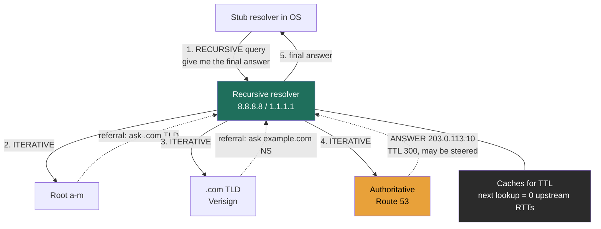

> The request-lifecycle lesson surveyed DNS at a glance (the root→TLD→authoritative *walk* exists, TTL trades failover speed against lookup load, GeoDNS/anycast steer globally, failover isn't instant). This lesson is the **building-block deep-dive** at decision altitude: TTL as the operational knob, the four steering policies as distinct mechanisms, anycast's real semantics, and, the Director angle, DNS as a **global control plane** and an **outage blast-radius**.

### Learning objectives
- State who does the work in resolution (the recursive resolver, not the client) and why caching makes DNS viable at internet scale.
- Use **TTL as a deliberate failover / rollback / cost knob**, with numbers.
- Classify the four DNS traffic-steering mechanisms (round-robin, geolocation, latency-based, weighted) and pick one from a requirement.
- Explain **anycast** (BGP-nearest, not geo-nearest) and why it fits DNS but not every protocol.
- Treat DNS as a **control plane** and bound its **blast radius**, multi-provider redundancy, the Dyn 2016 lesson, and why DNS failover is a best-effort floor.

### Intuition first
DNS is the **directory-assistance operator for the internet**. You (your OS) call **one** operator (your **recursive resolver**) and say "get me the final number for `api.example.com`, do whatever legwork it takes", and the operator works a chain of specialist directories (root, `.com`, your domain's own nameserver) on your behalf. Two more facts make DNS what it is. First, **everyone keeps a sticky-note copy of recent answers** with an expiry on it (the **TTL**), so most lookups never reach the authoritative server at all. Second, **the authoritative server can hand back different numbers to different callers** (nearest region, a weighted slice, a region for compliance), which is what turns a phonebook into a **traffic-steering control plane**.

### Deep explanation

#### The hierarchy and who owns what
DNS is a delegated tree; no single server knows everything. The **root** points at the **TLD** servers (`.com`/`.net` run by Verisign), the TLD **refers** to your domain's **authoritative nameservers**, what a managed provider like Route 53 or Cloudflare runs for you, and only the authoritative server *answers* rather than refers. (The famous "13 root servers" are 13 anycast *clouds* of 1,000+ instances each, a relic of the old 512-byte UDP limit, not 13 machines.)

**Record types a Director should name without hesitation:** `A`/`AAAA` (name→IP), `CNAME` (alias), `NS` (delegation), `SOA` (zone metadata, incl. the negative-cache TTL), `MX` (mail), `TXT` (SPF/DKIM/verification). Footnote: a `CNAME` is illegal at the zone apex, pointing `example.com` itself at an ELB/CloudFront hostname needs a provider `ALIAS`/ANAME/flattening feature, not a bare `CNAME`.

#### Resolution: who does the work
Your client makes **one recursive query** ("hand me the final answer") to its recursive resolver (ISP, `8.8.8.8`, `1.1.1.1`), and the **resolver iterates the tree, root → TLD → authoritative, on the client's behalf**, then caches the result. A cache-cold lookup costs the resolver ~3 upstream round trips; every lookup within the TTL costs **zero**, and answers are cached at every layer (browser, OS stub, recursive resolver), with most hits landing at the shared recursive resolver. That caching is why DNS survives at internet scale; the root and TLD servers would melt otherwise.

Go deeper, recursive vs iterative mechanics (IC depth, optional)

- **Recursive query:** *stub resolver → recursive resolver.* The contract is "do all the work and hand me the final answer." The recursive resolver owns the whole job.
- **Iterative queries:** *recursive resolver → root → TLD → authoritative.* Each upstream server returns a **referral** ("I don't have it, ask *them*"), not the answer, except the authoritative server, which returns the record. The recursive resolver does the iterating; the client never talks to root/TLD/authoritative directly.
- Cache layers and their behavior: browser (per-process, often clamped to ~60 s in Chrome), OS stub (`nscd`/`systemd-resolved`, honors record TTL), recursive resolver (the big shared cache, most hits land here), authoritative (source of truth; the only non-cached layer, it *sets* the TTL).
- Cold path ≈ 1 client request + ~3 upstream RTTs; warm path = 0 upstream RTTs.

#### TTL as a knob (this is the building-block insight)
**TTL is the single most important operational lever in DNS, and it is not just about latency.** It is a three-way decision:

1. **Failover / rollback speed.** TTL bounds how fast a record change actually takes effect. A **30-60 s** TTL lets you repoint a dead region or **roll back a bad DNS change** within a minute. A **24 h** TTL means a mistake, or a region outage, lingers for up to a day in resolver caches you don't control.
2. **Query volume → cost.** Lower TTL = more lookups reaching your authoritative provider, who **bills per query**. Route 53 charges roughly **$0.40 per million standard queries**. Drop a TTL from 3600 s to 30 s on a domain serving **2B resolutions/day** and you can multiply authoritative query volume **~10-50×** depending on cacheability, a real line item, and a self-inflicted DDoS surface if mis-set.
3. **Resolver slop.** Many resolvers and clients **don't honor TTL precisely**, some clamp a minimum, some serve stale. So a low TTL is a **best-effort floor on propagation, not a guarantee.** This is *the* Director caveat (worth repeating): **never design a hard RTO around DNS alone.**

A common pattern: keep a **moderate TTL (300 s)** in steady state for cost, and **pre-lower it to 30-60 s** ahead of a planned migration or failover drill, then restore it.

#### DNS as a traffic-steering control plane: four distinct mechanisms
The authoritative server can return **different answers to different resolvers**. That is the entire basis of DNS-based global traffic management. The four mechanisms (mapped to **Route 53** policy names, which is the lingua franca in interviews):

- **Round-robin DNS** (Route 53 *Simple* with multiple values, or *Multivalue answer*), return several `A` records, rotate the order. **This is distribution, not load balancing**: it is **not health-aware or load-aware** in its simple form, so a **dead backend stays in rotation** until pulled. (*Multivalue answer* adds health checks and returns up to 8 healthy records at random, a meaningful upgrade over bare round-robin.)
- **Geolocation** (Route 53 *Geolocation*), answer based on **where the query came from**, mapped to coarse geography (continent/country). Primary use is **data residency / compliance** ("EU users must hit EU infra") and geo-blocking, *not* primarily performance.
- **Latency-based** (Route 53 *Latency*), return the region with the **lowest measured network latency** to the resolver. This is the **performance** policy for a multi-region service.
- **Weighted** (Route 53 *Weighted*), split traffic by assigned weights (e.g., 95/5). The control-plane primitive for **canary releases, blue-green cutovers, and gradual migrations**, shift a percentage at the DNS layer.

**The subtlety that trips people up:** geolocation and latency steering key off the **resolver's IP, not the end-user's**. A user on `8.8.8.8` can be routed as if they were wherever Google's resolver egressed. The fix is **EDNS Client Subnet (ECS)**, the resolver forwards a truncated client subnet so the authoritative server can steer accurately. **Google Public DNS sends ECS; Cloudflare `1.1.1.1` by default does not** (privacy stance). So "GeoDNS is accurate" is conditional on ECS, a real-world miss for the large public-resolver population.

#### Anycast: BGP-nearest, not geo-nearest
**Anycast advertises the same IP from many physical locations** and lets **BGP** route each client to the "nearest" instance. Critical precision: **"nearest" means fewest AS hops / best BGP path, not geographically closest and not guaranteed lowest-latency**, BGP optimizes for routing policy, not your latency.

Anycast is **ideal for DNS** specifically because DNS is **short, stateless UDP**: each query is a self-contained round trip, so it doesn't matter if consecutive queries land on different instances. The **caveat**: long-lived **TCP/TLS** flows can **break on BGP reconvergence** (the path shifts mid-connection to a different anycast node that has no state), which is why anycast is used heavily for DNS and CDN entry, and more carefully for stateful protocols. Every serious DNS provider (Route 53, Cloudflare, the root letters) is anycast under the hood, it's how they get both low latency *and* DDoS absorption (attack traffic disperses across all instances).

#### Propagation and failure modes
- **"Propagation" is a misnomer, there is no push.** Changing a record doesn't *send* anything anywhere; it just means new lookups get the new answer once **old cached entries expire**. Worst-case propagation ≈ **the TTL that was in effect when the entry was cached** + resolver slop. Lower the TTL *before* the change, not during.
- **Negative caching.** `NXDOMAIN` (name doesn't exist) is **also cached**, governed by the **`SOA` minimum/negative TTL**. So a freshly created record can be invisible for the negative-cache window if something queried it too early.
- **Failure modes that cause real outages:** (1) **authoritative provider down** → if it's your *only* provider, your entire domain is unresolvable regardless of how healthy your servers are (the Dyn lesson, below); (2) **misconfigured `NS`/delegation**; (3) **expired domain registration**; (4) **botched DNSSEC**. On DNSSEC: it **signs records (authenticity), it doesn't encrypt**, and a managed provider should own it; encrypted transport is DoT/DoH, a separate thing.

### Diagram: recursive resolution flow

### Worked example: the DNS layer for a global, 3-region service
Requirement (the R/E of RESHADED): a service in **us-east-1, eu-west-1, ap-southeast-1**, target **RTO ≤ 2 min** on a region loss, **EU PII must stay in EU**, and we run **canary deploys**. Design the DNS layer:

1. **Steering: latency-based routing** as the default, each user's resolver gets the lowest-latency region, cutting cross-ocean RTT (recall ~150 ms per intercontinental hop). This is the **performance** policy.
2. **Compliance override: a geolocation rule for the EU** so EU-origin queries pin to `eu-west-1` regardless of latency, **data residency beats latency** for that population. (Rejected alternative: latency-only, simpler, but a Frankfurt user routed to a US region on a bad day would put PII outside the EU. Not acceptable.)
3. **Failover: health checks + 30-60 s TTL.** When a region's health check fails, the authoritative provider stops returning it; resolvers pick it up within ~a TTL. (Rejected alternative: 3600 s TTL, far cheaper in query volume, but blows the 2-min RTO; a dead region would linger ~an hour in caches.) **The honest caveat:** DNS failover is a best-effort floor, resolver slop means a few clients lag. For a *hard* SLA, pair it with **anycast withdrawal** or a **global L7 LB** that fails over faster than DNS can.
4. **Canary: weighted records** to shift 5% → 25% → 100% to the new version, watching metrics between steps. Rejected alternative, flip 100% at once, is faster but has no blast-radius control if the new version is bad.
5. **Blast-radius: a second authoritative provider.** Run **two** managed DNS providers (e.g., Route 53 **and** NS1) as co-equal `NS` records, so one provider's outage doesn't take the domain dark. (See below, this is the Dyn lesson, and the single most important availability decision in the DNS layer.)

**Cost check (Rule 1):** at ~**2B queries/day** ≈ **60B/month**, priced on Route 53's **latency-based** routing (this design's default) at **$0.60/M for the first 1B then $0.30/M** above: ≈ $0.6k + 59 × $0.3k ≈ **~$18k/month** of authoritative query cost (standard-query routing would be roughly two-thirds the cost; geolocation queries bill higher still). It's a real five-figure line item, and it *scales directly with how low you set TTLs*, dropping the default from 300 s to 30 s pushes far more of this 60B onto your authoritative provider. A Director weighs that bill against the agility a lower TTL buys.

### Trade-offs table: DNS traffic-steering policies
| Policy | Steers by | Health/load aware? | Use when… | Rejected because… |
|---|---|---|---|---|
| **Round-robin / Multivalue** | rotate multiple A records | No (Multivalue: yes, health-checked) | cheap spread across equal backends; simple HA | not real load balancing, bare round-robin keeps dead nodes in rotation |
| **Geolocation** | query origin → coarse geo | optional | **data residency / compliance**, geo-blocking | poor for performance; coarse; resolver-IP unless ECS |
| **Latency-based** | lowest measured RTT to resolver | optional | **performance** across multi-region | accuracy depends on ECS for public resolvers |
| **Weighted** | assigned percentages | optional | **canary / blue-green / migration** | not location- or latency-aware on its own |

### What interviewers probe here
- **"Walk me through resolving a cold domain, who does the work?"**, *Strong:* stub makes **one recursive** request; the **recursive resolver** makes **~3 iterative** referral hops (root→TLD→authoritative); names that only the authoritative server *answers* and the rest *refer*. *Red flag:* "the browser asks root, then TLD, then the server" (the client does **not** walk the tree).
- **"A region just died, how fast does traffic move, and what bounds it?"**, *Strong:* health-check + low TTL repoints within ~a TTL, **but** DNS is a best-effort floor (resolver slop), so for a hard RTO pair it with anycast withdrawal / global LB. *Red flag:* "DNS fails over instantly" or no awareness of the TTL bound.
- **"How would you keep DNS from being your single point of failure?"**, *Strong:* **multi-provider / secondary DNS** (two authoritative providers), cites the **Dyn 2016** blast radius; weighs the cost/complexity of running two against the SPOF. *Red flag:* "DNS is just there, it doesn't fail", exactly the assumption Dyn disproved.
- **"GeoDNS routes a user to the wrong region, why?"**, *Strong:* steering keys off the **resolver IP, not the user**, unless **ECS** passes a client subnet; notes Google sends ECS while Cloudflare's privacy default doesn't. *Red flag:* thinks DNS sees the end-user IP.
- **"TTL, how do you set it and what's the trade?"**, *Strong:* frames it as a **failover/rollback-speed vs query-cost vs resolver-slop** knob, with numbers, and the pre-lower-before-migration pattern. *Red flag:* "set it high to be safe" with no failover cost named, or "low TTL fixes everything" with no cost named.

### Common mistakes / misconceptions
- **Saying the client walks root→TLD→authoritative.** The recursive resolver does; the client makes one recursive request.
- **Treating round-robin DNS as load balancing.** It's blind distribution; without health checks, dead nodes stay in rotation.
- **Believing GeoDNS sees the user's location.** It sees the resolver's, unless ECS is in play.
- **Assuming "DNS propagation" is a push, or instant.** It's cache expiry, bounded by TTL + resolver slop; lower TTL *before* a change.
- **Designing a hard RTO around DNS failover alone, or running a single authoritative provider.** DNS failover is a best-effort floor (pair with anycast/global LB for tight SLAs), and a single provider is the Dyn blast radius, use secondary DNS.

### Practice questions
**Q1.** Explain recursive vs iterative resolution and say which actor makes which kind of query.
> *Model:* The client makes **one recursive** query to its **recursive resolver** ("do all the work, return the final answer"); the resolver then makes the **iterative** referral walk root → TLD → authoritative on the client's behalf, only the authoritative server *answers*, the rest *refer*. Cold path ≈ 1 client request + ~3 upstream RTTs; warm path = 0 upstream RTTs (served from cache within the TTL).

**Q2.** You need to fail a region over within ~1 minute. What TTL do you set, what does it cost you, and why isn't it a guarantee?
> *Model:* Set TTL to **30-60 s** so resolver caches expire (and re-resolve to a healthy region) within ~a minute. **Cost:** roughly 10-50× more queries hitting your authoritative provider vs a 3600 s TTL → higher per-query bill (e.g., Route 53 ~$0.40/M) and a larger query-load surface. **Not a guarantee** because many resolvers/clients ignore or clamp TTL (resolver slop), so DNS failover is a **best-effort floor**, not a hard RTO mechanism, for a strict SLA, pair it with **anycast withdrawal** or a **global L7 LB** that fails over independently of DNS caching. Practical pattern: keep TTL moderate (300 s) day-to-day and pre-lower it before planned failover.

**Q3.** Why is anycast a great fit for DNS but riskier for a long-lived TCP service?
> *Model:* Anycast advertises one IP from many sites; **BGP routes each client to the BGP-nearest instance** (fewest AS hops / routing policy, *not* guaranteed geo-nearest or lowest-latency). DNS is **short, stateless UDP**, each query is one self-contained round trip, so it's fine if consecutive queries hit different instances, and attack traffic disperses across all sites (DDoS absorption). A **long-lived TCP/TLS** flow can **break on BGP reconvergence**: the path shifts mid-connection to a different anycast node with no session state, dropping the connection. So anycast is ideal for DNS/CDN entry, but stateful protocols need stickiness or a different layer.

**Q4.** Twitter, GitHub, and Spotify all went down on the same day in 2016 without their own servers failing. What happened, and how do you prevent it?
> *Model:* The **Dyn DNS outage (Oct 21, 2016)**, a **Mirai IoT-botnet DDoS** overwhelmed **Dyn's authoritative DNS**. Those companies used Dyn as their **sole authoritative provider**, so even though their application servers were healthy, **no one could resolve their names** → effectively down. **Prevention: multi-provider / secondary DNS**, run two independent authoritative providers (e.g., Route 53 + NS1) as co-equal `NS` records, so one provider's outage doesn't take the domain dark. **The rejected alternative, a single provider, is cheaper and simpler to operate, but it makes DNS a single point of failure with internet-wide blast radius.** For a Director, DNS redundancy is a cheap insurance premium against a catastrophic, self-inflicted outage.

### Key takeaways
- **One recursive query in, ~3 iterative referral hops out**, the **recursive resolver** walks root→TLD→authoritative; the client never does.
- **TTL is a deliberate knob**: failover/rollback speed vs query cost (tiered per-query billing, e.g. Route 53 latency routing ~$0.60/M then $0.30/M) vs resolver slop. Pre-lower before migrations; never design a hard RTO around DNS alone.
- **DNS is a traffic-steering control plane**: round-robin (blind distribution), geolocation (residency), latency (performance), weighted (canary), and geo/latency steer by **resolver IP unless ECS**.
- **Anycast = BGP-nearest, not geo-nearest**; ideal for stateless UDP DNS, risky for long-lived TCP across reconvergence.
- **Bound the blast radius**: a single authoritative provider is the Dyn-2016 SPOF, run **secondary DNS**. DNSSEC ≠ encryption.

> **Spaced-repetition recap:** Directory-assistance operator: you make **one recursive** call, the **recursive resolver** makes the **iterative** referral walk (root→TLD→authoritative). Everything's cached with a **TTL**, your failover/rollback/cost knob, and only a best-effort floor. The authoritative server steers traffic (round-robin / geo / latency / weighted), anycast routes to **BGP-nearest**, and a **single DNS provider is the Dyn-2016 blast radius**, run two.
