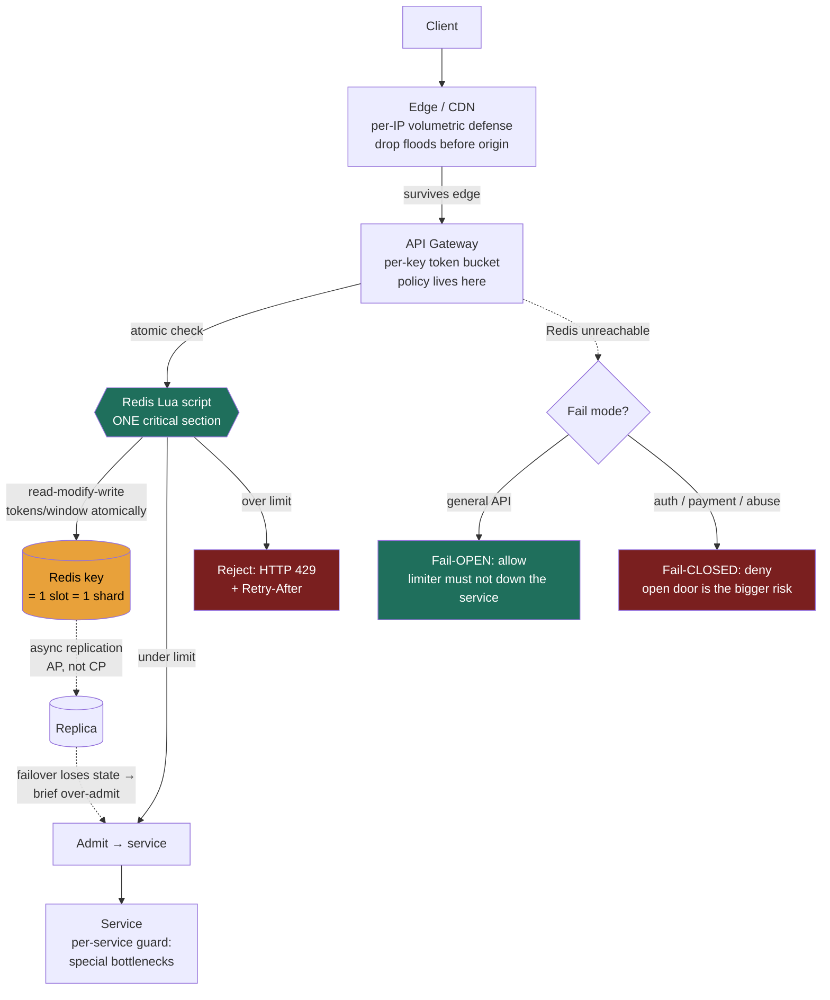

### Learning objectives
- State the **four jobs** a rate limiter does (protect capacity, ensure fairness, control cost, defend against abuse) and recognize that "the limit" is really **two numbers** - a sustained rate and an allowed burst.
- Pick an algorithm by its burst behavior: why the **sliding-window counter** is the production default for trailing-window limits, and why the **token bucket** is the default when the requirement is "rate + burst."
- Engineer **distributed enforcement** with a shared Redis - the per-request **latency tax** (~0.5-1 ms), why the check must be **atomic**, and where a single global limit hits the **hot-key** ceiling.
- Make the Director calls: **where to enforce** (edge vs gateway vs service), **fail-open vs fail-closed**, and **per-user/IP/key dimensioning** - each tied to a requirement, cost, and risk.

### Intuition first
A rate limiter is the **bouncer with a clicker counter at a club door.** The club holds a fixed number of people (your finite capacity); the bouncer's job is to let people in at a rate the room can absorb, keep one rowdy group from filling the whole floor (fairness), and turn away the obvious troublemakers (abuse). The interesting part is *how the bouncer counts*. The simplest bouncer **resets his clicker every hour on the hour** - cheap, but a crowd can pour in during the last minute of one hour *and* the first minute of the next, so 2,000 people hit a 1,000-person room in two minutes while the clicker never showed a violation. A meticulous bouncer **writes down every entry time** and counts the trailing hour exactly - accurate, but the ledger is the cost. The bouncer most clubs actually want hands out **tokens that drip into a bucket at a fixed rate, up to a cap**: quiet periods let tokens accumulate, so a returning regular can enter in a quick burst, then it settles to the drip rate - "20 per second sustained, burst of 100" in one mechanism.

Now put a thousand of these doors around the world that must enforce **one shared limit** - "this API key gets 1,000 requests/minute across all our regions" - without every bouncer phoning a central office on every single entry, because that phone call is latency on every request. That coordination problem - *how much accuracy you pay for, and how much you talk to a shared store to enforce a global limit* - is the whole lesson. The algorithms are just different bouncers; the hard part is the shared clicker.

### Deep explanation

**Why a rate limiter is its own building block - the four jobs.** Every public-facing system needs one, and it earns its place by doing up to four distinct things; name *which* you're invoking, because the limit you pick depends on it:

1. **Protect capacity.** Your service sustains some QPS before it degrades. A limiter sheds load *before* it reaches the bottleneck - the cheap, early guard that keeps a traffic spike or a runaway client from cascading into an outage. This is the load-shedding sibling of the queue's load-leveling (Lesson 3.8): the queue *buffers* work you'll still do; the limiter *rejects* work you won't.
2. **Fairness / multi-tenancy.** One noisy tenant must not consume the capacity you sold to a thousand quiet ones. A per-tenant limit caps each one's slice so a single client's bug (a retry storm, an infinite loop) can't starve everyone else - the **noisy-neighbor** problem.
3. **Cost control.** When each request costs real money - an LLM inference at cents per call, a third-party API you pay per request, egress bandwidth - the limiter is a **budget enforcer**. "100 image generations/day on the free tier" is a billing decision implemented as a rate limit.
4. **Abuse / security.** Throttle credential-stuffing on a login endpoint (say **5 attempts/minute/IP**), scraping, and volumetric DoS at the application layer. Here the limiter is a security control, and - critically - its **failure mode flips** (fail-open vs fail-closed, below).

**The limit is two numbers, not one.** This is the framing that separates signal from "we'll add a rate limiter." A useful limit specifies a **sustained rate** (the long-run average, e.g. 20 req/s) *and* an **allowed burst** (how much short-term overage you tolerate, e.g. up to 100 at once). A pure "20 req/s" with zero burst tolerance rejects perfectly legitimate clients that batch (a page firing 30 parallel API calls on load), while "100 at once, no sustained cap" lets a client pin you indefinitely. Which algorithm you pick is largely *which of these two knobs it gives you*.

**The algorithm progression - three sentences, not twenty minutes.** A **fixed window** (one counter per key, reset each interval) is the cheapest option - a single atomic `INCR` - but allows up to **~2× the limit** in a burst straddling the window boundary, and the exact fix (a **sliding-window log** of every request timestamp) costs O(limit) memory per key. The **sliding-window counter** - keep this window's count and last window's, weight the previous by how much of it still overlaps the trailing window - kills the boundary cliff at **O(1) memory** and is the **production default** for high-volume trailing-window limits (it's what Cloudflare runs at edge scale). The **token bucket** models the two-number limit directly - a bucket of **B** tokens (the burst) refilling at **R**/second (the sustained rate), two numbers of state per key - and is the default gateway choice: it's what **Stripe** uses and what **AWS API Gateway** exposes as `rateLimit` + `burstLimit`. Its dual, the **leaky bucket**, drains a queue at a constant R so the downstream never sees a spike - choose it only when the thing you're protecting cannot tolerate bursts at all, and accept that it removes burst tolerance and adds queueing latency where the token bucket admits instantly while tokens last.

Go deeper — the five algorithms compared (IC depth, optional)

| Algorithm | Burst handling | Accuracy | Memory / key | Cost per request | Use when… |
|---|---|---|---|---|---|
| **Fixed window** | allows ~2× at boundary | low (boundary burst) | O(1) (1 int) | 1 atomic `INCR` | Cheap, approximate throttling; a momentary 2× is survivable |
| **Sliding-window log** | exact, no burst slack | **exact** | O(limit) per key (every timestamp) | O(log n) ZSET ops | Low-volume, high-value limits where precision matters (e.g. "3 password resets/hour") |
| **Sliding-window counter** | smooth, no boundary cliff | near-exact (assumes uniform previous window) | O(1) (2 ints) | 2 reads + weight | High-volume API limiting; the accuracy/memory sweet spot |
| **Token bucket** | **allows burst up to B**, then sustained R | good (rate + burst, not trailing-window) | O(1) (tokens + timestamp) | Lua read-modify-write | "Sustained rate + burst" APIs (Stripe, AWS API GW); the default gateway choice |
| **Leaky bucket** | **smooths to constant R**, no output burst | constant output, may queue | O(1)-O(queue) | drain/queue op | Downstream needs perfectly paced output; accept added latency |

The sliding-window counter's estimate: `current_count + previous_count × (1 − fraction_of_current_window_elapsed)`. 25% into the current minute with previous = 800, current = 300 → `300 + 800 × 0.75 = 900`; under a 1,000 limit, admit. The error comes from assuming requests were uniformly distributed in the previous window; in practice it's negligible against not storing per-request logs. Sliding-log memory, quantified: a 100 req/min limit at 1M active keys is up to 100M ZSET entries at ~64-100 bytes each - several GB of RAM just for counters. Token-bucket refill is computed lazily on access (`tokens = min(B, tokens + elapsed × R)`), so no background timer. Production limiters sometimes use **GCRA** (the leaky-bucket idea as a single timestamp per key, no queue - what Redis's `redis-cell` implements); know it exists, no deeper.

**Distributed enforcement - the actual hard part.** Everything above is a single counter. Real systems run **many limiter instances** (every gateway pod, every edge node) that must enforce **one global limit**, and there are two routes. **Local per-instance counters** need no coordination, but **N instances each enforcing "1,000/min" is a real global limit of N × 1,000** - acceptable only as a coarse first layer, or by dividing the limit by instance count (brittle under autoscaling). A precise global limit needs a **shared store - Redis is the canonical choice** (Lesson 3.7): in-memory (~**0.5-1 ms** same-DC), single-threaded per shard, with the data structures you need. The cost is that **every rate-limited request now does a network round-trip to Redis** - that 0.5-1 ms rides your request path, and Redis becomes a dependency whose availability gates your throttled endpoints.

**Atomicity in one sentence.** The token-bucket check is a read-modify-write (read tokens, compute refill, check, decrement, write back), and run as separate Redis commands two concurrent requests can both see "1 token left" and both get in - so the **entire check runs as one Lua script**, which Redis's single thread executes as an indivisible critical section. "Token bucket in Redis" always means "token bucket in a Lua script."

Go deeper — the two distinct Redis races (IC depth, optional)

*Race A - `INCR` then `EXPIRE` (the orphaned-key race).* Fixed-window in Redis is `INCR key` then, on first creation, `EXPIRE key 60`. `INCR` itself is atomic - the count is always correct under any concurrency. The race is that `INCR` and `EXPIRE` are two separate commands: if the client crashes between them, the key has the right count but **no TTL** - it never resets, and that user is throttled forever once they hit the limit. Fix: a Lua script, or `SET key 0 EX 60 NX` to seed the TTL atomically. Note: the bug is the lost expiry, not an over-count.

*Race B - read-modify-write over-admission.* Token bucket (and sliding-log) need multiple steps; two concurrent requests can both read "1 token left," both pass the check, both decrement → **two admitted against a budget of one**. This is the race that actually lets clients exceed the limit; the fix is the single Lua script.

Conflating these - saying "`INCR` over-counts" (it doesn't) or "the EXPIRE race lets you exceed the limit" (it loses the reset, it doesn't over-admit) - is the classic tell that someone has read about this but not built it.

**The consistency cost - and why nobody pays to remove it.** Redis replication is **asynchronous → AP-leaning, not CP** (Lesson 3.7), so a failover can lose counter state and **briefly over-admit** - a client gets a fresh budget mid-window. You *could* build the limiter on a strongly-consistent CP store, but **almost nobody does**, and that's the Director read: rate limiting is **inherently approximate and best-effort**. A momentary over-admission after a failover is harmless (you throttle slightly late); the CP store's per-request consensus latency and reduced availability are real costs paid on *every* request. The principle: **the limiter must never be more fragile or slower than the service it protects.** It drives the failure-mode and placement decisions next.

**Where to enforce - edge vs gateway vs service.** Defense in depth; each layer catches what the previous can't:

- **Edge / CDN (e.g. Cloudflare, AWS WAF):** the outermost layer. Catches **volumetric abuse and DoS before it consumes any origin resource or bandwidth** - the cheapest place to drop a flood. Coarse-grained (per-IP, per-region). *Reject here what you never want to pay to receive.*
- **API gateway (e.g. Kong, Envoy):** the **chokepoint where per-API-key / per-user policy lives.** This is where most application rate limiting belongs - it sees the authenticated identity, centralizes policy across all backend services, and keeps the limiter out of application code. The natural home for the Redis-backed token bucket enforcing tiered limits.
- **Per-service:** the innermost guard, for limits only the service understands (an expensive internal endpoint, a downstream third-party quota you must not exceed).

The default is **gateway-primary** with an edge layer for volumetric defense and per-service guards for special bottlenecks. Putting *all* limiting in application code is the rejected anti-pattern - it scatters policy, duplicates the shared-store dependency across every service, and burns app capacity on requests you should have dropped at the door.

**Fail-open vs fail-closed - and why it's not one global choice.** The limiter depends on a shared store; that store *will* occasionally be unreachable. What then?

- **Fail-open (allow on limiter failure):** if Redis is down, **stop rate-limiting and let traffic through.** The **correct default for general API limiting**: a rate limiter exists to *protect* the service, so it must never be the thing that takes the service down. Briefly serving unthrottled traffic during a Redis outage beats rejecting *all* traffic because the limiter is unavailable. The risk you accept - an abuser runs unthrottled during the window - is backstopped by the edge layer and coarse local caps.
- **Fail-closed (deny on limiter failure):** for **security- and cost-critical** limits - login/credential-stuffing endpoints, payment and fraud paths, paid-per-call abuse - the calculus **inverts**: unlimited login attempts during a limiter outage is a *worse* outcome than rejected logins, so you **deny when the limiter can't decide**.

The strong-signal answer is **not** picking one globally - it's "**fail-open for availability-sensitive general traffic, fail-closed for the auth/payment/abuse endpoints where an open door is the bigger risk**," justified per endpoint by what each protects.

**Per-user / IP / key dimensioning - choosing the limiter's key.** What you count *by* determines what you actually protect:

- **Per API key / account:** the right dimension for **authenticated, paid, multi-tenant** APIs - it enforces the tier you sold and isolates noisy neighbors. The standard SaaS choice.
- **Per IP:** the only option for **unauthenticated** traffic. But it's blunt: a corporate NAT or mobile carrier puts thousands of real users behind one IP (a strict per-IP limit throttles innocents), while an attacker rotates IPs cheaply to dodge it. Coarse anonymous abuse defense, not precise fairness.
- **Per endpoint / operation, cost-weighted:** a cheap `GET /status` and an expensive `POST /search` shouldn't share one budget - each request consumes tokens proportional to its expense, so the limit reflects actual load.
- **Global:** one limit across everything, to protect a hard downstream ceiling (a third-party API capped at 10k/s for your whole company). Operationally the dangerous one: a global limit funnels **every request onto one Redis key - one hash slot, one shard - and you cannot shard your way out of a single hot key.** The fixes - sharded sub-counters, or local approximate counters reconciled periodically - are the subject of **Lesson 3.16**; here, the signal is *naming* the hot-key ceiling the moment someone asks for a single global limit.

**The client-facing contract.** A rejected request returns **HTTP 429 (Too Many Requests)** with a **`Retry-After`** header, and most APIs expose **`X-RateLimit-Limit` / `-Remaining` / `-Reset`** headers so well-behaved clients self-throttle *before* getting rejected (GitHub, Stripe). Naming 429 + `Retry-After` + backoff shows you've shipped one, not just diagrammed it.

### Diagram - distributed enforcement and the placement layers

The amber key is the hazard: a global/abused limit funnels onto **one key → one shard** (the hot-key ceiling, Lesson 3.16). The green Lua box is the only safe way to run a multi-step token-bucket check in Redis - one indivisible critical section. Async replication (dashed) is why a failover briefly over-admits, and the fail-mode branch is the Director call - open for availability, closed for security.

### Worked example - tiered API limits for a SaaS platform
A SaaS API offers three tiers and must enforce them across a fleet of gateway pods behind a load balancer. Requirements (the R/E steps): **Free = 60 req/min, Pro = 1,000 req/min, Enterprise = 20,000 req/min**, per API key; the API also fronts an **LLM endpoint that costs real money per call**; and **login is a separate abuse surface**.

- **Algorithm choice.** **Token bucket** for the tiered limits - the tiers are naturally "sustained rate + burst" (Pro = R of ~17 tokens/s, burst B of, say, 1,000 so a client can fire a page's worth of parallel calls), in O(1) state per key. *Rejected:* sliding-window log (per-request memory at this key cardinality is multi-GB for an exactness the tiers don't need); fixed window (the ~2× boundary burst would let a Pro client briefly hit ~2,000/min, undermining the tier we're billing for).
- **Distributed enforcement.** One **Redis-backed token bucket per key, in a Lua script**, at the **API gateway** (it sees the authenticated key, centralizes policy). The Lua script makes the refill-check-decrement atomic, so concurrent requests can't over-admit. Per-request tax: one ~**0.5-1 ms** Redis round-trip - acceptable for an API where calls already cost tens of ms.
- **Sizing the store.** State is **two numbers per active key** (~tens of bytes); even **1M active keys** is well under **100 MB** - a single small Redis (primary + replica) handles it, and per-key state shards cleanly if throughput ever demands it (*unlike* a single global counter).
- **The cost endpoint.** The **LLM route gets a stricter, cost-weighted** token bucket (an inference consumes, say, 50 tokens vs 1 for a normal call) - the limiter is now a **budget enforcer**, capping spend per tier, not just protecting capacity.
- **Failure mode - the split.** General API limiting **fails open**: if Redis is unreachable, serve traffic unthrottled rather than 503 the whole API (the edge layer still backstops volumetric abuse). **Login fails closed**: credential-stuffing protection (**5 attempts/min/IP**) *denies* when the limiter can't decide - an open login door during an outage is the worse outcome.
- **Placement layering.** **Edge/CDN** drops volumetric floods per-IP before they reach the gateway; the **gateway** enforces per-key tiers; the **LLM service** keeps its own per-service guard for the third-party model quota it must not exceed.
- **Client contract.** Rejections return **429 + `Retry-After`**, and every response carries **`X-RateLimit-Remaining`** so well-behaved SDKs self-throttle before getting rejected.

Every decision falls out of the requirement: tiers → token bucket; multi-tenant fairness → per-key; money endpoint → cost-weighted budget; "limiter must not down the service" → fail-open for general traffic but fail-closed for auth.

### Trade-offs table - the production trio
| Choice | What it gives you | What it costs | Use when… |
|---|---|---|---|
| **Sliding-window counter** | near-exact trailing-window limit at O(1) memory; no boundary cliff | small approximation (assumes uniform previous window) | High-volume trailing-window limiting ("N per minute") at scale |
| **Token bucket** | rate **and** burst as independent knobs; instant admission while tokens last | needs an atomic read-modify-write (Lua) in a shared store | The default API/gateway limit: "R/s sustained, burst B" (Stripe, AWS) |
| **Leaky bucket** | perfectly constant output rate; downstream never sees a spike | removes burst tolerance; queued requests wait | Downstream rated for *exactly* N/s; smoothness is the requirement |

### What interviewers probe here
- **"What's wrong with a fixed-window counter, and how do you fix it cheaply?"** - *Strong:* the **boundary burst** - up to ~2× the limit straddling the window edge - fixed by the **sliding-window counter** (two counters, weighted) at O(1) memory. *Red flag:* doesn't see the boundary problem, or jumps to the per-request log without naming its memory cost.
- **"Token bucket vs leaky bucket - when each?"** - *Strong:* token bucket **allows bursts up to B** then sustained R - the natural "rate + burst" API limit with immediate admission; leaky bucket **smooths output to a constant R** with no burst tolerance and possible queueing - only when the downstream needs perfectly paced input. *Red flag:* treats them as interchangeable, or gets the burst direction backwards.
- **"You're enforcing one limit across 50 gateway pods. How, and what does it cost?"** - *Strong:* a **shared Redis** as the source of truth, paid for in a ~0.5-1 ms round-trip per request and a new dependency; the multi-step check must be **one Lua script** or concurrent requests over-admit; Redis is AP, so a failover briefly over-admits - acceptable because limiting is best-effort. *Red flag:* "each pod counts locally" without noticing the global limit becomes **50×**, or proposes GET-then-SET with no atomicity.
- **"Redis goes down. What happens to your API?"** - *Strong:* **fail-open for general traffic** (the limiter must not be what takes the service down), **fail-closed for auth/payment** (an open door is the bigger risk) - the *split* is the answer. *Red flag:* one global fail mode with no per-endpoint reasoning, or failing general traffic closed and hard-downing the product during a Redis blip.
- **"You need a single global limit (a third-party quota). Where does this break?"** - *Strong:* the **hot-key ceiling** - one counter = one key = one shard, and you can't shard a single hot key; mitigations are sharded counters or local approximation (Lesson 3.16). *Red flag:* thinks "just add Redis shards" helps a single key.

### Common mistakes / misconceptions
- **Doing the token-bucket check as GET-then-compute-then-SET** - two concurrent requests both see "1 token left" and both get in; the *entire* check must be **one Lua script**. (And remember `INCR` itself is atomic - the fixed-window race is the separate `EXPIRE`, which loses the reset, not the count.)
- **Treating local per-instance counters as the precise global limit** - N instances → **N× the intended limit**; dividing by instance count is brittle under autoscaling.
- **Confusing token bucket and leaky bucket** - token bucket *allows* bursts up to B; leaky bucket *smooths them away* to constant R. Mixing these up is the classic tell.
- **Failing the limiter closed on general traffic** - a Redis blip then hard-downs the whole product; general API limiting **fails open** (the limiter must never be more fragile than what it protects).
- **Forgetting the client contract** - no **429 / `Retry-After` / `X-RateLimit-*`** means clients can't self-throttle and hammer you with blind retries.

### Practice questions
**Q1.** A client reports being throttled "even though they're under the limit," and your dashboards show traffic briefly hitting ~2× the configured rate. You use a per-minute fixed-window counter. Diagnose and fix, quantifying the trade.
> *Model:* The **fixed-window boundary burst**: a client can send a full limit's worth in the last moment of one window and another full limit in the first moment of the next - up to **~2× the limit** across the boundary - while neither minute's counter shows a violation. Fix: a **sliding-window counter** - blend the current and previous minute's counts, weighting the previous by its remaining overlap - which decays smoothly instead of cliff-resetting and eliminates the 2× burst at the same **O(1) memory**. I'd reject the sliding-window **log**: exact, but it stores every timestamp (O(limit) per key, multi-GB at our key cardinality) for accuracy this endpoint doesn't need; the counter's small approximation error is plenty.

**Q2.** You implement a distributed token bucket in Redis as `GET tokens` → compute refill → `SET tokens`. Under load, clients exceed their limit. What's the bug, and the correct implementation?
> *Model:* A **read-modify-write race**: the check is multiple commands, so two concurrent requests both `GET` "1 token left," both pass, both `SET` a decrement - two admitted against a budget of one, worse under higher concurrency. Fix: run the **entire** refill-check-decrement as **one atomic Lua script** - Redis is single-threaded per shard, so the script is a true critical section. I'd also accept that a Redis failover can lose bucket state (async replication, AP) and *briefly* over-admit - fine, because rate limiting is best-effort and a CP store's per-request consensus cost isn't worth paying.

**Q3.** Where do you enforce rate limits for a multi-tenant API, and what fails-open vs fails-closed?
> *Model:* **Defense in depth across three layers.** Edge/CDN (per-IP) drops volumetric floods *before* they consume origin resources - reject what you never want to pay to receive. The **API gateway** is primary: it sees the **authenticated key**, so per-tenant tiered limits live here, centralized rather than scattered in app code. Per-service guards protect bottlenecks the gateway can't see (an expensive internal route, a third-party quota). On failure: **fail-open for general traffic** - the limiter must never be the thing that takes the service down, so a Redis outage means serve unthrottled (edge still backstops abuse) rather than 503 everything - but **fail-closed for auth/payment/abuse endpoints**, where unlimited credential-stuffing during an outage is the worse outcome. The signal is the *split*, justified per endpoint.

**Q4.** You must enforce a single company-wide limit of 10,000 req/s against a third-party API you don't own. What's the scaling hazard, and how do you handle it?
> *Model:* The **hot-key problem**: a single global limit means every request increments one counter - one Redis key, one hash slot, one shard - and you **cannot shard your way out of a single hot key**; "add more Redis shards" does nothing. The fixes are **sharded counters** (split the logical counter into K sub-keys, increment one at random, sum to read - Lesson 3.16) or **local approximate counters** reconciled to the shared store periodically, trading a small over-admit between syncs for zero per-request central writes. Both lean on the same principle - rate limiting tolerates approximation - so I'd pick by how tight the third-party ceiling is.

**Q5.** A teammate proposes building the limiter on a strongly-consistent (CP) store so the limit is "never violated." Push back at Director altitude.
> *Model:* **Wrong trade.** A CP store enforces the limit exactly, but you pay **consensus latency on every request** (a quorum round-trip, far above Redis's ~0.5-1 ms) and **reduced availability under partition** (Lesson 2.7) - the limiter becomes a fragile, slow dependency on the hot path of everything, violating the principle that **the limiter must never be more fragile or slower than the service it protects**. What does exactness buy? Rate limiting is inherently best-effort: the cost of occasionally over-admitting after a failover is trivial (you throttle slightly late); the CP cost is real and paid continuously. Use an AP store (Redis), accept brief over-admission, and spend the engineering on the edge/gateway layering and the fail-open/closed split. "Never violated" is a non-requirement you'd be overpaying for.

### Key takeaways
- A rate limiter does up to four jobs - **protect capacity, fairness, cost control, abuse defense** - and a real limit is **two numbers**: a **sustained rate** and an **allowed burst**. Which algorithm you pick is mostly which of those knobs it gives you.
- The progression in one breath: **fixed window** is cheap but allows a ~2× boundary burst; the **sliding-window counter** is the production default for trailing-window limits at O(1) memory; the **token bucket** models rate + burst directly and is the API-gateway default (Stripe, AWS); the **leaky bucket** trades burst tolerance for perfectly smooth output.
- Distributed enforcement uses a **shared Redis** - one source of truth paid for in a **~0.5-1 ms** per-request tax - and the multi-step check must be **one Lua script** to be atomic. Redis is **AP**, so a failover briefly over-admits; acceptable, because limiting is best-effort.
- **Where to enforce:** edge/CDN for volumetric defense, **gateway for per-key policy** (primary), per-service for special bottlenecks. **Fail-open** for general traffic, **fail-closed** for auth/payment/abuse - the *split* is the signal.
- **Dimension** by key (authenticated fairness/billing), IP (anonymous only - NAT and rotation make it coarse), or cost-weighted (expensive endpoints). A **single global limit** hits the **hot-key ceiling** - one key, one shard, unshardable - fixed by sharded counters (3.16) or local approximation.

> **Spaced-repetition recap:** Bouncer with a clicker. Fixed window = cheap but 2× boundary burst; sliding counter = blend two windows, the production default; token bucket = B burst + R sustained, the API default (Stripe); leaky bucket = smooth but no burst. Distributed = shared Redis at ~0.5-1 ms/check, whole check in one **Lua** script; AP, so failover briefly over-admits. Enforce at edge + gateway + service; **fail-open** general, **fail-closed** auth/payment. Per-key not per-IP for authenticated; a global limit hits the **hot-key** ceiling → 3.16.
