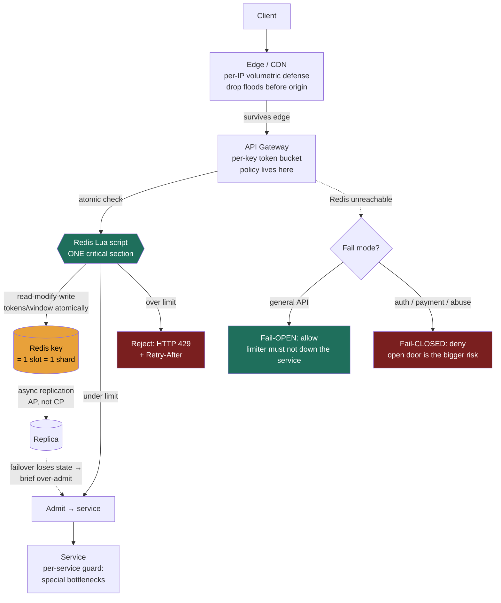

### Learning objectives
- State the **four jobs** a rate limiter does (protect capacity, ensure fairness, control cost, defend against abuse) and recognize that "the limit" is really **two numbers** - a sustained rate and an allowed burst.
- Walk the algorithm progression - **fixed window → sliding-window log → sliding-window counter → token bucket → leaky bucket** - where each one's flaw motivates the next, and quantify the **accuracy / memory** trade between them.
- Engineer **distributed enforcement** with a shared store (Redis `INCR`/Lua, token-bucket-in-Lua), naming the **two distinct races**, the per-request **latency tax**, and the **hot-key** ceiling.
- Make the Director calls: **where to enforce** (edge vs gateway vs service), **fail-open vs fail-closed**, and **per-user/IP/key dimensioning** - each tied to a requirement, cost, and risk.

### Intuition first
A rate limiter is the **bouncer with a clicker counter at a club door.** The club holds a fixed number of people (your finite capacity); the bouncer's job is to let people in at a rate the room can absorb, keep one rowdy group from filling the whole floor (fairness), and turn away the obvious troublemakers (abuse). The interesting part is *how the bouncer counts*, and every counting method has a flaw:

- The simplest bouncer **resets his clicker every hour on the hour** - "1,000 in per hour." Cheap and obvious. But a crowd can pour in during the last minute of one hour *and* the first minute of the next, so 2,000 people hit the room in two minutes around midnight while the clicker says you never broke 1,000 (the **boundary burst**).
- A meticulous bouncer instead **writes down the exact time of every single entry** and, for each new arrival, counts how many entries happened in the *trailing* 60 minutes. Perfectly accurate, no boundary trick - but on a Saturday night he's maintaining a logbook with thousands of timestamps per door, and that ledger is the cost.
- A pragmatic bouncer **keeps just two tallies** - this hour's and last hour's - and estimates the trailing count by blending them. Almost as accurate, a fraction of the bookkeeping.
- A different bouncer hands out **tokens that drip into a bucket at a fixed rate**, up to a cap; you get in only if a token's available. Quiet periods let tokens accumulate, so a returning regular can enter in a quick burst - then it settles to the drip rate. That's the model that lets you say "20 requests/second sustained, but tolerate a burst of 100."
- The strictest bouncer runs a **single-file queue that admits exactly one person every three seconds** no matter how many are waiting outside. The room never sees a spike - perfectly smooth - but you've removed any burst tolerance and people wait in line.

Now put a thousand of these doors around the world that must enforce **one shared limit** - "this API key gets 1,000 requests/minute across all our regions" - without every bouncer phoning a central office on every single entry, because that phone call is latency on every request. That coordination problem - *how much accuracy you pay for, and how much you talk to a shared store to enforce a global limit* - is the whole lesson. The algorithms are just different bouncers; the hard part is the shared clicker.

### Deep explanation

**Why a rate limiter is its own building block - the four jobs.** Every public-facing system needs one, and it earns its place by doing up to four distinct things; name *which* you're invoking, because the limit you pick depends on it:

1. **Protect capacity.** Your service sustains some QPS before it degrades. A limiter sheds load *before* it reaches the bottleneck - it's the cheap, early guard that keeps a traffic spike or a runaway client from cascading into an outage. This is the load-shedding sibling of the queue's load-leveling (Lesson 3.8): the queue *buffers* work you'll still do; the limiter *rejects* work you won't.
2. **Fairness / multi-tenancy.** One noisy tenant must not consume the capacity you sold to a thousand quiet ones. A per-tenant limit caps each one's slice so a single client's bug (a retry storm, an infinite loop) can't starve everyone else - the **noisy-neighbor** problem.
3. **Cost control.** When each request costs real money - an LLM inference at cents per call, a third-party API you pay per request, egress bandwidth - the limiter is a **budget enforcer**. "100 image generations/day on the free tier" is a billing decision implemented as a rate limit.
4. **Abuse / security.** Throttle credential-stuffing on a login endpoint (say **5 attempts/minute/IP**), scraping, and volumetric DoS at the application layer. Here the limiter is a security control, and - critically - its **failure mode flips** (covered under fail-open vs fail-closed below).

**The limit is two numbers, not one.** This is the framing that separates signal from "we'll add a rate limiter." A useful limit specifies a **sustained rate** (the long-run average, e.g. 20 req/s) *and* an **allowed burst** (how much short-term overage you tolerate, e.g. up to 100 at once). A pure "20 req/s" with zero burst tolerance rejects perfectly legitimate clients that batch (a page that fires 30 parallel API calls on load), while "100 at once, no sustained cap" lets a client pin you indefinitely. Which algorithm you pick is largely *which of these two knobs it gives you* - so let's derive the algorithms by their flaws.

**Algorithm 1 - Fixed window: cheapest, but the boundary burst.** Divide time into fixed windows (per minute, per hour). Keep one counter per key per window; increment on each request; reject when it exceeds the limit; the counter resets at the window edge.

- *Cost:* trivially cheap - **one integer per key**, a single atomic increment per request. In Redis this is literally `INCR ratelimit:{user}:{minute}` with a TTL. O(1) memory, O(1) work.
- *The flaw:* the reset is a cliff. With a limit of **1,000/min**, a client can fire 1,000 requests in the last second of 12:00:59 and another 1,000 in the first second of 12:01:00 - **2,000 requests in ~2 seconds**, double the intended rate, and neither window's counter ever showed a violation. The precise statement: a fixed window allows up to **~2× the limit within a single window-length interval that straddles the boundary**. For capacity protection that 2× spike is exactly what you were trying to prevent. *Rejected for anything where the burst itself is the threat;* kept when approximate, cheap throttling is fine and a momentary 2× is survivable.

**Algorithm 2 - Sliding-window log: exact, but it remembers everything.** Fix the boundary problem by tracking the *actual* trailing window. Store the **timestamp of every request** in a sorted structure per key; on each new request, drop timestamps older than `now - window`, count what remains, admit if under the limit, and record the new timestamp.

- *Accuracy:* **exact.** The window truly slides; there is no boundary artifact because the count is always "requests in the last 60 seconds, right now."
- *The flaw - memory.* You store **one entry per request in the window**, per key. Quantify it: a **100 req/min** limit means up to 100 timestamps per active key; at **1M active users** that's up to **100M entries**. At ~**64-100 bytes** per sorted-set entry (member + score + skiplist overhead - treat as an assumption), that's **several GB of RAM just for counters**, plus the per-request work is now O(log n) insert + a range trim, not O(1). In Redis this is a **ZSET** with `ZADD` + `ZREMRANGEBYSCORE` + `ZCARD`. *Rejected at high cardinality / high limits* because the memory and per-op cost don't justify exactness; kept for **low-volume, high-value** limits where precision matters (e.g. "3 password resets/hour" - tiny logs, exactness worth it).

**Algorithm 3 - Sliding-window counter: near-exact accuracy at O(1) memory.** The pragmatic middle. Keep just **two fixed-window counters** - the current window and the previous - and *estimate* the sliding count by weighting the previous window by how much of it still overlaps the trailing window:

```
estimate = current_window_count
         + previous_window_count × (1 − fraction_of_current_window_elapsed)
```

So 25% into the current minute, the previous minute still contributes 75% of its count. Example: previous minute = 800, current = 300, 25% elapsed → estimate `= 300 + 800 × 0.75 = 900`. Under the 1,000 limit, so admit.

- *Why it works:* it kills the boundary burst (the previous window's weight decays smoothly instead of cliff-resetting) while storing **two integers per key** - O(1) memory, basically free.
- *The catch:* it's an **approximation** - it assumes requests were **uniformly distributed** within the previous window. If last minute's 800 were actually all in its final second, the estimate understates the true trailing load and you slightly over-admit; if they were all early, it overstates. In practice the error is tiny - **Cloudflare runs exactly this** at edge scale and published that only **~0.003% of requests** were wrongly allowed or limited across **400M requests** - negligible against the operational saving of not storing per-request logs at that volume. *Rejected only when you need provable exactness* (use the log); the default for high-volume API limiting.

**Algorithm 4 - Token bucket: the one that models "sustained rate + burst" directly.** A bucket holds up to **B** tokens (the burst capacity) and refills at **R** tokens/second (the sustained rate). Each request removes one token; if the bucket's empty, reject (or queue). State per key is just **two numbers**: current token count and last-refill timestamp - O(1) memory, and refill is computed lazily on access (`tokens = min(B, tokens + elapsed × R)`), so there's no background timer.

- *The property that makes it the workhorse:* it **allows bursts up to B** after idle periods (tokens accumulated), then **enforces sustained R** once the bucket drains. That's precisely the two-number limit - "20 req/s sustained (R), burst up to 100 (B)" - in one mechanism. It's the model **Stripe** uses for its API limiting and **AWS API Gateway** exposes as `rateLimit` (steady-state) + `burstLimit`. Tune B and R independently to dial burst tolerance against floor protection.
- *Trade vs sliding-window:* token bucket is about **shaping future admission** (do I have budget *now*?), sliding-window is about **measuring a trailing window** (how many did I serve recently?). Token bucket is the natural fit when you think in "rate + burst"; it's the default for most API gateways.

**Algorithm 5 - Leaky bucket: smooths the output, kills the burst.** A queue (the bucket) that **drains at a fixed rate R** - one request admitted every `1/R` seconds, regardless of arrival pattern. Arrivals join the queue; if the queue is full, they're dropped.

- *The property:* the **output rate is perfectly constant** - the downstream never sees a spike, even if arrivals are spiky. This is what you want when the thing you're protecting cannot tolerate bursts at all (a legacy system rated for *exactly* N/s, or a fairness guarantee of evenly-spaced work).
- *The cost vs token bucket:* leaky bucket **removes burst tolerance** (token bucket *allows* a burst up to B; leaky bucket *smooths it away*) and **adds latency** - queued requests wait, where token bucket admits instantly while tokens last. So the pair is: **token bucket = burst-friendly, immediate; leaky bucket = burst-smoothing, may delay.** *Choose leaky* when smooth, paced output is the requirement; *choose token* when occasional bursts are fine and you don't want to add queueing latency. (The two are duals - both enforce the same sustained R; they differ only in burst handling.)

> **One refinement worth a sentence, not a section:** production limiters often use **GCRA** (Generic Cell Rate Algorithm) - the leaky-bucket idea implemented with a **single timestamp** per key and no queue, giving O(1) state, smooth pacing, and no boundary burst. It's what Redis's `redis-cell` module implements. Know it exists as the "one-number leaky bucket"; going deeper than that at a Director interview is the §2 *too-deep* trap.

**Distributed enforcement - the actual hard part.** Everything above is a single counter. Real systems run **many limiter instances** (every gateway pod, every edge node) that must enforce **one global limit**. You have two routes, and naming the trade is the signal:

- **Local (per-instance) counters - no coordination, but the limit multiplies.** Each instance keeps its own counter in memory. Zero latency, zero shared infrastructure - but with **N instances** each enforcing "1,000/min," the real global limit is **N × 1,000**. Fine when you can divide the limit by instance count (give each `limit/N`), but that's brittle as instances autoscale, and it over-restricts when traffic is unevenly balanced. Acceptable as a **coarse first layer** (and as a hot-key shield, below); not how you enforce a precise global limit.
- **Shared store - one source of truth, paid for in latency.** All instances read/write a **central store - Redis is the canonical choice** (Lesson 3.7) because it's in-memory (~**0.5-1 ms** same-DC), single-threaded per shard (so its operations are a natural critical section), and ships the data structures you need. The cost: **every rate-limited request now does a network round-trip to Redis** - that 0.5-1 ms is added to your request path, and Redis becomes a dependency whose availability gates your throttled endpoints.

**The two distinct races - get these exactly right (it's the #1 place candidates muddle).**

*Race A - `INCR` then `EXPIRE` (the orphaned-key race).* Fixed-window in Redis is `INCR key` then, on first creation, `EXPIRE key 60`. **`INCR` itself is atomic** - the count is *always* correct under any concurrency; Redis's single thread serializes increments. The race is that `INCR` and `EXPIRE` are **two separate commands**: if the client crashes (or the network drops) *between* them, you get a key with the right count but **no TTL** - it never resets, and that user is throttled forever once they hit the limit. The fix is to make the pair atomic: a **Lua script** (Redis runs it as one indivisible unit) or `SET key 0 EX 60 NX` to seed the TTL before incrementing. *Note carefully: the bug is the lost expiry, not an over-count - `INCR` does not over-count.*

*Race B - read-modify-write over-admission (the token-bucket / sliding-log race).* Token bucket needs **multiple steps**: read current tokens + last-refill, compute the refill, check ≥ 1, decrement, write back. Sliding-log needs trim + count + add. If two requests run this concurrently as separate Redis commands, **both can read "1 token left," both pass the check, both decrement → you admit 2 against a budget of 1** (over-admission). This is the race that actually lets clients exceed the limit, and the fix is to run the *entire* read-modify-write as **one atomic Lua script** - Redis's single thread executes the script start-to-finish with nothing interleaved, making it a true critical section. *This is why "token bucket in Redis" always means "token bucket in a Lua script," not a sequence of GET/SET.*

Conflating these two races - saying "`INCR` over-counts" (it doesn't) or "the EXPIRE race lets you exceed the limit" (it doesn't; it loses the reset) - is the classic tell that someone has read about this but not built it.

**The consistency cost - and why nobody pays to remove it.** Redis replication is **asynchronous → Redis is AP-leaning, not a CP store** (Lesson 3.7). So if a Redis primary acks a counter update and then dies before its replica receives it, the **promoted replica loses that counter state** - the window resets, and you **briefly over-admit** (a client gets a fresh budget mid-window). Same effect if a counter key is evicted under memory pressure. You *could* build a strongly-consistent limiter on a consensus store (a CP system - Lesson 2.7), but **almost nobody does**, and that's the Director read: rate limiting is **inherently approximate and best-effort** - a momentary over-admission after a failover is harmless (you throttle *slightly* late), whereas the CP store's per-request consensus latency and reduced availability are real costs you'd pay on *every* request. The correct answer is "**accept eventual/approximate enforcement; the limiter must never be more fragile or slower than the service it protects.**" That principle drives the failure-mode and placement decisions next.

**Where to enforce - edge vs gateway vs service.** Defense in depth; each layer catches what the previous can't, and naming the layering is the signal:

- **Edge / CDN (Cloudflare, Akamai, AWS WAF):** the **outermost** layer, closest to the client. Catches **volumetric abuse and DoS before it consumes any origin resource or bandwidth** - the cheapest place to drop a flood, because the request never reaches your infrastructure. Coarse-grained (per-IP, per-region), often the sliding-window-counter at massive scale. *Reject here what you never want to pay to receive.*
- **API gateway (Kong, AWS API Gateway, Envoy/Istio, NGINX):** the **chokepoint where per-API-key / per-user policy lives.** This is where most application rate limiting belongs - it sees the authenticated identity, centralizes the policy across all backend services, and offloads the limiter from application code. The natural home for the **Redis-backed token bucket** enforcing your tiered limits.
- **Per-service:** the **innermost** guard, for limits only the service understands (an expensive internal endpoint, a per-shard write cap, a downstream third-party quota you must not exceed). Catches what slips past the gateway and protects a specific bottleneck.

The default is **gateway-primary** (one place to manage policy, sees identity) with an **edge layer for volumetric defense** and **per-service guards for special bottlenecks**. Putting *all* limiting in application code is the rejected anti-pattern - it scatters policy, duplicates the shared-store dependency across every service, and burns app capacity on requests you should have dropped at the door.

**Fail-open vs fail-closed - and why it's not one global choice.** The limiter depends on a shared store; that store *will* occasionally be unreachable. What happens then?

- **Fail-open (allow on limiter failure):** if Redis is down, **stop rate-limiting and let traffic through.** This is the **correct default for general API limiting**, and the reasoning is exactly the principle above: a rate limiter exists to *protect* the service, so it **must never be the thing that takes the service down**. Briefly serving unthrottled traffic during a Redis outage is far less bad than rejecting *all* traffic because the limiter is unavailable. The risk you accept: during that window an abuser is unthrottled - so you pair fail-open with the edge layer and per-instance local caps as backstops.
- **Fail-closed (deny on limiter failure):** for **security- and cost-critical** limits - login/credential-stuffing endpoints, payment and fraud paths, paid-per-call abuse - the calculus **inverts**: letting unlimited login attempts through during a limiter outage is a *worse* outcome than rejecting them, so you **deny when the limiter can't make a decision**.

The strong-signal answer is **not** picking one globally - it's: "**fail-open for availability-sensitive general traffic, fail-closed for the auth/payment/abuse endpoints where an open door is the bigger risk.**" That split, justified by what each endpoint is protecting, is the Director altitude.

**Per-user / IP / key dimensioning - choosing the limiter's key.** What you count *by* determines what you actually protect, and each choice has a known failure:

- **Per API key / account:** the right dimension for **authenticated, paid, multi-tenant** APIs - it enforces the tier you sold and isolates noisy neighbors. The standard choice for SaaS.
- **Per IP:** the only option for **unauthenticated** traffic (pre-login, anonymous reads). But it's blunt: a corporate NAT or mobile carrier puts **thousands of real users behind one IP** (so a strict per-IP limit throttles innocents), while an attacker rotates IPs cheaply (botnets, proxies) to dodge it. Use it for coarse anonymous abuse defense, not precise fairness.
- **Per endpoint / operation:** weight by cost - a cheap `GET /status` and an expensive `POST /search` shouldn't share one budget. Often a **cost-weighted** scheme: each request consumes tokens proportional to its expense (a search costs 10 tokens, a read costs 1), so the limit reflects actual load, not request count.
- **Global:** one limit across everything - to protect a hard downstream ceiling (a third-party API capped at 10k/s for your whole company). The dangerous one operationally - see the hot-key problem.

**The hot-key ceiling - the strongest Director beat.** A **global limit or a single heavily-abused key** means *every* request increments **one counter** - which lives on **one Redis key**, hence **one hash slot, hence one shard** (Lesson 3.7: `slot = CRC16(key) mod 16384`). You **cannot shard your way out of a single hot key** - all that traffic concentrates on one node, and at high enough QPS that single key's shard becomes the bottleneck (and a blast-radius risk). Two mitigations, and naming them is senior signal:

1. **Local approximate counters + periodic reconciliation:** each instance counts locally and only *syncs* aggregate counts to the shared store every interval - trading exactness (you might over-admit slightly between syncs) for removing the per-request hot-key write. This is the same accept-approximate-enforcement trade again.
2. **Sharded counters (Lesson 3.16):** split the one logical counter into **K physical sub-counters** on K keys (`limit:global:{0..K-1}`); each request increments a random shard; the true count is the sum. This spreads the write load across K slots at the cost of a slightly more expensive read (sum K keys) and looser precision - the canonical fix for a write-hot counter.

If you can't name the hot-key problem when asked to enforce a single global limit, you've missed where this design actually breaks at scale.

**The client-facing contract - the concrete mechanic.** A rejected request returns **HTTP 429 (Too Many Requests)** with a **`Retry-After`** header telling the client when to retry, and most APIs expose **`X-RateLimit-Limit` / `X-RateLimit-Remaining` / `X-RateLimit-Reset`** headers so well-behaved clients can self-throttle *before* getting rejected (GitHub, Stripe, Twitter all do this). Naming 429 + `Retry-After` + backoff shows you've shipped one, not just diagrammed it.

### Diagram - distributed enforcement, the two races, and the placement layers

The amber key is the hazard: a global/abused limit funnels onto **one key → one shard** (the hot-key ceiling). The green Lua box is the *only* safe way to run a multi-step token-bucket check in Redis - one indivisible critical section, no read-modify-write race. Async replication (dashed) is why a failover briefly over-admits, and the fail-mode branch is the Director call - open for availability, closed for security.

### Worked example - tiered API limits for a SaaS platform
A SaaS API offers three tiers and must enforce them across a fleet of gateway pods behind a load balancer. Requirements (the R/E steps): **Free = 60 req/min, Pro = 1,000 req/min, Enterprise = 20,000 req/min**, per API key; the API also fronts an **LLM endpoint that costs real money per call**; and **login is a separate abuse surface**.

- **Algorithm choice.** **Token bucket** for the tiered API limits - the tiers are naturally "sustained rate + burst" (Pro = R of ~17 tokens/s, burst B of, say, 1,000 so a client can fire a page's worth of parallel calls), and token bucket gives both knobs in O(1) state per key. *Rejected:* sliding-window log (per-request memory at this key cardinality is multi-GB for no benefit - the tiers don't need exactness); fixed window (the 2× boundary burst would let a Pro client briefly hit ~2,000/min, undermining the tier we're billing for).
- **Distributed enforcement.** One **Redis-backed token bucket per key, in a Lua script**, at the **API gateway** (it sees the authenticated key, centralizes policy across services). The Lua script does the whole refill-check-decrement atomically - **Race B handled** (no over-admission), and because it's one script there's no separate-`EXPIRE` **Race A** either. Per-request tax: one ~**0.5-1 ms** Redis round-trip - acceptable for an API where calls already cost tens of ms.
- **Sizing the store.** State is **two numbers per active key** (~tens of bytes); even **1M active keys** is well under **100 MB** - a single small Redis (one primary + replica for warmth) handles it. Redis at ~**100k ops/s/node** (simple commands; assumption, more with pipelining) comfortably covers the aggregate request rate of all tiers; if not, shard by key (each key is independent, so it shards cleanly - *unlike* a single global counter).
- **The cost endpoint.** The **LLM route gets a stricter, cost-weighted** token bucket (an inference consumes, say, 50 tokens vs 1 for a normal call) - the limiter is now a **budget enforcer**, capping spend per tier, not just protecting capacity.
- **Failure mode - the split.** General API limiting **fails open**: if Redis is unreachable, serve traffic unthrottled rather than 503 the whole API (the edge layer still backstops volumetric abuse). **Login fails closed**: credential-stuffing protection (**5 attempts/min/IP**) *denies* when the limiter can't decide - an open login door during an outage is a worse outcome than rejecting logins.
- **Placement layering.** **Edge/CDN** drops volumetric floods per-IP before they reach the gateway; the **gateway** enforces per-key tiers (the Redis token buckets); the **LLM service** keeps its own per-service guard for the third-party model quota it must not exceed. Defense in depth, each layer catching what the prior can't.
- **Client contract.** Rejections return **429 + `Retry-After`**, and every response carries **`X-RateLimit-Remaining`** so well-behaved SDKs self-throttle before getting rejected.

Every decision falls out of the requirement: tiers → token bucket; multi-tenant fairness → per-key; money endpoint → cost-weighted + fail-closed-ish budget; "limiter must not down the service" → fail-open for general traffic but fail-closed for auth.

### Trade-offs table - the five algorithms
| Algorithm | Burst handling | Accuracy | Memory / key | Cost per request | Use when… |
|---|---|---|---|---|---|
| **Fixed window** | allows ~2× at boundary | low (boundary burst) | **O(1)** (1 int) | 1 atomic `INCR` | Cheap, approximate throttling; a momentary 2× is survivable |
| **Sliding-window log** | exact, no burst slack | **exact** | **O(limit)** per key (every timestamp) | O(log n) ZSET ops | Low-volume, high-value limits where precision matters (password resets) |
| **Sliding-window counter** | smooth, no boundary cliff | near-exact (assumes uniform prev window) | **O(1)** (2 ints) | 2 reads + weight | **High-volume API limiting** (Cloudflare's choice); accuracy/memory sweet spot |
| **Token bucket** | **allows burst up to B**, then sustained R | good (rate + burst, not trailing-window) | **O(1)** (tokens + ts) | Lua read-modify-write | "Sustained rate + burst" APIs (Stripe, AWS API GW); the default gateway choice |
| **Leaky bucket** | **smooths to constant R**, no output burst | constant output, may queue | O(1)-O(queue) | drain/queue op | Downstream needs perfectly paced output; no burst tolerance, accept added latency |

### What interviewers probe here
- **"What's wrong with a fixed-window counter, and how do you fix it cheaply?"** - *Strong:* the **boundary burst** - up to **~2× the limit** across the window edge - fixed by the **sliding-window counter** (two counters, weighted), which kills the cliff at **O(1)** memory and is what Cloudflare ships. *Red flag:* doesn't see the boundary problem, or jumps to the per-request **log** (exact but multi-GB) without naming the memory cost.
- **"Token bucket vs leaky bucket - when each?"** - *Strong:* token bucket **allows bursts up to B** then sustained R (two independent knobs - the natural "rate + burst" API limit, immediate admission); leaky bucket **smooths output to a constant R** with no burst tolerance and possible queueing latency - choose it only when the downstream needs perfectly paced input. *Red flag:* treats them as interchangeable, or gets the burst direction backwards.
- **"You're enforcing one limit across 50 gateway pods. How, and what does it cost?"** - *Strong:* a **shared store (Redis)** as the single source of truth, paid for in a **~0.5-1 ms round-trip per request** and a dependency; names the **read-modify-write race** and that the whole check must be **one Lua script** (Redis's single thread = critical section); notes Redis is **AP**, so a failover **briefly over-admits**, which is acceptable because limiting is best-effort. *Red flag:* "each pod counts locally" with no awareness the global limit becomes **50×**, or proposes GET-then-SET with no atomicity.
- **"Redis goes down. What happens to your API?"** - *Strong:* **fail-open for general traffic** (the limiter must not be what takes the service down) backstopped by the edge layer, **fail-closed for auth/payment** (an open login door is the bigger risk) - the *split* is the answer. *Red flag:* picks one globally with no per-endpoint reasoning, or fails the limiter *closed* on general API traffic and hard-downs the product during a Redis blip.
- **"You need a single global limit (a third-party quota). Where does this break?"** - *Strong:* the **hot-key problem** - one counter = one key = one slot = one shard; you **can't shard a single hot key**, so mitigate with **local approximate counters** or **sharded counters** (Lesson 3.16). *Red flag:* unaware that a global counter concentrates all traffic on one node, or thinks "just add Redis shards" helps a single key.
- **"Per-IP or per-key?"** - *Strong:* **per-key** for authenticated multi-tenant fairness/billing; **per-IP only for anonymous** traffic, with the caveat that NAT bunches real users and attackers rotate IPs - so it's coarse abuse defense, not fairness. *Red flag:* per-IP for an authenticated API (throttles a whole office behind one NAT).

### Common mistakes / misconceptions
- **Believing `INCR` over-counts under concurrency** - it doesn't; `INCR` is atomic and the count is always right. The real fixed-window race is the **separate `EXPIRE`** leaving an **orphaned key with no TTL** (fix: Lua or seed the TTL atomically).
- **Doing token-bucket / sliding-log as GET-then-compute-then-SET** - the read-modify-write **over-admits** (two requests both see "1 left"); it *must* be **one Lua script**. This is the race that actually lets clients exceed the limit.
- **Confusing token bucket and leaky bucket** - token bucket *allows* bursts up to B; leaky bucket *smooths them away* to constant R. Mixing these up is the classic tell.
- **Shipping the per-request log by default** - exact but **O(limit) memory per key** (multi-GB at scale); the sliding-window **counter** gets near-exact accuracy at O(1). Reserve the log for low-volume high-value limits.
- **Local per-instance counters as the precise global limit** - N instances → **N× the intended limit**; only valid if you divide the limit by instance count (brittle under autoscaling).
- **Failing the limiter closed on general traffic** - a Redis blip then hard-downs the whole product; general API limiting should **fail open** (the limiter must never be more fragile than what it protects).
- **Ignoring the hot-key ceiling on a global limit** - one counter pins one shard; **sharded counters** (3.16) or local approximation are the fix.
- **Forgetting the client contract** - no **429 / `Retry-After` / `X-RateLimit-*`** means clients can't self-throttle and hammer you with blind retries.

### Practice questions
**Q1.** A client reports being throttled "even though they're under the limit," and your dashboards show traffic briefly hitting ~2× the configured rate. You use a per-minute fixed-window counter. Diagnose and fix, quantifying the trade.
> *Model:* This is the **fixed-window boundary burst**. A client can send a full limit's worth in the last moment of one window and another full limit in the first moment of the next - up to **~2× the limit within a single window-length interval that straddles the boundary** - while neither minute's counter ever shows a violation, so the *spike* is real even though each window looks compliant. Fix: move to a **sliding-window counter** - keep the current and previous minute's counts and estimate `current + previous × (1 − fraction_elapsed)`, which decays the previous window smoothly instead of cliff-resetting, eliminating the 2× burst. Cost of the fix is essentially nil: still **O(1) memory** (two integers per key) versus the fixed window's one. I'd reject the sliding-window **log** here - it's exact but stores every timestamp (**O(limit) per key**, multi-GB at our key cardinality) for accuracy this endpoint doesn't need; the counter's small approximation error (it assumes uniform distribution in the previous window) is plenty - it's exactly what Cloudflare runs at edge scale, where they measured only ~0.003% of requests mis-classified.

**Q2.** You implement a distributed token bucket in Redis as `GET tokens` → compute refill → `SET tokens`. Under load, clients exceed their limit. What's the bug, and what's the correct implementation?
> *Model:* A **read-modify-write race (Race B)**. The check is multiple commands, so two concurrent requests can both `GET` "1 token left," both pass the check, both `SET` a decrement - **two admitted against a budget of one** (over-admission), and it gets worse under higher concurrency. The fix is to run the **entire** refill-check-decrement as **one atomic Lua script**: Redis is **single-threaded per shard**, so it executes the script start-to-finish with nothing interleaved - a true critical section, no interleaving, no over-admission. This is *why* "token bucket in Redis" always means "in a Lua script," not a GET/SET sequence. (Distinct from the fixed-window **Race A**, where `INCR`+separate-`EXPIRE` can leave an orphaned key with no TTL - that one loses the *reset*, it doesn't over-admit. Don't conflate them.) I'd also accept that after a Redis **failover** the bucket state can be lost (async replication, AP), causing a *brief* over-admit - acceptable, because rate limiting is best-effort and a CP store's per-request consensus cost isn't worth paying.

**Q3.** Where do you enforce rate limits for a multi-tenant API, and what fails-open vs fails-closed?
> *Model:* **Defense in depth across three layers.** **Edge/CDN** (per-IP) drops volumetric floods and DoS *before* they consume origin resources or bandwidth - reject what you never want to pay to receive. **API gateway** is the primary layer: it sees the **authenticated key**, so per-tenant tiered limits (the Redis token buckets) live here, centralized across all backend services rather than scattered in app code. **Per-service** guards protect special bottlenecks the gateway can't see (an expensive internal route, a third-party quota). On failure: **fail-open for general API traffic** - the limiter exists to protect the service and must never be the thing that takes it down, so a Redis outage means serve unthrottled (the edge layer still backstops abuse) rather than 503 everything. But **fail-closed for the auth/payment/abuse endpoints** - letting unlimited credential-stuffing through during a limiter outage is a worse outcome than rejecting it. The signal is the *split*, justified per endpoint by what it protects - not one global fail mode.

**Q4.** You must enforce a single company-wide limit of 10,000 req/s against a third-party API you don't own. What's the scaling hazard, and how do you handle it?
> *Model:* The **hot-key problem**. A single global limit means every request increments **one counter** - one Redis key, which maps to **one hash slot and therefore one shard** (`CRC16(key) mod 16384`). You **cannot shard your way out of a single hot key**: all 10k/s (plus rejected overage) concentrate on one node, making that key's shard the bottleneck and a blast-radius risk - "add more Redis shards" does nothing for a single key. Two fixes: (1) **sharded counters** (Lesson 3.16) - split the logical counter into K physical sub-counters on K keys, increment a random one per request, sum for the true count; this spreads writes across K slots at the cost of a costlier read and slightly looser precision; or (2) **local approximate counters** - each instance counts locally and reconciles an aggregate to the shared store periodically, trading a small over-admit between syncs for removing the per-request hot-key write. Both lean on the same principle - rate limiting tolerates approximation - so I'd pick based on how tight the third-party ceiling is: sharded counters if I need it fairly precise, local approximation if a little slack is fine and I want zero per-request central writes.

**Q5.** A teammate proposes building the limiter on a strongly-consistent (CP) store so the limit is "never violated." Push back at Director altitude.
> *Model:* **Wrong trade.** A CP store enforces the limit exactly, but you'd pay **consensus latency on every single request** (a quorum round-trip, far above Redis's ~0.5-1 ms) and **reduced availability under partition** (CP sacrifices A - Lesson 2.7) - and the limiter would then become a fragile, slow dependency on the hot path of *every* request, violating the core principle that **the limiter must never be more fragile or slower than the service it protects**. What does exact enforcement actually buy? Rate limiting is **inherently approximate and best-effort** - the cost of *occasionally* over-admitting (e.g. a brief over-admit after a Redis failover loses async-replicated counter state) is trivial: you throttle slightly late, the service is fine. The cost of the CP design is real and paid continuously. So: use an **AP store (Redis)**, accept that a failover can momentarily reset a window, and put the engineering effort where it matters - the edge/gateway layering and the fail-open/closed split. The senior move is recognizing that "never violated" is a non-requirement you're overpaying for.

### Key takeaways
- A rate limiter does up to four jobs - **protect capacity, fairness, cost control, abuse defense** - and a real limit is **two numbers**: a **sustained rate** and an **allowed burst**. Which algorithm you pick is mostly which of those knobs it gives you.
- The algorithm progression is flaw-driven: **fixed window** (cheap, but ~**2×** boundary burst) → **sliding log** (exact, but **O(limit)** memory) → **sliding counter** (near-exact at **O(1)**, Cloudflare's choice) → **token bucket** (allows burst up to B then sustained R - the API default) → **leaky bucket** (smooths to constant R, no burst, may queue).
- Distributed enforcement uses a **shared store (Redis)** - one source of truth paid for in a **~0.5-1 ms** per-request tax. Two distinct races: `INCR`+separate-`EXPIRE` leaves an **orphaned key** (count is fine), and the token-bucket **read-modify-write over-admits** unless the whole check is **one atomic Lua script** (single-threaded Redis = critical section). Redis is **AP**, so a failover **briefly over-admits** - acceptable, because limiting is best-effort.
- **Where to enforce:** edge/CDN for volumetric defense, **gateway for per-key policy** (primary), per-service for special bottlenecks. **Fail-open** for general traffic (the limiter must not down the service) but **fail-closed** for auth/payment/abuse - the *split* is the signal.
- **Dimension** by key (authenticated fairness/billing), IP (anonymous only - NAT and IP-rotation make it coarse), or cost-weighted (expensive endpoints). A **single global limit** hits the **hot-key ceiling** - one key, one shard, unshardable - fixed by **sharded counters (3.16)** or local approximation. Reject a CP store: you'd overpay consensus latency for an exactness rate limiting doesn't need.

> **Spaced-repetition recap:** Bouncer with a clicker. Fixed window = reset on the hour, cheap but 2× boundary burst; sliding **log** = write every entry, exact but heavy; sliding **counter** = blend two windows, near-exact at O(1) (Cloudflare); **token bucket** = tokens drip to cap B, refill R → burst-then-sustained (the API default, Stripe); **leaky bucket** = single-file queue at fixed R, smooth but no burst. Distributed = shared Redis, one ~0.5-1 ms hop; `INCR` is atomic (the EXPIRE is the race → orphaned key), token bucket needs one **Lua** script (read-modify-write over-admits otherwise); Redis is AP so a failover briefly over-admits. Enforce at edge + gateway + service; **fail-open** general, **fail-closed** auth/payment. Per-key not per-IP for authenticated; a global limit hits the **hot-key** ceiling → sharded counters.
