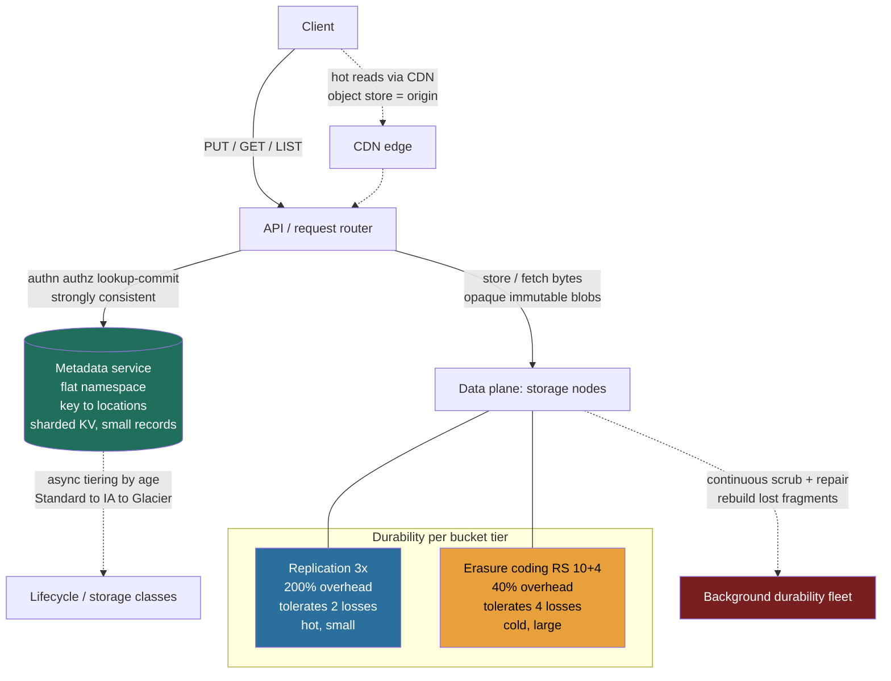

> Lessons 2.4 (replication) and 2.5 (partitioning) gave you the primitives; Lesson 3.4 (Key-Value Store) and 3.5 (CDN) showed two stores built from them. This lesson assembles them into the workhorse of every modern stack: the **object store**, the thing that holds your images, videos, backups, data-lake parquet, and ML training sets. The building-block insight is that an object store is **two systems wearing one API**: a small, strongly-consistent **metadata service** that maps names to locations, and a vast, dumb, append-only **data plane** that holds the bytes. Keep them separate and everything else, durability, scale, cost, follows. Conflate them and you've built a database that happens to store files, and it won't scale.

### Learning objectives
- Explain why an object store splits a **metadata/index plane** from a **data plane**, and what each plane optimizes for independently.
- Do the **durability math**: why **3× replication** (200% overhead) and **erasure coding** (≈40% overhead) reach the same nines, and when each is the right call.
- State the object-store **consistency model** precisely (S3's strong read-after-write since 2020) and why immutable, whole-object writes make that cheap.
- Reason about **multipart upload** for large objects, **namespace partitioning** by key prefix, and the **read/write path** end to end.
- Make the **hot / cold / archive tiering** decision a **cost** decision, and own the retrieval-latency and minimum-duration trade that comes with it.

### Intuition first
Think of a **massive valet parking garage** for a city. A customer hands over a car (an object) and gets back a **ticket** (the key). They do not get told "your car is on level 7, row F, space 23", they neither know nor care *where* it physically sits. Two completely different teams run this garage, and the entire design rests on keeping them separate:

- The **valet desk** (the **metadata service**) keeps a small, meticulously accurate ledger: *ticket #48217 → level 7, row F, space 23*. The ledger entry is tiny, a few hundred bytes, but it must be **perfectly correct and instantly consistent**: the moment you're handed a ticket, that car had better be retrievable. The desk is the namespace, the index, the source of truth for *where things are*.
- The **parking floors** (the **data plane**) are an enormous, mostly-dumb expanse of concrete. A floor doesn't reason about customers or tickets; it just holds cars in numbered spaces. You make it bigger by **pouring more concrete** (adding storage nodes), you don't make the valet desk bigger to store more cars.

This split is the whole game. The desk handles millions of *lookups* with a tiny data footprint; the floors handle petabytes of *bytes* with almost no logic. They scale on **different axes** and you size them independently, the desk for request rate, the floors for raw capacity. One more rule makes object stores cheap and simple: **you don't edit a parked car in place.** To change an object you drive in a whole new car and the ticket points at the new space; the old one is reclaimed later. Objects are **immutable, whole-object writes**, a constraint no database would accept, and exactly what lets the data plane be dumb, append-only, and trivially replicated.

Hold that image, metadata vs data plane, whole-object writes, durability bought with parity instead of copies, a 5 TB upload chopped into parts, cold data 23× cheaper, every one is a literal feature of that garage.

### Deep explanation

#### The defining decision: separate the metadata plane from the data plane
An object store exposes a dead-simple API, `PUT(bucket, key, bytes)`, `GET(bucket, key)`, `DELETE`, `LIST(prefix)`, and behind it runs **two independent subsystems**:

1. **Metadata / index service.** Maps the **flat namespace** (`bucket/key`) to a list of physical locations where the object's bytes (or its fragments) live, plus size, ETag/checksum, content-type, ACL, version ID, storage class, and timestamps. This is **small data, high request rate, must be strongly consistent.** It is itself a sharded, replicated key-value store (Lesson 3.4), Postgres/Spanner-class for the catalog, or a purpose-built KV.
2. **Data plane (storage nodes).** A fleet of machines with lots of cheap disks (HDDs for capacity, SSDs/NVMe for hot tiers) that store **opaque immutable blobs**. They speak a minimal "put this chunk / get this chunk" protocol and know nothing about buckets, keys, or users. You scale capacity by adding nodes.

**Why split at all, the rejected alternative.** The naive design is "just put the bytes *in* the database", a BLOB column in Postgres next to its metadata. **Rejected**, decisively: a relational DB is built for small rows, in-place updates, and transactions, paying B-tree, WAL, MVCC, and buffer-pool costs (Lesson 2.3) you do not need for a 4 GB immutable video. Multi-GB rows wreck the buffer pool, replication, and backup; you'd pay transactional-database dollars per GB for data written once and never updated. Conversely, putting *metadata* on the dumb storage nodes means every `LIST` or permission check scans the data plane. The split lets each side use the right tool: a **strongly-consistent small-record store** for the namespace, **dumb append-only capacity** for the bytes. Every real system carries this shape, **Azure Blob Storage** separates a **partition layer** (metadata/index) from a **stream layer** (append-only bytes), and Google's Colossus and Ceph follow the same pattern. The constant: a **small consistent control structure** governing where the **dumb byte capacity** puts things.

#### Partitioning the namespace: flat keys, prefix sharding, hot partitions
The namespace is **flat**, not a real tree: `2024/07/photos/cat.jpg` is a single opaque key string; the slashes are convention, not directories. You shard the metadata service by **key (prefix) range**, contiguous key ranges become partitions, each owned by a metadata node (range partitioning, Lesson 2.5).

This buys cheap `LIST prefix` (a range scan within a partition) but inherits range-partitioning's classic hazard: **sequential keys create a hot partition.** Keying objects by a monotonically increasing timestamp drives every write into the *last* partition, one node melts while the rest idle (the same hot-shard failure as a monotonic primary key in 2.5). Modern S3 **auto-partitions** under load and sustains **3,500 writes and 5,500 reads per second per prefix**, with **no limit on the number of prefixes**, so you scale throughput by *spreading keys across many prefixes* (10 prefixes ≈ 55,000 GET/s). The Director-level point: **request rate per prefix is the scaling unit**, and a bad key schema (everything under one hot prefix) is a self-inflicted bottleneck no storage hardware fixes.

#### Durability: replication vs erasure coding, and the storage-overhead math
This is the heart of an object store and the richest source of interview signal, because it's a clean **cost-vs-durability** optimization. The target is brutal: **S3 advertises 99.999999999%, eleven nines, of annual durability**, meaning if you store **10 million objects you expect to lose one once every ~10,000 years**. You hit it two ways.

**Option A, N-way replication.** Store **3 full copies** of every object on 3 independent failure domains (different racks, ideally different availability zones). Survives the loss of **any 2** copies. Simple, fast to read (any copy serves), fast to repair (copy from a survivor). The cost is the killer: **3 copies = 3× raw storage = 200% overhead.** To store 1 PB of data you buy 3 PB of disk. At petabyte/exabyte scale that 2× tax is enormous, it's the line item that makes replication unviable for cold bulk data.

**Option B, erasure coding (Reed-Solomon).** Split each object into **k data fragments**, compute **m parity fragments**, and store all **k + m** on different failure domains. Any **k** of the **k + m** fragments reconstruct the object, so you tolerate the loss of **any m** fragments. The canonical config, used by **Facebook's f4** BLOB store, is **10 data + 4 parity = 14 fragments (RS(10,4))**:

- **Overhead:** you store 14 fragments for 10 fragments' worth of data → **14/10 = 1.4× = 40% overhead.** Versus replication's 200%.
- **Fault tolerance:** survives **any 4** simultaneous fragment losses, *more* than 3× replication's 2.
- **The trade you're buying:** **40% overhead tolerating 4 failures** instead of **200% overhead tolerating 2.** Erasure coding is strictly better on the storage-cost-per-nine axis, which is why every large object store uses it for the bulk of data.

So why not erasure-code *everything*? Because EC's costs are **CPU and repair I/O**, not storage:

- **Reconstruction is expensive.** A replicated read is a single copy fetch. An EC read of a *lost* fragment must fetch **k surviving fragments from k different nodes** and run the Reed-Solomon math to rebuild it, `k`× the network and a CPU cost. With k=10, repairing one dead disk reads 10 fragments per object across the cluster: a real, sustained background load.
- **Small objects fare poorly.** Splitting a 4 KB object into 14 fragments is wasteful (per-fragment overhead dominates) and multiplies metadata. EC shines on **large objects** (MB-GB), where the math amortizes.
- **The repair-cost fix, local reconstruction.** At huge scale, repair I/O itself becomes the pain; **Azure's Local Reconstruction Codes (LRC)** add *local* parity groups so a single-fragment repair reads only its local group instead of all k fragments, at ≈1.33× overhead, slightly different math to make the common case (one dead disk) cheap to repair.

**The Director framing:** durability scheme is a **per-tier cost decision**, not a global one. Hot, small, latency-sensitive objects → **replication** (cheap reads, cheap repair, accept the 3× storage). Bulk, large, cold objects → **erasure coding** (accept reconstruction cost to kill the 2× storage tax). You can even **tier the durability scheme itself**, f4 exists precisely because Facebook's photos went warm/cold and 3.6× replication on exabytes was indefensible; they moved cold blobs to RS(10,4) and cut effective replication toward ~2.1× (including cross-datacenter XOR). Quantifying that overhead swing, "200% vs 40% on 500 PB is 800 PB of disk", *is* the Director answer.

Go deeper, vendor internals: CRUSH placement, LRC math, S3's consistency history (IC depth, optional)

- **Ceph/RADOS** is the instructive outlier on the plane split: it keeps cluster *membership* in a small consistent map but **computes** each object's placement algorithmically via **CRUSH** (a hash of the key over the cluster map) rather than storing a per-object location in a metadata service, trading a central index lookup for deterministic, lookup-free placement. **Google Colossus** (the GFS successor) separates metadata **curators** from **D** chunk servers.
- **Azure LRC (12, 2, 2):** 12 data fragments, 2 *local* parities, 2 *global* parities. A single-fragment repair reads only its **local group (≈6 fragments)** instead of all 12, cutting repair I/O, while overhead stays **≈1.33×** and the code still tolerates ≥3 losses depending on which fragments fail.
- **S3 pre-2020 consistency:** S3 originally gave read-after-write for *new* objects but only **eventual** consistency for **overwrites, deletes, and listings**, which forced workarounds (EMRFS consistent view, S3Guard) in data-lake pipelines. The December 2020 change made all operations strongly consistent at no extra cost.

#### The consistency model: and why immutability makes it cheap
Modern object stores give **strong read-after-write consistency**: after a successful `PUT` returns, every subsequent `GET` (and `LIST`) sees the new object or version, no stale window. **S3 has been strongly consistent for all operations since December 2020**, calling it "eventually consistent" has been wrong for years, and interviewers notice.

**Why is strong consistency affordable here when it's so costly for a general database?** Because **objects are immutable, whole-object writes.** No partial updates, no read-modify-write, no multi-key transactions. A write is atomic at the object level: the data plane stores the new blob's fragments, and the **commit is a single metadata flip**, the index entry for `bucket/key` atomically points at the new version. Because the *only* thing that needs to be consistent is the **small metadata pointer**, you get strong consistency from the metadata store's own consistency (a quorum write on a tiny record, Lesson 2.8) without paying it across petabytes of bytes, versus a relational DB, where it must hold across in-place mutations, indexes, and transactions. **Immutability is the simplification that buys cheap strong consistency**, that's the causal chain to state out loud.

(Note the boundary: object stores deliberately **do not** offer cross-object transactions, conditional/compare-and-swap on content, or rename-as-atomic-move. A "rename" is copy-then-delete. If you need transactional semantics over many objects, that's a database's job, not the blob store's, knowing what it *won't* do is as important as what it will.)

#### Multipart upload: large objects without all-or-nothing risk
A 5 TB video as a single `PUT` over one TCP connection is a disaster: one blip at 4.9 TB and you restart from zero; you can't parallelize; you're hostage to a single connection's throughput; and the request would run for hours. The fix is **multipart upload**, chop the object into independent parts:

1. **Initiate**, `CreateMultipartUpload` returns an `uploadId`.
2. **Upload parts in parallel**, each part is **5 MiB-5 GiB**, up to **10,000 parts** per object, giving the **5 TiB** max object size. Each part is its own request with its own checksum/`ETag`, parts upload concurrently across many connections, and a **failed part is retried independently**, you re-send one 64 MB part, not the whole object.
3. **Complete**, `CompleteMultipartUpload` sends the ordered list of part numbers + ETags; the store **assembles** them into one logical object and the metadata commit makes it visible. (Until completion, the parts aren't a gettable object.)

The wins are exactly the ones a Director cares about: **parallel throughput** (saturate the network with N connections), **resumability** (retry one part, not 5 TB), and **independent failure** of parts. The operational catch, and a real cost trap, is that **incomplete multipart uploads leave orphaned parts that you keep paying to store**; the standard hygiene is a **lifecycle rule to abort and garbage-collect incomplete uploads after, say, 7 days.** (For comparison, a single `PUT` maxes at **5 GiB**, which is why anything above that *must* be multipart.)

#### Lifecycle and tiering: turning storage into a cost dial
Most data is **cold**: written, accessed heavily for days, then rarely touched but legally or operationally required for years (logs, backups, compliance archives, old media). Paying hot-storage prices for cold data is pure waste, so object stores expose a **storage-class ladder**, and **lifecycle policies** move objects down it automatically by age. The S3 ladder, with **us-east-1 list prices per GB-month** (the numbers that make this a real decision):

| Class | $/GB-month | Retrieval latency | Use for |
|---|---|---|---|
| **S3 Standard** (hot) | **$0.023** | milliseconds | actively served, frequent access |
| **Standard-IA** (warm) | **$0.0125** | milliseconds | infrequent but needs instant access |
| **Glacier Instant Retrieval** | **$0.004** | milliseconds | rarely accessed, still instant |
| **Glacier Flexible Retrieval** | **$0.0036** | minutes-12 hours | archives, occasional restore |
| **Glacier Deep Archive** | **$0.00099** | up to 12 hours | long-term compliance, "write once, hope never read" |

Top to bottom is a **~23× price drop** ($0.023 → $0.00099). But cheaper storage is *not free*, you pay for it three ways, and naming them is the signal:

- **Retrieval latency.** Glacier Deep Archive can take **up to 12 hours** to make an object readable. Fine for a compliance archive, fatal for anything user-facing.
- **Retrieval cost + minimum durations.** The archive tiers charge a **per-GB retrieval fee** and impose **minimum storage durations** (Glacier tiers bill a **90-day minimum**, Deep Archive **180-day minimum**). Cycle data in and out, or delete it early, and the early-deletion and retrieval fees can **exceed** what you saved, tiering an object you'll re-read next week is a *net loss*.
- **Transition cost.** Lifecycle transitions themselves cost a small per-object fee, so moving billions of tiny objects can cost more than leaving them.

**S3 Intelligent-Tiering** automates the call, it monitors access and moves objects between tiers for a small per-object monitoring fee, which is the right default when access patterns are unknown. The Director framing: tiering is a **TCO optimization with a latency and minimum-duration cost**; you tier on a *confident* prediction that data is going cold, never reflexively. "Move it to Glacier to save money" without naming retrieval latency, retrieval fees, and minimum-duration penalties is the junior answer.

#### The read and write paths, end to end
Pulling it together, the **write path** for a large object:

1. Client calls `CreateMultipartUpload`; the **metadata service** authenticates, checks the bucket policy/ACL, creates an upload record, returns `uploadId`.
2. Client uploads parts **in parallel** to **data nodes**. For each part the store writes the bytes durably per the bucket's durability scheme, **replicate to 3 nodes** (hot) or **erasure-code into k+m fragments** across failure domains, and returns the part `ETag`.
3. Client calls `CompleteMultipartUpload`. The store assembles the parts and performs the **atomic metadata commit**: the index entry for `bucket/key` now points at this object/version. *Only now* is the object visible, which is what makes the strong-consistency guarantee true.

The **read path**:

1. `GET(bucket, key)` hits the **metadata service**: authenticate, authorize, look up the current version's fragment/replica **locations** and storage class.
2. If archived (Glacier Flexible/Deep), the object isn't instantly readable, return/initiate a **restore** (minutes-hours); otherwise proceed.
3. Fetch the bytes from the **data plane**, read **one replica** (replicated) or **k fragments and reconstruct** (erasure-coded, reconstructing on the fly if a fragment is missing), verify checksums, stream to the client.
4. For hot, frequently-read objects, a **CDN sits in front** (Lesson 3.5): the object store is the **origin**, the CDN serves the cache hit, and a high hit ratio offloads both request rate *and* egress from the store. This is the standard media-serving topology and a major cost lever (object-store egress is expensive; CDN offload cuts it).

Meanwhile a **background fleet** continuously runs **scrubbing** (verify checksums, detect bit rot and failed disks) and **repair** (rebuild lost replicas/fragments). This background work is the *real* cost of eleven nines: durability isn't a static property, it's a **continuous repair process you capacity-plan and monitor**, the same operational framing as LSM compaction in 2.3.

### Diagram: metadata plane, data plane, and the two paths

### Worked example: the storage backend for a photo/video service (think Instagram-scale media)
Requirement (the R/E of RESHADED): **500 PB and growing** of user photos and videos; uploads up to **a few GB** (video); reads are **heavily skewed to recent content** (the last few days get most traffic, the long tail is rarely touched); must serve hot reads globally at low latency; storage cost must be defensible to finance. Design the object-store layer:

- **Plane split.** Metadata (key, size, owner, ACL, version, storage class, fragment locations) in a **sharded, strongly-consistent KV** keyed by `bucket/key`; the actual media bytes on a **dumb HDD-heavy data plane**. Capacity scales by adding storage nodes; request rate scales by spreading keys across prefixes. *Rejected:* media-as-BLOB-in-Postgres, multi-GB rows would destroy the DB's buffer pool, replication, and backups, at transactional-DB cost per GB.
- **Durability tiering, the core cost call.** **Hot (recent) media:** **3× replication**, reads are frequent and latency-sensitive, repair must be instant, and the hot set is comparatively small, so the 200% overhead is worth it. **Cold (aged-out) media:** transition to **erasure coding RS(10,4)**, **40% overhead instead of 200%**. On 500 PB of cold data that's **~700 PB** (1.4×) of disk versus **~1,500 PB** (3×), *roughly 800 PB of hardware avoided*; EC's reconstruction cost is acceptable because cold objects are rarely read (precisely the f4 motivation). *Rejected:* 3× everything (indefensible cost at exabyte scale); EC everything (loads the hot path with reconstruction CPU/IO and hurts small-object and tail-read latency).
- **Large uploads.** A 3 GB video uses **multipart upload**, parts in parallel (resumable, independent retries), and a **lifecycle rule aborts incomplete uploads after 7 days** so failed uploads don't accumulate as paid-for orphaned parts.
- **Consistency.** Whole-object immutable writes give **strong read-after-write** essentially for free (a single atomic metadata commit per object/version); no read-modify-write means no conflict machinery. Editing a photo writes a **new object/version**; the old version is reclaimed by lifecycle.
- **Serving.** A **CDN fronts the object store** (origin) for hot reads, a high cache-hit ratio offloads request rate *and* egress from the store, the dominant cost lever for media at this scale (Lesson 3.5).
- **Lifecycle.** Recent → Standard; aged → Standard-IA/Glacier Instant for the long tail that must stay instantly viewable; truly dormant/compliance copies → Glacier Flexible/Deep Archive, *accepting* minutes-to-hours retrieval and 90/180-day minimums. The decision falls straight out of the **read-skew** established in the R step, which is why you nail down the access distribution before choosing tiers.

### Trade-offs table: durability scheme
| Scheme | Storage overhead | Failures tolerated | Read cost | Repair cost | Use when… |
|---|---|---|---|---|---|
| **3× replication** | **200%** (3× raw) | any **2** | cheapest (read 1 copy) | cheap (copy a survivor) | **Hot, small, latency-sensitive**; repair must be instant |
| **Erasure coding RS(10,4)** | **40%** (1.4×) | any **4** | higher (read k=10, may reconstruct) | expensive (read k fragments, RS math) | **Cold, large, bulk**; storage cost dominates |
| **LRC (12,2,2)** | **≈33%** (1.33×) | depends on group (≥3) | medium | **cheap single-fragment repair** (local group) | Cold/warm at huge scale where **repair I/O** is the pain (Azure) |

### What interviewers probe here
- **"Why not just store the files in your database?"**, *Strong:* the plane split, small strongly-consistent metadata vs dumb append-only byte capacity; a relational DB pays B-tree/WAL/MVCC/buffer-pool costs and transactional-$/GB it doesn't need for immutable multi-GB blobs, and large BLOBs wreck replication/backup. *Red flag:* "store it as a BLOB column" with no awareness of the cost or scaling break.
- **"How do you get eleven nines, and what does it cost?"**, *Strong:* quantifies **3× replication = 200% overhead, tolerates 2** vs **EC RS(10,4) = 40% overhead, tolerates 4**, picks per-tier, and names the **continuous scrub+repair** fleet as the real cost. *Red flag:* "store three copies" with no overhead math, or thinks durability is static rather than a repair process.
- **"What's the consistency model, and why is it cheap here?"**, *Strong:* **strong read-after-write for all ops since 2020**, cheap *because* objects are immutable whole-object writes committed by a single atomic metadata flip, no read-modify-write to make consistent. *Red flag:* "S3 is eventually consistent" (wrong for years), or claims strong consistency with no explanation of why it's affordable.
- **"How would you upload a 5 TB object reliably?"**, *Strong:* **multipart**, 5 MiB-5 GiB parts, up to 10,000, parallel, independent retries, atomic complete; plus a lifecycle rule to abort orphaned incomplete uploads. *Red flag:* one giant PUT, or unaware of the 5 GiB single-PUT ceiling.
- **"This data goes cold, what do you do, and what does it cost you?"**, *Strong:* lifecycle to IA/Glacier (names the ~23× price drop) **while naming the costs**: retrieval latency (up to 12 h), per-GB retrieval fees, and 90/180-day minimums that can make early tiering a net loss. *Red flag:* "move it to Glacier to save money" with no retrieval-latency / minimum-duration awareness, the classic junior cost mistake.

### Common mistakes / misconceptions
- **Storing bytes in the database** instead of splitting a metadata plane from a dumb data plane, it doesn't scale and you pay transactional-$/GB for immutable files.
- **Quoting durability without the overhead math, or erasure-coding everything**, "three copies" is not an answer (200% vs 40% and failures-tolerated is); and EC's reconstruction cost makes replication right for hot/small data. Tier the scheme.
- **Calling S3 eventually consistent**, it's been **strongly** consistent for all operations since December 2020.
- **A monotonic/sequential key schema** that funnels writes into one hot prefix, spread keys across prefixes (per-prefix rate is the scaling unit).
- **Tiering reflexively to "save money"**, ignoring retrieval latency, per-GB retrieval fees, and 90/180-day minimums that can exceed the savings, and forgetting to lifecycle-abort incomplete multipart uploads (orphaned parts you keep paying for).

### Practice questions
**Q1.** You're storing 1 PB of cold backups and need eleven nines of durability at minimum cost. Replication or erasure coding, and what does each cost you?
> *Model:* **Erasure coding** (e.g. RS(10,4), 10 data + 4 parity). Storage overhead is **40%**, so 1 PB of data needs **~1.4 PB** of disk and tolerates **any 4** fragment losses. **3× replication** would need **3 PB** (200% overhead) to tolerate only **2** losses, for cold bulk data that 2× extra storage tax is indefensible. The cost I accept with EC is **reconstruction**: a degraded read fetches **k=10 fragments** across nodes and runs Reed-Solomon math (CPU + repair I/O), and small objects fare poorly, both fine here because backups are large and rarely read. If single-disk **repair I/O** became the pain at huge scale, I'd consider **LRC** (Azure-style, ≈1.33× overhead) to make single-fragment repair read only a local group. The decision is a clean storage-cost-per-nine optimization, and on a petabyte it's a real hardware line item.

**Q2.** A teammate says "let's store the uploaded videos as a BLOB column in Postgres so metadata and data stay together and transactional." Talk them out of it.
> *Model:* Multi-GB immutable videos are the **wrong shape** for a relational engine. Postgres pays B-tree, WAL, and buffer-pool costs (2.3) that buy nothing for write-once blobs, and large BLOBs **destroy the buffer pool, replication, and backups** while costing **transactional-database dollars per GB**. The right design **splits the planes**: small, hot, strongly-consistent **metadata** in a sharded KV/Postgres catalog; bytes on a **dumb, append-only data plane** scaled by capacity. "Transactional together" is a non-requirement, objects are immutable whole-object writes, so a single atomic **metadata commit** already gives strong read-after-write consistency. We lose nothing real and gain independent scaling and 10×+ lower $/GB.

**Q3.** Explain S3's consistency model and why it can offer it cheaply when a general database can't.
> *Model:* S3 is **strongly read-after-write consistent for all operations since December 2020**. It's cheap *because objects are immutable, whole-object writes*: there's no partial update, read-modify-write, or multi-key transaction to make consistent. A write durably stores the new blob, then **flips a single metadata pointer** atomically; the only thing requiring consistency is that **tiny pointer**, which the metadata store handles with a quorum/consensus write on a small record (2.8). A relational DB must hold strong consistency across **in-place mutations, indexes, and transactions**, far more expensive. **Immutability is the simplification that buys cheap strong consistency.** The boundary: S3 deliberately offers no cross-object transactions, conditional content updates, or atomic rename, those stay a database's job.

**Q4.** Walk me through reliably uploading a 4 GB file, and the operational gotcha.
> *Model:* Use **multipart upload**: `CreateMultipartUpload` → upload **parts in parallel** (5 MiB min, 5 GiB max, up to 10,000 parts → 5 TiB max object), each with its own checksum/ETag and **retried independently** → `CompleteMultipartUpload` assembles them and the **atomic metadata commit** makes the object visible. This gives **parallel throughput** (saturate the link with N connections), **resumability** (re-send one part, not 4 GB on a blip), and independent part failure. A single `PUT` tops out at **5 GiB**, so anything larger *must* be multipart anyway. The **gotcha**: a failed/abandoned upload leaves **orphaned parts you keep paying to store**, so I add a **lifecycle rule to abort incomplete multipart uploads after ~7 days**. Skipping that is a silent, growing storage bill.

**Q5.** Your media bill is dominated by storage and egress. What levers do you pull, and what's the cost of each?
> *Model:* Two levers. **(1) Tier cold data.** Most reads are skewed to recent content, so lifecycle the long tail down the ladder, Standard → Standard-IA → Glacier, for up to a **~23× per-GB drop** ($0.023 → $0.00099). But I **name the costs**: archive tiers add **retrieval latency** (up to 12 h for Deep Archive), **per-GB retrieval fees**, and **90/180-day minimum durations**, so I only tier on a confident "this is going cold" prediction; tiering data I'll re-read next week is a net loss, and I'd use **Intelligent-Tiering** where the pattern is unknown. Also switch the cold tier from 3× replication to **erasure coding** to cut storage overhead from 200% to 40%. **(2) Front it with a CDN.** Object-store **egress is expensive**; putting a CDN in front (store = origin) with a high cache-hit ratio offloads both request rate and egress (3.5). The cost is CDN spend + invalidation complexity, but for skewed media reads the hit ratio makes it a clear win. Both levers tie straight back to the **read-skew** I established in requirements.

### Key takeaways
- An object store is **two systems**: a small, strongly-consistent **metadata/index plane** (name → location, the namespace) and a vast, dumb, append-only **data plane** (the bytes). They scale on different axes, never put the bytes in your database.
- **Durability is a cost optimization.** **3× replication = 200% overhead, tolerates 2 failures**; **erasure coding RS(10,4) = 40% overhead, tolerates 4**, EC wins on cost-per-nine for cold/large data; replication wins on read/repair cost for hot/small. Tier the scheme; quantify the overhead swing.
- **Strong read-after-write consistency** (S3, all ops, since 2020) is **cheap *because* objects are immutable whole-object writes** committed by a single atomic metadata flip, there's no read-modify-write to make consistent.
- **Multipart upload** (5 MiB-5 GiB parts, ≤10,000, → 5 TiB objects) makes large uploads parallel, resumable, and independently retryable, and you must lifecycle-abort orphaned incomplete uploads.
- **Tiering is TCO with a latency price**: ~23× cheaper from hot to archive, but you pay in retrieval latency (up to 12 h), retrieval fees, and 90/180-day minimums, tier only on a confident cold-data prediction; durability is a **continuous scrub+repair** process you capacity-plan.

> **Spaced-repetition recap:** Valet garage, a small, perfectly-consistent **valet desk** (metadata: name → location) over a dumb expanse of **concrete** (data plane: immutable bytes), scaled on different axes. Durability is **cost math**: 3× replication (200% overhead, tolerates 2) vs erasure coding RS(10,4) (40%, tolerates 4), tier the scheme by hot/cold. Immutable whole-object writes buy **strong read-after-write** cheaply (one atomic metadata flip). Big files go **multipart**; cold data tiers down ~23× but pays in retrieval latency and minimums; eleven nines is a **continuous repair** process.
